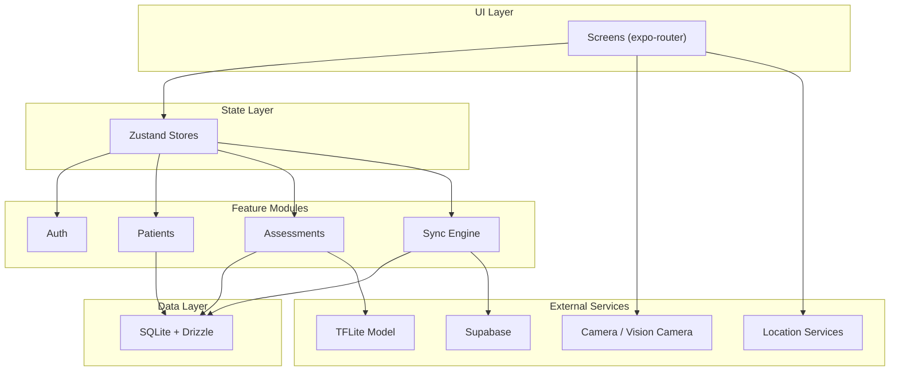
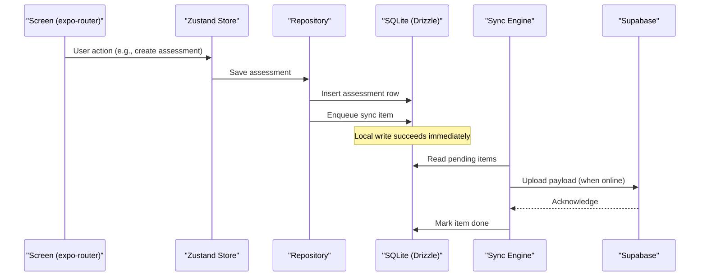
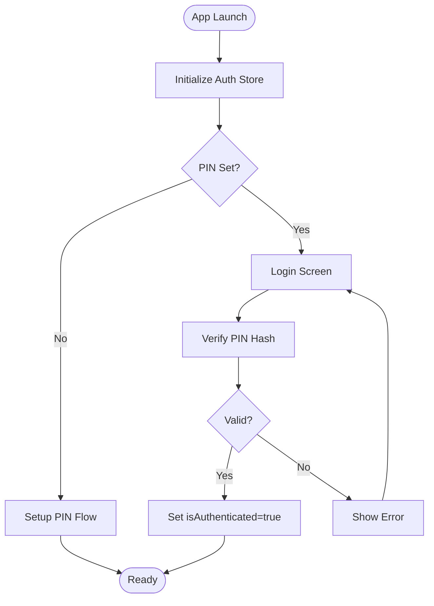
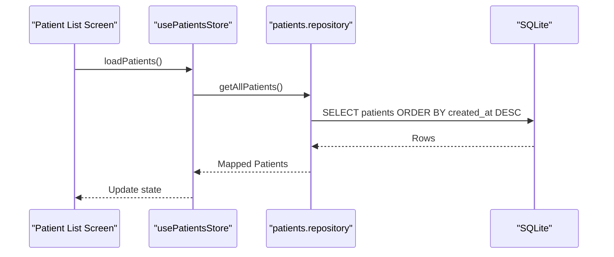
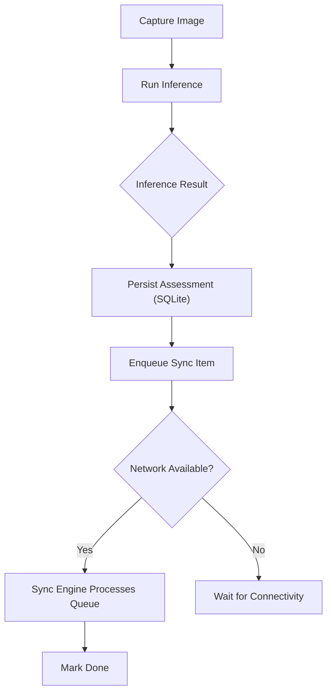
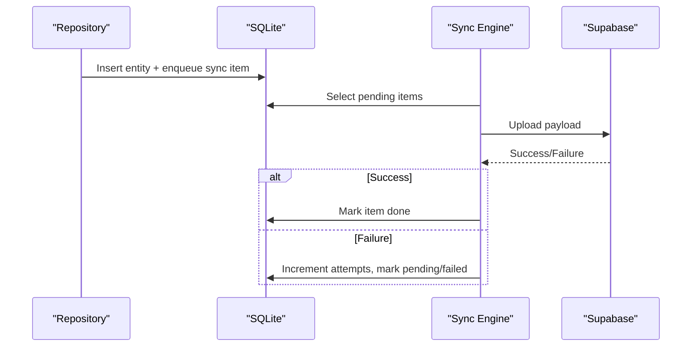
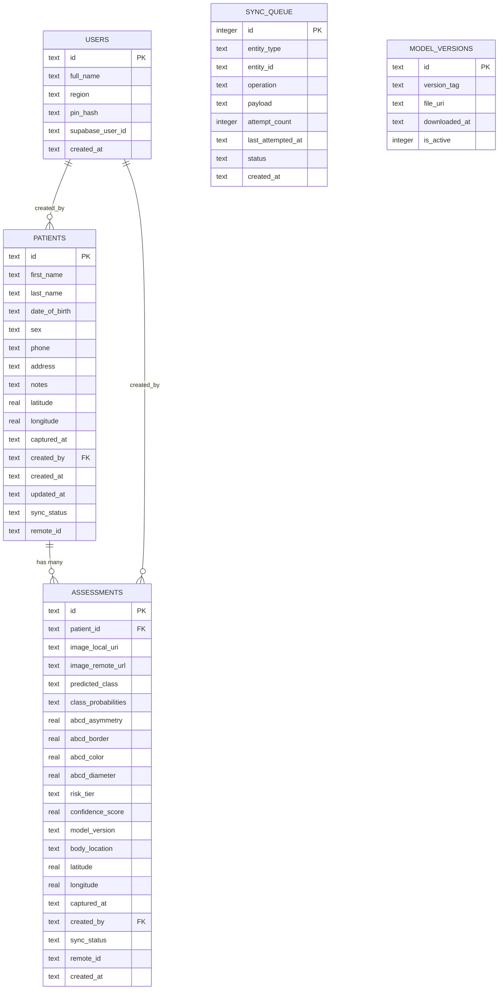
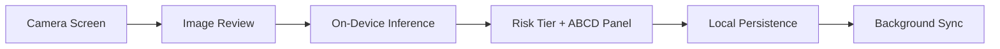
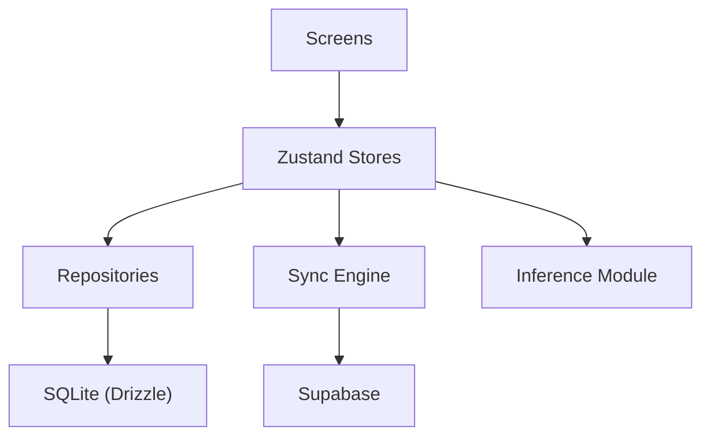

# Architecture Overview

<cite>
**Referenced Files in This Document**
- [ARCHITECTURE.md](file://ARCHITECTURE.md)
- [schema.ts](file://src/db/schema.ts)
- [client.ts](file://src/db/client.ts)
- [supabase.ts](file://src/lib/supabase.ts)
- [store.ts (auth)](file://src/features/auth/store.ts)
- [pin.ts](file://src/features/auth/pin.ts)
- [secureStorage.ts](file://src/lib/secureStorage.ts)
- [store.ts (patients)](file://src/features/patients/store.ts)
- [repository.ts (patients)](file://src/features/patients/repository.ts)
- [store.ts (assessments)](file://src/features/assessments/store.ts)
- [repository.ts (assessments)](file://src/features/assessments/repository.ts)
- [classify.ts](file://src/features/assessments/inference/classify.ts)
- [syncEngine.ts](file://src/features/sync/syncEngine.ts)
- [index.tsx (splash)](file://src/app/index.tsx)
- [login.tsx](file://src/app/(auth)/login.tsx)
- [capture.tsx](file://src/app/(app)/patients/[patientId]/capture.tsx)
</cite>

## Table of Contents
1. Introduction
2. Project Structure
3. Core Components
4. Architecture Overview
5. Detailed Component Analysis
6. Dependency Analysis
7. Performance Considerations
8. Troubleshooting Guide
9. Conclusion

## Introduction
DermSight is an offline-first mobile application for community health workers to screen skin lesions on-device and later synchronize results to a central medical database. The app follows a feature-based architecture with clear separation across authentication, patient management, assessments, and synchronization modules. Local SQLite via Drizzle ORM is the single source of truth; background sync pushes changes to Supabase when connectivity is available. State is managed with Zustand stores, and data access is abstracted through repositories. External integrations include camera capture, location services, and on-device machine learning inference using a quantized TFLite model. Security relies on PIN-based local authentication and secure storage for sensitive values.

## Project Structure
The codebase is organized by features and layers:
- UI screens under app/ use expo-router file-based routing.
- Feature modules under src/features/ encapsulate domain logic (auth, patients, assessments, sync).
- Data persistence lives in src/db/ (Drizzle schema and client).
- Integrations are isolated in src/lib/ (Supabase, secure storage, networking, location).
- ML assets and utilities live under src/ml/ and src/utils/.

**Diagram sources**
- [ARCHITECTURE.md:40-75](file://ARCHITECTURE.md#L40-L75)
- [client.ts:1-14](file://src/db/client.ts#L1-L14)
- [supabase.ts:1-19](file://src/lib/supabase.ts#L1-L19)

**Section sources**
- [ARCHITECTURE.md:18-36](file://ARCHITECTURE.md#L18-L36)
- [ARCHITECTURE.md:209-351](file://ARCHITECTURE.md#L209-L351)

## Core Components
- Authentication: PIN setup and login flow backed by secure storage and local PIN hashing.
- Patient Management: CRUD operations over local SQLite with search and filtering.
- Assessments: On-device inference pipeline producing diagnosis probabilities, ABCD scores, and risk tiers; persisted locally and queued for sync.
- Synchronization: Outbox pattern with retry/backoff to push pending records to Supabase when online.
- Database: Drizzle schema and initialization for users, patients, assessments, sync queue, and model versions.
- Integrations: Camera capture UI, location capture, and TFLite inference module.

**Section sources**
- [store.ts (auth):1-122](file://src/features/auth/store.ts#L1-L122)
- [pin.ts:1-73](file://src/features/auth/pin.ts#L1-L73)
- [secureStorage.ts:1-78](file://src/lib/secureStorage.ts#L1-L78)
- [repository.ts (patients):1-128](file://src/features/patients/repository.ts#L1-L128)
- [store.ts (patients):1-68](file://src/features/patients/store.ts#L1-L68)
- [repository.ts (assessments):1-150](file://src/features/assessments/repository.ts#L1-L150)
- [store.ts (assessments):1-82](file://src/features/assessments/store.ts#L1-L82)
- [classify.ts:1-62](file://src/features/assessments/inference/classify.ts#L1-L62)
- [syncEngine.ts:1-145](file://src/features/sync/syncEngine.ts#L1-L145)
- [schema.ts:1-102](file://src/db/schema.ts#L1-L102)
- [client.ts:1-104](file://src/db/client.ts#L1-L104)

## Architecture Overview
High-level design emphasizes offline-first operation with local SQLite as the single source of truth. Screens interact with Zustand stores that call feature repositories to read/write data. The sync engine runs in the background, processing a queue of pending operations to Supabase. ML inference runs on-device using a quantized TFLite model, returning clinically interpretable outputs (diagnosis probabilities and ABCD scores) that map to actionable triage tiers.

**Diagram sources**
- [repository.ts (assessments):53-123](file://src/features/assessments/repository.ts#L53-L123)
- [syncEngine.ts:55-110](file://src/features/sync/syncEngine.ts#L55-L110)
- [supabase.ts:1-19](file://src/lib/supabase.ts#L1-L19)

**Section sources**
- [ARCHITECTURE.md:40-75](file://ARCHITECTURE.md#L40-L75)
- [ARCHITECTURE.md:404-413](file://ARCHITECTURE.md#L404-L413)

## Detailed Component Analysis

### Authentication Module
- PIN Setup and Login: Securely stores PIN hash and user identity in secure storage. The store initializes session state and validates PINs locally without network calls.
- Security: PIN hashing uses a per-device salt stored securely; tokens and identifiers never touch SQLite.

**Diagram sources**
- [store.ts (auth):22-122](file://src/features/auth/store.ts#L22-L122)
- [pin.ts:1-73](file://src/features/auth/pin.ts#L1-L73)
- [secureStorage.ts:1-78](file://src/lib/secureStorage.ts#L1-L78)
- [login.tsx:14-46](file://src/app/(auth)/login.tsx#L14-L46)

**Section sources**
- [store.ts (auth):1-122](file://src/features/auth/store.ts#L1-L122)
- [pin.ts:1-73](file://src/features/auth/pin.ts#L1-L73)
- [secureStorage.ts:1-78](file://src/lib/secureStorage.ts#L1-L78)
- [login.tsx:1-185](file://src/app/(auth)/login.tsx#L1-L185)

### Patient Management Module
- Repository: Provides CRUD and search over patients, always writing to local SQLite and enqueuing sync operations.
- Store: Manages list state, active patient, filters, and search queries; delegates to repository for data operations.

**Diagram sources**
- [store.ts (patients):26-68](file://src/features/patients/store.ts#L26-L68)
- [repository.ts (patients):13-37](file://src/features/patients/repository.ts#L13-L37)

**Section sources**
- [store.ts (patients):1-68](file://src/features/patients/store.ts#L1-L68)
- [repository.ts (patients):1-128](file://src/features/patients/repository.ts#L1-L128)

### Assessments Module
- Inference: Placeholder inference returns realistic mock results including class probabilities, ABCD scores, and mapped risk tier. Replaceable with real TFLite inference.
- Repository: Persists assessments locally and enqueues sync items.
- Store: Loads assessments by patient or globally, tracks counts, and persists new assessments.

**Diagram sources**
- [classify.ts:14-53](file://src/features/assessments/inference/classify.ts#L14-L53)
- [repository.ts (assessments):53-123](file://src/features/assessments/repository.ts#L53-L123)
- [syncEngine.ts:55-110](file://src/features/sync/syncEngine.ts#L55-L110)

**Section sources**
- [store.ts (assessments):1-82](file://src/features/assessments/store.ts#L1-L82)
- [repository.ts (assessments):1-150](file://src/features/assessments/repository.ts#L1-L150)
- [classify.ts:1-62](file://src/features/assessments/inference/classify.ts#L1-L62)

### Synchronization Module
- Outbox Pattern: Every local write inserts a sync_queue entry. Background tasks and NetInfo listeners trigger runSync to process pending items with exponential backoff and retries.
- Conflict Handling: MVP uses server-authoritative pull and client-wins push semantics.

**Diagram sources**
- [repository.ts (patients):44-102](file://src/features/patients/repository.ts#L44-L102)
- [repository.ts (assessments):53-123](file://src/features/assessments/repository.ts#L53-L123)
- [syncEngine.ts:55-110](file://src/features/sync/syncEngine.ts#L55-L110)

**Section sources**
- [syncEngine.ts:1-145](file://src/features/sync/syncEngine.ts#L1-L145)
- [ARCHITECTURE.md:404-413](file://ARCHITECTURE.md#L404-L413)

### Database Layer
- Schema: Defines tables for users, patients, assessments, sync_queue, and model_versions with appropriate constraints and enums.
- Client: Initializes expo-sqlite and Drizzle instance; creates tables at startup.

**Diagram sources**
- [schema.ts:9-102](file://src/db/schema.ts#L9-L102)

**Section sources**
- [schema.ts:1-102](file://src/db/schema.ts#L1-L102)
- [client.ts:1-104](file://src/db/client.ts#L1-L104)

### Integration Points
- Camera: Capture screen provides guided framing and tips; placeholder integration ready for vision-camera frame processing.
- Location: Optional geo-tagging for patient and assessment records via location services.
- ML Inference: On-device TFLite model produces diagnosis probabilities and ABCD scores; mapping to risk tiers is configurable and separate from inference.

**Diagram sources**
- [capture.tsx:10-23](file://src/app/(app)/patients/[patientId]/capture.tsx#L10-L23)
- [classify.ts:14-53](file://src/features/assessments/inference/classify.ts#L14-L53)
- [repository.ts (assessments):53-123](file://src/features/assessments/repository.ts#L53-L123)

**Section sources**
- [capture.tsx:1-131](file://src/app/(app)/patients/[patientId]/capture.tsx#L1-L131)
- [classify.ts:1-62](file://src/features/assessments/inference/classify.ts#L1-L62)

## Dependency Analysis
- UI depends on Zustand stores for state and navigation.
- Stores depend on feature repositories for data access.
- Repositories depend on Drizzle client and schema for SQLite operations.
- Sync engine depends on network status and Supabase client for remote operations.
- ML inference depends on TFLite runtime and labels/mapping constants.

**Diagram sources**
- [store.ts (patients):26-68](file://src/features/patients/store.ts#L26-L68)
- [store.ts (assessments):29-82](file://src/features/assessments/store.ts#L29-L82)
- [repository.ts (patients):1-128](file://src/features/patients/repository.ts#L1-L128)
- [repository.ts (assessments):1-150](file://src/features/assessments/repository.ts#L1-L150)
- [syncEngine.ts:1-145](file://src/features/sync/syncEngine.ts#L1-L145)
- [supabase.ts:1-19](file://src/lib/supabase.ts#L1-L19)

**Section sources**
- [ARCHITECTURE.md:40-75](file://ARCHITECTURE.md#L40-L75)

## Performance Considerations
- Offline-first writes ensure UI responsiveness; all reads come from local SQLite.
- Background sync avoids blocking user interactions; retry/backoff prevents network storms.
- Quantized TFLite model reduces memory footprint and inference latency.
- Storing full probability distributions and ABCD scores enables efficient re-analysis without re-running inference.

[No sources needed since this section provides general guidance]

## Troubleshooting Guide
- Authentication failures: Ensure PIN is set and stored securely; verify hash comparison logic and secure storage keys.
- Sync failures: Inspect sync queue for failed items; check network connectivity and Supabase credentials; review retry counts and backoff behavior.
- ML inference issues: Confirm model availability and correct preprocessing; replace mock inference with real TFLite execution when ready.

**Section sources**
- [store.ts (auth):51-78](file://src/features/auth/store.ts#L51-L78)
- [pin.ts:29-64](file://src/features/auth/pin.ts#L29-L64)
- [syncEngine.ts:55-110](file://src/features/sync/syncEngine.ts#L55-L110)
- [classify.ts:55-62](file://src/features/assessments/inference/classify.ts#L55-L62)

## Conclusion
DermSight’s architecture delivers a robust offline-first experience with clear separation of concerns across authentication, patient management, assessments, and synchronization. Local SQLite serves as the authoritative data store, while background sync ensures eventual consistency with Supabase. The feature-based layout, Zustand-driven state, and repository abstraction provide maintainability and testability. On-device ML inference offers explainable outputs that guide triage decisions, and security is enforced through PIN-based local authentication and secure storage. This design supports deployment in low-connectivity environments while preserving clinical interpretability and data integrity.