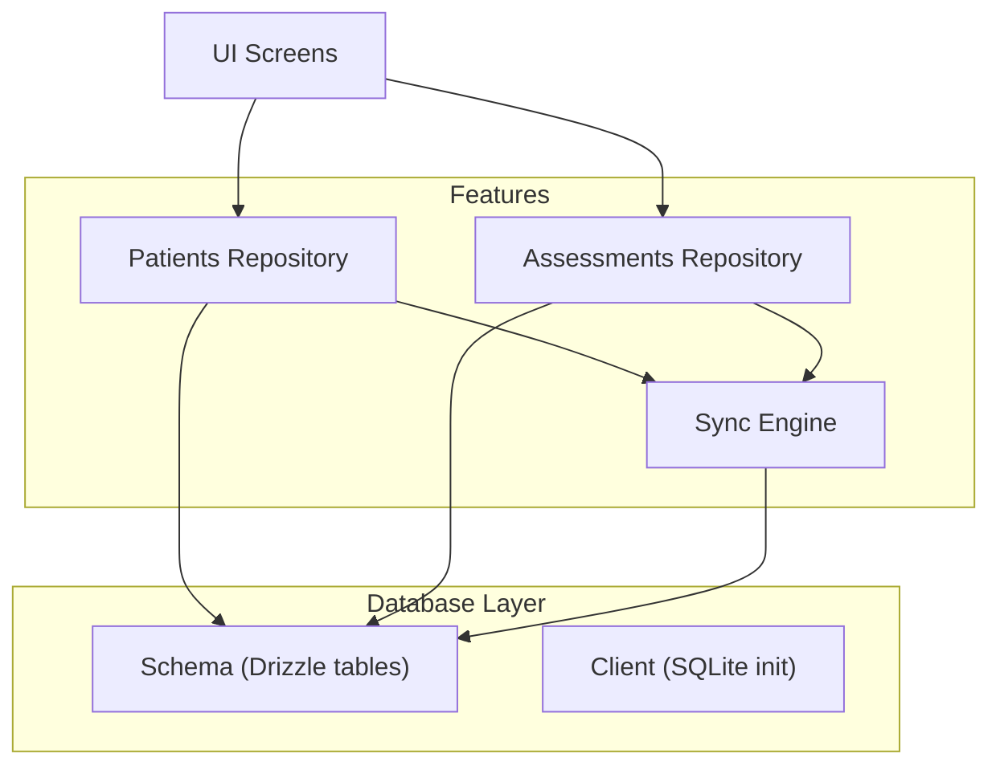
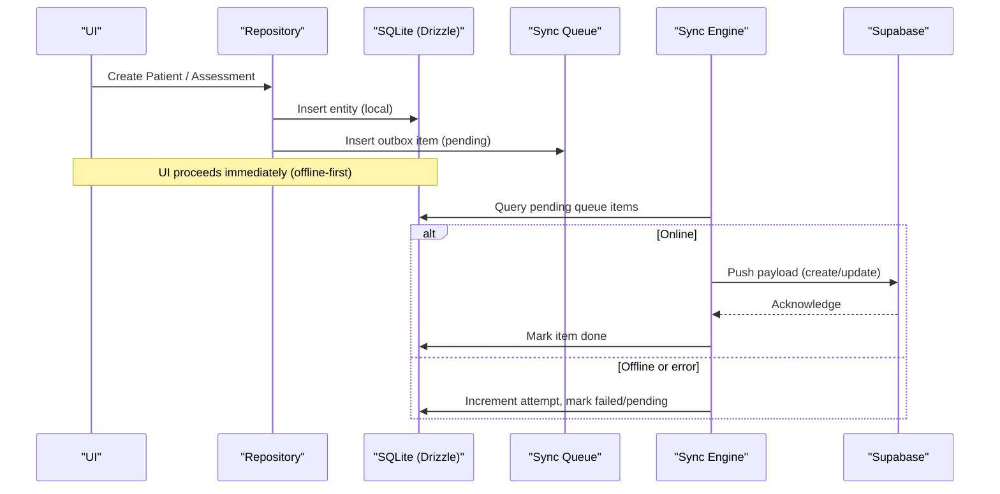
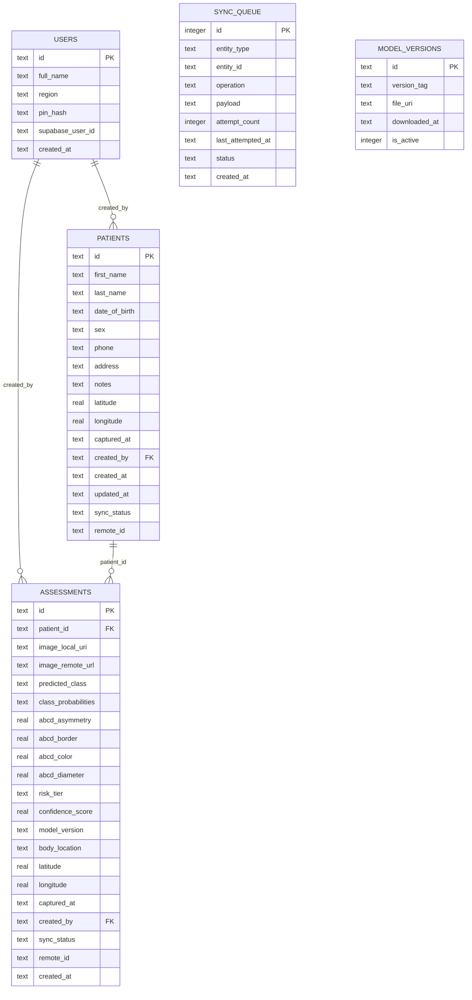
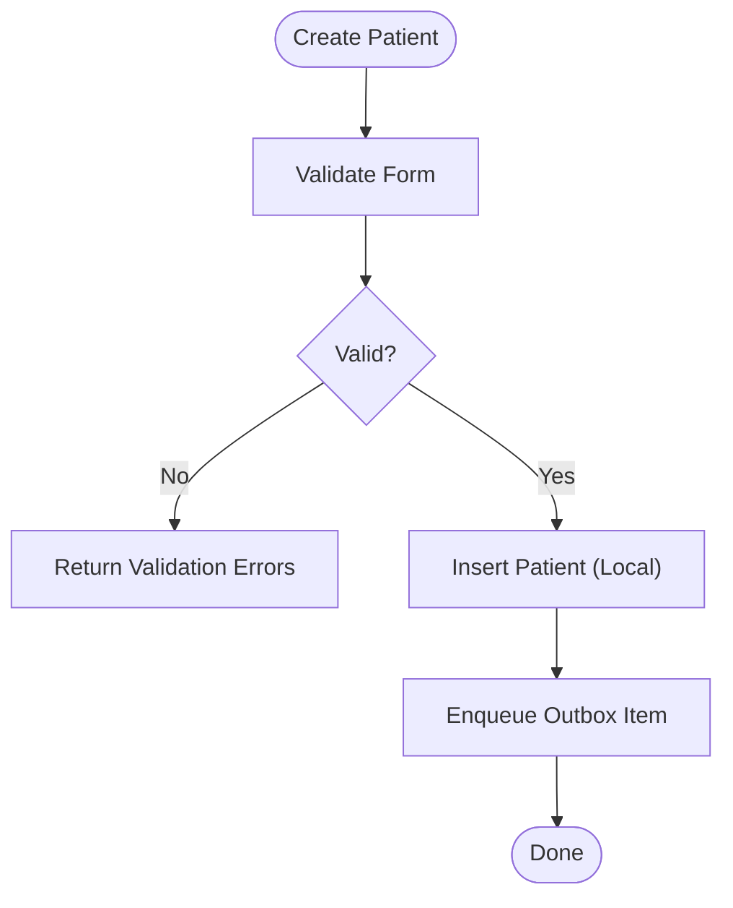
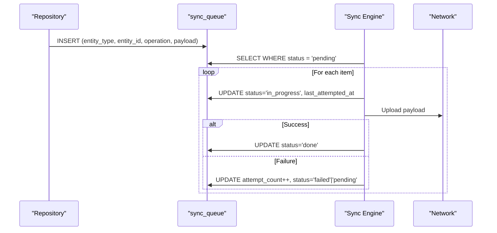
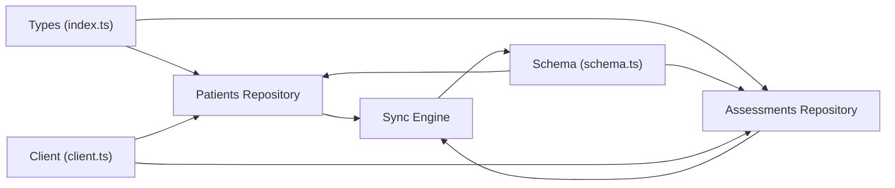

# Data Architecture & Database Design

<cite>
**Referenced Files in This Document**
- [schema.ts](file://src/db/schema.ts)
- [client.ts](file://src/db/client.ts)
- [index.ts](file://src/types/index.ts)
- [repository.ts (patients)](file://src/features/patients/repository.ts)
- [validation.ts (patients)](file://src/features/patients/validation.ts)
- [repository.ts (assessments)](file://src/features/assessments/repository.ts)
- [store.ts (assessments)](file://src/features/assessments/store.ts)
- [syncEngine.ts](file://src/features/sync/syncEngine.ts)
</cite>

## Table of Contents
1. Introduction
2. Project Structure
3. Core Components
4. Architecture Overview
5. Detailed Component Analysis
6. Dependency Analysis
7. Performance Considerations
8. Troubleshooting Guide
9. Conclusion
10. Appendices

## Introduction
This document describes DermSight’s offline-first data architecture and SQLite schema implemented with Drizzle ORM. It details the entities users, patients, assessments, sync_queue, and model_versions; their relationships, constraints, and lifecycle. It explains how local SQLite is the single source of truth, how the outbox pattern ensures reliable synchronization to Supabase, and how validation and business rules are enforced across the data pipeline from patient registration through assessment results.

## Project Structure
The database layer is defined declaratively using Drizzle ORM and initialized at app startup. Feature repositories implement CRUD operations and enqueue sync tasks via an outbox table. A background sync engine processes pending items when connectivity is available.

**Diagram sources**
- [schema.ts:9-101](file://src/db/schema.ts#L9-L101)
- [client.ts:19-101](file://src/db/client.ts#L19-L101)
- [repository.ts (patients):44-101](file://src/features/patients/repository.ts#L44-L101)
- [repository.ts (assessments):1-47](file://src/features/assessments/repository.ts#L1-L47)
- [syncEngine.ts:55-110](file://src/features/sync/syncEngine.ts#L55-L110)

**Section sources**
- [schema.ts:1-102](file://src/db/schema.ts#L1-L102)
- [client.ts:1-104](file://src/db/client.ts#L1-L104)

## Core Components
- Users: Health worker identity and session metadata stored locally.
- Patients: Demographics, location, timestamps, creator, and sync state.
- Assessments: Clinical image analysis results, ABCD scores, risk tier, model versioning, and sync state.
- Sync Queue: Outbox entries for reliable push to Supabase with retry/backoff.
- Model Versions: Local ML model artifacts and activation flags.

Key design principles:
- Offline-first: All writes go to local SQLite first; UI never waits on network.
- Single source of truth: Local DB drives UI; remote is reconciled asynchronously.
- Strong typing: Drizzle schema + TypeScript types ensure consistency.
- Enforced constraints: Enumerations, not-null fields, foreign keys, and defaults.

**Section sources**
- [schema.ts:9-101](file://src/db/schema.ts#L9-L101)
- [index.ts:10-84](file://src/types/index.ts#L10-L84)

## Architecture Overview
The system uses an outbox pattern to decouple local persistence from remote synchronization.

**Diagram sources**
- [repository.ts (patients):44-101](file://src/features/patients/repository.ts#L44-L101)
- [repository.ts (assessments):1-47](file://src/features/assessments/repository.ts#L1-L47)
- [syncEngine.ts:55-110](file://src/features/sync/syncEngine.ts#L55-L110)

## Detailed Component Analysis

### Schema and Constraints
- users
  - Primary key: id (TEXT)
  - Required: full_name, region, pin_hash, supabase_user_id, created_at
  - Purpose: Health worker identity and session context
- patients
  - Primary key: id (TEXT)
  - Foreign key: created_by -> users.id
  - Enums: sex (male|female|other), sync_status (pending|synced|failed)
  - Timestamps: captured_at, created_at, updated_at
  - Optional: phone, address, notes, latitude, longitude, remote_id
- assessments
  - Primary key: id (TEXT)
  - Foreign keys: patient_id -> patients.id, created_by -> users.id
  - Enums: predicted_class (mel|bcc|akiec|bkl|df|vasc|nv), risk_tier (low|medium|high|urgent_referral), sync_status (pending|synced|failed)
  - JSON field: class_probabilities
  - Optional: image_remote_url, body_location, latitude, longitude, remote_id
- sync_queue
  - Primary key: id (INTEGER AUTOINCREMENT)
  - Enums: entity_type (patient|assessment), operation (create|update), status (pending|in_progress|failed|done)
  - Payload: JSON string of entity snapshot
  - Retry tracking: attempt_count, last_attempted_at
- model_versions
  - Primary key: id (TEXT)
  - Fields: version_tag, file_uri, downloaded_at, is_active (boolean)

Constraints and validation:
- Not-null enforcement at schema level for critical fields.
- Enum constraints restrict values to known sets.
- Foreign keys enforce referential integrity between assessments->patients and patients->users.
- Defaults: sync_status defaults to pending; model_versions.is_active defaults to false.

**Section sources**
- [schema.ts:9-101](file://src/db/schema.ts#L9-L101)
- [client.ts:20-101](file://src/db/client.ts#L20-L101)
- [index.ts:10-84](file://src/types/index.ts#L10-L84)

### Entity Relationships

**Diagram sources**
- [schema.ts:9-101](file://src/db/schema.ts#L9-L101)

### Data Validation Rules and Business Logic
- Patient form validation enforces required fields and formats:
  - firstName, lastName: non-empty strings
  - dateOfBirth: YYYY-MM-DD format
  - sex: enum male|female|other
  - phone, address, notes: optional
- Business constraints:
  - Sex must be one of allowed enums.
  - Risk tier must be one of low|medium|high|urgent_referral.
  - Predicted class must be one of supported diagnosis classes.
  - Sync status transitions managed by sync engine and repository logic.
  - Timestamps recorded at capture/create/update times.
  - Creator attribution via createdBy links to users.

**Section sources**
- [validation.ts (patients):7-20](file://src/features/patients/validation.ts#L7-L20)
- [schema.ts:19-40](file://src/db/schema.ts#L19-L40)
- [schema.ts:43-75](file://src/db/schema.ts#L43-L75)
- [index.ts:19-64](file://src/types/index.ts#L19-L64)

### Data Lifecycle Management
- Patient creation:
  - Validate input via Zod schema.
  - Insert into patients table with generated id and timestamps.
  - Enqueue outbox item for create operation.
- Assessment creation:
  - Persist assessment with inference outputs and ABCD scores.
  - Enqueue outbox item for create operation.
- Sync processing:
  - Background engine fetches pending queue items.
  - Marks item in_progress, attempts upload, updates status to done or failed with retries and backoff.
  - On success, marks done; on failure, increments attempt_count and schedules retry.

**Diagram sources**
- [validation.ts (patients):7-20](file://src/features/patients/validation.ts#L7-L20)
- [repository.ts (patients):44-101](file://src/features/patients/repository.ts#L44-L101)

**Section sources**
- [repository.ts (patients):44-101](file://src/features/patients/repository.ts#L44-L101)
- [syncEngine.ts:55-110](file://src/features/sync/syncEngine.ts#L55-L110)

### Sync Queue Mechanism (Outbox Pattern)
- Purpose: Guarantee eventual consistency with Supabase without blocking UI.
- Flow:
  - On write, insert entity locally and add a sync_queue entry with operation and payload.
  - Sync engine polls pending items when online.
  - For each item:
    - Set status to in_progress and record last_attempted_at.
    - Attempt upload; on success set status to done.
    - On failure increment attempt_count; if max retries reached set status to failed; otherwise keep pending for retry.
    - Apply exponential backoff between attempts.
- Visibility:
  - Pending count exposed via repository functions for UI indicators.

**Diagram sources**
- [syncEngine.ts:55-110](file://src/features/sync/syncEngine.ts#L55-L110)
- [repository.ts (patients):88-99](file://src/features/patients/repository.ts#L88-L99)

**Section sources**
- [syncEngine.ts:1-144](file://src/features/sync/syncEngine.ts#L1-L144)
- [repository.ts (patients):88-99](file://src/features/patients/repository.ts#L88-L99)

### Data Migration Strategies and Versioning
- Initialization:
  - Tables are created at app startup using raw SQL in the client initializer.
  - Uses IF NOT EXISTS to avoid errors on repeated runs.
- Schema evolution:
  - Drizzle schema defines intended structure; initialization script ensures compatibility.
  - Future migrations should update both Drizzle schema and initialization script to maintain parity.
- Model versions:
  - model_versions tracks local ML model artifacts with version tags and activation flag.
  - Supports switching active models while retaining history.

Recommendations:
- Introduce a migration table to track applied schema versions.
- Use transactional DDL where possible and test upgrades on fresh databases.
- Keep Drizzle schema and initialization scripts synchronized during releases.

**Section sources**
- [client.ts:19-101](file://src/db/client.ts#L19-L101)
- [schema.ts:95-101](file://src/db/schema.ts#L95-L101)

### Conflict Resolution Policies
- Current implementation:
  - Local writes always succeed first; conflicts are resolved by eventual sync.
  - Outbox items carry full payloads to support upsert semantics on the server side.
- Recommended policy:
  - Server-side conflict resolution based on timestamps or version tags.
  - For assessments, prefer latest captured_at or updated_at.
  - For patients, prefer most recent updated_at or explicit merge rules for fields like demographics vs clinical notes.
  - Maintain audit trail via sync_queue logs for reconciliation.

[No sources needed since this section provides general guidance]

### Sample Data Structures
- User
  - id: unique identifier
  - fullName: health worker name
  - region: service area
  - pinHash: secure credential hash
  - supabaseUserId: linked cloud identity
  - createdAt: account creation time
- Patient
  - id: unique identifier
  - firstName, lastName, dateOfBirth, sex
  - phone, address, notes: optional contact/context
  - latitude, longitude: optional geolocation
  - capturedAt: when profile was created
  - createdBy: user who created the record
  - createdAt, updatedAt: lifecycle timestamps
  - syncStatus: pending|synced|failed
  - remoteId: server-assigned ID after sync
- Assessment
  - id: unique identifier
  - patientId: link to patient
  - imageLocalUri: local image path
  - imageRemoteUrl: server URL after sync
  - predictedClass: diagnosis class
  - classProbabilities: JSON map of class probabilities
  - abcdAsymmetry, abcdBorder, abcdColor, abcdDiameter: clinical scores
  - riskTier: low|medium|high|urgent_referral
  - confidenceScore: model confidence
  - modelVersion: model artifact tag used
  - bodyLocation: anatomical site
  - latitude, longitude: optional geolocation
  - capturedAt: when image was taken
  - createdBy: user who performed assessment
  - syncStatus: pending|synced|failed
  - remoteId: server-assigned ID after sync
  - createdAt: record creation time

These structures underpin the clinical workflow:
- Registration: Create patient with validated demographics and optional location.
- Capture: Take image and run inference to produce assessment with ABCD scores and risk tier.
- Review: Display results locally; persist assessment and enqueue sync.
- Sync: Background process uploads to Supabase and updates statuses.

**Section sources**
- [index.ts:10-84](file://src/types/index.ts#L10-L84)
- [repository.ts (patients):44-101](file://src/features/patients/repository.ts#L44-L101)
- [repository.ts (assessments):1-47](file://src/features/assessments/repository.ts#L1-L47)

## Dependency Analysis

**Diagram sources**
- [index.ts:10-84](file://src/types/index.ts#L10-L84)
- [schema.ts:9-101](file://src/db/schema.ts#L9-L101)
- [client.ts:1-104](file://src/db/client.ts#L1-L104)
- [repository.ts (patients):1-128](file://src/features/patients/repository.ts#L1-L128)
- [repository.ts (assessments):1-47](file://src/features/assessments/repository.ts#L1-L47)
- [syncEngine.ts:1-144](file://src/features/sync/syncEngine.ts#L1-L144)

**Section sources**
- [repository.ts (patients):1-128](file://src/features/patients/repository.ts#L1-L128)
- [repository.ts (assessments):1-47](file://src/features/assessments/repository.ts#L1-L47)
- [syncEngine.ts:1-144](file://src/features/sync/syncEngine.ts#L1-L144)

## Performance Considerations
- Local-first reads/writes minimize latency and enable offline usage.
- Outbox pattern avoids blocking UI on network calls.
- Exponential backoff reduces load on unreliable networks.
- JSON payloads in sync_queue allow flexible serialization but may grow large; consider pagination or batching for bulk sync.
- Indexing recommendations (future):
  - patients.created_at for list ordering.
  - assessments.patient_id for patient history queries.
  - sync_queue.status for efficient pending scans.

[No sources needed since this section provides general guidance]

## Troubleshooting Guide
- Common issues:
  - Stuck in pending: Check connectivity and sync engine execution; verify status transitions in sync_queue.
  - Repeated failures: Inspect attempt_count and last_attempted_at; use retry function to reset and reprocess.
  - Schema mismatch: Ensure Drizzle schema matches initialization SQL; reinitialize only on clean installs or controlled migrations.
- Diagnostics:
  - Query sync_queue for all items to inspect payloads and states.
  - Use repository functions to get pending counts and lists.
  - Validate inputs before inserts to prevent constraint violations.

**Section sources**
- [syncEngine.ts:55-110](file://src/features/sync/syncEngine.ts#L55-L110)
- [repository.ts (patients):13-42](file://src/features/patients/repository.ts#L13-L42)
- [repository.ts (assessments):11-47](file://src/features/assessments/repository.ts#L11-L47)

## Conclusion
DermSight’s data architecture centers on a robust SQLite schema with Drizzle ORM, enforcing strong constraints and clear relationships. The offline-first approach guarantees responsiveness, while the outbox-based sync engine ensures reliable eventual consistency with Supabase. Validation and business rules protect data integrity throughout the clinical workflow from patient registration to assessment results. With careful migration planning and conflict resolution policies, the system scales to support field deployments with intermittent connectivity.

## Appendices

### Appendix A: Field Definitions Summary
- users: id, full_name, region, pin_hash, supabase_user_id, created_at
- patients: id, first_name, last_name, date_of_birth, sex, phone, address, notes, latitude, longitude, captured_at, created_by, created_at, updated_at, sync_status, remote_id
- assessments: id, patient_id, image_local_uri, image_remote_url, predicted_class, class_probabilities, abcd_asymmetry, abcd_border, abcd_color, abcd_diameter, risk_tier, confidence_score, model_version, body_location, latitude, longitude, captured_at, created_by, sync_status, remote_id, created_at
- sync_queue: id, entity_type, entity_id, operation, payload, attempt_count, last_attempted_at, status, created_at
- model_versions: id, version_tag, file_uri, downloaded_at, is_active

**Section sources**
- [schema.ts:9-101](file://src/db/schema.ts#L9-L101)

### Appendix B: Workflow Mapping
- Patient registration: Validate form -> Insert patient -> Enqueue outbox -> UI shows pending sync.
- Assessment capture: Run inference -> Save assessment -> Enqueue outbox -> UI shows result and pending sync.
- Sync: Background engine processes outbox -> Updates statuses -> UI reflects synced state.

**Section sources**
- [validation.ts (patients):7-20](file://src/features/patients/validation.ts#L7-L20)
- [repository.ts (patients):44-101](file://src/features/patients/repository.ts#L44-L101)
- [repository.ts (assessments):1-47](file://src/features/assessments/repository.ts#L1-L47)
- [syncEngine.ts:55-110](file://src/features/sync/syncEngine.ts#L55-L110)