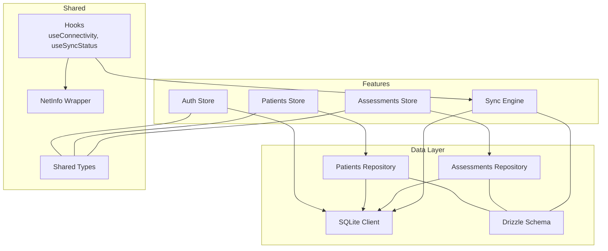
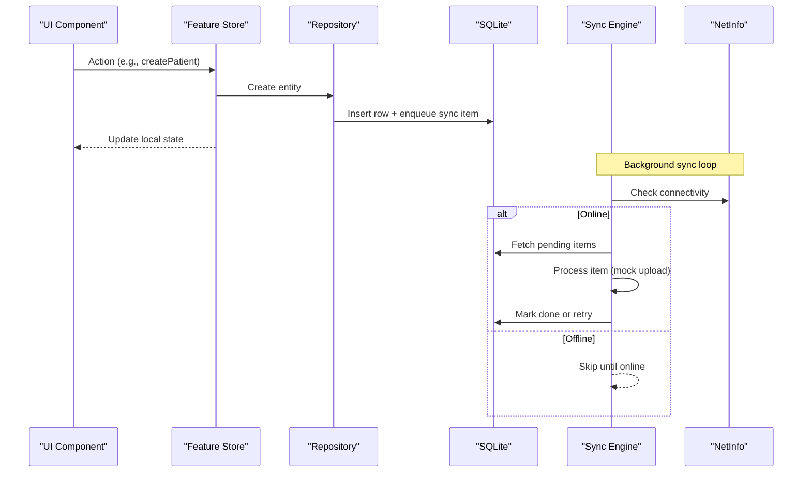
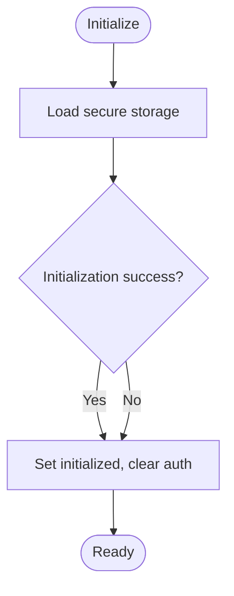
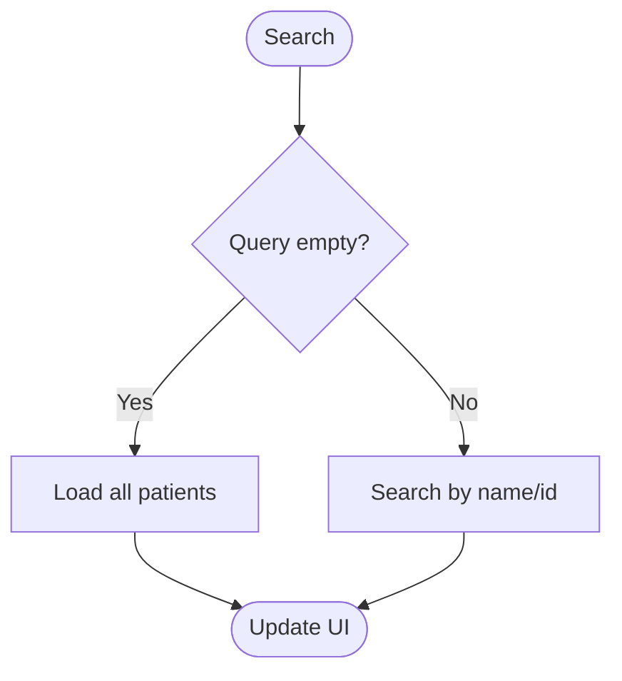
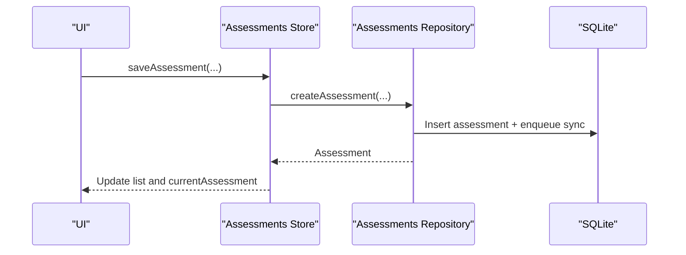
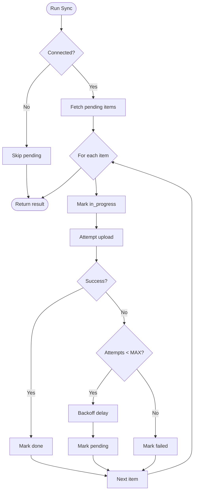
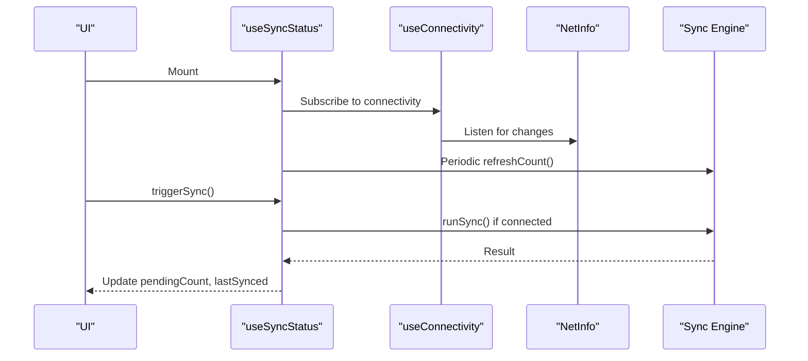
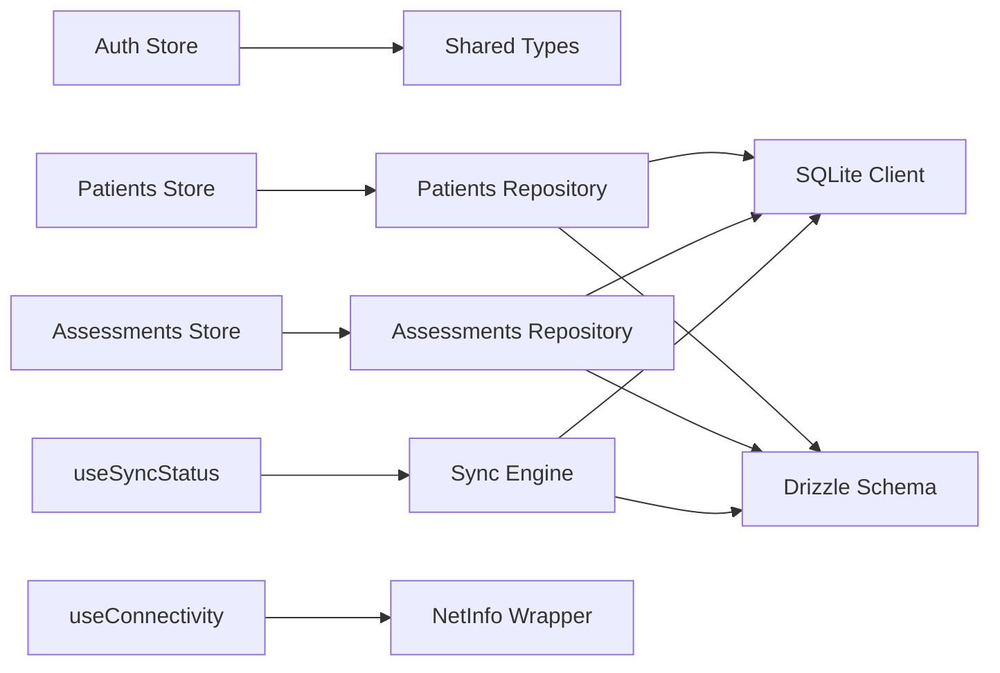

# Feature Modules Architecture

<cite>
**Referenced Files in This Document**
- [store.ts](file://src/features/auth/store.ts)
- [api.ts](file://src/features/auth/api.ts)
- [types.ts](file://src/features/auth/types.ts)
- [store.ts](file://src/features/patients/store.ts)
- [repository.ts](file://src/features/patients/repository.ts)
- [types.ts](file://src/features/patients/types.ts)
- [store.ts](file://src/features/assessments/store.ts)
- [repository.ts](file://src/features/assessments/repository.ts)
- [types.ts](file://src/features/assessments/types.ts)
- [syncEngine.ts](file://src/features/sync/syncEngine.ts)
- [useConnectivity.ts](file://src/hooks/useConnectivity.ts)
- [useSyncStatus.ts](file://src/hooks/useSyncStatus.ts)
- [netinfo.ts](file://src/lib/netinfo.ts)
- [client.ts](file://src/db/client.ts)
- [schema.ts](file://src/db/schema.ts)
- [index.ts](file://src/types/index.ts)
</cite>

## Table of Contents
1. Introduction
2. Project Structure
3. Core Components
4. Architecture Overview
5. Detailed Component Analysis
6. Dependency Analysis
7. Performance Considerations
8. Troubleshooting Guide
9. Conclusion

## Introduction
This document explains DermSight’s feature module architecture with a focus on how each feature encapsulates business logic, state management, and data access patterns. It details the Zustand store implementations for auth, patients, assessments, and sync; how they coordinate with repository layers; inter-module communication via shared types and hooks; and how features integrate with external services while handling asynchronous operations, errors, loading states, and offline capabilities.

## Project Structure
DermSight organizes functionality by feature under src/features, each containing:
- A Zustand store for UI state and actions
- A repository layer for local SQLite CRUD and outbox queueing
- Types scoped to the feature (re-exported from shared types when needed)

Cross-cutting concerns are implemented as reusable hooks in src/hooks and utilities in src/lib. The database client and schema live in src/db, providing an offline-first SQLite source of truth. Shared domain types live in src/types.

**Diagram sources**
- [store.ts:22-121](file://src/features/auth/store.ts#L22-L121)
- [store.ts:26-67](file://src/features/patients/store.ts#L26-L67)
- [store.ts:29-81](file://src/features/assessments/store.ts#L29-L81)
- [syncEngine.ts:55-110](file://src/features/sync/syncEngine.ts#L55-L110)
- [repository.ts:13-102](file://src/features/patients/repository.ts#L13-L102)
- [repository.ts:11-123](file://src/features/assessments/repository.ts#L11-L123)
- [client.ts:19-101](file://src/db/client.ts#L19-L101)
- [schema.ts:18-92](file://src/db/schema.ts#L18-L92)
- [useConnectivity.ts:8-17](file://src/hooks/useConnectivity.ts#L8-L17)
- [useSyncStatus.ts:9-45](file://src/hooks/useSyncStatus.ts#L9-L45)
- [netinfo.ts:15-34](file://src/lib/netinfo.ts#L15-L34)
- [index.ts:5-76](file://src/types/index.ts#L5-L76)

**Section sources**
- [client.ts:1-104](file://src/db/client.ts#L1-L104)
- [schema.ts:1-102](file://src/db/schema.ts#L1-L102)
- [index.ts:1-98](file://src/types/index.ts#L1-L98)

## Core Components
- Auth feature: Secure PIN-based session management with persistent storage and optional Supabase integration.
- Patients feature: Local patient list management, search, filtering, and active patient selection.
- Assessments feature: Per-patient assessment history, counts, and creation with inference results.
- Sync feature: Background outbox engine that processes pending items with retries and backoff.

Each feature exposes a Zustand store that encapsulates state and actions, delegating persistence and synchronization to repositories and the sync engine.

**Section sources**
- [store.ts:22-121](file://src/features/auth/store.ts#L22-L121)
- [store.ts:26-67](file://src/features/patients/store.ts#L26-L67)
- [store.ts:29-81](file://src/features/assessments/store.ts#L29-L81)
- [syncEngine.ts:55-110](file://src/features/sync/syncEngine.ts#L55-L110)

## Architecture Overview
The app follows an offline-first, feature-driven architecture:
- UI components consume feature stores via hooks.
- Stores call repositories for data access and side effects.
- Repositories persist to SQLite and enqueue changes into a sync queue (outbox pattern).
- The sync engine runs in the background, pushing queued items to remote services when online.
- Connectivity and sync status are exposed through reusable hooks.

**Diagram sources**
- [store.ts:44-102](file://src/features/patients/store.ts#L44-L102)
- [repository.ts:44-102](file://src/features/patients/repository.ts#L44-L102)
- [syncEngine.ts:55-110](file://src/features/sync/syncEngine.ts#L55-L110)
- [netinfo.ts:31-34](file://src/lib/netinfo.ts#L31-L34)

## Detailed Component Analysis

### Auth Feature
Responsibilities:
- Initialize session from secure storage
- Set up and verify PIN
- Manage authentication flags and worker identity
- Optional Supabase sign-in/sign-out/session refresh

State and Actions:
- State includes userId, workerName, isAuthenticated, pinSet, isLoading, isInitialized
- Actions: initialize, loginWithPin, setupPin, logout, reset

Data Access Patterns:
- Reads/writes to secure storage for PIN hash, user id, worker name
- Optional calls to Supabase auth API for remote sessions

Error Handling and Loading:
- Sets isLoading during async operations
- Catches errors and ensures isInitialized is set even on failure
- Resets state on logout/reset

Inter-module Communication:
- Provides userId and workerName used by other features (e.g., assessments, patients) for createdBy fields

External Integration:
- Supabase auth methods for email/password flows and session management

**Diagram sources**
- [store.ts:30-48](file://src/features/auth/store.ts#L30-L48)

**Section sources**
- [store.ts:10-121](file://src/features/auth/store.ts#L10-L121)
- [api.ts:8-33](file://src/features/auth/api.ts#L8-L33)
- [types.ts:5-15](file://src/features/auth/types.ts#L5-L15)

### Patients Feature
Responsibilities:
- Load and filter patient lists
- Search patients by name/id
- Manage active patient context
- Add new patients and enqueue sync

State and Actions:
- State includes patients array, activePatient, filter, searchQuery, isLoading
- Actions: loadPatients, searchPatients, setActivePatient, setFilter, setSearchQuery, addPatient

Data Access Patterns:
- Uses repository to query SQLite and perform full-text-like searches
- On create, inserts patient and enqueues a sync item

Error Handling and Loading:
- Wraps async calls with try/catch and resets isLoading
- Gracefully handles empty queries by reloading all

Offline Capabilities:
- All reads/writes are local; sync is queued for later processing

**Diagram sources**
- [store.ts:43-56](file://src/features/patients/store.ts#L43-L56)

**Section sources**
- [store.ts:10-67](file://src/features/patients/store.ts#L10-L67)
- [repository.ts:13-102](file://src/features/patients/repository.ts#L13-L102)
- [types.ts:5-15](file://src/features/patients/types.ts#L5-L15)

### Assessments Feature
Responsibilities:
- Load assessments by patient or globally
- Track total and pending sync counts
- Create assessments with inference results and enqueue sync

State and Actions:
- State includes assessments list, currentAssessment, totalCount, pendingSyncCount, isLoading
- Actions: loadByPatient, loadAll, loadCounts, setCurrentAssessment, saveAssessment

Data Access Patterns:
- Repository performs SQLite queries and inserts
- On create, persists assessment and enqueues sync item

Error Handling and Loading:
- Sets isLoading around async operations
- Silently handles count failures to avoid UI disruption

Offline Capabilities:
- Works fully offline; sync occurs in background via outbox

**Diagram sources**
- [store.ts:68-81](file://src/features/assessments/store.ts#L68-L81)
- [repository.ts:53-123](file://src/features/assessments/repository.ts#L53-L123)

**Section sources**
- [store.ts:9-81](file://src/features/assessments/store.ts#L9-L81)
- [repository.ts:11-123](file://src/features/assessments/repository.ts#L11-L123)
- [types.ts:5-7](file://src/features/assessments/types.ts#L5-L7)

### Sync Feature
Responsibilities:
- Provide functions to read pending and all sync queue items
- Run background sync with connectivity checks
- Implement retry with exponential backoff and max attempts
- Expose retry for individual failed items

Processing Logic:
- If offline, skip all pending items
- For each pending item: mark in_progress, attempt upload, mark done or update status with retries
- Track success/failed/skipped counts

Error Handling:
- Updates attemptCount and status on failure
- Applies capped exponential backoff between retries

**Diagram sources**
- [syncEngine.ts:55-110](file://src/features/sync/syncEngine.ts#L55-L110)

**Section sources**
- [syncEngine.ts:1-145](file://src/features/sync/syncEngine.ts#L1-L145)

### Hook-Based Architecture
- useConnectivity: Subscribes to NetInfo updates and exposes isConnected and isOffline derived state.
- useSyncStatus: Tracks pending count, triggers sync when online, and refreshes periodically.

These hooks provide reusable cross-feature functionality without coupling UI to implementation details.

**Diagram sources**
- [useConnectivity.ts:8-17](file://src/hooks/useConnectivity.ts#L8-L17)
- [useSyncStatus.ts:9-45](file://src/hooks/useSyncStatus.ts#L9-L45)
- [netinfo.ts:15-34](file://src/lib/netinfo.ts#L15-L34)
- [syncEngine.ts:55-110](file://src/features/sync/syncEngine.ts#L55-L110)

**Section sources**
- [useConnectivity.ts:1-18](file://src/hooks/useConnectivity.ts#L1-L18)
- [useSyncStatus.ts:1-46](file://src/hooks/useSyncStatus.ts#L1-L46)
- [netinfo.ts:1-43](file://src/lib/netinfo.ts#L1-L43)

## Dependency Analysis
- Features depend on shared types for consistent contracts across modules.
- Stores depend on repositories for data access and side effects.
- Repositories depend on the SQLite client and Drizzle schema.
- Sync engine depends on the database client and network info utilities.
- Hooks abstract connectivity and sync orchestration for reuse across features.

**Diagram sources**
- [store.ts:22-121](file://src/features/auth/store.ts#L22-L121)
- [store.ts:26-67](file://src/features/patients/store.ts#L26-L67)
- [store.ts:29-81](file://src/features/assessments/store.ts#L29-L81)
- [repository.ts:13-102](file://src/features/patients/repository.ts#L13-L102)
- [repository.ts:11-123](file://src/features/assessments/repository.ts#L11-L123)
- [syncEngine.ts:55-110](file://src/features/sync/syncEngine.ts#L55-L110)
- [useConnectivity.ts:8-17](file://src/hooks/useConnectivity.ts#L8-L17)
- [useSyncStatus.ts:9-45](file://src/hooks/useSyncStatus.ts#L9-L45)
- [client.ts:19-101](file://src/db/client.ts#L19-L101)
- [schema.ts:18-92](file://src/db/schema.ts#L18-L92)
- [index.ts:5-76](file://src/types/index.ts#L5-L76)

**Section sources**
- [index.ts:1-98](file://src/types/index.ts#L1-L98)
- [client.ts:1-104](file://src/db/client.ts#L1-L104)
- [schema.ts:1-102](file://src/db/schema.ts#L1-L102)

## Performance Considerations
- Local-first reads ensure fast UI responses; heavy operations are offloaded to background sync.
- Debouncing search inputs at the UI layer can reduce repository calls (not shown here but recommended).
- Sync engine uses capped exponential backoff to avoid overwhelming resources and network.
- Batch operations like getAllPatients are synchronous within SQLite; consider pagination for large datasets.

[No sources needed since this section provides general guidance]

## Troubleshooting Guide
Common issues and patterns:
- Authentication initialization failures: Ensure secure storage is accessible; stores set isInitialized even on error to prevent infinite loading.
- Patient/Assessment creation failures: Repositories wrap DB operations; check logs for constraint violations or missing references.
- Sync stuck in pending: Verify connectivity; use hook to trigger manual sync; inspect sync queue status and attempt counts.
- Network flakiness: Sync engine retries with backoff; monitor pending count and last synced timestamp via useSyncStatus.

Operational tips:
- Use useConnectivity to show offline banners and disable sync-triggering actions when offline.
- Use useSyncStatus to surface pending counts and allow manual retries.
- Inspect SQLite tables directly via rawDb for debugging data integrity.

**Section sources**
- [store.ts:30-48](file://src/features/auth/store.ts#L30-L48)
- [store.ts:43-56](file://src/features/patients/store.ts#L43-L56)
- [store.ts:56-64](file://src/features/assessments/store.ts#L56-L64)
- [syncEngine.ts:55-110](file://src/features/sync/syncEngine.ts#L55-L110)
- [useSyncStatus.ts:20-30](file://src/hooks/useSyncStatus.ts#L20-L30)

## Conclusion
DermSight’s feature modules encapsulate distinct responsibilities while sharing common infrastructure:
- Zustand stores manage UI state and orchestrate actions
- Repositories handle local persistence and outbox queueing
- Sync engine coordinates background synchronization with resilience
- Hooks provide reusable connectivity and sync status monitoring

This design enables robust offline-first behavior, clear separation of concerns, and scalable integration with external services.

[No sources needed since this section summarizes without analyzing specific files]