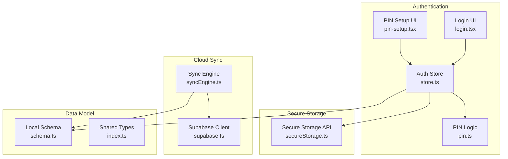
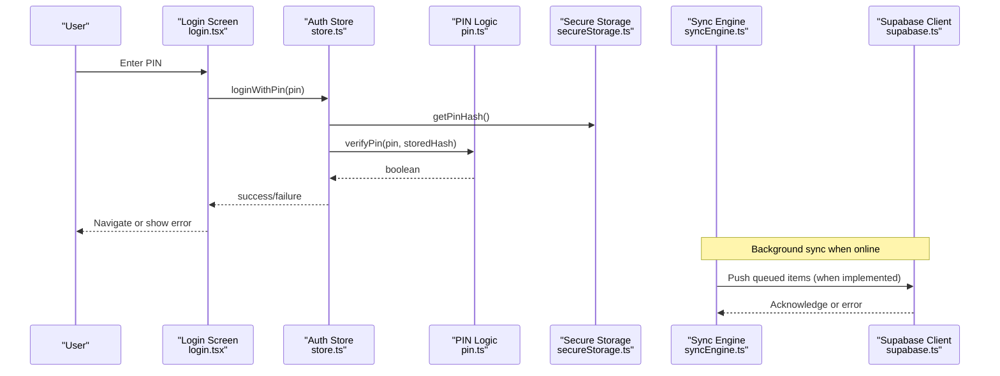
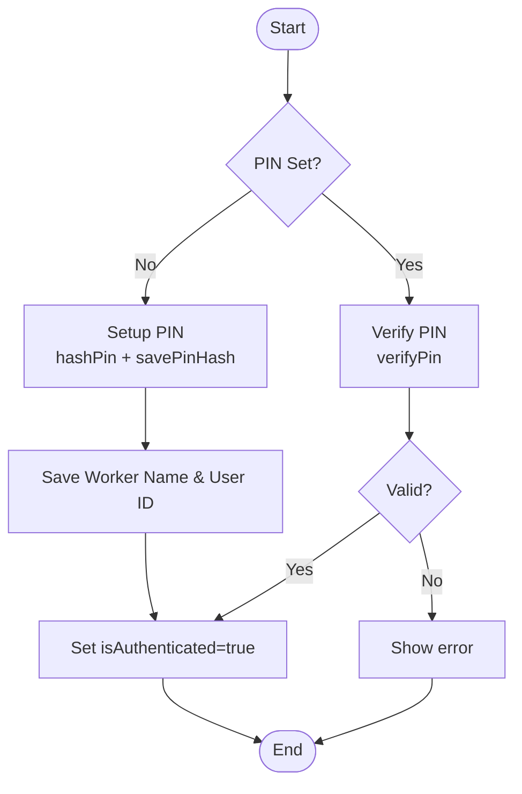
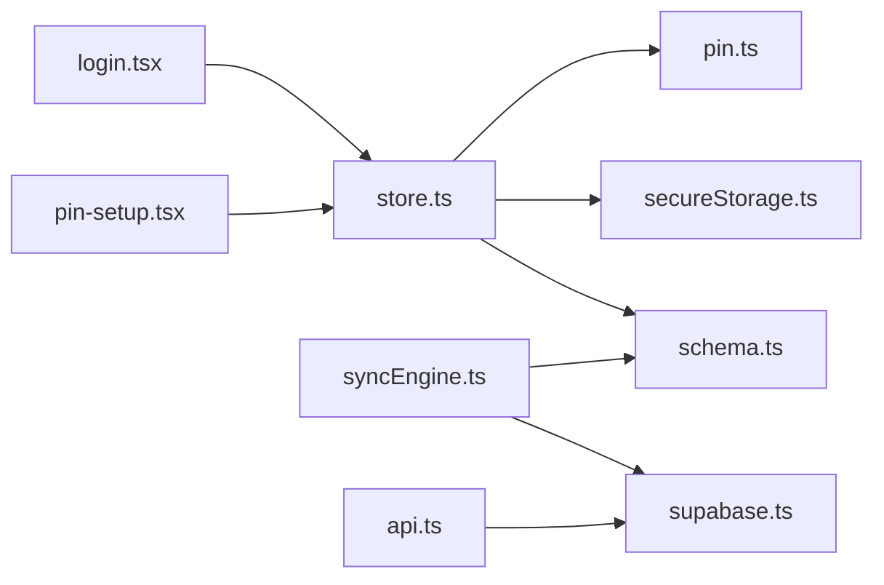

# Security & Privacy Architecture

<cite>
**Referenced Files in This Document**
- [pin.ts](file://src/features/auth/pin.ts)
- [secureStorage.ts](file://src/lib/secureStorage.ts)
- [store.ts](file://src/features/auth/store.ts)
- [api.ts](file://src/features/auth/api.ts)
- [supabase.ts](file://src/lib/supabase.ts)
- [syncEngine.ts](file://src/features/sync/syncEngine.ts)
- [schema.ts](file://src/db/schema.ts)
- [index.ts](file://src/types/index.ts)
- [login.tsx](file://src/app/(auth)/login.tsx)
- [pin-setup.tsx](file://src/app/(auth)/pin-setup.tsx)
</cite>

## Table of Contents
1. Introduction
2. Project Structure
3. Core Components
4. Architecture Overview
5. Detailed Component Analysis
6. Dependency Analysis
7. Performance Considerations
8. Troubleshooting Guide
9. Conclusion
10. Appendices

## Introduction
This document describes the security and privacy architecture for DermSight’s authentication and data protection systems. It focuses on:
- PIN-based local authentication with secure storage via expo-secure-store for auth tokens and PIN hashes
- Session management and credential protection locally and during synchronization
- Privacy considerations for sensitive patient health data, including local encryption strategies and secure transmission to Supabase
- Row Level Security (RLS) policies for Supabase integration and production deployment recommendations
- Data retention, audit logging, and compliance requirements for healthcare applications
- Security implications of offline-first architecture and maintaining data integrity while ensuring privacy

## Project Structure
Security-related code is organized across feature modules and shared libraries:
- Authentication flows and state are implemented under src/features/auth
- Secure storage abstraction is provided by src/lib/secureStorage.ts using expo-secure-store
- Supabase client configuration is centralized in src/lib/supabase.ts
- Synchronization engine and outbox pattern reside in src/features/sync
- Local database schema and types define how sensitive data is modeled and persisted

**Diagram sources**
- [pin.ts:1-73](file://src/features/auth/pin.ts#L1-L73)
- [store.ts:1-122](file://src/features/auth/store.ts#L1-L122)
- [secureStorage.ts:1-78](file://src/lib/secureStorage.ts#L1-L78)
- [supabase.ts:1-19](file://src/lib/supabase.ts#L1-L19)
- [syncEngine.ts:1-145](file://src/features/sync/syncEngine.ts#L1-L145)
- [schema.ts:1-102](file://src/db/schema.ts#L1-L102)
- [index.ts:1-98](file://src/types/index.ts#L1-L98)
- [login.tsx:1-185](file://src/app/(auth)/login.tsx#L1-L185)
- [pin-setup.tsx:1-129](file://src/app/(auth)/pin-setup.tsx#L1-L129)

**Section sources**
- [pin.ts:1-73](file://src/features/auth/pin.ts#L1-L73)
- [secureStorage.ts:1-78](file://src/lib/secureStorage.ts#L1-L78)
- [store.ts:1-122](file://src/features/auth/store.ts#L1-L122)
- [supabase.ts:1-19](file://src/lib/supabase.ts#L1-L19)
- [syncEngine.ts:1-145](file://src/features/sync/syncEngine.ts#L1-L145)
- [schema.ts:1-102](file://src/db/schema.ts#L1-L102)
- [index.ts:1-98](file://src/types/index.ts#L1-L98)
- [login.tsx:1-185](file://src/app/(auth)/login.tsx#L1-L185)
- [pin-setup.tsx:1-129](file://src/app/(auth)/pin-setup.tsx#L1-L129)

## Core Components
- PIN hashing and verification: Local PIN hashing with salt stored securely; verification against stored hash without exposing plaintext PINs
- Secure storage: Centralized wrapper around expo-secure-store for storing auth tokens, refresh tokens, PIN hash, user ID, and worker name
- Auth store: Zustand-based session state managing initialization, PIN login, setup, logout, and reset
- Supabase client: Configured with session persistence and auto token refresh for cloud sync operations
- Sync engine: Outbox pattern implementation that queues entity changes and retries with exponential backoff until successful or failed

Key responsibilities:
- Keep sensitive credentials off persistent SQLite and into secure storage
- Ensure offline-first operation with background synchronization
- Maintain data integrity through status tracking and retry logic

**Section sources**
- [pin.ts:1-73](file://src/features/auth/pin.ts#L1-L73)
- [secureStorage.ts:1-78](file://src/lib/secureStorage.ts#L1-L78)
- [store.ts:1-122](file://src/features/auth/store.ts#L1-L122)
- [supabase.ts:1-19](file://src/lib/supabase.ts#L1-L19)
- [syncEngine.ts:1-145](file://src/features/sync/syncEngine.ts#L1-L145)

## Architecture Overview
The system uses an offline-first approach where local SQLite is the source of truth. Authentication is primarily PIN-based on-device, with optional email/password flow to Supabase for cloud features. Sensitive data never resides in SQLite; it is stored in expo-secure-store. The sync engine batches changes and pushes them to Supabase when connectivity is available.

**Diagram sources**
- [login.tsx:24-46](file://src/app/(auth)/login.tsx#L24-L46)
- [store.ts:51-78](file://src/features/auth/store.ts#L51-L78)
- [pin.ts:47-64](file://src/features/auth/pin.ts#L47-L64)
- [secureStorage.ts:43-49](file://src/lib/secureStorage.ts#L43-L49)
- [syncEngine.ts:55-110](file://src/features/sync/syncEngine.ts#L55-L110)
- [supabase.ts:13-18](file://src/lib/supabase.ts#L13-L18)

## Detailed Component Analysis

### PIN-Based Authentication Flow
- PIN setup: Generates a random salt, stores the salt and PIN hash in secure storage, creates a local user ID, and sets the worker name
- PIN login: Retrieves stored PIN hash from secure storage, verifies input PIN against stored hash, and sets authenticated session state
- PIN check: Determines if a PIN has been set by checking for presence of stored hash

**Diagram sources**
- [pin.ts:20-42](file://src/features/auth/pin.ts#L20-L42)
- [pin.ts:47-64](file://src/features/auth/pin.ts#L47-L64)
- [store.ts:80-99](file://src/features/auth/store.ts#L80-L99)
- [store.ts:51-78](file://src/features/auth/store.ts#L51-L78)

**Section sources**
- [pin.ts:1-73](file://src/features/auth/pin.ts#L1-L73)
- [store.ts:1-122](file://src/features/auth/store.ts#L1-L122)
- [pin-setup.tsx:23-43](file://src/app/(auth)/pin-setup.tsx#L23-L43)
- [login.tsx:24-46](file://src/app/(auth)/login.tsx#L24-L46)

### Secure Storage Strategy
- Uses expo-secure-store to persist auth tokens, refresh tokens, PIN hash, user ID, and worker name
- Provides clear APIs for saving, retrieving, and deleting sensitive values
- Offers a bulk clear function to wipe all secure data on logout

Security implications:
- Sensitive values are not written to SQLite, reducing exposure risk
- Token lifecycle managed via dedicated functions ensures consistent handling

**Section sources**
- [secureStorage.ts:1-78](file://src/lib/secureStorage.ts#L1-L78)

### Session Management
- Initialization reads user identity and PIN setup status from secure storage
- Login with PIN validates credentials locally and sets session state
- Logout clears all secure data and resets session state
- Optional Supabase session methods exist for email/password flows and token refresh

Operational notes:
- Offline-first: Authentication does not require network connectivity
- Cloud session: Supabase client configured with session persistence and auto-refresh

**Section sources**
- [store.ts:30-49](file://src/features/auth/store.ts#L30-L49)
- [store.ts:101-109](file://src/features/auth/store.ts#L101-L109)
- [api.ts:8-33](file://src/features/auth/api.ts#L8-L33)
- [supabase.ts:13-18](file://src/lib/supabase.ts#L13-L18)

### Synchronization and Data Protection
- Outbox pattern: Pending changes are queued in a local table with status tracking
- Retry logic: Exponential backoff with maximum attempts before marking as failed
- Connectivity-aware: Sync runs only when online; otherwise, items are skipped
- Data model: Entities include fields for remote IDs and sync status to track synchronization state

Privacy considerations:
- Payloads are queued locally and transmitted only when connectivity is available
- No sensitive credentials are included in sync payloads; authentication handled separately

**Section sources**
- [syncEngine.ts:24-50](file://src/features/sync/syncEngine.ts#L24-L50)
- [syncEngine.ts:55-110](file://src/features/sync/syncEngine.ts#L55-L110)
- [schema.ts:77-92](file://src/db/schema.ts#L77-L92)
- [index.ts:66-76](file://src/types/index.ts#L66-L76)

### Data Models and Privacy Fields
- Users: Include identifiers and creation timestamps; PIN hash is part of the model but should be stored securely rather than in plain text in SQLite
- Patients: Include personal identifiers, location, and metadata; sync status and remote IDs enable safe synchronization
- Assessments: Include image URIs, classification results, risk tiers, and location; sync status and remote IDs support reliable updates

Recommendations:
- Avoid storing raw PINs in any persistent storage
- Encrypt images and sensitive fields at rest if required by policy
- Mask or minimize PII in logs and analytics

**Section sources**
- [schema.ts:8-40](file://src/db/schema.ts#L8-L40)
- [schema.ts:42-75](file://src/db/schema.ts#L42-L75)
- [index.ts:10-64](file://src/types/index.ts#L10-L64)

## Dependency Analysis
The following diagram shows key dependencies between authentication, secure storage, and synchronization components.

**Diagram sources**
- [login.tsx:1-185](file://src/app/(auth)/login.tsx#L1-L185)
- [pin-setup.tsx:1-129](file://src/app/(auth)/pin-setup.tsx#L1-L129)
- [store.ts:1-122](file://src/features/auth/store.ts#L1-L122)
- [pin.ts:1-73](file://src/features/auth/pin.ts#L1-L73)
- [secureStorage.ts:1-78](file://src/lib/secureStorage.ts#L1-L78)
- [schema.ts:1-102](file://src/db/schema.ts#L1-L102)
- [syncEngine.ts:1-145](file://src/features/sync/syncEngine.ts#L1-L145)
- [supabase.ts:1-19](file://src/lib/supabase.ts#L1-L19)
- [api.ts:1-34](file://src/features/auth/api.ts#L1-L34)

**Section sources**
- [store.ts:1-122](file://src/features/auth/store.ts#L1-L122)
- [syncEngine.ts:1-145](file://src/features/sync/syncEngine.ts#L1-L145)
- [supabase.ts:1-19](file://src/lib/supabase.ts#L1-L19)

## Performance Considerations
- PIN hashing is lightweight and suitable for local-only verification; consider stronger hashing algorithms for higher security needs
- Sync engine uses exponential backoff to reduce network load and handle transient failures gracefully
- Secure storage operations are asynchronous; ensure UI remains responsive by avoiding blocking calls
- Minimize payload size in sync queue to improve throughput and reduce bandwidth usage

[No sources needed since this section provides general guidance]

## Troubleshooting Guide
Common issues and resolutions:
- Incorrect PIN: Ensure PIN length validation and correct hash retrieval from secure storage
- Failed sync: Check connectivity status and retry logic; inspect attempt counts and last attempted timestamps
- Session not persisting: Verify Supabase client configuration for session persistence and token refresh
- Secure data not cleared: Confirm logout triggers clearAllSecureData and state reset

**Section sources**
- [login.tsx:24-46](file://src/app/(auth)/login.tsx#L24-L46)
- [store.ts:51-78](file://src/features/auth/store.ts#L51-L78)
- [syncEngine.ts:55-110](file://src/features/sync/syncEngine.ts#L55-L110)
- [supabase.ts:13-18](file://src/lib/supabase.ts#L13-L18)

## Conclusion
DermSight implements a robust offline-first security architecture centered on PIN-based local authentication and secure storage of sensitive credentials. The outbox pattern ensures reliable synchronization with Supabase while preserving data integrity. For production deployments, strengthen PIN hashing, implement comprehensive RLS policies, enforce strict data retention and audit logging, and adopt encryption-at-rest for sensitive fields. These measures collectively protect patient health data and align with healthcare compliance requirements.

[No sources needed since this section summarizes without analyzing specific files]

## Appendices

### Row Level Security (RLS) Policies for Supabase
Recommended policies to enforce access control:
- Users can only read/write their own records based on authenticated user ID
- Patients and assessments must be scoped to the creating user or authorized roles
- Enforce write permissions only for authenticated sessions
- Deny public access to tables containing PHI unless explicitly allowed by role-based policies

Implementation guidance:
- Use Supabase RLS to restrict row access per user
- Validate claims from Supabase auth session to determine ownership
- Apply policies consistently across users, patients, and assessments tables

[No sources needed since this section provides conceptual guidance]

### Data Retention Policies
- Define retention periods for patient records, assessments, and sync logs
- Implement automated cleanup jobs to remove expired data
- Provide mechanisms for data export and deletion upon request
- Ensure backups comply with retention policies and do not retain data beyond required periods

[No sources needed since this section provides conceptual guidance]

### Audit Logging Considerations
- Log authentication events (login attempts, failures, PIN setup)
- Record sync operations (success, failure, retries) with timestamps and user context
- Avoid logging sensitive data such as PINs, tokens, or PHI
- Store logs securely and limit access to authorized personnel

[No sources needed since this section provides conceptual guidance]

### Compliance Requirements for Healthcare Applications
- Align with applicable regulations (e.g., HIPAA, GDPR) for data protection and privacy
- Implement least privilege access and role-based controls
- Ensure secure transmission (TLS) and encryption at rest for sensitive data
- Conduct regular security assessments and penetration testing
- Maintain incident response procedures and breach notification processes

[No sources needed since this section provides conceptual guidance]

### Offline-First Security Implications
- Local data must be protected with strong device-level security (secure storage, OS protections)
- Synchronize only necessary data and avoid caching sensitive content longer than required
- Validate data integrity on sync completion and reconcile conflicts deterministically
- Provide user controls to revoke access and wipe local data securely

[No sources needed since this section provides conceptual guidance]