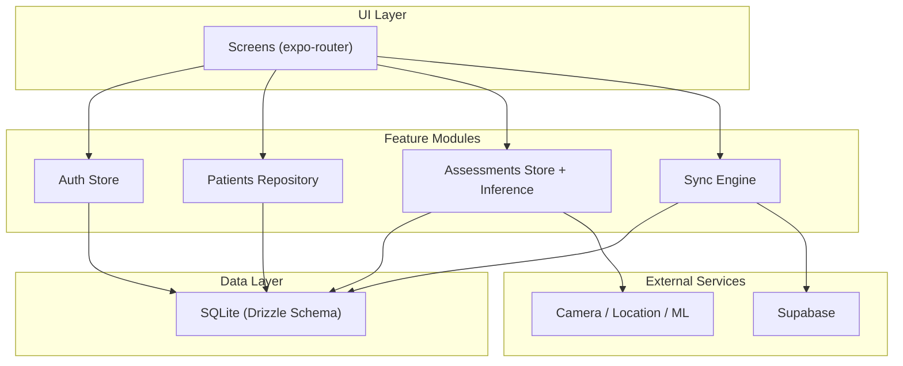
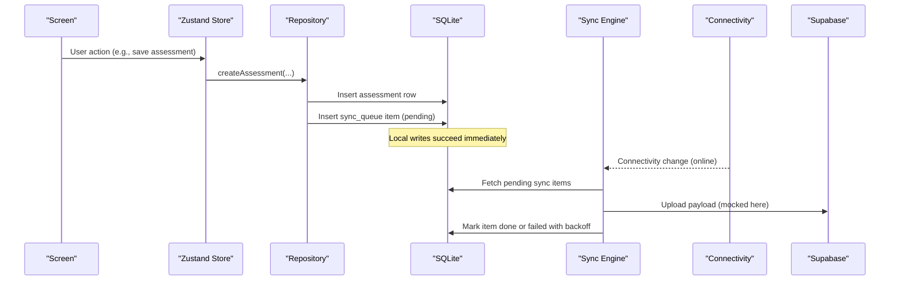
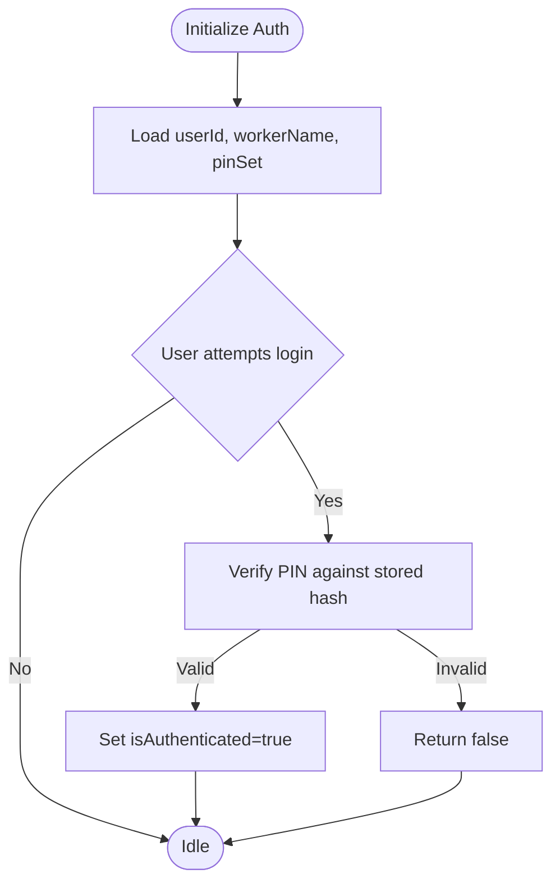
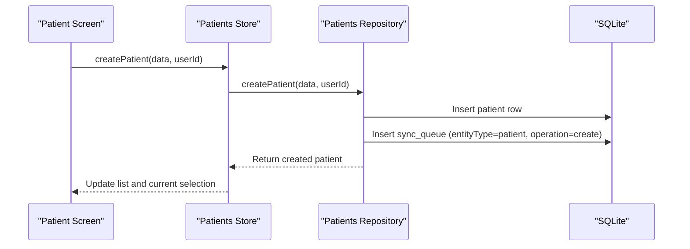
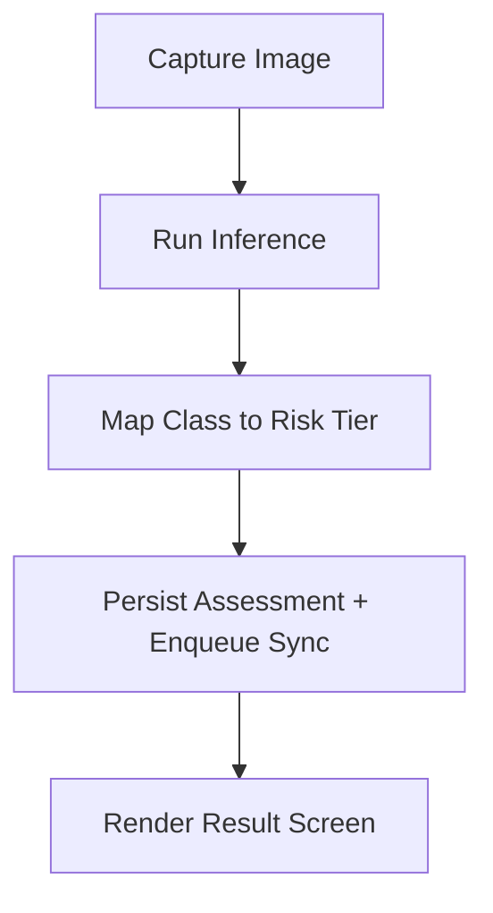
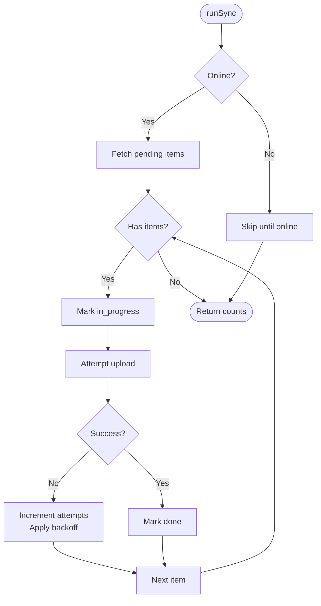
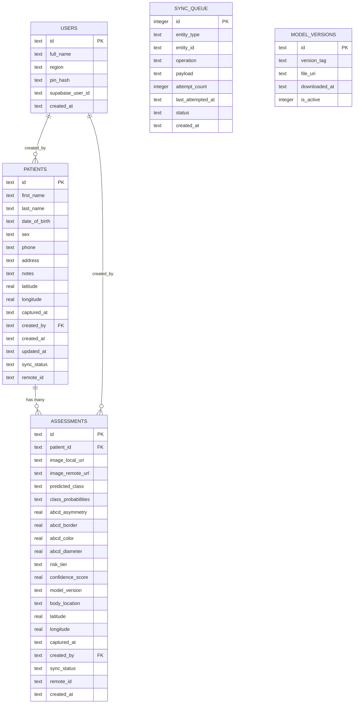
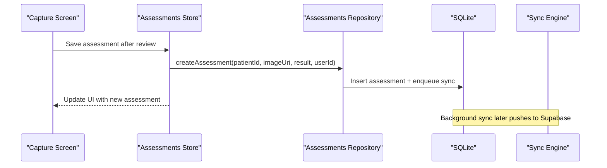
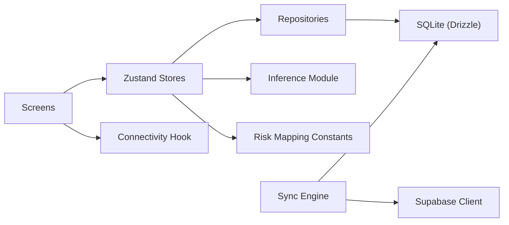

# System Design & Architecture Patterns

<cite>
**Referenced Files in This Document**
- [ARCHITECTURE.md](file://ARCHITECTURE.md)
- [README.md](file://README.md)
- [src/features/sync/syncEngine.ts](file://src/features/sync/syncEngine.ts)
- [src/db/schema.ts](file://src/db/schema.ts)
- [src/lib/supabase.ts](file://src/lib/supabase.ts)
- [src/features/auth/store.ts](file://src/features/auth/store.ts)
- [src/features/patients/repository.ts](file://src/features/patients/repository.ts)
- [src/features/assessments/repository.ts](file://src/features/assessments/repository.ts)
- [src/features/assessments/inference/classify.ts](file://src/features/assessments/inference/classify.ts)
- [src/db/client.ts](file://src/db/client.ts)
- [src/hooks/useConnectivity.ts](file://src/hooks/useConnectivity.ts)
- [src/features/assessments/store.ts](file://src/features/assessments/store.ts)
- [src/constants/riskLevels.ts](file://src/constants/riskLevels.ts)
- [src/types/index.ts](file://src/types/index.ts)
- [src/app/(app)/patients/[patientId]/capture.tsx](file://src/app/(app)/patients/[patientId]/capture.tsx)
</cite>

## Table of Contents
1. Introduction
2. Project Structure
3. Core Components
4. Architecture Overview
5. Detailed Component Analysis
6. Dependency Analysis
7. Performance Considerations
8. Troubleshooting Guide
9. Conclusion

## Introduction
DermSight is an offline-first mobile application for dermatological risk screening designed for community health workers operating in low-bandwidth environments. The system uses a feature-based architecture with clear separation between authentication, patient management, assessments (including on-device machine learning inference), and synchronization. SQLite is the single source of truth; background synchronization pushes changes to Supabase when connectivity is available using an outbox pattern. State is managed via Zustand stores, and UI screens are organized by feature under expo-router.

## Project Structure
The app follows a feature-based layout:
- UI layer: expo-router screens grouped by feature (auth, patients, assessments, settings).
- Feature modules: encapsulate business logic, repositories, stores, and domain utilities.
- Data layer: Drizzle ORM over expo-sqlite with typed schema and migrations.
- Integration layer: Supabase client, location services, camera integration, and ML inference.

**Diagram sources**
- [ARCHITECTURE.md:40-73](file://ARCHITECTURE.md#L40-L73)
- [src/features/sync/syncEngine.ts:1-145](file://src/features/sync/syncEngine.ts#L1-L145)
- [src/db/schema.ts:1-102](file://src/db/schema.ts#L1-L102)

**Section sources**
- [ARCHITECTURE.md:40-73](file://ARCHITECTURE.md#L40-L73)
- [README.md:1-57](file://README.md#L1-L57)

## Core Components
- Authentication: Secure PIN-based local auth with Zustand store managing session state and secure storage.
- Patient Management: Repository provides CRUD operations over SQLite and enqueues sync items for new records.
- Assessments: Stores orchestrate loading and saving assessments; inference module produces classification results and ABCD scores; risk mapping converts model outputs to triage tiers.
- Synchronization: Outbox pattern persists pending operations in a queue table; background tasks trigger sync when online.
- Database: Typed schema defines users, patients, assessments, sync_queue, and model_versions; initialization creates tables at startup.

Key responsibilities:
- UI screens interact with feature stores and repositories.
- Repositories perform data access and enqueue syncs.
- Sync engine processes the outbox and updates statuses.
- External integrations (camera, location, ML) feed into assessment creation.

**Section sources**
- [src/features/auth/store.ts:1-122](file://src/features/auth/store.ts#L1-L122)
- [src/features/patients/repository.ts:1-128](file://src/features/patients/repository.ts#L1-L128)
- [src/features/assessments/store.ts:1-82](file://src/features/assessments/store.ts#L1-L82)
- [src/features/assessments/inference/classify.ts:1-62](file://src/features/assessments/inference/classify.ts#L1-L62)
- [src/features/sync/syncEngine.ts:1-145](file://src/features/sync/syncEngine.ts#L1-L145)
- [src/db/schema.ts:1-102](file://src/db/schema.ts#L1-L102)
- [src/db/client.ts:1-104](file://src/db/client.ts#L1-L104)

## Architecture Overview
DermSight’s architecture emphasizes offline-first reliability:
- Local SQLite is the source of truth; UI reads/writes locally without blocking on network.
- Every write enqueues a sync operation in the outbox table.
- Background tasks and connectivity events trigger the sync engine to push queued items to Supabase.
- On-device ML inference runs independently of network; results are persisted locally first.

**Diagram sources**
- [src/features/assessments/store.ts:1-82](file://src/features/assessments/store.ts#L1-L82)
- [src/features/assessments/repository.ts:1-150](file://src/features/assessments/repository.ts#L1-L150)
- [src/features/sync/syncEngine.ts:1-145](file://src/features/sync/syncEngine.ts#L1-L145)
- [src/hooks/useConnectivity.ts:1-18](file://src/hooks/useConnectivity.ts#L1-L18)

**Section sources**
- [ARCHITECTURE.md:40-73](file://ARCHITECTURE.md#L40-L73)
- [ARCHITECTURE.md:404-413](file://ARCHITECTURE.md#L404-L413)

## Detailed Component Analysis

### Authentication Module
- Purpose: Manage health worker identity and device enrollment via PIN; persist credentials securely.
- Key behaviors:
  - Initialize session from secure storage.
  - Verify PIN against stored hash to authenticate.
  - Setup flow to create PIN hash and initial user context.
  - Logout clears secure storage and resets store state.

**Diagram sources**
- [src/features/auth/store.ts:1-122](file://src/features/auth/store.ts#L1-L122)

**Section sources**
- [src/features/auth/store.ts:1-122](file://src/features/auth/store.ts#L1-L122)

### Patient Management Module
- Purpose: Provide CRUD operations for patients and ensure every write triggers synchronization.
- Key behaviors:
  - List/search patients from SQLite.
  - Create patient with generated UUID and timestamps; set sync status to pending.
  - Enqueue a sync operation for the new patient record.

**Diagram sources**
- [src/features/patients/repository.ts:1-128](file://src/features/patients/repository.ts#L1-L128)

**Section sources**
- [src/features/patients/repository.ts:1-128](file://src/features/patients/repository.ts#L1-L128)

### Assessments Module (Inference and Storage)
- Purpose: Run on-device inference, map results to risk tiers, and persist assessments with full explainability data.
- Key behaviors:
  - Inference module returns class probabilities, predicted class, confidence score, and ABCD scores.
  - Risk mapping converts diagnosis class to actionable triage tier.
  - Repository persists assessment details and enqueues sync.

**Diagram sources**
- [src/features/assessments/inference/classify.ts:1-62](file://src/features/assessments/inference/classify.ts#L1-L62)
- [src/constants/riskLevels.ts:1-121](file://src/constants/riskLevels.ts#L1-L121)
- [src/features/assessments/repository.ts:1-150](file://src/features/assessments/repository.ts#L1-L150)

**Section sources**
- [src/features/assessments/inference/classify.ts:1-62](file://src/features/assessments/inference/classify.ts#L1-L62)
- [src/features/assessments/repository.ts:1-150](file://src/features/assessments/repository.ts#L1-L150)
- [src/constants/riskLevels.ts:1-121](file://src/constants/riskLevels.ts#L1-L121)

### Synchronization Module (Outbox Pattern)
- Purpose: Ensure reliable delivery of local changes to Supabase with retry and backoff.
- Key behaviors:
  - Query pending sync items from the queue.
  - For each item, mark in_progress, attempt upload, then mark done or failed.
  - Apply exponential backoff and cap retries; expose manual retry.

**Diagram sources**
- [src/features/sync/syncEngine.ts:1-145](file://src/features/sync/syncEngine.ts#L1-L145)

**Section sources**
- [src/features/sync/syncEngine.ts:1-145](file://src/features/sync/syncEngine.ts#L1-L145)

### Database Layer
- Purpose: Define typed schema and initialize tables; serve as the single source of truth.
- Key behaviors:
  - Tables: users, patients, assessments, sync_queue, model_versions.
  - Initialization creates tables if not present.
  - Drizzle ORM wraps SQLite for type-safe queries.

**Diagram sources**
- [src/db/schema.ts:1-102](file://src/db/schema.ts#L1-L102)
- [src/db/client.ts:1-104](file://src/db/client.ts#L1-L104)

**Section sources**
- [src/db/schema.ts:1-102](file://src/db/schema.ts#L1-L102)
- [src/db/client.ts:1-104](file://src/db/client.ts#L1-L104)

### UI-to-Feature Interaction Flow
- Screens navigate through capture, review, and result flows while delegating persistence to stores and repositories.
- Camera screen orchestrates capture and transitions to review; stores handle saving assessments and updating UI state.

**Diagram sources**
- [src/app/(app)/patients/[patientId]/capture.tsx:1-131](file://src/app/(app)/patients/[patientId]/capture.tsx#L1-L131)
- [src/features/assessments/store.ts:1-82](file://src/features/assessments/store.ts#L1-L82)
- [src/features/assessments/repository.ts:1-150](file://src/features/assessments/repository.ts#L1-L150)

**Section sources**
- [src/app/(app)/patients/[patientId]/capture.tsx:1-131](file://src/app/(app)/patients/[patientId]/capture.tsx#L1-L131)
- [src/features/assessments/store.ts:1-82](file://src/features/assessments/store.ts#L1-L82)

## Dependency Analysis
- UI depends on feature stores for state and actions.
- Stores depend on repositories for data access and side effects.
- Repositories depend on the database layer (Drizzle + SQLite).
- Sync engine depends on connectivity and Supabase client for remote operations.
- Risk mapping constants decouple clinical triage rules from inference code.

**Diagram sources**
- [src/features/assessments/store.ts:1-82](file://src/features/assessments/store.ts#L1-L82)
- [src/features/assessments/inference/classify.ts:1-62](file://src/features/assessments/inference/classify.ts#L1-L62)
- [src/constants/riskLevels.ts:1-121](file://src/constants/riskLevels.ts#L1-L121)
- [src/features/sync/syncEngine.ts:1-145](file://src/features/sync/syncEngine.ts#L1-L145)
- [src/lib/supabase.ts:1-19](file://src/lib/supabase.ts#L1-L19)
- [src/hooks/useConnectivity.ts:1-18](file://src/hooks/useConnectivity.ts#L1-L18)

**Section sources**
- [src/features/assessments/store.ts:1-82](file://src/features/assessments/store.ts#L1-L82)
- [src/features/sync/syncEngine.ts:1-145](file://src/features/sync/syncEngine.ts#L1-L145)
- [src/lib/supabase.ts:1-19](file://src/lib/supabase.ts#L1-L19)

## Performance Considerations
- Offline-first design ensures UI responsiveness by avoiding network waits; all writes land in SQLite first.
- Background synchronization prevents blocking the main thread; sync runs on background tasks triggered by connectivity changes.
- Model inference runs on-device with quantized TFLite models to minimize latency and memory footprint.
- Risk mapping is a constant-time lookup, keeping result processing efficient.
- Exponential backoff reduces load on the server during transient failures.

[No sources needed since this section provides general guidance]

## Troubleshooting Guide
- Sync failures: Inspect sync_queue status and attempt counts; use manual retry to reprocess failed items.
- Connectivity issues: Use the connectivity hook to detect offline states and defer sync until online.
- Authentication errors: Verify PIN setup and secure storage contents; reset state if necessary.
- ML availability: Confirm model presence and versioning; fallback to mock inference during development.

**Section sources**
- [src/features/sync/syncEngine.ts:1-145](file://src/features/sync/syncEngine.ts#L1-L145)
- [src/hooks/useConnectivity.ts:1-18](file://src/hooks/useConnectivity.ts#L1-L18)
- [src/features/auth/store.ts:1-122](file://src/features/auth/store.ts#L1-L122)
- [src/features/assessments/inference/classify.ts:1-62](file://src/features/assessments/inference/classify.ts#L1-L62)

## Conclusion
DermSight implements a robust, offline-first architecture that prioritizes reliability and usability in low-connectivity environments. The feature-based separation of concerns, repository pattern for data access, and outbox-driven synchronization provide a scalable foundation. On-device ML inference and clear risk mapping enable actionable insights for health workers, while SQLite remains the authoritative data store with background sync to Supabase ensuring long-term consistency.

[No sources needed since this section summarizes without analyzing specific files]