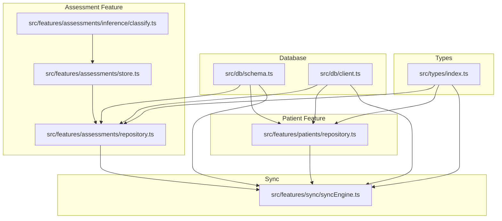
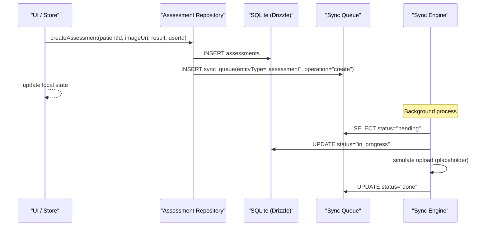
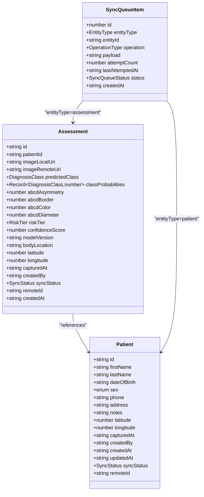
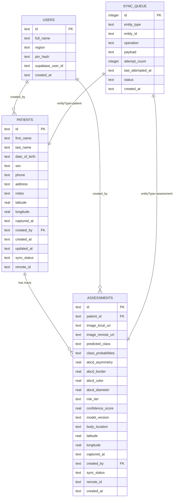
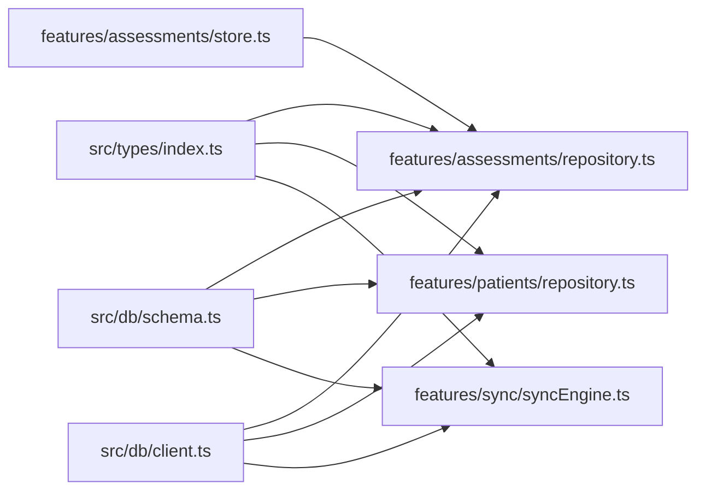

# Assessment Data Models

<cite>
**Referenced Files in This Document**
- [types/index.ts](file://src/types/index.ts)
- [db/schema.ts](file://src/db/schema.ts)
- [db/client.ts](file://src/db/client.ts)
- [features/assessments/repository.ts](file://src/features/assessments/repository.ts)
- [features/assessments/store.ts](file://src/features/assessments/store.ts)
- [features/assessments/inference/classify.ts](file://src/features/assessments/inference/classify.ts)
- [features/patients/repository.ts](file://src/features/patients/repository.ts)
- [features/sync/syncEngine.ts](file://src/features/sync/syncEngine.ts)
</cite>

## Table of Contents
1. Introduction
2. Project Structure
3. Core Components
4. Architecture Overview
5. Detailed Component Analysis
6. Dependency Analysis
7. Performance Considerations
8. Troubleshooting Guide
9. Conclusion

## Introduction
This document explains the assessment data models and their persistence layer. It covers TypeScript interfaces for assessments (including patient relationships, image metadata, inference results, and clinical scores), the Drizzle ORM schema design with table relationships, constraints, and indexing strategies, and the repository pattern implementation for CRUD operations, batch processing, and query optimization. It also provides examples of assessment creation, retrieval, and updates, addresses validation rules and business logic enforcement, outlines migration strategies for schema changes, and documents relationships between assessments and other entities such as patients and sync queue items.

## Project Structure
The assessment domain spans several modules:
- Types define shared interfaces across features.
- Database schema defines tables and relationships using Drizzle ORM.
- Repository functions encapsulate SQLite CRUD operations.
- Store coordinates UI state and calls repositories.
- Inference module produces model outputs used to create assessments.
- Sync engine processes outbox queue items for background synchronization.

**Diagram sources**
- [types/index.ts:1-98](file://src/types/index.ts#L1-L98)
- [db/schema.ts:1-102](file://src/db/schema.ts#L1-L102)
- [db/client.ts:1-104](file://src/db/client.ts#L1-L104)
- [features/assessments/repository.ts:1-150](file://src/features/assessments/repository.ts#L1-L150)
- [features/assessments/store.ts:1-82](file://src/features/assessments/store.ts#L1-L82)
- [features/assessments/inference/classify.ts:1-62](file://src/features/assessments/inference/classify.ts#L1-L62)
- [features/patients/repository.ts:1-128](file://src/features/patients/repository.ts#L1-L128)
- [features/sync/syncEngine.ts:1-145](file://src/features/sync/syncEngine.ts#L1-L145)

**Section sources**
- [types/index.ts:1-98](file://src/types/index.ts#L1-L98)
- [db/schema.ts:1-102](file://src/db/schema.ts#L1-L102)
- [db/client.ts:1-104](file://src/db/client.ts#L1-L104)
- [features/assessments/repository.ts:1-150](file://src/features/assessments/repository.ts#L1-L150)
- [features/assessments/store.ts:1-82](file://src/features/assessments/store.ts#L1-L82)
- [features/assessments/inference/classify.ts:1-62](file://src/features/assessments/inference/classify.ts#L1-L62)
- [features/patients/repository.ts:1-128](file://src/features/patients/repository.ts#L1-L128)
- [features/sync/syncEngine.ts:1-145](file://src/features/sync/syncEngine.ts#L1-L145)

## Core Components
- Assessment type: Represents a single skin lesion assessment with image references, ML inference outputs, ABCD clinical scores, risk tier, and audit fields.
- Patient type: Represents a patient record linked to assessments via foreign key.
- SyncQueueItem type: Represents an outbox item to persist changes until they are successfully synced.
- Drizzle schema: Defines tables for users, patients, assessments, sync_queue, and model_versions with constraints and relationships.
- Assessment repository: Provides CRUD and queries for assessments, including creating assessments and enqueuing sync items.
- Sync engine: Processes pending sync items with retries and backoff.

Key responsibilities:
- Types enforce compile-time contracts for assessments, patients, and sync items.
- Schema ensures referential integrity and consistent enums at the database level.
- Repository abstracts SQL details and maps rows to typed objects.
- Store manages UI state and orchestrates repository calls.
- Sync engine implements reliable delivery semantics for offline-first architecture.

**Section sources**
- [types/index.ts:19-98](file://src/types/index.ts#L19-L98)
- [db/schema.ts:18-102](file://src/db/schema.ts#L18-L102)
- [features/assessments/repository.ts:11-150](file://src/features/assessments/repository.ts#L11-L150)
- [features/sync/syncEngine.ts:21-145](file://src/features/sync/syncEngine.ts#L21-L145)

## Architecture Overview
The system follows an offline-first pattern:
- Local SQLite is the source of truth; UI reads/writes locally without waiting for network.
- Assessments are created locally and queued for sync via an outbox table.
- A background sync engine processes pending items, marking them done or failed with retry logic.
- Relationships: assessments reference patients; sync queue references both patients and assessments by entity type and id.

**Diagram sources**
- [features/assessments/repository.ts:53-123](file://src/features/assessments/repository.ts#L53-L123)
- [features/sync/syncEngine.ts:55-110](file://src/features/sync/syncEngine.ts#L55-L110)
- [db/schema.ts:42-92](file://src/db/schema.ts#L42-L92)

## Detailed Component Analysis

### Assessment Data Model
- Fields include identifiers, patient linkage, image URIs, ML predictions, ABCD scores, risk tier, confidence score, model version, location metadata, timestamps, user attribution, sync status, and remote IDs.
- The class probabilities are stored as JSON strings in the database and parsed back into a typed record on read.

**Diagram sources**
- [types/index.ts:19-98](file://src/types/index.ts#L19-L98)
- [db/schema.ts:18-92](file://src/db/schema.ts#L18-L92)

**Section sources**
- [types/index.ts:42-64](file://src/types/index.ts#L42-L64)
- [db/schema.ts:42-75](file://src/db/schema.ts#L42-L75)

### Database Schema Design (Drizzle ORM)
- Tables:
  - users: health worker identity and auth-related fields.
  - patients: demographic and contact info with geographic capture fields and audit columns.
  - assessments: full assessment record with ML outputs, ABCD scores, and sync tracking.
  - sync_queue: outbox table for reliable async sync with retry counters and timestamps.
  - model_versions: tracks downloaded ML models and active version flag.
- Relationships:
  - assessments.patient_id -> patients.id (foreign key).
  - assessments.created_by -> users.id (foreign key).
  - patients.created_by -> users.id (foreign key).
- Constraints:
  - Enumerated fields for sex, predicted_class, risk_tier, sync_status, entity_type, operation, and queue status.
  - NOT NULL constraints on critical fields.
  - Default values for sync_status and attempt_count.
- Indexing strategy:
  - Primary keys on all tables.
  - No explicit secondary indexes defined in schema or initialization; queries rely on primary keys and simple filters. For high-volume scenarios, consider adding indexes on frequently filtered columns like assessments.patient_id, assessments.sync_status, and sync_queue.status.

**Section sources**
- [db/schema.ts:8-102](file://src/db/schema.ts#L8-L102)
- [db/client.ts:19-101](file://src/db/client.ts#L19-L101)

### Repository Pattern for Assessments
- Read operations:
  - getAssessmentsByPatient: returns assessments for a given patient ordered by creation time descending.
  - getAllAssessments: returns all assessments ordered by creation time descending.
  - getAssessmentById: returns a single assessment by ID.
  - getAssessmentCount: returns total number of assessments.
  - getPendingSyncCount: counts assessments with pending sync status.
- Write operations:
  - createAssessment: constructs an Assessment object from inference results, inserts it into the database, and enqueues a sync item for the assessment.
- Mapping:
  - mapRowToAssessment converts database rows to typed Assessment objects, parsing JSON class probabilities.

Example usage patterns:
- Create an assessment:
  - Call createAssessment with patientId, imageUri, inference result, and userId.
  - The function persists the assessment and adds a sync queue entry for later upload.
- Retrieve assessments:
  - Use getAssessmentsByPatient to load a patient’s history.
  - Use getAllAssessments for global listing.
- Update assessments:
  - There is no dedicated update function in the current repository; updates can be implemented by inserting new records or extending the repository with an update method that sets updated_at and modifies fields as needed.

**Section sources**
- [features/assessments/repository.ts:11-150](file://src/features/assessments/repository.ts#L11-L150)

### Store Integration and UI State
- The Zustand store exposes actions to load assessments by patient, load all assessments, load counts, set the current assessment, and save a new assessment.
- Saving triggers repository.createAssessment and updates local state immediately for responsive UI.

**Section sources**
- [features/assessments/store.ts:9-82](file://src/features/assessments/store.ts#L9-L82)

### Inference Results and Clinical Scores
- The inference module simulates model output, producing:
  - Class probabilities normalized across diagnosis classes.
  - Predicted class and confidence score.
  - ABCD scores for asymmetry, border, color, diameter.
  - Risk tier derived from the predicted class.
- These outputs feed directly into assessment creation.

**Section sources**
- [features/assessments/inference/classify.ts:14-53](file://src/features/assessments/inference/classify.ts#L14-L53)
- [types/index.ts:86-98](file://src/types/index.ts#L86-L98)

### Sync Queue and Outbox Pattern
- On create, assessments enqueue a sync item with entityType "assessment", operation "create", and serialized payload.
- The sync engine:
  - Reads pending items.
  - Marks items in progress, attempts upload (currently simulated), then marks done.
  - On failure, increments attempt count, applies exponential backoff, and either retries or marks failed after max retries.
- This ensures eventual consistency with remote storage while keeping the UI fast and offline-capable.

**Section sources**
- [features/assessments/repository.ts:109-123](file://src/features/assessments/repository.ts#L109-L123)
- [features/sync/syncEngine.ts:21-145](file://src/features/sync/syncEngine.ts#L21-L145)
- [db/schema.ts:77-92](file://src/db/schema.ts#L77-L92)

### Relationship Between Assessments and Other Entities
- Assessments link to patients via patient_id foreign key.
- Assessments are authored by users via created_by foreign key.
- Sync queue items reference assessments (and patients) by entityType and entityId to track which entity needs syncing.

**Diagram sources**
- [db/schema.ts:8-102](file://src/db/schema.ts#L8-L102)

## Dependency Analysis
- Types are consumed by repositories, stores, and sync engine to ensure consistent contracts.
- Repositories depend on Drizzle client and schema for SQL generation and execution.
- Sync engine depends on schema and connectivity checks to orchestrate background tasks.
- Store depends on repository to mutate and query data.

**Diagram sources**
- [types/index.ts:1-98](file://src/types/index.ts#L1-L98)
- [db/schema.ts:1-102](file://src/db/schema.ts#L1-L102)
- [db/client.ts:1-104](file://src/db/client.ts#L1-L104)
- [features/assessments/repository.ts:1-150](file://src/features/assessments/repository.ts#L1-L150)
- [features/patients/repository.ts:1-128](file://src/features/patients/repository.ts#L1-L128)
- [features/sync/syncEngine.ts:1-145](file://src/features/sync/syncEngine.ts#L1-L145)
- [features/assessments/store.ts:1-82](file://src/features/assessments/store.ts#L1-L82)

**Section sources**
- [features/assessments/repository.ts:1-150](file://src/features/assessments/repository.ts#L1-L150)
- [features/patients/repository.ts:1-128](file://src/features/patients/repository.ts#L1-L128)
- [features/sync/syncEngine.ts:1-145](file://src/features/sync/syncEngine.ts#L1-L145)
- [features/assessments/store.ts:1-82](file://src/features/assessments/store.ts#L1-L82)

## Performance Considerations
- Queries:
  - All assessment queries order by created_at descending; consider adding an index on assessments.created_at if list performance degrades with large datasets.
  - Filtering by patient_id and sync_status is common; consider indexes on assessments.patient_id and assessments.sync_status.
- Storage:
  - class_probabilities stored as JSON string; keep payloads compact to reduce storage overhead.
- Sync:
  - Exponential backoff prevents overwhelming the server during failures.
  - Batch processing of pending items is sequential; consider batching updates to minimize write contention.

[No sources needed since this section provides general guidance]

## Troubleshooting Guide
- Missing or invalid enum values:
  - Ensure predicted_class and risk_tier match allowed values defined in the schema.
- Foreign key violations:
  - Verify patient_id exists in patients before creating assessments.
  - Ensure created_by corresponds to a valid user.
- Sync issues:
  - Check sync_queue.status for "failed" items; use retrySyncItem to reset and reprocess.
  - Inspect attempt_count and last_attempted_at to diagnose repeated failures.
- Data mapping errors:
  - If classProbabilities parse fails, validate that the stored JSON matches expected structure.

**Section sources**
- [features/sync/syncEngine.ts:115-125](file://src/features/sync/syncEngine.ts#L115-L125)
- [db/schema.ts:42-92](file://src/db/schema.ts#L42-L92)

## Conclusion
The assessment data models and persistence layer provide a robust, offline-first foundation for capturing and managing dermatological assessments. The Drizzle schema enforces strong constraints and relationships, while the repository pattern abstracts data access and integrates seamlessly with the sync engine for reliable background synchronization. The store offers a clean API for UI interactions, enabling responsive experiences even when offline. Future enhancements may include additional indexes, explicit update operations, and expanded validation to further improve reliability and scalability.