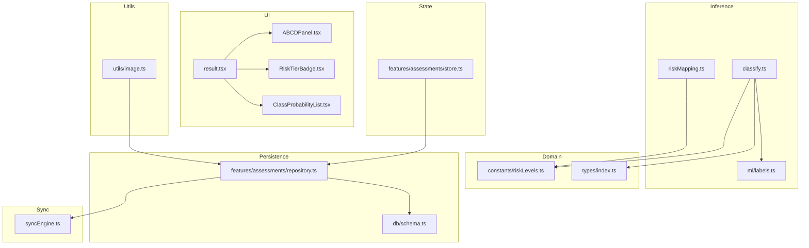
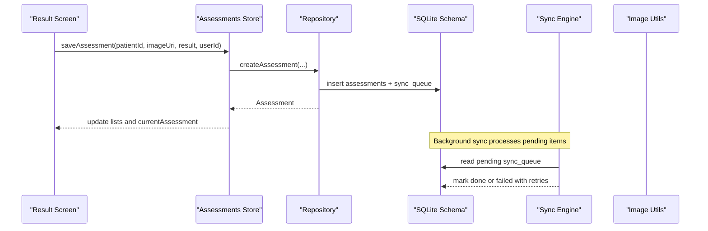
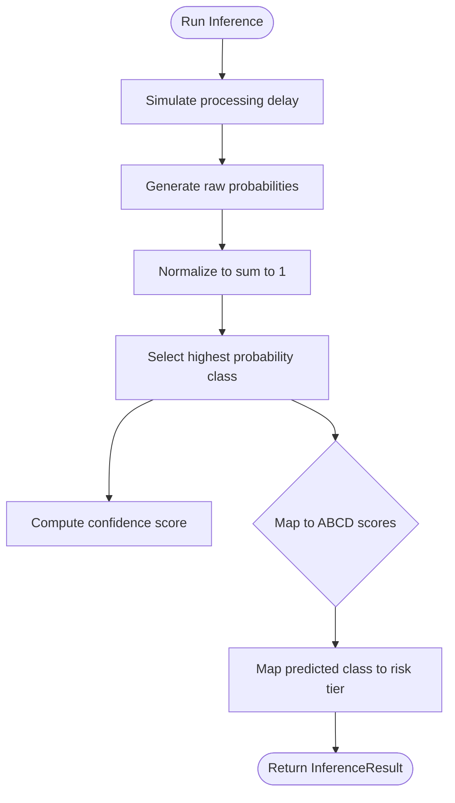
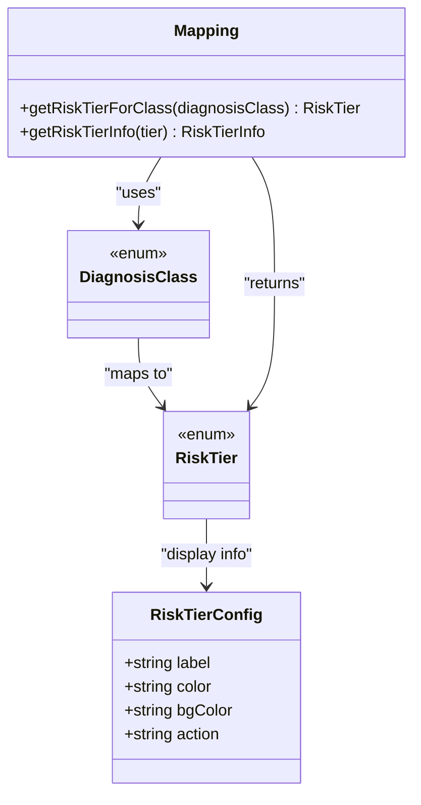
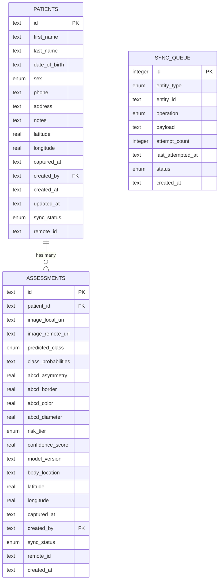
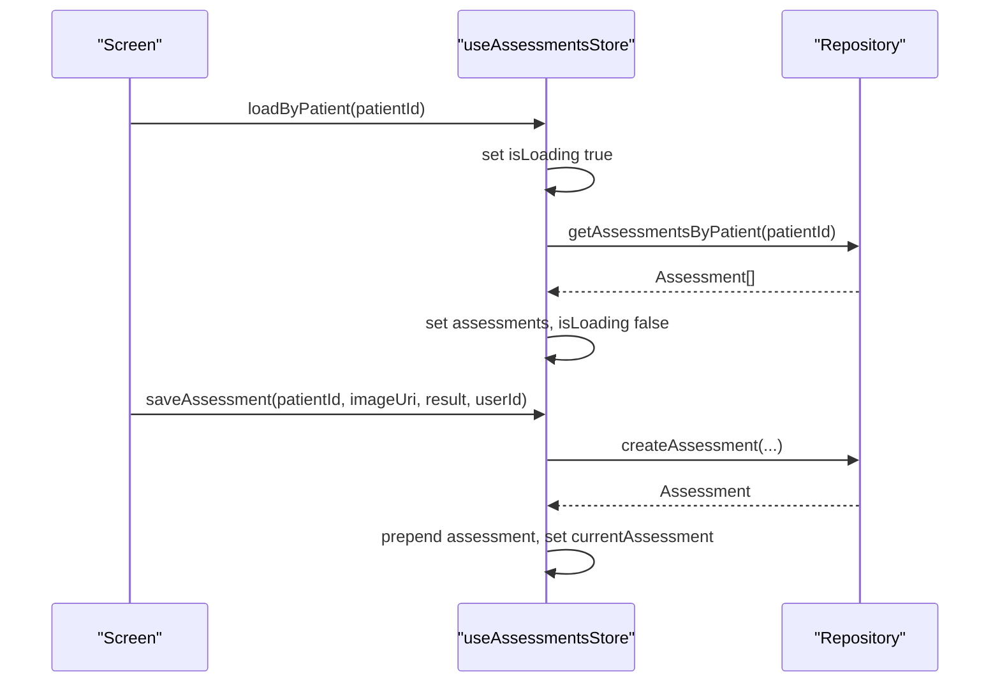
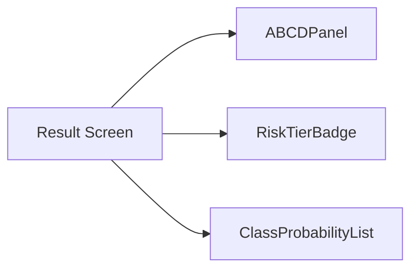
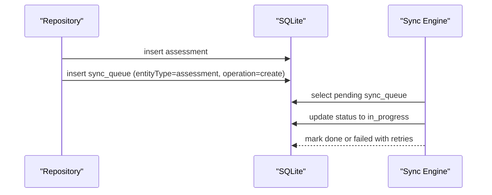
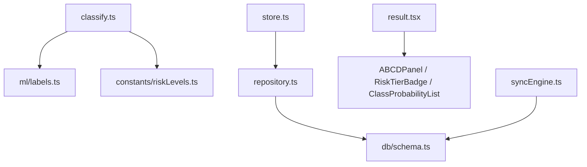

# Assessment Engine

<cite>
**Referenced Files in This Document**
- [types/index.ts](file://src/types/index.ts)
- [features/assessments/types.ts](file://src/features/assessments/types.ts)
- [features/assessments/inference/classify.ts](file://src/features/assessments/inference/classify.ts)
- [features/assessments/inference/riskMapping.ts](file://src/features/assessments/inference/riskMapping.ts)
- [constants/riskLevels.ts](file://src/constants/riskLevels.ts)
- [ml/labels.ts](file://src/ml/labels.ts)
- [features/assessments/repository.ts](file://src/features/assessments/repository.ts)
- [features/assessments/store.ts](file://src/features/assessments/store.ts)
- [db/schema.ts](file://src/db/schema.ts)
- [components/assessment/ABCDPanel.tsx](file://src/components/assessment/ABCDPanel.tsx)
- [components/assessment/RiskTierBadge.tsx](file://src/components/assessment/RiskTierBadge.tsx)
- [components/assessment/ClassProbabilityList.tsx](file://src/components/assessment/ClassProbabilityList.tsx)
- [utils/image.ts](file://src/utils/image.ts)
- [features/sync/syncEngine.ts](file://src/features/sync/syncEngine.ts)
- [app/(app)/patients/[patientId]/result.tsx](file://src/app/(app)/patients/[patientId]/result.tsx)
</cite>

## Table of Contents
1. Introduction
2. Project Structure
3. Core Components
4. Architecture Overview
5. Detailed Component Analysis
6. Dependency Analysis
7. Performance Considerations
8. Troubleshooting Guide
9. Conclusion

## Introduction
This document explains DermSight’s AI-powered assessment engine that evaluates skin lesions using the ABCD criteria (Asymmetry, Border, Color, Diameter) and integrates with machine learning inference to produce a clinical risk tier. It covers the ML pipeline from image handling to TFLite model inference placeholders, result interpretation, persistence via SQLite, state management with Zustand, and synchronization to the cloud. It also documents the risk classification system mapping model outputs to actionable tiers, provides implementation examples for data models and UI components, and outlines performance optimizations, caching strategies, and error handling patterns.

## Project Structure
The assessment engine is organized into feature modules:
- Inference: mock TFLite inference and risk mapping utilities
- Repository: local SQLite CRUD for assessments and sync queue
- Store: Zustand store for UI state and actions
- Types: shared TypeScript types across features
- Constants: risk levels, diagnosis labels, and ABCD descriptors
- ML labels: model class taxonomy
- UI components: ABCD panel, risk badge, probability list
- Sync engine: background outbox pattern for cloud sync
- Utilities: image storage helpers
- App screens: result visualization and navigation

**Diagram sources**
- [features/assessments/inference/classify.ts:1-62](file://src/features/assessments/inference/classify.ts#L1-L62)
- [features/assessments/inference/riskMapping.ts:1-15](file://src/features/assessments/inference/riskMapping.ts#L1-L15)
- [ml/labels.ts:1-26](file://src/ml/labels.ts#L1-L26)
- [constants/riskLevels.ts:1-121](file://src/constants/riskLevels.ts#L1-L121)
- [types/index.ts:1-98](file://src/types/index.ts#L1-L98)
- [features/assessments/repository.ts:1-150](file://src/features/assessments/repository.ts#L1-L150)
- [db/schema.ts:1-102](file://src/db/schema.ts#L1-L102)
- [features/assessments/store.ts:1-82](file://src/features/assessments/store.ts#L1-L82)
- [components/assessment/ABCDPanel.tsx:1-68](file://src/components/assessment/ABCDPanel.tsx#L1-L68)
- [components/assessment/RiskTierBadge.tsx:1-40](file://src/components/assessment/RiskTierBadge.tsx#L1-L40)
- [components/assessment/ClassProbabilityList.tsx:1-83](file://src/components/assessment/ClassProbabilityList.tsx#L1-L83)
- [app/(app)/patients/[patientId]/result.tsx:1-127](file://src/app/(app)/patients/[patientId]/result.tsx#L1-L127)
- [features/sync/syncEngine.ts:1-145](file://src/features/sync/syncEngine.ts#L1-L145)
- [utils/image.ts:1-52](file://src/utils/image.ts#L1-L52)

**Section sources**
- [types/index.ts:1-98](file://src/types/index.ts#L1-L98)
- [features/assessments/types.ts:1-9](file://src/features/assessments/types.ts#L1-L9)
- [features/assessments/inference/classify.ts:1-62](file://src/features/assessments/inference/classify.ts#L1-L62)
- [features/assessments/inference/riskMapping.ts:1-15](file://src/features/assessments/inference/riskMapping.ts#L1-L15)
- [constants/riskLevels.ts:1-121](file://src/constants/riskLevels.ts#L1-L121)
- [ml/labels.ts:1-26](file://src/ml/labels.ts#L1-L26)
- [features/assessments/repository.ts:1-150](file://src/features/assessments/repository.ts#L1-L150)
- [features/assessments/store.ts:1-82](file://src/features/assessments/store.ts#L1-L82)
- [db/schema.ts:1-102](file://src/db/schema.ts#L1-L102)
- [components/assessment/ABCDPanel.tsx:1-68](file://src/components/assessment/ABCDPanel.tsx#L1-L68)
- [components/assessment/RiskTierBadge.tsx:1-40](file://src/components/assessment/RiskTierBadge.tsx#L1-L40)
- [components/assessment/ClassProbabilityList.tsx:1-83](file://src/components/assessment/ClassProbabilityList.tsx#L1-L83)
- [utils/image.ts:1-52](file://src/utils/image.ts#L1-L52)
- [features/sync/syncEngine.ts:1-145](file://src/features/sync/syncEngine.ts#L1-L145)
- [app/(app)/patients/[patientId]/result.tsx:1-127](file://src/app/(app)/patients/[patientId]/result.tsx#L1-L127)

## Core Components
- Inference module: Provides runInference to simulate TFLite model execution and return probabilities, predicted class, confidence score, ABCD scores, and mapped risk tier. Includes isModelAvailable placeholder for device checks.
- Risk mapping: Maps HAM10000 diagnosis classes to app-level risk tiers and provides display info for UI.
- Repository: Local SQLite persistence for assessments and sync queue operations; maps DB rows to domain models.
- Store: Zustand-based state for loading, saving, and managing assessments in memory.
- UI components: ABCDPanel visualizes ABCD scores; RiskTierBadge shows color-coded risk tier; ClassProbabilityList displays full 7-class breakdown.
- Sync engine: Background outbox processing with retries and exponential backoff.
- Image utilities: Local file management for captured images.

**Section sources**
- [features/assessments/inference/classify.ts:1-62](file://src/features/assessments/inference/classify.ts#L1-L62)
- [features/assessments/inference/riskMapping.ts:1-15](file://src/features/assessments/inference/riskMapping.ts#L1-L15)
- [features/assessments/repository.ts:1-150](file://src/features/assessments/repository.ts#L1-L150)
- [features/assessments/store.ts:1-82](file://src/features/assessments/store.ts#L1-L82)
- [components/assessment/ABCDPanel.tsx:1-68](file://src/components/assessment/ABCDPanel.tsx#L1-L68)
- [components/assessment/RiskTierBadge.tsx:1-40](file://src/components/assessment/RiskTierBadge.tsx#L1-L40)
- [components/assessment/ClassProbabilityList.tsx:1-83](file://src/components/assessment/ClassProbabilityList.tsx#L1-L83)
- [features/sync/syncEngine.ts:1-145](file://src/features/sync/syncEngine.ts#L1-L145)
- [utils/image.ts:1-52](file://src/utils/image.ts#L1-L52)

## Architecture Overview
The assessment engine follows a layered architecture:
- Presentation layer: Screens render results and interact with the store.
- State layer: Zustand store orchestrates load/save operations and updates UI state.
- Domain layer: Repository abstracts SQLite access; constants define risk tiers and labels.
- ML layer: Placeholder inference returns realistic outputs; will integrate TFLite model later.
- Sync layer: Outbox pattern ensures reliable cloud synchronization with retries.

**Diagram sources**
- [app/(app)/patients/[patientId]/result.tsx:1-127](file://src/app/(app)/patients/[patientId]/result.tsx#L1-L127)
- [features/assessments/store.ts:1-82](file://src/features/assessments/store.ts#L1-L82)
- [features/assessments/repository.ts:1-150](file://src/features/assessments/repository.ts#L1-L150)
- [db/schema.ts:1-102](file://src/db/schema.ts#L1-L102)
- [features/sync/syncEngine.ts:1-145](file://src/features/sync/syncEngine.ts#L1-L145)
- [utils/image.ts:1-52](file://src/utils/image.ts#L1-L52)

## Detailed Component Analysis

### Inference Pipeline and ABCD Scores
- The inference module simulates model execution and returns:
  - Class probabilities across 7 HAM10000 classes
  - Predicted class and confidence score
  - ABCD scores (asymmetry, border, color, diameter) normalized between 0 and 1
  - Risk tier derived from the predicted class via mapping
- Model availability check is provided as a placeholder for future TFLite integration.

**Diagram sources**
- [features/assessments/inference/classify.ts:1-62](file://src/features/assessments/inference/classify.ts#L1-L62)
- [constants/riskLevels.ts:1-121](file://src/constants/riskLevels.ts#L1-L121)
- [ml/labels.ts:1-26](file://src/ml/labels.ts#L1-L26)

**Section sources**
- [features/assessments/inference/classify.ts:1-62](file://src/features/assessments/inference/classify.ts#L1-L62)
- [features/assessments/inference/riskMapping.ts:1-15](file://src/features/assessments/inference/riskMapping.ts#L1-L15)
- [constants/riskLevels.ts:1-121](file://src/constants/riskLevels.ts#L1-L121)
- [ml/labels.ts:1-26](file://src/ml/labels.ts#L1-L26)

### Risk Classification System
- Diagnosis classes map to risk tiers:
  - Urgent referral for melanoma
  - High risk for basal cell carcinoma and actinic keratosis
  - Medium risk for benign keratosis and dermatofibroma
  - Low risk for vascular lesions and melanocytic nevi
- Display configuration includes colors, labels, and recommended actions per tier.

**Diagram sources**
- [constants/riskLevels.ts:1-121](file://src/constants/riskLevels.ts#L1-L121)

**Section sources**
- [constants/riskLevels.ts:1-121](file://src/constants/riskLevels.ts#L1-L121)

### Data Models and Persistence
- Assessment stores:
  - Patient linkage, image URIs (local and remote), predicted class, probabilities, ABCD scores, risk tier, confidence, model version, location metadata, timestamps, user attribution, sync status, and remote IDs.
- Database schema defines tables for users, patients, assessments, sync queue, and model versions with appropriate constraints and references.

**Diagram sources**
- [db/schema.ts:1-102](file://src/db/schema.ts#L1-L102)
- [types/index.ts:1-98](file://src/types/index.ts#L1-L98)

**Section sources**
- [features/assessments/repository.ts:1-150](file://src/features/assessments/repository.ts#L1-L150)
- [db/schema.ts:1-102](file://src/db/schema.ts#L1-L102)
- [types/index.ts:1-98](file://src/types/index.ts#L1-L98)

### State Management with Zustand
- Store exposes:
  - Load by patient, load all, load counts
  - Set current assessment
  - Save assessment which persists via repository and updates state
- Error handling sets isLoading to false on failures without surfacing errors to UI.

**Diagram sources**
- [features/assessments/store.ts:1-82](file://src/features/assessments/store.ts#L1-L82)
- [features/assessments/repository.ts:1-150](file://src/features/assessments/repository.ts#L1-L150)

**Section sources**
- [features/assessments/store.ts:1-82](file://src/features/assessments/store.ts#L1-L82)

### Result Visualization Components
- ABCDPanel renders four bars for Asymmetry, Border, Color, Diameter with percentage values and color thresholds.
- RiskTierBadge displays tier label, color dot, and optional action guidance.
- ClassProbabilityList shows collapsible breakdown of all seven diagnostic classes with percentages and highlights the predicted class.

**Diagram sources**
- [app/(app)/patients/[patientId]/result.tsx:1-127](file://src/app/(app)/patients/[patientId]/result.tsx#L1-L127)
- [components/assessment/ABCDPanel.tsx:1-68](file://src/components/assessment/ABCDPanel.tsx#L1-L68)
- [components/assessment/RiskTierBadge.tsx:1-40](file://src/components/assessment/RiskTierBadge.tsx#L1-L40)
- [components/assessment/ClassProbabilityList.tsx:1-83](file://src/components/assessment/ClassProbabilityList.tsx#L1-L83)

**Section sources**
- [components/assessment/ABCDPanel.tsx:1-68](file://src/components/assessment/ABCDPanel.tsx#L1-L68)
- [components/assessment/RiskTierBadge.tsx:1-40](file://src/components/assessment/RiskTierBadge.tsx#L1-L40)
- [components/assessment/ClassProbabilityList.tsx:1-83](file://src/components/assessment/ClassProbabilityList.tsx#L1-L83)
- [app/(app)/patients/[patientId]/result.tsx:1-127](file://src/app/(app)/patients/[patientId]/result.tsx#L1-L127)

### Synchronization and Cloud Data Relationship
- Assessments are linked to patients via foreign keys in the database schema.
- On creation, an assessment record is inserted and a corresponding sync queue item is enqueued for cloud upload.
- Sync engine processes pending items with retry logic and exponential backoff, marking them done or failed based on attempts.

**Diagram sources**
- [features/assessments/repository.ts:1-150](file://src/features/assessments/repository.ts#L1-L150)
- [db/schema.ts:1-102](file://src/db/schema.ts#L1-L102)
- [features/sync/syncEngine.ts:1-145](file://src/features/sync/syncEngine.ts#L1-L145)

**Section sources**
- [features/assessments/repository.ts:1-150](file://src/features/assessments/repository.ts#L1-L150)
- [features/sync/syncEngine.ts:1-145](file://src/features/sync/syncEngine.ts#L1-L145)
- [db/schema.ts:1-102](file://src/db/schema.ts#L1-L102)

## Dependency Analysis
- Inference depends on model labels and risk level mappings.
- Repository depends on database schema and utility functions for UUID generation.
- Store depends on repository for data operations and manages UI state.
- UI components depend on risk levels and types for rendering.
- Sync engine depends on database schema and network connectivity checks.

**Diagram sources**
- [features/assessments/inference/classify.ts:1-62](file://src/features/assessments/inference/classify.ts#L1-L62)
- [ml/labels.ts:1-26](file://src/ml/labels.ts#L1-L26)
- [constants/riskLevels.ts:1-121](file://src/constants/riskLevels.ts#L1-L121)
- [features/assessments/repository.ts:1-150](file://src/features/assessments/repository.ts#L1-L150)
- [db/schema.ts:1-102](file://src/db/schema.ts#L1-L102)
- [features/assessments/store.ts:1-82](file://src/features/assessments/store.ts#L1-L82)
- [app/(app)/patients/[patientId]/result.tsx:1-127](file://src/app/(app)/patients/[patientId]/result.tsx#L1-L127)
- [components/assessment/ABCDPanel.tsx:1-68](file://src/components/assessment/ABCDPanel.tsx#L1-L68)
- [components/assessment/RiskTierBadge.tsx:1-40](file://src/components/assessment/RiskTierBadge.tsx#L1-L40)
- [components/assessment/ClassProbabilityList.tsx:1-83](file://src/components/assessment/ClassProbabilityList.tsx#L1-L83)
- [features/sync/syncEngine.ts:1-145](file://src/features/sync/syncEngine.ts#L1-L145)

**Section sources**
- [features/assessments/inference/classify.ts:1-62](file://src/features/assessments/inference/classify.ts#L1-L62)
- [features/assessments/repository.ts:1-150](file://src/features/assessments/repository.ts#L1-L150)
- [features/assessments/store.ts:1-82](file://src/features/assessments/store.ts#L1-L82)
- [features/sync/syncEngine.ts:1-145](file://src/features/sync/syncEngine.ts#L1-L145)

## Performance Considerations
- Image processing:
  - Ensure image directory exists before saving to avoid redundant checks.
  - Use local file operations efficiently; consider compression if needed for large images.
- Inference:
  - Replace mock inference with TFLite model execution; pre-load model to reduce latency.
  - Cache model availability checks to avoid repeated filesystem scans.
- Caching strategies:
  - Cache recent assessments in Zustand store to minimize re-fetching.
  - Cache risk tier display info and diagnosis labels at startup.
- Sync:
  - Process sync queue in batches to reduce database churn.
  - Implement exponential backoff with jitter to handle transient network issues.
- UI:
  - Defer heavy computations off the main thread where possible.
  - Use collapsible panels to reduce initial render cost.

[No sources needed since this section provides general guidance]

## Troubleshooting Guide
- Inference failures:
  - Check model availability function; ensure TFLite model file exists on device.
  - Validate input image URI and format; confirm image path is accessible.
- Persistence errors:
  - Verify database schema matches expected fields; ensure foreign key relationships are intact.
  - Inspect sync queue for failed items; retry failed entries manually.
- Sync issues:
  - Confirm network connectivity; sync engine skips processing when offline.
  - Review retry counts and backoff delays; reset failed items to pending for reprocessing.
- UI state inconsistencies:
  - Ensure store actions properly set isLoading flags and handle errors silently.
  - Re-fetch assessments after successful sync to reflect latest state.

**Section sources**
- [features/assessments/inference/classify.ts:1-62](file://src/features/assessments/inference/classify.ts#L1-L62)
- [features/assessments/repository.ts:1-150](file://src/features/assessments/repository.ts#L1-L150)
- [features/sync/syncEngine.ts:1-145](file://src/features/sync/syncEngine.ts#L1-L145)
- [features/assessments/store.ts:1-82](file://src/features/assessments/store.ts#L1-L82)

## Conclusion
DermSight’s assessment engine combines ABCD criteria visualization with machine learning inference to deliver actionable risk tiers for skin lesion screening. The modular design separates concerns across inference, persistence, state, UI, and synchronization, enabling robust offline-first operation with reliable cloud sync. Future enhancements include integrating TFLite model execution, optimizing image preprocessing, and expanding caching strategies to improve performance and reliability.

[No sources needed since this section summarizes without analyzing specific files]