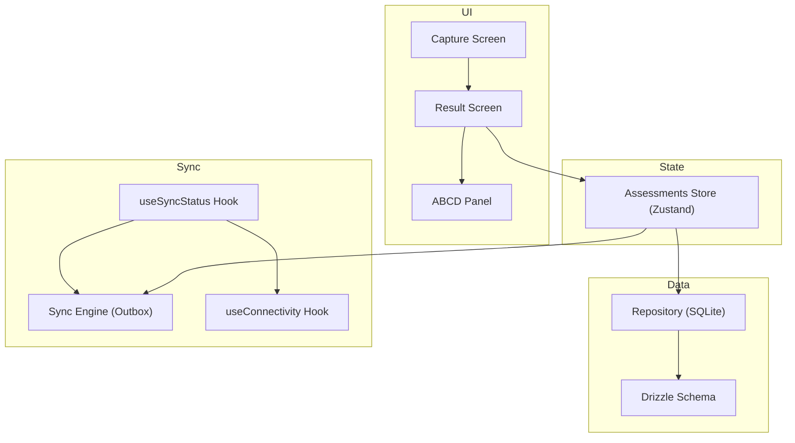
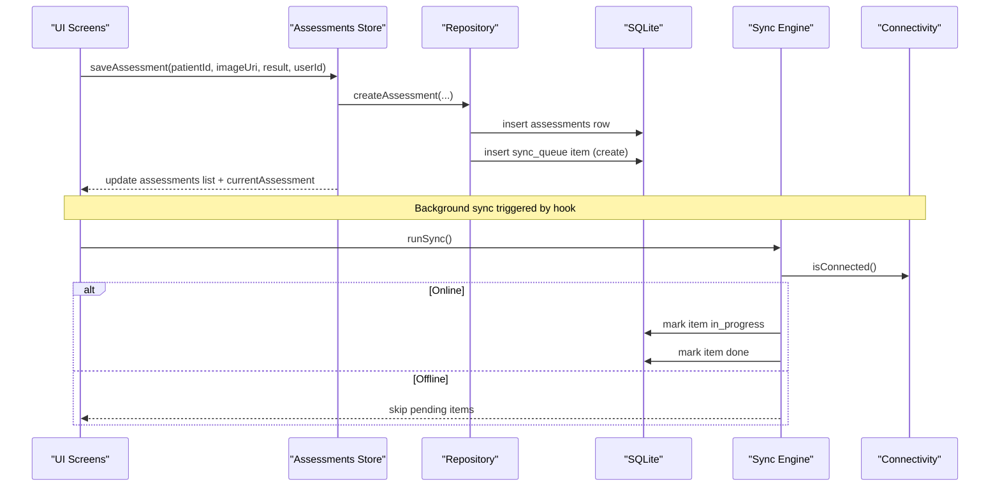
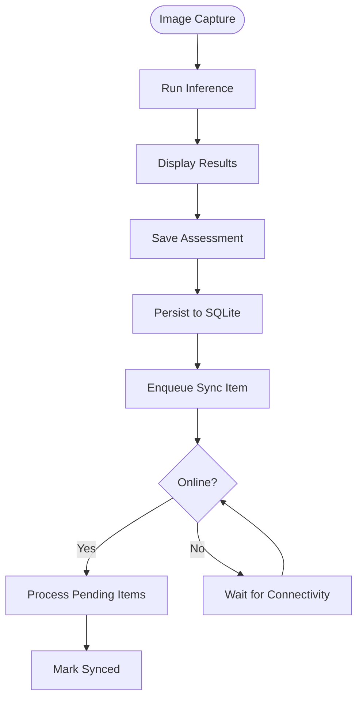
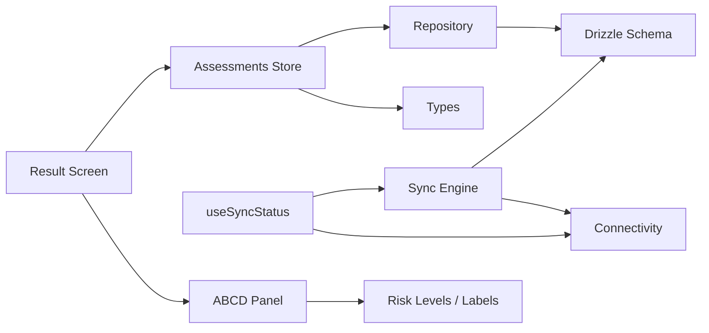
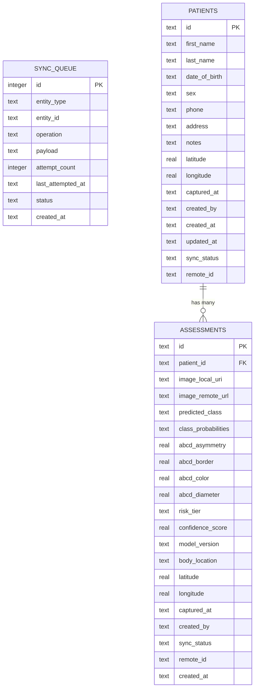
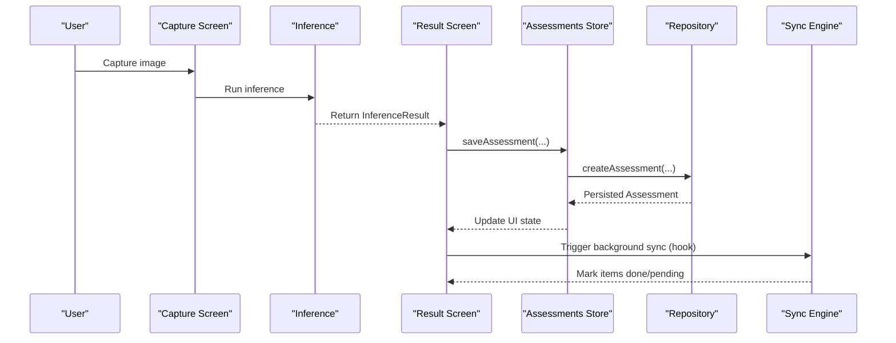

# Assessment State Management

<cite>
**Referenced Files in This Document**
- [store.ts](file://src/features/assessments/store.ts)
- [repository.ts](file://src/features/assessments/repository.ts)
- [types.ts](file://src/features/assessments/types.ts)
- [index.ts](file://src/types/index.ts)
- [schema.ts](file://src/db/schema.ts)
- [syncEngine.ts](file://src/features/sync/syncEngine.ts)
- [useSyncStatus.ts](file://src/hooks/useSyncStatus.ts)
- [useConnectivity.ts](file://src/hooks/useConnectivity.ts)
- [classify.ts](file://src/features/assessments/inference/classify.ts)
- [riskMapping.ts](file://src/features/assessments/inference/riskMapping.ts)
- [ABCDPanel.tsx](file://src/components/assessment/ABCDPanel.tsx)
- [result.tsx](file://src/app/(app)/patients/[patientId]/result.tsx)
- [capture.tsx](file://src/app/(app)/patients/[patientId]/capture.tsx)
- [riskLevels.ts](file://src/constants/riskLevels.ts)
</cite>

## Table of Contents
1. [Introduction](#introduction)
2. [Project Structure](#project-structure)
3. [Core Components](#core-components)
4. [Architecture Overview](#architecture-overview)
5. [Detailed Component Analysis](#detailed-component-analysis)
6. [Dependency Analysis](#dependency-analysis)
7. [Performance Considerations](#performance-considerations)
8. [Troubleshooting Guide](#troubleshooting-guide)
9. [Conclusion](#conclusion)
10. [Appendices](#appendices)

## Introduction
This document explains the assessment state management system built with Zustand stores, focusing on how assessments are created, persisted, synchronized, and displayed. It covers:
- Store architecture for managing pending assessments, current analysis state, and result caching
- Integration with synchronization hooks for background data sync and offline-first patterns
- State transitions during the assessment lifecycle from image capture through result display
- Examples of store actions, selectors (via derived state), and middleware-like patterns for complex operations
- Performance considerations for large datasets, memory management for images, and state persistence strategies
- The relationship between assessment state and UI components such as the ABCD panel and risk visualization

## Project Structure
The assessment feature is organized into a clear separation of concerns:
- Feature store (Zustand) encapsulates in-memory state and actions
- Repository layer abstracts SQLite CRUD via Drizzle ORM
- Sync engine implements an outbox pattern to persist and later upload changes
- Hooks provide UI integration for connectivity and sync status
- UI screens consume store state and render results and explainability panels

**Diagram sources**
- [store.ts:29-81](file://src/features/assessments/store.ts#L29-L81)
- [repository.ts:11-123](file://src/features/assessments/repository.ts#L11-L123)
- [schema.ts:42-92](file://src/db/schema.ts#L42-L92)
- [syncEngine.ts:55-110](file://src/features/sync/syncEngine.ts#L55-L110)
- [useSyncStatus.ts:9-45](file://src/hooks/useSyncStatus.ts#L9-L45)
- [useConnectivity.ts:8-17](file://src/hooks/useConnectivity.ts#L8-L17)
- [ABCDPanel.tsx:19-67](file://src/components/assessment/ABCDPanel.tsx#L19-L67)
- [result.tsx:16-127](file://src/app/(app)/patients/[patientId]/result.tsx#L16-L127)

**Section sources**
- [store.ts:29-81](file://src/features/assessments/store.ts#L29-L81)
- [repository.ts:11-123](file://src/features/assessments/repository.ts#L11-L123)
- [schema.ts:42-92](file://src/db/schema.ts#L42-L92)
- [syncEngine.ts:55-110](file://src/features/sync/syncEngine.ts#L55-L110)
- [useSyncStatus.ts:9-45](file://src/hooks/useSyncStatus.ts#L9-L45)
- [useConnectivity.ts:8-17](file://src/hooks/useConnectivity.ts#L8-L17)
- [ABCDPanel.tsx:19-67](file://src/components/assessment/ABCDPanel.tsx#L19-L67)
- [result.tsx:16-127](file://src/app/(app)/patients/[patientId]/result.tsx#L16-L127)

## Core Components
- Assessments Store (Zustand): Holds lists of assessments, current assessment, counts, loading flags, and provides actions to load by patient, load all, update counts, set current assessment, and save new assessments.
- Repository: Encapsulates SQLite queries using Drizzle ORM for assessments and sync queue operations.
- Sync Engine: Implements an outbox pattern to process pending items with retry and backoff; integrates with connectivity checks.
- Hooks: useSyncStatus tracks pending count and triggers sync; useConnectivity monitors online/offline state.
- Inference Utilities: Mock inference that returns realistic probabilities, ABCD scores, and risk tier mapping.
- UI Components: ABCDPanel visualizes explainability scores; Result screen renders diagnosis, confidence, class probabilities, and risk tier.

Key responsibilities:
- Store actions coordinate UI updates and trigger repository writes
- Repository persists assessments locally and enqueues sync tasks
- Sync engine runs in background when online, marking items done or failed
- Hooks expose sync status to UI and react to connectivity changes

**Section sources**
- [store.ts:29-81](file://src/features/assessments/store.ts#L29-L81)
- [repository.ts:11-123](file://src/features/assessments/repository.ts#L11-L123)
- [syncEngine.ts:55-110](file://src/features/sync/syncEngine.ts#L55-L110)
- [useSyncStatus.ts:9-45](file://src/hooks/useSyncStatus.ts#L9-L45)
- [useConnectivity.ts:8-17](file://src/hooks/useConnectivity.ts#L8-L17)
- [classify.ts:14-53](file://src/features/assessments/inference/classify.ts#L14-L53)
- [riskMapping.ts:8-14](file://src/features/assessments/inference/riskMapping.ts#L8-L14)
- [ABCDPanel.tsx:19-67](file://src/components/assessment/ABCDPanel.tsx#L19-L67)
- [result.tsx:16-127](file://src/app/(app)/patients/[patientId]/result.tsx#L16-L127)

## Architecture Overview
The system follows an offline-first design:
- All user interactions write to local SQLite immediately
- A sync queue records operations to be sent to remote storage when online
- Background sync processes queued items with retries and exponential backoff
- UI remains responsive and never waits on network

**Diagram sources**
- [store.ts:68-80](file://src/features/assessments/store.ts#L68-L80)
- [repository.ts:53-123](file://src/features/assessments/repository.ts#L53-L123)
- [syncEngine.ts:55-110](file://src/features/sync/syncEngine.ts#L55-L110)
- [useSyncStatus.ts:20-30](file://src/hooks/useSyncStatus.ts#L20-L30)
- [useConnectivity.ts:8-17](file://src/hooks/useConnectivity.ts#L8-L17)

## Detailed Component Analysis

### Assessments Store (Zustand)
- State fields:
  - assessments: array of stored assessments
  - currentAssessment: currently selected assessment
  - totalCount: total number of assessments
  - pendingSyncCount: number of pending sync items
  - isLoading: loading indicator for async operations
- Actions:
  - loadByPatient(patientId): fetches assessments for a specific patient
  - loadAll(): fetches all assessments
  - loadCounts(): loads total and pending sync counts
  - setCurrentAssessment(assessment): sets the active assessment
  - saveAssessment(patientId, imageUri, result, userId): creates assessment, enqueues sync, updates store
- Derived selectors:
  - While not explicitly defined as selectors, consumers can derive filtered lists or computed values from assessments and currentAssessment within components or custom hooks

Complex operation example:
- saveAssessment orchestrates repository creation and immediate store update, ensuring UI reflects the latest state without waiting for network

**Section sources**
- [store.ts:9-27](file://src/features/assessments/store.ts#L9-L27)
- [store.ts:29-81](file://src/features/assessments/store.ts#L29-L81)

### Repository Layer
- Provides typed CRUD functions for assessments and sync queue
- Maps database rows to domain models
- Enqueues sync operations upon creation

Key behaviors:
- getAssessmentsByPatient(patientId): ordered by creation date descending
- getAllAssessments(): ordered by creation date descending
- getAssessmentCount(): returns total count
- getPendingSyncCount(): counts assessments with pending sync status
- createAssessment(...): inserts assessment and sync queue entry

**Section sources**
- [repository.ts:11-51](file://src/features/assessments/repository.ts#L11-L51)
- [repository.ts:53-123](file://src/features/assessments/repository.ts#L53-L123)
- [repository.ts:125-149](file://src/features/assessments/repository.ts#L125-L149)

### Sync Engine (Outbox Pattern)
- Processes pending sync items when online
- Marks items in_progress before attempting upload
- On success, marks done; on failure, increments attemptCount and applies exponential backoff
- Supports retry of specific failed items

Integration points:
- Uses connectivity check to avoid unnecessary work when offline
- Exposes functions to get pending items, run sync, and retry

**Section sources**
- [syncEngine.ts:24-50](file://src/features/sync/syncEngine.ts#L24-L50)
- [syncEngine.ts:55-110](file://src/features/sync/syncEngine.ts#L55-L110)
- [syncEngine.ts:115-125](file://src/features/sync/syncEngine.ts#L115-L125)

### Synchronization Hooks
- useSyncStatus:
  - Tracks pending count, syncing state, last synced timestamp
  - Triggers sync when connected and not already syncing
  - Polls pending count periodically
- useConnectivity:
  - Subscribes to connectivity changes and exposes isConnected flag

**Section sources**
- [useSyncStatus.ts:9-45](file://src/hooks/useSyncStatus.ts#L9-L45)
- [useConnectivity.ts:8-17](file://src/hooks/useConnectivity.ts#L8-L17)

### Inference and Risk Mapping
- classify.ts:
  - Simulates inference delay
  - Generates normalized probabilities across model labels
  - Computes predicted class, confidence score, ABCD scores, and risk tier
- riskMapping.ts:
  - Maps diagnosis classes to risk tiers and provides display info

**Section sources**
- [classify.ts:14-53](file://src/features/assessments/inference/classify.ts#L14-L53)
- [riskMapping.ts:8-14](file://src/features/assessments/inference/riskMapping.ts#L8-L14)
- [riskLevels.ts:19-62](file://src/constants/riskLevels.ts#L19-L62)

### UI Components and Screens
- ABCDPanel:
  - Renders four bars for Asymmetry, Border, Color, Diameter
  - Colors reflect severity thresholds
- Result Screen:
  - Displays top diagnosis, confidence, class probability breakdown, and ABCD panel
  - Integrates risk tier badge and recommended action hints
- Capture Screen:
  - Placeholder camera flow leading to review/result

Lifecycle flow:
- Capture -> Inference -> Result -> Save -> Store Update -> Sync Queue

**Diagram sources**
- [capture.tsx:16-23](file://src/app/(app)/patients/[patientId]/capture.tsx#L16-L23)
- [classify.ts:14-53](file://src/features/assessments/inference/classify.ts#L14-L53)
- [result.tsx:16-127](file://src/app/(app)/patients/[patientId]/result.tsx#L16-L127)
- [repository.ts:53-123](file://src/features/assessments/repository.ts#L53-L123)
- [syncEngine.ts:55-110](file://src/features/sync/syncEngine.ts#L55-L110)

**Section sources**
- [ABCDPanel.tsx:19-67](file://src/components/assessment/ABCDPanel.tsx#L19-L67)
- [result.tsx:16-127](file://src/app/(app)/patients/[patientId]/result.tsx#L16-L127)
- [capture.tsx:16-23](file://src/app/(app)/patients/[patientId]/capture.tsx#L16-L23)

## Dependency Analysis
- Store depends on repository for data access and persistence
- Repository depends on Drizzle schema and SQLite client
- Sync engine depends on connectivity and database schema
- Hooks depend on sync engine and connectivity utilities
- UI components depend on types and constants for rendering

**Diagram sources**
- [store.ts:29-81](file://src/features/assessments/store.ts#L29-L81)
- [repository.ts:11-123](file://src/features/assessments/repository.ts#L11-L123)
- [schema.ts:42-92](file://src/db/schema.ts#L42-L92)
- [syncEngine.ts:55-110](file://src/features/sync/syncEngine.ts#L55-L110)
- [useSyncStatus.ts:9-45](file://src/hooks/useSyncStatus.ts#L9-L45)
- [useConnectivity.ts:8-17](file://src/hooks/useConnectivity.ts#L8-L17)
- [ABCDPanel.tsx:19-67](file://src/components/assessment/ABCDPanel.tsx#L19-L67)
- [riskLevels.ts:19-62](file://src/constants/riskLevels.ts#L19-L62)

**Section sources**
- [store.ts:29-81](file://src/features/assessments/store.ts#L29-L81)
- [repository.ts:11-123](file://src/features/assessments/repository.ts#L11-L123)
- [schema.ts:42-92](file://src/db/schema.ts#L42-L92)
- [syncEngine.ts:55-110](file://src/features/sync/syncEngine.ts#L55-L110)
- [useSyncStatus.ts:9-45](file://src/hooks/useSyncStatus.ts#L9-L45)
- [useConnectivity.ts:8-17](file://src/hooks/useConnectivity.ts#L8-L17)
- [ABCDPanel.tsx:19-67](file://src/components/assessment/ABCDPanel.tsx#L19-L67)
- [riskLevels.ts:19-62](file://src/constants/riskLevels.ts#L19-L62)

## Performance Considerations
- Large datasets:
  - Prefer paginated queries or virtualized lists for long assessment histories
  - Use targeted loads (loadByPatient) instead of loadAll where possible
  - Avoid storing full image binaries in memory; keep only URIs and lazy-load images
- Memory management:
  - Reuse inference results and avoid recomputation; cache results per image URI if needed
  - Clear currentAssessment when navigating away to prevent stale references
  - Debounce heavy computations (e.g., probability normalization) if performed in UI threads
- State persistence:
  - Local SQLite ensures durability; ensure consistent schema migrations
  - Outbox pattern guarantees eventual consistency; monitor failed items and implement manual retry flows
- Sync efficiency:
  - Batch operations where feasible to reduce network calls
  - Respect connectivity state to avoid redundant sync attempts
  - Implement exponential backoff and max retries to handle transient failures

[No sources needed since this section provides general guidance]

## Troubleshooting Guide
Common issues and resolutions:
- Sync stuck in pending:
  - Check connectivity; ensure runSync is called when online
  - Inspect sync queue for failed items and retry them
- Missing assessments after app restart:
  - Verify repository reads from SQLite and maps rows correctly
  - Ensure loadByPatient or loadAll is invoked on screen mount
- Incorrect risk tier or ABCD scores:
  - Validate inference outputs and risk mapping logic
  - Confirm constants and label mappings are up-to-date
- UI not reflecting latest state:
  - Ensure store actions update assessments and currentAssessment
  - Confirm hooks refresh counts and sync status at intervals

**Section sources**
- [syncEngine.ts:55-110](file://src/features/sync/syncEngine.ts#L55-L110)
- [repository.ts:125-149](file://src/features/assessments/repository.ts#L125-L149)
- [store.ts:29-81](file://src/features/assessments/store.ts#L29-L81)
- [useSyncStatus.ts:9-45](file://src/hooks/useSyncStatus.ts#L9-L45)

## Conclusion
The assessment state management system leverages Zustand for reactive UI state, SQLite for durable local storage, and an outbox-based sync engine for reliable background synchronization. This design supports offline-first workflows, maintains responsiveness under network variability, and provides rich visualizations for clinical decision support. By following the outlined patterns and performance recommendations, the system scales to larger datasets while preserving accuracy and usability.

[No sources needed since this section summarizes without analyzing specific files]

## Appendices

### Data Models

**Diagram sources**
- [schema.ts:18-75](file://src/db/schema.ts#L18-L75)
- [schema.ts:77-92](file://src/db/schema.ts#L77-L92)

### Example Store Actions and Selectors
- Actions:
  - loadByPatient(patientId): fetches assessments for a patient
  - loadAll(): fetches all assessments
  - loadCounts(): loads total and pending sync counts
  - setCurrentAssessment(assessment): sets the active assessment
  - saveAssessment(patientId, imageUri, result, userId): creates assessment and enqueues sync
- Selectors (derived state examples):
  - Filter assessments by risk tier
  - Compute average confidence score for recent assessments
  - Derive pending sync indicators for UI badges

**Section sources**
- [store.ts:29-81](file://src/features/assessments/store.ts#L29-L81)

### Lifecycle Sequence Diagram

**Diagram sources**
- [capture.tsx:16-23](file://src/app/(app)/patients/[patientId]/capture.tsx#L16-L23)
- [classify.ts:14-53](file://src/features/assessments/inference/classify.ts#L14-L53)
- [result.tsx:16-127](file://src/app/(app)/patients/[patientId]/result.tsx#L16-L127)
- [store.ts:68-80](file://src/features/assessments/store.ts#L68-L80)
- [repository.ts:53-123](file://src/features/assessments/repository.ts#L53-L123)
- [syncEngine.ts:55-110](file://src/features/sync/syncEngine.ts#L55-L110)