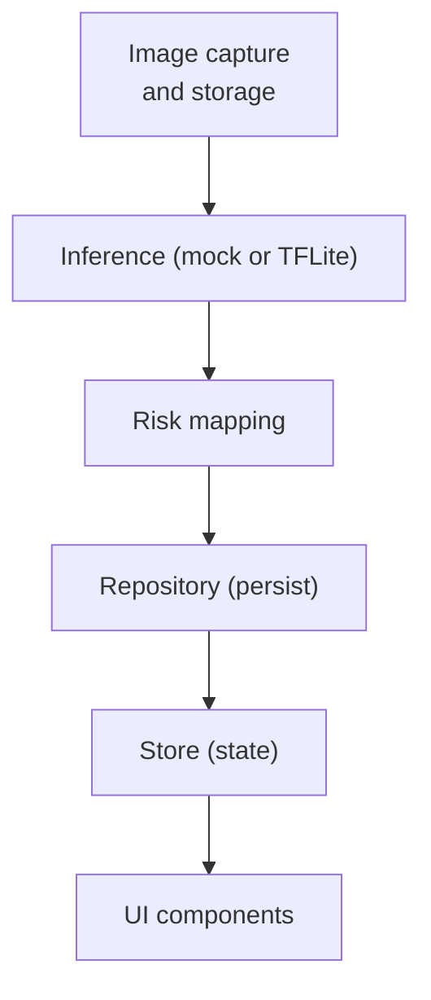
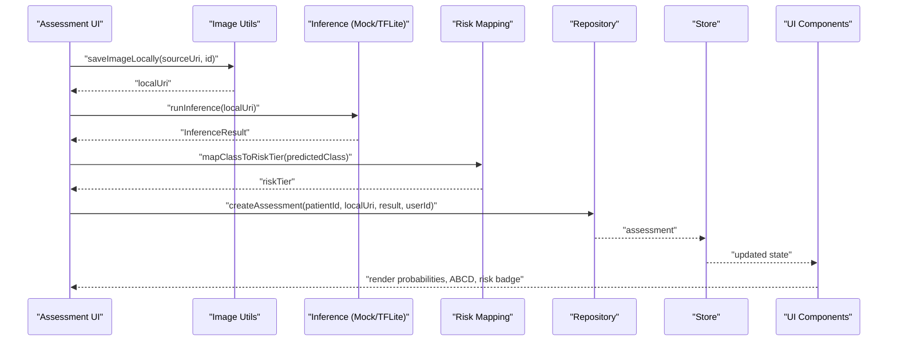
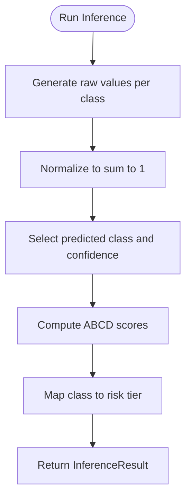
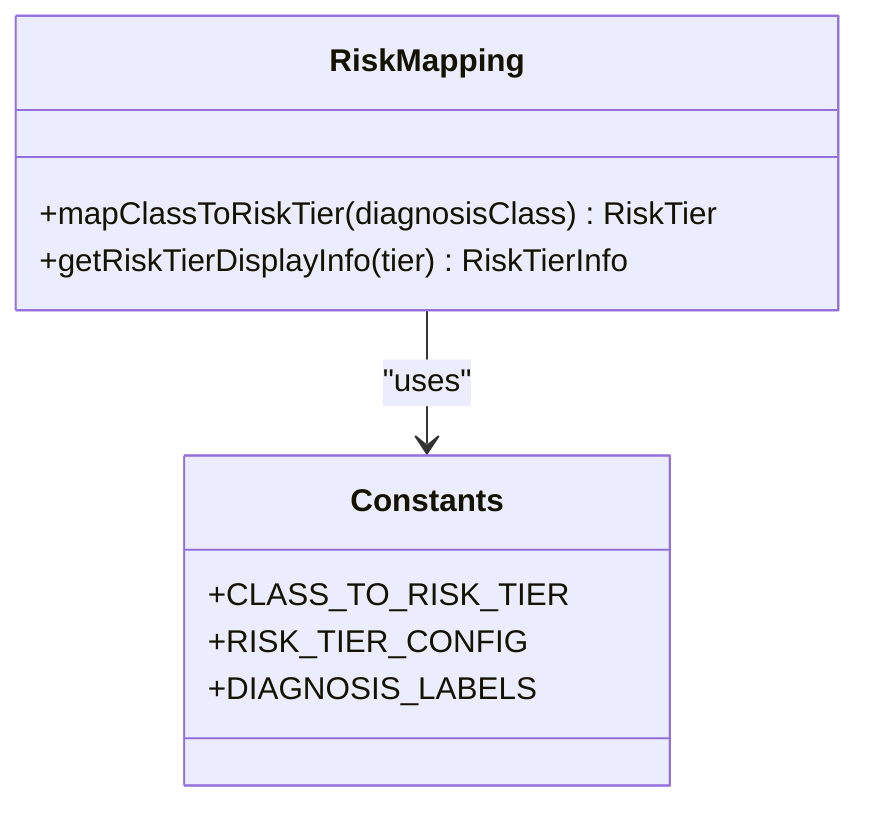
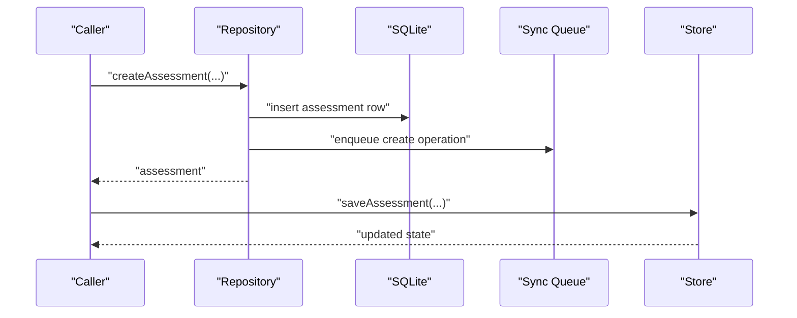
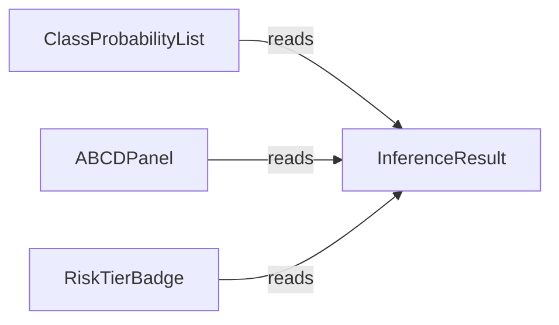
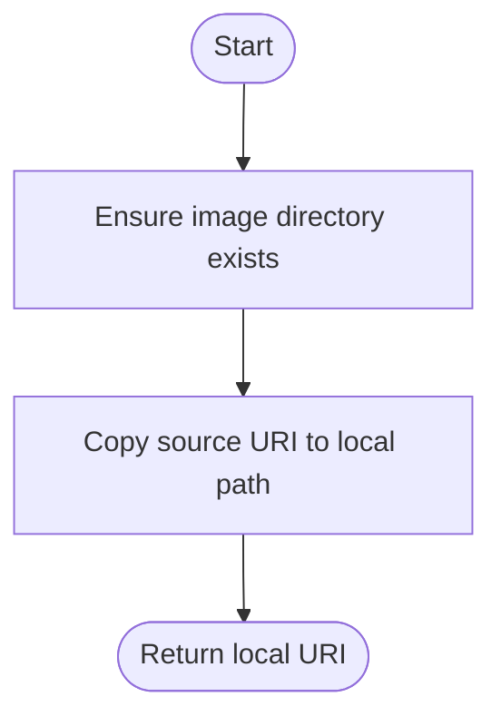
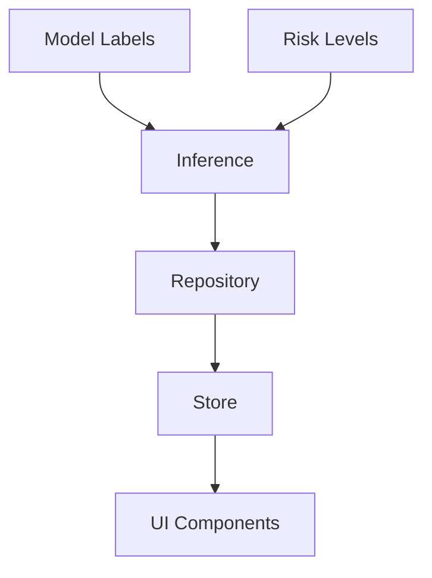

# ML Inference Pipeline

<cite>
**Referenced Files in This Document**
- [classify.ts](file://src/features/assessments/inference/classify.ts)
- [riskMapping.ts](file://src/features/assessments/inference/riskMapping.ts)
- [labels.ts](file://src/ml/labels.ts)
- [types/index.ts](file://src/types/index.ts)
- [constants/riskLevels.ts](file://src/constants/riskLevels.ts)
- [repository.ts](file://src/features/assessments/repository.ts)
- [store.ts](file://src/features/assessments/store.ts)
- [image.ts](file://src/utils/image.ts)
- [ClassProbabilityList.tsx](file://src/components/assessment/ClassProbabilityList.tsx)
- [ABCDPanel.tsx](file://src/components/assessment/ABCDPanel.tsx)
- [RiskTierBadge.tsx](file://src/components/assessment/RiskTierBadge.tsx)
- [ARCHITECTURE.md](file://ARCHITECTURE.md)
</cite>

## Table of Contents
1. [Introduction](#introduction)
2. [Project Structure](#project-structure)
3. [Core Components](#core-components)
4. [Architecture Overview](#architecture-overview)
5. [Detailed Component Analysis](#detailed-component-analysis)
6. [Dependency Analysis](#dependency-analysis)
7. [Performance Considerations](#performance-considerations)
8. [Troubleshooting Guide](#troubleshooting-guide)
9. [Conclusion](#conclusion)
10. [Appendices](#appendices)

## Introduction
This document explains the machine learning inference pipeline used by DermSight’s assessment engine. It covers:
- Image preprocessing and storage utilities used before inference
- The current mock inference implementation that simulates realistic ML outputs
- Risk mapping from model classes to clinical risk tiers
- How results are persisted and displayed in the UI
- Guidance for integrating a real TFLite model, including loading, input preparation, output interpretation, error handling, fallbacks, and debugging strategies

The goal is to make the pipeline understandable for both technical and non-technical readers while providing concrete integration steps for production-grade on-device inference.

## Project Structure
The ML inference pipeline spans several modules:
- Inference layer: mock inference and model availability checks
- Risk mapping: class-to-tier conversion and display info
- Data types: shared interfaces for assessments and inference results
- Storage: repository for persisting assessments and sync queue items
- UI components: rendering probabilities, ABCD scores, and risk tier badges
- Utilities: image storage helpers for local file management
- Architecture guide: conceptual flow and model conversion notes



**Diagram sources**
- [classify.ts:14-53](file://src/features/assessments/inference/classify.ts#L14-L53)
- [riskMapping.ts:8-13](file://src/features/assessments/inference/riskMapping.ts#L8-L13)
- [repository.ts:53-123](file://src/features/assessments/repository.ts#L53-L123)
- [store.ts:68-80](file://src/features/assessments/store.ts#L68-L80)
- [ClassProbabilityList.tsx:15-82](file://src/components/assessment/ClassProbabilityList.tsx#L15-L82)
- [ABCDPanel.tsx:19-67](file://src/components/assessment/ABCDPanel.tsx#L19-L67)
- [RiskTierBadge.tsx:15-39](file://src/components/assessment/RiskTierBadge.tsx#L15-L39)

**Section sources**
- [classify.ts:1-62](file://src/features/assessments/inference/classify.ts#L1-L62)
- [riskMapping.ts:1-15](file://src/features/assessments/inference/riskMapping.ts#L1-L15)
- [types/index.ts:38-97](file://src/types/index.ts#L38-L97)
- [repository.ts:1-150](file://src/features/assessments/repository.ts#L1-L150)
- [store.ts:1-82](file://src/features/assessments/store.ts#L1-L82)
- [image.ts:1-52](file://src/utils/image.ts#L1-L52)
- [ClassProbabilityList.tsx:1-83](file://src/components/assessment/ClassProbabilityList.tsx#L1-L83)
- [ABCDPanel.tsx:1-68](file://src/components/assessment/ABCDPanel.tsx#L1-L68)
- [RiskTierBadge.tsx:1-40](file://src/components/assessment/RiskTierBadge.tsx#L1-L40)
- [ARCHITECTURE.md:416-434](file://ARCHITECTURE.md#L416-L434)

## Core Components
- Mock inference module: generates normalized class probabilities across seven HAM10000 classes, selects the predicted class, computes confidence, produces ABCD concept scores, and maps to a risk tier.
- Risk mapping utility: converts diagnosis classes to app-level risk tiers and provides display information for UI.
- Shared types: define Assessment, InferenceResult, DiagnosisClass, and RiskTier used across features.
- Repository: persists assessments with all inference outputs into SQLite and enqueues sync operations.
- Store: coordinates state updates after saving an assessment.
- Image utilities: ensure directories exist, copy images locally, delete files, and compute sizes.
- UI components: render probability distributions, ABCD explainability bars, and risk tier badges.

**Section sources**
- [classify.ts:14-53](file://src/features/assessments/inference/classify.ts#L14-L53)
- [riskMapping.ts:8-13](file://src/features/assessments/inference/riskMapping.ts#L8-L13)
- [types/index.ts:38-97](file://src/types/index.ts#L38-L97)
- [repository.ts:53-123](file://src/features/assessments/repository.ts#L53-L123)
- [store.ts:68-80](file://src/features/assessments/store.ts#L68-L80)
- [image.ts:10-30](file://src/utils/image.ts#L10-L30)
- [ClassProbabilityList.tsx:15-82](file://src/components/assessment/ClassProbabilityList.tsx#L15-L82)
- [ABCDPanel.tsx:19-67](file://src/components/assessment/ABCDPanel.tsx#L19-L67)
- [RiskTierBadge.tsx:15-39](file://src/components/assessment/RiskTierBadge.tsx#L15-L39)

## Architecture Overview
The end-to-end flow integrates image handling, inference, risk mapping, persistence, and UI rendering. When integrated with a real TFLite model, the inference step will load a quantized model, prepare inputs, run a single forward pass, and interpret outputs as class probabilities and ABCD scores.



**Diagram sources**
- [image.ts:22-30](file://src/utils/image.ts#L22-L30)
- [classify.ts:14-53](file://src/features/assessments/inference/classify.ts#L14-L53)
- [riskMapping.ts:8-13](file://src/features/assessments/inference/riskMapping.ts#L8-L13)
- [repository.ts:53-123](file://src/features/assessments/repository.ts#L53-L123)
- [store.ts:68-80](file://src/features/assessments/store.ts#L68-L80)
- [ClassProbabilityList.tsx:15-82](file://src/components/assessment/ClassProbabilityList.tsx#L15-L82)
- [ABCDPanel.tsx:19-67](file://src/components/assessment/ABCDPanel.tsx#L19-L67)
- [RiskTierBadge.tsx:15-39](file://src/components/assessment/RiskTierBadge.tsx#L15-L39)

## Detailed Component Analysis

### Mock Inference Implementation
- Generates raw random values for each diagnosis class, normalizes them to form a probability distribution, identifies the highest-probability class, and computes confidence.
- Produces ABCD concept scores (asymmetry, border, color, diameter) in the 0–1 range.
- Maps the predicted class to a risk tier using the risk mapping utility.
- Provides a model availability check function intended to be extended to verify presence of a .tflite file at runtime.



**Diagram sources**
- [classify.ts:20-52](file://src/features/assessments/inference/classify.ts#L20-L52)
- [riskMapping.ts:8-13](file://src/features/assessments/inference/riskMapping.ts#L8-L13)

**Section sources**
- [classify.ts:14-53](file://src/features/assessments/inference/classify.ts#L14-L53)
- [riskMapping.ts:8-13](file://src/features/assessments/inference/riskMapping.ts#L8-L13)

### Risk Mapping
- Converts diagnosis classes to application-level risk tiers.
- Supplies display information for risk tiers used by UI components.



**Diagram sources**
- [riskMapping.ts:8-13](file://src/features/assessments/inference/riskMapping.ts#L8-L13)
- [constants/riskLevels.ts:54-120](file://src/constants/riskLevels.ts#L54-L120)

**Section sources**
- [riskMapping.ts:1-15](file://src/features/assessments/inference/riskMapping.ts#L1-L15)
- [constants/riskLevels.ts:19-120](file://src/constants/riskLevels.ts#L19-L120)

### Types and Labels
- Shared types define the structure of assessments and inference results, including fields for probabilities, ABCD scores, risk tier, and confidence.
- Model labels enumerate the seven HAM10000 classes and provide display names.

```mermaid
erDiagram
INFERENCE_RESULT {
map DiagnosisClass classProbabilities
string predictedClass
number confidenceScore
map abcdScores
string riskTier
}
ASSESSMENT {
string id
string patientId
string imageLocalUri
string predictedClass
map classProbabilities
number abcdAsymmetry
number abcdBorder
number abcdColor
number abcdDiameter
string riskTier
number confidenceScore
string modelVersion
}
```

**Diagram sources**
- [types/index.ts:42-97](file://src/types/index.ts#L42-L97)
- [ml/labels.ts:7-25](file://src/ml/labels.ts#L7-L25)

**Section sources**
- [types/index.ts:38-97](file://src/types/index.ts#L38-L97)
- [ml/labels.ts:1-26](file://src/ml/labels.ts#L1-L26)

### Persistence and State
- Repository creates assessments with full inference outputs, persists them to SQLite, and enqueues sync operations.
- Store updates global state after saving, enabling UI refresh.



**Diagram sources**
- [repository.ts:53-123](file://src/features/assessments/repository.ts#L53-L123)
- [store.ts:68-80](file://src/features/assessments/store.ts#L68-L80)

**Section sources**
- [repository.ts:1-150](file://src/features/assessments/repository.ts#L1-L150)
- [store.ts:1-82](file://src/features/assessments/store.ts#L1-L82)

### UI Rendering
- Probability list displays all seven classes sorted by probability, highlights the predicted class, and shows percentages.
- ABCD panel visualizes four concept scores with color-coded bars based on thresholds.
- Risk tier badge shows tier label, color, and optional action guidance.



**Diagram sources**
- [ClassProbabilityList.tsx:15-82](file://src/components/assessment/ClassProbabilityList.tsx#L15-L82)
- [ABCDPanel.tsx:19-67](file://src/components/assessment/ABCDPanel.tsx#L19-L67)
- [RiskTierBadge.tsx:15-39](file://src/components/assessment/RiskTierBadge.tsx#L15-L39)

**Section sources**
- [ClassProbabilityList.tsx:1-83](file://src/components/assessment/ClassProbabilityList.tsx#L1-L83)
- [ABCDPanel.tsx:1-68](file://src/components/assessment/ABCDPanel.tsx#L1-L68)
- [RiskTierBadge.tsx:1-40](file://src/components/assessment/RiskTierBadge.tsx#L1-L40)

### Image Preprocessing Workflow
- Ensures a dedicated directory exists for assessment images.
- Copies captured images to local storage under the app’s private directory.
- Supports deletion and size inspection for UX and diagnostics.



**Diagram sources**
- [image.ts:10-30](file://src/utils/image.ts#L10-L30)

**Section sources**
- [image.ts:1-52](file://src/utils/image.ts#L1-L52)

## Dependency Analysis
Key dependencies and relationships:
- Inference depends on model labels and risk mapping to produce structured outputs.
- Repository depends on types and database schema to persist assessments and enqueue sync.
- Store orchestrates repository calls and updates UI state.
- UI components depend on constants and types to render consistent visuals.



**Diagram sources**
- [ml/labels.ts:7-25](file://src/ml/labels.ts#L7-L25)
- [constants/riskLevels.ts:54-120](file://src/constants/riskLevels.ts#L54-L120)
- [classify.ts:14-53](file://src/features/assessments/inference/classify.ts#L14-L53)
- [repository.ts:53-123](file://src/features/assessments/repository.ts#L53-L123)
- [store.ts:68-80](file://src/features/assessments/store.ts#L68-L80)
- [ClassProbabilityList.tsx:15-82](file://src/components/assessment/ClassProbabilityList.tsx#L15-L82)
- [ABCDPanel.tsx:19-67](file://src/components/assessment/ABCDPanel.tsx#L19-L67)
- [RiskTierBadge.tsx:15-39](file://src/components/assessment/RiskTierBadge.tsx#L15-L39)

**Section sources**
- [classify.ts:14-53](file://src/features/assessments/inference/classify.ts#L14-L53)
- [riskMapping.ts:8-13](file://src/features/assessments/inference/riskMapping.ts#L8-L13)
- [repository.ts:53-123](file://src/features/assessments/repository.ts#L53-L123)
- [store.ts:68-80](file://src/features/assessments/store.ts#L68-L80)

## Performance Considerations
- Use a cached TFLite interpreter instance loaded once and reused across runs to minimize startup overhead.
- Prefer INT8 quantization for models to reduce memory footprint and improve inference speed on mobile devices.
- Keep input tensors minimal: crop and resize to the model’s expected input shape, then normalize according to model requirements.
- Avoid unnecessary allocations during inference; reuse buffers where possible.
- Batch operations only if the model supports it; otherwise, process one image at a time to maintain responsiveness.
- Offload heavy work to background threads or workers to keep the UI smooth.
- Monitor device memory and CPU usage; consider adaptive quality settings when resources are constrained.

[No sources needed since this section provides general guidance]

## Troubleshooting Guide
Common issues and strategies:
- Model availability: implement a robust check for the presence of the .tflite file and version metadata; fall back gracefully if missing.
- Inference failures: wrap inference calls in try/catch blocks; log errors with context (image dimensions, model version, device specs).
- Input mismatch: validate image preprocessing parameters against model expectations; log mismatches early.
- Output validation: ensure probabilities sum to approximately 1 and ABCD scores are within expected ranges; flag anomalies.
- Persistence errors: handle SQLite insert failures; retry or mark records as failed for later review.
- UI inconsistencies: guard against undefined or malformed inference results; provide safe defaults and user feedback.

**Section sources**
- [classify.ts:58-61](file://src/features/assessments/inference/classify.ts#L58-L61)
- [repository.ts:53-123](file://src/features/assessments/repository.ts#L53-L123)
- [store.ts:36-64](file://src/features/assessments/store.ts#L36-L64)

## Conclusion
DermSight’s assessment engine currently uses a mock inference module that simulates realistic outputs aligned with the HAM10000 taxonomy and ABCD concept scoring. The pipeline integrates image storage, risk mapping, persistence, and UI rendering. Integrating a real TFLite model involves replacing the mock inference with model loading, input tensor preparation, execution, and output interpretation, while preserving existing risk mapping and persistence layers. Robust error handling, performance optimization, and clear fallback mechanisms are essential for reliable on-device deployment.

[No sources needed since this section summarizes without analyzing specific files]

## Appendices

### Integration Steps for Real TFLite Models
- Model loading:
  - Load the .tflite file from bundled assets or downloaded location.
  - Initialize a cached interpreter instance to avoid repeated loads.
- Input preparation:
  - Crop and resize images to the model’s expected input shape.
  - Normalize pixel values according to model training conventions.
  - Allocate and fill input tensors efficiently.
- Execution:
  - Run a single forward pass to obtain outputs.
  - Extract class probabilities and ABCD scores from the output tensors.
- Output interpretation:
  - Normalize probabilities if necessary; select the argmax as predicted class.
  - Compute confidence score from the top probability.
  - Map predicted class to risk tier using existing risk mapping utilities.
- Error handling:
  - Validate model file existence and version.
  - Handle tensor allocation and interpreter errors.
  - Provide fallback to mock inference if the real model fails.
- Debugging:
  - Log preprocessing parameters, model version, and device capabilities.
  - Validate output ranges and consistency.
  - Add unit tests comparing TFLite outputs against expected distributions.

[No sources needed since this section provides general guidance]