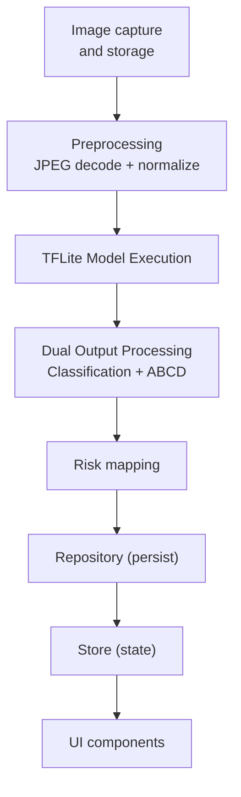
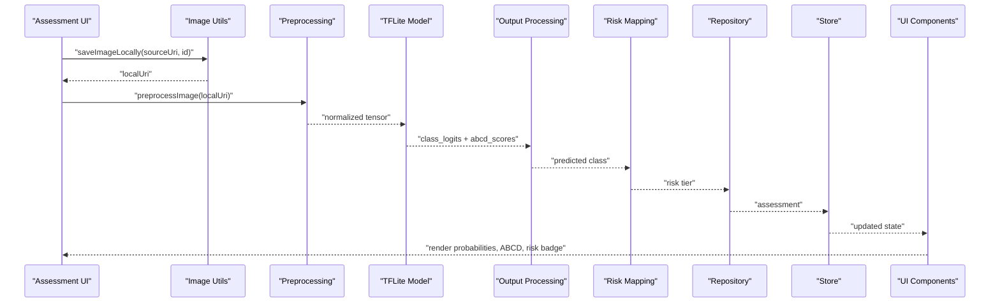
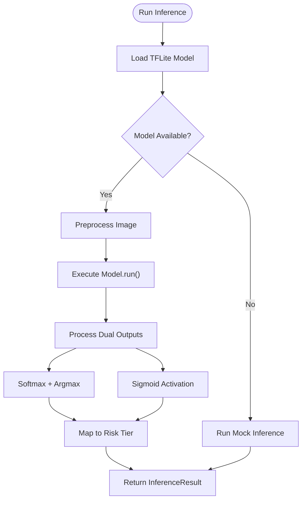
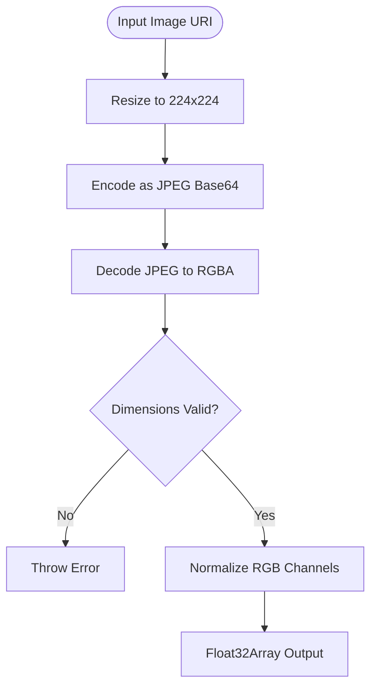
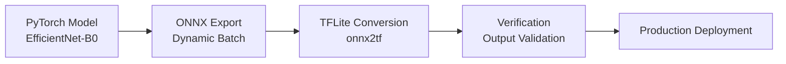
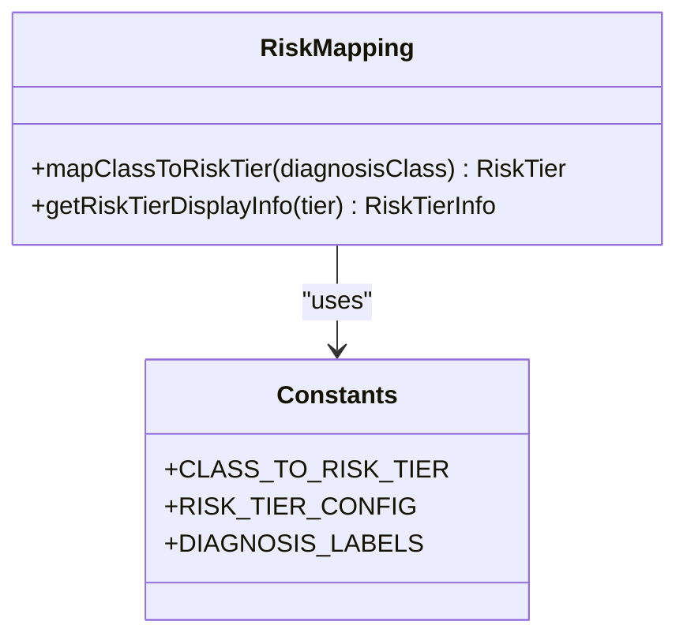
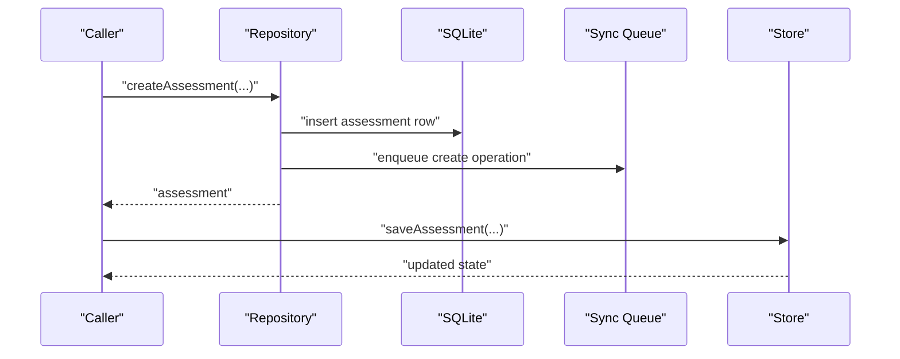
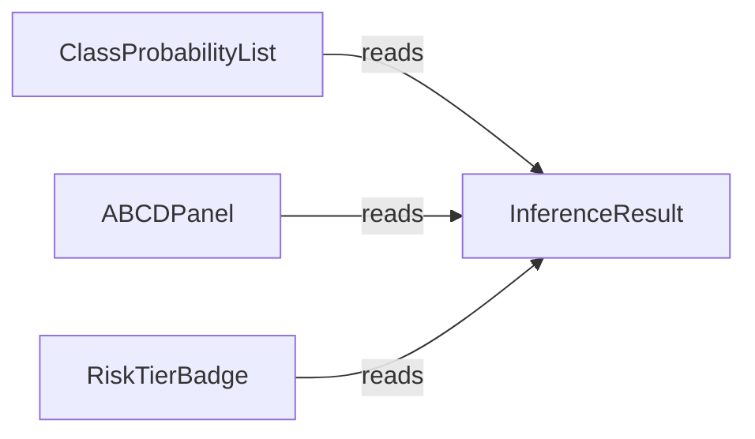
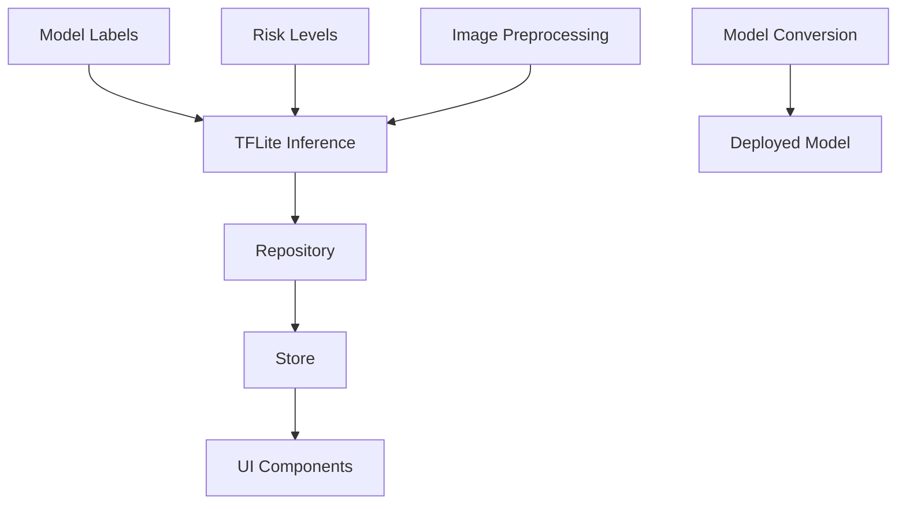

# ML Inference Pipeline

<cite>
**Referenced Files in This Document**
- [classify.ts](file://src/features/assessments/inference/classify.ts)
- [riskMapping.ts](file://src/features/assessments/inference/riskMapping.ts)
- [labels.ts](file://src/ml/labels.ts)
- [types/index.ts](file://src/types/index.ts)
- [constants/riskLevels.ts](file://src/constants/riskLevels.ts)
- [repository.ts](file://src/features/assessments/repository.ts)
- [store.ts](file://src/features/assessments/store.ts)
- [image.ts](file://src/utils/image.ts)
- [ClassProbabilityList.tsx](file://src/components/assessment/ClassProbabilityList.tsx)
- [ABCDPanel.tsx](file://src/components/assessment/ABCDPanel.tsx)
- [RiskTierBadge.tsx](file://src/components/assessment/RiskTierBadge.tsx)
- [convert_model.py](file://scripts/convert_model.py)
- [verify_conversion.py](file://scripts/verify_conversion.py)
- [ARCHITECTURE.md](file://ARCHITECTURE.md)
</cite>

## Update Summary
**Changes Made**
- Complete rewrite of inference logic from mock predictions to real TensorFlow Lite model execution
- Added comprehensive image preprocessing pipeline with JPEG decoding and normalization
- Implemented dual-output model support for both classification and ABCD scoring
- Enhanced error handling with fallback mechanisms to mock inference
- Updated architecture diagrams to reflect real TFLite integration
- Added model conversion and verification scripts documentation

## Table of Contents
1. [Introduction](#introduction)
2. [Project Structure](#project-structure)
3. [Core Components](#core-components)
4. [Architecture Overview](#architecture-overview)
5. [Detailed Component Analysis](#detailed-component-analysis)
6. [Dependency Analysis](#dependency-analysis)
7. [Performance Considerations](#performance-considerations)
8. [Troubleshooting Guide](#troubleshooting-guide)
9. [Conclusion](#conclusion)
10. [Appendices](#appendices)

## Introduction
This document explains the machine learning inference pipeline used by DermSight's assessment engine. The system has been completely rewritten to use real TensorFlow Lite models instead of mock predictions, providing production-grade on-device inference capabilities. It covers:
- Real TFLite model loading and execution with efficient memory management
- Comprehensive image preprocessing pipeline including JPEG decoding and normalization
- Dual-output model processing for both classification probabilities and ABCD concept scores
- Robust error handling with automatic fallback to mock predictions when models are unavailable
- Risk mapping from model classes to clinical risk tiers
- Model conversion pipeline from PyTorch to ONNX to TFLite format
- How results are persisted and displayed in the UI

The goal is to provide a complete understanding of the production-ready ML inference system while maintaining clear separation between model execution and business logic.

## Project Structure
The ML inference pipeline spans several modules with clear separation of concerns:
- **Inference layer**: Real TFLite model execution with preprocessing and fallback mechanisms
- **Model conversion**: Scripts for converting trained models to deployment format
- **Risk mapping**: Class-to-tier conversion and display information
- **Data types**: Shared interfaces for assessments and inference results
- **Storage**: Repository for persisting assessments and sync queue items
- **UI components**: Rendering probabilities, ABCD scores, and risk tier badges
- **Utilities**: Image storage helpers for local file management



**Diagram sources**
- [classify.ts:69-107](file://src/features/assessments/inference/classify.ts#L69-L107)
- [classify.ts:152-202](file://src/features/assessments/inference/classify.ts#L152-L202)
- [riskMapping.ts:8-13](file://src/features/assessments/inference/riskMapping.ts#L8-L13)
- [repository.ts:53-123](file://src/features/assessments/repository.ts#L53-L123)
- [store.ts:68-80](file://src/features/assessments/store.ts#L68-L80)
- [ClassProbabilityList.tsx:15-82](file://src/components/assessment/ClassProbabilityList.tsx#L15-L82)
- [ABCDPanel.tsx:19-67](file://src/components/assessment/ABCDPanel.tsx#L19-L67)
- [RiskTierBadge.tsx:15-39](file://src/components/assessment/RiskTierBadge.tsx#L15-L39)

**Section sources**
- [classify.ts:1-212](file://src/features/assessments/inference/classify.ts#L1-L212)
- [riskMapping.ts:1-15](file://src/features/assessments/inference/riskMapping.ts#L1-L15)
- [types/index.ts:38-97](file://src/types/index.ts#L38-L97)
- [repository.ts:1-150](file://src/features/assessments/repository.ts#L1-L150)
- [store.ts:1-82](file://src/features/assessments/store.ts#L1-L82)
- [image.ts:1-52](file://src/utils/image.ts#L1-L52)
- [ClassProbabilityList.tsx:1-95](file://src/components/assessment/ClassProbabilityList.tsx#L1-L95)
- [ABCDPanel.tsx:1-80](file://src/components/assessment/ABCDPanel.tsx#L1-L80)
- [RiskTierBadge.tsx:1-40](file://src/components/assessment/RiskTierBadge.tsx#L1-L40)
- [convert_model.py:1-117](file://scripts/convert_model.py#L1-L117)
- [ARCHITECTURE.md:416-434](file://ARCHITECTURE.md#L416-L434)

## Core Components
- **Real TFLite inference module**: Loads quantized EfficientNet-B0 model, performs image preprocessing with JPEG decoding and normalization, executes model inference, and processes dual outputs for classification and ABCD scoring
- **Model caching system**: Implements singleton pattern for efficient model loading with platform-specific handling (web vs mobile)
- **Image preprocessing pipeline**: Resizes images to 224x224, decodes JPEG format, normalizes pixel values using ImageNet statistics
- **Dual output processing**: Handles both classification logits (softmax probabilities) and ABCD concept scores (sigmoid activation)
- **Fallback mechanism**: Automatically falls back to mock inference when TFLite models are unavailable or fail to load
- **Risk mapping utility**: Converts diagnosis classes to app-level risk tiers with display information
- **Shared types**: Define Assessment, InferenceResult, DiagnosisClass, and RiskTier used across features
- **Repository**: Persists assessments with all inference outputs into SQLite and enqueues sync operations
- **Store**: Coordinates state updates after saving an assessment
- **Image utilities**: Ensure directories exist, copy images locally, delete files, and compute sizes
- **UI components**: Render probability distributions, ABCD explainability bars, and risk tier badges

**Section sources**
- [classify.ts:30-47](file://src/features/assessments/inference/classify.ts#L30-L47)
- [classify.ts:69-107](file://src/features/assessments/inference/classify.ts#L69-L107)
- [classify.ts:152-202](file://src/features/assessments/inference/classify.ts#L152-L202)
- [riskMapping.ts:8-13](file://src/features/assessments/inference/riskMapping.ts#L8-L13)
- [types/index.ts:38-97](file://src/types/index.ts#L38-L97)
- [repository.ts:53-123](file://src/features/assessments/repository.ts#L53-L123)
- [store.ts:68-80](file://src/features/assessments/store.ts#L68-L80)
- [image.ts:10-30](file://src/utils/image.ts#L10-L30)
- [ClassProbabilityList.tsx:15-82](file://src/components/assessment/ClassProbabilityList.tsx#L15-L82)
- [ABCDPanel.tsx:19-67](file://src/components/assessment/ABCDPanel.tsx#L19-L67)
- [RiskTierBadge.tsx:15-39](file://src/components/assessment/RiskTierBadge.tsx#L15-L39)

## Architecture Overview
The end-to-end flow integrates image handling, real TFLite inference, risk mapping, persistence, and UI rendering. The system uses an EfficientNet-B0 backbone with dual heads for classification and ABCD scoring, converted from PyTorch through ONNX to TFLite format.



**Diagram sources**
- [image.ts:22-30](file://src/utils/image.ts#L22-L30)
- [classify.ts:69-107](file://src/features/assessments/inference/classify.ts#L69-L107)
- [classify.ts:152-202](file://src/features/assessments/inference/classify.ts#L152-L202)
- [riskMapping.ts:8-13](file://src/features/assessments/inference/riskMapping.ts#L8-L13)
- [repository.ts:53-123](file://src/features/assessments/repository.ts#L53-L123)
- [store.ts:68-80](file://src/features/assessments/store.ts#L68-L80)
- [ClassProbabilityList.tsx:15-82](file://src/components/assessment/ClassProbabilityList.tsx#L15-L82)
- [ABCDPanel.tsx:19-67](file://src/components/assessment/ABCDPanel.tsx#L19-L67)
- [RiskTierBadge.tsx:15-39](file://src/components/assessment/RiskTierBadge.tsx#L15-L39)

## Detailed Component Analysis

### Real TFLite Inference Implementation
The inference system now uses a real EfficientNet-B0 model converted to TFLite format with dual outputs:
- **Model loading**: Uses react-native-fast-tflite library with cached interpreter instance for performance
- **Platform handling**: Returns null on web platform, falling back to mock inference automatically
- **Memory optimization**: Implements singleton pattern to avoid repeated model loading
- **Error resilience**: Graceful fallback to mock predictions when model loading fails



**Diagram sources**
- [classify.ts:30-47](file://src/features/assessments/inference/classify.ts#L30-L47)
- [classify.ts:152-202](file://src/features/assessments/inference/classify.ts#L152-L202)
- [riskMapping.ts:8-13](file://src/features/assessments/inference/riskMapping.ts#L8-L13)

**Section sources**
- [classify.ts:30-47](file://src/features/assessments/inference/classify.ts#L30-L47)
- [classify.ts:152-202](file://src/features/assessments/inference/classify.ts#L152-L202)
- [riskMapping.ts:8-13](file://src/features/assessments/inference/riskMapping.ts#L8-L13)

### Image Preprocessing Pipeline
Comprehensive preprocessing pipeline handles image transformation and normalization:
- **Image manipulation**: Uses expo-image-manipulator to resize to 224x224 pixels
- **JPEG decoding**: Converts base64 to Uint8Array and decodes using jpeg-js library
- **Normalization**: Applies ImageNet mean/std normalization for RGB channels
- **Validation**: Ensures decoded dimensions match expected input size
- **Memory efficiency**: Creates Float32Array directly without intermediate allocations



**Diagram sources**
- [classify.ts:69-107](file://src/features/assessments/inference/classify.ts#L69-L107)

**Section sources**
- [classify.ts:69-107](file://src/features/assessments/inference/classify.ts#L69-L107)

### Model Conversion Pipeline
Complete model conversion workflow from training to deployment:
- **PyTorch model**: EfficientNet-B0 backbone with dual heads for classification and ABCD scoring
- **ONNX export**: Dynamic batch support with proper input/output naming
- **TFLite conversion**: Uses onnx2tf toolchain for optimal mobile deployment
- **Verification**: Validates output consistency between PyTorch and TFLite implementations



**Diagram sources**
- [convert_model.py:27-54](file://scripts/convert_model.py#L27-L54)
- [convert_model.py:77-112](file://scripts/convert_model.py#L77-L112)
- [verify_conversion.py:56-89](file://scripts/verify_conversion.py#L56-L89)

**Section sources**
- [convert_model.py:27-54](file://scripts/convert_model.py#L27-L54)
- [convert_model.py:77-112](file://scripts/convert_model.py#L77-L112)
- [verify_conversion.py:56-89](file://scripts/verify_conversion.py#L56-L89)

### Risk Mapping
- Converts diagnosis classes to application-level risk tiers
- Supplies display information for risk tiers used by UI components



**Diagram sources**
- [riskMapping.ts:8-13](file://src/features/assessments/inference/riskMapping.ts#L8-L13)
- [constants/riskLevels.ts:64-96](file://src/constants/riskLevels.ts#L64-L96)

**Section sources**
- [riskMapping.ts:1-15](file://src/features/assessments/inference/riskMapping.ts#L1-L15)
- [constants/riskLevels.ts:64-96](file://src/constants/riskLevels.ts#L64-L96)

### Types and Labels
- Shared types define the structure of assessments and inference results, including fields for probabilities, ABCD scores, risk tier, and confidence
- Model labels enumerate the seven HAM10000 classes and provide display names

```mermaid
erDiagram
INFERENCE_RESULT {
map DiagnosisClass classProbabilities
string predictedClass
number confidenceScore
map abcdScores
string riskTier
}
ASSESSMENT {
string id
string patientId
string imageLocalUri
string predictedClass
map classProbabilities
number abcdAsymmetry
number abcdBorder
number abcdColor
number abcdDiameter
string riskTier
number confidenceScore
string modelVersion
}
```

**Diagram sources**
- [types/index.ts:42-97](file://src/types/index.ts#L42-L97)
- [ml/labels.ts:7-25](file://src/ml/labels.ts#L7-L25)

**Section sources**
- [types/index.ts:38-97](file://src/types/index.ts#L38-L97)
- [ml/labels.ts:1-26](file://src/ml/labels.ts#L1-L26)

### Persistence and State
- Repository creates assessments with full inference outputs, persists them to SQLite, and enqueues sync operations
- Store updates global state after saving, enabling UI refresh



**Diagram sources**
- [repository.ts:53-123](file://src/features/assessments/repository.ts#L53-L123)
- [store.ts:68-80](file://src/features/assessments/store.ts#L68-L80)

**Section sources**
- [repository.ts:1-150](file://src/features/assessments/repository.ts#L1-L150)
- [store.ts:1-82](file://src/features/assessments/store.ts#L1-L82)

### UI Rendering
- Probability list displays all seven classes sorted by probability, highlights the predicted class, and shows percentages
- ABCD panel visualizes four concept scores with color-coded bars based on thresholds
- Risk tier badge shows tier label, color, and optional action guidance



**Diagram sources**
- [ClassProbabilityList.tsx:15-82](file://src/components/assessment/ClassProbabilityList.tsx#L15-L82)
- [ABCDPanel.tsx:19-67](file://src/components/assessment/ABCDPanel.tsx#L19-L67)
- [RiskTierBadge.tsx:15-39](file://src/components/assessment/RiskTierBadge.tsx#L15-L39)

**Section sources**
- [ClassProbabilityList.tsx:1-95](file://src/components/assessment/ClassProbabilityList.tsx#L1-L95)
- [ABCDPanel.tsx:1-80](file://src/components/assessment/ABCDPanel.tsx#L1-L80)
- [RiskTierBadge.tsx:1-40](file://src/components/assessment/RiskTierBadge.tsx#L1-L40)

### Image Preprocessing Workflow
- Ensures a dedicated directory exists for assessment images
- Copies captured images to local storage under the app's private directory
- Supports deletion and size inspection for UX and diagnostics


**Diagram sources**
- [image.ts:10-30](file://src/utils/image.ts#L10-L30)

**Section sources**
- [image.ts:1-52](file://src/utils/image.ts#L1-L52)

## Dependency Analysis
Key dependencies and relationships:
- Inference depends on TFLite runtime, image manipulation libraries, and JPEG decoding
- Model conversion depends on PyTorch, ONNX, and TFLite toolchains
- Repository depends on types and database schema to persist assessments and enqueue sync
- Store orchestrates repository calls and updates UI state
- UI components depend on constants and types to render consistent visuals



**Diagram sources**
- [ml/labels.ts:7-25](file://src/ml/labels.ts#L7-L25)
- [constants/riskLevels.ts:64-96](file://src/constants/riskLevels.ts#L64-L96)
- [classify.ts:69-107](file://src/features/assessments/inference/classify.ts#L69-L107)
- [repository.ts:53-123](file://src/features/assessments/repository.ts#L53-L123)
- [store.ts:68-80](file://src/features/assessments/store.ts#L68-L80)
- [ClassProbabilityList.tsx:15-82](file://src/components/assessment/ClassProbabilityList.tsx#L15-L82)
- [ABCDPanel.tsx:19-67](file://src/components/assessment/ABCDPanel.tsx#L19-L67)
- [RiskTierBadge.tsx:15-39](file://src/components/assessment/RiskTierBadge.tsx#L15-L39)

**Section sources**
- [classify.ts:69-107](file://src/features/assessments/inference/classify.ts#L69-L107)
- [riskMapping.ts:8-13](file://src/features/assessments/inference/riskMapping.ts#L8-L13)
- [repository.ts:53-123](file://src/features/assessments/repository.ts#L53-L123)
- [store.ts:68-80](file://src/features/assessments/store.ts#L68-L80)

## Performance Considerations
- **Model caching**: Singleton pattern prevents repeated model loading, reducing startup time significantly
- **Memory optimization**: Direct Float32Array allocation avoids unnecessary intermediate objects during preprocessing
- **Platform-specific handling**: Web platform bypasses TFLite entirely, using mock inference for development
- **Efficient preprocessing**: Single-pass normalization during JPEG decoding minimizes memory allocations
- **Batch processing**: Current implementation processes one image at a time for optimal mobile responsiveness
- **Background execution**: Heavy preprocessing work could be offloaded to workers for better UI performance
- **Adaptive quality**: Consider implementing dynamic resolution scaling based on device capabilities
- **Model quantization**: Future versions could benefit from INT8 quantization for improved performance

## Troubleshooting Guide
Common issues and strategies:
- **Model availability**: Implement robust checks for .tflite file presence; automatic fallback to mock inference on web or failure
- **Inference failures**: Wrap TFLite execution in try/catch blocks; log errors with context (image dimensions, model version, device specs)
- **Input mismatch**: Validate image preprocessing parameters against model expectations; log mismatches early
- **Output validation**: Ensure probabilities sum to approximately 1 and ABCD scores are within 0-1 range; flag anomalies
- **Memory issues**: Monitor device memory usage during preprocessing; implement cleanup for large images
- **JPEG decoding errors**: Handle corrupted or unsupported image formats gracefully
- **Persistence errors**: Handle SQLite insert failures; retry or mark records as failed for later review
- **UI inconsistencies**: Guard against undefined or malformed inference results; provide safe defaults and user feedback

**Section sources**
- [classify.ts:39-43](file://src/features/assessments/inference/classify.ts#L39-L43)
- [classify.ts:166-168](file://src/features/assessments/inference/classify.ts#L166-L168)
- [repository.ts:53-123](file://src/features/assessments/repository.ts#L53-L123)
- [store.ts:36-64](file://src/features/assessments/store.ts#L36-L64)

## Conclusion
DermSight's assessment engine has been completely rewritten to use real TensorFlow Lite models instead of mock predictions. The new system provides production-grade on-device inference with an EfficientNet-B0 backbone supporting dual outputs for both classification and ABCD concept scoring. The pipeline includes comprehensive image preprocessing, robust error handling with automatic fallback mechanisms, and seamless integration with existing risk mapping and persistence layers. The model conversion pipeline ensures compatibility between training and deployment environments, while the modular architecture maintains clear separation between ML execution and business logic.

## Appendices

### Model Conversion and Deployment
- **Training pipeline**: PyTorch model with EfficientNet-B0 backbone and dual heads for classification and ABCD scoring
- **Export process**: ONNX export with dynamic batch support and proper input/output naming conventions
- **Conversion tools**: onnx2tf toolchain for optimal TFLite model generation
- **Verification**: Cross-platform validation ensuring output consistency between PyTorch and TFLite implementations
- **Deployment**: Bundled TFLite model assets with platform-specific loading and caching

### Integration Steps for Real TFLite Models
- **Model loading**:
  - Load the .tflite file from bundled assets using react-native-fast-tflite
  - Initialize cached interpreter instance to avoid repeated loads
  - Handle platform differences (web vs mobile) gracefully
- **Input preparation**:
  - Use expo-image-manipulator for resizing to 224x224
  - Decode JPEG format using jpeg-js library
  - Apply ImageNet normalization (mean=[0.485, 0.456, 0.406], std=[0.229, 0.224, 0.225])
  - Create Float32Array directly for optimal memory usage
- **Execution**:
  - Run single forward pass with prepared input buffer
  - Handle dual outputs: class logits and ABCD scores
  - Validate output shapes and data types
- **Output interpretation**:
  - Apply softmax to class logits for probability distribution
  - Use sigmoid activation for ABCD concept scores
  - Extract argmax for predicted class and confidence score
- **Error handling**:
  - Implement comprehensive try/catch blocks around TFLite operations
  - Provide graceful fallback to mock inference when models fail
  - Log detailed error information for debugging
- **Debugging**:
  - Add logging for preprocessing parameters and model metadata
  - Validate output ranges and consistency
  - Implement unit tests comparing TFLite outputs against expected distributions