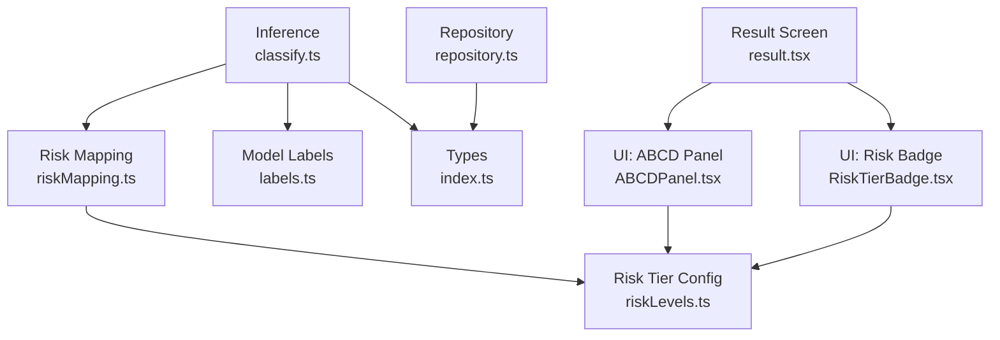
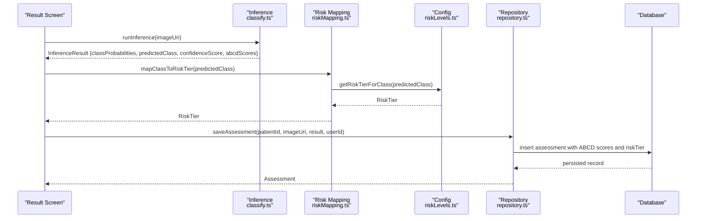
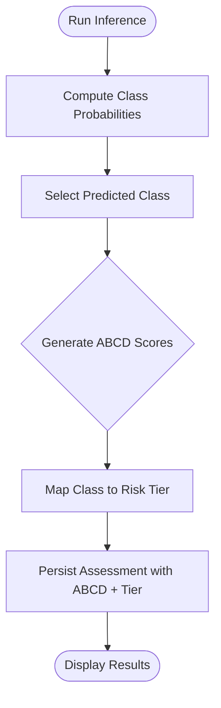
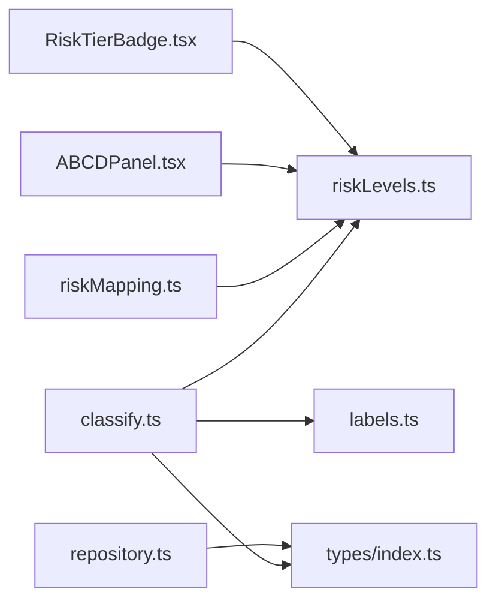

# Risk Classification System

<cite>
**Referenced Files in This Document**
- [riskMapping.ts](file://src/features/assessments/inference/riskMapping.ts)
- [classify.ts](file://src/features/assessments/inference/classify.ts)
- [riskLevels.ts](file://src/constants/riskLevels.ts)
- [ABCDPanel.tsx](file://src/components/assessment/ABCDPanel.tsx)
- [RiskTierBadge.tsx](file://src/components/assessment/RiskTierBadge.tsx)
- [labels.ts](file://src/ml/labels.ts)
- [index.ts](file://src/types/index.ts)
- [repository.ts](file://src/features/assessments/repository.ts)
- [result.tsx](file://src/app/(app)/patients/[patientId]/result.tsx)
</cite>

## Table of Contents
1. Introduction
2. Project Structure
3. Core Components
4. Architecture Overview
5. Detailed Component Analysis
6. Dependency Analysis
7. Performance Considerations
8. Troubleshooting Guide
9. Conclusion
10. Appendices

## Introduction
This document explains the risk classification system that maps machine learning inference results to clinical risk tiers and presents the ABCD (Asymmetry, Border, Color, Diameter) explainability scores used to support clinicians. It covers:
- How diagnosis classes are mapped to actionable risk tiers (low, medium, high, urgent referral).
- The current ABCD score generation and visualization approach.
- Thresholds and decision boundaries as implemented in the codebase.
- Guidance for customizing thresholds and extending the system to new diagnostic categories.

## Project Structure
The risk classification logic is implemented across a small set of focused modules:
- Inference module produces model outputs and ABCD scores.
- Constants define risk tier mappings and display metadata.
- UI components visualize ABCD scores and risk tier badges.
- Types define shared data contracts for assessments and inference results.
- Repository persists assessments including ABCD scores and risk tiers.

**Diagram sources**
- [classify.ts:14-52](file://src/features/assessments/inference/classify.ts#L14-L52)
- [riskMapping.ts:8-14](file://src/features/assessments/inference/riskMapping.ts#L8-L14)
- [riskLevels.ts:19-62](file://src/constants/riskLevels.ts#L19-L62)
- [labels.ts:7-15](file://src/ml/labels.ts#L7-L15)
- [index.ts:38-97](file://src/types/index.ts#L38-L97)
- [repository.ts:53-123](file://src/features/assessments/repository.ts#L53-L123)
- [result.tsx:105-108](file://src/app/(app)/patients/[patientId]/result.tsx#L105-L108)

**Section sources**
- [classify.ts:14-52](file://src/features/assessments/inference/classify.ts#L14-L52)
- [riskMapping.ts:8-14](file://src/features/assessments/inference/riskMapping.ts#L8-L14)
- [riskLevels.ts:19-62](file://src/constants/riskLevels.ts#L19-L62)
- [labels.ts:7-15](file://src/ml/labels.ts#L7-L15)
- [index.ts:38-97](file://src/types/index.ts#L38-L97)
- [repository.ts:53-123](file://src/features/assessments/repository.ts#L53-L123)
- [result.tsx:105-108](file://src/app/(app)/patients/[patientId]/result.tsx#L105-L108)

## Core Components
- Inference module: Generates class probabilities, predicted class, confidence score, and ABCD scores; derives risk tier from the predicted class.
- Risk mapping: Converts diagnosis class to an app-level risk tier using a central configuration.
- Risk tier configuration: Defines tiers, labels, colors, background colors, and recommended actions.
- ABCD panel: Visualizes Asymmetry, Border, Color, Diameter scores with color-coded bars.
- Risk tier badge: Displays the final risk tier with color and optional action text.
- Types: Define Assessment and InferenceResult structures, including ABCD fields and risk tier.

Key responsibilities:
- classify.ts: Produces InferenceResult and computes risk tier via riskLevels mapping.
- riskMapping.ts: Thin wrapper around riskLevels mapping utilities.
- riskLevels.ts: Central source of truth for risk tiers and ABCD label metadata.
- ABCDPanel.tsx: Renders per-feature scores and applies visual thresholds for bar coloring.
- RiskTierBadge.tsx: Renders tier label and action guidance based on configuration.

**Section sources**
- [classify.ts:14-52](file://src/features/assessments/inference/classify.ts#L14-L52)
- [riskMapping.ts:8-14](file://src/features/assessments/inference/riskMapping.ts#L8-L14)
- [riskLevels.ts:19-62](file://src/constants/riskLevels.ts#L19-L62)
- [ABCDPanel.tsx:19-67](file://src/components/assessment/ABCDPanel.tsx#L19-L67)
- [RiskTierBadge.tsx:15-39](file://src/components/assessment/RiskTierBadge.tsx#L15-L39)
- [index.ts:38-97](file://src/types/index.ts#L38-L97)

## Architecture Overview
End-to-end flow from image capture to risk classification and persistence:

**Diagram sources**
- [classify.ts:14-52](file://src/features/assessments/inference/classify.ts#L14-L52)
- [riskMapping.ts:8-14](file://src/features/assessments/inference/riskMapping.ts#L8-L14)
- [riskLevels.ts:114-120](file://src/constants/riskLevels.ts#L114-L120)
- [repository.ts:53-123](file://src/features/assessments/repository.ts#L53-L123)

## Detailed Component Analysis

### Risk Tier Mapping Logic
- Diagnosis classes are mapped to risk tiers via a centralized configuration.
- The mapping is one-to-one: each HAM10000 class maps to low, medium, high, or urgent_referral.
- Display metadata (label, color, background color, action) is provided per tier for consistent UI rendering.

Decision boundaries:
- The boundary between tiers is defined by the CLASS_TO_RISK_TIER mapping.
- No composite scoring threshold is applied at this stage; the tier is derived directly from the predicted class.

Extensibility:
- To add a new diagnostic category, extend the DiagnosisClass type and update CLASS_TO_RISK_TIER accordingly.
- Update DIAGNOSIS_LABELS if you need display names and malignancy flags.

**Section sources**
- [riskLevels.ts:8-10](file://src/constants/riskLevels.ts#L8-L10)
- [riskLevels.ts:19-62](file://src/constants/riskLevels.ts#L19-L62)
- [riskLevels.ts:67-86](file://src/constants/riskLevels.ts#L67-L86)
- [riskLevels.ts:114-120](file://src/constants/riskLevels.ts#L114-L120)
- [index.ts:38-40](file://src/types/index.ts#L38-L40)

### ABCD Criteria: Calculation Methodology and Visualization
Current implementation:
- ABCD scores are generated as normalized values in the range [0, 1] during inference.
- Each score represents a feature strength indicator used by the model’s explainability layer.
- Scores are stored in the Assessment record and displayed in the ABCD panel.

Visualization thresholds:
- The ABCD panel uses visual thresholds to color-code bars:
  - High concern: value >= 0.7 (red)
  - Moderate concern: value >= 0.4 (amber)
  - Low concern: value < 0.4 (green)
- These thresholds apply only to the UI presentation and do not alter the computed risk tier.

Composite risk assessment:
- The current risk tier is determined solely from the predicted class via the mapping.
- There is no explicit composite formula combining ABCD scores into a single score in this codebase.

Guidance for future customization:
- If you want to incorporate ABCD scores into a composite risk score, introduce a function that aggregates asymmetry, border, color, and diameter (e.g., weighted sum or rule-based thresholds) and then maps the aggregate to a risk tier.
- Ensure any new thresholds are documented and configurable in constants to avoid hardcoding in UI or business logic.

**Section sources**
- [classify.ts:36-42](file://src/features/assessments/inference/classify.ts#L36-L42)
- [ABCDPanel.tsx:34-40](file://src/components/assessment/ABCDPanel.tsx#L34-L40)
- [riskLevels.ts:89-112](file://src/constants/riskLevels.ts#L89-L112)
- [repository.ts:69-74](file://src/features/assessments/repository.ts#L69-L74)

### Data Flow and Persistence
- Inference returns an InferenceResult containing class probabilities, predicted class, confidence score, ABCD scores, and risk tier.
- The repository creates an Assessment record, persisting all fields including ABCD scores and risk tier.
- The result screen displays both the risk tier badge and the ABCD panel for clinician review.

**Diagram sources**
- [classify.ts:14-52](file://src/features/assessments/inference/classify.ts#L14-L52)
- [repository.ts:53-123](file://src/features/assessments/repository.ts#L53-L123)

**Section sources**
- [classify.ts:14-52](file://src/features/assessments/inference/classify.ts#L14-L52)
- [repository.ts:53-123](file://src/features/assessments/repository.ts#L53-L123)
- [result.tsx:105-108](file://src/app/(app)/patients/[patientId]/result.tsx#L105-L108)

### UI Components for Risk and Explainability
- RiskTierBadge: Renders tier label and optional action guidance using configuration colors.
- ABCDPanel: Renders four bars for Asymmetry, Border, Color, Diameter with percentage labels and color thresholds.

These components depend on the central configuration to ensure consistency across the app.

**Section sources**
- [RiskTierBadge.tsx:15-39](file://src/components/assessment/RiskTierBadge.tsx#L15-L39)
- [ABCDPanel.tsx:19-67](file://src/components/assessment/ABCDPanel.tsx#L19-L67)
- [riskLevels.ts:19-48](file://src/constants/riskLevels.ts#L19-L48)

## Dependency Analysis
- classify.ts depends on:
  - riskLevels.ts for risk tier mapping.
  - labels.ts for model class enumeration.
  - types/index.ts for shared interfaces.
- riskMapping.ts depends on riskLevels.ts.
- ABCDPanel.tsx depends on riskLevels.ts for labels and descriptions.
- RiskTierBadge.tsx depends on riskLevels.ts for tier metadata.
- repository.ts depends on types/index.ts and persists ABCD scores and risk tier.

**Diagram sources**
- [classify.ts:6-8](file://src/features/assessments/inference/classify.ts#L6-L8)
- [riskMapping.ts:5-6](file://src/features/assessments/inference/riskMapping.ts#L5-L6)
- [ABCDPanel.tsx:8](file://src/components/assessment/ABCDPanel.tsx#L8)
- [RiskTierBadge.tsx:7-8](file://src/components/assessment/RiskTierBadge.tsx#L7-L8)
- [repository.ts:5-8](file://src/features/assessments/repository.ts#L5-L8)

**Section sources**
- [classify.ts:6-8](file://src/features/assessments/inference/classify.ts#L6-L8)
- [riskMapping.ts:5-6](file://src/features/assessments/inference/riskMapping.ts#L5-L6)
- [ABCDPanel.tsx:8](file://src/components/assessment/ABCDPanel.tsx#L8)
- [RiskTierBadge.tsx:7-8](file://src/components/assessment/RiskTierBadge.tsx#L7-L8)
- [repository.ts:5-8](file://src/features/assessments/repository.ts#L5-L8)

## Performance Considerations
- Inference currently simulates processing delay; replace with real TFLite inference when available to reduce latency and improve accuracy.
- ABCD score generation is lightweight; ensure any future aggregation logic remains O(1) per assessment.
- Persisting assessments involves JSON serialization of class probabilities; consider indexing frequently queried fields if dataset grows large.

[No sources needed since this section provides general guidance]

## Troubleshooting Guide
- Missing or incorrect risk tier:
  - Verify the predicted class exists in the mapping and that the DiagnosisClass type includes it.
  - Check that riskLevels.ts contains the expected mapping entry.
- ABCD scores not displaying correctly:
  - Confirm that ABCD scores are present in the InferenceResult and saved to the database.
  - Ensure ABCDPanel receives valid numeric values in [0, 1].
- Model availability:
  - The current isModelAvailable always returns true; integrate a real check for .tflite presence before running inference.

**Section sources**
- [riskLevels.ts:54-62](file://src/constants/riskLevels.ts#L54-L62)
- [classify.ts:58-61](file://src/features/assessments/inference/classify.ts#L58-L61)
- [repository.ts:69-74](file://src/features/assessments/repository.ts#L69-L74)

## Conclusion
The risk classification system maps model predictions to clinically meaningful risk tiers using a centralized configuration, while providing ABCD explainability scores to support clinician interpretation. The current design separates inference, mapping, and UI concerns, making it straightforward to customize thresholds and extend to new diagnostic categories. Future enhancements can include composite ABCD scoring and production-grade model integration.

[No sources needed since this section summarizes without analyzing specific files]

## Appendices

### Appendix A: Example Score Calculations and Decision Boundaries
- ABCD scores:
  - Generated as random normalized values in [0, 1] during mock inference.
  - UI thresholds for bar coloring:
    - >= 0.7: high concern (red)
    - >= 0.4: moderate concern (amber)
    - < 0.4: low concern (green)
- Risk tier decision:
  - Determined by mapping the predicted class to a tier via CLASS_TO_RISK_TIER.
  - No additional composite threshold is applied in this codebase.

Example scenarios (conceptual):
- Scenario A: Predicted class maps to urgent_referral → immediate specialist referral.
- Scenario B: Predicted class maps to high → refer within days with close follow-up.
- Scenario C: Predicted class maps to medium → advise monitoring and re-screen at next visit.
- Scenario D: Predicted class maps to low → routine care.

Note: Replace mock ABCD generation with model-derived features when integrating real inference.

**Section sources**
- [classify.ts:36-42](file://src/features/assessments/inference/classify.ts#L36-L42)
- [riskLevels.ts:54-62](file://src/constants/riskLevels.ts#L54-L62)
- [ABCDPanel.tsx:34-40](file://src/components/assessment/ABCDPanel.tsx#L34-L40)

### Appendix B: Customizing Risk Thresholds and Extending Categories
- Add a new diagnostic category:
  - Extend DiagnosisClass type.
  - Add entry to CLASS_TO_RISK_TIER mapping.
  - Optionally add display name and malignancy flag in DIAGNOSIS_LABELS.
- Adjust risk tier thresholds:
  - Modify CLASS_TO_RISK_TIER to change how classes map to tiers.
  - If introducing composite ABCD scoring, implement a new aggregation function and map its output to tiers.
- Update UI behavior:
  - If adding new tiers, ensure RISK_TIER_CONFIG has corresponding label, color, background color, and action.
  - Update ABCDPanel thresholds if you change how scores influence visuals.

**Section sources**
- [riskLevels.ts:8-10](file://src/constants/riskLevels.ts#L8-L10)
- [riskLevels.ts:19-62](file://src/constants/riskLevels.ts#L19-L62)
- [riskLevels.ts:67-86](file://src/constants/riskLevels.ts#L67-L86)
- [riskLevels.ts:114-120](file://src/constants/riskLevels.ts#L114-L120)
- [ABCDPanel.tsx:34-40](file://src/components/assessment/ABCDPanel.tsx#L34-L40)