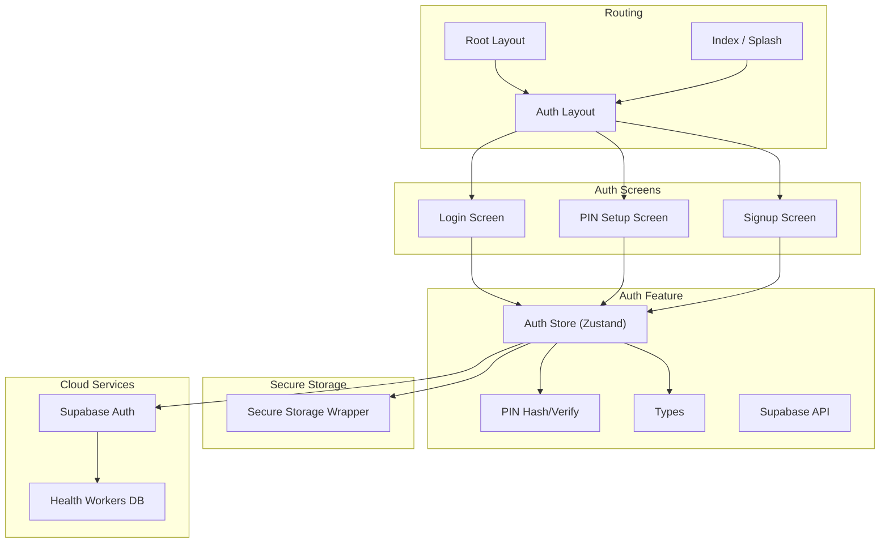
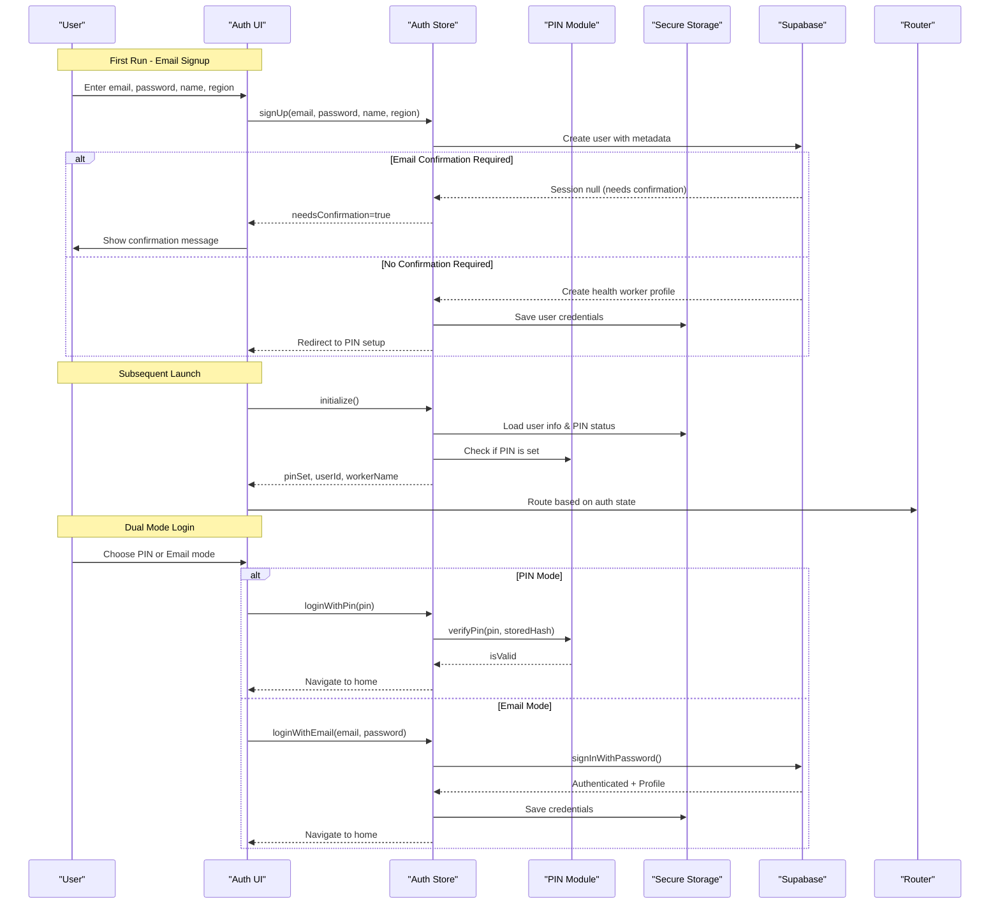
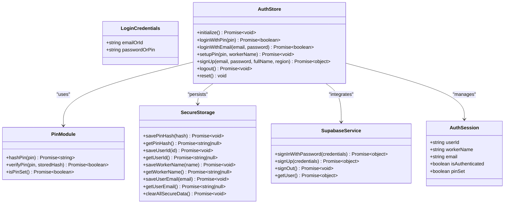
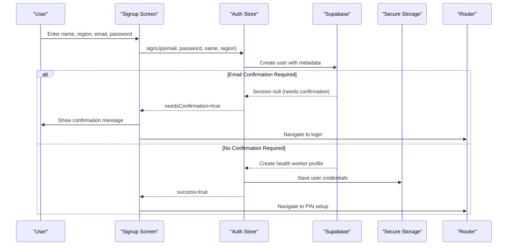
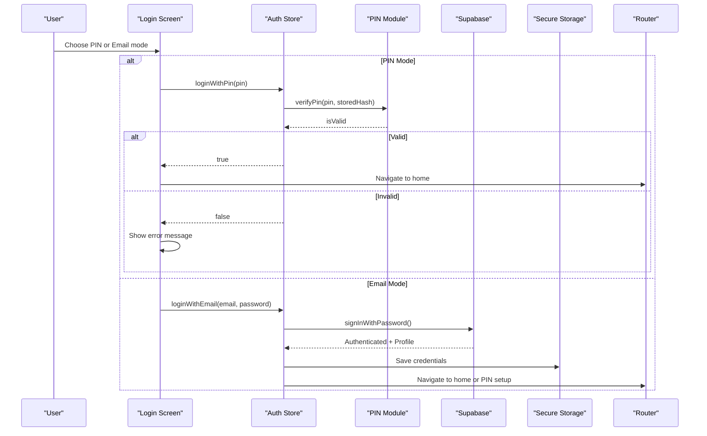
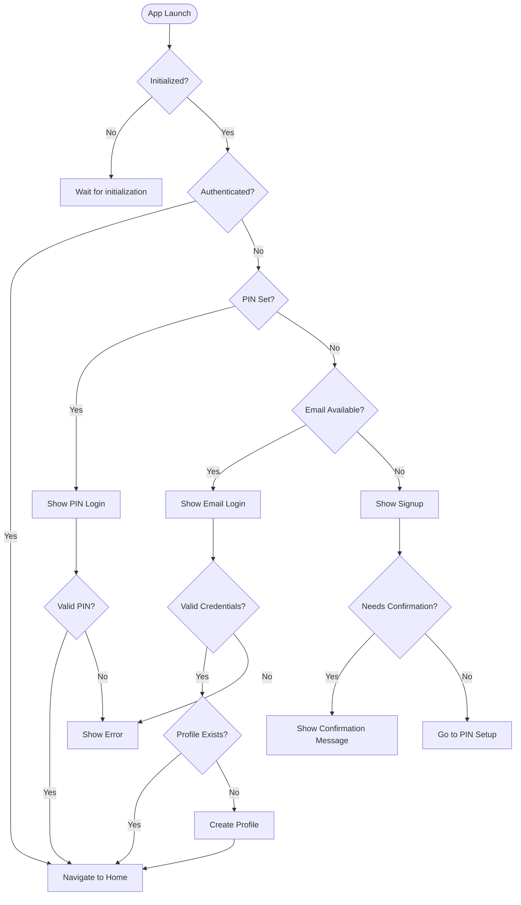
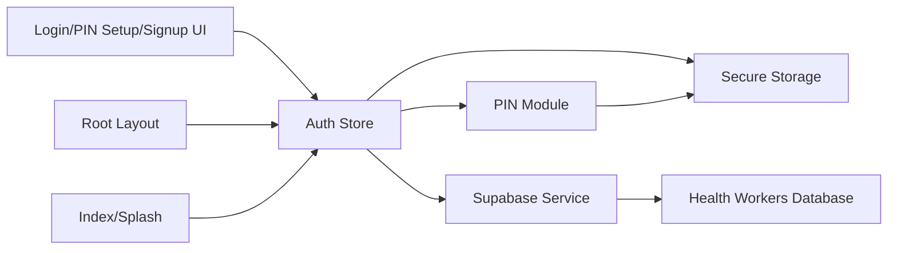

# Authentication System

<cite>
**Referenced Files in This Document**
- [store.ts](file://src/features/auth/store.ts)
- [api.ts](file://src/features/auth/api.ts)
- [pin.ts](file://src/features/auth/pin.ts)
- [types.ts](file://src/features/auth/types.ts)
- [secureStorage.ts](file://src/lib/secureStorage.ts)
- [supabase.ts](file://src/lib/supabase.ts)
- [login.tsx](file://src/app/(auth)/login.tsx)
- [signup.tsx](file://src/app/(auth)/signup.tsx)
- [pin-setup.tsx](file://src/app/(auth)/pin-setup.tsx)
- [_layout.tsx](file://src/app/(auth)/_layout.tsx)
- [_layout.tsx](file://src/app/_layout.tsx)
- [index.tsx](file://src/app/index.tsx)
</cite>

## Update Summary
**Changes Made**
- Enhanced authentication system with Supabase integration for email/password login
- Added user signup functionality through signUp() method
- Implemented automatic health worker profile creation and management
- Added email confirmation handling for environments requiring verification
- Integrated secure PIN-based local authentication with cloud sync capabilities
- Updated authentication flow to support both offline PIN and online email/password modes

## Table of Contents
1. [Introduction](#introduction)
2. [Project Structure](#project-structure)
3. [Core Components](#core-components)
4. [Architecture Overview](#architecture-overview)
5. [Detailed Component Analysis](#detailed-component-analysis)
6. [Dependency Analysis](#dependency-analysis)
7. [Performance Considerations](#performance-considerations)
8. [Troubleshooting Guide](#troubleshooting-guide)
9. [Conclusion](#conclusion)
10. [Appendices](#appendices)

## Introduction
DermSight's enhanced authentication system provides a hybrid approach combining secure PIN-based local authentication with Supabase-powered email/password authentication. Designed for healthcare workers in resource-limited settings, the system supports offline-first operation while enabling cloud synchronization when connectivity is available. The architecture includes PIN hashing and verification, session management, secure credential storage, automatic health worker profile creation, and email confirmation handling for environments requiring verification.

## Project Structure
The authentication system is organized into feature modules, secure storage layer, Supabase integration, and UI screens with routing:
- **Feature module**: PIN hashing/verification, Zustand store for auth state, types, and Supabase API helpers
- **Secure storage**: wrapper around expo-secure-store for tokens, PIN hash, user info
- **Supabase integration**: client configuration and authentication service
- **UI screens**: PIN setup, login (PIN/email), and signup within an auth group layout
- **Root layout and index**: bootstrap initialization and routing decisions based on auth state



**Diagram sources**
- [login.tsx:1-227](file://src/app/(auth)/login.tsx#L1-L227)
- [signup.tsx:1-181](file://src/app/(auth)/signup.tsx#L1-L181)
- [pin-setup.tsx:1-140](file://src/app/(auth)/pin-setup.tsx#L1-L140)
- [store.ts:1-448](file://src/features/auth/store.ts#L1-L448)
- [pin.ts:1-84](file://src/features/auth/pin.ts#L1-L84)
- [secureStorage.ts:1-156](file://src/lib/secureStorage.ts#L1-L156)
- [supabase.ts:1-19](file://src/lib/supabase.ts#L1-L19)
- [_layout.tsx:1-15](file://src/app/(auth)/_layout.tsx#L1-L15)
- [_layout.tsx:1-76](file://src/app/_layout.tsx#L1-L76)
- [index.tsx:1-256](file://src/app/index.tsx#L1-L256)

**Section sources**
- [login.tsx:1-227](file://src/app/(auth)/login.tsx#L1-L227)
- [signup.tsx:1-181](file://src/app/(auth)/signup.tsx#L1-L181)
- [pin-setup.tsx:1-140](file://src/app/(auth)/pin-setup.tsx#L1-L140)
- [store.ts:1-448](file://src/features/auth/store.ts#L1-L448)
- [pin.ts:1-84](file://src/features/auth/pin.ts#L1-L84)
- [secureStorage.ts:1-156](file://src/lib/secureStorage.ts#L1-L156)
- [supabase.ts:1-19](file://src/lib/supabase.ts#L1-L19)
- [_layout.tsx:1-15](file://src/app/(auth)/_layout.tsx#L1-L15)
- [_layout.tsx:1-76](file://src/app/_layout.tsx#L1-L76)
- [index.tsx:1-256](file://src/app/index.tsx#L1-L256)

## Core Components
- **Enhanced PIN security**: Salted hash generation and verification for offline PIN authentication
- **Hybrid authentication store**: Manages both PIN-based and email/password sessions using Zustand
- **Supabase integration**: Cloud authentication, user management, and data synchronization
- **Secure storage**: Persists PIN hash, user credentials, and tokens in device secure storage
- **User profile management**: Automatic health worker profile creation and maintenance
- **Email confirmation handling**: Support for environments requiring email verification
- **UI screens**: PIN setup, dual-mode login (PIN/email), and comprehensive signup flow
- **Smart routing**: Context-aware navigation based on authentication state and connectivity

Key responsibilities:
- **PIN setup**: Generate salt, hash PIN, persist credentials, set user identity
- **Dual authentication**: Support both PIN-based local auth and email/password cloud auth
- **Profile management**: Create and maintain health worker profiles across platforms
- **Session management**: Handle authentication state, token refresh, and logout
- **Offline support**: Graceful degradation when network connectivity is unavailable

**Section sources**
- [store.ts:10-448](file://src/features/auth/store.ts#L10-L448)
- [pin.ts:1-84](file://src/features/auth/pin.ts#L1-L84)
- [secureStorage.ts:1-156](file://src/lib/secureStorage.ts#L1-L156)
- [login.tsx:1-227](file://src/app/(auth)/login.tsx#L1-L227)
- [signup.tsx:1-181](file://src/app/(auth)/signup.tsx#L1-L181)
- [pin-setup.tsx:1-140](file://src/app/(auth)/pin-setup.tsx#L1-L140)
- [index.tsx:1-256](file://src/app/index.tsx#L1-L256)

## Architecture Overview
The enhanced authentication architecture combines local PIN verification with Supabase cloud authentication and secure storage. Users can authenticate via PIN for offline access or email/password for full cloud features. On first run, users create a PIN; subsequent launches check for existing PIN and route accordingly. The system automatically creates health worker profiles and handles email confirmation when required.



**Diagram sources**
- [store.ts:89-448](file://src/features/auth/store.ts#L89-L448)
- [pin.ts:23-84](file://src/features/auth/pin.ts#L23-L84)
- [secureStorage.ts:71-156](file://src/lib/secureStorage.ts#L71-L156)
- [login.tsx:22-69](file://src/app/(auth)/login.tsx#L22-L69)
- [signup.tsx:23-73](file://src/app/(auth)/signup.tsx#L23-L73)
- [index.tsx:22-31](file://src/app/index.tsx#L22-L31)

## Detailed Component Analysis

### Enhanced Authentication Store
**Updated** The authentication store now supports both PIN-based local authentication and email/password cloud authentication through Supabase.

- **Dual authentication methods**: `loginWithPin()` for offline access and `loginWithEmail()` for cloud features
- **User signup**: `signUp()` method with email confirmation handling and automatic profile creation
- **Profile resolution**: Smart fallback system to resolve worker names from multiple sources
- **Session management**: Handles both local PIN sessions and Supabase authenticated sessions
- **Data synchronization**: Automatic remote data pull after successful email authentication

State shape enhancements:
- Added `email` field for tracking authenticated email addresses
- Enhanced error handling for different authentication scenarios
- Improved loading states for complex multi-step operations

**Section sources**
- [store.ts:10-448](file://src/features/auth/store.ts#L10-L448)

### Supabase Integration Layer
**New** Comprehensive Supabase integration for cloud authentication and data synchronization.

- **Authentication service**: Sign-in/sign-up with password authentication
- **User profile management**: Automatic health worker profile creation and updates
- **Session persistence**: Configured with auto-refresh and persistent sessions
- **Error handling**: Graceful fallbacks when database triggers are not applied
- **Data sync trigger**: Automatic remote data download after successful authentication

Integration points:
- Creates health worker profiles with user metadata (full_name, region)
- Falls back to dynamic profile creation if database triggers are missing
- Updates local SQLite database to maintain foreign key relationships
- Triggers remote data synchronization for patients and assessments

**Section sources**
- [store.ts:142-245](file://src/features/auth/store.ts#L142-L245)
- [store.ts:307-395](file://src/features/auth/store.ts#L307-L395)
- [supabase.ts:1-19](file://src/lib/supabase.ts#L1-L19)

### Email Confirmation Handling
**New** Support for environments requiring email verification during signup.

- **Confirmation detection**: Automatically detects when email confirmation is required
- **User guidance**: Clear messaging about verification requirements
- **Flow control**: Appropriate redirection to login screen after confirmation request
- **Error handling**: Graceful handling of confirmation-related errors

User experience considerations:
- Informative alerts explaining the need for email verification
- Smooth transition back to login screen after confirmation request
- Maintains user context throughout the confirmation process

**Section sources**
- [store.ts:327-332](file://src/features/auth/store.ts#L327-L332)
- [signup.tsx:54-67](file://src/app/(auth)/signup.tsx#L54-L67)

### Enhanced PIN Security and Verification
- **Salt generation**: Creates a random salt per device/session and stores it securely
- **PIN hashing**: Combines salt and PIN to produce a hash; stores hash with embedded salt prefix for verification
- **PIN verification**: Recomputes hash using stored salt and compares to stored hash
- **PIN presence check**: Determines if a PIN has been set by checking for stored hash

Security considerations:
- Uses device secure storage for sensitive values
- Avoids storing plaintext PINs
- Offline-capable verification without network calls
- Compatible with both local and cloud authentication flows

Complexity:
- Hashing is linear in PIN length; negligible overhead for short PINs

Error handling:
- Missing salt or malformed stored hash leads to verification failure
- Exceptions during storage operations are caught and surfaced as failures

**Section sources**
- [pin.ts:13-84](file://src/features/auth/pin.ts#L13-L84)

### Secure Storage Layer
**Enhanced** Expanded secure storage capabilities to support both PIN and email authentication.

- **Expanded key management**: Added USER_EMAIL key for storing authenticated email addresses
- **Token management**: Support for Supabase auth tokens and refresh tokens
- **Cross-platform support**: Web and native platform-specific implementations
- **Atomic operations**: Bulk clear function for complete logout/reset operations

Operational notes:
- All keys are prefixed to prevent collisions
- Platform-specific storage mechanisms (localStorage for web, SecureStore for native)
- Centralized key management to avoid typos and ensure consistent access

**Section sources**
- [secureStorage.ts:1-156](file://src/lib/secureStorage.ts#L1-L156)

### UI: Enhanced Login Flow
**Updated** Login screen now supports both PIN and email/password authentication modes.

- **Mode switching**: Toggle between PIN and email/password authentication
- **Connectivity awareness**: Disables email login when offline, guides users to PIN mode
- **Validation**: Comprehensive input validation for both authentication modes
- **Error handling**: Specific error messages for different failure scenarios
- **Navigation**: Smart routing to PIN setup after successful email authentication

UX improvements:
- Visual indicators for current authentication mode
- Haptic feedback for PIN entry interactions
- Loading states during authentication processes
- Offline notices to guide user behavior

**Section sources**
- [login.tsx:1-227](file://src/app/(auth)/login.tsx#L1-L227)

### UI: Enhanced Signup Flow
**New** Comprehensive signup screen for creating new health worker accounts.

- **Multi-field validation**: Full name, region, email, and password validation
- **Connectivity requirement**: Requires internet connection for account creation
- **Email confirmation handling**: Guides users through email verification process
- **Automatic redirection**: Routes to PIN setup after successful signup
- **Error handling**: Comprehensive error messages for various failure scenarios

User experience considerations:
- Clear form field labels and placeholders
- Password strength validation and confirmation
- Connection status warnings for offline scenarios
- Smooth transitions between signup and PIN setup

**Section sources**
- [signup.tsx:1-181](file://src/app/(auth)/signup.tsx#L1-L181)

### Routing and Navigation
**Enhanced** Improved routing logic to handle multiple authentication states and flows.

- **Context-aware routing**: Routes based on authentication state, PIN status, and connectivity
- **Post-authentication flow**: Directs users to PIN setup after email authentication
- **Offline handling**: Guides users to appropriate authentication methods based on connectivity
- **Splash screen logic**: Intelligent routing based on initialization state

Navigation rules:
- Use replace to prevent back navigation into auth flows after successful authentication
- Guard unauthenticated access by redirecting to appropriate auth screen
- Handle email confirmation scenarios appropriately
- Maintain user context throughout authentication flows

**Section sources**
- [_layout.tsx:1-76](file://src/app/_layout.tsx#L1-L76)
- [index.tsx:22-31](file://src/app/index.tsx#L22-L31)
- [_layout.tsx:1-15](file://src/app/(auth)/_layout.tsx#L1-L15)

### Class and Data Model Relationships
**Updated** Enhanced class diagram reflecting the hybrid authentication architecture.



**Diagram sources**
- [store.ts:10-448](file://src/features/auth/store.ts#L10-L448)
- [pin.ts:38-84](file://src/features/auth/pin.ts#L38-L84)
- [secureStorage.ts:71-156](file://src/lib/secureStorage.ts#L71-L156)
- [types.ts:5-17](file://src/features/auth/types.ts#L5-L17)

### Sequence: Enhanced Signup Flow
**New** Complete signup flow with email confirmation handling.



**Diagram sources**
- [signup.tsx:23-73](file://src/app/(auth)/signup.tsx#L23-L73)
- [store.ts:307-395](file://src/features/auth/store.ts#L307-L395)
- [secureStorage.ts:120-134](file://src/lib/secureStorage.ts#L120-L134)

### Sequence: Dual Mode Login
**Updated** Enhanced login flow supporting both PIN and email authentication.



**Diagram sources**
- [login.tsx:22-69](file://src/app/(auth)/login.tsx#L22-L69)
- [store.ts:112-245](file://src/features/auth/store.ts#L112-L245)
- [pin.ts:56-73](file://src/features/auth/pin.ts#L56-L73)
- [secureStorage.ts:71-134](file://src/lib/secureStorage.ts#L71-L134)

### Flowchart: Enhanced Authentication Decision Tree
**New** Decision tree for authentication method selection.



[No sources needed since this diagram shows conceptual information, not actual code structure]

## Dependency Analysis
**Updated** Enhanced dependency graph reflecting the hybrid authentication architecture.

- UI screens depend on the auth store for actions and state
- Auth store depends on PIN module for cryptographic operations and secure storage for persistence
- Auth store integrates with Supabase for cloud authentication and data synchronization
- PIN module depends on secure storage for salt and hash persistence
- Root layout and index coordinate initialization and routing based on store state
- Supabase integration provides cloud authentication, user management, and data sync



**Diagram sources**
- [login.tsx:1-227](file://src/app/(auth)/login.tsx#L1-L227)
- [signup.tsx:1-181](file://src/app/(auth)/signup.tsx#L1-L181)
- [pin-setup.tsx:1-140](file://src/app/(auth)/pin-setup.tsx#L1-L140)
- [store.ts:1-448](file://src/features/auth/store.ts#L1-L448)
- [pin.ts:1-84](file://src/features/auth/pin.ts#L1-L84)
- [secureStorage.ts:1-156](file://src/lib/secureStorage.ts#L1-L156)
- [supabase.ts:1-19](file://src/lib/supabase.ts#L1-L19)
- [_layout.tsx:1-76](file://src/app/_layout.tsx#L1-L76)
- [index.tsx:1-256](file://src/app/index.tsx#L1-L256)

**Section sources**
- [store.ts:1-448](file://src/features/auth/store.ts#L1-L448)
- [pin.ts:1-84](file://src/features/auth/pin.ts#L1-L84)
- [secureStorage.ts:1-156](file://src/lib/secureStorage.ts#L1-L156)
- [login.tsx:1-227](file://src/app/(auth)/login.tsx#L1-L227)
- [signup.tsx:1-181](file://src/app/(auth)/signup.tsx#L1-L181)
- [pin-setup.tsx:1-140](file://src/app/(auth)/pin-setup.tsx#L1-L140)
- [_layout.tsx:1-76](file://src/app/_layout.tsx#L1-L76)
- [index.tsx:1-256](file://src/app/index.tsx#L1-L256)

## Performance Considerations
**Updated** Performance optimizations for hybrid authentication system.

- **PIN hashing**: Lightweight and suitable for frequent use; no network calls required
- **Supabase integration**: Efficient session management with auto-refresh tokens
- **Profile resolution**: Smart caching of worker names to minimize database queries
- **Data synchronization**: Background sync triggered only after successful authentication
- **Offline optimization**: PIN authentication remains fast and responsive without network
- **Memory management**: Proper cleanup of authentication state during logout

Optimization strategies:
- Lazy loading of sync engine to reduce initial bundle size
- Conditional network requests based on connectivity status
- Efficient state updates using Zustand's granular re-rendering
- Batch operations for database updates during authentication flows

## Troubleshooting Guide
**Updated** Enhanced troubleshooting for hybrid authentication scenarios.

Common issues and resolutions:
- **Incorrect PIN**:
  - Ensure PIN length is exactly 4 digits
  - Verify that the stored hash exists and matches the expected format
  - Check error messages displayed by the login screen
- **Email authentication fails**:
  - Verify internet connectivity for email/password login
  - Check Supabase configuration and credentials
  - Ensure health worker profile exists or can be created
- **Email confirmation required**:
  - Check email inbox for confirmation link
  - Verify email address was entered correctly
  - Resend confirmation email if necessary
- **Profile creation issues**:
  - Check database triggers are properly configured
  - Verify user metadata contains required fields
  - Review error logs for specific failure reasons
- **App does not route correctly**:
  - Verify initialization completes and sets isInitialized flag
  - Check that pinSet and isAuthenticated flags are updated appropriately
  - Ensure router.replace is called after successful authentication

Debugging tips:
- Inspect secure storage keys to confirm presence of PIN hash and user info
- Log transitions in the auth store actions to trace state changes
- Test offline scenarios to ensure PIN login works without network connectivity
- Monitor Supabase authentication events and responses
- Check database triggers and health worker profile creation

**Section sources**
- [login.tsx:22-69](file://src/app/(auth)/login.tsx#L22-L69)
- [signup.tsx:23-73](file://src/app/(auth)/signup.tsx#L23-L73)
- [pin-setup.tsx:21-49](file://src/app/(auth)/pin-setup.tsx#L21-L49)
- [store.ts:112-448](file://src/features/auth/store.ts#L112-L448)
- [pin.ts:56-84](file://src/features/auth/pin.ts#L56-L84)

## Conclusion
DermSight's enhanced authentication system provides a robust hybrid approach that combines secure PIN-based local authentication with Supabase-powered cloud features. This design ensures healthcare workers in resource-limited settings can access critical functionality offline while benefiting from cloud synchronization when connectivity is available. The system's intelligent routing, automatic profile management, and email confirmation handling create a seamless user experience across different operational contexts.

Key benefits:
- **Offline resilience**: PIN authentication works without internet connectivity
- **Cloud integration**: Full-featured email/password authentication with automatic profile management
- **User-friendly**: Intuitive switching between authentication modes based on availability
- **Secure**: Industry-standard encryption and secure storage practices
- **Scalable**: Supports growing user bases and evolving security requirements

Future enhancements could include biometric authentication, advanced session timeout handling, and additional security measures for high-security environments.

## Appendices

### Security Best Practices
**Updated** Enhanced security guidelines for hybrid authentication systems.

- Keep PINs short and memorable for usability while balancing security needs
- Implement rate limiting for failed authentication attempts
- Use strong password policies for email/password authentication
- Regularly rotate authentication tokens and refresh sessions
- Protect against brute force attacks with exponential backoff
- Ensure secure storage is properly configured on target devices and platforms
- Validate all user inputs server-side to prevent injection attacks
- Implement proper session timeout handling for enhanced security

### Error Handling Strategies
**Updated** Comprehensive error handling for hybrid authentication scenarios.

- Validate inputs early to provide immediate feedback
- Surface meaningful error messages to guide users toward resolution
- Gracefully handle storage and cryptographic failures with fallbacks and retries where appropriate
- Maintain consistent loading states to improve perceived performance
- Provide offline-to-online transition guidance for users
- Implement retry logic for network-dependent operations
- Log detailed error information for debugging while protecting user privacy
- Handle partial failures gracefully to maintain app stability

### User Experience Considerations
**Updated** Enhanced UX guidelines for hybrid authentication systems.

- Design PIN entry with large, accessible buttons and clear visual feedback
- Provide helpful hints and educational content about PIN importance
- Support offline usage prominently to build trust in constrained environments
- Minimize steps and cognitive load during setup and login
- Clearly indicate when internet connectivity is required vs. optional
- Provide smooth transitions between authentication modes
- Offer contextual help and tooltips for complex authentication flows
- Ensure accessibility compliance for users with disabilities

### Implementation Examples
**New** Code examples for common authentication patterns.

#### PIN Setup Example
```typescript
// Initialize PIN setup flow
const handleSetupPin = async (pin: string, workerName: string) => {
  const result = await setupPin(pin, workerName);
  if (result.success) {
    router.replace('/(app)/home');
  } else {
    showError(result.error);
  }
};
```

#### Email Authentication Example
```typescript
// Handle email/password authentication
const handleEmailLogin = async (email: string, password: string) => {
  const success = await loginWithEmail(email, password);
  if (success) {
    const currentPinSet = useAuthStore.getState().pinSet;
    if (!currentPinSet) {
      router.replace('/(auth)/pin-setup');
    } else {
      router.replace('/(app)/home');
    }
  } else {
    showError('Invalid credentials');
  }
};
```

#### Signup with Confirmation Handling
```typescript
// Handle signup with email confirmation
const handleSignup = async (email: string, password: string, fullName: string, region: string) => {
  const result = await signUp(email, password, fullName, region);
  if (result.needsConfirmation) {
    showConfirmationMessage();
    router.replace('/(auth)/login');
  } else {
    router.replace('/(auth)/pin-setup');
  }
};
```