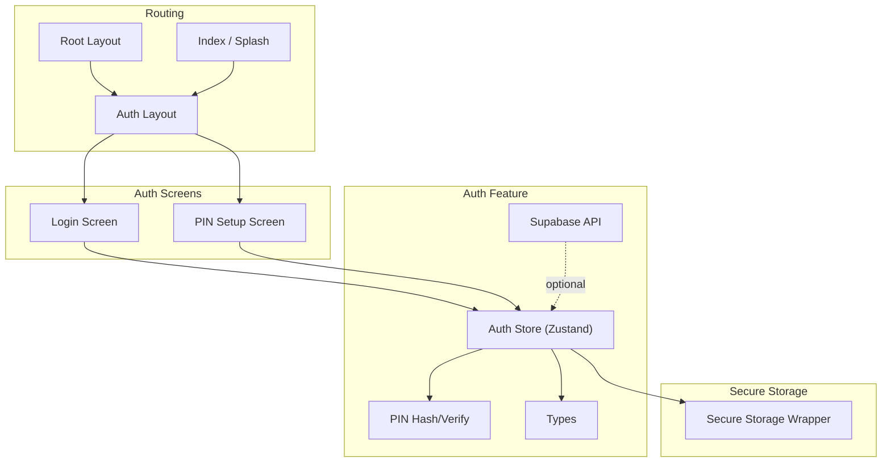
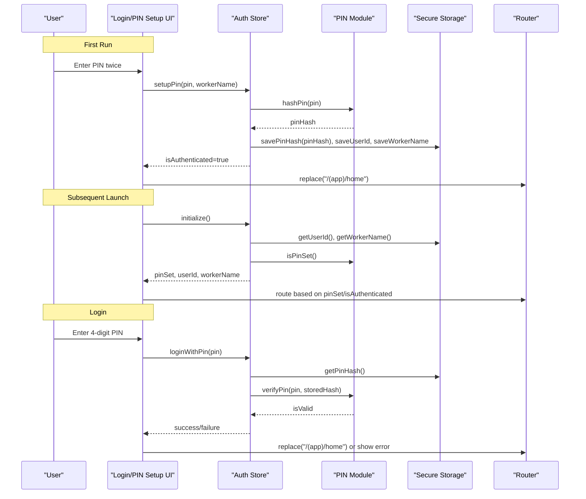
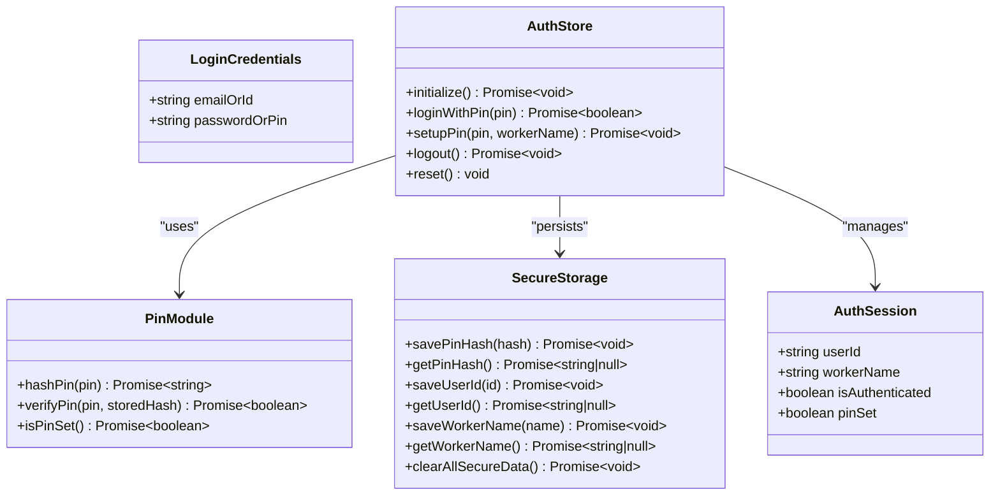
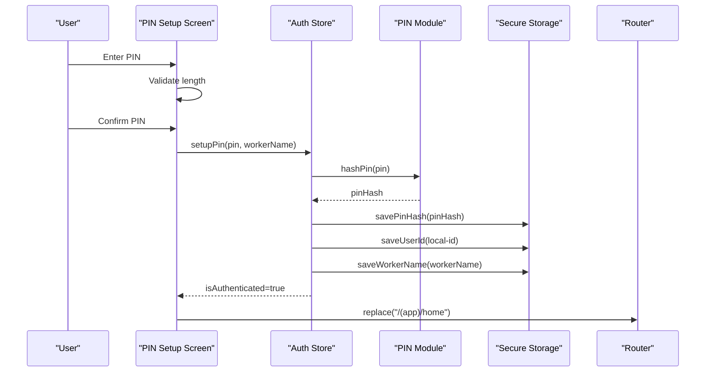
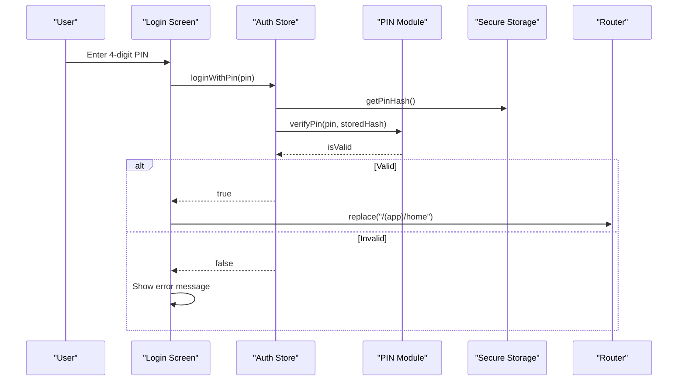
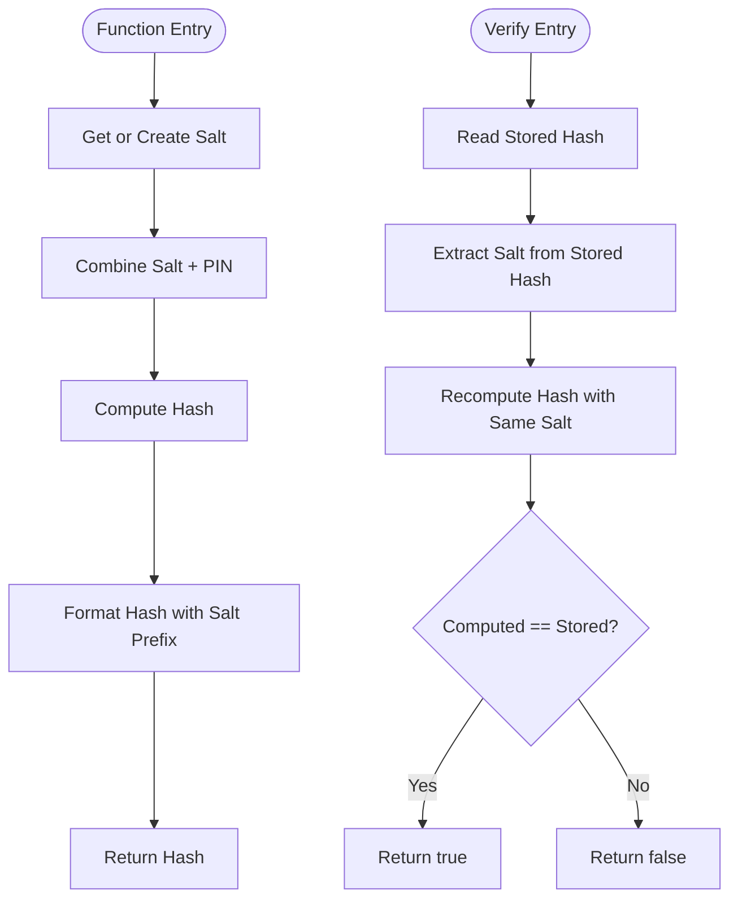
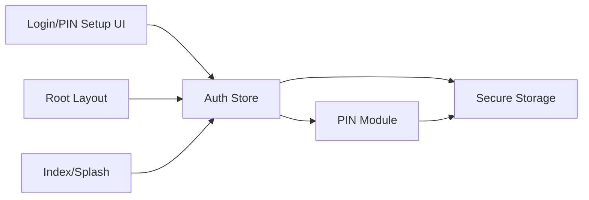

# Authentication System

<cite>
**Referenced Files in This Document**
- [pin.ts](file://src/features/auth/pin.ts)
- [store.ts](file://src/features/auth/store.ts)
- [types.ts](file://src/features/auth/types.ts)
- [api.ts](file://src/features/auth/api.ts)
- [secureStorage.ts](file://src/lib/secureStorage.ts)
- [login.tsx](file://src/app/(auth)/login.tsx)
- [pin-setup.tsx](file://src/app/(auth)/pin-setup.tsx)
- [_layout.tsx](file://src/app/(auth)/_layout.tsx)
- [_layout.tsx](file://src/app/_layout.tsx)
- [index.tsx](file://src/app/index.tsx)
</cite>

## Table of Contents
1. [Introduction](#introduction)
2. [Project Structure](#project-structure)
3. [Core Components](#core-components)
4. [Architecture Overview](#architecture-overview)
5. [Detailed Component Analysis](#detailed-component-analysis)
6. [Dependency Analysis](#dependency-analysis)
7. [Performance Considerations](#performance-considerations)
8. [Troubleshooting Guide](#troubleshooting-guide)
9. [Conclusion](#conclusion)
10. [Appendices](#appendices)

## Introduction
This document explains DermSight’s PIN-based authentication system designed for healthcare workers in resource-limited settings. It covers the security architecture for PIN verification, session management, and secure credential storage using React Native’s secure storage. The flow includes initial PIN setup, login verification, and session persistence across app launches. It also documents PIN hashing and verification, secure storage mechanisms, UI components for login and PIN setup screens, error handling strategies, and how authentication state drives navigation routing.

## Project Structure
The authentication system is organized into feature modules, a secure storage layer, and UI screens with routing:
- Feature module: PIN hashing/verification, Zustand store for auth state, types, and Supabase API helpers
- Secure storage: wrapper around expo-secure-store for tokens, PIN hash, user info
- UI screens: PIN setup and login within an auth group layout
- Root layout and index: bootstrap initialization and routing decisions based on auth state

**Diagram sources**
- [login.tsx:1-185](file://src/app/(auth)/login.tsx#L1-L185)
- [pin-setup.tsx:1-129](file://src/app/(auth)/pin-setup.tsx#L1-L129)
- [store.ts:1-122](file://src/features/auth/store.ts#L1-L122)
- [pin.ts:1-73](file://src/features/auth/pin.ts#L1-L73)
- [secureStorage.ts:1-78](file://src/lib/secureStorage.ts#L1-L78)
- [_layout.tsx:1-15](file://src/app/(auth)/_layout.tsx#L1-L15)
- [_layout.tsx:1-54](file://src/app/_layout.tsx#L1-L54)
- [index.tsx:1-235](file://src/app/index.tsx#L1-L235)

**Section sources**
- [login.tsx:1-185](file://src/app/(auth)/login.tsx#L1-L185)
- [pin-setup.tsx:1-129](file://src/app/(auth)/pin-setup.tsx#L1-L129)
- [store.ts:1-122](file://src/features/auth/store.ts#L1-L122)
- [pin.ts:1-73](file://src/features/auth/pin.ts#L1-L73)
- [secureStorage.ts:1-78](file://src/lib/secureStorage.ts#L1-L78)
- [_layout.tsx:1-15](file://src/app/(auth)/_layout.tsx#L1-L15)
- [_layout.tsx:1-54](file://src/app/_layout.tsx#L1-L54)
- [index.tsx:1-235](file://src/app/index.tsx#L1-L235)

## Core Components
- PIN hashing and verification: local offline verification using a salted hash stored securely
- Auth store: manages session state, PIN setup, login, logout, and initialization
- Secure storage: persists PIN hash, user ID, worker name, and tokens in device secure storage
- UI screens: PIN setup flow and PIN/email login with validation and feedback
- Routing: bootstraps app state and routes to appropriate screens based on authentication status

Key responsibilities:
- PIN setup: generate salt, hash PIN, persist credentials, set user identity
- Login: verify PIN against stored hash, establish session, navigate to home
- Initialization: load persisted user info and PIN presence, prepare UI state
- Logout: clear secure data and reset state

**Section sources**
- [pin.ts:1-73](file://src/features/auth/pin.ts#L1-L73)
- [store.ts:1-122](file://src/features/auth/store.ts#L1-L122)
- [secureStorage.ts:1-78](file://src/lib/secureStorage.ts#L1-L78)
- [login.tsx:1-185](file://src/app/(auth)/login.tsx#L1-L185)
- [pin-setup.tsx:1-129](file://src/app/(auth)/pin-setup.tsx#L1-L129)
- [index.tsx:1-235](file://src/app/index.tsx#L1-L235)

## Architecture Overview
The authentication architecture combines local PIN verification with secure storage and a centralized Zustand store for session state. On first run, users create a PIN; subsequent launches check for existing PIN and route accordingly. Login verifies the entered PIN against the stored hash and establishes a session. Navigation is driven by the current authentication state.

**Diagram sources**
- [store.ts:30-99](file://src/features/auth/store.ts#L30-L99)
- [pin.ts:20-73](file://src/features/auth/pin.ts#L20-L73)
- [secureStorage.ts:42-78](file://src/lib/secureStorage.ts#L42-L78)
- [login.tsx:24-46](file://src/app/(auth)/login.tsx#L24-L46)
- [pin-setup.tsx:23-43](file://src/app/(auth)/pin-setup.tsx#L23-L43)
- [index.tsx:21-43](file://src/app/index.tsx#L21-L43)

## Detailed Component Analysis

### PIN Security and Verification
- Salt generation: creates a random salt per device/session and stores it securely
- PIN hashing: combines salt and PIN to produce a hash; stores hash with embedded salt prefix for verification
- PIN verification: recomputes hash using stored salt and compares to stored hash
- PIN presence check: determines if a PIN has been set by checking for stored hash

Security considerations:
- Uses device secure storage for sensitive values
- Avoids storing plaintext PINs
- Offline-capable verification without network calls

Complexity:
- Hashing is linear in PIN length; negligible overhead for short PINs

Error handling:
- Missing salt or malformed stored hash leads to verification failure
- Exceptions during storage operations are caught and surfaced as failures

**Section sources**
- [pin.ts:10-73](file://src/features/auth/pin.ts#L10-L73)

### Secure Storage Layer
- Persists PIN hash, user ID, worker name, and optional tokens via expo-secure-store
- Provides getters/setters for each key and a bulk clear function for logout/reset
- Centralizes key names to avoid typos and ensure consistent access

Operational notes:
- All keys are prefixed to prevent collisions
- Clear function removes all auth-related items atomically

**Section sources**
- [secureStorage.ts:1-78](file://src/lib/secureStorage.ts#L1-L78)

### Auth Store (Session Management)
- Initializes app state by loading user info and PIN presence from secure storage
- Handles PIN setup: hashes PIN, saves credentials, sets user identity, marks authenticated
- Handles PIN login: retrieves stored hash, verifies PIN, updates session state
- Supports logout: clears secure data and resets state
- Exposes flags for loading and initialization to drive UI behavior

State shape:
- userId, workerName, isAuthenticated, pinSet, isLoading, isInitialized

Integration points:
- Calls PIN module for hashing/verification
- Reads/writes secure storage for persistence
- Used by UI screens to trigger actions and read state

**Section sources**
- [store.ts:1-122](file://src/features/auth/store.ts#L1-L122)
- [types.ts:1-16](file://src/features/auth/types.ts#L1-L16)

### UI: PIN Setup Flow
- Two-step process: enter PIN then confirm PIN
- Validates PIN length and match before proceeding
- Calls store to setup PIN and navigates to home upon success
- Displays errors for mismatches and invalid inputs

UX considerations:
- Clear visual indicators for PIN digits
- Accessible numeric keypad interaction
- Informative messaging about privacy and purpose

**Section sources**
- [pin-setup.tsx:1-129](file://src/app/(auth)/pin-setup.tsx#L1-L129)

### UI: Login Flow
- Supports both email/password and PIN modes; PIN mode validates 4-digit input
- Calls store to authenticate with PIN and navigates to home on success
- Shows errors for incorrect PIN and missing inputs
- Displays offline notice to reassure users that core features work offline

UX considerations:
- Toggle between PIN and email/password modes
- Immediate feedback on input validation
- Loading states to indicate processing

**Section sources**
- [login.tsx:1-185](file://src/app/(auth)/login.tsx#L1-L185)

### Routing and Navigation
- Root layout initializes database and auth store, then renders router stack
- Index screen decides routing based on authentication state:
  - If authenticated: go to app home
  - Else if PIN set: go to login
  - Else: go to PIN setup
- Auth layout groups login and PIN setup screens without headers

Navigation rules:
- Use replace to prevent back navigation into auth flows after successful login
- Guard unauthenticated access by redirecting to appropriate auth screen

**Section sources**
- [_layout.tsx:1-54](file://src/app/_layout.tsx#L1-L54)
- [index.tsx:21-43](file://src/app/index.tsx#L21-L43)
- [_layout.tsx:1-15](file://src/app/(auth)/_layout.tsx#L1-L15)

### Class and Data Model Relationships

**Diagram sources**
- [store.ts:10-122](file://src/features/auth/store.ts#L10-L122)
- [pin.ts:32-73](file://src/features/auth/pin.ts#L32-L73)
- [secureStorage.ts:42-78](file://src/lib/secureStorage.ts#L42-L78)
- [types.ts:5-16](file://src/features/auth/types.ts#L5-L16)

### Sequence: PIN Setup

**Diagram sources**
- [pin-setup.tsx:23-43](file://src/app/(auth)/pin-setup.tsx#L23-L43)
- [store.ts:80-99](file://src/features/auth/store.ts#L80-L99)
- [pin.ts:32-42](file://src/features/auth/pin.ts#L32-L42)
- [secureStorage.ts:42-66](file://src/lib/secureStorage.ts#L42-L66)

### Sequence: PIN Login

**Diagram sources**
- [login.tsx:24-46](file://src/app/(auth)/login.tsx#L24-L46)
- [store.ts:51-78](file://src/features/auth/store.ts#L51-L78)
- [pin.ts:47-64](file://src/features/auth/pin.ts#L47-L64)
- [secureStorage.ts:42-49](file://src/lib/secureStorage.ts#L42-L49)

### Flowchart: PIN Hashing and Verification

**Diagram sources**
- [pin.ts:20-64](file://src/features/auth/pin.ts#L20-L64)

## Dependency Analysis
- UI screens depend on the auth store for actions and state
- Auth store depends on PIN module for cryptographic operations and secure storage for persistence
- PIN module depends on secure storage for salt and hash persistence
- Root layout and index coordinate initialization and routing based on store state
- Optional Supabase API integration exists but is not used for PIN-based local authentication

**Diagram sources**
- [login.tsx:1-185](file://src/app/(auth)/login.tsx#L1-L185)
- [pin-setup.tsx:1-129](file://src/app/(auth)/pin-setup.tsx#L1-L129)
- [store.ts:1-122](file://src/features/auth/store.ts#L1-L122)
- [pin.ts:1-73](file://src/features/auth/pin.ts#L1-L73)
- [secureStorage.ts:1-78](file://src/lib/secureStorage.ts#L1-L78)
- [_layout.tsx:1-54](file://src/app/_layout.tsx#L1-L54)
- [index.tsx:1-235](file://src/app/index.tsx#L1-L235)

**Section sources**
- [store.ts:1-122](file://src/features/auth/store.ts#L1-L122)
- [pin.ts:1-73](file://src/features/auth/pin.ts#L1-L73)
- [secureStorage.ts:1-78](file://src/lib/secureStorage.ts#L1-L78)
- [login.tsx:1-185](file://src/app/(auth)/login.tsx#L1-L185)
- [pin-setup.tsx:1-129](file://src/app/(auth)/pin-setup.tsx#L1-L129)
- [_layout.tsx:1-54](file://src/app/_layout.tsx#L1-L54)
- [index.tsx:1-235](file://src/app/index.tsx#L1-L235)

## Performance Considerations
- PIN hashing is lightweight and suitable for frequent use; no network calls required
- Secure storage operations are asynchronous; UI should display loading states to avoid blocking interactions
- Initialization loads minimal data (user ID, worker name, PIN presence) to keep startup fast
- Avoid repeated hashing; cache results where appropriate in higher-level logic if needed

[No sources needed since this section provides general guidance]

## Troubleshooting Guide
Common issues and resolutions:
- Incorrect PIN:
  - Ensure PIN length is exactly 4 digits
  - Verify that the stored hash exists and matches the expected format
  - Check error messages displayed by the login screen
- PIN setup fails:
  - Confirm secure storage is available on the device
  - Ensure PIN confirmation matches the entered PIN
  - Review logs for exceptions during storage operations
- App does not route correctly:
  - Verify initialization completes and sets isInitialized flag
  - Check that pinSet and isAuthenticated flags are updated appropriately
  - Ensure router.replace is called after successful authentication

Debugging tips:
- Inspect secure storage keys to confirm presence of PIN hash and user info
- Log transitions in the auth store actions to trace state changes
- Test offline scenarios to ensure PIN login works without network connectivity

**Section sources**
- [login.tsx:24-46](file://src/app/(auth)/login.tsx#L24-L46)
- [pin-setup.tsx:23-43](file://src/app/(auth)/pin-setup.tsx#L23-L43)
- [store.ts:30-99](file://src/features/auth/store.ts#L30-L99)
- [pin.ts:47-73](file://src/features/auth/pin.ts#L47-L73)

## Conclusion
DermSight’s PIN-based authentication provides a secure, offline-first experience tailored for healthcare workers in low-resource environments. By leveraging device secure storage and local PIN verification, the system ensures privacy and resilience without relying on network connectivity. The Zustand store centralizes session management, while UI screens offer intuitive workflows for PIN setup and login. Routing is driven by authentication state, ensuring users are directed appropriately at launch and after login. For enhanced security, consider strengthening hashing algorithms and adding session timeout handling in future iterations.

[No sources needed since this section summarizes without analyzing specific files]

## Appendices

### Security Best Practices
- Keep PINs short and memorable for usability while balancing security needs
- Rotate or reset PINs periodically through secure admin flows when applicable
- Protect against brute force by introducing delays or lockouts after multiple failed attempts
- Ensure secure storage is properly configured on target devices and platforms

[No sources needed since this section provides general guidance]

### Error Handling Strategies
- Validate inputs early to provide immediate feedback
- Surface meaningful error messages to guide users toward resolution
- Gracefully handle storage and cryptographic failures with fallbacks and retries where appropriate
- Maintain consistent loading states to improve perceived performance

[No sources needed since this section provides general guidance]

### User Experience Considerations
- Design PIN entry with large, accessible buttons and clear visual feedback
- Provide helpful hints and educational content about PIN importance
- Support offline usage prominently to build trust in constrained environments
- Minimize steps and cognitive load during setup and login

[No sources needed since this section provides general guidance]