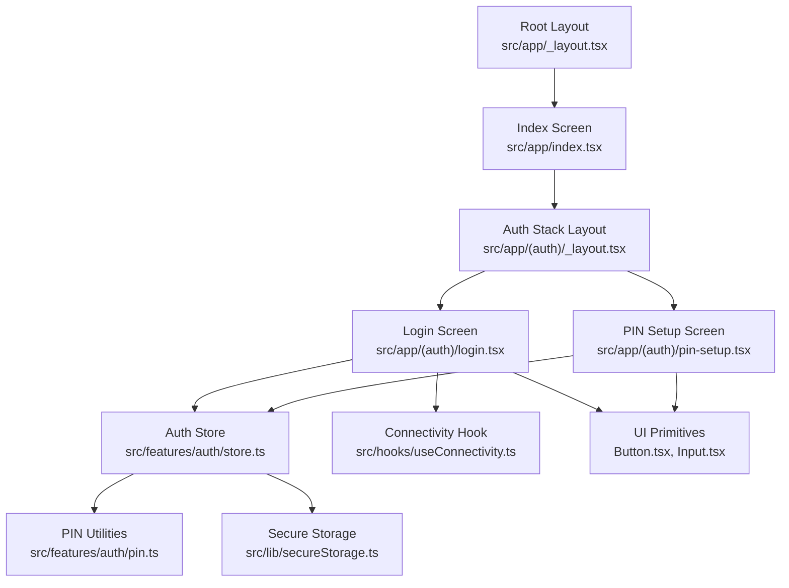
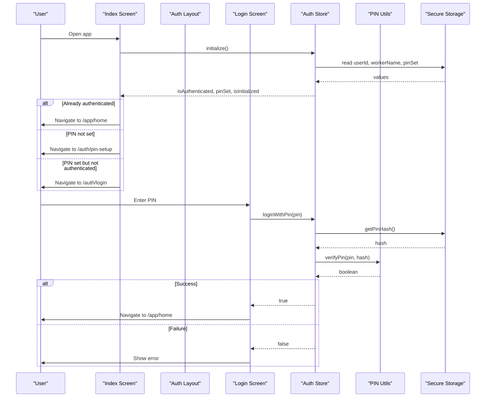
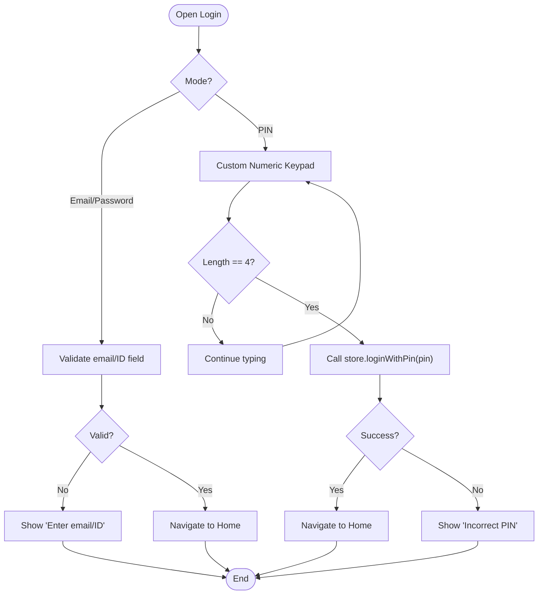
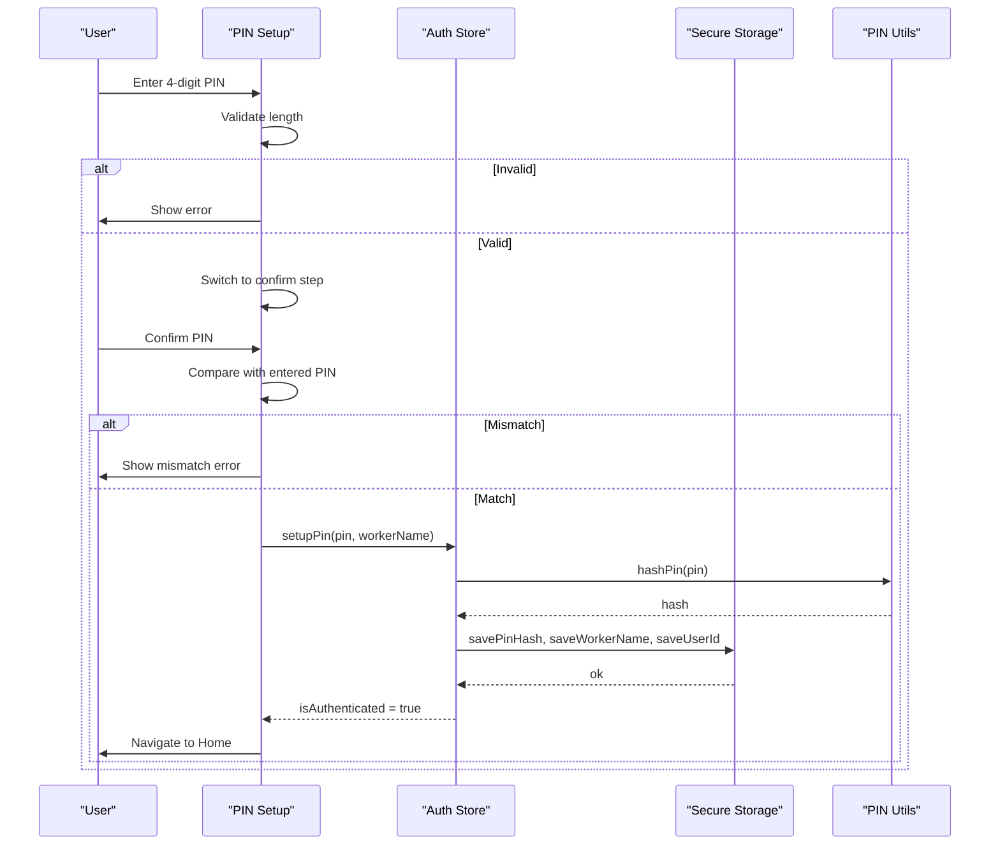
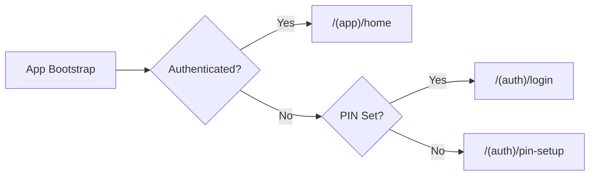
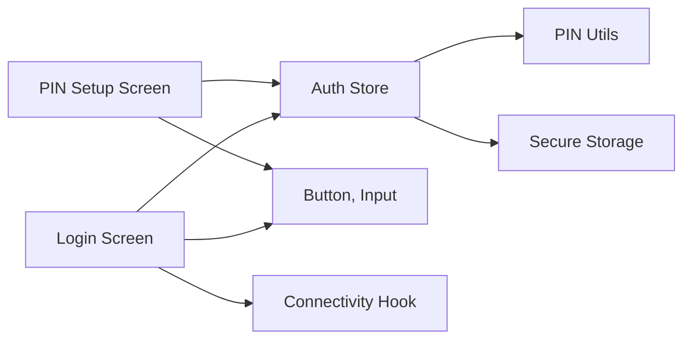

# Authentication UI

<cite>
**Referenced Files in This Document**
- [login.tsx](file://src/app/(auth)/login.tsx)
- [pin-setup.tsx](file://src/app/(auth)/pin-setup.tsx)
- [_layout.tsx](file://src/app/(auth)/_layout.tsx)
- [store.ts](file://src/features/auth/store.ts)
- [pin.ts](file://src/features/auth/pin.ts)
- [Button.tsx](file://src/components/ui/Button.tsx)
- [Input.tsx](file://src/components/ui/Input.tsx)
- [secureStorage.ts](file://src/lib/secureStorage.ts)
- [useConnectivity.ts](file://src/hooks/useConnectivity.ts)
- [_layout.tsx](file://src/app/_layout.tsx)
- [index.tsx](file://src/app/index.tsx)
- [en.json](file://assets/locales/en.json)
</cite>

## Table of Contents
1. Introduction
2. Project Structure
3. Core Components
4. Architecture Overview
5. Detailed Component Analysis
6. Dependency Analysis
7. Performance Considerations
8. Troubleshooting Guide
9. Conclusion

## Introduction
This document explains DermSight’s authentication user interface for healthcare workers operating in resource-limited settings. It covers the login screen (PIN input handling, validation feedback, error states), the PIN setup workflow for first-time users, the auth layout and navigation flow, accessibility considerations, responsive design, keyboard handling, and mobile-specific UI patterns. The goal is to help developers and product teams understand how the screens work together and how to extend or maintain them safely.

## Project Structure
The authentication UI is organized under a dedicated route group with a stack layout that hides headers for a focused experience:
- Auth screens: login and pin-setup
- Shared UI primitives: Button and Input
- State management: Zustand store for session and PIN operations
- Security utilities: PIN hashing and secure storage helpers
- Connectivity hook for offline notices
- Root layout and index screen orchestrate initial routing based on auth state

**Diagram sources**
- [_layout.tsx:19-50](file://src/app/_layout.tsx#L19-L50)
- [index.tsx:16-43](file://src/app/index.tsx#L16-L43)
- [_layout.tsx:7-13](file://src/app/(auth)/_layout.tsx#L7-L13)
- [login.tsx:14-46](file://src/app/(auth)/login.tsx#L14-L46)
- [pin-setup.tsx:11-43](file://src/app/(auth)/pin-setup.tsx#L11-L43)
- [store.ts:22-121](file://src/features/auth/store.ts#L22-L121)
- [pin.ts:32-72](file://src/features/auth/pin.ts#L32-L72)
- [secureStorage.ts:42-77](file://src/lib/secureStorage.ts#L42-L77)
- [useConnectivity.ts:8-16](file://src/hooks/useConnectivity.ts#L8-L16)
- [Button.tsx:27-99](file://src/components/ui/Button.tsx#L27-L99)
- [Input.tsx:24-89](file://src/components/ui/Input.tsx#L24-L89)

**Section sources**
- [_layout.tsx:19-50](file://src/app/_layout.tsx#L19-L50)
- [index.tsx:16-43](file://src/app/index.tsx#L16-L43)
- [_layout.tsx:7-13](file://src/app/(auth)/_layout.tsx#L7-L13)

## Core Components
- Login screen: supports two modes (email/password and PIN). In PIN mode, it renders a custom numeric keypad and four-dot indicator for progress. Validation enforces a 4-digit PIN and shows inline errors. On success, navigates to the home screen; on failure, displays an error message.
- PIN setup screen: two-step flow (enter PIN, confirm PIN). Validates length and match, then persists the PIN hash and worker info via the store and navigates to home.
- Auth store: manages initialization, login with PIN, PIN setup, logout, and reset. Uses secure storage for persistence and exposes loading states to drive UI feedback.
- PIN utilities: generate salt, hash PIN, verify PIN against stored hash, and check if PIN is set.
- UI primitives: Button supports variants, sizes, loading indicators, icons, and disabled states; Input supports labels, icons, secure text entry toggle, focus styling, and error messages.
- Connectivity hook: provides online/offline status used to show an offline notice on the login screen.

Key responsibilities and interactions are detailed below.

**Section sources**
- [login.tsx:14-46](file://src/app/(auth)/login.tsx#L14-L46)
- [pin-setup.tsx:11-43](file://src/app/(auth)/pin-setup.tsx#L11-L43)
- [store.ts:30-99](file://src/features/auth/store.ts#L30-L99)
- [pin.ts:32-72](file://src/features/auth/pin.ts#L32-L72)
- [Button.tsx:27-99](file://src/components/ui/Button.tsx#L27-L99)
- [Input.tsx:24-89](file://src/components/ui/Input.tsx#L24-L89)
- [useConnectivity.ts:8-16](file://src/hooks/useConnectivity.ts#L8-L16)

## Architecture Overview
The authentication flow is orchestrated by the root layout and index screen, which determine whether to show onboarding, PIN setup, login, or the main app. The auth screens consume the Zustand store for state and side effects, while PIN security relies on local hashing and secure storage.

**Diagram sources**
- [index.tsx:21-43](file://src/app/index.tsx#L21-L43)
- [_layout.tsx:7-13](file://src/app/(auth)/_layout.tsx#L7-L13)
- [login.tsx:24-46](file://src/app/(auth)/login.tsx#L24-L46)
- [store.ts:30-78](file://src/features/auth/store.ts#L30-L78)
- [pin.ts:47-64](file://src/features/auth/pin.ts#L47-L64)
- [secureStorage.ts:42-49](file://src/lib/secureStorage.ts#L42-L49)

## Detailed Component Analysis

### Login Screen
- Modes:
  - Email/Password mode: currently redirects to home for MVP; can be extended to call backend APIs.
  - PIN mode: custom keypad with four dot indicators; validates 4 digits; calls store.loginWithPin; shows error on failure; navigates to home on success.
- Feedback:
  - Error messages displayed below inputs when validation fails or PIN verification fails.
  - Loading state from store drives button activity indicator.
  - Offline banner shown using connectivity hook.
- Navigation:
  - Toggles between email/password and PIN modes within the same screen.
  - Navigates to home on successful login.

**Diagram sources**
- [login.tsx:24-46](file://src/app/(auth)/login.tsx#L24-L46)
- [login.tsx:69-113](file://src/app/(auth)/login.tsx#L69-L113)
- [login.tsx:141-149](file://src/app/(auth)/login.tsx#L141-L149)
- [login.tsx:167-180](file://src/app/(auth)/login.tsx#L167-L180)

**Section sources**
- [login.tsx:14-46](file://src/app/(auth)/login.tsx#L14-L46)
- [login.tsx:69-113](file://src/app/(auth)/login.tsx#L69-L113)
- [login.tsx:141-149](file://src/app/(auth)/login.tsx#L141-L149)
- [login.tsx:167-180](file://src/app/(auth)/login.tsx#L167-L180)

### PIN Setup Screen
- Workflow:
  - Step 1: Enter 4-digit PIN; validate length; proceed to confirmation step.
  - Step 2: Confirm PIN; ensure both entries match; otherwise clear confirmation and show error.
  - Persist: Calls store.setupPin to hash and save PIN, worker name, and user ID; sets authenticated state; navigates to home.
- UX:
  - Four dot indicators reflect current PIN length.
  - Inline error messages for mismatch or incomplete input.
  - Info card explains purpose of PIN.

**Diagram sources**
- [pin-setup.tsx:23-43](file://src/app/(auth)/pin-setup.tsx#L23-L43)
- [store.ts:80-99](file://src/features/auth/store.ts#L80-L99)
- [pin.ts:32-42](file://src/features/auth/pin.ts#L32-L42)
- [secureStorage.ts:42-58](file://src/lib/secureStorage.ts#L42-L58)

**Section sources**
- [pin-setup.tsx:11-43](file://src/app/(auth)/pin-setup.tsx#L11-L43)
- [pin-setup.tsx:45-126](file://src/app/(auth)/pin-setup.tsx#L45-L126)
- [store.ts:80-99](file://src/features/auth/store.ts#L80-L99)

### Auth Layout and Navigation Flow
- The auth stack groups login and pin-setup without headers for a clean experience.
- Root layout initializes database and auth store, then renders the top-level stack including the auth group.
- Index screen decides where to navigate after bootstrap:
  - If authenticated: go to home.
  - Else if PIN already set: go to login.
  - Else: go to PIN setup.

**Diagram sources**
- [_layout.tsx:19-50](file://src/app/_layout.tsx#L19-L50)
- [index.tsx:21-43](file://src/app/index.tsx#L21-L43)
- [_layout.tsx:7-13](file://src/app/(auth)/_layout.tsx#L7-L13)

**Section sources**
- [_layout.tsx:19-50](file://src/app/_layout.tsx#L19-L50)
- [index.tsx:21-43](file://src/app/index.tsx#L21-L43)
- [_layout.tsx:7-13](file://src/app/(auth)/_layout.tsx#L7-L13)

### Form Validation, Loading States, and UX Patterns
- Validation:
  - PIN length enforced at 4 digits before submission.
  - PIN confirmation ensures exact match.
  - Email/ID field validated before proceeding (MVP redirects immediately).
- Loading states:
  - Buttons display activity indicators during async operations via store.isLoading.
  - Inputs remain editable; actions are disabled while loading.
- Error states:
  - Inline error messages for invalid inputs and failed PIN verification.
  - Clear messaging guides users to correct mistakes.
- Accessibility:
  - Labels on inputs improve screen reader context.
  - Large touch targets on keypad buttons aid usability.
  - High contrast colors and clear visual hierarchy support low-vision users.
- Mobile-specific considerations:
  - Custom keypad avoids reliance on system keyboards for PIN flows.
  - Offline banner informs users of connectivity status.
  - Safe area usage ensures content is visible across devices.

**Section sources**
- [login.tsx:24-46](file://src/app/(auth)/login.tsx#L24-L46)
- [pin-setup.tsx:23-43](file://src/app/(auth)/pin-setup.tsx#L23-L43)
- [Button.tsx:27-99](file://src/components/ui/Button.tsx#L27-L99)
- [Input.tsx:24-89](file://src/components/ui/Input.tsx#L24-L89)
- [useConnectivity.ts:8-16](file://src/hooks/useConnectivity.ts#L8-L16)

## Dependency Analysis
The authentication UI depends on several modules:
- Screens depend on the auth store for state and actions.
- Store depends on PIN utilities for hashing and verification and on secure storage for persistence.
- PIN utilities rely on expo-secure-store for salt and hash storage.
- UI components provide consistent interaction patterns and accessibility features.
- Connectivity hook supplies offline status for contextual messaging.

**Diagram sources**
- [login.tsx:14-46](file://src/app/(auth)/login.tsx#L14-L46)
- [pin-setup.tsx:11-43](file://src/app/(auth)/pin-setup.tsx#L11-L43)
- [store.ts:22-121](file://src/features/auth/store.ts#L22-L121)
- [pin.ts:32-72](file://src/features/auth/pin.ts#L32-L72)
- [secureStorage.ts:42-77](file://src/lib/secureStorage.ts#L42-L77)
- [Button.tsx:27-99](file://src/components/ui/Button.tsx#L27-L99)
- [Input.tsx:24-89](file://src/components/ui/Input.tsx#L24-L89)
- [useConnectivity.ts:8-16](file://src/hooks/useConnectivity.ts#L8-L16)

**Section sources**
- [store.ts:22-121](file://src/features/auth/store.ts#L22-L121)
- [pin.ts:32-72](file://src/features/auth/pin.ts#L32-L72)
- [secureStorage.ts:42-77](file://src/lib/secureStorage.ts#L42-L77)

## Performance Considerations
- Local PIN hashing and verification are lightweight and suitable for offline use.
- Secure storage operations are asynchronous; keep UI responsive by showing loading states and avoiding blocking the main thread.
- Avoid unnecessary re-renders by keeping state minimal in screens and delegating logic to the store.
- For large datasets or future network calls, consider debouncing inputs and batching updates.

[No sources needed since this section provides general guidance]

## Troubleshooting Guide
Common issues and resolutions:
- Incorrect PIN:
  - Symptom: Error message “Incorrect PIN” appears.
  - Cause: Entered PIN does not match stored hash.
  - Resolution: Re-enter PIN; ensure no extra characters; verify device time/date if cryptographic operations fail unexpectedly.
- PIN mismatch during setup:
  - Symptom: Error message indicates PINs do not match.
  - Cause: Confirmation PIN differs from entered PIN.
  - Resolution: Re-enter both PINs carefully; ensure consistent input method.
- No PIN set:
  - Symptom: Login with PIN returns false immediately.
  - Cause: Stored PIN hash missing.
  - Resolution: Complete PIN setup flow; ensure secure storage write succeeds.
- Offline behavior:
  - Symptom: Offline banner visible on login.
  - Cause: Device lacks internet connection.
  - Resolution: Core features remain usable; sync will resume when online.

Operational references:
- Error handling in login and setup flows.
- Store actions for login and setup with try/catch blocks.
- Secure storage keys and cleanup.

**Section sources**
- [login.tsx:24-46](file://src/app/(auth)/login.tsx#L24-L46)
- [pin-setup.tsx:23-43](file://src/app/(auth)/pin-setup.tsx#L23-L43)
- [store.ts:51-99](file://src/features/auth/store.ts#L51-L99)
- [secureStorage.ts:68-77](file://src/lib/secureStorage.ts#L68-L77)

## Conclusion
DermSight’s authentication UI provides a robust, accessible, and mobile-friendly experience tailored for community health workers. The login screen supports quick PIN-based access with clear validation and feedback, while the PIN setup screen guides new users through secure enrollment. The architecture cleanly separates UI, state, and security concerns, enabling maintainability and extensibility. With offline awareness and consistent UI primitives, the app remains reliable in low-resource environments.

[No sources needed since this section summarizes without analyzing specific files]