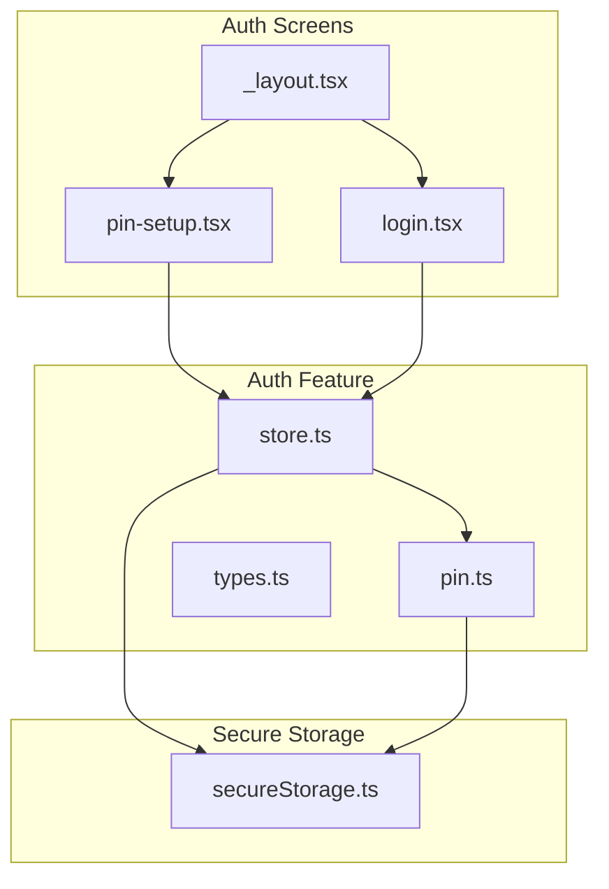
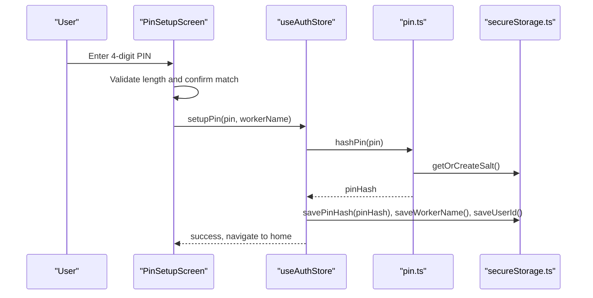
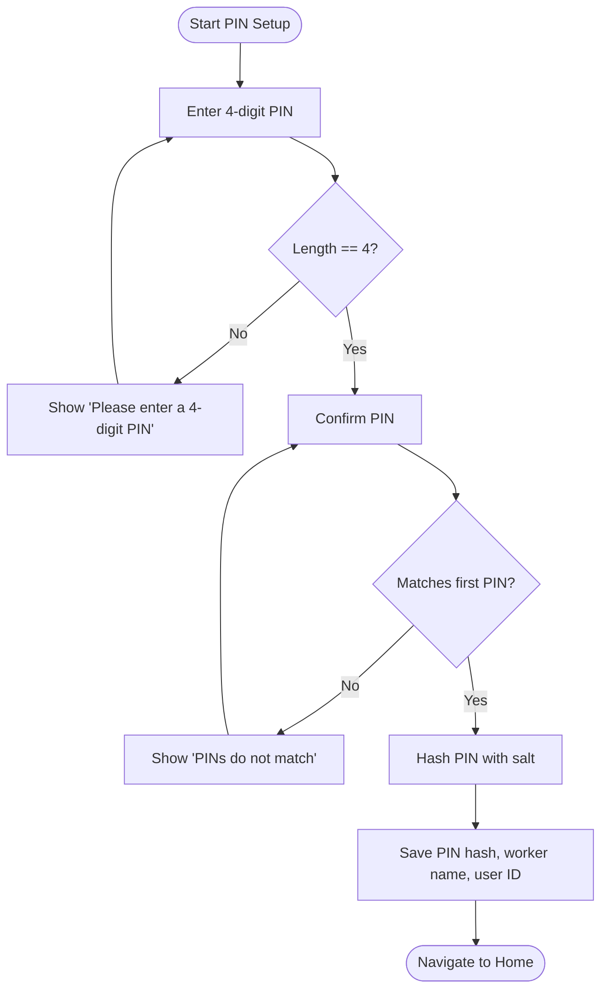
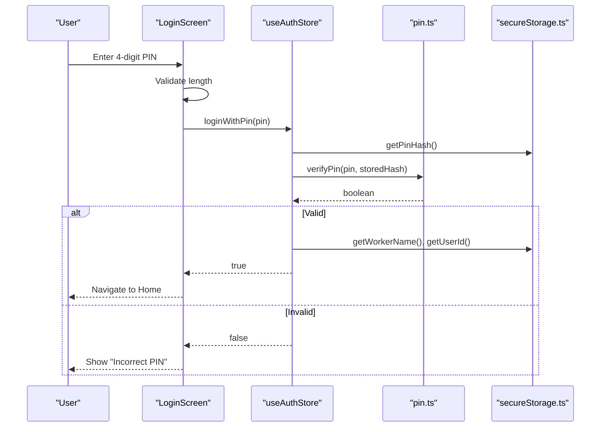
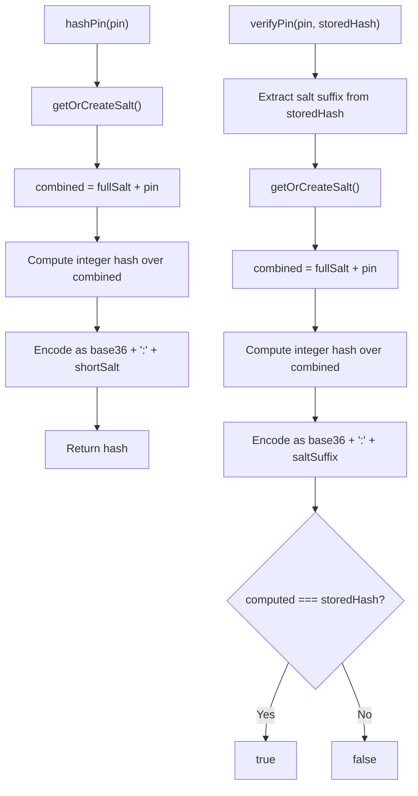
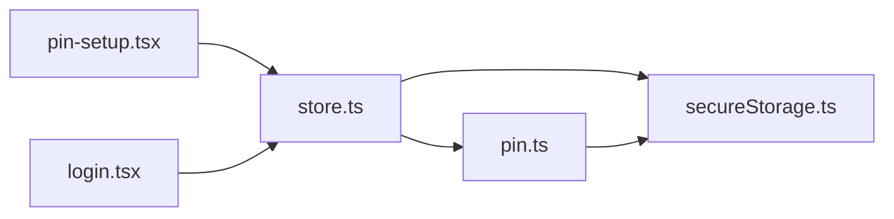

# PIN Management

<cite>
**Referenced Files in This Document**
- [pin-setup.tsx](file://src/app/(auth)/pin-setup.tsx)
- [login.tsx](file://src/app/(auth)/login.tsx)
- [_layout.tsx](file://src/app/(auth)/_layout.tsx)
- [pin.ts](file://src/features/auth/pin.ts)
- [store.ts](file://src/features/auth/store.ts)
- [types.ts](file://src/features/auth/types.ts)
- [secureStorage.ts](file://src/lib/secureStorage.ts)
</cite>

## Table of Contents
1. [Introduction](#introduction)
2. [Project Structure](#project-structure)
3. [Core Components](#core-components)
4. [Architecture Overview](#architecture-overview)
5. [Detailed Component Analysis](#detailed-component-analysis)
6. [Dependency Analysis](#dependency-analysis)
7. [Performance Considerations](#performance-considerations)
8. [Troubleshooting Guide](#troubleshooting-guide)
9. [Conclusion](#conclusion)
10. [Appendices](#appendices)

## Introduction
This document explains DermSight’s local PIN management system for healthcare worker authentication on the device. It covers PIN creation, hashing, secure storage, verification, and the user-facing setup and login flows. It also documents validation rules, error handling, and security considerations, including current limitations around retry limits and account lockout.

## Project Structure
The PIN feature spans UI screens, state management, cryptographic helpers, and secure storage:
- UI screens: PIN setup and PIN login
- State: Auth store orchestrates setup and login
- Cryptography: Local PIN hashing and verification with salt
- Storage: Secure storage for PIN hash, user info, and salt

**Diagram sources**
- [pin-setup.tsx:1-129](file://src/app/(auth)/pin-setup.tsx#L1-L129)
- [login.tsx:1-185](file://src/app/(auth)/login.tsx#L1-L185)
- [_layout.tsx:1-15](file://src/app/(auth)/_layout.tsx#L1-L15)
- [store.ts:1-122](file://src/features/auth/store.ts#L1-L122)
- [pin.ts:1-73](file://src/features/auth/pin.ts#L1-L73)
- [secureStorage.ts:1-78](file://src/lib/secureStorage.ts#L1-L78)

**Section sources**
- [pin-setup.tsx:1-129](file://src/app/(auth)/pin-setup.tsx#L1-L129)
- [login.tsx:1-185](file://src/app/(auth)/login.tsx#L1-L185)
- [_layout.tsx:1-15](file://src/app/(auth)/_layout.tsx#L1-L15)
- [store.ts:1-122](file://src/features/auth/store.ts#L1-L122)
- [pin.ts:1-73](file://src/features/auth/pin.ts#L1-L73)
- [secureStorage.ts:1-78](file://src/lib/secureStorage.ts#L1-L78)

## Core Components
- PIN Setup Screen: Guides users to create a 4-digit PIN, validates input, confirms entry, and triggers setup via the auth store.
- Login Screen: Supports PIN-based login with offline capability; validates length and shows feedback on failure.
- Auth Store: Manages session state, calls PIN hashing/verification, persists credentials securely, and updates UI state.
- PIN Crypto Module: Generates and stores a per-device salt, hashes PINs, verifies against stored hashes, and checks if a PIN is set.
- Secure Storage: Wraps platform secure storage for tokens, PIN hash, user ID, and worker name.

Key responsibilities and interactions are detailed in the next sections.

**Section sources**
- [pin-setup.tsx:23-43](file://src/app/(auth)/pin-setup.tsx#L23-L43)
- [login.tsx:24-46](file://src/app/(auth)/login.tsx#L24-L46)
- [store.ts:30-99](file://src/features/auth/store.ts#L30-L99)
- [pin.ts:10-72](file://src/features/auth/pin.ts#L10-L72)
- [secureStorage.ts:8-78](file://src/lib/secureStorage.ts#L8-L78)

## Architecture Overview
The PIN flow uses a layered approach:
- UI layer (screens) collects input and displays feedback
- State layer (auth store) coordinates operations and updates UI
- Security layer (PIN crypto) performs hashing and verification
- Persistence layer (secure storage) protects sensitive data at rest

**Diagram sources**
- [pin-setup.tsx:23-43](file://src/app/(auth)/pin-setup.tsx#L23-L43)
- [store.ts:80-99](file://src/features/auth/store.ts#L80-L99)
- [pin.ts:32-42](file://src/features/auth/pin.ts#L32-L42)
- [secureStorage.ts:43-66](file://src/lib/secureStorage.ts#L43-L66)

## Detailed Component Analysis

### PIN Setup Workflow
- Input Validation: Enforces exactly 4 digits during both entry and confirmation steps. Errors are shown inline when validation fails or when confirm does not match.
- Confirmation Step: Requires re-entry to prevent typos.
- Persistence: On successful setup, the app hashes the PIN, saves the hash, worker name, and a generated user ID, then navigates to the home screen.
- User Feedback: Inline errors and loading states guide the user through the process.

**Diagram sources**
- [pin-setup.tsx:23-43](file://src/app/(auth)/pin-setup.tsx#L23-L43)
- [store.ts:80-99](file://src/features/auth/store.ts#L80-L99)

**Section sources**
- [pin-setup.tsx:23-43](file://src/app/(auth)/pin-setup.tsx#L23-L43)
- [store.ts:80-99](file://src/features/auth/store.ts#L80-L99)

### PIN Login Flow
- Input Validation: Ensures PIN is 4 digits before attempting login.
- Verification: Retrieves stored PIN hash from secure storage and verifies using the same algorithm and salt.
- Success Path: Sets authenticated state and navigates to home.
- Failure Path: Displays an error message indicating incorrect PIN.

**Diagram sources**
- [login.tsx:24-46](file://src/app/(auth)/login.tsx#L24-L46)
- [store.ts:51-78](file://src/features/auth/store.ts#L51-L78)
- [pin.ts:47-64](file://src/features/auth/pin.ts#L47-L64)
- [secureStorage.ts:43-49](file://src/lib/secureStorage.ts#L43-L49)

**Section sources**
- [login.tsx:24-46](file://src/app/(auth)/login.tsx#L24-L46)
- [store.ts:51-78](file://src/features/auth/store.ts#L51-L78)

### PIN Hashing and Verification
- Salt Generation: A random 16-byte salt is created once and persisted under a dedicated key. Subsequent operations reuse this salt.
- Hash Algorithm: The implementation concatenates the full device salt with the PIN and computes a simple integer hash, then encodes it as base-36 along with a short salt suffix.
- Verification: Extracts the original salt suffix from the stored hash, reconstructs the expected value using the full device salt and provided PIN, and compares strings.

Security notes:
- The current hash function is lightweight and intended for local-only use. It is not designed to resist sophisticated attacks. For stronger protection, consider adopting a standard password-hashing scheme with configurable work factor and a longer salt.

**Diagram sources**
- [pin.ts:10-42](file://src/features/auth/pin.ts#L10-L42)
- [pin.ts:47-64](file://src/features/auth/pin.ts#L47-L64)

**Section sources**
- [pin.ts:10-42](file://src/features/auth/pin.ts#L10-L42)
- [pin.ts:47-64](file://src/features/auth/pin.ts#L47-L64)

### Secure Storage of PIN Data
- Keys: Dedicated keys are used for PIN hash, user ID, and worker name.
- Operations: Save and retrieve functions encapsulate access to secure storage.
- Cleanup: Logout clears all secure data, including PIN hash, user ID, and worker name.

Operational details:
- PIN hash is stored after setup and retrieved during login verification.
- Worker name and user ID are saved alongside the PIN hash to support post-login context.

**Section sources**
- [secureStorage.ts:8-78](file://src/lib/secureStorage.ts#L8-L78)
- [store.ts:80-99](file://src/features/auth/store.ts#L80-L99)

### Types and Session State
- AuthSession defines core fields such as userId, workerName, isAuthenticated, and pinSet.
- LoginCredentials supports email/password flows; PIN login is handled separately by the store.

These types ensure consistent state across the auth feature.

**Section sources**
- [types.ts:5-15](file://src/features/auth/types.ts#L5-L15)

## Dependency Analysis
The following diagram shows how components depend on each other during PIN setup and login.

**Diagram sources**
- [pin-setup.tsx:1-129](file://src/app/(auth)/pin-setup.tsx#L1-L129)
- [login.tsx:1-185](file://src/app/(auth)/login.tsx#L1-L185)
- [store.ts:1-122](file://src/features/auth/store.ts#L1-L122)
- [pin.ts:1-73](file://src/features/auth/pin.ts#L1-L73)
- [secureStorage.ts:1-78](file://src/lib/secureStorage.ts#L1-L78)

**Section sources**
- [store.ts:1-122](file://src/features/auth/store.ts#L1-L122)
- [pin.ts:1-73](file://src/features/auth/pin.ts#L1-L73)
- [secureStorage.ts:1-78](file://src/lib/secureStorage.ts#L1-L78)

## Performance Considerations
- Hashing is lightweight and runs synchronously over small inputs; performance impact is negligible for 4-digit PINs.
- Salt retrieval is cached per device session via secure storage; repeated lookups incur minimal overhead.
- Avoid unnecessary re-hashing; compute only when needed (setup and verification).

[No sources needed since this section provides general guidance]

## Troubleshooting Guide
Common issues and resolutions:
- Incorrect PIN:
  - Symptom: Login fails and error message is displayed.
  - Cause: Entered PIN does not match stored hash.
  - Resolution: Re-enter correct PIN; ensure no leading zeros were lost due to input formatting.
- PIN mismatch during setup:
  - Symptom: Error shown that PINs do not match.
  - Cause: Two entered PINs differ.
  - Resolution: Re-enter PIN carefully and confirm again.
- Missing PIN hash:
  - Symptom: Login returns false without verification.
  - Cause: No PIN hash found in secure storage.
  - Resolution: Complete PIN setup first.

Operational notes:
- There is currently no retry limit or account lockout mechanism implemented for PIN attempts.
- Logout clears all secure data, including PIN hash, which may require re-setup.

**Section sources**
- [login.tsx:24-46](file://src/app/(auth)/login.tsx#L24-L46)
- [store.ts:51-78](file://src/features/auth/store.ts#L51-L78)
- [secureStorage.ts:69-78](file://src/lib/secureStorage.ts#L69-L78)

## Conclusion
DermSight implements a straightforward, offline-capable PIN system for healthcare worker authentication on the device. The flow includes robust UI validation, secure storage of a salted PIN hash, and verification at login. Current implementation focuses on simplicity and usability. For enhanced security posture, consider upgrading to a stronger hashing algorithm with configurable work factor, adding retry limits, and implementing account lockout strategies to mitigate brute-force attempts.

[No sources needed since this section summarizes without analyzing specific files]

## Appendices

### PIN Strength Requirements
- Length: Exactly 4 digits.
- Composition: Numeric digits only.
- Complexity: No additional complexity requirements enforced in the current implementation.

Recommendation: Consider enforcing minimum entropy or rejecting common patterns (e.g., sequential digits) in future iterations.

**Section sources**
- [pin-setup.tsx:23-43](file://src/app/(auth)/pin-setup.tsx#L23-L43)
- [login.tsx:24-46](file://src/app/(auth)/login.tsx#L24-L46)

### Retry Limits and Account Lockout
- Current behavior: No retry counter or lockout logic is implemented for PIN attempts.
- Risk: Unlimited retries could allow brute-force attacks.
- Recommendation: Implement a retry counter with exponential backoff and temporary lockout after a threshold of failed attempts.

[No sources needed since this section provides general guidance]

### Security Considerations for Healthcare Worker Authentication
- Storage: PIN hash and related identifiers are stored in platform secure storage, protecting them from casual inspection.
- Salt: A device-scoped salt is used to avoid identical hashes across devices.
- Hashing: The current hash function is suitable for local-only verification but is not cryptographically strong. Upgrade to a standard password-hashing scheme for improved resilience.
- Transport: PIN verification is local; network transport is not involved in PIN authentication.
- Auditability: Consider logging failed attempts locally with timestamps for audit purposes, while preserving privacy.

**Section sources**
- [pin.ts:10-42](file://src/features/auth/pin.ts#L10-L42)
- [secureStorage.ts:8-78](file://src/lib/secureStorage.ts#L8-L78)