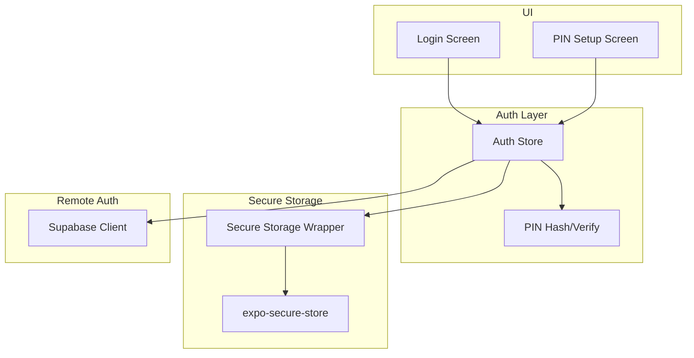
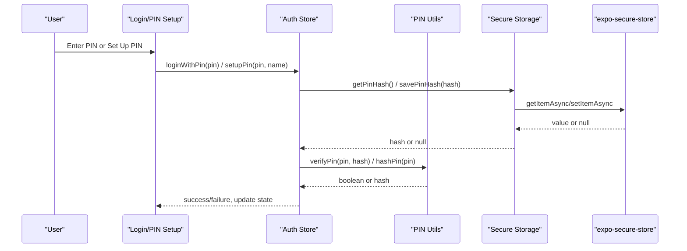
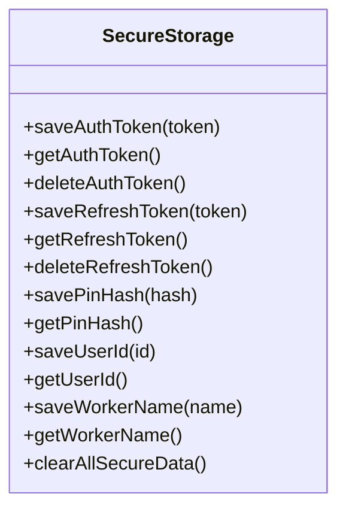
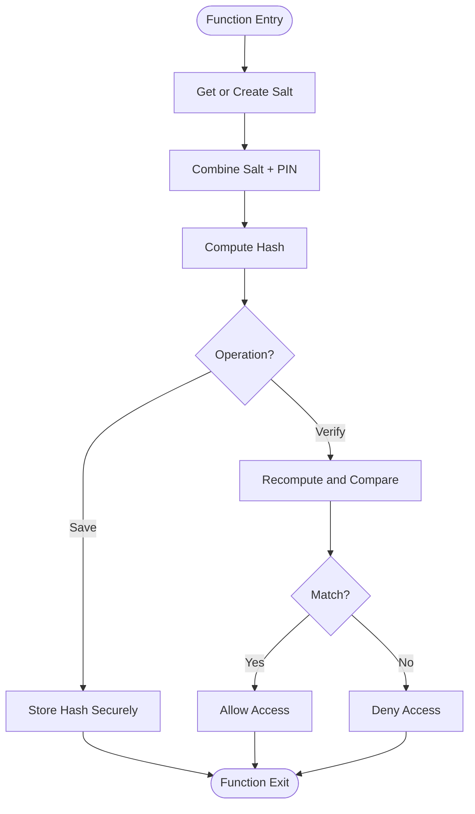
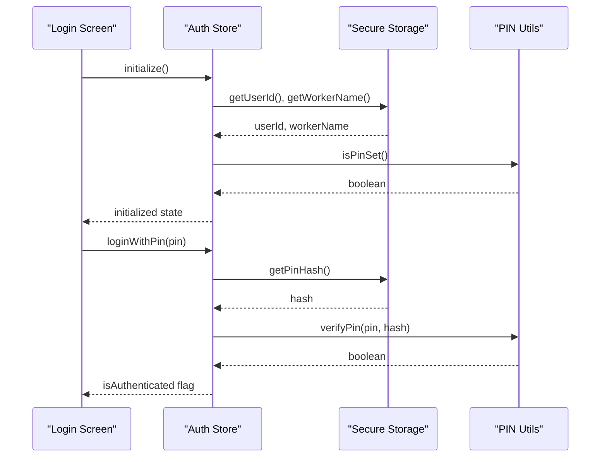
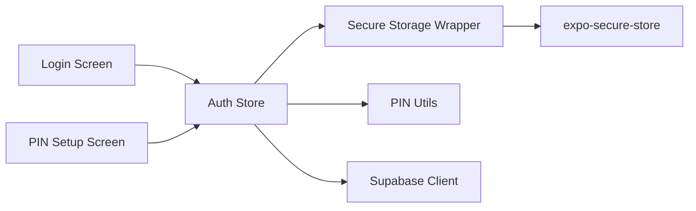

# Secure Storage

<cite>
**Referenced Files in This Document**
- [secureStorage.ts](file://src/lib/secureStorage.ts)
- [pin.ts](file://src/features/auth/pin.ts)
- [store.ts](file://src/features/auth/store.ts)
- [types.ts](file://src/features/auth/types.ts)
- [api.ts](file://src/features/auth/api.ts)
- [supabase.ts](file://src/lib/supabase.ts)
- [login.tsx](file://src/app/(auth)/login.tsx)
- [pin-setup.tsx](file://src/app/(auth)/pin-setup.tsx)
</cite>

## Table of Contents
1. [Introduction](#introduction)
2. [Project Structure](#project-structure)
3. [Core Components](#core-components)
4. [Architecture Overview](#architecture-overview)
5. [Detailed Component Analysis](#detailed-component-analysis)
6. [Dependency Analysis](#dependency-analysis)
7. [Performance Considerations](#performance-considerations)
8. [Troubleshooting Guide](#troubleshooting-guide)
9. [Conclusion](#conclusion)
10. [Appendices](#appendices)

## Introduction
This document explains DermSight’s secure storage implementation for sensitive data such as PIN hashes, user identifiers, worker information, and authentication tokens. It focuses on how the app uses React Native’s secure storage via expo-secure-store to protect credentials and session state, how PIN hashing and verification work locally, and how the application initializes, authenticates, and clears secure data. It also covers platform-specific security considerations and best practices for handling errors and managing the lifecycle of secure data.

## Project Structure
The secure storage system is organized into focused modules:
- A secure storage wrapper that centralizes all access to expo-secure-store.
- Local PIN hashing and verification utilities.
- An auth store that orchestrates initialization, login, setup, logout, and reset flows.
- UI screens that trigger secure operations (PIN setup and login).
- Optional Supabase integration for remote sessions and token refresh.

**Diagram sources**
- [login.tsx:14-46](file://src/app/(auth)/login.tsx#L14-L46)
- [pin-setup.tsx:11-43](file://src/app/(auth)/pin-setup.tsx#L11-L43)
- [store.ts:22-121](file://src/features/auth/store.ts#L22-L121)
- [pin.ts:10-72](file://src/features/auth/pin.ts#L10-L72)
- [secureStorage.ts:8-77](file://src/lib/secureStorage.ts#L8-L77)
- [supabase.ts:8-18](file://src/lib/supabase.ts#L8-L18)

**Section sources**
- [secureStorage.ts:1-77](file://src/lib/secureStorage.ts#L1-L77)
- [pin.ts:1-72](file://src/features/auth/pin.ts#L1-L72)
- [store.ts:1-121](file://src/features/auth/store.ts#L1-L121)
- [login.tsx:1-185](file://src/app/(auth)/login.tsx#L1-L185)
- [pin-setup.tsx:1-129](file://src/app/(auth)/pin-setup.tsx#L1-L129)
- [supabase.ts:1-19](file://src/lib/supabase.ts#L1-L19)

## Core Components
- Secure Storage Wrapper: Provides typed functions to save, read, and delete secure items including auth tokens, refresh tokens, PIN hash, user ID, and worker name. It centralizes key names and exposes a clear API for the rest of the app.
- PIN Utilities: Generate and persist a salt, hash PINs with salt, verify PINs against stored hashes, and check if a PIN has been set up.
- Auth Store: Manages session state (user ID, worker name, authentication flags), initializes from secure storage, handles PIN-based login, sets up PIN and profile, logs out by clearing secure data, and resets state.
- UI Screens: Provide user interactions for PIN setup and login, invoking the auth store methods.
- Remote Auth Integration: Optional Supabase client used for network-based authentication and session management when online.

Key responsibilities:
- Never store plaintext secrets in SQLite; use secure storage for sensitive values.
- Keep local PIN verification offline-capable using hashed values and salts.
- Centralize secure item keys to avoid typos and ensure consistent cleanup.

**Section sources**
- [secureStorage.ts:8-77](file://src/lib/secureStorage.ts#L8-L77)
- [pin.ts:10-72](file://src/features/auth/pin.ts#L10-L72)
- [store.ts:22-121](file://src/features/auth/store.ts#L22-L121)
- [login.tsx:14-46](file://src/app/(auth)/login.tsx#L14-L46)
- [pin-setup.tsx:11-43](file://src/app/(auth)/pin-setup.tsx#L11-L43)
- [api.ts:8-33](file://src/features/auth/api.ts#L8-L33)
- [supabase.ts:8-18](file://src/lib/supabase.ts#L8-L18)

## Architecture Overview
DermSight separates concerns between UI, state management, secure storage, and optional remote auth:
- UI triggers actions (setup PIN, login).
- The auth store coordinates secure storage reads/writes and PIN verification.
- Secure storage delegates to expo-secure-store for OS-backed protection.
- Remote auth can be used alongside local PIN flow for full-stack sessions.

**Diagram sources**
- [store.ts:30-99](file://src/features/auth/store.ts#L30-L99)
- [pin.ts:20-64](file://src/features/auth/pin.ts#L20-L64)
- [secureStorage.ts:17-66](file://src/lib/secureStorage.ts#L17-L66)

## Detailed Component Analysis

### Secure Storage Wrapper
Centralizes all secure storage operations and defines stable keys for sensitive data:
- Keys include auth token, refresh token, PIN hash, user ID, and worker name.
- Functions provide save/get/delete for each key.
- A bulk clear function removes all secure items atomically using parallel deletion.

Security notes:
- Sensitive values are never persisted to SQLite.
- All keys are centralized to prevent accidental leaks through inconsistent naming.
- Bulk clear ensures complete logout and data removal.

**Diagram sources**
- [secureStorage.ts:8-77](file://src/lib/secureStorage.ts#L8-L77)

**Section sources**
- [secureStorage.ts:8-77](file://src/lib/secureStorage.ts#L8-L77)

### PIN Hashing and Verification
Local PIN security relies on:
- Salt generation and persistence in secure storage.
- Simple hashing combining salt and PIN.
- Verification by recomputing the hash with the same salt and comparing.

Flow:
- On first run or when needed, generate and store a salt securely.
- When setting up a PIN, compute a hash and store it securely.
- On login, retrieve the stored hash, recompute with the current salt, and compare.

**Diagram sources**
- [pin.ts:10-64](file://src/features/auth/pin.ts#L10-L64)

**Section sources**
- [pin.ts:10-64](file://src/features/auth/pin.ts#L10-L64)

### Auth Store and Session Management
The auth store manages:
- Initialization: loads user ID, worker name, and PIN status from secure storage.
- PIN-based login: verifies PIN against stored hash and updates authenticated state.
- PIN setup: hashes PIN, stores hash, saves worker name and generates a local user ID.
- Logout: clears all secure data and resets state.
- Reset: clears in-memory state without touching secure storage.

**Diagram sources**
- [store.ts:30-99](file://src/features/auth/store.ts#L30-L99)
- [pin.ts:69-72](file://src/features/auth/pin.ts#L69-L72)

**Section sources**
- [store.ts:22-121](file://src/features/auth/store.ts#L22-L121)
- [types.ts:5-15](file://src/features/auth/types.ts#L5-L15)

### UI Integration Examples
- PIN Setup: Validates input, calls setupPin to hash and store credentials, then navigates to home.
- Login: Supports PIN mode and email/password mode; PIN mode invokes loginWithPin and routes based on result.

These screens demonstrate storing and retrieving authenticated session data through the auth store and secure storage.

**Section sources**
- [pin-setup.tsx:11-43](file://src/app/(auth)/pin-setup.tsx#L11-L43)
- [login.tsx:14-46](file://src/app/(auth)/login.tsx#L14-L46)

### Remote Authentication Integration
When online, the app can integrate with Supabase for server-side sessions:
- Sign-in/sign-out and session retrieval/refresh are provided.
- The secure storage wrapper remains responsible for local sensitive data; remote sessions are managed separately.

**Section sources**
- [api.ts:8-33](file://src/features/auth/api.ts#L8-L33)
- [supabase.ts:8-18](file://src/lib/supabase.ts#L8-L18)

## Dependency Analysis
The secure storage layer depends on expo-secure-store and is consumed by the auth store and PIN utilities. UI components depend on the auth store, which in turn depends on secure storage and PIN utilities. Remote auth is optional and decoupled.

**Diagram sources**
- [login.tsx:14-46](file://src/app/(auth)/login.tsx#L14-L46)
- [pin-setup.tsx:11-43](file://src/app/(auth)/pin-setup.tsx#L11-L43)
- [store.ts:22-121](file://src/features/auth/store.ts#L22-L121)
- [secureStorage.ts:8-77](file://src/lib/secureStorage.ts#L8-L77)
- [pin.ts:10-72](file://src/features/auth/pin.ts#L10-L72)
- [supabase.ts:8-18](file://src/lib/supabase.ts#L8-L18)

**Section sources**
- [store.ts:22-121](file://src/features/auth/store.ts#L22-L121)
- [secureStorage.ts:8-77](file://src/lib/secureStorage.ts#L8-L77)
- [pin.ts:10-72](file://src/features/auth/pin.ts#L10-L72)
- [login.tsx:14-46](file://src/app/(auth)/login.tsx#L14-L46)
- [pin-setup.tsx:11-43](file://src/app/(auth)/pin-setup.tsx#L11-L43)
- [supabase.ts:8-18](file://src/lib/supabase.ts#L8-L18)

## Performance Considerations
- Parallel cleanup: The secure storage wrapper deletes multiple items concurrently to minimize logout latency.
- Minimal I/O: PIN hashing is CPU-bound but lightweight; avoid unnecessary rehashing by caching results where appropriate at higher layers.
- Avoid blocking UI: Auth store sets loading states around async operations to keep the UI responsive.

[No sources needed since this section provides general guidance]

## Troubleshooting Guide
Common issues and resolutions:
- PIN mismatch: Ensure the stored hash exists and the correct salt is used during verification. If verification fails, confirm that the PIN setup completed successfully and that the stored hash was saved.
- Missing secure data after logout: Verify that the logout flow calls the secure storage clear function to remove all sensitive items.
- Initialization failures: If the app cannot read secure data during initialization, ensure error handling sets the initialized flag so the UI can proceed gracefully.
- Network-related auth errors: When using Supabase, handle thrown errors from sign-in/sign-out/session calls appropriately.

Operational tips:
- Always wrap secure storage calls in try/catch at the caller level when necessary to handle unexpected failures.
- Use the bulk clear function to ensure complete data removal on logout or account reset.
- Validate inputs before hashing or storing to avoid malformed entries.

**Section sources**
- [store.ts:30-121](file://src/features/auth/store.ts#L30-L121)
- [pin.ts:20-72](file://src/features/auth/pin.ts#L20-L72)
- [secureStorage.ts:69-77](file://src/lib/secureStorage.ts#L69-L77)
- [api.ts:8-33](file://src/features/auth/api.ts#L8-L33)

## Conclusion
DermSight’s secure storage implementation leverages expo-secure-store to protect sensitive data such as PIN hashes, user IDs, worker names, and authentication tokens. The architecture cleanly separates UI, state management, secure storage, and optional remote auth. PIN hashing and verification operate offline, while the auth store orchestrates secure data lifecycle events like setup, login, logout, and reset. Following the documented patterns ensures robust security, maintainability, and resilience across platforms.

[No sources needed since this section summarizes without analyzing specific files]

## Appendices

### Data Persistence Patterns
- Sensitive values are stored exclusively in secure storage.
- Non-sensitive identifiers (e.g., user ID) may be kept in secure storage for quick access during local sessions.
- Bulk operations are used for comprehensive cleanup to prevent orphaned data.

**Section sources**
- [secureStorage.ts:8-77](file://src/lib/secureStorage.ts#L8-L77)
- [store.ts:80-108](file://src/features/auth/store.ts#L80-L108)

### Platform-Specific Security Considerations
- expo-secure-store uses platform-native secure storage backends (e.g., Keychain on iOS, Keystore on Android), providing OS-level protection for stored items.
- Ensure device biometric or lock screen is enabled for stronger protection on supported platforms.
- Be aware that some emulators or development environments may not enforce the same protections as production devices.

[No sources needed since this section provides general guidance]