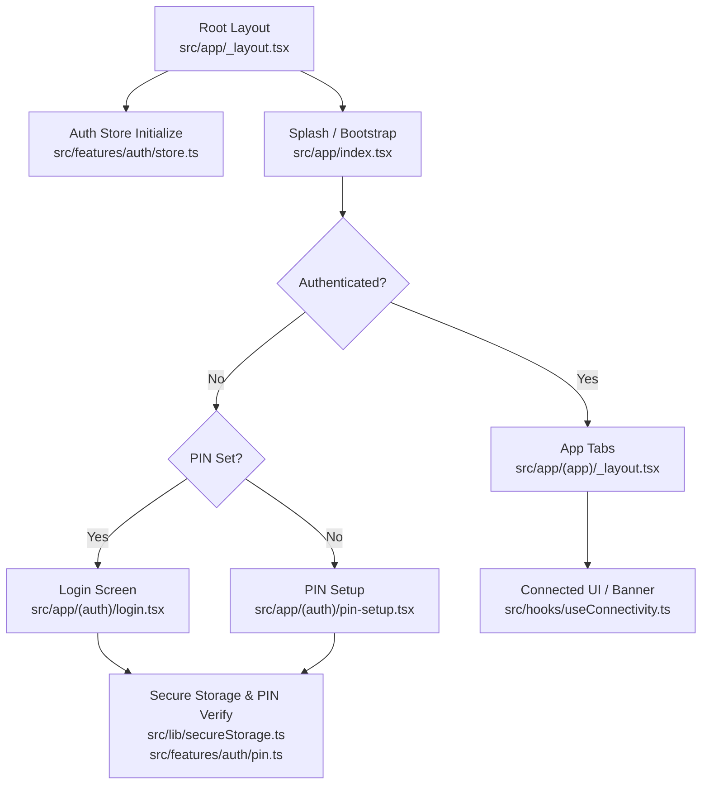
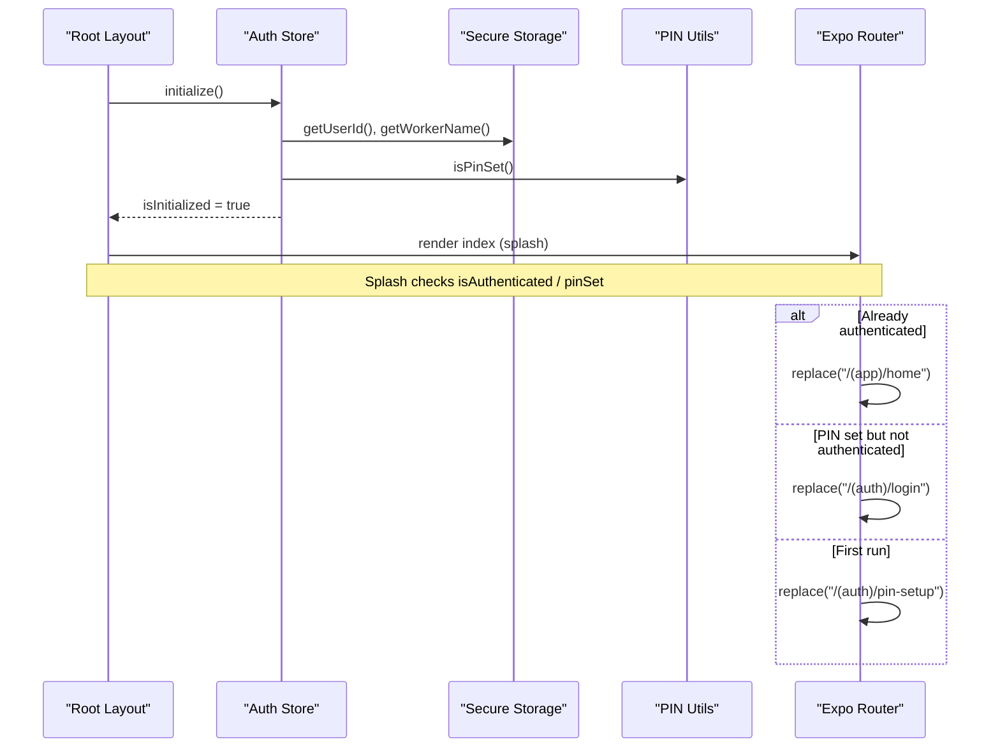
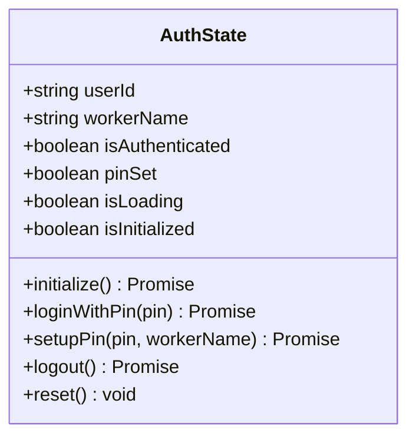
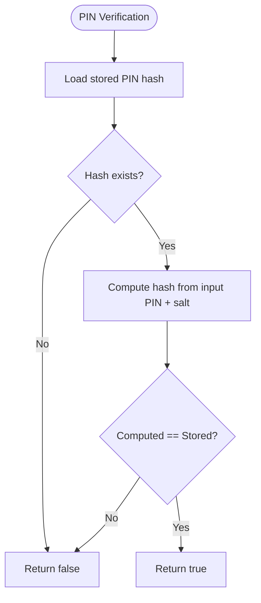
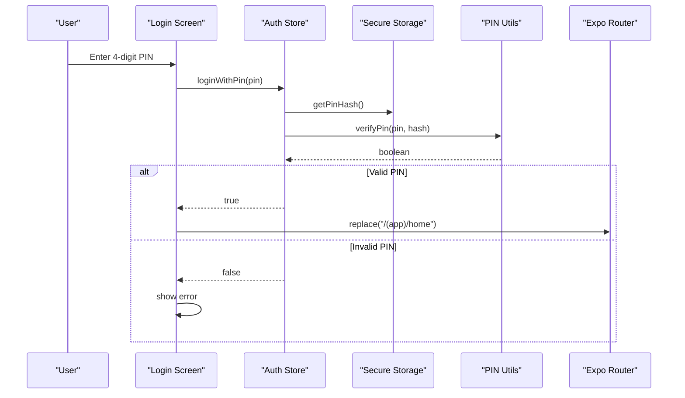
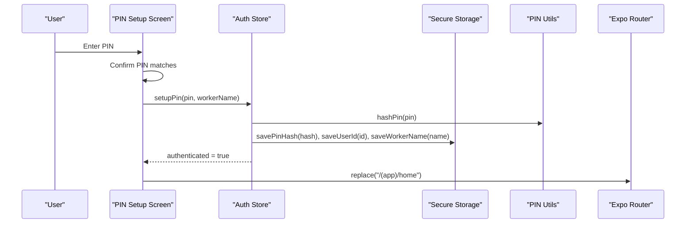
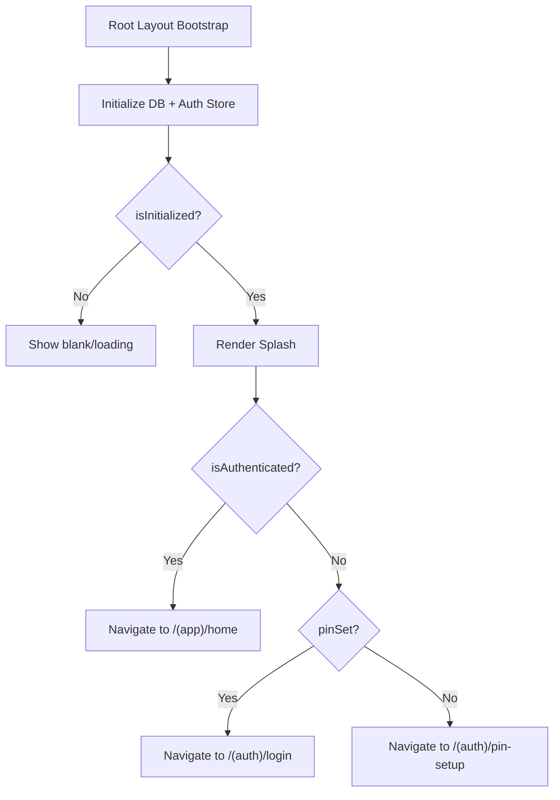
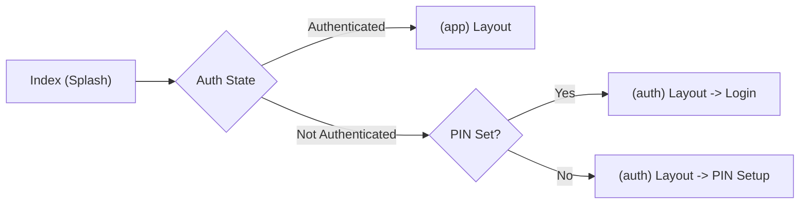
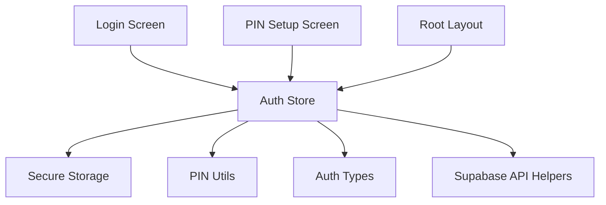

# Session Management

<cite>
**Referenced Files in This Document**
- [store.ts](file://src/features/auth/store.ts)
- [types.ts](file://src/features/auth/types.ts)
- [pin.ts](file://src/features/auth/pin.ts)
- [api.ts](file://src/features/auth/api.ts)
- [secureStorage.ts](file://src/lib/secureStorage.ts)
- [_layout.tsx](file://src/app/_layout.tsx)
- [index.tsx](file://src/app/index.tsx)
- [_layout.tsx](file://src/app/(auth)/_layout.tsx)
- [_layout.tsx](file://src/app/(app)/_layout.tsx)
- [login.tsx](file://src/app/(auth)/login.tsx)
- [pin-setup.tsx](file://src/app/(auth)/pin-setup.tsx)
- [useConnectivity.ts](file://src/hooks/useConnectivity.ts)
</cite>

## Table of Contents
1. [Introduction](#introduction)
2. [Project Structure](#project-structure)
3. [Core Components](#core-components)
4. [Architecture Overview](#architecture-overview)
5. [Detailed Component Analysis](#detailed-component-analysis)
6. [Dependency Analysis](#dependency-analysis)
7. [Performance Considerations](#performance-considerations)
8. [Troubleshooting Guide](#troubleshooting-guide)
9. [Conclusion](#conclusion)

## Introduction
This document explains DermSight’s session management system with a focus on authentication state management using Zustand, the session lifecycle (initialization, login verification, logout, and automatic restoration), and the end-to-end flow from PIN verification to app navigation routing. It also covers examples of hooks for session state, guards and route protection patterns, session timeout handling strategies, concurrent access considerations, and state synchronization across components.

## Project Structure
DermSight organizes authentication logic under features/auth and exposes it via a Zustand store. The root layout bootstraps the database and auth store before rendering routes. The app uses Expo Router groups:
- (auth): Login and PIN setup screens for unauthenticated flows
- (app): Tab-based authenticated screens

**Diagram sources**
- [_layout.tsx:19-50](file://src/app/_layout.tsx#L19-L50)
- [index.tsx:16-43](file://src/app/index.tsx#L16-L43)
- [_layout.tsx:31-85](file://src/app/(app)/_layout.tsx#L31-L85)
- [_layout.tsx:7-13](file://src/app/(auth)/_layout.tsx#L7-L13)
- [login.tsx:14-46](file://src/app/(auth)/login.tsx#L14-L46)
- [pin-setup.tsx:11-43](file://src/app/(auth)/pin-setup.tsx#L11-L43)
- [store.ts:30-49](file://src/features/auth/store.ts#L30-L49)
- [secureStorage.ts:68-77](file://src/lib/secureStorage.ts#L68-L77)
- [pin.ts:69-72](file://src/features/auth/pin.ts#L69-L72)
- [useConnectivity.ts:8-16](file://src/hooks/useConnectivity.ts#L8-L16)

**Section sources**
- [_layout.tsx:19-50](file://src/app/_layout.tsx#L19-L50)
- [index.tsx:16-43](file://src/app/index.tsx#L16-L43)
- [_layout.tsx:31-85](file://src/app/(app)/_layout.tsx#L31-L85)
- [_layout.tsx:7-13](file://src/app/(auth)/_layout.tsx#L7-L13)

## Core Components
- Auth Zustand store: Centralized session state and actions for initialization, PIN login, PIN setup, logout, and reset.
- Secure storage wrapper: Encrypted persistence for tokens, PIN hash, user ID, and worker name.
- PIN utilities: Salted hashing and verification for offline PIN validation.
- Supabase API helpers: Optional online auth operations (sign-in, sign-out, session retrieval, refresh).
- Routing and bootstrap: Root layout initializes DB and auth; splash screen routes based on auth state.

Key responsibilities:
- Initialization reads persisted identity and PIN status, then marks the store initialized.
- PIN login verifies against stored hash and sets authenticated state.
- PIN setup persists new PIN hash and user identity, then authenticates immediately.
- Logout clears secure storage and resets state.

**Section sources**
- [store.ts:10-121](file://src/features/auth/store.ts#L10-L121)
- [secureStorage.ts:8-77](file://src/lib/secureStorage.ts#L8-L77)
- [pin.ts:10-72](file://src/features/auth/pin.ts#L10-L72)
- [api.ts:8-33](file://src/features/auth/api.ts#L8-L33)

## Architecture Overview
The session architecture combines local-first security (Zustand + SecureStore) with optional cloud auth integration.

**Diagram sources**
- [_layout.tsx:23-37](file://src/app/_layout.tsx#L23-L37)
- [store.ts:30-49](file://src/features/auth/store.ts#L30-L49)
- [index.tsx:21-30](file://src/app/index.tsx#L21-L30)

## Detailed Component Analysis

### Authentication State Store (Zustand)
- State fields: userId, workerName, isAuthenticated, pinSet, isLoading, isInitialized.
- Actions:
  - initialize: loads persisted identity and PIN status, sets initialized flag.
  - loginWithPin: validates PIN against stored hash, sets authenticated state.
  - setupPin: hashes PIN, persists credentials and user info, sets authenticated state.
  - logout: clears all secure data and resets state.
  - reset: programmatic state reset for testing or recovery.

**Diagram sources**
- [store.ts:10-121](file://src/features/auth/store.ts#L10-L121)

**Section sources**
- [store.ts:10-121](file://src/features/auth/store.ts#L10-L121)

### PIN Utilities and Secure Storage
- PIN hashing uses a salt retrieved or created in secure storage; verification recomputes hash and compares.
- Secure storage provides typed getters/setters for tokens, PIN hash, user ID, and worker name, plus a bulk clear operation.

**Diagram sources**
- [pin.ts:47-64](file://src/features/auth/pin.ts#L47-L64)
- [secureStorage.ts:42-49](file://src/lib/secureStorage.ts#L42-L49)

**Section sources**
- [pin.ts:10-72](file://src/features/auth/pin.ts#L10-L72)
- [secureStorage.ts:8-77](file://src/lib/secureStorage.ts#L8-L77)

### Login Flow: PIN Verification to Navigation
- The login screen supports both email/password and PIN modes. In PIN mode, it validates length, calls store.loginWithPin, and navigates to the home tab on success.
- On failure, it displays an error message.

**Diagram sources**
- [login.tsx:24-46](file://src/app/(auth)/login.tsx#L24-L46)
- [store.ts:51-78](file://src/features/auth/store.ts#L51-L78)
- [pin.ts:47-64](file://src/features/auth/pin.ts#L47-L64)
- [secureStorage.ts:42-49](file://src/lib/secureStorage.ts#L42-L49)

**Section sources**
- [login.tsx:14-46](file://src/app/(auth)/login.tsx#L14-L46)
- [store.ts:51-78](file://src/features/auth/store.ts#L51-L78)

### PIN Setup Flow: First-Run Enrollment
- Two-step PIN entry with confirmation; on success, persists PIN hash and user info, sets authenticated state, and navigates to home.

**Diagram sources**
- [pin-setup.tsx:23-43](file://src/app/(auth)/pin-setup.tsx#L23-L43)
- [store.ts:80-99](file://src/features/auth/store.ts#L80-L99)
- [pin.ts:32-42](file://src/features/auth/pin.ts#L32-L42)
- [secureStorage.ts:42-66](file://src/lib/secureStorage.ts#L42-L66)

**Section sources**
- [pin-setup.tsx:11-43](file://src/app/(auth)/pin-setup.tsx#L11-L43)
- [store.ts:80-99](file://src/features/auth/store.ts#L80-L99)

### Bootstrapping and Automatic Restoration
- Root layout initializes the database and calls store.initialize to restore persisted identity and PIN status.
- Splash screen routes based on current state:
  - If authenticated: go to app home
  - Else if PIN set: go to login
  - Else: go to PIN setup

**Diagram sources**
- [_layout.tsx:23-41](file://src/app/_layout.tsx#L23-L41)
- [index.tsx:21-30](file://src/app/index.tsx#L21-L30)

**Section sources**
- [_layout.tsx:19-50](file://src/app/_layout.tsx#L19-L50)
- [index.tsx:16-43](file://src/app/index.tsx#L16-L43)

### Route Protection Patterns
- Grouped layouts separate authenticated and unauthenticated flows:
  - (auth) layout contains login and pin-setup
  - (app) layout contains tabs for authenticated users
- The splash screen enforces routing decisions based on store state, effectively acting as a guard at app start.

**Diagram sources**
- [index.tsx:21-30](file://src/app/index.tsx#L21-L30)
- [_layout.tsx:7-13](file://src/app/(auth)/_layout.tsx#L7-L13)
- [_layout.tsx:31-85](file://src/app/(app)/_layout.tsx#L31-L85)

**Section sources**
- [index.tsx:21-30](file://src/app/index.tsx#L21-L30)
- [_layout.tsx:7-13](file://src/app/(auth)/_layout.tsx#L7-L13)
- [_layout.tsx:31-85](file://src/app/(app)/_layout.tsx#L31-L85)

### Hooks and Usage Examples
- useAuthStore: Provides isAuthenticated, pinSet, isLoading, isInitialized, and actions like loginWithPin, setupPin, logout, reset.
- useConnectivity: Monitors online/offline state to inform UI (e.g., banner).

Example usage patterns:
- Read-only state in components: const { isAuthenticated, pinSet } = useAuthStore();
- Triggering login: await useAuthStore.getState().loginWithPin(pin);
- Logging out: await useAuthStore.getState().logout();
- Connectivity-aware UI: const { isOffline } = useConnectivity();

**Section sources**
- [store.ts:22-121](file://src/features/auth/store.ts#L22-L121)
- [useConnectivity.ts:8-16](file://src/hooks/useConnectivity.ts#L8-L16)

## Dependency Analysis
- The auth store depends on:
  - Secure storage for persistent identity and PIN hash
  - PIN utilities for hashing and verification
  - Types for consistent state shape
- Online auth API helpers are available for future or hybrid flows (Supabase), but current PIN flow is fully local.

**Diagram sources**
- [store.ts:5-8](file://src/features/auth/store.ts#L5-L8)
- [secureStorage.ts:8-77](file://src/lib/secureStorage.ts#L8-L77)
- [pin.ts:6-72](file://src/features/auth/pin.ts#L6-L72)
- [api.ts:5-33](file://src/features/auth/api.ts#L5-L33)
- [login.tsx:14-46](file://src/app/(auth)/login.tsx#L14-L46)
- [pin-setup.tsx:11-43](file://src/app/(auth)/pin-setup.tsx#L11-L43)
- [_layout.tsx:19-37](file://src/app/_layout.tsx#L19-L37)

**Section sources**
- [store.ts:5-8](file://src/features/auth/store.ts#L5-L8)
- [secureStorage.ts:8-77](file://src/lib/secureStorage.ts#L8-L77)
- [pin.ts:6-72](file://src/features/auth/pin.ts#L6-L72)
- [api.ts:5-33](file://src/features/auth/api.ts#L5-L33)

## Performance Considerations
- Local-first design minimizes network calls during login/logout; PIN verification is fast and deterministic.
- Secure storage operations are asynchronous; avoid blocking the UI by keeping isLoading states and deferring heavy work.
- Batch clearing secure data on logout reduces multiple writes into a single coordinated operation.
- Consider debouncing rapid re-initializations if multiple components call initialize concurrently; currently, initialize is idempotent and guarded by isInitialized.

[No sources needed since this section provides general guidance]

## Troubleshooting Guide
Common issues and resolutions:
- PIN does not match: Ensure the same salt mechanism is used consistently; verify that stored hash format includes the expected salt segment.
- Persistent state not restored: Confirm that SecureStorage keys are present and readable; check for platform-specific secure store permissions.
- Stuck on loading: Verify that initialize completes and sets isInitialized; inspect any errors thrown during DB init or auth store initialization.
- Unexpected redirects: Validate the conditions in the splash screen routing logic and ensure store state reflects actual session status.

**Section sources**
- [store.ts:30-49](file://src/features/auth/store.ts#L30-L49)
- [pin.ts:47-64](file://src/features/auth/pin.ts#L47-L64)
- [secureStorage.ts:68-77](file://src/lib/secureStorage.ts#L68-L77)
- [index.tsx:21-30](file://src/app/index.tsx#L21-L30)

## Conclusion
DermSight’s session management leverages a local-first approach with a robust Zustand store and secure storage-backed PIN authentication. The root layout bootstraps the app and delegates routing to the splash screen based on current session state. The login and PIN setup flows provide clear, user-friendly interactions while maintaining strong security through hashed PINs. While the current implementation focuses on offline PIN authentication, the codebase includes online auth helpers for future expansion. For production hardening, consider adding explicit route guards per screen, session timeout handling, and enhanced concurrency safeguards around initialization and secure storage operations.