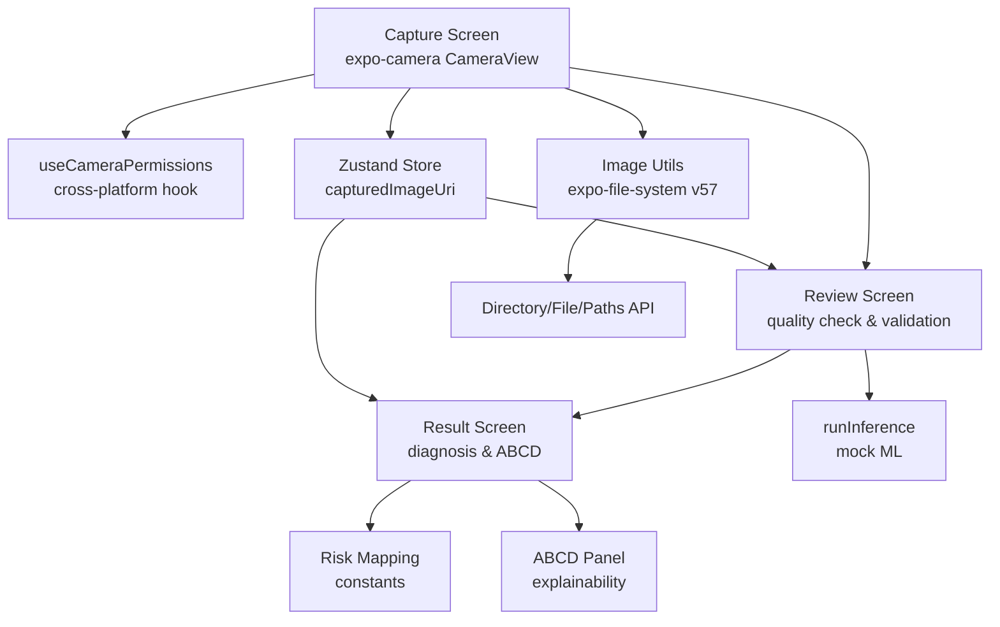
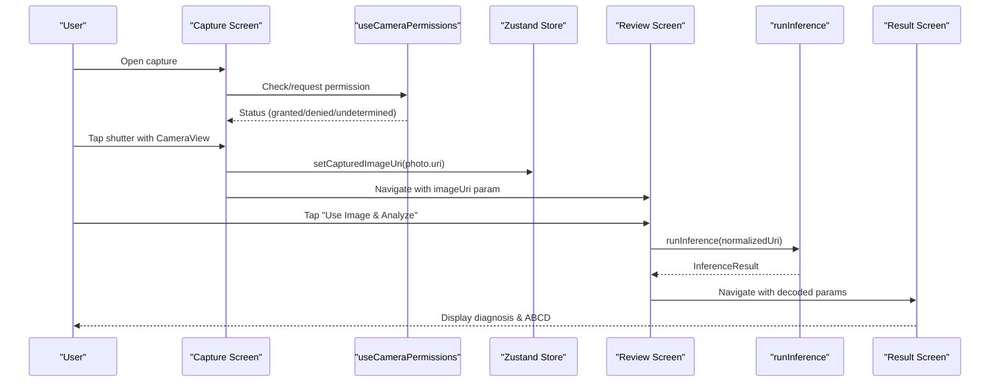
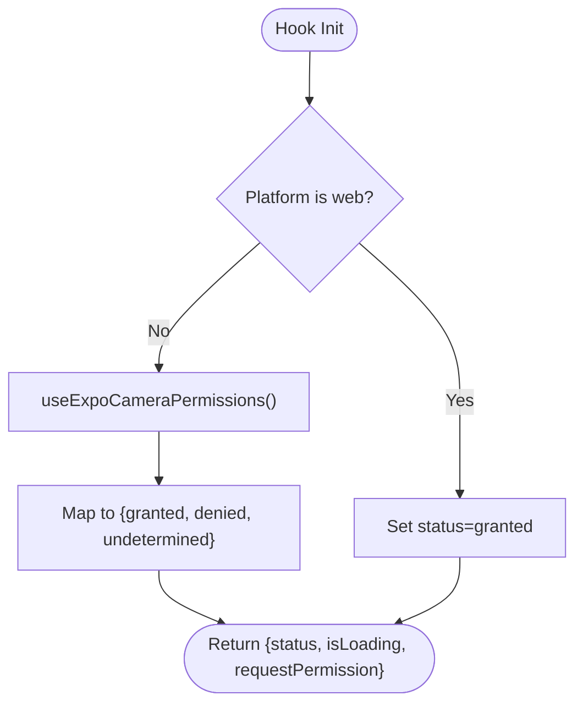
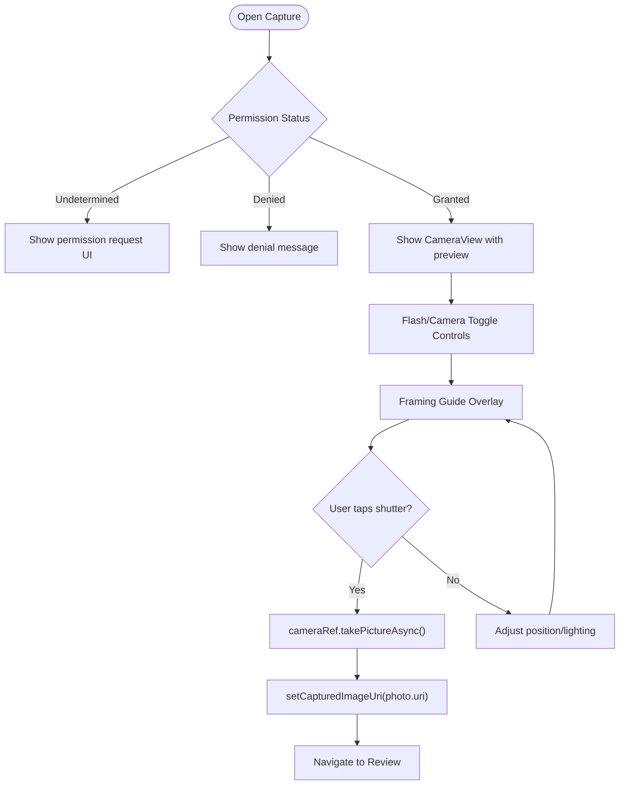
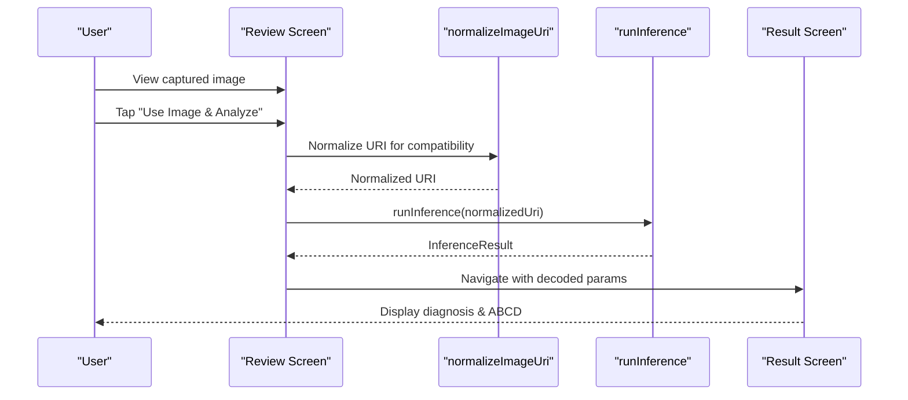
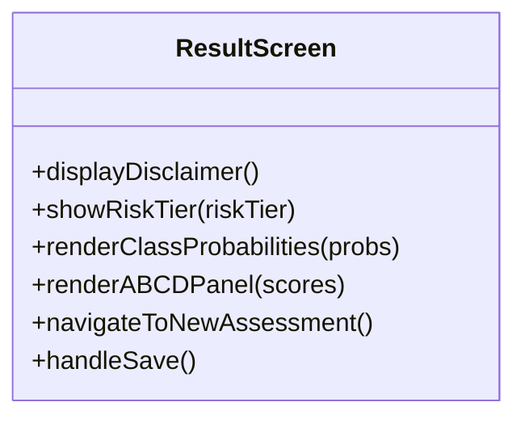
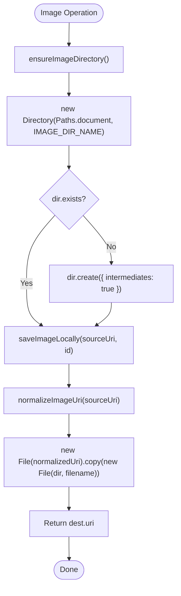
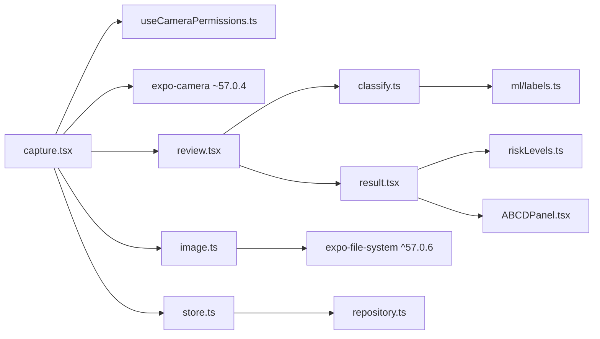

# Camera Integration

<cite>
**Referenced Files in This Document**
- [capture.tsx](file://src/app/(app)/patients/[patientId]/capture.tsx)
- [review.tsx](file://src/app/(app)/patients/[patientId]/review.tsx)
- [result.tsx](file://src/app/(app)/patients/[patientId]/result.tsx)
- [useCameraPermissions.ts](file://src/hooks/useCameraPermissions.ts)
- [image.ts](file://src/utils/image.ts)
- [classify.ts](file://src/features/assessments/inference/classify.ts)
- [store.ts](file://src/features/assessments/store.ts)
- [riskLevels.ts](file://src/constants/riskLevels.ts)
- [ABCDPanel.tsx](file://src/components/assessment/ABCDPanel.tsx)
- [package.json](file://package.json)
</cite>

## Update Summary
**Changes Made**
- Enhanced camera functionality with production-ready features including real-time preview, flash mode toggling, front/back camera switching, and comprehensive permission handling
- Migrated to modern expo-file-system v57 API using Directory, File, and Paths classes for improved file management
- Implemented raw captured image URI storage in Zustand store for seamless state management across screens
- Added recursive safe URI fallback mechanisms to handle various URI formats and encoding issues
- Updated image parameter handling with proper URL-decoding for robust navigation between screens
- Enhanced error handling and user feedback throughout the capture workflow with haptic feedback

## Table of Contents
1. [Introduction](#introduction)
2. [Project Structure](#project-structure)
3. [Core Components](#core-components)
4. [Architecture Overview](#architecture-overview)
5. [Detailed Component Analysis](#detailed-component-analysis)
6. [Dependency Analysis](#dependency-analysis)
7. [Performance Considerations](#performance-considerations)
8. [Troubleshooting Guide](#troubleshooting-guide)
9. [Conclusion](#conclusion)
10. [Appendices](#appendices)

## Introduction
DermSight's camera integration system provides a complete end-to-end solution for capturing lesion images with professional-grade features. The system leverages expo-camera for native camera access with comprehensive permission management, real-time preview capabilities, and sophisticated framing assistance. Healthcare workers can capture high-quality images with guided positioning, review them for quality assurance, and proceed to AI-powered risk assessment with full transparency through ABCD explainability scores.

The system has been enhanced with production-ready features including real-time camera preview, flash control, front/back camera switching, sophisticated framing guides with corner brackets and center crosshair overlays, and comprehensive error handling. The recent migration to expo-file-system v57 API with Directory, File, and Paths classes provides improved file management capabilities and better performance.

## Project Structure
The camera workflow spans multiple screens and supporting components:
- **Capture Screen**: Full-screen camera interface with live preview, framing guides, and comprehensive controls
- **Review Screen**: Image validation interface with quality assessment and analysis options
- **Result Screen**: Comprehensive diagnosis presentation with confidence scores and clinical guidance
- **Permission Hook**: Cross-platform camera permission management with appropriate fallbacks
- **Image Utilities**: Modern file management using expo-file-system v57 API with Directory, File, and Paths classes
- **Inference Module**: Mock classification system ready for TFLite model integration
- **State Management**: Zustand store for managing captured image URIs across the application



**Diagram sources**
- [capture.tsx:1-296](file://src/app/(app)/patients/[patientId]/capture.tsx#L1-L296)
- [review.tsx:1-193](file://src/app/(app)/patients/[patientId]/review.tsx#L1-L193)
- [result.tsx:1-280](file://src/app/(app)/patients/[patientId]/result.tsx#L1-L280)
- [useCameraPermissions.ts:1-38](file://src/hooks/useCameraPermissions.ts#L1-L38)
- [image.ts:1-103](file://src/utils/image.ts#L1-L103)
- [classify.ts:1-62](file://src/features/assessments/inference/classify.ts#L1-L62)
- [store.ts:1-87](file://src/features/assessments/store.ts#L1-L87)
- [riskLevels.ts:1-121](file://src/constants/riskLevels.ts#L1-L121)
- [ABCDPanel.tsx:1-68](file://src/components/assessment/ABCDPanel.tsx#L1-L68)

**Section sources**
- [capture.tsx:1-296](file://src/app/(app)/patients/[patientId]/capture.tsx#L1-L296)
- [review.tsx:1-193](file://src/app/(app)/patients/[patientId]/review.tsx#L1-L193)
- [result.tsx:1-280](file://src/app/(app)/patients/[patientId]/result.tsx#L1-L280)
- [useCameraPermissions.ts:1-38](file://src/hooks/useCameraPermissions.ts#L1-L38)
- [image.ts:1-103](file://src/utils/image.ts#L1-L103)
- [classify.ts:1-62](file://src/features/assessments/inference/classify.ts#L1-L62)
- [store.ts:1-87](file://src/features/assessments/store.ts#L1-L87)
- [riskLevels.ts:1-121](file://src/constants/riskLevels.ts#L1-L121)
- [ABCDPanel.tsx:1-68](file://src/components/assessment/ABCDPanel.tsx#L1-L68)

## Core Components
- **Camera Permission Hook**: Provides status and request flow with platform-specific handling; supports undetermined/denied/granted states with web fallback
- **Capture Screen**: Presents a full-screen CameraView with real-time preview, sophisticated framing guides with corner brackets and center crosshair, instructional overlay, flash mode toggling, front/back camera switching, shutter button, and expandable tips panel
- **Review Screen**: Displays captured image with quality indicator, tips for better results, and actions to analyze or retake
- **Result Screen**: Shows top diagnosis, confidence, class probabilities, ABCD explainability, and recommended actions based on risk tier
- **Image Utilities**: Modern file management using expo-file-system v57 API with Directory, File, and Paths classes for directory creation, file operations, and size information
- **Inference Module**: Mock classifier that returns realistic probabilities, ABCD scores, and risk tier mapping
- **State Management**: Zustand store for managing captured image URIs across the application lifecycle

**Section sources**
- [useCameraPermissions.ts:1-38](file://src/hooks/useCameraPermissions.ts#L1-L38)
- [capture.tsx:1-296](file://src/app/(app)/patients/[patientId]/capture.tsx#L1-L296)
- [review.tsx:1-193](file://src/app/(app)/patients/[patientId]/review.tsx#L1-L193)
- [result.tsx:1-280](file://src/app/(app)/patients/[patientId]/result.tsx#L1-L280)
- [image.ts:1-103](file://src/utils/image.ts#L1-L103)
- [classify.ts:1-62](file://src/features/assessments/inference/classify.ts#L1-L62)
- [store.ts:1-87](file://src/features/assessments/store.ts#L1-L87)

## Architecture Overview
The camera integration follows a linear user journey with robust error handling and comprehensive user feedback:

1. User opens capture screen; permission hook ensures camera access with proper state management
2. Real-time camera preview with sophisticated framing guides and instructions helps position the lesion
3. Shutter triggers capture with optimized quality settings (0.9 quality, EXIF data preservation); captured URI stored in Zustand store and navigation moves to review
4. Review screen validates image quality using normalized URIs and offers analysis with loading states and progress indication
5. Inference runs (currently mock) and navigates to result screen with properly decoded parameters
6. Result screen presents diagnosis, confidence, ABCD scores, and risk tier with clinical guidance



**Diagram sources**
- [capture.tsx:1-296](file://src/app/(app)/patients/[patientId]/capture.tsx#L1-L296)
- [useCameraPermissions.ts:1-38](file://src/hooks/useCameraPermissions.ts#L1-L38)
- [store.ts:1-87](file://src/features/assessments/store.ts#L1-L87)
- [review.tsx:1-193](file://src/app/(app)/patients/[patientId]/review.tsx#L1-L193)
- [classify.ts:1-62](file://src/features/assessments/inference/classify.ts#L1-L62)
- [result.tsx:1-280](file://src/app/(app)/patients/[patientId]/result.tsx#L1-L280)

## Detailed Component Analysis

### Camera Permission Hook
The useCameraPermissions hook provides cross-platform camera permission management with appropriate fallbacks for different environments:

- **Purpose**: Manage camera permission lifecycle with cross-platform support and provide a unified API for requesting access
- **Behavior**: On web/platforms without native camera, assumes granted; otherwise integrates with expo-camera's useCameraPermissions for native permission handling
- **State Management**: Tracks status (granted/denied/undetermined) and loading state during permission requests
- **Integration**: Used by capture screen to gate camera features and guide users through permission flow with appropriate UI states



**Diagram sources**
- [useCameraPermissions.ts:1-38](file://src/hooks/useCameraPermissions.ts#L1-L38)

**Section sources**
- [useCameraPermissions.ts:1-38](file://src/hooks/useCameraPermissions.ts#L1-L38)

### Capture Screen
The capture screen implements a comprehensive camera interface with professional-grade features:

- **Purpose**: Guided lesion capture with real-time camera preview, sophisticated framing guides, and comprehensive controls
- **Key Features**:
  - Live CameraView with real-time preview and hardware acceleration
  - Sophisticated framing guide with corner brackets and center crosshair for precise lesion positioning
  - Instruction overlay advising proper positioning and lighting conditions
  - Flash mode toggling (off/on/auto) with visual indicator showing current mode
  - Front/back camera switching with smooth transitions
  - Shutter button with loading state and capture animation
  - Expandable tips panel providing quick guidance on capturing clear images
  - Haptic feedback for all user interactions
  - Comprehensive error handling for capture failures with user-friendly messages
- **State Management**: Captures image URI and stores it in Zustand store for cross-screen persistence
- **Navigation**: On successful capture, navigates to review screen with both image URI parameter and Zustand store reference



**Diagram sources**
- [capture.tsx:1-296](file://src/app/(app)/patients/[patientId]/capture.tsx#L1-L296)

**Section sources**
- [capture.tsx:1-296](file://src/app/(app)/patients/[patientId]/capture.tsx#L1-L296)

### Review Screen
The review screen provides image validation and analysis initiation:

- **Purpose**: Allow users to verify image quality and proceed to analysis or retake
- **Features**:
  - Actual captured image display with proper sizing and aspect ratio using normalized URIs
  - Quality indicator with visual feedback and descriptive text
  - Tips for better results including natural light, focus, and full lesion capture guidance
  - Loading states during analysis with progress indication and user feedback
  - Actions: "Use Image & Analyze" and "Retake Photo" with appropriate styling
  - File existence checking with fallback mechanisms for missing images
- **URI Handling**: Implements normalizeImageUri function to handle various URI formats and encoding issues
- **Workflow**: Calls inference module and navigates to result screen with inference data and image URI



**Diagram sources**
- [review.tsx:1-193](file://src/app/(app)/patients/[patientId]/review.tsx#L1-L193)
- [image.ts:1-103](file://src/utils/image.ts#L1-L103)
- [classify.ts:1-62](file://src/features/assessments/inference/classify.ts#L1-L62)
- [result.tsx:1-280](file://src/app/(app)/patients/[patientId]/result.tsx#L1-L280)

**Section sources**
- [review.tsx:1-193](file://src/app/(app)/patients/[patientId]/review.tsx#L1-L193)

### Result Screen
The result screen presents comprehensive diagnosis information with clinical context:

- **Purpose**: Present diagnosis, confidence, class probabilities, ABCD explainability, and recommended action based on risk tier
- **Features**:
  - Disclaimer emphasizing screening nature and need for specialist consultation
  - Risk tier badge with color-coded severity and action guidance
  - Class probability list showing all possible diagnoses with confidence levels
  - ABCD panel for transparency into model reasoning
  - Actions to save result or start new assessment
  - Proper parameter parsing with URL-decoding for result data and patient context
  - Fallback mechanisms for image display when local files are unavailable
- **Clinical Integration**: Maps model outputs to clinically meaningful risk tiers with appropriate action items
- **State Management**: Integrates with Zustand store for captured image URI and assessment data



**Diagram sources**
- [result.tsx:1-280](file://src/app/(app)/patients/[patientId]/result.tsx#L1-L280)
- [ABCDPanel.tsx:1-68](file://src/components/assessment/ABCDPanel.tsx#L1-L68)
- [riskLevels.ts:1-121](file://src/constants/riskLevels.ts#L1-L121)

**Section sources**
- [result.tsx:1-280](file://src/app/(app)/patients/[patientId]/result.tsx#L1-L280)
- [ABCDPanel.tsx:1-68](file://src/components/assessment/ABCDPanel.tsx#L1-L68)
- [riskLevels.ts:1-121](file://src/constants/riskLevels.ts#L1-L121)

### Image Utilities
The image utilities provide modern file management using expo-file-system v57 API:

- **Purpose**: Manage local storage for captured images with modern Directory, File, and Paths API
- **Functions**:
  - `ensureImageDirectory`: Creates app-private directory for images using Directory and Paths classes with intermediate directory support
  - `saveImageLocally`: Copies captured image to private storage using File.copy() method with unique naming
  - `deleteLocalImage`: Removes stored image using File.delete() with existence checking
  - `getFileSizeKB`: Returns file size using File.info() for display or analytics purposes
  - `normalizeImageUri`: Handles various URI formats and encoding issues with recursive fallback mechanisms
- **Modern API Benefits**: Type-safe file operations, improved performance, and better memory management compared to legacy API
- **Cross-Platform Support**: Includes platform-specific handling for web vs mobile environments



**Diagram sources**
- [image.ts:1-103](file://src/utils/image.ts#L1-L103)

**Section sources**
- [image.ts:1-103](file://src/utils/image.ts#L1-L103)

### State Management
The Zustand store manages captured image URIs across the application lifecycle:

- **Purpose**: Provide centralized state management for captured image URIs and assessment data
- **Features**:
  - `capturedImageUri`: Stores the most recently captured image URI
  - `setCapturedImageUri`: Action to update the captured image URI
  - Integration with assessment repository for saving and retrieving assessments
  - Cross-screen state persistence for seamless user experience
- **Benefits**: Eliminates prop drilling and provides consistent state access across the application

**Section sources**
- [store.ts:1-87](file://src/features/assessments/store.ts#L1-L87)

### Inference Module
The inference module provides classification results for captured images:

- **Purpose**: Provide classification results for captured images (currently mock implementation)
- **Behavior**:
  - Simulates processing delay for realistic user experience
  - Generates normalized probabilities across model labels
  - Computes ABCD scores and maps predicted class to risk tier
  - Exposes helper function to check model availability
- **Production Readiness**: Designed for easy replacement with TFLite model integration


**Diagram sources**
- [classify.ts:1-62](file://src/features/assessments/inference/classify.ts#L1-L62)
- [riskLevels.ts:1-121](file://src/constants/riskLevels.ts#L1-L121)

**Section sources**
- [classify.ts:1-62](file://src/features/assessments/inference/classify.ts#L1-L62)
- [riskLevels.ts:1-121](file://src/constants/riskLevels.ts#L1-L121)

## Dependency Analysis
Key dependencies and relationships within the camera integration system:

- **Capture Screen**: Depends on routing and UI components; integrates with permission hook for camera access and uses expo-camera for live preview
- **Review Screen**: Depends on inference module and navigation to result screen
- **Result Screen**: Depends on constants for risk mapping and ABCD panel component
- **Image Utilities**: Uses expo-file-system v57 API with Directory, File, and Paths classes for modern file management
- **Inference Module**: Uses model labels and risk level mappings for classification
- **State Management**: Zustand store provides cross-screen state management for captured image URIs



**Diagram sources**
- [capture.tsx:1-296](file://src/app/(app)/patients/[patientId]/capture.tsx#L1-L296)
- [useCameraPermissions.ts:1-38](file://src/hooks/useCameraPermissions.ts#L1-L38)
- [review.tsx:1-193](file://src/app/(app)/patients/[patientId]/review.tsx#L1-L193)
- [classify.ts:1-62](file://src/features/assessments/inference/classify.ts#L1-L62)
- [result.tsx:1-280](file://src/app/(app)/patients/[patientId]/result.tsx#L1-L280)
- [riskLevels.ts:1-121](file://src/constants/riskLevels.ts#L1-L121)
- [ABCDPanel.tsx:1-68](file://src/components/assessment/ABCDPanel.tsx#L1-L68)
- [image.ts:1-103](file://src/utils/image.ts#L1-L103)
- [store.ts:1-87](file://src/features/assessments/store.ts#L1-L87)
- [package.json:15-18](file://package.json#L15-L18)

**Section sources**
- [capture.tsx:1-296](file://src/app/(app)/patients/[patientId]/capture.tsx#L1-L296)
- [review.tsx:1-193](file://src/app/(app)/patients/[patientId]/review.tsx#L1-L193)
- [result.tsx:1-280](file://src/app/(app)/patients/[patientId]/result.tsx#L1-L280)
- [useCameraPermissions.ts:1-38](file://src/hooks/useCameraPermissions.ts#L1-L38)
- [image.ts:1-103](file://src/utils/image.ts#L1-L103)
- [classify.ts:1-62](file://src/features/assessments/inference/classify.ts#L1-L62)
- [store.ts:1-87](file://src/features/assessments/store.ts#L1-L87)
- [riskLevels.ts:1-121](file://src/constants/riskLevels.ts#L1-L121)
- [ABCDPanel.tsx:1-68](file://src/components/assessment/ABCDPanel.tsx#L1-L68)
- [package.json:15-18](file://package.json#L15-L18)

## Performance Considerations
- **Camera Preview**: Uses expo-camera's optimized CameraView component with hardware-accelerated rendering for smooth frame rates
- **Image Capture**: Configured with 0.9 quality setting and EXIF data preservation for optimal balance between quality and performance
- **Memory Management**: Proper cleanup of camera resources after capture; avoid retaining large image buffers in memory
- **Storage**: Store images in app-private directories using modern Directory/File API to minimize overhead and ensure fast access; consider compression before upload to reduce bandwidth
- **Inference**: Batch preprocessing steps and leverage device-specific accelerators when integrating real models; keep UI responsive with progress indicators
- **File Operations**: Modern expo-file-system v57 API provides better performance and type safety for file operations
- **State Management**: Zustand store provides efficient state updates without unnecessary re-renders
- **URI Normalization**: Efficient URI normalization with early returns for web platforms and cached results where applicable

## Troubleshooting Guide
Common issues and resolutions:

- **Camera Unavailable**: If platform lacks camera support or permissions are denied, show informative messages and guide users to settings to enable camera access
- **Permission Denied**: Persist denial state and offer retry flow; on web, assume granted for development but warn about limitations
- **Capture Failures**: Handle exceptions during photo capture with user-friendly error messages and retry options
- **Image Storage Errors**: Handle filesystem errors gracefully using modern Directory/File API; fallback to temporary storage if necessary and notify users
- **Inference Failures**: Catch exceptions during analysis; provide retry option and log errors for diagnostics
- **URI Issues**: Use normalizeImageUri function to handle various URI formats and encoding issues; implement fallback mechanisms for missing files
- **State Synchronization**: Ensure Zustand store is properly updated and accessed across screens to maintain consistent state

**Section sources**
- [useCameraPermissions.ts:1-38](file://src/hooks/useCameraPermissions.ts#L1-L38)
- [capture.tsx:1-296](file://src/app/(app)/patients/[patientId]/capture.tsx#L1-L296)
- [review.tsx:1-193](file://src/app/(app)/patients/[patientId]/review.tsx#L1-L193)
- [image.ts:1-103](file://src/utils/image.ts#L1-L103)

## Conclusion
DermSight's camera integration provides a production-ready, user-friendly workflow for capturing lesion images with real-time preview, sophisticated framing guides, and comprehensive permission handling. The system leverages expo-camera for native camera access while maintaining a clean abstraction layer through the useCameraPermissions hook. The recent enhancements include production-ready features like flash control, camera switching, and sophisticated framing guides, along with the migration to expo-file-system v57 API with Directory, File, and Paths classes for improved file management. The addition of Zustand store for state management and robust URI normalization mechanisms ensures reliable operation across different platforms and edge cases. The design emphasizes clarity, accessibility, and reliability to support healthcare workers in diverse environments, with robust error handling and user feedback throughout the capture and analysis workflow.

## Appendices

### Cross-Platform Compatibility Notes
- **iOS/Android**: Uses expo-camera for native camera access with proper permission handling aligned with platform requirements
- **Web**: Continues assuming granted for development; informs users of limited functionality and encourages mobile use for clinical workflows
- **Permission States**: Consistent handling of undetermined/denied/granted states across all platforms with appropriate UI feedback
- **File System**: Modern expo-file-system v57 API provides consistent behavior across platforms with platform-specific optimizations

### Accessibility Considerations
- **High Contrast**: Framing guides and overlays remain visible under various lighting conditions with appropriate contrast ratios
- **VoiceOver/TalkBack**: All interactive elements (shutter, tips, buttons) are properly labeled for screen readers
- **Lighting Guidance**: Clear instructions provided to improve image quality in low-light scenarios with practical tips
- **Touch Targets**: All interactive elements meet minimum touch target sizes for accessibility compliance
- **Haptic Feedback**: Provides tactile confirmation for user interactions to enhance accessibility

### Implementation Examples

#### Camera Permission Management
The useCameraPermissions hook provides consistent permission handling across platforms:

```typescript
// Platform-aware permission handling
if (Platform.OS === "web") {
  return {
    status: "granted",
    isLoading: false,
    requestPermission: async () => true,
  };
}
```

#### Real-time Camera Capture with State Management
The capture screen implements proper camera lifecycle management with Zustand store integration:

```typescript
const handleCapture = async () => {
  const photo = await cameraRef.current.takePictureAsync({
    quality: 0.9,
    skipProcessing: true,
    exif: true,
  });
  
  if (photo?.uri) {
    setCapturedImageUri(photo.uri); // Store in Zustand store
    router.push({
      pathname: `/(app)/patients/${patientId}/review`,
      params: { imageUri: photo.uri },
    } as Href);
  }
};
```

#### Modern File Management with expo-file-system v57
The image utilities demonstrate the new API usage with Directory, File, and Paths classes:

```typescript
// Using Directory, File, and Paths classes
const dir = new Directory(Paths.document, IMAGE_DIR_NAME);
if (!dir.exists) {
  dir.create({ intermediates: true });
}
const normalizedSource = normalizeImageUri(sourceUri);
const source = new File(normalizedSource);
const dest = new File(dir, `${assessmentId}.jpg`);
await source.copy(dest);
```

#### URI Normalization and Fallback Mechanisms
The review screen handles various URI formats with robust fallback mechanisms:

```typescript
const rawUri = capturedImageUri || imageUri || "";
const activeImageUri = normalizeImageUri(rawUri);
// Falls back to placeholder if image doesn't exist
{activeImageUri ? (
  <Image source={{ uri: activeImageUri }} ... />
) : (
  <View className="flex-1 items-center justify-center">
    {/* Fallback placeholder */}
  </View>
)}
```

#### Parameter Decoding and Error Handling
The result screen implements proper URL-decoding with fallback mechanisms:

```typescript
if (resultParam) {
  try {
    const decoded = decodeURIComponent(resultParam);
    setInferenceResult(JSON.parse(decoded));
  } catch (e) {
    try {
      setInferenceResult(JSON.parse(resultParam));
    } catch (innerError) {
      console.error("Failed to parse resultParam:", innerError);
    }
  }
}
```