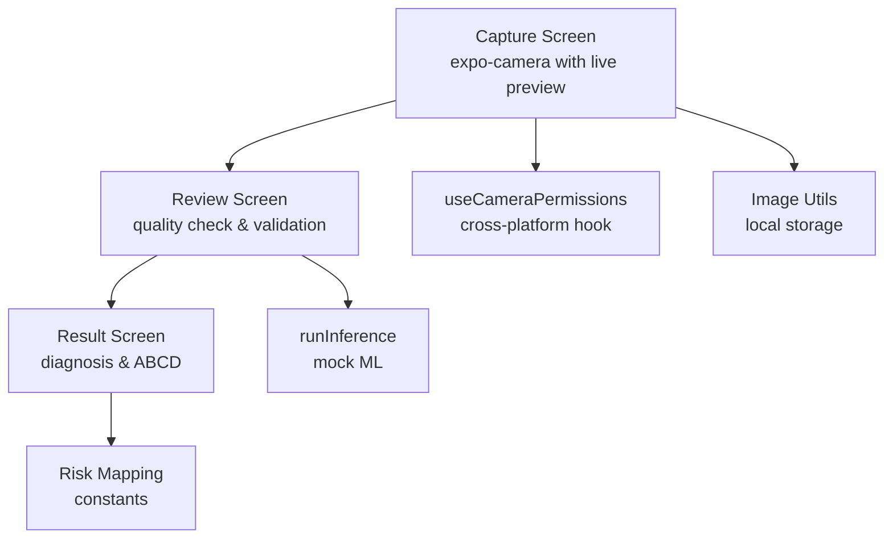
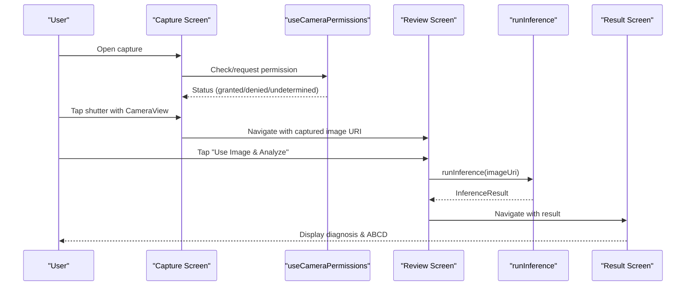
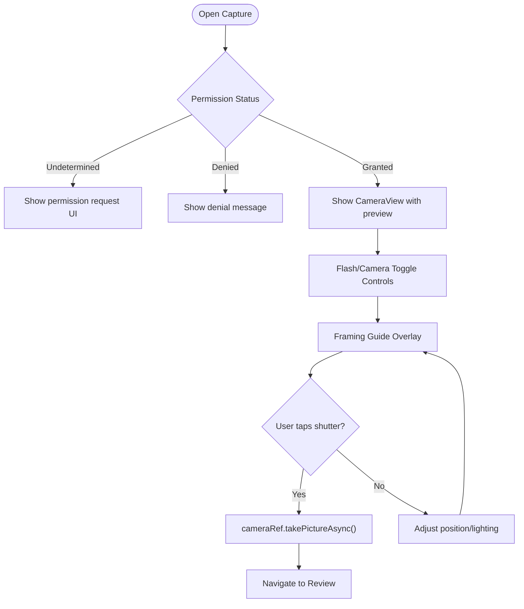
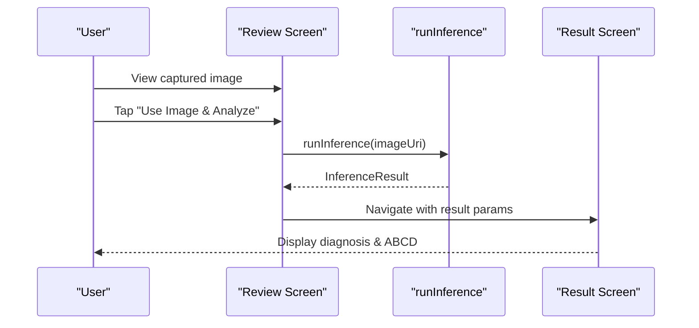
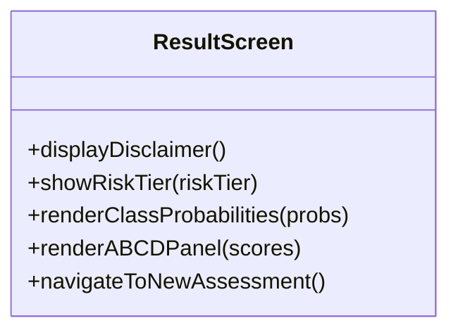
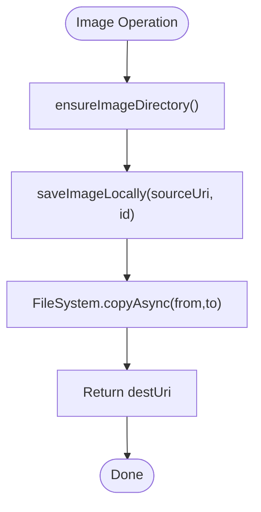
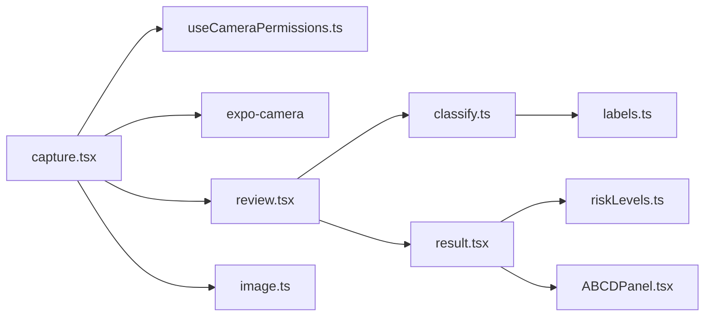

# Camera Integration

<cite>
**Referenced Files in This Document**
- [capture.tsx](file://src/app/(app)/patients/[patientId]/capture.tsx)
- [review.tsx](file://src/app/(app)/patients/[patientId]/review.tsx)
- [result.tsx](file://src/app/(app)/patients/[patientId]/result.tsx)
- [useCameraPermissions.ts](file://src/hooks/useCameraPermissions.ts)
- [image.ts](file://src/utils/image.ts)
- [classify.ts](file://src/features/assessments/inference/classify.ts)
- [riskLevels.ts](file://src/constants/riskLevels.ts)
- [labels.ts](file://src/ml/labels.ts)
- [ABCDPanel.tsx](file://src/components/assessment/ABCDPanel.tsx)
</cite>

## Update Summary
**Changes Made**
- Updated capture screen implementation from placeholder to production-ready expo-camera with real-time preview
- Enhanced permission handling with proper undetermined/denied/granted states
- Added flash mode toggling and front/back camera switching functionality
- Implemented sophisticated framing guides with corner brackets and center crosshair
- Updated review screen to display actual captured images instead of placeholders
- Enhanced useCameraPermissions hook for consistent cross-platform permission management
- Improved error handling and user feedback throughout the capture workflow

## Table of Contents
1. [Introduction](#introduction)
2. [Project Structure](#project-structure)
3. [Core Components](#core-components)
4. [Architecture Overview](#architecture-overview)
5. [Detailed Component Analysis](#detailed-component-analysis)
6. [Dependency Analysis](#dependency-analysis)
7. [Performance Considerations](#performance-considerations)
8. [Troubleshooting Guide](#troubleshooting-guide)
9. [Conclusion](#conclusion)
10. [Appendices](#appendices)

## Introduction
This document explains DermSight's production-ready camera integration system end-to-end: from requesting camera permissions through guided lesion image capture with real-time preview and sophisticated framing guides, to reviewing image quality and running inference for risk assessment. The system uses expo-camera for native camera access with comprehensive permission handling, flash control, and camera switching capabilities. The review interface allows users to verify image quality before proceeding to analysis, and the result screen presents diagnosis probabilities, ABCD explainability, and recommended actions.

## Project Structure
The camera workflow spans several screens and utilities:
- Capture screen provides a full-screen camera preview with framing guides, instructional overlays, and mode toggles.
- Review screen displays the captured image, quality indicators, and options to analyze or retake.
- Result screen shows classification results, confidence, and ABCD scores.
- A hook manages camera permission state and requests across platforms.
- Image utilities handle local storage operations for captured images.
- Inference module runs mock classification and maps classes to risk tiers.



**Diagram sources**
- [capture.tsx:1-248](file://src/app/(app)/patients/[patientId]/capture.tsx#L1-L248)
- [review.tsx:1-150](file://src/app/(app)/patients/[patientId]/review.tsx#L1-L150)
- [result.tsx:1-127](file://src/app/(app)/patients/[patientId]/result.tsx#L1-L127)
- [useCameraPermissions.ts:1-38](file://src/hooks/useCameraPermissions.ts#L1-L38)
- [image.ts:1-52](file://src/utils/image.ts#L1-L52)
- [classify.ts:1-62](file://src/features/assessments/inference/classify.ts#L1-L62)
- [riskLevels.ts:1-121](file://src/constants/riskLevels.ts#L1-L121)

**Section sources**
- [capture.tsx:1-248](file://src/app/(app)/patients/[patientId]/capture.tsx#L1-L248)
- [review.tsx:1-150](file://src/app/(app)/patients/[patientId]/review.tsx#L1-L150)
- [result.tsx:1-127](file://src/app/(app)/patients/[patientId]/result.tsx#L1-L127)
- [useCameraPermissions.ts:1-38](file://src/hooks/useCameraPermissions.ts#L1-L38)
- [image.ts:1-52](file://src/utils/image.ts#L1-L52)
- [classify.ts:1-62](file://src/features/assessments/inference/classify.ts#L1-L62)
- [riskLevels.ts:1-121](file://src/constants/riskLevels.ts#L1-L121)

## Core Components
- **Camera Permission Hook**: Provides status and request flow with platform-specific handling; supports undetermined/denied/granted states with web fallback.
- **Capture Screen**: Presents a full-screen CameraView with real-time preview, framing guides with corner brackets and center crosshair, instructional overlay, flash mode toggling, front/back camera switching, shutter button, and expandable tips panel.
- **Review Screen**: Displays captured image with quality indicator, tips for better results, and actions to analyze or retake.
- **Result Screen**: Shows top diagnosis, confidence, class probabilities, ABCD explainability, and next actions.
- **Image Utilities**: Ensure directory, copy image to app storage, delete, and get file size.
- **Inference Module**: Mock classifier that returns realistic probabilities, ABCD scores, and risk tier mapping.

**Section sources**
- [useCameraPermissions.ts:1-38](file://src/hooks/useCameraPermissions.ts#L1-L38)
- [capture.tsx:1-248](file://src/app/(app)/patients/[patientId]/capture.tsx#L1-L248)
- [review.tsx:1-150](file://src/app/(app)/patients/[patientId]/review.tsx#L1-L150)
- [result.tsx:1-127](file://src/app/(app)/patients/[patientId]/result.tsx#L1-L127)
- [image.ts:1-52](file://src/utils/image.ts#L1-L52)
- [classify.ts:1-62](file://src/features/assessments/inference/classify.ts#L1-L62)

## Architecture Overview
The camera integration follows a linear user journey with robust error handling:
1. User opens capture screen; permission hook ensures camera access with proper state management.
2. Real-time camera preview with framing guides and instructions help position the lesion.
3. Shutter triggers capture with quality settings (0.8 quality, EXIF data); navigation moves to review.
4. Review screen validates image quality and offers analysis with loading states.
5. Inference runs (currently mock) and navigates to result.
6. Result screen presents diagnosis, confidence, ABCD scores, and risk tier.



**Diagram sources**
- [capture.tsx:1-248](file://src/app/(app)/patients/[patientId]/capture.tsx#L1-L248)
- [useCameraPermissions.ts:1-38](file://src/hooks/useCameraPermissions.ts#L1-L38)
- [review.tsx:1-150](file://src/app/(app)/patients/[patientId]/review.tsx#L1-L150)
- [classify.ts:1-62](file://src/features/assessments/inference/classify.ts#L1-L62)
- [result.tsx:1-127](file://src/app/(app)/patients/[patientId]/result.tsx#L1-L127)

## Detailed Component Analysis

### Camera Permission Hook
- **Purpose**: Manage camera permission lifecycle with cross-platform support and provide a unified API for requesting access.
- **Behavior**: On web/platforms without native camera, assumes granted; otherwise integrates with expo-camera's useCameraPermissions for native permission handling.
- **State**: Tracks status (granted/denied/undetermined) and loading state during request.
- **Integration**: Used by capture screen to gate camera features and guide users through permission flow with appropriate UI states.


**Diagram sources**
- [useCameraPermissions.ts:1-38](file://src/hooks/useCameraPermissions.ts#L1-L38)

**Section sources**
- [useCameraPermissions.ts:1-38](file://src/hooks/useCameraPermissions.ts#L1-L38)

### Capture Screen
- **Purpose**: Guided lesion capture with real-time camera preview, sophisticated framing guides, and comprehensive controls.
- **Features**:
  - Live CameraView with real-time preview and hardware acceleration.
  - Framing guide with corner brackets and center crosshair to aid alignment.
  - Instruction overlay advising proper positioning and lighting.
  - Flash mode toggling (off/on/auto) with visual indicator.
  - Front/back camera switching with smooth transitions.
  - Shutter button with loading state and capture animation.
  - Expandable tips panel for quick guidance on capturing clear images.
  - Comprehensive error handling for capture failures.
- **Navigation**: On capture, navigates to review screen with image URI and patient ID parameters.



**Diagram sources**
- [capture.tsx:1-248](file://src/app/(app)/patients/[patientId]/capture.tsx#L1-L248)

**Section sources**
- [capture.tsx:1-248](file://src/app/(app)/patients/[patientId]/capture.tsx#L1-L248)

### Review Screen
- **Purpose**: Allow users to verify image quality and proceed to analysis or retake.
- **Features**:
  - Actual captured image display with proper sizing and aspect ratio.
  - Quality indicator with visual feedback.
  - Tips for better results (natural light, focus, full lesion capture).
  - Loading states during analysis with progress indication.
  - Actions: "Use Image & Analyze" and "Retake Photo".
- **Workflow**: Calls inference module and navigates to result screen with inference data and image URI.



**Diagram sources**
- [review.tsx:1-150](file://src/app/(app)/patients/[patientId]/review.tsx#L1-L150)
- [classify.ts:1-62](file://src/features/assessments/inference/classify.ts#L1-L62)
- [result.tsx:1-127](file://src/app/(app)/patients/[patientId]/result.tsx#L1-L127)

**Section sources**
- [review.tsx:1-150](file://src/app/(app)/patients/[patientId]/review.tsx#L1-L150)

### Result Screen
- **Purpose**: Present diagnosis, confidence, class probabilities, ABCD explainability, and recommended action based on risk tier.
- **Features**:
  - Disclaimer emphasizing screening nature.
  - Risk tier badge with color-coded severity and action guidance.
  - Class probability list and ABCD panel for transparency.
  - Actions to save result or start new assessment.
  - Proper parameter parsing for result data and patient context.



**Diagram sources**
- [result.tsx:1-127](file://src/app/(app)/patients/[patientId]/result.tsx#L1-L127)
- [ABCDPanel.tsx:1-68](file://src/components/assessment/ABCDPanel.tsx#L1-L68)
- [riskLevels.ts:1-121](file://src/constants/riskLevels.ts#L1-L121)

**Section sources**
- [result.tsx:1-127](file://src/app/(app)/patients/[patientId]/result.tsx#L1-L127)
- [ABCDPanel.tsx:1-68](file://src/components/assessment/ABCDPanel.tsx#L1-L68)
- [riskLevels.ts:1-121](file://src/constants/riskLevels.ts#L1-L121)

### Image Utilities
- **Purpose**: Manage local storage for captured images with proper directory management.
- **Functions**:
  - ensureImageDirectory: Creates app-private directory for images.
  - saveImageLocally: Copies captured image to private storage.
  - deleteLocalImage: Removes stored image.
  - getFileSizeKB: Returns file size for display or analytics.



**Diagram sources**
- [image.ts:1-52](file://src/utils/image.ts#L1-L52)

**Section sources**
- [image.ts:1-52](file://src/utils/image.ts#L1-L52)

### Inference Module
- **Purpose**: Provide classification results for captured images (currently mock).
- **Behavior**:
  - Simulates processing delay.
  - Generates normalized probabilities across model labels.
  - Computes ABCD scores and maps predicted class to risk tier.
  - Exposes helper to check model availability.


**Diagram sources**
- [classify.ts:1-62](file://src/features/assessments/inference/classify.ts#L1-L62)
- [riskLevels.ts:1-121](file://src/constants/riskLevels.ts#L1-L121)
- [labels.ts:1-26](file://src/ml/labels.ts#L1-L26)

**Section sources**
- [classify.ts:1-62](file://src/features/assessments/inference/classify.ts#L1-L62)
- [riskLevels.ts:1-121](file://src/constants/riskLevels.ts#L1-L121)
- [labels.ts:1-26](file://src/ml/labels.ts#L1-L26)

## Dependency Analysis
Key dependencies and relationships:
- Capture depends on routing and UI components; integrates with permission hook for camera access and uses expo-camera for live preview.
- Review depends on inference module and navigation to result.
- Result depends on constants for risk mapping and ABCD panel component.
- Image utilities are independent but used by capture/review flows for storage.
- Inference uses model labels and risk level mappings.



**Diagram sources**
- [capture.tsx:1-248](file://src/app/(app)/patients/[patientId]/capture.tsx#L1-L248)
- [useCameraPermissions.ts:1-38](file://src/hooks/useCameraPermissions.ts#L1-L38)
- [review.tsx:1-150](file://src/app/(app)/patients/[patientId]/review.tsx#L1-L150)
- [classify.ts:1-62](file://src/features/assessments/inference/classify.ts#L1-L62)
- [result.tsx:1-127](file://src/app/(app)/patients/[patientId]/result.tsx#L1-L127)
- [riskLevels.ts:1-121](file://src/constants/riskLevels.ts#L1-L121)
- [ABCDPanel.tsx:1-68](file://src/components/assessment/ABCDPanel.tsx#L1-L68)
- [image.ts:1-52](file://src/utils/image.ts#L1-L52)
- [labels.ts:1-26](file://src/ml/labels.ts#L1-L26)

**Section sources**
- [capture.tsx:1-248](file://src/app/(app)/patients/[patientId]/capture.tsx#L1-L248)
- [review.tsx:1-150](file://src/app/(app)/patients/[patientId]/review.tsx#L1-L150)
- [result.tsx:1-127](file://src/app/(app)/patients/[patientId]/result.tsx#L1-L127)
- [useCameraPermissions.ts:1-38](file://src/hooks/useCameraPermissions.ts#L1-L38)
- [image.ts:1-52](file://src/utils/image.ts#L1-L52)
- [classify.ts:1-62](file://src/features/assessments/inference/classify.ts#L1-L62)
- [riskLevels.ts:1-121](file://src/constants/riskLevels.ts#L1-L121)
- [ABCDPanel.tsx:1-68](file://src/components/assessment/ABCDPanel.tsx#L1-L68)
- [labels.ts:1-26](file://src/ml/labels.ts#L1-L26)

## Performance Considerations
- **Camera Preview**: Uses expo-camera's optimized CameraView component with hardware-accelerated rendering for smooth frame rates.
- **Image Capture**: Configured with 0.8 quality setting and EXIF data preservation for optimal balance between quality and performance.
- **Memory Management**: Proper cleanup of camera resources after capture; avoid retaining large image buffers in memory.
- **Storage**: Store images in app-private directories to minimize overhead and ensure fast access; consider compression before upload to reduce bandwidth.
- **Inference**: Batch preprocessing steps and leverage device-specific accelerators when integrating real models; keep UI responsive with progress indicators.

## Troubleshooting Guide
Common issues and resolutions:
- **Camera Unavailable**: If platform lacks camera support or permissions are denied, show informative messages and guide users to settings to enable camera access.
- **Permission Denied**: Persist denial state and offer retry flow; on web, assume granted for development but warn about limitations.
- **Capture Failures**: Handle exceptions during photo capture with user-friendly error messages and retry options.
- **Image Storage Errors**: Handle filesystem errors gracefully; fallback to temporary storage if necessary and notify users.
- **Inference Failures**: Catch exceptions during analysis; provide retry option and log errors for diagnostics.

**Section sources**
- [useCameraPermissions.ts:1-38](file://src/hooks/useCameraPermissions.ts#L1-L38)
- [capture.tsx:1-248](file://src/app/(app)/patients/[patientId]/capture.tsx#L1-L248)
- [review.tsx:1-150](file://src/app/(app)/patients/[patientId]/review.tsx#L1-L150)
- [image.ts:1-52](file://src/utils/image.ts#L1-L52)

## Conclusion
DermSight's camera integration provides a production-ready, user-friendly workflow for capturing lesion images with real-time preview, sophisticated framing guides, and comprehensive permission handling. The system leverages expo-camera for native camera access while maintaining a clean abstraction layer through the useCameraPermissions hook. The design emphasizes clarity, accessibility, and reliability to support healthcare workers in diverse environments, with robust error handling and user feedback throughout the capture and analysis workflow.

## Appendices

### Cross-Platform Compatibility Notes
- **iOS/Android**: Uses expo-camera for native camera access with proper permission handling aligned with platform requirements.
- **Web**: Continues assuming granted for development; informs users of limited functionality and encourages mobile use for clinical workflows.
- **Permission States**: Consistent handling of undetermined/denied/granted states across all platforms with appropriate UI feedback.

### Accessibility Considerations
- **High Contrast**: Framing guides and overlays remain visible under various lighting conditions with appropriate contrast ratios.
- **VoiceOver/TalkBack**: All interactive elements (shutter, tips, buttons) are properly labeled for screen readers.
- **Lighting Guidance**: Clear instructions provided to improve image quality in low-light scenarios with practical tips.
- **Touch Targets**: All interactive elements meet minimum touch target sizes for accessibility compliance.

### Implementation Examples

#### Camera Permission Management
The useCameraPermissions hook provides consistent permission handling across platforms:

```typescript
// Platform-aware permission handling
if (Platform.OS === "web") {
  return {
    status: "granted",
    isLoading: false,
    requestPermission: async () => true,
  };
}
```

#### Real-time Camera Capture
The capture screen implements proper camera lifecycle management:

```typescript
const handleCapture = async () => {
  const photo = await cameraRef.current.takePictureAsync({
    quality: 0.8,
    skipProcessing: false,
    exif: true,
  });
};
```

#### Image Review and Validation
The review screen handles both successful captures and fallback scenarios:

```typescript
{imageUri ? (
  <Image source={{ uri: imageUri }} className="w-full h-full" resizeMode="cover" />
) : (
  <View className="flex-1 items-center justify-center">
    {/* Fallback placeholder */}
  </View>
)}
```