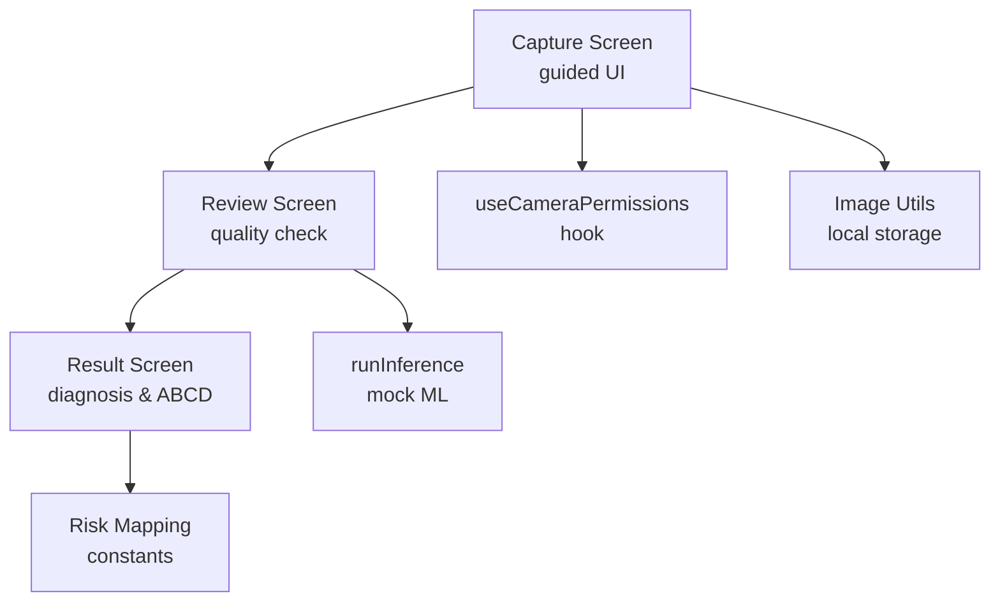
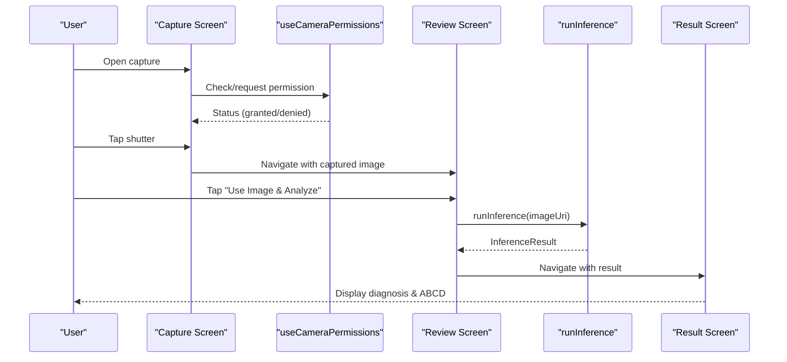
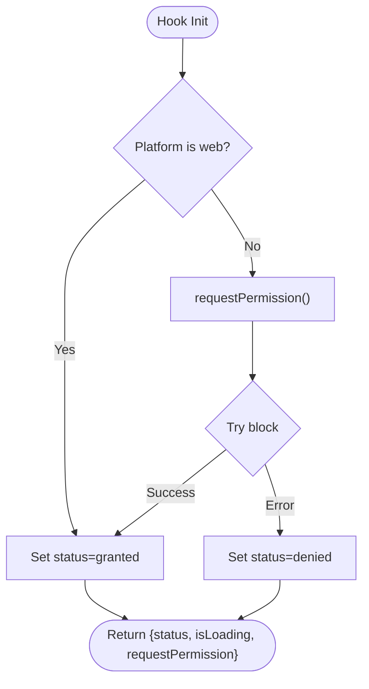
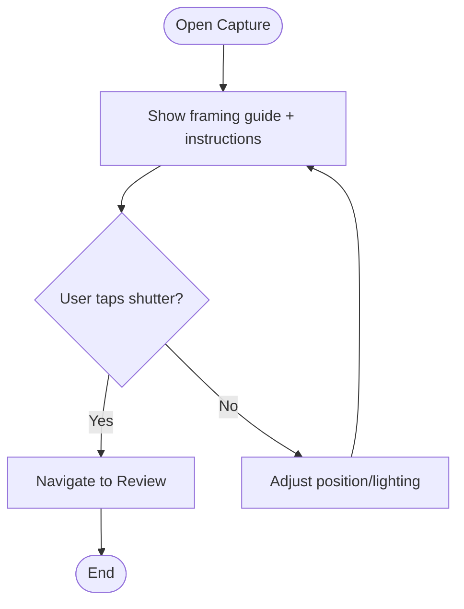
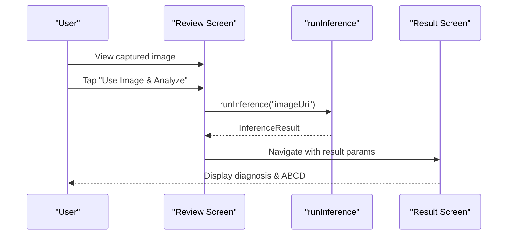
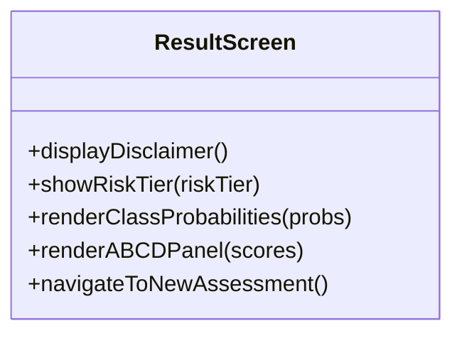
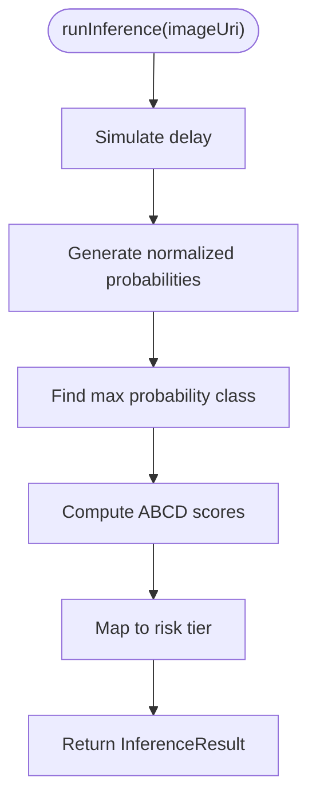
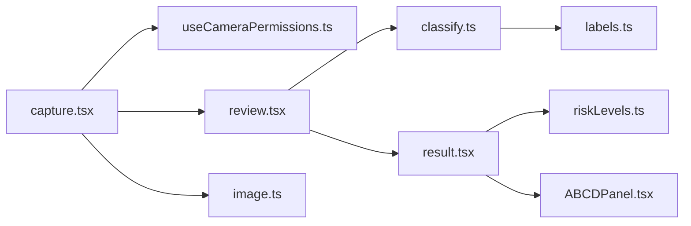

# Camera Integration

<cite>
**Referenced Files in This Document**
- [capture.tsx](file://src/app/(app)/patients/[patientId]/capture.tsx)
- [review.tsx](file://src/app/(app)/patients/[patientId]/review.tsx)
- [result.tsx](file://src/app/(app)/patients/[patientId]/result.tsx)
- [useCameraPermissions.ts](file://src/hooks/useCameraPermissions.ts)
- [image.ts](file://src/utils/image.ts)
- [classify.ts](file://src/features/assessments/inference/classify.ts)
- [riskLevels.ts](file://src/constants/riskLevels.ts)
- [labels.ts](file://src/ml/labels.ts)
- [ABCDPanel.tsx](file://src/components/assessment/ABCDPanel.tsx)
</cite>

## Table of Contents
1. [Introduction](#introduction)
2. [Project Structure](#project-structure)
3. [Core Components](#core-components)
4. [Architecture Overview](#architecture-overview)
5. [Detailed Component Analysis](#detailed-component-analysis)
6. [Dependency Analysis](#dependency-analysis)
7. [Performance Considerations](#performance-considerations)
8. [Troubleshooting Guide](#troubleshooting-guide)
9. [Conclusion](#conclusion)
10. [Appendices](#appendices)

## Introduction
This document explains DermSight’s camera integration system end-to-end: from requesting camera permissions, through guided lesion image capture with framing guides and tips, to reviewing image quality and running inference for risk assessment. It also documents the current placeholder implementation, where native camera access is stubbed for development, and outlines how to integrate a production-grade camera (e.g., react-native-vision-camera). The review interface allows users to verify image quality before proceeding to analysis, and the result screen presents diagnosis probabilities, ABCD explainability, and recommended actions.

## Project Structure
The camera workflow spans several screens and utilities:
- Capture screen provides a guided UI with framing overlays and mode toggles.
- Review screen displays the captured image, quality indicators, and options to analyze or retake.
- Result screen shows classification results, confidence, and ABCD scores.
- A hook manages camera permission state and requests.
- Image utilities handle local storage operations for captured images.
- Inference module runs mock classification and maps classes to risk tiers.

**Diagram sources**
- [capture.tsx:1-131](file://src/app/(app)/patients/[patientId]/capture.tsx#L1-L131)
- [review.tsx:1-137](file://src/app/(app)/patients/[patientId]/review.tsx#L1-L137)
- [result.tsx:1-127](file://src/app/(app)/patients/[patientId]/result.tsx#L1-L127)
- [useCameraPermissions.ts:1-44](file://src/hooks/useCameraPermissions.ts#L1-L44)
- [image.ts:1-52](file://src/utils/image.ts#L1-L52)
- [classify.ts:1-62](file://src/features/assessments/inference/classify.ts#L1-L62)
- [riskLevels.ts:1-121](file://src/constants/riskLevels.ts#L1-L121)

**Section sources**
- [capture.tsx:1-131](file://src/app/(app)/patients/[patientId]/capture.tsx#L1-L131)
- [review.tsx:1-137](file://src/app/(app)/patients/[patientId]/review.tsx#L1-L137)
- [result.tsx:1-127](file://src/app/(app)/patients/[patientId]/result.tsx#L1-L127)
- [useCameraPermissions.ts:1-44](file://src/hooks/useCameraPermissions.ts#L1-L44)
- [image.ts:1-52](file://src/utils/image.ts#L1-L52)
- [classify.ts:1-62](file://src/features/assessments/inference/classify.ts#L1-L62)
- [riskLevels.ts:1-121](file://src/constants/riskLevels.ts#L1-L121)

## Core Components
- Camera Permission Hook: Provides status and request flow; currently simulates granted on web/dev and prepares for native integration.
- Capture Screen: Presents a full-screen preview area with framing guides, instructional overlay, mode tabs (photo/guide), shutter button, and tips panel.
- Review Screen: Displays captured image placeholder, quality indicator, tips, and actions to analyze or retake.
- Result Screen: Shows top diagnosis, confidence, class probabilities, ABCD explainability, and next actions.
- Image Utilities: Ensure directory, copy image to app storage, delete, and get file size.
- Inference Module: Mock classifier that returns realistic probabilities, ABCD scores, and risk tier mapping.

**Section sources**
- [useCameraPermissions.ts:1-44](file://src/hooks/useCameraPermissions.ts#L1-L44)
- [capture.tsx:1-131](file://src/app/(app)/patients/[patientId]/capture.tsx#L1-L131)
- [review.tsx:1-137](file://src/app/(app)/patients/[patientId]/review.tsx#L1-L137)
- [result.tsx:1-127](file://src/app/(app)/patients/[patientId]/result.tsx#L1-L127)
- [image.ts:1-52](file://src/utils/image.ts#L1-L52)
- [classify.ts:1-62](file://src/features/assessments/inference/classify.ts#L1-L62)

## Architecture Overview
The camera integration follows a linear user journey:
1. User opens capture screen; permission hook ensures camera access.
2. Framing guides and instructions help position the lesion.
3. Shutter triggers capture; navigation moves to review.
4. Review screen validates image quality and offers analysis.
5. Inference runs (currently mock) and navigates to result.
6. Result screen presents diagnosis, confidence, ABCD scores, and risk tier.

**Diagram sources**
- [capture.tsx:1-131](file://src/app/(app)/patients/[patientId]/capture.tsx#L1-L131)
- [useCameraPermissions.ts:1-44](file://src/hooks/useCameraPermissions.ts#L1-L44)
- [review.tsx:1-137](file://src/app/(app)/patients/[patientId]/review.tsx#L1-L137)
- [classify.ts:1-62](file://src/features/assessments/inference/classify.ts#L1-L62)
- [result.tsx:1-127](file://src/app/(app)/patients/[patientId]/result.tsx#L1-L127)

## Detailed Component Analysis

### Camera Permission Hook
- Purpose: Manage camera permission lifecycle and provide a unified API for requesting access.
- Behavior: On web/platforms without native camera, assumes granted; otherwise integrates with a native permission API when available.
- State: Tracks status (granted/denied/undetermined) and loading state during request.
- Integration: Should be used by capture screen to gate camera features and guide users if denied.

**Diagram sources**
- [useCameraPermissions.ts:1-44](file://src/hooks/useCameraPermissions.ts#L1-L44)

**Section sources**
- [useCameraPermissions.ts:1-44](file://src/hooks/useCameraPermissions.ts#L1-L44)

### Capture Screen
- Purpose: Guided lesion capture with framing guides and instructional overlays.
- Features:
  - Framing guide with corner brackets and center crosshair to aid alignment.
  - Instruction overlay advising proper positioning and lighting.
  - Mode tabs for photo vs guide modes.
  - Shutter button to trigger capture and navigate to review.
  - Tips panel for quick guidance on capturing clear images.
- Navigation: On capture, navigates to review screen with parameters indicating mock image usage.

**Diagram sources**
- [capture.tsx:1-131](file://src/app/(app)/patients/[patientId]/capture.tsx#L1-L131)

**Section sources**
- [capture.tsx:1-131](file://src/app/(app)/patients/[patientId]/capture.tsx#L1-L131)

### Review Screen
- Purpose: Allow users to verify image quality and proceed to analysis or retake.
- Features:
  - Placeholder image display with quality indicator.
  - Tips for better results (natural light, focus, full lesion capture).
  - Actions: "Use Image & Analyze" and "Retake Photo".
- Workflow: Calls inference module and navigates to result screen with inference data.

**Diagram sources**
- [review.tsx:1-137](file://src/app/(app)/patients/[patientId]/review.tsx#L1-L137)
- [classify.ts:1-62](file://src/features/assessments/inference/classify.ts#L1-L62)
- [result.tsx:1-127](file://src/app/(app)/patients/[patientId]/result.tsx#L1-L127)

**Section sources**
- [review.tsx:1-137](file://src/app/(app)/patients/[patientId]/review.tsx#L1-L137)

### Result Screen
- Purpose: Present diagnosis, confidence, class probabilities, ABCD explainability, and recommended action based on risk tier.
- Features:
  - Disclaimer emphasizing screening nature.
  - Risk tier badge with color-coded severity and action guidance.
  - Class probability list and ABCD panel for transparency.
  - Actions to save result or start new assessment.

**Diagram sources**
- [result.tsx:1-127](file://src/app/(app)/patients/[patientId]/result.tsx#L1-L127)
- [ABCDPanel.tsx:1-68](file://src/components/assessment/ABCDPanel.tsx#L1-L68)
- [riskLevels.ts:1-121](file://src/constants/riskLevels.ts#L1-L121)

**Section sources**
- [result.tsx:1-127](file://src/app/(app)/patients/[patientId]/result.tsx#L1-L127)
- [ABCDPanel.tsx:1-68](file://src/components/assessment/ABCDPanel.tsx#L1-L68)
- [riskLevels.ts:1-121](file://src/constants/riskLevels.ts#L1-L121)

### Image Utilities
- Purpose: Manage local storage for captured images.
- Functions:
  - ensureImageDirectory: Creates app-private directory for images.
  - saveImageLocally: Copies captured image to private storage.
  - deleteLocalImage: Removes stored image.
  - getFileSizeKB: Returns file size for display or analytics.

**Diagram sources**
- [image.ts:1-52](file://src/utils/image.ts#L1-L52)

**Section sources**
- [image.ts:1-52](file://src/utils/image.ts#L1-L52)

### Inference Module
- Purpose: Provide classification results for captured images (currently mock).
- Behavior:
  - Simulates processing delay.
  - Generates normalized probabilities across model labels.
  - Computes ABCD scores and maps predicted class to risk tier.
  - Exposes helper to check model availability.

**Diagram sources**
- [classify.ts:1-62](file://src/features/assessments/inference/classify.ts#L1-L62)
- [riskLevels.ts:1-121](file://src/constants/riskLevels.ts#L1-L121)
- [labels.ts:1-26](file://src/ml/labels.ts#L1-L26)

**Section sources**
- [classify.ts:1-62](file://src/features/assessments/inference/classify.ts#L1-L62)
- [riskLevels.ts:1-121](file://src/constants/riskLevels.ts#L1-L121)
- [labels.ts:1-26](file://src/ml/labels.ts#L1-L26)

## Dependency Analysis
Key dependencies and relationships:
- Capture depends on routing and UI components; integrates with permission hook for camera access.
- Review depends on inference module and navigation to result.
- Result depends on constants for risk mapping and ABCD panel component.
- Image utilities are independent but used by capture/review flows for storage.
- Inference uses model labels and risk level mappings.

**Diagram sources**
- [capture.tsx:1-131](file://src/app/(app)/patients/[patientId]/capture.tsx#L1-L131)
- [useCameraPermissions.ts:1-44](file://src/hooks/useCameraPermissions.ts#L1-L44)
- [review.tsx:1-137](file://src/app/(app)/patients/[patientId]/review.tsx#L1-L137)
- [classify.ts:1-62](file://src/features/assessments/inference/classify.ts#L1-L62)
- [result.tsx:1-127](file://src/app/(app)/patients/[patientId]/result.tsx#L1-L127)
- [riskLevels.ts:1-121](file://src/constants/riskLevels.ts#L1-L121)
- [ABCDPanel.tsx:1-68](file://src/components/assessment/ABCDPanel.tsx#L1-L68)
- [image.ts:1-52](file://src/utils/image.ts#L1-L52)
- [labels.ts:1-26](file://src/ml/labels.ts#L1-L26)

**Section sources**
- [capture.tsx:1-131](file://src/app/(app)/patients/[patientId]/capture.tsx#L1-L131)
- [review.tsx:1-137](file://src/app/(app)/patients/[patientId]/review.tsx#L1-L137)
- [result.tsx:1-127](file://src/app/(app)/patients/[patientId]/result.tsx#L1-L127)
- [useCameraPermissions.ts:1-44](file://src/hooks/useCameraPermissions.ts#L1-L44)
- [image.ts:1-52](file://src/utils/image.ts#L1-L52)
- [classify.ts:1-62](file://src/features/assessments/inference/classify.ts#L1-L62)
- [riskLevels.ts:1-121](file://src/constants/riskLevels.ts#L1-L121)
- [ABCDPanel.tsx:1-68](file://src/components/assessment/ABCDPanel.tsx#L1-L68)
- [labels.ts:1-26](file://src/ml/labels.ts#L1-L26)

## Performance Considerations
- Camera Preview: Use hardware-accelerated rendering and avoid heavy UI updates during capture to maintain smooth frame rates.
- Image Storage: Store images in app-private directories to minimize overhead and ensure fast access; consider compression before upload to reduce bandwidth.
- Inference: Batch preprocessing steps and leverage device-specific accelerators when integrating real models; keep UI responsive with progress indicators.
- Memory Management: Release camera resources promptly after capture; avoid retaining large image buffers in memory.

[No sources needed since this section provides general guidance]

## Troubleshooting Guide
Common issues and resolutions:
- Camera Unavailable: If platform lacks camera support or permissions are denied, show an informative message and guide users to settings to enable camera access.
- Permission Denied: Persist denial state and offer a retry flow; on web, assume granted for development but warn about limitations.
- Image Storage Errors: Handle filesystem errors gracefully; fallback to temporary storage if necessary and notify users.
- Inference Failures: Catch exceptions during analysis; provide retry option and log errors for diagnostics.

**Section sources**
- [useCameraPermissions.ts:1-44](file://src/hooks/useCameraPermissions.ts#L1-L44)
- [review.tsx:1-137](file://src/app/(app)/patients/[patientId]/review.tsx#L1-L137)
- [image.ts:1-52](file://src/utils/image.ts#L1-L52)

## Conclusion
DermSight’s camera integration provides a guided, user-friendly workflow for capturing lesion images, validating quality, and presenting actionable assessment results. While the current implementation uses placeholders for native camera and inference, it establishes a robust foundation for integrating production-grade modules. The design emphasizes clarity, accessibility, and reliability to support healthcare workers in diverse environments.

[No sources needed since this section summarizes without analyzing specific files]

## Appendices

### Cross-Platform Compatibility Notes
- iOS/Android: Integrate a native camera library (e.g., react-native-vision-camera) to replace placeholder logic; ensure permissions align with platform requirements.
- Web: Continue assuming granted for development; inform users of limited functionality and encourage mobile use for clinical workflows.

[No sources needed since this section provides general guidance]

### Accessibility Considerations
- High Contrast: Ensure framing guides and overlays remain visible under various lighting conditions.
- VoiceOver/TalkBack: Label all interactive elements (shutter, tips, buttons) for screen readers.
- Lighting Guidance: Provide clear instructions to improve image quality in low-light scenarios (e.g., natural light tips).

[No sources needed since this section provides general guidance]