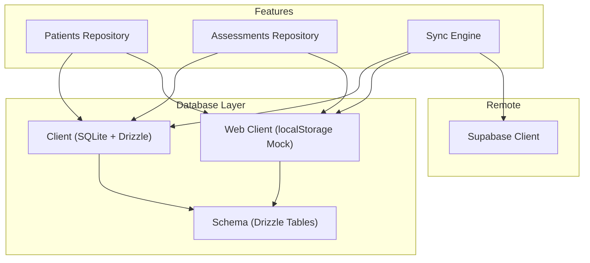
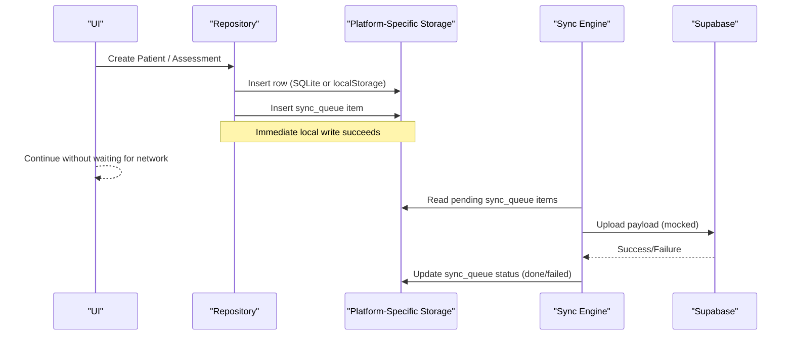
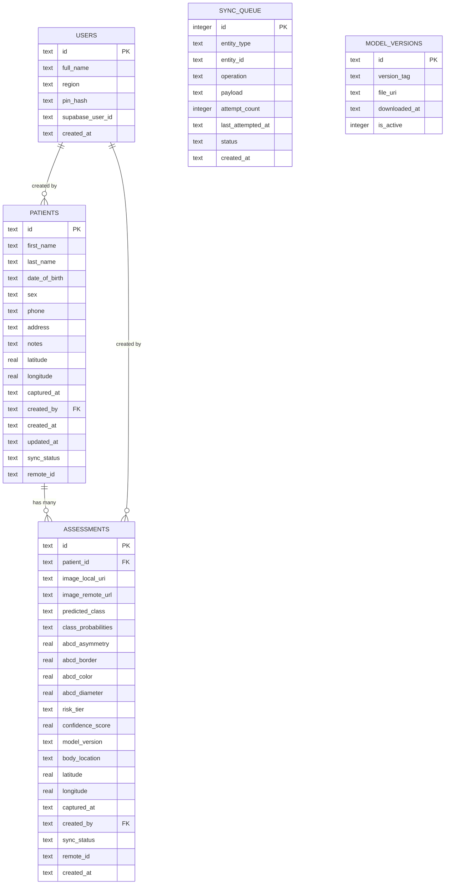
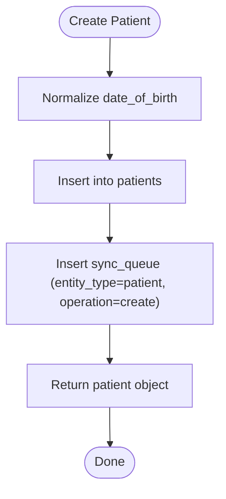
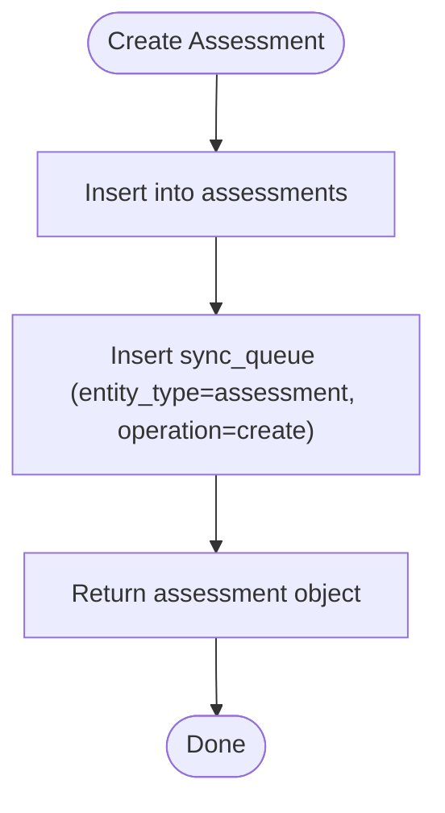
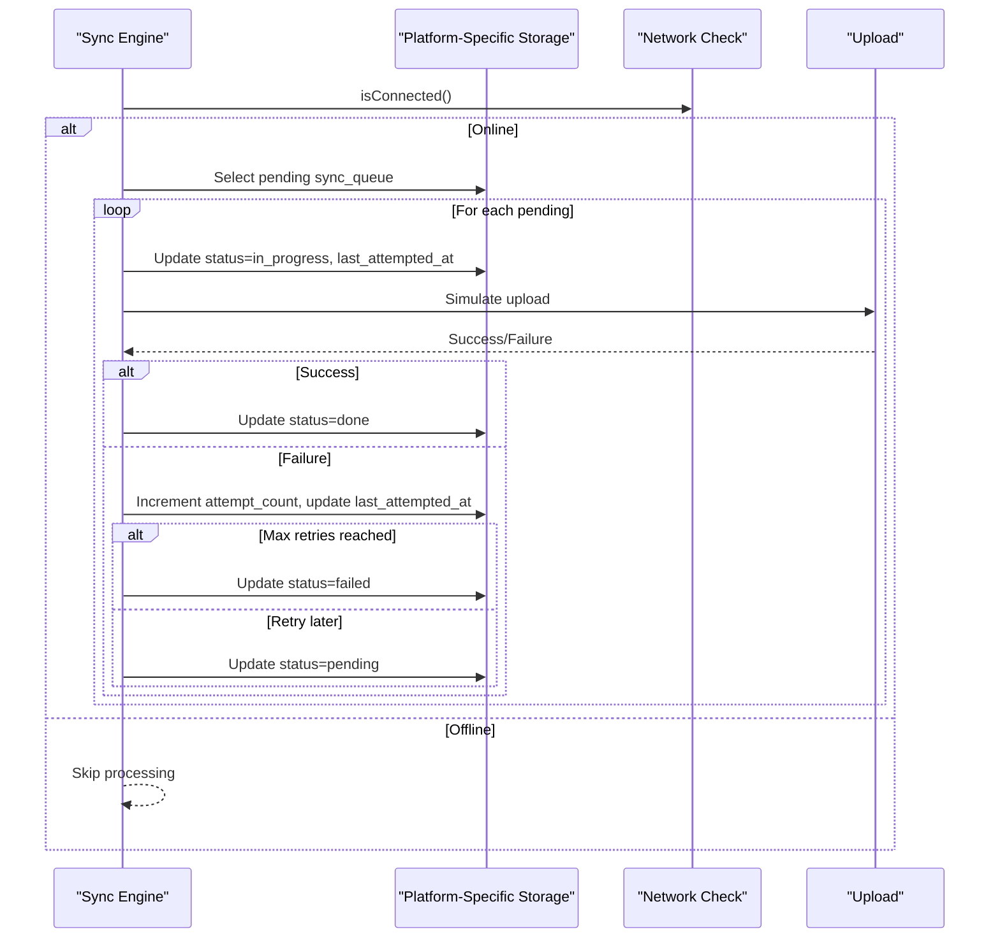
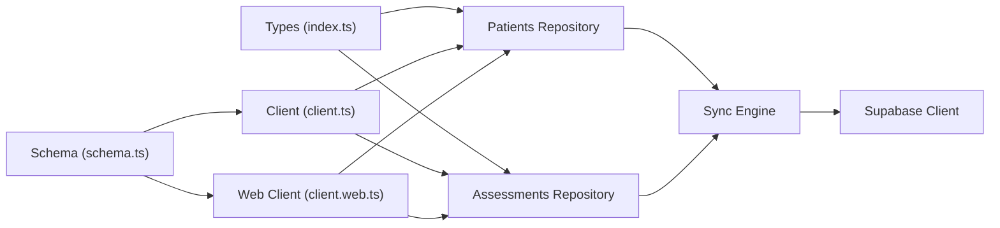

# Database Design

<cite>
**Referenced Files in This Document**
- [schema.ts](file://src/db/schema.ts)
- [client.ts](file://src/db/client.ts)
- [client.web.ts](file://src/db/client.web.ts)
- [repository.ts (patients)](file://src/features/patients/repository.ts)
- [repository.ts (assessments)](file://src/features/assessments/repository.ts)
- [syncEngine.ts](file://src/features/sync/syncEngine.ts)
- [index.ts (types)](file://src/types/index.ts)
- [supabase.ts](file://src/lib/supabase.ts)
- [date.ts](file://src/utils/date.ts)
- [secureStorage.ts](file://src/lib/secureStorage.ts)
</cite>

## Update Summary
**Changes Made**
- Added comprehensive web platform support with localStorage-based SQLite mock
- Enhanced date parsing and validation to prevent NaN rendering issues
- Implemented automatic data migration for malformed dates in localStorage
- Improved platform compatibility across iOS, Android, and web environments
- Updated architecture diagrams to reflect dual database implementation

## Table of Contents
1. Introduction
2. Project Structure
3. Core Components
4. Architecture Overview
5. Detailed Component Analysis
6. Dependency Analysis
7. Performance Considerations
8. Troubleshooting Guide
9. Conclusion
10. Appendices

## Introduction
This document describes the data model and database design for DermSight's local storage system, implemented with Drizzle ORM and enhanced with cross-platform compatibility. The system supports both native SQLite storage for mobile platforms and a localStorage-based mock for web development environments. It covers entity relationships among users, patients, assessments, and the sync queue; field definitions, validation rules, and business constraints; schema diagrams; Drizzle-based type-safe operations; migration strategy; backup/restore guidance; data access patterns; security considerations; and performance optimization techniques.

## Project Structure
The database layer is centralized under src/db with platform-specific implementations:
- Schema definitions are declared using Drizzle ORM types in schema.ts.
- Native SQLite client initializes the database via expo-sqlite in client.ts.
- Web-specific localStorage mock provides development environment support in client.web.ts.
- Feature repositories implement CRUD operations and queries over these tables.
- The sync engine orchestrates background synchronization to a remote service using an outbox pattern.

**Diagram sources**
- [schema.ts:1-102](file://src/db/schema.ts#L1-L102)
- [client.ts:1-171](file://src/db/client.ts#L1-L171)
- [client.web.ts:1-322](file://src/db/client.web.ts#L1-L322)
- [repository.ts (patients):1-222](file://src/features/patients/repository.ts#L1-L222)
- [repository.ts (assessments):1-161](file://src/features/assessments/repository.ts#L1-L161)
- [syncEngine.ts:1-503](file://src/features/sync/syncEngine.ts#L1-L503)
- [supabase.ts:1-18](file://src/lib/supabase.ts#L1-L18)

**Section sources**
- [schema.ts:1-102](file://src/db/schema.ts#L1-L102)
- [client.ts:1-171](file://src/db/client.ts#L1-L171)
- [client.web.ts:1-322](file://src/db/client.web.ts#L1-L322)

## Core Components
- Users: Health worker identity and session linkage.
- Patients: Demographic and location metadata for each patient.
- Assessments: Clinical assessment records linked to patients, including image references, ML outputs, ABCD scores, risk tier, and timestamps.
- Sync Queue: Outbox table tracking pending/failed sync operations for patients and assessments.
- Model Versions: Local machine learning model versioning metadata.

Key characteristics:
- Primary keys: UUIDs for users, patients, assessments; auto-increment integer for sync queue.
- Foreign keys: assessments.patient_id -> patients.id; assessments.created_by -> users.id; patients.created_by -> users.id.
- Enumerations enforced at schema level for sex, predicted_class, risk_tier, sync statuses, and operation types.
- Timestamps stored as ISO strings for created_at, updated_at, captured_at, last_attempted_at, downloaded_at.
- **Updated**: Cross-platform compatibility with localStorage fallback for web development environments.

**Section sources**
- [schema.ts:8-102](file://src/db/schema.ts#L8-L102)
- [client.ts:19-171](file://src/db/client.ts#L19-L171)
- [client.web.ts:236-322](file://src/db/client.web.ts#L236-L322)
- [index.ts (types):5-84](file://src/types/index.ts#L5-L84)

## Architecture Overview
The app follows an offline-first architecture where the local storage is the single source of truth. UI reads/writes locally without blocking on network. The system automatically selects between native SQLite (mobile) and localStorage (web) based on platform detection. Background sync uses an outbox pattern: writes enqueue operations into sync_queue, which the sync engine processes when online.

**Diagram sources**
- [repository.ts (patients):44-118](file://src/features/patients/repository.ts#L44-L118)
- [repository.ts (assessments):54-134](file://src/features/assessments/repository.ts#L54-L134)
- [syncEngine.ts:60-176](file://src/features/sync/syncEngine.ts#L60-L176)
- [supabase.ts:1-18](file://src/lib/supabase.ts#L1-L18)

## Detailed Component Analysis

### Entity Relationship Diagram

**Diagram sources**
- [schema.ts:8-102](file://src/db/schema.ts#L8-L102)
- [client.ts:19-171](file://src/db/client.ts#L19-L171)

### Data Model Definitions and Constraints

- Users
  - Fields: id (PK), full_name, region, pin_hash, supabase_user_id, created_at.
  - Validation: All fields not null; identifiers are strings; timestamps ISO format.
  - Business constraints: Each user represents a health worker; pin_hash stores secure credential hash.

- Patients
  - Fields: id (PK), first_name, last_name, date_of_birth, sex (enum male/female/other), phone, address, notes, latitude, longitude, captured_at, created_by (FK users.id), created_at, updated_at, sync_status (enum pending/synced/failed), remote_id.
  - Validation: Sex restricted to enum; required timestamps; optional geolocation; foreign key to users.
  - Business constraints: Represents a patient record; sync_status tracks upload state; remote_id links to server ID after sync.
  - **Updated**: Enhanced date validation with automatic normalization to prevent NaN rendering issues.

- Assessments
  - Fields: id (PK), patient_id (FK patients.id), image_local_uri, image_remote_url, predicted_class (enum mel/bcc/akiec/bkl/df/vasc/nv), class_probabilities (JSON string), abcd_asymmetry, abcd_border, abcd_color, abcd_diameter, risk_tier (enum low/medium/high/urgent_referral), confidence_score, model_version, body_location, latitude, longitude, captured_at, created_by (FK users.id), sync_status (enum pending/synced/failed), remote_id, created_at.
  - Validation: Required numeric ABCD scores and confidence; JSON probabilities; enums for classification and risk; foreign keys to patients and users.
  - Business constraints: Captures ML inference results and clinical metadata; supports offline capture and later sync.

- Sync Queue
  - Fields: id (autoincrement PK), entity_type (enum patient/assessment), entity_id, operation (enum create/update), payload (JSON), attempt_count, last_attempted_at, status (enum pending/in_progress/failed/done), created_at.
  - Validation: Status transitions managed by sync engine; attempt_count increments on failure; last_attempted_at updated per attempt.
  - Business constraints: Implements outbox pattern to ensure eventual consistency with remote.

- Model Versions
  - Fields: id (PK), version_tag, file_uri, downloaded_at, is_active (boolean).
  - Validation: Only one active model typically; timestamps ISO format.
  - Business constraints: Tracks local ML models for inference.

**Section sources**
- [schema.ts:8-102](file://src/db/schema.ts#L8-L102)
- [client.ts:19-171](file://src/db/client.ts#L19-L171)
- [client.web.ts:236-322](file://src/db/client.web.ts#L236-L322)
- [index.ts (types):5-84](file://src/types/index.ts#L5-L84)

### Data Access Patterns

- Patient list and search
  - Get all patients ordered by creation time.
  - Search by name or ID using LIKE across first_name, last_name, id.
  - Retrieve by primary key.

- Assessment history
  - Get assessments by patientId ordered by creation time.
  - Get all assessments or counts for dashboards.
  - Retrieve by primary key.

- Sync operations
  - Enqueue create/update operations for patients and assessments into sync_queue.
  - Process pending items with exponential backoff and retry limits.
  - Mark items done on success or failed after max retries.

**Diagram sources**
- [repository.ts (patients):44-118](file://src/features/patients/repository.ts#L44-L118)

**Diagram sources**
- [repository.ts (assessments):54-134](file://src/features/assessments/repository.ts#L54-L134)

**Diagram sources**
- [syncEngine.ts:60-176](file://src/features/sync/syncEngine.ts#L60-L176)

**Section sources**
- [repository.ts (patients):13-118](file://src/features/patients/repository.ts#L13-L118)
- [repository.ts (assessments):12-134](file://src/features/assessments/repository.ts#L12-L134)
- [syncEngine.ts:29-176](file://src/features/sync/syncEngine.ts#L29-L176)

### Drizzle ORM Implementation
- Type safety: Drizzle schema defines column types and constraints; TypeScript interfaces mirror runtime shapes.
- Queries: Use drizzle-orm functions like select, insert, update, delete with eq, like, or, desc for ordering.
- Raw SQL fallback: Initialization uses raw SQL CREATE TABLE statements to ensure consistent schema creation on device.
- **Updated**: Platform abstraction layer that automatically switches between SQLite and localStorage implementations.

Best practices observed:
- Centralized schema definitions in schema.ts.
- Consistent timestamp handling via ISO strings.
- JSON payloads stored as TEXT for complex structures (e.g., class_probabilities, sync_queue.payload).
- **Updated**: Robust error handling and data validation across all platforms.

**Section sources**
- [schema.ts:1-102](file://src/db/schema.ts#L1-L102)
- [client.ts:1-171](file://src/db/client.ts#L1-L171)
- [client.web.ts:1-322](file://src/db/client.web.ts#L1-L322)
- [repository.ts (patients):1-222](file://src/features/patients/repository.ts#L1-L222)
- [repository.ts (assessments):1-161](file://src/features/assessments/repository.ts#L1-L161)

### Migration Strategy
Current implementation:
- Tables are created via raw SQL in initializeDatabase during app startup for native platforms.
- Web platform includes automatic data cleanup and migration for malformed date formats.
- No explicit migration framework is present; schema changes require updating both schema.ts and the raw SQL in client.ts.

Recommended evolution approach:
- Introduce a migrations table to track applied versions.
- Wrap schema changes in transactional scripts that add columns, rename fields, or rebuild indexes safely.
- Maintain backward compatibility by adding new columns before deprecating old ones.
- Version schema changes alongside app releases and apply migrations on startup.
- **Updated**: Enhanced web platform migration handling for localStorage data integrity.

**Section sources**
- [client.ts:19-171](file://src/db/client.ts#L19-L171)
- [client.web.ts:243-315](file://src/db/client.web.ts#L243-L315)

### Backup and Restore Procedures
Observed behavior:
- The app uses expo-sqlite to open a local database file named dermsight.db for native platforms.
- Web platform uses localStorage for data persistence.
- No built-in backup/restore logic is implemented in the codebase.

Recommended procedures:
- **Native Platforms**: Copy the SQLite database file from device storage to secure cloud storage or local export.
- **Web Platform**: Export localStorage data for patients, sync_queue, and other tables.
- Restore: Replace the database file with a previously backed-up copy and reinitialize the app to load the restored schema.
- Ensure backups include associated media (images) referenced by image_local_uri if needed for full recovery.

Note: Implement application-level backup triggers or scheduled exports to automate this process.

### Security Measures
Observed measures:
- PIN hashing stored in users.pin_hash for authentication.
- App messaging indicates encryption and privacy commitments.
- Supabase client configured for auth persistence and token refresh.
- **Updated**: Platform-specific secure storage using expo-secure-store for mobile and localStorage for web development.

Recommendations for healthcare data:
- Enable SQLite encryption at rest (e.g., SQLCipher integration) to protect sensitive data on device.
- Restrict database access to authenticated sessions; enforce PIN checks before exposing features.
- Apply least privilege principles for any remote endpoints; validate and sanitize inputs.
- Comply with applicable regulations (e.g., HIPAA) by ensuring audit trails, consent management, and data minimization.
- **Updated**: Enhanced security considerations for web localStorage usage in development environments.

**Section sources**
- [schema.ts:8-16](file://src/db/schema.ts#L8-L16)
- [supabase.ts:1-18](file://src/lib/supabase.ts#L1-L18)
- [secureStorage.ts:1-155](file://src/lib/secureStorage.ts#L1-L155)

### Performance Optimization
Current state:
- No explicit indexes are defined beyond primary keys.
- Queries use ORDER BY created_at and WHERE clauses on id, patient_id, and sync_status.
- **Updated**: localStorage-based web implementation provides fast in-memory operations for development.

Recommended indexing strategies:
- Add indexes on frequently queried columns:
  - patients.created_at for list ordering.
  - assessments.patient_id for patient histories.
  - assessments.created_at for global lists.
  - sync_queue.status and sync_queue.entity_type for outbox processing.
- Consider composite indexes for common query patterns (e.g., sync_queue(status, entity_type)).
- Avoid excessive LIKE searches on large datasets; consider full-text search extensions if needed.

Query optimization tips:
- Limit result sets with pagination for large lists.
- Use selective projections to fetch only necessary columns.
- Batch updates for bulk operations to reduce transaction overhead.
- **Updated**: Leverage localStorage efficiency for web development workflows.

Data archiving policies:
- Archive older assessments or patients to cold storage while keeping lightweight summaries in the active dataset.
- Purge completed sync_queue entries periodically to maintain performance.

**Section sources**
- [repository.ts (patients):13-118](file://src/features/patients/repository.ts#L13-L118)
- [repository.ts (assessments):12-134](file://src/features/assessments/repository.ts#L12-L134)
- [syncEngine.ts:29-176](file://src/features/sync/syncEngine.ts#L29-L176)

## Dependency Analysis
- Features depend on the db client for type-safe queries.
- Repositories import schema entities to construct queries and inserts.
- Sync engine depends on connectivity checks and updates sync_queue status based on outcomes.
- Supabase client is used for remote sync but does not affect local schema.
- **Updated**: Platform abstraction layer enables seamless switching between SQLite and localStorage implementations.

**Diagram sources**
- [index.ts (types):5-84](file://src/types/index.ts#L5-L84)
- [schema.ts:1-102](file://src/db/schema.ts#L1-L102)
- [client.ts:1-171](file://src/db/client.ts#L1-L171)
- [client.web.ts:1-322](file://src/db/client.web.ts#L1-L322)
- [repository.ts (patients):1-222](file://src/features/patients/repository.ts#L1-L222)
- [repository.ts (assessments):1-161](file://src/features/assessments/repository.ts#L1-L161)
- [syncEngine.ts:1-503](file://src/features/sync/syncEngine.ts#L1-L503)
- [supabase.ts:1-18](file://src/lib/supabase.ts#L1-L18)

**Section sources**
- [repository.ts (patients):1-222](file://src/features/patients/repository.ts#L1-L222)
- [repository.ts (assessments):1-161](file://src/features/assessments/repository.ts#L1-L161)
- [syncEngine.ts:1-503](file://src/features/sync/syncEngine.ts#L1-L503)

## Performance Considerations
- Add targeted indexes to support frequent queries and improve sync throughput.
- Use pagination and filtering to reduce memory footprint on large datasets.
- Optimize JSON parsing/serialization for class_probabilities and sync payloads.
- Schedule periodic cleanup of sync_queue entries to prevent unbounded growth.
- **Updated**: Leverage localStorage efficiency for rapid development iterations on web platform.

## Troubleshooting Guide
Common issues and resolutions:
- Sync stuck in pending: Verify connectivity and ensure sync engine runs; check attempt_count and last_attempted_at.
- Failed sync items: Inspect error logs; retry via retrySyncItem; adjust MAX_RETRIES and BASE_DELAY_MS if needed.
- Data inconsistencies: Validate foreign key integrity between assessments and patients; ensure created_by references valid users.
- Schema mismatch: Confirm initializeDatabase runs successfully; align schema.ts with raw SQL in client.ts.
- **Updated**: Web platform issues - check localStorage permissions and data format validation.
- **Updated**: Date parsing errors - verify date normalization functions are working correctly across platforms.

Operational utilities:
- getPendingSyncItems and getAllSyncItems for diagnostics.
- getPendingCount for UI indicators.
- retrySyncItem for manual intervention.

**Section sources**
- [syncEngine.ts:29-176](file://src/features/sync/syncEngine.ts#L29-L176)
- [syncEngine.ts:181-191](file://src/features/sync/syncEngine.ts#L181-L191)

## Conclusion
DermSight's database design centers on a robust, offline-first storage system with clear entity relationships and strict validation via Drizzle ORM. The enhanced cross-platform architecture seamlessly supports both native SQLite for mobile platforms and localStorage for web development environments. The automatic data migration and validation systems ensure data integrity across all platforms while maintaining responsiveness. The outbox pattern ensures reliable synchronization to a remote service. To enhance performance and compliance, introduce indexes, formalize migrations, enable encryption at rest, and implement automated backup/restore workflows. These improvements will strengthen scalability, reliability, and privacy for healthcare data across all supported platforms.

## Appendices

### Appendix A: Field Reference Summary
- Users: id, full_name, region, pin_hash, supabase_user_id, created_at.
- Patients: id, first_name, last_name, date_of_birth, sex, phone, address, notes, latitude, longitude, captured_at, created_by, created_at, updated_at, sync_status, remote_id.
- Assessments: id, patient_id, image_local_uri, image_remote_url, predicted_class, class_probabilities, abcd_asymmetry, abcd_border, abcd_color, abcd_diameter, risk_tier, confidence_score, model_version, body_location, latitude, longitude, captured_at, created_by, sync_status, remote_id, created_at.
- Sync Queue: id, entity_type, entity_id, operation, payload, attempt_count, last_attempted_at, status, created_at.
- Model Versions: id, version_tag, file_uri, downloaded_at, is_active.

**Section sources**
- [schema.ts:8-102](file://src/db/schema.ts#L8-L102)
- [index.ts (types):5-84](file://src/types/index.ts#L5-L84)

### Appendix B: Query Examples by Pattern
- List patients: SELECT * FROM patients ORDER BY created_at DESC.
- Search patients: SELECT * FROM patients WHERE first_name LIKE ? OR last_name LIKE ? OR id LIKE ? ORDER BY created_at DESC.
- Patient assessments: SELECT * FROM assessments WHERE patient_id = ? ORDER BY created_at DESC.
- Pending sync items: SELECT * FROM sync_queue WHERE status = 'pending'.

**Section sources**
- [repository.ts (patients):13-118](file://src/features/patients/repository.ts#L13-L118)
- [repository.ts (assessments):12-134](file://src/features/assessments/repository.ts#L12-L134)
- [syncEngine.ts:29-176](file://src/features/sync/syncEngine.ts#L29-L176)

### Appendix C: Platform-Specific Implementation Details

#### Native SQLite Implementation (Mobile Platforms)
- Uses expo-sqlite for persistent storage
- Full SQL schema enforcement with foreign key constraints
- Transaction support for data integrity
- File-based backup and restore capabilities

#### Web localStorage Implementation (Development Environment)
- In-memory storage with localStorage persistence
- Automatic data migration for malformed dates
- Simplified query operations with JavaScript array methods
- Development-focused debugging and inspection capabilities

**Section sources**
- [client.ts:1-171](file://src/db/client.ts#L1-L171)
- [client.web.ts:1-322](file://src/db/client.web.ts#L1-L322)