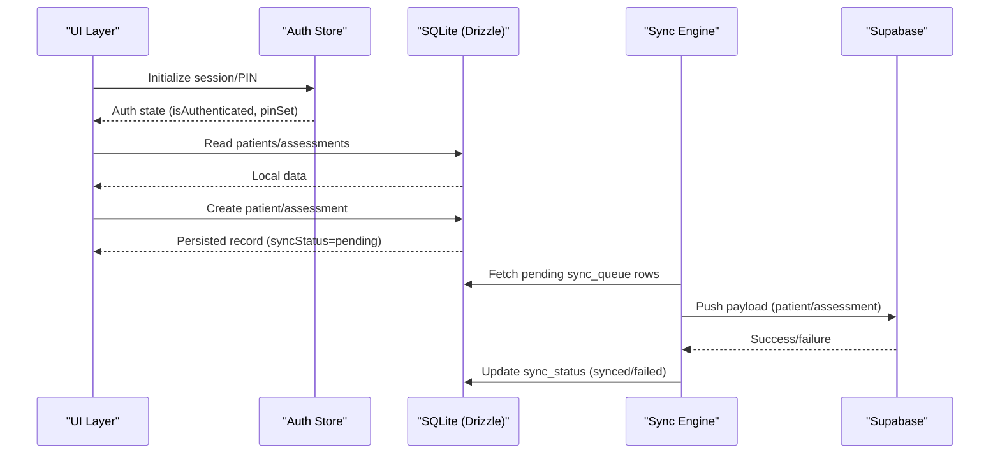
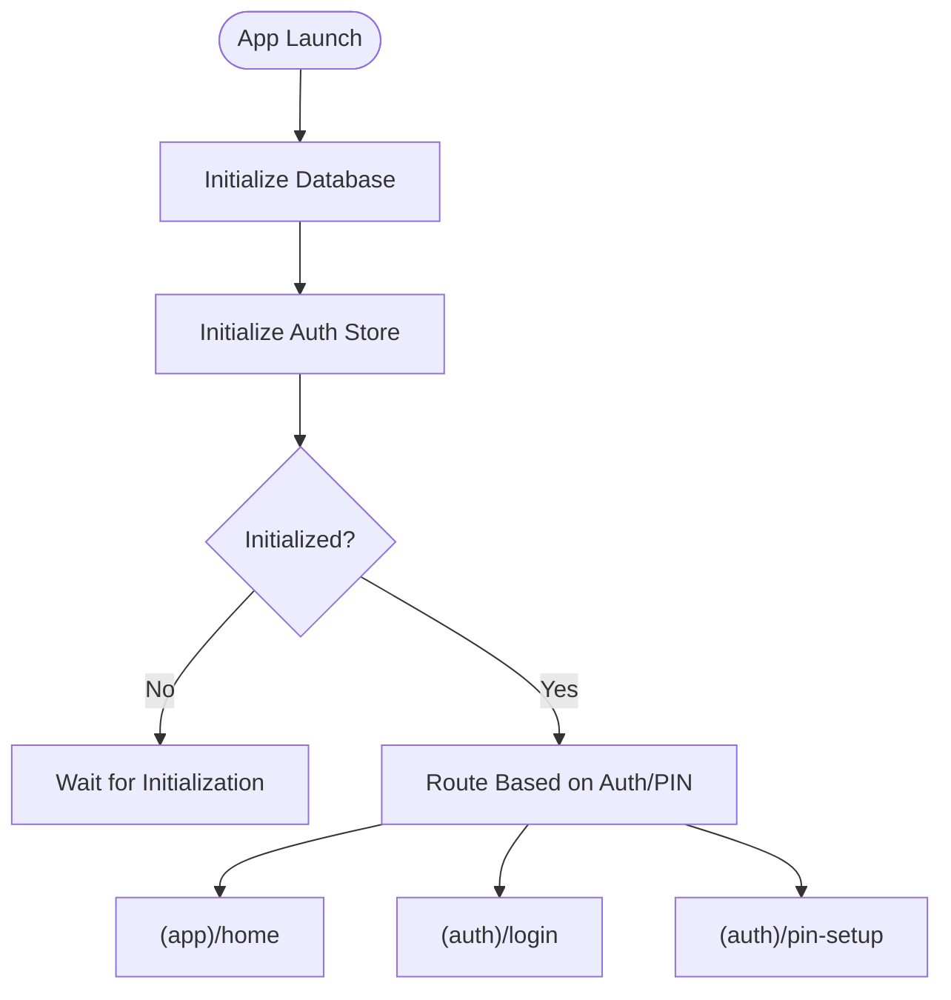
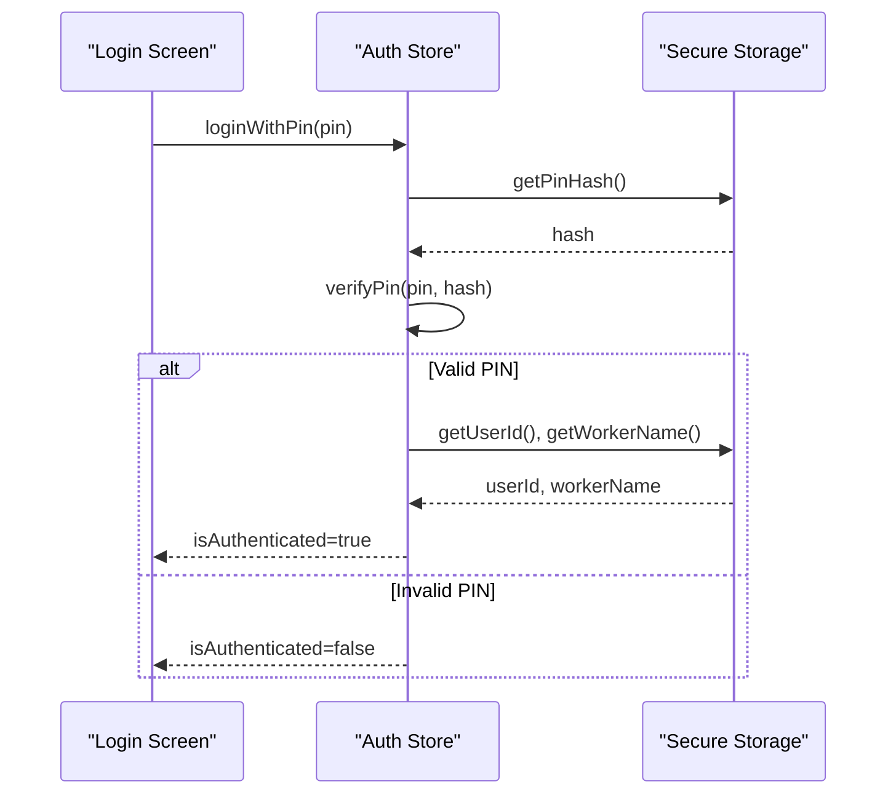
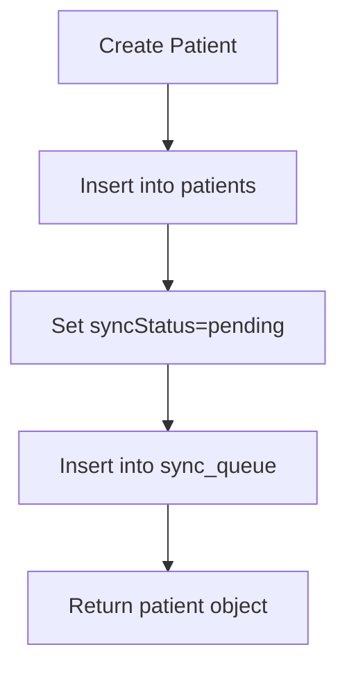
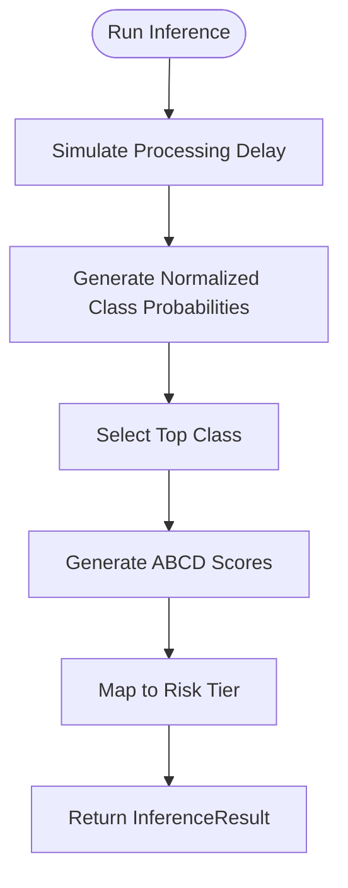
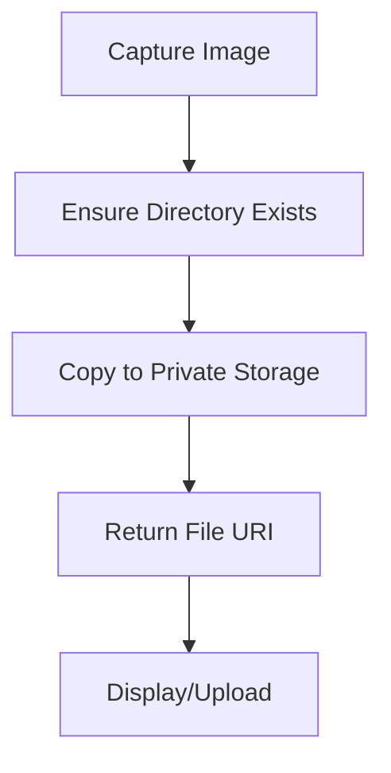
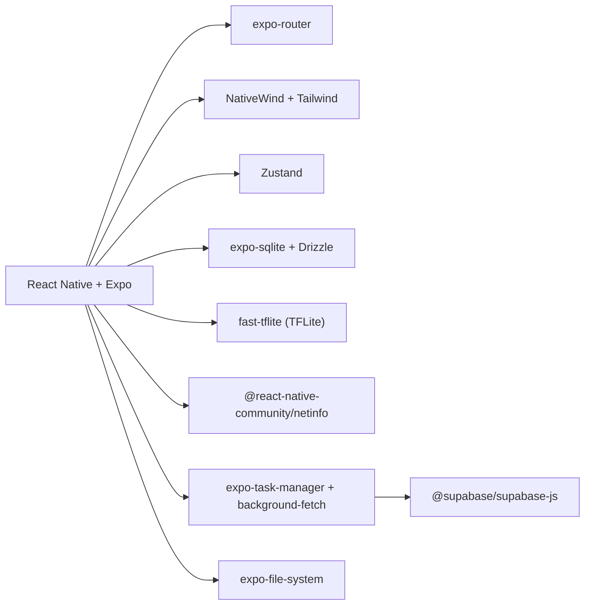

# Development Guide

<cite>
**Referenced Files in This Document**
- [package.json](file://package.json)
- [README.md](file://README.md)
- [app.json](file://app.json)
- [metro.config.js](file://metro.config.js)
- [babel.config.js](file://babel.config.js)
- [tsconfig.json](file://tsconfig.json)
- [tailwind.config.js](file://tailwind.config.js)
- [ARCHITECTURE.md](file://ARCHITECTURE.md)
- [src/app/_layout.tsx](file://src/app/_layout.tsx)
- [src/app/index.tsx](file://src/app/index.tsx)
- [src/features/auth/store.ts](file://src/features/auth/store.ts)
- [src/features/patients/repository.ts](file://src/features/patients/repository.ts)
- [src/db/schema.ts](file://src/db/schema.ts)
- [src/features/assessments/inference/classify.ts](file://src/features/assessments/inference/classify.ts)
- [src/lib/supabase.ts](file://src/lib/supabase.ts)
- [src/utils/image.ts](file://src/utils/image.ts)
</cite>

## Update Summary
**Changes Made**
- Removed references to reset-project script functionality that was deleted from the codebase
- Updated development environment setup to reflect removal of sharp dependency and related image processing scripts
- Simplified image processing documentation to use native Expo File System APIs
- Updated troubleshooting section to remove outdated image processing issues

## Table of Contents
1. Introduction
2. Project Structure
3. Core Components
4. Architecture Overview
5. Detailed Component Analysis
6. Dependency Analysis
7. Performance Considerations
8. Troubleshooting Guide
9. Conclusion
10. Appendices

## Introduction
This guide explains how to set up the development environment, build and run DermSight, understand its code organization and standards, debug and profile performance, test effectively, follow Git workflows, and deploy builds for development, staging, and production. It is written for contributors with varying experience levels and focuses on practical steps grounded in the repository's configuration and source files.

## Project Structure
DermSight is an Expo-based React Native application using file-based routing via expo-router. The app directory defines routes and screens; shared logic lives under src organized by features, libraries, database schema, ML assets, hooks, constants, types, and utilities. Styling uses NativeWind (Tailwind for React Native), and Metro is configured to integrate NativeWind with a global CSS entry.

Key structural highlights:
- Routing and app shell: app directory with root layout and index bootstrap screen
- Feature modules: src/features grouped by domain (auth, patients, assessments, sync)
- Data layer: src/db with Drizzle ORM schema and client initialization
- UI primitives and feature components: src/components/ui and feature-specific components
- Cross-cutting concerns: src/lib (Supabase, i18n, location, secure storage), src/hooks, src/constants, src/types, src/utils
- Build and tooling: metro.config.js, babel.config.js, tsconfig.json, tailwind.config.js, package.json scripts

```mermaid
graph TB
A["App Shell<br/>src/app/_layout.tsx"] --> B["Bootstrap / Splash<br/>src/app/index.tsx"]
B --> C["Auth Store<br/>src/features/auth/store.ts"]
B --> D["DB Client Init<br/>src/db/client.ts"]
C --> E["Secure Storage<br/>src/lib/secureStorage.ts"]
B --> F["Routes (expo-router)<br/>app/(app), app/(auth)"]
F --> G["Feature Screens<br/>patients, assessments, settings"]
G --> H["Repositories & Stores<br/>src/features/*"]
H --> I["Local DB Schema<br/>src/db/schema.ts"]
H --> J["Sync Engine<br/>src/features/sync/syncEngine.ts"]
J --> K["Supabase Client<br/>src/lib/supabase.ts"]
```

**Diagram sources**
- [src/app/_layout.tsx:1-54](file://src/app/_layout.tsx#L1-L54)
- [src/app/index.tsx:1-235](file://src/app/index.tsx#L1-L235)
- [src/features/auth/store.ts:1-122](file://src/features/auth/store.ts#L1-L122)
- [src/db/schema.ts:1-102](file://src/db/schema.ts#L1-L102)
- [src/lib/supabase.ts:1-19](file://src/lib/supabase.ts#L1-L19)

**Section sources**
- [package.json:1-66](file://package.json#L1-L66)
- [README.md:1-57](file://README.md#L1-L57)
- [app.json:1-70](file://app.json#L1-L70)
- [metro.config.js:1-6](file://metro.config.js#L1-L6)
- [babel.config.js:1-7](file://babel.config.js#L1-L7)
- [tsconfig.json:1-20](file://tsconfig.json#L1-L20)
- [tailwind.config.js:1-45](file://tailwind.config.js#L1-L45)
- [ARCHITECTURE.md:1-475](file://ARCHITECTURE.md#L1-L475)

## Core Components
- App shell and bootstrap: Root layout initializes database and auth state, then renders the router stack. The splash screen handles onboarding and redirects based on authentication and PIN setup status.
- Authentication: Zustand store manages session, PIN setup, and secure storage interactions.
- Data persistence: Drizzle ORM schema defines local tables for users, patients, assessments, sync queue, and model versions. Repositories perform CRUD operations and enqueue sync tasks.
- Inference pipeline: Placeholder inference module returns realistic mock results; production will load a TFLite model and run on-device inference.
- Sync integration: Supabase client is initialized for background sync; local SQLite remains the single source of truth.

**Section sources**
- [src/app/_layout.tsx:1-54](file://src/app/_layout.tsx#L1-L54)
- [src/app/index.tsx:1-235](file://src/app/index.tsx#L1-L235)
- [src/features/auth/store.ts:1-122](file://src/features/auth/store.ts#L1-L122)
- [src/db/schema.ts:1-102](file://src/db/schema.ts#L1-L102)
- [src/features/patients/repository.ts:1-128](file://src/features/patients/repository.ts#L1-L128)
- [src/features/assessments/inference/classify.ts:1-62](file://src/features/assessments/inference/classify.ts#L1-L62)
- [src/lib/supabase.ts:1-19](file://src/lib/supabase.ts#L1-L19)

## Architecture Overview
The system follows an offline-first design:
- UI reads from local SQLite exclusively for responsiveness.
- Writes are persisted locally and enqueued for background sync to Supabase when online.
- On-device ML runs inference without network dependency; results are stored locally and synced later.
- Expo Dev Client is required due to native modules (camera, ML).

**Diagram sources**
- [src/features/auth/store.ts:1-122](file://src/features/auth/store.ts#L1-L122)
- [src/features/patients/repository.ts:1-128](file://src/features/patients/repository.ts#L1-L128)
- [src/db/schema.ts:1-102](file://src/db/schema.ts#L1-L102)
- [src/lib/supabase.ts:1-19](file://src/lib/supabase.ts#L1-L19)

## Detailed Component Analysis

### App Shell and Bootstrap
- Root layout initializes the database and auth store, hides splash screen, and sets up the navigation stack.
- Splash screen performs onboarding slides and redirects to login or main app based on auth state and PIN setup.

**Diagram sources**
- [src/app/_layout.tsx:1-54](file://src/app/_layout.tsx#L1-L54)
- [src/app/index.tsx:1-235](file://src/app/index.tsx#L1-L235)

**Section sources**
- [src/app/_layout.tsx:1-54](file://src/app/_layout.tsx#L1-L54)
- [src/app/index.tsx:1-235](file://src/app/index.tsx#L1-L235)

### Authentication Flow
- Zustand store loads user identity and PIN status from secure storage.
- Login verifies PIN against stored hash; successful login sets authenticated state.
- PIN setup stores hashed PIN and worker name securely.

**Diagram sources**
- [src/features/auth/store.ts:1-122](file://src/features/auth/store.ts#L1-L122)

**Section sources**
- [src/features/auth/store.ts:1-122](file://src/features/auth/store.ts#L1-L122)

### Patient Data Operations
- Repository provides CRUD functions for patients using Drizzle ORM.
- Creating a patient inserts into patients table and enqueues a sync operation with status pending.

**Diagram sources**
- [src/features/patients/repository.ts:1-128](file://src/features/patients/repository.ts#L1-L128)
- [src/db/schema.ts:1-102](file://src/db/schema.ts#L1-L102)

**Section sources**
- [src/features/patients/repository.ts:1-128](file://src/features/patients/repository.ts#L1-L128)
- [src/db/schema.ts:1-102](file://src/db/schema.ts#L1-L102)

### Inference Pipeline (Assessments)
- Placeholder inference simulates processing delay and returns mock probabilities and ABCD scores.
- Risk tier mapping converts predicted class to actionable triage level.

**Diagram sources**
- [src/features/assessments/inference/classify.ts:1-62](file://src/features/assessments/inference/classify.ts#L1-L62)

**Section sources**
- [src/features/assessments/inference/classify.ts:1-62](file://src/features/assessments/inference/classify.ts#L1-L62)

### Image Management
- Uses native Expo File System v57 API for efficient image storage and management
- Images are copied directly to app's private document directory without external compression libraries
- Simple file operations for creating directories, copying images, and managing file sizes

**Diagram sources**
- [src/utils/image.ts:1-59](file://src/utils/image.ts#L1-L59)

**Section sources**
- [src/utils/image.ts:1-59](file://src/utils/image.ts#L1-L59)

## Dependency Analysis
- Framework and runtime: Expo SDK, React Native, expo-router for navigation and file-based routing.
- Styling: NativeWind v4 integrated via Metro and Babel presets; Tailwind config extends theme tokens.
- State management: Zustand for lightweight, offline-friendly stores.
- Data persistence: Drizzle ORM over expo-sqlite for typed queries and migrations.
- Networking and backend: Supabase client for sync; NetInfo triggers background sync tasks.
- Security: expo-secure-store for sensitive data (tokens, PIN hash).
- ML: On-device TFLite inference via fast-tflite (planned); current classify module is a mock.
- **Updated**: Image processing now uses native expo-file-system APIs instead of external dependencies like sharp.

**Diagram sources**
- [package.json:1-66](file://package.json#L1-L66)
- [metro.config.js:1-6](file://metro.config.js#L1-L6)
- [babel.config.js:1-7](file://babel.config.js#L1-L7)
- [tailwind.config.js:1-45](file://tailwind.config.js#L1-L45)
- [src/lib/supabase.ts:1-19](file://src/lib/supabase.ts#L1-L19)
- [src/utils/image.ts:1-59](file://src/utils/image.ts#L1-L59)

**Section sources**
- [package.json:1-66](file://package.json#L1-L66)
- [metro.config.js:1-6](file://metro.config.js#L1-L6)
- [babel.config.js:1-7](file://babel.config.js#L1-L7)
- [tailwind.config.js:1-45](file://tailwind.config.js#L1-L45)
- [src/lib/supabase.ts:1-19](file://src/lib/supabase.ts#L1-L19)
- [src/utils/image.ts:1-59](file://src/utils/image.ts#L1-L59)

## Performance Considerations
- Offline-first architecture ensures UI responsiveness by reading/writing local SQLite only.
- Background sync avoids blocking user interactions; use exponential backoff and retry strategies for failed syncs.
- Model inference should be cached and reused where possible; ensure TFLite interpreter instance is loaded once and reused.
- **Updated**: Image handling now uses native File System APIs for optimal performance without external compression overhead.
- Use profiling tools (Expo DevTools, Flipper, React Profiler) to identify heavy re-renders and long tasks.
- Keep bundle size small; avoid unnecessary dependencies and lazy-load heavy modules.

## Troubleshooting Guide
Common issues and resolutions:
- Metro bundler errors: Ensure NativeWind input CSS is correctly referenced in metro.config.js and that babel preset includes nativewind jsxImportSource.
- TypeScript path aliases: Verify tsconfig paths include @/* mappings and that imports use absolute paths consistently.
- Permissions not granted: Confirm app.json declares camera and location permissions; request runtime permissions in-app before use.
- Sync failures: Inspect sync_queue status and attempt counts; check network connectivity and Supabase credentials.
- Model availability: If using real TFLite model, ensure the .tflite asset is bundled and loader checks for presence before inference.
- **Updated**: Image storage issues: Verify expo-file-system permissions and directory creation; use ensureImageDirectory() function before saving images.

**Section sources**
- [metro.config.js:1-6](file://metro.config.js#L1-L6)
- [babel.config.js:1-7](file://babel.config.js#L1-L7)
- [tsconfig.json:1-20](file://tsconfig.json#L1-L20)
- [app.json:1-70](file://app.json#L1-L70)
- [src/lib/supabase.ts:1-19](file://src/lib/supabase.ts#L1-L19)
- [src/utils/image.ts:1-59](file://src/utils/image.ts#L1-L59)

## Conclusion
DermSight combines Expo tooling, offline-first data persistence, on-device ML, and background sync to deliver a robust screening tool for community health workers. By following the setup, build, and development practices outlined here, contributors can efficiently extend features, maintain code quality, and optimize performance across mobile platforms.

## Appendices

### Environment Setup and Dependencies
- Install Node.js and npm/yarn as per Expo requirements.
- Clone the repository and install dependencies using the project scripts.
- Configure environment variables for Supabase if syncing remotely.
- **Updated**: No additional image processing dependencies required; all image handling uses native Expo APIs.

**Section sources**
- [README.md:1-57](file://README.md#L1-L57)
- [package.json:1-66](file://package.json#L1-L66)

### Build Process (Metro, Babel, TypeScript)
- Metro bundler integrates NativeWind with a global CSS entry.
- Babel preset enables JSX transformation with NativeWind support.
- TypeScript compiles with strict mode and path aliases for clean imports.

**Section sources**
- [metro.config.js:1-6](file://metro.config.js#L1-L6)
- [babel.config.js:1-7](file://babel.config.js#L1-L7)
- [tsconfig.json:1-20](file://tsconfig.json#L1-L20)

### Code Organization Patterns and Standards
- Feature-based modules under src/features encapsulate domain logic (auth, patients, assessments, sync).
- Shared UI primitives live under src/components/ui; feature-specific components under src/components/<feature>.
- Data access via repositories using Drizzle ORM; schema defined centrally in src/db/schema.ts.
- Naming conventions: kebab-case for directories, PascalCase for components, camelCase for functions and variables.
- Coding standards: strict TypeScript, consistent error handling, and clear separation of concerns between UI, state, and data layers.

**Section sources**
- [ARCHITECTURE.md:1-475](file://ARCHITECTURE.md#L1-L475)
- [src/db/schema.ts:1-102](file://src/db/schema.ts#L1-L102)

### Debugging Techniques and Logging Strategies
- Use console logging sparingly; prefer structured logs for sync events and errors.
- Leverage Expo DevTools and React Native Debugger for inspecting state and network calls.
- Add error boundaries around critical screens to capture and display runtime errors gracefully.

### Testing Approaches
- Unit tests: Test pure functions (e.g., risk mapping, validation schemas) with Jest.
- Integration tests: Validate repository methods against an in-memory SQLite instance.
- End-to-end tests: Use Detox for automated flows like login, patient creation, and assessment result viewing.

### Git Workflow and Code Review
- Branching strategy: Use feature branches per ticket; merge via pull requests with reviews.
- Commit messages: Follow conventional commits for clarity and changelog generation.
- Code review checklist: Verify type safety, error handling, accessibility, and performance considerations.

### Deployment Considerations
- Development builds: Run with Expo Dev Client for native module support.
- Staging environments: Configure separate Supabase project and environment variables; validate sync behavior.
- Production releases: Use EAS Build for iOS and Android artifacts; ensure model assets are bundled and permissions declared.

**Section sources**
- [ARCHITECTURE.md:1-475](file://ARCHITECTURE.md#L1-L475)
- [app.json:1-70](file://app.json#L1-L70)