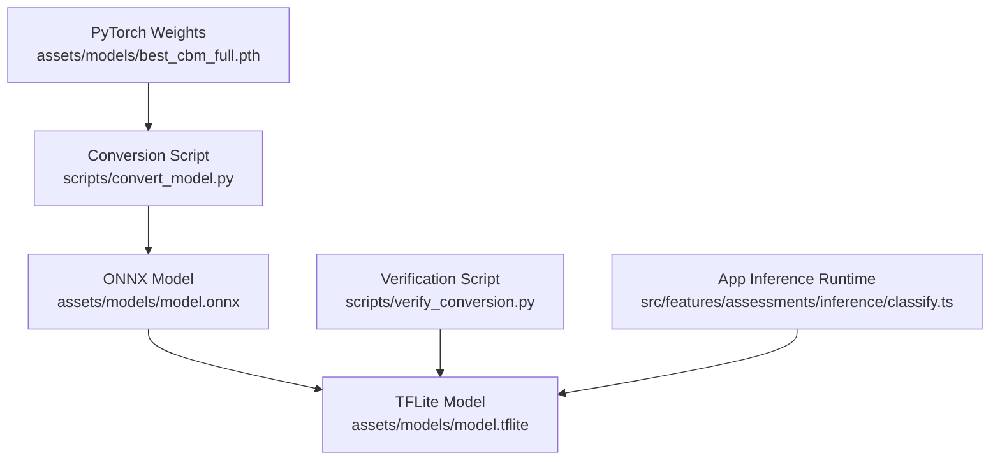
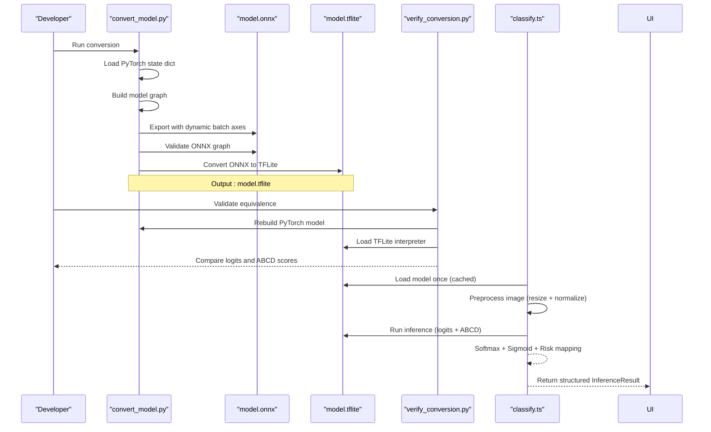
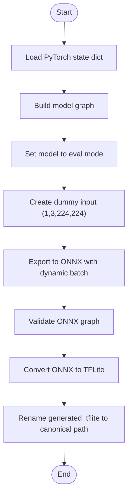
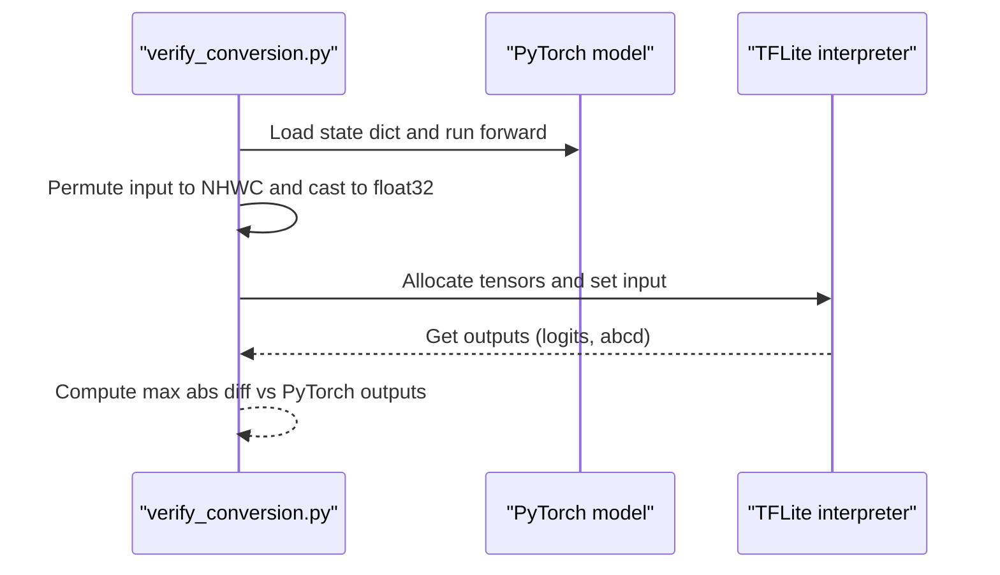
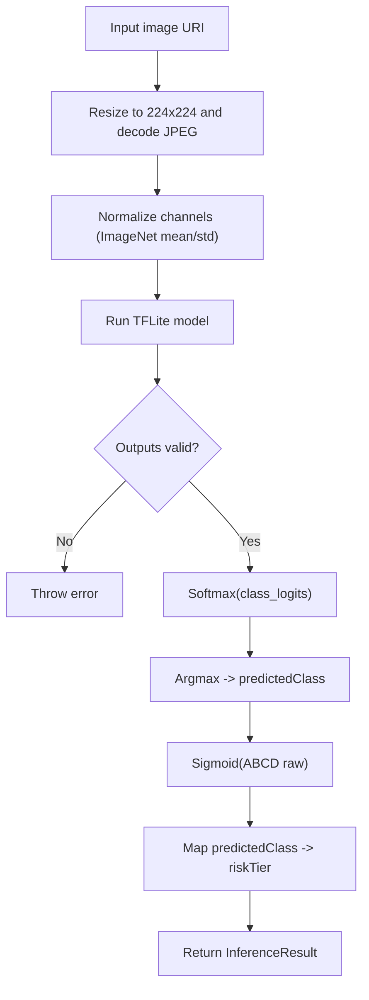
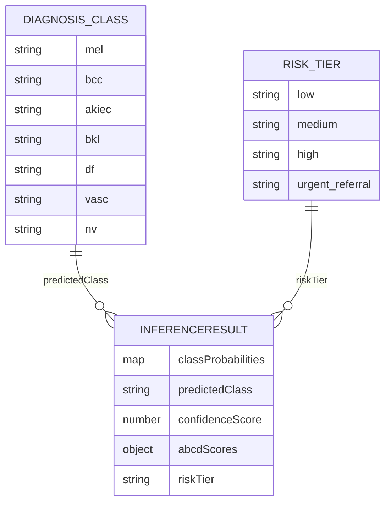
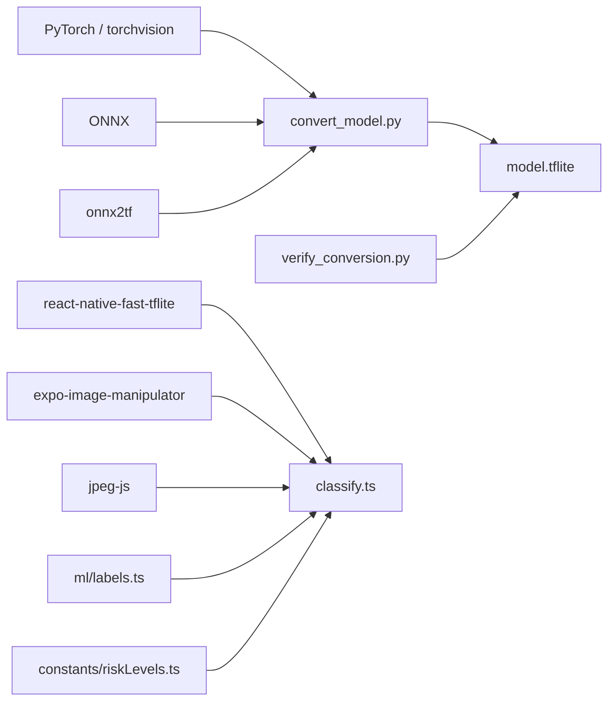

# Model Conversion Pipeline

<cite>
**Referenced Files in This Document**
- [convert_model.py](file://scripts/convert_model.py)
- [verify_conversion.py](file://scripts/verify_conversion.py)
- [classify.ts](file://src/features/assessments/inference/classify.ts)
- [labels.ts](file://src/ml/labels.ts)
- [riskLevels.ts](file://src/constants/riskLevels.ts)
- [index.ts](file://src/types/index.ts)
- [assets.d.ts](file://src/types/assets.d.ts)
- [README.md](file://README.md)
- [ARCHITECTURE.md](file://ARCHITECTURE.md)
</cite>

## Table of Contents
1. [Introduction](#introduction)
2. [Project Structure](#project-structure)
3. [Core Components](#core-components)
4. [Architecture Overview](#architecture-overview)
5. [Detailed Component Analysis](#detailed-component-analysis)
6. [Dependency Analysis](#dependency-analysis)
7. [Performance Considerations](#performance-considerations)
8. [Troubleshooting Guide](#troubleshooting-guide)
9. [Conclusion](#conclusion)

## Introduction
This document explains the end-to-end Model Conversion Pipeline that powers DermSight’s on-device dermatological risk screening. It covers how a PyTorch model is converted into a TensorFlow Lite (TFLite) binary, validated for numerical equivalence, and consumed by the mobile app to perform real-time inference with both diagnostic probabilities and explainable ABCD scores.

The pipeline is intentionally separated from the React Native application: conversion runs offline as a Python step prior to building the app, while the app only consumes the final TFLite model at runtime.

## Project Structure
The conversion-related code lives under scripts/, while the runtime consumption of the converted model lives under src/features/assessments/inference/. Supporting assets include the trained weights and converted models under assets/models/.

**Diagram sources**
- [convert_model.py:57-110](file://scripts/convert_model.py#L57-L110)
- [verify_conversion.py:56-85](file://scripts/verify_conversion.py#L56-L85)
- [classify.ts:17-47](file://src/features/assessments/inference/classify.ts#L17-L47)

**Section sources**
- [convert_model.py:1-117](file://scripts/convert_model.py#L1-L117)
- [verify_conversion.py:1-90](file://scripts/verify_conversion.py#L1-L90)
- [classify.ts:1-212](file://src/features/assessments/inference/classify.ts#L1-L212)

## Core Components
- Conversion script: Loads PyTorch weights, builds an equivalent model graph, exports to ONNX, validates the ONNX graph, then converts to TFLite using onnx2tf.
- Verification script: Reconstructs the PyTorch model, runs inference, loads the TFLite model via AI Edge LiteRT, and compares outputs to ensure fidelity.
- App runtime: Loads the TFLite model once, preprocesses images to the expected input format, runs inference, post-processes logits to probabilities, applies sigmoid to concept scores, maps diagnosis to risk tiers, and returns a structured result.

Key data contracts:
- Input image: resized to 224x224 RGB, normalized with ImageNet mean/std to [0,1] range before normalization.
- Outputs: two tensors — class logits (7 classes) and ABCD concept scores (4 values).
- Labels and display names are centralized to keep taxonomy consistent across conversion and runtime.

**Section sources**
- [convert_model.py:15-55](file://scripts/convert_model.py#L15-L55)
- [verify_conversion.py:17-54](file://scripts/verify_conversion.py#L17-L54)
- [classify.ts:21-27](file://src/features/assessments/inference/classify.ts#L21-L27)
- [labels.ts:7-25](file://src/ml/labels.ts#L7-L25)
- [riskLevels.ts:8-10](file://src/constants/riskLevels.ts#L8-L10)
- [index.ts:38-40](file://src/types/index.ts#L38-L40)

## Architecture Overview
The pipeline spans three phases: conversion, verification, and runtime inference.

**Diagram sources**
- [convert_model.py:57-110](file://scripts/convert_model.py#L57-L110)
- [verify_conversion.py:56-85](file://scripts/verify_conversion.py#L56-L85)
- [classify.ts:28-47](file://src/features/assessments/inference/classify.ts#L28-L47)
- [classify.ts:69-107](file://src/features/assessments/inference/classify.ts#L69-L107)
- [classify.ts:152-201](file://src/features/assessments/inference/classify.ts#L152-L201)

## Detailed Component Analysis

### Conversion Script: PyTorch → ONNX → TFLite
- Model reconstruction: The script defines a wrapper around EfficientNet-B0 features and replicates the training-time heads to match the saved state dict keys.
- Export: Exports to ONNX with dynamic batch dimension and explicit input/output names; uses opset 13 and constant folding.
- Validation: Uses ONNX checker to ensure graph validity.
- TFLite conversion: Uses onnx2tf to produce a float32 TFLite model, then renames it to the canonical path.

**Diagram sources**
- [convert_model.py:57-110](file://scripts/convert_model.py#L57-L110)

**Section sources**
- [convert_model.py:15-55](file://scripts/convert_model.py#L15-L55)
- [convert_model.py:57-110](file://scripts/convert_model.py#L57-L110)

### Verification Script: Numerical Equivalence Check
- Rebuilds the same PyTorch model and runs inference on a random input.
- Converts input to NHWC layout for TFLite and invokes the interpreter.
- Compares PyTorch and TFLite outputs for both classification logits and ABCD scores, printing maximum absolute differences.

**Diagram sources**
- [verify_conversion.py:56-85](file://scripts/verify_conversion.py#L56-L85)

**Section sources**
- [verify_conversion.py:17-54](file://scripts/verify_conversion.py#L17-L54)
- [verify_conversion.py:56-85](file://scripts/verify_conversion.py#L56-L85)

### App Runtime: On-Device Inference
- Model loading: Loads the bundled TFLite model once and caches it; returns null on web platform or load failure.
- Preprocessing: Resizes image to 224x224, decodes JPEG, normalizes per-channel with ImageNet mean/std to [0,1] before normalization.
- Inference: Runs model with a single buffer input; expects two outputs (class logits and ABCD scores).
- Post-processing: Applies softmax to logits to get probabilities, identifies predicted class, rounds probabilities, applies sigmoid to ABCD scores to bound them to [0,1].
- Risk mapping: Maps predicted class to risk tier using shared constants.

**Diagram sources**
- [classify.ts:28-47](file://src/features/assessments/inference/classify.ts#L28-L47)
- [classify.ts:69-107](file://src/features/assessments/inference/classify.ts#L69-L107)
- [classify.ts:152-201](file://src/features/assessments/inference/classify.ts#L152-L201)

**Section sources**
- [classify.ts:17-47](file://src/features/assessments/inference/classify.ts#L17-L47)
- [classify.ts:69-107](file://src/features/assessments/inference/classify.ts#L69-L107)
- [classify.ts:152-201](file://src/features/assessments/inference/classify.ts#L152-L201)

### Data Contracts and Types
- Diagnosis classes and labels are defined centrally to ensure consistency between conversion and runtime.
- Risk tiers and mappings are separate from model logic to allow clinical adjustments without touching ML code.
- InferenceResult type captures all outputs needed by UI and persistence layers.

**Diagram sources**
- [labels.ts:7-25](file://src/ml/labels.ts#L7-L25)
- [riskLevels.ts:8-10](file://src/constants/riskLevels.ts#L8-L10)
- [index.ts:38-40](file://src/types/index.ts#L38-L40)
- [index.ts:86-97](file://src/types/index.ts#L86-L97)

**Section sources**
- [labels.ts:7-25](file://src/ml/labels.ts#L7-L25)
- [riskLevels.ts:61-72](file://src/constants/riskLevels.ts#L61-L72)
- [index.ts:38-40](file://src/types/index.ts#L38-L40)
- [index.ts:86-97](file://src/types/index.ts#L86-L97)

## Dependency Analysis
- Conversion depends on PyTorch, torchvision, ONNX, and onnx2tf to produce a validated TFLite model.
- Verification depends on PyTorch, numpy, ONNX, and AI Edge LiteRT to compare outputs.
- Runtime depends on react-native-fast-tflite for model execution, expo-image-manipulator for preprocessing, and jpeg-js for decoding.
- Shared types and labels ensure alignment between conversion artifacts and runtime expectations.

**Diagram sources**
- [convert_model.py:1-11](file://scripts/convert_model.py#L1-L11)
- [convert_model.py:97-110](file://scripts/convert_model.py#L97-L110)
- [verify_conversion.py:1-10](file://scripts/verify_conversion.py#L1-L10)
- [classify.ts:9-15](file://src/features/assessments/inference/classify.ts#L9-L15)
- [labels.ts:7-25](file://src/ml/labels.ts#L7-L25)
- [riskLevels.ts:61-72](file://src/constants/riskLevels.ts#L61-L72)

**Section sources**
- [convert_model.py:1-11](file://scripts/convert_model.py#L1-L11)
- [verify_conversion.py:1-10](file://scripts/verify_conversion.py#L1-L10)
- [classify.ts:9-15](file://src/features/assessments/inference/classify.ts#L9-L15)

## Performance Considerations
- Dynamic batch export: The ONNX export uses dynamic batch axes to support variable batch sizes during development and testing.
- Model caching: The runtime caches the loaded TFLite model to avoid repeated load overhead.
- Preprocessing efficiency: Images are resized and decoded once per inference; consider batching if multiple images are processed together.
- Quantization note: Documentation references INT8 quantization as part of the broader pipeline; current assets include float32 and float16 variants. Ensure the selected variant matches the runtime interpreter capabilities and device performance targets.

[No sources needed since this section provides general guidance]

## Troubleshooting Guide
- Model load failures: If the TFLite model fails to load, the runtime falls back to mock inference on web or when unavailable. Check logs for model load errors and verify the asset path.
- Unexpected output shapes: If the model returns fewer than two outputs, an error is thrown. Confirm that the exported model has the expected inputs and outputs.
- Input size mismatch: Preprocessing enforces 224x224; if decoding yields unexpected dimensions, an error is raised. Ensure preprocessing steps are correct and the image format is supported.
- Numerical discrepancies: Use the verification script to compare PyTorch and TFLite outputs. Inspect maximum absolute differences for logits and ABCD scores to detect conversion issues.

**Section sources**
- [classify.ts:28-47](file://src/features/assessments/inference/classify.ts#L28-L47)
- [classify.ts:165-168](file://src/features/assessments/inference/classify.ts#L165-L168)
- [classify.ts:86-90](file://src/features/assessments/inference/classify.ts#L86-L90)
- [verify_conversion.py:56-85](file://scripts/verify_conversion.py#L56-L85)

## Conclusion
The Model Conversion Pipeline cleanly separates offline model conversion from the mobile runtime. The conversion script produces a validated TFLite model, the verification script ensures numerical fidelity against the original PyTorch model, and the runtime integrates seamlessly with preprocessing, inference, and risk mapping to deliver actionable results on-device. Keeping labels, risk mappings, and types centralized ensures consistency and maintainability across the pipeline.

[No sources needed since this section summarizes without analyzing specific files]