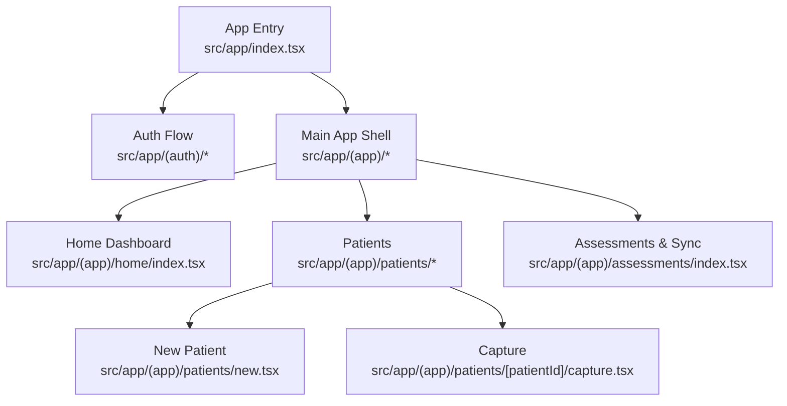
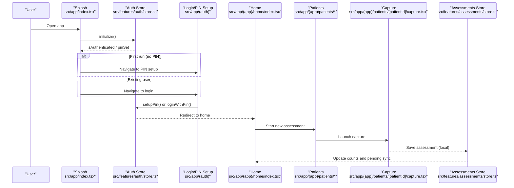
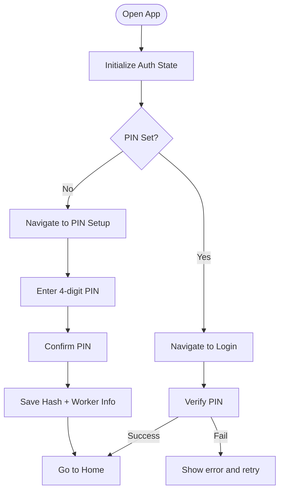
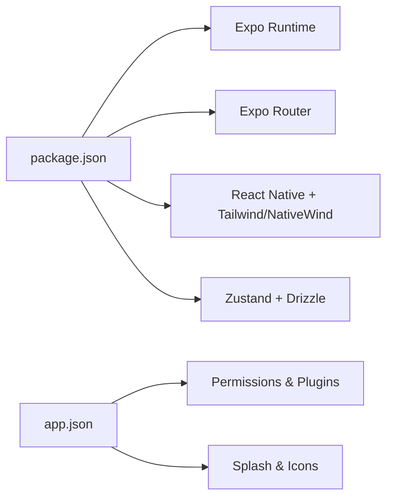

# Getting Started

<cite>
**Referenced Files in This Document**
- [package.json](file://package.json)
- [README.md](file://README.md)
- [app.json](file://app.json)
- [src/app/index.tsx](file://src/app/index.tsx)
- [src/app/(auth)/pin-setup.tsx](file://src/app/(auth)/pin-setup.tsx)
- [src/app/(auth)/login.tsx](file://src/app/(auth)/login.tsx)
- [src/features/auth/store.ts](file://src/features/auth/store.ts)
- [src/app/(app)/home/index.tsx](file://src/app/(app)/home/index.tsx)
- [src/app/(app)/patients/new.tsx](file://src/app/(app)/patients/new.tsx)
- [src/app/(app)/patients/[patientId]/capture.tsx](file://src/app/(app)/patients/[patientId]/capture.tsx)
- [src/hooks/useCameraPermissions.ts](file://src/hooks/useCameraPermissions.ts)
- [src/features/assessments/store.ts](file://src/features/assessments/store.ts)
</cite>

## Table of Contents
1. Introduction
2. Project Structure
3. Core Components
4. Architecture Overview
5. Detailed Component Analysis
6. Dependency Analysis
7. Performance Considerations
8. Troubleshooting Guide
9. Conclusion

## Introduction
DermSight is an AI-powered skin cancer screening mobile application designed for community health workers. It enables offline-first dermatological assessments: capture lesion images, run on-device analysis, and store results locally with background sync when connectivity is available. The app guides users through PIN-based security, patient registration, image capture, assessment review, and data synchronization.

This guide helps you set up the development environment, install dependencies, run the app, and understand the core workflow from first launch to a complete patient assessment.

## Project Structure
The project uses Expo Router with file-based routing under src/app. Key areas:
- Authentication and onboarding: src/app/(auth), src/features/auth
- Main app screens: src/app/(app) (home, patients, assessments, settings)
- Features: src/features (auth, patients, assessments, sync)
- UI components: src/components/ui
- Hooks: src/hooks (camera permissions, connectivity, etc.)
- Configuration: package.json, app.json

**Diagram sources**
- [src/app/index.tsx:16-43](file://src/app/index.tsx#L16-L43)
- [src/app/(app)/home/index.tsx:14-24](file://src/app/(app)/home/index.tsx#L14-L24)
- [src/app/(app)/patients/new.tsx:20-67](file://src/app/(app)/patients/new.tsx#L20-L67)
- [src/app/(app)/patients/[patientId]/capture.tsx:10-23](file://src/app/(app)/patients/[patientId]/capture.tsx#L10-L23)
- [src/app/(app)/assessments/index.tsx:15-44](file://src/app/(app)/assessments/index.tsx#L15-L44)

**Section sources**
- [package.json:1-66](file://package.json#L1-L66)
- [app.json:1-70](file://app.json#L1-L70)
- [src/app/index.tsx:16-43](file://src/app/index.tsx#L16-L43)

## Core Components
- Authentication and PIN management: Secure local storage-backed PIN setup and login flow.
- Patient registration: Intake form with validation and persistence.
- Image capture: Guided camera UI for lesion photos.
- Assessments and sync: Local storage of assessments and queue-based sync when online.

Key implementation references:
- PIN setup and login: [src/app/(auth)/pin-setup.tsx:23-43](file://src/app/(auth)/pin-setup.tsx#L23-L43), [src/app/(auth)/login.tsx:24-46](file://src/app/(auth)/login.tsx#L24-L46), [src/features/auth/store.ts:30-99](file://src/features/auth/store.ts#L30-L99)
- New patient: [src/app/(app)/patients/new.tsx:34-67](file://src/app/(app)/patients/new.tsx#L34-L67)
- Capture flow: [src/app/(app)/patients/[patientId]/capture.tsx:16-23](file://src/app/(app)/patients/[patientId]/capture.tsx#L16-L23)
- Assessments store: [src/features/assessments/store.ts:29-80](file://src/features/assessments/store.ts#L29-L80)

**Section sources**
- [src/app/(auth)/pin-setup.tsx:23-43](file://src/app/(auth)/pin-setup.tsx#L23-L43)
- [src/app/(auth)/login.tsx:24-46](file://src/app/(auth)/login.tsx#L24-L46)
- [src/features/auth/store.ts:30-99](file://src/features/auth/store.ts#L30-L99)
- [src/app/(app)/patients/new.tsx:34-67](file://src/app/(app)/patients/new.tsx#L34-L67)
- [src/app/(app)/patients/[patientId]/capture.tsx:16-23](file://src/app/(app)/patients/[patientId]/capture.tsx#L16-L23)
- [src/features/assessments/store.ts:29-80](file://src/features/assessments/store.ts#L29-L80)

## Architecture Overview
High-level runtime flow:
- On first launch, the splash screen initializes auth state and routes to onboarding or login based on whether a PIN is set.
- After PIN setup or login, users land on the Home dashboard where they can start a new assessment.
- Patient registration collects demographic and contact details.
- Capture screen provides guided framing and captures images.
- Assessments are stored locally and queued for sync; the sync screen shows status and allows manual retries.

**Diagram sources**
- [src/app/index.tsx:21-43](file://src/app/index.tsx#L21-L43)
- [src/features/auth/store.ts:30-99](file://src/features/auth/store.ts#L30-L99)
- [src/app/(app)/home/index.tsx:14-24](file://src/app/(app)/home/index.tsx#L14-L24)
- [src/app/(app)/patients/[patientId]/capture.tsx:16-23](file://src/app/(app)/patients/[patientId]/capture.tsx#L16-L23)
- [src/features/assessments/store.ts:68-80](file://src/features/assessments/store.ts#L68-L80)

## Detailed Component Analysis

### Installation and Environment Setup
- Prerequisites
  - Node.js (recommended LTS version)
  - npm or yarn
  - Expo CLI (used via npx)
  - Platform toolchains:
    - Android: Android Studio with SDK and emulator configured
    - iOS: Xcode with command-line tools and iOS simulator configured
- Install dependencies
  - Run npm install in the project root
- Start the development server
  - Run npx expo start
  - Use the Expo CLI output to open on:
    - Android emulator
    - iOS simulator
    - Web (for quick checks)
    - Expo Go (limited sandbox)

Platform-specific notes
- Android
  - Ensure Android SDK and emulator are installed and running
  - Use the “Android” option in the Expo CLI output or run the provided script
- iOS
  - Ensure Xcode and iOS Simulator are installed
  - Use the “iOS” option in the Expo CLI output or run the provided script

Scripts available in the project
- Start dev server: npm run start
- Run on Android: npm run android
- Run on iOS: npm run ios
- Reset starter project: npm run reset-project

**Section sources**
- [package.json:56-62](file://package.json#L56-L62)
- [README.md:5-26](file://README.md#L5-L26)

### First Launch and Onboarding
- The splash screen initializes authentication state and routes:
  - If no PIN is set, navigate to PIN setup
  - If a PIN exists, navigate to login
  - If already authenticated, navigate to home
- Onboarding slides introduce features and required permissions (camera, storage, optional location).

**Section sources**
- [src/app/index.tsx:21-43](file://src/app/index.tsx#L21-L43)

### PIN Setup and Login
- PIN Setup
  - Enter and confirm a 4-digit PIN
  - Stores a hashed PIN securely and sets initial worker identity
  - On success, navigates to home
- Login
  - Supports PIN mode and email/password mode (MVP redirects to PIN)
  - Verifies PIN against stored hash and sets session state
  - Shows offline notice when device is offline

**Diagram sources**
- [src/app/(auth)/pin-setup.tsx:23-43](file://src/app/(auth)/pin-setup.tsx#L23-L43)
- [src/app/(auth)/login.tsx:24-46](file://src/app/(auth)/login.tsx#L24-L46)
- [src/features/auth/store.ts:51-99](file://src/features/auth/store.ts#L51-L99)

**Section sources**
- [src/app/(auth)/pin-setup.tsx:23-43](file://src/app/(auth)/pin-setup.tsx#L23-L43)
- [src/app/(auth)/login.tsx:24-46](file://src/app/(auth)/login.tsx#L24-L46)
- [src/features/auth/store.ts:51-99](file://src/features/auth/store.ts#L51-L99)

### Home Dashboard
- Displays greeting, connectivity status, and quick actions
- Shows metrics: patients, assessments, pending sync
- Navigates to patient list and assessments/sync

**Section sources**
- [src/app/(app)/home/index.tsx:14-24](file://src/app/(app)/home/index.tsx#L14-L24)
- [src/app/(app)/home/index.tsx:63-113](file://src/app/(app)/home/index.tsx#L63-L113)

### New Patient Registration
- Collects personal and contact information
- Validates required fields before saving
- Persists patient record and returns to previous screen

**Section sources**
- [src/app/(app)/patients/new.tsx:34-67](file://src/app/(app)/patients/new.tsx#L34-L67)

### Lesion Capture
- Provides guided framing and tips
- Captures image and proceeds to review
- Camera permission hook simulates granted status in web/dev; production uses native camera module

**Section sources**
- [src/app/(app)/patients/[patientId]/capture.tsx:16-23](file://src/app/(app)/patients/[patientId]/capture.tsx#L16-L23)
- [src/hooks/useCameraPermissions.ts:20-40](file://src/hooks/useCameraPermissions.ts#L20-L40)

### Assessments and Sync
- Stores assessments locally
- Tracks total count and pending sync items
- Sync screen lists items by status and supports manual retry

**Section sources**
- [src/features/assessments/store.ts:29-80](file://src/features/assessments/store.ts#L29-L80)
- [src/app/(app)/assessments/index.tsx:15-44](file://src/app/(app)/assessments/index.tsx#L15-L44)

## Dependency Analysis
Core runtime dependencies relevant to getting started:
- Expo ecosystem: expo, expo-router, expo-splash-screen, expo-location, expo-camera (via plugins), expo-secure-store, expo-sqlite
- UI and styling: react-native, nativewind, tailwindcss
- Data and state: zustand, drizzle-orm, @supabase/supabase-js
- Utilities: i18next, react-hook-form, zod

Configuration highlights:
- App metadata and platform permissions defined in app.json
- Scripts for starting and targeting platforms defined in package.json

**Diagram sources**
- [package.json:1-66](file://package.json#L1-L66)
- [app.json:1-70](file://app.json#L1-L70)

**Section sources**
- [package.json:1-66](file://package.json#L1-L66)
- [app.json:1-70](file://app.json#L1-L70)

## Performance Considerations
- Keep assessments small and efficient; store only necessary metadata and image URIs locally
- Batch operations where possible to reduce database writes
- Use offline-first patterns to avoid blocking UI during network calls
- Monitor sync queue size and provide user feedback for long-running tasks

[No sources needed since this section provides general guidance]

## Troubleshooting Guide
Common setup issues and resolutions:
- Missing platform toolchains
  - Android: Install Android Studio, configure SDK, and ensure emulator runs
  - iOS: Install Xcode and command-line tools; verify simulator availability
- Expo CLI not found
  - Use npx expo start to invoke the latest CLI without global installation
- Permission errors for camera/location/storage
  - Ensure app.json declares required permissions and plugins
  - On first run, grant permissions when prompted
- Build failures on iOS
  - Clean derived data and rebuild; ensure signing configuration matches your environment
- Metro bundler cache issues
  - Clear caches and restart the dev server if encountering stale modules

Relevant configuration references:
- Permissions and plugins: [app.json:28-63](file://app.json#L28-L63)
- Dev scripts: [package.json:56-62](file://package.json#L56-L62)

**Section sources**
- [app.json:28-63](file://app.json#L28-L63)
- [package.json:56-62](file://package.json#L56-L62)

## Conclusion
You now have the essentials to set up DermSight, run it on Android/iOS, and walk through the core workflow from PIN setup to a complete patient assessment. The app’s offline-first design ensures reliable use in low-connectivity environments, while the sync system keeps records updated when online. For deeper customization, explore the feature stores, repositories, and hooks referenced throughout this guide.