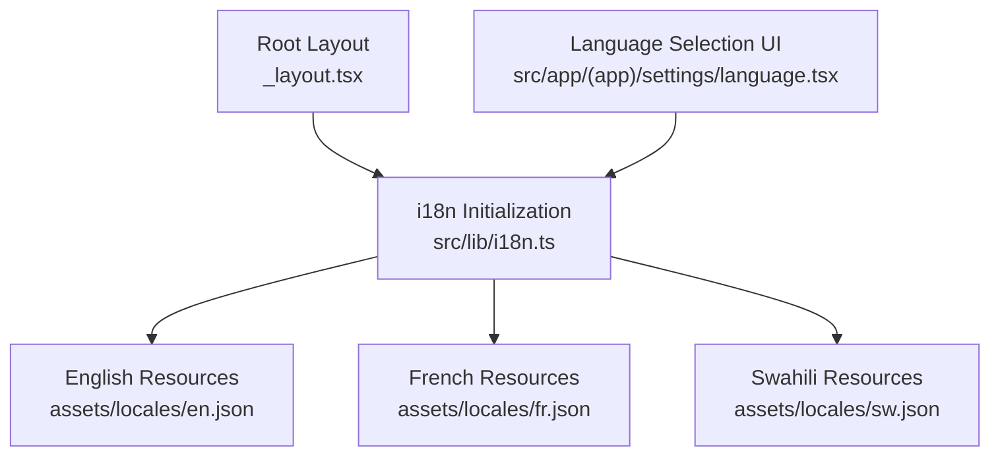
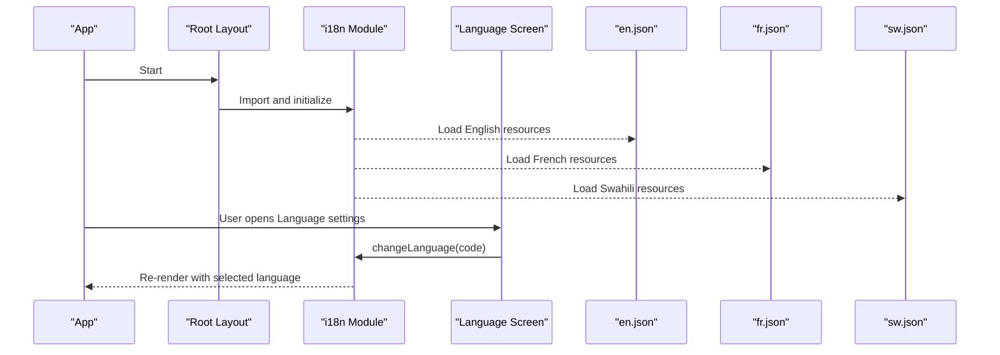
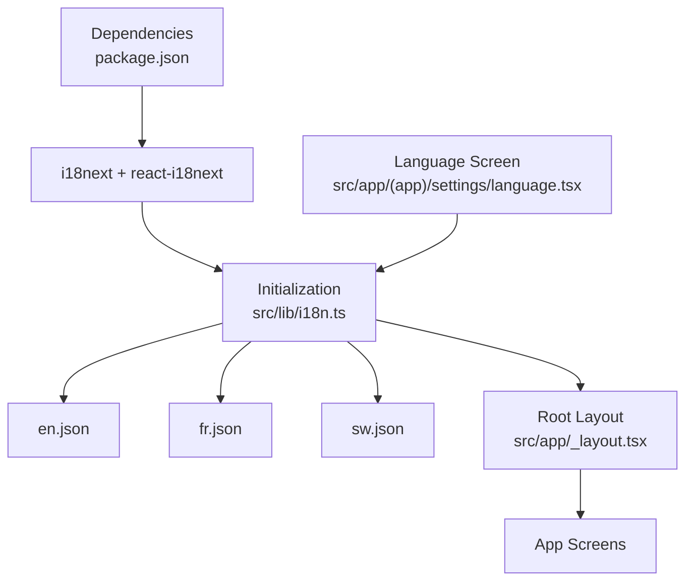

# Internationalization

<cite>
**Referenced Files in This Document**
- [i18n.ts](file://src/lib/i18n.ts)
- [en.json](file://assets/locales/en.json)
- [fr.json](file://assets/locales/fr.json)
- [sw.json](file://assets/locales/sw.json)
- [language.tsx](file://src/app/(app)/settings/language.tsx)
- [_layout.tsx](file://src/app/_layout.tsx)
- [package.json](file://package.json)
</cite>

## Table of Contents
1. [Introduction](#introduction)
2. [Project Structure](#project-structure)
3. [Core Components](#core-components)
4. [Architecture Overview](#architecture-overview)
5. [Detailed Component Analysis](#detailed-component-analysis)
6. [Dependency Analysis](#dependency-analysis)
7. [Performance Considerations](#performance-considerations)
8. [Troubleshooting Guide](#troubleshooting-guide)
9. [Conclusion](#conclusion)
10. [Appendices](#appendices)

## Introduction
This document explains DermSight’s internationalization (i18n) system that supports English, French, and Swahili. It covers how i18next is initialized, how translations are structured and loaded, how users select a language at runtime, and how the app falls back when translations are missing. It also provides guidance for adding new languages, formatting dates and numbers per locale, cultural considerations for healthcare terminology, right-to-left support, testing strategies, and how i18n integrates with patient data display and assessment results.

## Project Structure
The i18n implementation is centered around:
- A single initialization module that configures i18next and registers translation resources.
- JSON translation files organized by language under assets/locales.
- A settings screen that lets users switch languages at runtime.
- A root layout that ensures i18n is bootstrapped early in the app lifecycle.

**Diagram sources**
- [_layout.tsx:1-54](file://src/app/_layout.tsx#L1-L54)
- [i18n.ts:1-29](file://src/lib/i18n.ts#L1-L29)
- [en.json:1-203](file://assets/locales/en.json#L1-L203)
- [fr.json:1-203](file://assets/locales/fr.json#L1-L203)
- [sw.json:1-203](file://assets/locales/sw.json#L1-L203)
- [language.tsx:1-68](file://src/app/(app)/settings/language.tsx#L1-L68)

**Section sources**
- [_layout.tsx:1-54](file://src/app/_layout.tsx#L1-L54)
- [i18n.ts:1-29](file://src/lib/i18n.ts#L1-L29)

## Core Components
- i18next configuration and resource registration: The initialization module imports translation bundles and sets default and fallback languages. It enables interpolation and sets compatibility mode for React integration.
- Translation resources: Each language has a JSON file containing keys grouped by feature areas such as app, onboarding, auth, home, patients, capture, review, result, sync, settings, and common.
- Language selection UI: A simple list of supported languages that updates the active language via i18next’s changeLanguage API.

Key behaviors:
- Default language is set to English.
- Fallback language is English to ensure content always renders even if a key is missing in another language.
- Interpolation is enabled so dynamic values can be injected into strings using placeholders.

**Section sources**
- [i18n.ts:1-29](file://src/lib/i18n.ts#L1-L29)
- [en.json:1-203](file://assets/locales/en.json#L1-L203)
- [fr.json:1-203](file://assets/locales/fr.json#L1-L203)
- [sw.json:1-203](file://assets/locales/sw.json#L1-L203)
- [language.tsx:1-68](file://src/app/(app)/settings/language.tsx#L1-L68)

## Architecture Overview
The i18n architecture follows a straightforward pattern:
- Bootstrap: The root layout imports the i18n module early, ensuring translations are available before any screens render.
- Resources: Translations are bundled statically from JSON files and registered with i18next.
- Runtime switching: The language selection screen calls changeLanguage to update the active language across the app.
- Fallbacks: Missing keys or languages fall back to English automatically.

**Diagram sources**
- [_layout.tsx:1-54](file://src/app/_layout.tsx#L1-L54)
- [i18n.ts:1-29](file://src/lib/i18n.ts#L1-L29)
- [language.tsx:1-68](file://src/app/(app)/settings/language.tsx#L1-L68)
- [en.json:1-203](file://assets/locales/en.json#L1-L203)
- [fr.json:1-203](file://assets/locales/fr.json#L1-L203)
- [sw.json:1-203](file://assets/locales/sw.json#L1-L203)

## Detailed Component Analysis

### i18next Initialization
Responsibilities:
- Registers translation resources for English, French, and Swahili.
- Sets default and fallback languages to English.
- Enables interpolation without escaping values for React components.
- Configures compatibility mode for React integration.

Implications:
- All components can rely on consistent translation availability after bootstrap.
- Missing keys will not break rendering; they will fall back to English.

**Section sources**
- [i18n.ts:1-29](file://src/lib/i18n.ts#L1-L29)

### Translation File Structure and Key Naming
Structure:
- Each JSON file groups keys by feature area (e.g., app, onboarding, auth, home, patients, capture, review, result, sync, settings, common).
- Keys use dot notation to represent hierarchical structure (e.g., home.greeting, patients.firstName).

Naming conventions:
- Use descriptive, domain-scoped keys to avoid collisions and improve maintainability.
- Keep keys stable over time to minimize migration effort.
- Use pluralization-friendly keys where needed (e.g., records, total) and leverage i18next features for plurals if required.

Examples of key usage:
- Greetings and roles: app.name, home.greeting, home.role
- Patient management: patients.title, patients.search, patients.savePatient
- Assessment flow: capture.positionInstruction, review.useImage, result.screeningResult
- Sync status: sync.syncNow, sync.pendingItems, sync.noConnection
- Common actions: common.save, common.cancel, common.retry

**Section sources**
- [en.json:1-203](file://assets/locales/en.json#L1-L203)
- [fr.json:1-203](file://assets/locales/fr.json#L1-L203)
- [sw.json:1-203](file://assets/locales/sw.json#L1-L203)

### Dynamic Language Switching
Behavior:
- The language selection screen lists supported languages and updates the active language via i18next.changeLanguage.
- After changing the language, the app re-renders with the new locale’s strings.

Considerations:
- Ensure all user-facing text uses translation keys rather than hardcoded strings to reflect changes immediately.
- Persisting the selected language across sessions is recommended for better UX; currently, the selection applies during runtime.

**Section sources**
- [language.tsx:1-68](file://src/app/(app)/settings/language.tsx#L1-L68)

### Locale Detection and Persistence
Current state:
- The app initializes with English as the default language and does not auto-detect device locale.
- There is no explicit persistence mechanism for the selected language in the analyzed code.

Recommendations:
- Detect device locale at startup and map it to supported codes (en, fr, sw).
- Persist the chosen language using secure storage or preferences so it survives app restarts.
- Provide a clear way for users to override automatic detection.

[No sources needed since this section provides general guidance]

### Text Localization in Components
Guidance:
- Replace hardcoded strings with translation keys from the appropriate namespace (e.g., home.greeting, patients.title).
- Use interpolation to inject dynamic values like names or counts.
- Ensure error messages, labels, placeholders, and empty states are fully localized.

Example patterns (by reference):
- Home greeting and role: home.greeting, home.role
- Patient list header and search placeholder: patients.title, patients.search
- Capture instructions and tips: capture.positionInstruction, capture.tips
- Review actions and quality notes: review.useImage, review.qualityGood
- Result disclaimers and actions: result.disclaimer, result.saveResult
- Sync queue status and actions: sync.syncNow, sync.pendingItems, sync.noConnection
- Settings entries and version info: settings.language, settings.version

**Section sources**
- [en.json:1-203](file://assets/locales/en.json#L1-L203)
- [fr.json:1-203](file://assets/locales/fr.json#L1-L203)
- [sw.json:1-203](file://assets/locales/sw.json#L1-L203)

### Date and Number Formatting for Different Locales
Guidance:
- Use locale-aware formatters to present dates and numbers consistently across languages.
- For dates, prefer libraries or APIs that respect locale-specific formats (e.g., day/month order, month names).
- For numbers, apply locale-specific separators and decimal rules.

Implementation note:
- Integrate a formatting utility that reads the current locale from i18n and formats values accordingly.
- Avoid hardcoding date or number formats in components.

[No sources needed since this section provides general guidance]

### Cultural Considerations for Healthcare Terminology
Guidelines:
- Use respectful, culturally appropriate terms for gender, health conditions, and procedures.
- Align terminology with local health worker practices and patient communication norms.
- Validate translations with native speakers familiar with healthcare contexts.
- Maintain consistency across all screens to reduce confusion.

[No sources needed since this section provides general guidance]

### Right-to-Left Language Support
Guidance:
- If future locales require right-to-left (RTL) layout, configure the UI framework to adapt layouts based on locale direction.
- Test alignment, icons, and navigation flows in RTL mode.
- Ensure text containers do not assume left-to-right behavior.

[No sources needed since this section provides general guidance]

### Testing Approaches for Multi-Language Functionality
Recommendations:
- Unit tests: Verify that translation keys resolve correctly for each supported locale.
- Integration tests: Simulate language switching and assert that UI elements update accordingly.
- Visual regression: Compare screenshots across locales to catch layout issues.
- Accessibility: Ensure screen readers announce localized strings appropriately.

[No sources needed since this section provides general guidance]

### Relationship with Patient Data Display and Assessment Results
Integration points:
- Patient-related labels, placeholders, and statuses should be localized to ensure clarity for health workers.
- Assessment results and disclaimers must be translated accurately to communicate risk levels and recommended actions.
- Sync status messages should be localized to inform users about connectivity and data synchronization.

**Section sources**
- [en.json:1-203](file://assets/locales/en.json#L1-L203)
- [fr.json:1-203](file://assets/locales/fr.json#L1-L203)
- [sw.json:1-203](file://assets/locales/sw.json#L1-L203)

## Dependency Analysis
The i18n system depends on:
- i18next and react-i18next packages for core functionality and React integration.
- Static JSON translation files for each supported language.
- The root layout to initialize i18n early in the app lifecycle.
- The language selection screen to trigger runtime language changes.

**Diagram sources**
- [package.json:1-66](file://package.json#L1-L66)
- [i18n.ts:1-29](file://src/lib/i18n.ts#L1-L29)
- [_layout.tsx:1-54](file://src/app/_layout.tsx#L1-L54)
- [language.tsx:1-68](file://src/app/(app)/settings/language.tsx#L1-L68)
- [en.json:1-203](file://assets/locales/en.json#L1-L203)
- [fr.json:1-203](file://assets/locales/fr.json#L1-L203)
- [sw.json:1-203](file://assets/locales/sw.json#L1-L203)

**Section sources**
- [package.json:1-66](file://package.json#L1-L66)
- [i18n.ts:1-29](file://src/lib/i18n.ts#L1-L29)

## Performance Considerations
- Keep translation files modular and well-structured to minimize parsing overhead.
- Avoid excessive interpolation in hot paths to prevent unnecessary re-renders.
- Preload only necessary locales if supporting many languages in the future.
- Monitor bundle size impact of additional locales and consider lazy loading if needed.

[No sources needed since this section provides general guidance]

## Troubleshooting Guide
Common issues and resolutions:
- Missing translations:
  - Symptom: UI shows raw keys or falls back to English.
  - Resolution: Add the missing key to all supported locale files; verify key paths match component usage.
- Incorrect interpolation:
  - Symptom: Dynamic values not displayed.
  - Resolution: Ensure placeholders are used consistently and values are passed correctly to the translation function.
- Language not persisting:
  - Symptom: Language resets on app restart.
  - Resolution: Implement persistence for the selected language using secure storage or preferences.
- Device locale mismatch:
  - Symptom: Auto-detected language differs from user preference.
  - Resolution: Allow manual override and prioritize user choice over device locale.

**Section sources**
- [i18n.ts:1-29](file://src/lib/i18n.ts#L1-L29)
- [language.tsx:1-68](file://src/app/(app)/settings/language.tsx#L1-L68)

## Conclusion
DermSight’s i18n system provides a solid foundation for multi-language support with English, French, and Swahili. The centralized initialization, structured translation files, and runtime language switching enable a responsive and accessible experience for community health workers. To enhance usability, consider implementing locale detection, persistent language preferences, robust date and number formatting, and comprehensive testing across locales. These improvements will strengthen the app’s localization workflow and ensure consistent, culturally appropriate communication in healthcare contexts.

## Appendices

### Adding a New Language
Steps:
- Create a new JSON file under assets/locales with the same key structure as existing files.
- Register the new language in the i18n initialization module by importing and adding it to the resources object.
- Update the language selection screen to include the new language option.
- Test language switching and verify all keys render correctly.

**Section sources**
- [i18n.ts:1-29](file://src/lib/i18n.ts#L1-L29)
- [language.tsx:1-68](file://src/app/(app)/settings/language.tsx#L1-L68)

### Updating Existing Translations
Guidelines:
- Edit the relevant keys in each locale file while preserving key names to avoid breaking references.
- Validate translations for accuracy and cultural appropriateness.
- Run tests to ensure no regressions in UI or functionality.

**Section sources**
- [en.json:1-203](file://assets/locales/en.json#L1-L203)
- [fr.json:1-203](file://assets/locales/fr.json#L1-L203)
- [sw.json:1-203](file://assets/locales/sw.json#L1-L203)