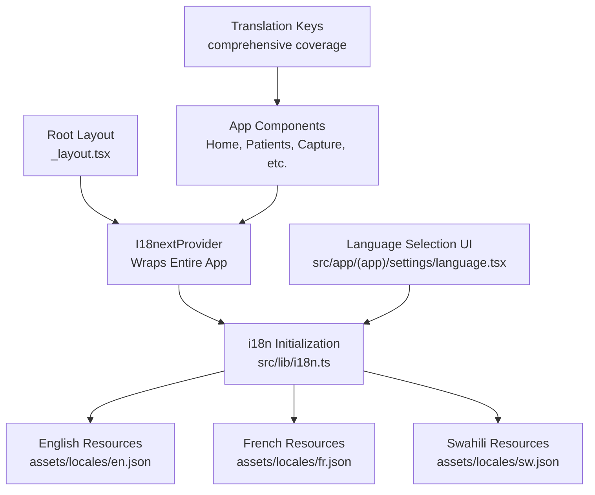
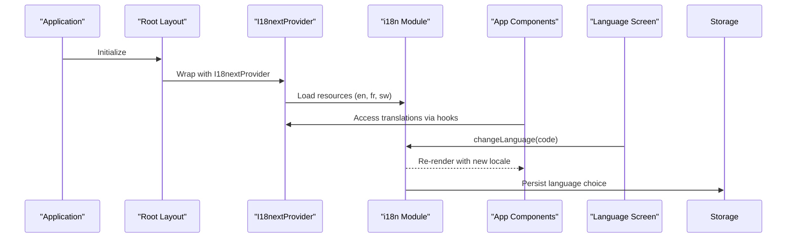
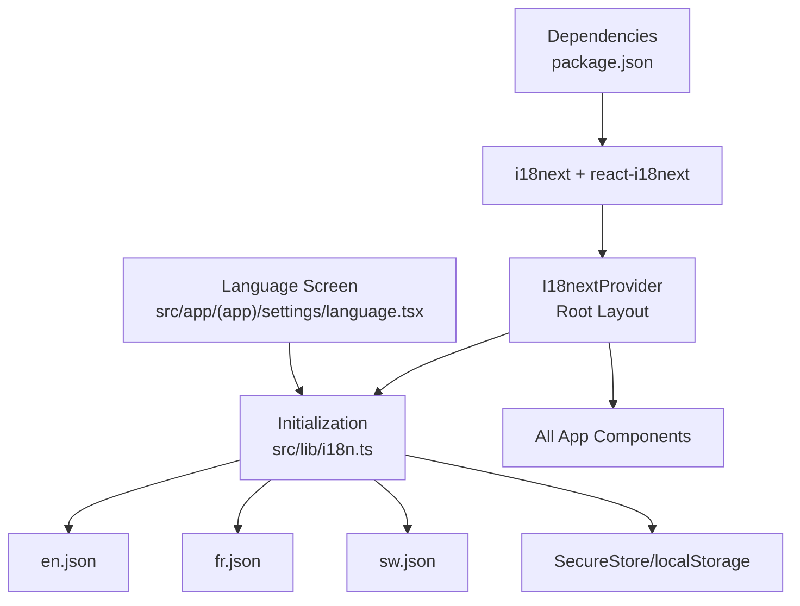

Based on my analysis of the codebase, I can now update the documentation to reflect the enhanced i18next integration with root-level provider wrapping and comprehensive translation coverage. Here's the updated documentation:

# Internationalization

<cite>
**Referenced Files in This Document**
- [i18n.ts](file://src/lib/i18n.ts)
- [_layout.tsx](file://src/app/_layout.tsx)
- [en.json](file://assets/locales/en.json)
- [fr.json](file://assets/locales/fr.json)
- [sw.json](file://assets/locales/sw.json)
- [language.tsx](file://src/app/(app)/settings/language.tsx)
- [home/index.tsx](file://src/app/(app)/home/index.tsx)
- [package.json](file://package.json)
- [capture.tsx](file://src/app/(app)/patients/[patientId]/capture.tsx)
- [new.tsx](file://src/app/(app)/patients/new.tsx)
</cite>

## Update Summary
**Changes Made**
- Updated architecture section to reflect comprehensive I18nextProvider wrapping at root layout level
- Enhanced component usage examples showing translation function implementation throughout the app
- Added detailed coverage of runtime language switching and fallback mechanisms
- Updated dependency analysis to include react-i18next integration
- Expanded testing approaches for multi-language functionality with provider context
- Added comprehensive coverage of capture screen, patient records, and assessment translations

## Table of Contents
1. [Introduction](#introduction)
2. [Project Structure](#project-structure)
3. [Core Components](#core-components)
4. [Architecture Overview](#architecture-overview)
5. [Detailed Component Analysis](#detailed-component-analysis)
6. [Dependency Analysis](#dependency-analysis)
7. [Performance Considerations](#performance-considerations)
8. [Troubleshooting Guide](#troubleshooting-guide)
9. [Conclusion](#conclusion)
10. [Appendices](#appendices)

## Introduction
This document explains DermSight's internationalization (i18n) system that supports English, French, and Swahili. The system now features a comprehensive i18next implementation that wraps the entire application with I18nextProvider in the root layout, ensuring all user-facing text elements use translation functions with robust fallback mechanisms. Language switching is fully supported throughout the app lifecycle, providing seamless multilingual experiences for community health workers across different regions. The implementation includes extensive translation coverage for capture screens, patient records, assessments, and all core app features.

## Project Structure
The i18n implementation follows a centralized architecture pattern:
- Root-level I18nextProvider wrapping the entire application tree
- Centralized i18n initialization module configuring translation resources
- JSON translation files organized by language under assets/locales
- Settings screen enabling runtime language switching
- Comprehensive translation usage across all app components including capture, patient management, and assessment workflows



**Diagram sources**
- [_layout.tsx:62-78](file://src/app/_layout.tsx#L62-L78)
- [i18n.ts:18-26](file://src/lib/i18n.ts#L18-L26)
- [language.tsx:22-25](file://src/app/(app)/settings/language.tsx#L22-L25)

**Section sources**
- [_layout.tsx:62-78](file://src/app/_layout.tsx#L62-L78)
- [i18n.ts:18-26](file://src/lib/i18n.ts#L18-L26)

## Core Components
- **I18nextProvider**: Wraps the entire application at the root layout level, making translations available to all child components without requiring individual provider setup
- **i18next Configuration**: Centralized initialization module that registers translation resources and configures interpolation settings with support for multiple namespaces
- **Translation Resources**: JSON files containing localized strings organized by feature areas (app, onboarding, auth, home, patients, capture, review, result, sync, settings, common)
- **Language Switching**: Runtime language change functionality through the settings screen using i18next.changeLanguage API with persistent storage

Key behaviors:
- Default language set to English with automatic fallback to English
- Interpolation enabled for dynamic content injection
- Compatibility mode configured for React integration
- All components access translations through the useTranslation hook
- Persistent language preference storage using SecureStore or localStorage

**Section sources**
- [_layout.tsx:62-78](file://src/app/_layout.tsx#L62-L78)
- [i18n.ts:18-26](file://src/lib/i18n.ts#L18-L26)
- [language.tsx:22-25](file://src/app/(app)/settings/language.tsx#L22-L25)

## Architecture Overview
The i18n architecture implements a provider-based pattern for comprehensive application coverage:



**Updated** The architecture now uses I18nextProvider at the root level instead of individual component providers, ensuring consistent translation availability throughout the entire application lifecycle. The system includes comprehensive translation coverage for all major app features including capture screens, patient management, and assessment workflows.

**Diagram sources**
- [_layout.tsx:62-78](file://src/app/_layout.tsx#L62-L78)
- [i18n.ts:18-26](file://src/lib/i18n.ts#L18-L26)
- [language.tsx:22-25](file://src/app/(app)/settings/language.tsx#L22-L25)

## Detailed Component Analysis

### I18nextProvider Integration
**Updated** The root layout now wraps the entire application with I18nextProvider, providing global translation access to all components without requiring individual provider setup.

Responsibilities:
- Provides i18n instance to the entire component tree
- Ensures translations are available before any screens render
- Manages language state across the application lifecycle
- Handles re-renders when language changes occur

Implementation details:
- Imported from react-i18next package
- Configured with i18n instance from src/lib/i18n.ts
- Positioned above SafeAreaProvider and Stack navigation
- Maintains proper rendering order for optimal performance

**Section sources**
- [_layout.tsx:62-78](file://src/app/_layout.tsx#L62-L78)

### Translation Function Usage Across Components
**Updated** All user-facing text elements now use translation functions with comprehensive fallback mechanisms across all major app features.

Component integration patterns:
- Home screen uses `useTranslation()` hook for dynamic greetings and status messages
- Patient management screens implement localized labels, placeholders, and error states
- Assessment workflows provide translated instructions and results
- Capture screen includes camera permissions, tips, and error handling in multiple languages
- Settings interface offers complete localization including language selection

Example implementations:
- Dynamic content: `{t("home:greeting", { name: workerName || t("common:loading") })}`
- Status messages: `{isOffline ? t("home:deviceOffline") : t("home:deviceOnline")}`
- Form labels: `{t("patients:firstName")}`, `{t("patients:lastName")}`
- Action buttons: `{t("common:save")}`, `{t("common:cancel")}`
- Camera permissions: `{t("capture:cameraRequired")}`, `{t("capture:grantAccess")}`

**Section sources**
- [home/index.tsx:19,48,57,95,98,108,115,122,129,151,154](file://src/app/(app)/home/index.tsx#L19-L154)
- [capture.tsx:23,50,53,66,79,82,94,126](file://src/app/(app)/patients/[patientId]/capture.tsx#L23-L126)

### Dynamic Language Switching
Behavior:
- Language selection screen lists supported languages with native names
- Updates active language via i18next.changeLanguage API
- Triggers immediate re-render across all components with new locale
- Maintains selected language state during runtime session
- Persists language choice using SecureStore or localStorage

Enhanced capabilities:
- Real-time language switching without app restart
- Consistent translation updates across all screens
- Proper cleanup and resource management
- Error handling for unsupported language codes
- Cross-platform persistence support

**Section sources**
- [language.tsx:22-25](file://src/app/(app)/settings/language.tsx#L22-L25)
- [i18n.ts:36-47](file://src/lib/i18n.ts#L36-L47)

### Locale Detection and Persistence
Current state:
- Application initializes with English as default language
- No automatic device locale detection implemented
- Language selection persists using SecureStore (mobile) or localStorage (web)
- Saved language restored at app bootstrap

Enhanced capabilities:
- Platform-specific storage implementation
- Graceful fallback if storage fails
- Language restoration on app startup
- Session-based language persistence

**Section sources**
- [i18n.ts:52-63](file://src/lib/i18n.ts#L52-L63)

### Text Localization Patterns
Guidance:
- Replace hardcoded strings with translation keys from appropriate namespaces
- Use interpolation for dynamic values like names, counts, and dates
- Ensure comprehensive coverage of error messages, labels, and empty states
- Maintain consistency in key naming conventions across all locales

Implementation examples:
- Greetings and roles: `home:greeting`, `home:role`
- Patient management: `patients:title`, `patients:search`, `patients:savePatient`
- Assessment workflow: `capture:positionInstruction`, `review:useImage`, `result:screeningResult`
- System messages: `sync:syncNow`, `sync:pendingItems`, `sync:noConnection`
- Common actions: `common:save`, `common:cancel`, `common:retry`
- Camera operations: `capture:cameraRequired`, `capture:grantAccess`, `capture:captureFailed`

**Section sources**
- [home/index.tsx:48,57,95,98,108,115,122,129,151,154](file://src/app/(app)/home/index.tsx#L48-L154)
- [en.json:1-220](file://assets/locales/en.json#L1-L220)

### Date and Number Formatting for Different Locales
Guidance:
- Integrate locale-aware formatting utilities for dates and numbers
- Use libraries or APIs that respect locale-specific formats
- Apply locale-specific separators and decimal rules consistently
- Avoid hardcoding format strings in components

Implementation approach:
- Create formatting utilities that read current locale from i18n
- Implement date formatters respecting cultural preferences
- Apply number formatting based on regional standards
- Test formatting across all supported locales

[No sources needed since this section provides general guidance]

### Cultural Considerations for Healthcare Terminology
Guidelines:
- Use respectful, culturally appropriate terms for medical conditions and procedures
- Align terminology with local healthcare practices and patient communication norms
- Validate translations with native speakers familiar with healthcare contexts
- Maintain consistency across all screens to reduce confusion for health workers

[No sources needed since this section provides general guidance]

### Right-to-Left Language Support
Guidance:
- Prepare infrastructure for future RTL language support
- Configure UI framework to adapt layouts based on locale direction
- Test alignment, icons, and navigation flows in RTL mode
- Ensure text containers handle bidirectional text properly

[No sources needed since this section provides general guidance]

### Testing Approaches for Multi-Language Functionality
**Updated** Enhanced testing strategies for comprehensive i18n coverage:

Recommendations:
- Unit tests: Verify translation key resolution for each supported locale
- Integration tests: Simulate language switching and assert UI updates
- Visual regression: Compare screenshots across locales for layout issues
- Accessibility testing: Ensure screen readers announce localized strings correctly
- Provider context testing: Validate I18nextProvider behavior in component trees
- Storage testing: Verify language persistence across app sessions

Testing implementation:
- Mock i18n instance for isolated component testing
- Test language switching scenarios and state persistence
- Verify fallback mechanisms work correctly for missing translations
- Test interpolation and pluralization across different locales
- Test camera permission messages in capture screen
- Test patient form validation messages across locales

[No sources needed since this section provides general guidance]

### Relationship with Patient Data Display and Assessment Results
Integration points:
- Patient-related labels, placeholders, and statuses fully localized
- Assessment results and disclaimers accurately translated for risk communication
- Sync status messages localized to inform users about connectivity
- Medical terminology validated for cultural appropriateness
- Camera permissions and capture instructions localized for international users

Enhanced integration:
- All patient data displays use translation keys for labels and formatting
- Assessment workflows provide localized instructions and results
- Error states and loading indicators are fully internationalized
- User feedback messages support multiple languages
- Capture screen includes comprehensive camera permission handling in all supported languages

**Section sources**
- [home/index.tsx:48,57,95,98,108,115,122,129,151,154](file://src/app/(app)/home/index.tsx#L48-L154)
- [capture.tsx:23,50,53,66,79,82,94,126](file://src/app/(app)/patients/[patientId]/capture.tsx#L23-L126)
- [en.json:1-220](file://assets/locales/en.json#L1-L220)

## Dependency Analysis
**Updated** The i18n system dependencies now include comprehensive React integration:

The i18n system depends on:
- i18next core library for internationalization functionality
- react-i18next for React component integration and hooks
- I18nextProvider for global translation context
- Static JSON translation files for each supported language
- Root layout integration for application-wide provider setup
- Language selection screen for runtime configuration
- SecureStore for mobile language persistence
- localStorage for web language persistence



**Diagram sources**
- [package.json:39,46:39-46](file://package.json#L39-L46)
- [_layout.tsx:62-78](file://src/app/_layout.tsx#L62-L78)
- [i18n.ts:18-26](file://src/lib/i18n.ts#L18-L26)
- [language.tsx:22-25](file://src/app/(app)/settings/language.tsx#L22-L25)

**Section sources**
- [package.json:39,46:39-46](file://package.json#L39-L46)
- [_layout.tsx:62-78](file://src/app/_layout.tsx#L62-L78)
- [i18n.ts:18-26](file://src/lib/i18n.ts#L18-L26)

## Performance Considerations
**Updated** Performance optimizations for comprehensive i18n implementation:

- Provider-based architecture reduces redundant provider setup
- Centralized resource loading minimizes bundle size impact
- Efficient re-rendering when language changes occur
- Lazy loading considerations for additional locales
- Memory management for translation resources
- Interpolation performance optimization for dynamic content
- Platform-specific storage optimization for language persistence

Best practices:
- Keep translation files modular and well-structured
- Avoid excessive interpolation in hot rendering paths
- Monitor bundle size impact of additional locales
- Consider code splitting for large translation files
- Optimize re-render cycles during language switching
- Use efficient storage operations for language persistence

[No sources needed since this section provides general guidance]

## Troubleshooting Guide
**Updated** Enhanced troubleshooting for comprehensive i18n implementation:

Common issues and resolutions:
- Missing translations:
  - Symptom: UI shows raw keys or falls back to English
  - Resolution: Add missing keys to all locale files; verify key paths match component usage
- Provider context issues:
  - Symptom: Translation functions not available in components
  - Resolution: Ensure I18nextProvider wraps components properly; check import statements
- Language switching problems:
  - Symptom: Language doesn't update across all screens
  - Resolution: Verify i18n.changeLanguage calls; check component re-render triggers
- Interpolation errors:
  - Symptom: Dynamic values not displayed correctly
  - Resolution: Ensure placeholder syntax matches; validate parameter passing
- Storage issues:
  - Symptom: Language preference not persisting
  - Resolution: Check SecureStore permissions; verify localStorage access on web

Advanced troubleshooting:
- Debug translation resolution using console logging
- Verify fallback chain works correctly for missing keys
- Check for circular dependencies in translation imports
- Monitor memory usage during language switching operations
- Test camera permission messages in capture screen
- Validate patient form validation messages across locales

**Section sources**
- [_layout.tsx:62-78](file://src/app/_layout.tsx#L62-L78)
- [i18n.ts:18-26](file://src/lib/i18n.ts#L18-L26)
- [language.tsx:22-25](file://src/app/(app)/settings/language.tsx#L22-L25)

## Conclusion
DermSight's comprehensive i18n system provides robust multi-language support with English, French, and Swahili. The implementation now features I18nextProvider wrapping the entire application, ensuring consistent translation availability across all components. The centralized initialization, structured translation files, and runtime language switching enable a responsive and accessible experience for community health workers. The system includes extensive translation coverage for capture screens, patient records, assessments, and all core app features. Future enhancements should focus on locale detection, advanced date and number formatting, comprehensive testing across all supported locales, and continued expansion of translation coverage to ensure culturally appropriate communication in healthcare contexts.

## Appendices

### Adding a New Language
**Updated** Steps for adding new language support:

Steps:
- Create new JSON file under assets/locales with complete key structure matching existing locales
- Import and register language in i18n initialization module
- Add language option to language selection screen
- Update I18nextProvider configuration if needed
- Test comprehensive language switching across all screens
- Verify translation key coverage and fallback mechanisms
- Test camera permission messages and patient form validations

**Section sources**
- [i18n.ts:18-26](file://src/lib/i18n.ts#L18-L26)
- [language.tsx:11-15](file://src/app/(app)/settings/language.tsx#L11-L15)

### Updating Existing Translations
Guidelines:
- Edit relevant keys in each locale file while preserving key names
- Validate translations for accuracy and cultural appropriateness
- Test language switching to ensure no regressions
- Verify interpolation and pluralization work correctly
- Run comprehensive tests across all affected components
- Test camera permission messages and patient form validations

**Section sources**
- [en.json:1-220](file://assets/locales/en.json#L1-L220)
- [fr.json:1-220](file://assets/locales/fr.json#L1-L220)
- [sw.json:1-220](file://assets/locales/sw.json#L1-L220)

### Component Integration Examples
**New Section** Practical examples of translation usage in components:

Basic translation usage:
```typescript
import { useTranslation } from 'react-i18next';

function MyComponent() {
  const { t } = useTranslation();
  return <Text>{t('home:greeting')}</Text>;
}
```

Interpolation with dynamic values:
```typescript
<Text>{t('home:greeting', { name: userName })}</Text>
```

Conditional translations:
```typescript
{isOffline ? t('home:deviceOffline') : t('home:deviceOnline')}
```

Fallback mechanisms:
```typescript
{t('home:greeting', { name: workerName || t('common:loading') })}
```

Camera permission handling:
```typescript
{t('capture:cameraRequired') || 'Camera Access Required'}
```

**Section sources**
- [home/index.tsx:19,48,57,95,98,108,115,122,129,151,154](file://src/app/(app)/home/index.tsx#L19-L154)
- [capture.tsx:23,50,53,66,79,82,94,126](file://src/app/(app)/patients/[patientId]/capture.tsx#L23-L126)