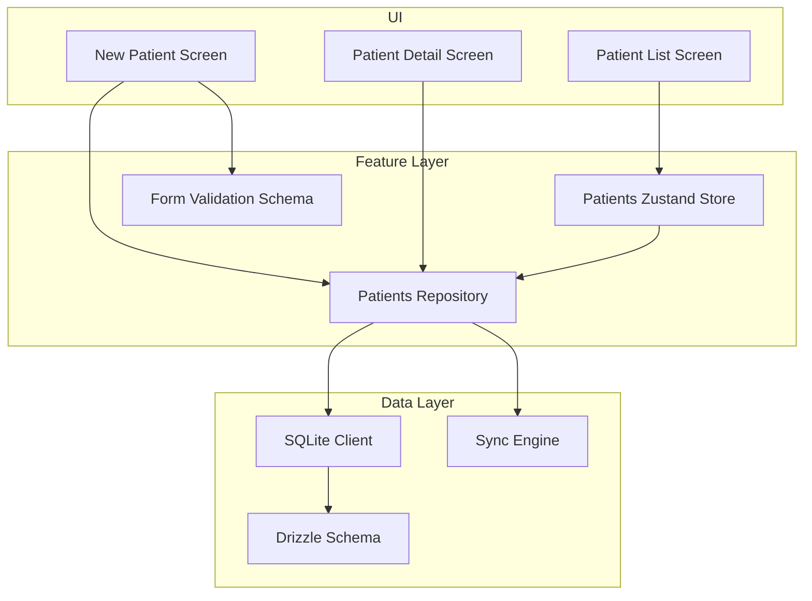
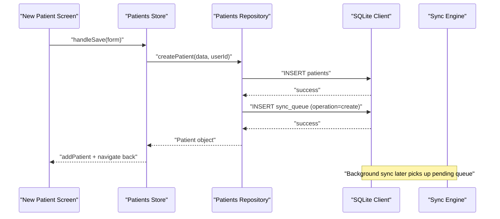
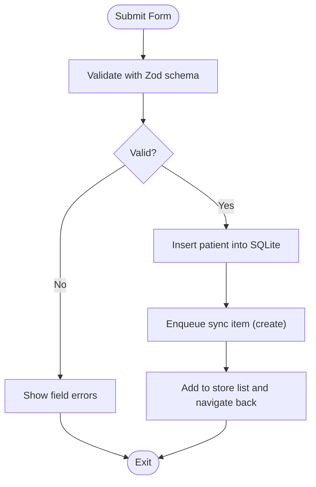
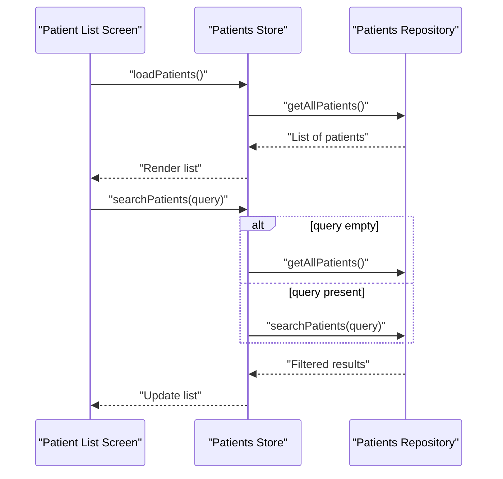
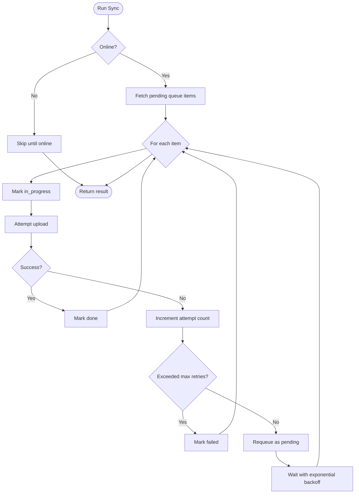
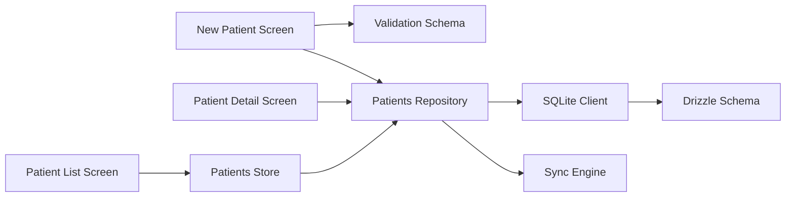

# CRUD Operations

<cite>
**Referenced Files in This Document**
- [repository.ts](file://src/features/patients/repository.ts)
- [store.ts](file://src/features/patients/store.ts)
- [types.ts](file://src/features/patients/types.ts)
- [validation.ts](file://src/features/patients/validation.ts)
- [schema.ts](file://src/db/schema.ts)
- [client.ts](file://src/db/client.ts)
- [index.ts](file://src/types/index.ts)
- [syncEngine.ts](file://src/features/sync/syncEngine.ts)
- [new.tsx](file://src/app/(app)/patients/new.tsx)
- [index.tsx](file://src/app/(app)/patients/index.tsx)
- [patientId/index.tsx](file://src/app/(app)/patients/[patientId]/index.tsx)
- [uuid.ts](file://src/utils/uuid.ts)
</cite>

## Table of Contents
1. [Introduction](#introduction)
2. [Project Structure](#project-structure)
3. [Core Components](#core-components)
4. [Architecture Overview](#architecture-overview)
5. [Detailed Component Analysis](#detailed-component-analysis)
6. [Dependency Analysis](#dependency-analysis)
7. [Performance Considerations](#performance-considerations)
8. [Troubleshooting Guide](#troubleshooting-guide)
9. [Conclusion](#conclusion)
10. [Appendices](#appendices)

## Introduction
This document explains the patient CRUD operations in DermSight with a focus on the repository pattern for data access abstraction, form validation, persistence, and initial sync queue setup. It covers retrieval methods (search, filtering), update strategies, deletion processes, error handling, transactional considerations, and best practices for data integrity. The system is offline-first: local SQLite is the single source of truth, and background synchronization uses an outbox pattern to push changes to the remote server when connectivity is available.

## Project Structure
The patient feature is organized into:
- Repository layer: database access and mapping between rows and domain types
- Store layer: UI state management and orchestration of repository calls
- Validation layer: schema-based form validation
- Database layer: Drizzle ORM schema and initialization
- Sync engine: background processing of pending operations
- UI screens: creation, listing, and detail views

**Diagram sources**
- [new.tsx:44-67](file://src/app/(app)/patients/new.tsx#L44-L67)
- [index.tsx:16-36](file://src/app/(app)/patients/index.tsx#L16-L36)
- [patientId/index.tsx:21-26](file://src/app/(app)/patients/[patientId]/index.tsx#L21-L26)
- [repository.ts:13-42](file://src/features/patients/repository.ts#L13-L42)
- [store.ts:26-67](file://src/features/patients/store.ts#L26-L67)
- [validation.ts:7-20](file://src/features/patients/validation.ts#L7-L20)
- [client.ts:19-101](file://src/db/client.ts#L19-L101)
- [schema.ts:18-92](file://src/db/schema.ts#L18-L92)
- [syncEngine.ts:55-110](file://src/features/sync/syncEngine.ts#L55-L110)

**Section sources**
- [repository.ts:1-128](file://src/features/patients/repository.ts#L1-L128)
- [store.ts:1-68](file://src/features/patients/store.ts#L1-L68)
- [validation.ts:1-23](file://src/features/patients/validation.ts#L1-L23)
- [schema.ts:1-102](file://src/db/schema.ts#L1-L102)
- [client.ts:1-104](file://src/db/client.ts#L1-L104)
- [syncEngine.ts:1-145](file://src/features/sync/syncEngine.ts#L1-L145)
- [new.tsx:1-192](file://src/app/(app)/patients/new.tsx#L1-L192)
- [index.tsx:1-132](file://src/app/(app)/patients/index.tsx#L1-L132)
- [patientId/index.tsx:1-211](file://src/app/(app)/patients/[patientId]/index.tsx#L1-L211)

## Core Components
- Repository: Encapsulates all SQLite interactions for patients using Drizzle ORM. Provides functions to list, search, read by ID, create, and delete patients. Also enqueues sync items after writes.
- Store: Manages UI state for the patient list, active patient, filters, and search queries. Delegates to repository for data loading and search.
- Validation: Zod schemas enforce required fields and formats for patient forms.
- Database: Drizzle schema defines tables and constraints; client initializes the SQLite database and exposes typed queries.
- Sync Engine: Processes pending sync queue entries with retries and exponential backoff.

Key responsibilities:
- Data access isolation behind repository functions
- Offline-first persistence with immediate local success
- Background synchronization via outbox pattern
- Form validation before persistence

**Section sources**
- [repository.ts:13-106](file://src/features/patients/repository.ts#L13-L106)
- [store.ts:26-67](file://src/features/patients/store.ts#L26-L67)
- [validation.ts:7-20](file://src/features/patients/validation.ts#L7-L20)
- [schema.ts:18-92](file://src/db/schema.ts#L18-L92)
- [client.ts:19-101](file://src/db/client.ts#L19-L101)
- [syncEngine.ts:24-110](file://src/features/sync/syncEngine.ts#L24-L110)

## Architecture Overview
DermSight follows an offline-first architecture:
- UI triggers actions (create, search, view)
- Store coordinates UI state and calls repository
- Repository performs local SQLite operations and enqueues sync tasks
- Sync engine runs in background to upload queued items when online

**Diagram sources**
- [new.tsx:44-67](file://src/app/(app)/patients/new.tsx#L44-L67)
- [repository.ts:44-101](file://src/features/patients/repository.ts#L44-L101)
- [client.ts:19-101](file://src/db/client.ts#L19-L101)
- [syncEngine.ts:55-110](file://src/features/sync/syncEngine.ts#L55-L110)

## Detailed Component Analysis

### Create Patient Workflow
- Form validation:
  - Required fields: first name, last name, date of birth (YYYY-MM-DD), sex selection
  - Optional fields: phone, address, notes
  - Validation schema ensures type safety and user-friendly messages
- Persistence:
  - Generate unique ID and timestamps
  - Insert patient record with default sync status “pending”
  - Enqueue a sync item with operation “create” and payload containing the new patient
- UI integration:
  - On success, add patient to store list and navigate back
  - Errors are caught and surfaced to the user

**Diagram sources**
- [validation.ts:7-20](file://src/features/patients/validation.ts#L7-L20)
- [repository.ts:44-101](file://src/features/patients/repository.ts#L44-L101)
- [new.tsx:34-67](file://src/app/(app)/patients/new.tsx#L34-L67)

**Section sources**
- [validation.ts:7-20](file://src/features/patients/validation.ts#L7-L20)
- [repository.ts:44-101](file://src/features/patients/repository.ts#L44-L101)
- [new.tsx:34-67](file://src/app/(app)/patients/new.tsx#L34-L67)
- [uuid.ts:6-10](file://src/utils/uuid.ts#L6-L10)

### Read Patients: Search, Filtering, and Pagination
- Retrieval methods:
  - Get all patients ordered by creation time
  - Search by first name, last name, or ID using pattern matching
  - Retrieve a specific patient by ID
- Filtering:
  - Filter tabs in the list screen allow viewing all, synced, or pending patients based on sync status
- Pagination:
  - Current implementation loads all patients into memory; pagination can be added at repository level if needed

**Diagram sources**
- [index.tsx:16-36](file://src/app/(app)/patients/index.tsx#L16-L36)
- [store.ts:33-56](file://src/features/patients/store.ts#L33-L56)
- [repository.ts:13-37](file://src/features/patients/repository.ts#L13-L37)

**Section sources**
- [repository.ts:13-42](file://src/features/patients/repository.ts#L13-L42)
- [store.ts:33-56](file://src/features/patients/store.ts#L33-L56)
- [index.tsx:16-36](file://src/app/(app)/patients/index.tsx#L16-L36)

### Update Patient Information
- Current implementation does not expose an update function in the repository.
- Recommended approach:
  - Add an updatePatient function that:
    - Validates input
    - Updates patient fields in SQLite
    - Sets updatedAt timestamp
    - Enqueues a sync item with operation “update”
  - Integrate with UI screens to edit demographics and contact details
- Concurrency considerations:
  - Use optimistic updates in the store to reflect changes immediately
  - Ensure idempotent updates on the server side to handle race conditions during sync

[No sources needed since this section proposes enhancements not yet implemented]

### Delete Patient
- Current implementation provides a delete function that removes a patient by ID from SQLite.
- Soft delete recommendation:
  - Add a deletedAt timestamp and a soft-delete flag to avoid cascade issues and preserve audit trails
  - Adjust queries to exclude soft-deleted records
  - Enqueue a sync item with operation “delete” to remove remotely
- Cascade operations:
  - Assessments reference patients; consider cascading soft deletes or archiving assessments under a deleted patient context

**Section sources**
- [repository.ts:104-106](file://src/features/patients/repository.ts#L104-L106)
- [schema.ts:18-40](file://src/db/schema.ts#L18-L40)

### Error Handling Strategies
- Local operations:
  - Wrap repository calls in try/catch blocks in UI and store layers
  - Provide user feedback on failures (e.g., alerts)
- Sync failures:
  - Track attempt counts and mark items as failed after exceeding retry limits
  - Exponential backoff delays between attempts
  - Allow manual retry of failed items

**Diagram sources**
- [syncEngine.ts:55-110](file://src/features/sync/syncEngine.ts#L55-L110)

**Section sources**
- [syncEngine.ts:55-110](file://src/features/sync/syncEngine.ts#L55-L110)
- [new.tsx:62-66](file://src/app/(app)/patients/new.tsx#L62-L66)

### Transaction Management and Rollback Mechanisms
- Transactions:
  - The current repository inserts patient and sync queue items in separate statements; consider wrapping them in a transaction to ensure atomicity
- Rollbacks:
  - If sync enqueue fails after patient insert, rollback the patient insert to maintain consistency
  - On sync failure, keep the item in pending state with incremented attempts; do not roll back local data

[No sources needed since this section provides general guidance]

## Dependency Analysis
The following diagram shows how components depend on each other across layers:

**Diagram sources**
- [new.tsx:44-67](file://src/app/(app)/patients/new.tsx#L44-L67)
- [index.tsx:16-36](file://src/app/(app)/patients/index.tsx#L16-L36)
- [patientId/index.tsx:21-26](file://src/app/(app)/patients/[patientId]/index.tsx#L21-L26)
- [store.ts:26-67](file://src/features/patients/store.ts#L26-L67)
- [repository.ts:13-106](file://src/features/patients/repository.ts#L13-L106)
- [client.ts:19-101](file://src/db/client.ts#L19-L101)
- [schema.ts:18-92](file://src/db/schema.ts#L18-L92)
- [syncEngine.ts:55-110](file://src/features/sync/syncEngine.ts#L55-L110)

**Section sources**
- [repository.ts:13-106](file://src/features/patients/repository.ts#L13-L106)
- [store.ts:26-67](file://src/features/patients/store.ts#L26-L67)
- [client.ts:19-101](file://src/db/client.ts#L19-L101)
- [schema.ts:18-92](file://src/db/schema.ts#L18-L92)
- [syncEngine.ts:55-110](file://src/features/sync/syncEngine.ts#L55-L110)

## Performance Considerations
- Local-first reads:
  - All reads operate against SQLite for instant responsiveness
- Search optimization:
  - Pattern matching on text columns is efficient for small datasets; consider indexing frequently searched fields if dataset grows
- Filtering:
  - In-memory filtering by syncStatus is fast for moderate lists; paginate if necessary
- Sync efficiency:
  - Batch processing of pending items reduces network overhead
  - Exponential backoff prevents overwhelming the server

[No sources needed since this section provides general guidance]

## Troubleshooting Guide
- Form validation errors:
  - Ensure required fields are filled and date format matches YYYY-MM-DD
  - Confirm gender selection is made
- Save failures:
  - Check UI error handling and alert messages
  - Verify SQLite write operations succeed
- Sync issues:
  - Inspect pending and failed queue items
  - Retry failed items manually
  - Confirm connectivity before running sync

**Section sources**
- [validation.ts:7-20](file://src/features/patients/validation.ts#L7-L20)
- [new.tsx:62-66](file://src/app/(app)/patients/new.tsx#L62-L66)
- [syncEngine.ts:115-125](file://src/features/sync/syncEngine.ts#L115-L125)

## Conclusion
DermSight’s patient CRUD operations are built around a clear repository pattern that abstracts SQLite access, supports offline-first persistence, and integrates with a robust sync engine using an outbox pattern. Creation flows include strict form validation, immediate local persistence, and automatic sync queue setup. Retrieval supports search and filtering, while deletion currently performs hard deletes; adopting soft deletes would improve data integrity and auditability. Error handling and retry mechanisms ensure resilience during synchronization. Future enhancements should include update operations with concurrency safeguards and transactional guarantees for atomic writes.

[No sources needed since this section summarizes without analyzing specific files]

## Appendices

### Common CRUD Scenarios and Best Practices
- Create:
  - Validate inputs with schema before persisting
  - Generate stable IDs and timestamps
  - Enqueue sync item immediately after successful local insert
  - Example paths:
    - [Form validation schema:7-20](file://src/features/patients/validation.ts#L7-L20)
    - [Create patient repository:44-101](file://src/features/patients/repository.ts#L44-L101)
    - [New patient screen handler](file://src/app/(app)/patients/new.tsx#L44-L67)
- Read:
  - Use getAllPatients for full list and searchPatients for filtered queries
  - Apply UI-side filters by syncStatus for quick segmentation
  - Example paths:
    - [Repository read functions:13-42](file://src/features/patients/repository.ts#L13-L42)
    - [Store search and load:33-56](file://src/features/patients/store.ts#L33-L56)
    - [List screen filter logic](file://src/app/(app)/patients/index.tsx#L31-L36)
- Update:
  - Implement updatePatient with validation, updatedAt timestamp, and sync enqueue
  - Use optimistic UI updates and idempotent server operations
  - [Enhancement placeholder:1-128](file://src/features/patients/repository.ts#L1-L128)
- Delete:
  - Consider soft deletes with deletedAt and updated queries to exclude deleted records
  - Enqueue sync item for remote deletion
  - Example path:
    - [Delete repository function:104-106](file://src/features/patients/repository.ts#L104-L106)

**Section sources**
- [validation.ts:7-20](file://src/features/patients/validation.ts#L7-L20)
- [repository.ts:13-106](file://src/features/patients/repository.ts#L13-L106)
- [store.ts:33-56](file://src/features/patients/store.ts#L33-L56)
- [index.tsx:31-36](file://src/app/(app)/patients/index.tsx#L31-L36)
- [new.tsx:44-67](file://src/app/(app)/patients/new.tsx#L44-L67)