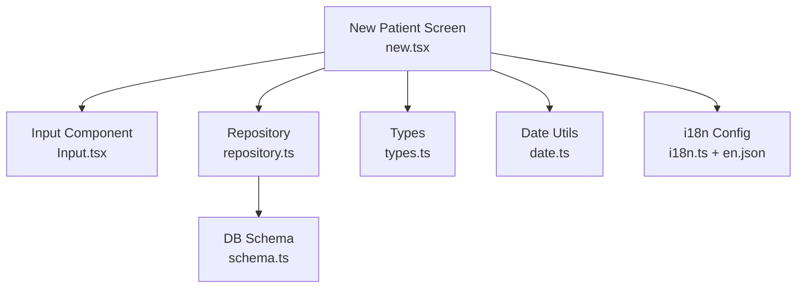
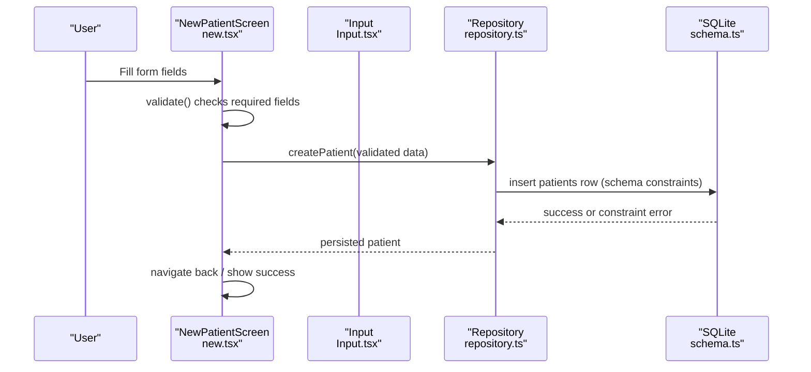
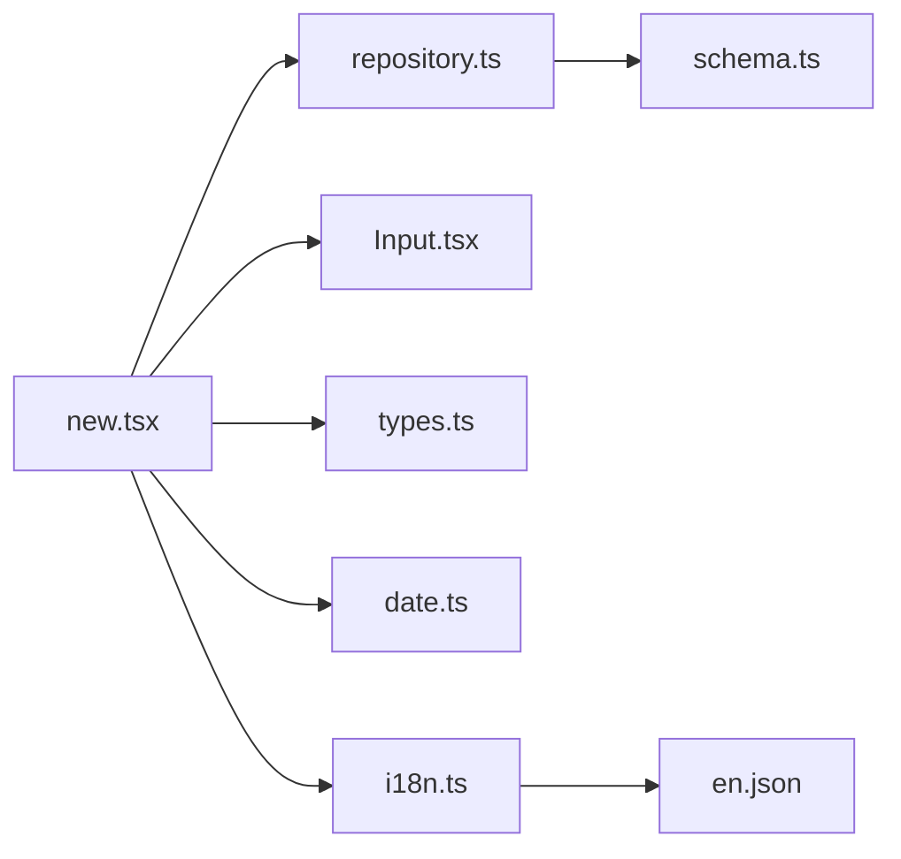

# Data Validation

<cite>
**Referenced Files in This Document**
- [validation.ts](file://src/features/patients/validation.ts)
- [types.ts](file://src/features/patients/types.ts)
- [new.tsx](file://src/app/(app)/patients/new.tsx)
- [Input.tsx](file://src/components/ui/Input.tsx)
- [date.ts](file://src/utils/date.ts)
- [repository.ts](file://src/features/patients/repository.ts)
- [schema.ts](file://src/db/schema.ts)
- [i18n.ts](file://src/lib/i18n.ts)
- [en.json](file://assets/locales/en.json)
</cite>

## Update Summary
**Changes Made**
- Updated Patient Form Schema section to document the enhanced gender field validation using Zod's refine method
- Enhanced validation rules summary to reflect improved error messaging for sex field selection
- Updated troubleshooting guide to include guidance on refined validation errors

## Table of Contents
1. Introduction
2. Project Structure
3. Core Components
4. Architecture Overview
5. Detailed Component Analysis
6. Dependency Analysis
7. Performance Considerations
8. Troubleshooting Guide
9. Conclusion
10. Appendices

## Introduction
This document explains how DermSight validates patient data across the registration flow, focusing on required fields, format validation, and business rules. It covers client-side validation for forms, server-side (local database) constraints, custom validators for healthcare-specific requirements, localization of error messages, and strategies to optimize performance and handle edge cases.

## Project Structure
Validation spans multiple layers:
- UI layer: form inputs and inline errors
- Feature layer: Zod schemas and type definitions
- Repository layer: local SQLite persistence with schema-level constraints
- Utilities: date calculations and formatting
- Internationalization: localized strings for labels and messages



**Diagram sources**
- [new.tsx:20-67](file://src/app/(app)/patients/new.tsx#L20-L67)
- [Input.tsx:24-89](file://src/components/ui/Input.tsx#L24-L89)
- [repository.ts:44-101](file://src/features/patients/repository.ts#L44-L101)
- [schema.ts:19-40](file://src/db/schema.ts#L19-L40)
- [date.ts:57-66](file://src/utils/date.ts#L57-L66)
- [i18n.ts:1-29](file://src/lib/i18n.ts#L1-L29)
- [en.json:66-97](file://assets/locales/en.json#L66-L97)

**Section sources**
- [new.tsx:20-67](file://src/app/(app)/patients/new.tsx#L20-L67)
- [Input.tsx:24-89](file://src/components/ui/Input.tsx#L24-L89)
- [repository.ts:44-101](file://src/features/patients/repository.ts#L44-L101)
- [schema.ts:19-40](file://src/db/schema.ts#L19-L40)
- [date.ts:57-66](file://src/utils/date.ts#L57-L66)
- [i18n.ts:1-29](file://src/lib/i18n.ts#L1-L29)
- [en.json:66-97](file://assets/locales/en.json#L66-L97)

## Core Components
- Form schema: A Zod-based schema defines required fields, formats, and allowed values for patient data with enhanced validation for gender selection
- Form screen: The new patient screen implements a simple client-side validator that checks required fields and displays inline errors
- Input component: Renders inputs with label, icon, focus state, and error display
- Repository: Persists validated data into a local SQLite database with schema-level constraints
- Date utilities: Provide age calculation and date formatting used elsewhere in the app
- i18n: Centralized internationalization setup; locale files contain labels and messages

Key responsibilities:
- Enforce presence of required fields before submission
- Validate date-of-birth format at the schema level
- Constrain sex to an allowed set with refined validation for better error messaging
- Persist only valid records via repository and schema constraints
- Display user-friendly, localized error messages

**Section sources**
- [validation.ts:7-20](file://src/features/patients/validation.ts#L7-L20)
- [new.tsx:34-42](file://src/app/(app)/patients/new.tsx#L34-L42)
- [Input.tsx:42-86](file://src/components/ui/Input.tsx#L42-L86)
- [repository.ts:44-101](file://src/features/patients/repository.ts#L44-L101)
- [schema.ts:19-40](file://src/db/schema.ts#L19-L40)
- [date.ts:57-66](file://src/utils/date.ts#L57-L66)
- [i18n.ts:12-26](file://src/lib/i18n.ts#L12-L26)
- [en.json:66-97](file://assets/locales/en.json#L66-L97)

## Architecture Overview
The validation architecture combines client-side checks with schema and database constraints to ensure data integrity.



**Diagram sources**
- [new.tsx:34-67](file://src/app/(app)/patients/new.tsx#L34-L67)
- [repository.ts:44-101](file://src/features/patients/repository.ts#L44-L101)
- [schema.ts:19-40](file://src/db/schema.ts#L19-L40)

## Detailed Component Analysis

### Patient Form Schema (Zod)
- Required fields: first name, last name, date of birth, sex
- Date of birth must match YYYY-MM-DD format
- Sex is restricted to a specific enum with enhanced validation using Zod's refine method for better error messaging
- Optional fields: phone, address, notes
- Provides a TypeScript type derived from the schema

**Updated** The sex field now uses `.refine(Boolean, { message: "Please select a gender" })` to provide more descriptive error messages when no gender is selected, improving user experience during form validation.

Notes:
- The schema centralizes validation rules and can be reused across screens or libraries
- Error messages are embedded in the schema and can be localized by mapping keys
- The refined validation ensures consistent error handling for empty or invalid gender selections

**Section sources**
- [validation.ts:7-20](file://src/features/patients/validation.ts#L7-L20)
- [types.ts:5-13](file://src/features/patients/types.ts#L5-L13)

### New Patient Screen Validation
- Implements a minimal client-side validator that ensures required fields are present
- Displays inline errors next to each field using the shared Input component
- On successful validation, calls the repository to persist the patient record
- Handles save errors with a user-facing alert

Behavior highlights:
- Trims whitespace for names before saving
- Converts empty optional fields to undefined before persistence
- Uses a loading state during save
- Validates gender selection with the refined error message

**Section sources**
- [new.tsx:34-67](file://src/app/(app)/patients/new.tsx#L34-L67)
- [new.tsx:93-186](file://src/app/(app)/patients/new.tsx#L93-L186)

### Input Component and Error Display
- Accepts label, placeholder, value, onChange, optional icon, and error message
- Highlights border color when focused or when an error exists
- Renders error text below the input for immediate feedback
- Supports different keyboard types and multiline modes

Integration points:
- Each form field passes its error string to the component
- Errors are produced by the screen's validator and mapped to fields
- Gender selection errors are displayed with the refined message

**Section sources**
- [Input.tsx:8-22](file://src/components/ui/Input.tsx#L8-L22)
- [Input.tsx:42-86](file://src/components/ui/Input.tsx#L42-L86)

### Repository and Database Constraints
- Repository creates a patient object and inserts it into SQLite
- Database schema enforces:
  - Not-null constraints for required fields
  - Enum constraints for sex and sync status
  - Foreign key reference to users
- On creation, the repository also enqueues a sync operation for later synchronization

Data integrity guarantees:
- Invalid data cannot be inserted due to schema constraints
- Sync queue tracks pending operations for reliability

**Section sources**
- [repository.ts:44-101](file://src/features/patients/repository.ts#L44-L101)
- [schema.ts:19-40](file://src/db/schema.ts#L19-L40)

### Date Utilities and Age Calculation
- Provides functions to format dates and calculate age from date of birth
- Age calculation accounts for month/day differences to compute accurate age
- Useful for displaying age in patient details or assessments

Usage considerations:
- Ensure date strings are valid ISO format before calling age calculation
- Handle invalid dates gracefully in UI if needed

**Section sources**
- [date.ts:57-66](file://src/utils/date.ts#L57-L66)

### Internationalization and Localization
- i18n is initialized with multiple locales and fallback language
- Locale files include labels and messages for patient-related UI
- Error messages in the schema are currently hardcoded; they can be localized by mapping keys to i18n resources

Localization strategy:
- Replace hardcoded messages with i18n keys
- Use dynamic interpolation for placeholders where needed
- The refined gender validation message can be integrated with i18n for multi-language support

**Section sources**
- [i18n.ts:12-26](file://src/lib/i18n.ts#L12-L26)
- [en.json:66-97](file://assets/locales/en.json#L66-L97)

## Dependency Analysis


**Diagram sources**
- [new.tsx:5-11](file://src/app/(app)/patients/new.tsx#L5-L11)
- [repository.ts:6-11](file://src/features/patients/repository.ts#L6-L11)
- [schema.ts:1-6](file://src/db/schema.ts#L1-L6)
- [i18n.ts:8-10](file://src/lib/i18n.ts#L8-L10)

**Section sources**
- [new.tsx:5-11](file://src/app/(app)/patients/new.tsx#L5-L11)
- [repository.ts:6-11](file://src/features/patients/repository.ts#L6-L11)
- [schema.ts:1-6](file://src/db/schema.ts#L1-L6)
- [i18n.ts:8-10](file://src/lib/i18n.ts#L8-L10)

## Performance Considerations
- Client-side validation runs synchronously and avoids unnecessary network calls
- Using a single schema file centralizes rules, reducing duplication and improving maintainability
- Debounce heavy computations if adding real-time validations (e.g., complex regexes)
- Keep error messages lightweight; avoid expensive computations in validators
- Prefer schema-level constraints to prevent invalid writes to the database
- The refined validation approach adds minimal overhead while providing better user feedback

## Troubleshooting Guide
Common issues and resolutions:
- Missing required fields: Ensure all required fields are filled; the screen validator will block submission and show inline errors
- Incorrect date format: The schema requires YYYY-MM-DD; adjust input handling or provide a date picker to enforce format
- **Enhanced** Invalid gender selection: The sex field now uses refined validation with the message "Please select a gender"; use the provided selector to avoid manual entry errors and ensure proper validation feedback
- Save failures: Check repository and database constraints; schema-level not-null and enum constraints will reject invalid data
- Localization gaps: If error messages appear untranslated, map schema messages to i18n keys and ensure the correct locale is active
- **New** Refined validation errors: When using Zod's refine method, ensure error messages are properly handled in the UI layer for consistent user experience

**Section sources**
- [new.tsx:34-42](file://src/app/(app)/patients/new.tsx#L34-L42)
- [validation.ts:7-20](file://src/features/patients/validation.ts#L7-L20)
- [schema.ts:19-40](file://src/db/schema.ts#L19-L40)
- [i18n.ts:12-26](file://src/lib/i18n.ts#L12-L26)

## Conclusion
DermSight employs a layered validation approach:
- Client-side checks for immediate user feedback
- A centralized Zod schema for consistent rules with enhanced gender validation
- Database constraints to guarantee data integrity
- Localized messages for accessibility and usability

To further improve:
- Integrate the Zod schema directly into the form library for unified validation
- Localize all error messages through i18n, including refined validation messages
- Add robust phone number and address validation patterns aligned with regional formats
- Implement real-time validation with debounced checks for better UX
- Expand refined validation techniques for other complex field validations

## Appendices

### Validation Rules Summary
- Required fields: first name, last name, date of birth, sex
- Date of birth format: YYYY-MM-DD
- Sex: restricted to male, female, other with refined validation for better error messaging
- Optional fields: phone, address, notes
- Database constraints: not-null for required fields, enums for sex and sync status, foreign key references

**Section sources**
- [validation.ts:7-20](file://src/features/patients/validation.ts#L7-L20)
- [schema.ts:19-40](file://src/db/schema.ts#L19-L40)

### Error Message Localization Strategy
- Map schema error messages to i18n keys
- Use locale files to store translated messages
- Update the form screen to render localized errors dynamically
- **Enhanced** Include refined validation messages in localization strategy for consistent multi-language support

**Section sources**
- [i18n.ts:12-26](file://src/lib/i18n.ts#L12-L26)
- [en.json:66-97](file://assets/locales/en.json#L66-L97)

### Zod Refine Method Implementation
The enhanced validation uses Zod's refine method to provide custom validation logic and error messages:

```typescript
sex: z.enum(["male", "female", "other"]).refine(Boolean, {
  message: "Please select a gender",
}),
```

This approach allows for:
- Custom validation logic beyond basic type checking
- Descriptive error messages for better user experience
- Consistent validation behavior across the application
- Easy integration with existing form validation patterns

**Section sources**
- [validation.ts:14-16](file://src/features/patients/validation.ts#L14-L16)