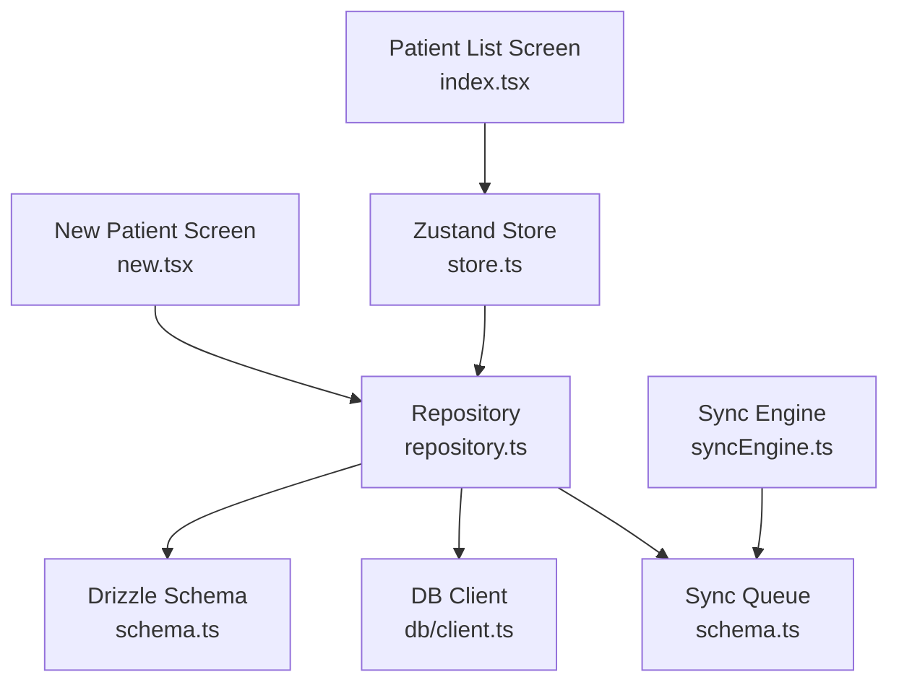
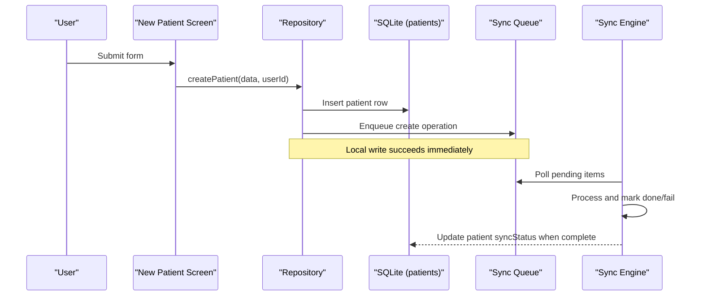
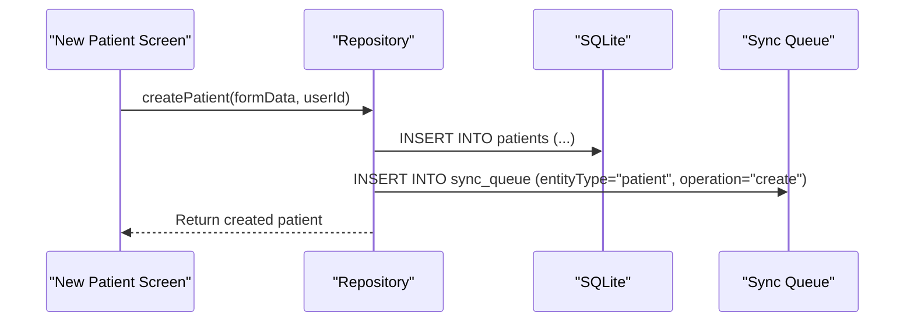
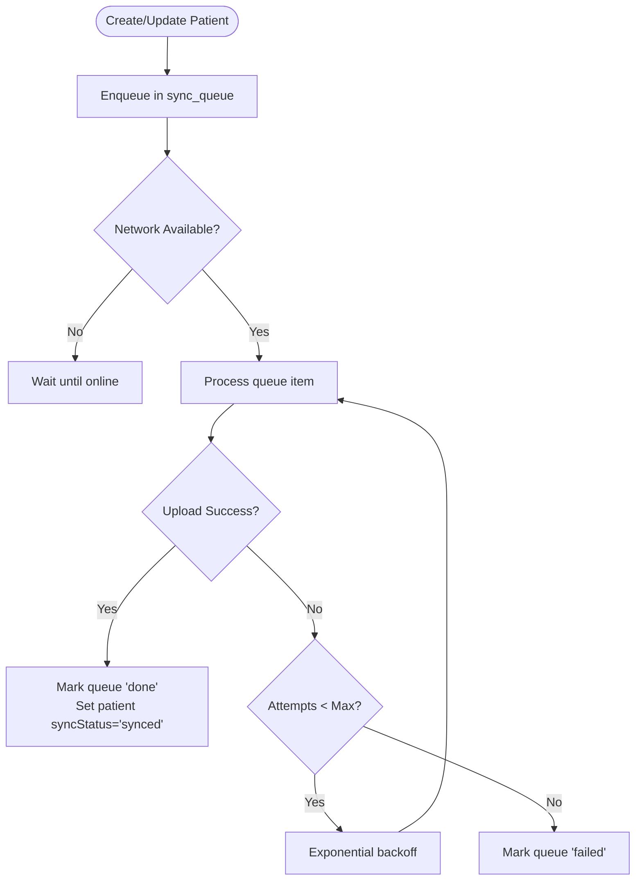
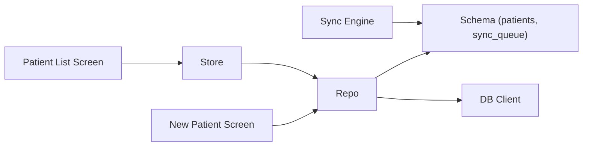

# Patient Data Model

<cite>
**Referenced Files in This Document**
- [types.ts](file://src/features/patients/types.ts)
- [validation.ts](file://src/features/patients/validation.ts)
- [schema.ts](file://src/db/schema.ts)
- [repository.ts](file://src/features/patients/repository.ts)
- [store.ts](file://src/features/patients/store.ts)
- [index.tsx](file://src/app/(app)/patients/index.tsx)
- [new.tsx](file://src/app/(app)/patients/new.tsx)
- [PatientListItem.tsx](file://src/components/patient/PatientListItem.tsx)
- [syncEngine.ts](file://src/features/sync/syncEngine.ts)
- [index.ts](file://src/types/index.ts)
</cite>

## Table of Contents
1. [Introduction](#introduction)
2. [Project Structure](#project-structure)
3. [Core Components](#core-components)
4. [Architecture Overview](#architecture-overview)
5. [Detailed Component Analysis](#detailed-component-analysis)
6. [Dependency Analysis](#dependency-analysis)
7. [Performance Considerations](#performance-considerations)
8. [Troubleshooting Guide](#troubleshooting-guide)
9. [Conclusion](#conclusion)
10. [Appendices](#appendices)

## Introduction
This document explains the patient data model in DermSight, focusing on:
- The PatientFormData interface and its required/optional fields
- The PatientListFilter type for filtering patient lists by sync status
- Database schema relationships between patients and related entities (assessments, users, sync queue)
- Field validation rules, data types, and constraints
- Examples of creating, updating, and deleting patient records
- How patient data is structured for offline storage and cloud synchronization

The system uses a local SQLite database as the single source of truth and synchronizes with a remote backend via an outbox pattern.

## Project Structure
Relevant modules for the patient data model:
- Feature layer: types, validation, repository, store
- UI layer: patient list screen, new patient form, list item component
- Data layer: Drizzle ORM schema and client
- Sync layer: background sync engine using an outbox table

**Diagram sources**
- [new.tsx:44-67](file://src/app/(app)/patients/new.tsx#L44-L67)
- [index.tsx:31-42](file://src/app/(app)/patients/index.tsx#L31-L42)
- [store.ts:33-66](file://src/features/patients/store.ts#L33-L66)
- [repository.ts:13-102](file://src/features/patients/repository.ts#L13-L102)
- [schema.ts:18-92](file://src/db/schema.ts#L18-L92)
- [syncEngine.ts:55-110](file://src/features/sync/syncEngine.ts#L55-L110)

**Section sources**
- [new.tsx:44-67](file://src/app/(app)/patients/new.tsx#L44-L67)
- [index.tsx:31-42](file://src/app/(app)/patients/index.tsx#L31-L42)
- [store.ts:33-66](file://src/features/patients/store.ts#L33-L66)
- [repository.ts:13-102](file://src/features/patients/repository.ts#L13-L102)
- [schema.ts:18-92](file://src/db/schema.ts#L18-L92)
- [syncEngine.ts:55-110](file://src/features/sync/syncEngine.ts#L55-L110)

## Core Components
- Patient data model:
  - PatientFormData: input model for creating patients
  - Patient: persisted entity stored locally and synced remotely
- Filtering:
  - PatientListFilter: filter options for patient lists
- Validation:
  - Zod schema enforcing required fields and formats
- Persistence:
  - Drizzle ORM tables for patients, assessments, users, and sync queue
- Operations:
  - Create, read, search, delete via repository
  - Background sync via outbox pattern

**Section sources**
- [types.ts:5-15](file://src/features/patients/types.ts#L5-L15)
- [index.ts:19-36](file://src/types/index.ts#L19-L36)
- [validation.ts:7-22](file://src/features/patients/validation.ts#L7-L22)
- [schema.ts:18-92](file://src/db/schema.ts#L18-L92)
- [repository.ts:13-106](file://src/features/patients/repository.ts#L13-L106)

## Architecture Overview
DermSight stores all patient data locally first and then synchronizes to the cloud asynchronously.

**Diagram sources**
- [new.tsx:44-67](file://src/app/(app)/patients/new.tsx#L44-L67)
- [repository.ts:44-102](file://src/features/patients/repository.ts#L44-L102)
- [schema.ts:18-92](file://src/db/schema.ts#L18-L92)
- [syncEngine.ts:55-110](file://src/features/sync/syncEngine.ts#L55-L110)

## Detailed Component Analysis

### PatientFormData Interface
- Purpose: Input model for patient registration forms
- Required fields:
  - firstName: string (required)
  - lastName: string (required)
  - dateOfBirth: string (required; validated format YYYY-MM-DD)
  - sex: enum "male" | "female" | "other" (required)
- Optional fields:
  - phone?: string
  - address?: string
  - notes?: string

Validation rules are enforced by a Zod schema that mirrors these requirements.

**Section sources**
- [types.ts:5-13](file://src/features/patients/types.ts#L5-L13)
- [validation.ts:7-22](file://src/features/patients/validation.ts#L7-L22)

### PatientListFilter Type
- Purpose: Filter options for displaying patient lists
- Values:
  - "all": show all patients
  - "synced": show only patients with syncStatus "synced"
  - "pending": show only patients with syncStatus "pending"

The patient list screen applies this filter to the loaded patient array.

**Section sources**
- [types.ts:15-15](file://src/features/patients/types.ts#L15-L15)
- [index.tsx:31-42](file://src/app/(app)/patients/index.tsx#L31-L42)

### Database Schema Relationships
- Patients table:
  - Primary key: id
  - Demographics: firstName, lastName, dateOfBirth, sex
  - Contact: phone, address, notes
  - Location: latitude, longitude
  - Metadata: capturedAt, createdBy (FK to users), createdAt, updatedAt
  - Sync: syncStatus (enum: pending|synced|failed), remoteId
- Assessments table:
  - Foreign key: patientId references patients.id
  - Contains image URIs, classification results, risk tier, confidence, timestamps, and sync metadata
- Users table:
  - Represents health workers who create or update records
- Sync queue:
  - Tracks operations (create/update) for patient and assessment entities
  - Statuses: pending, in_progress, failed, done

Relationships:
- One-to-many: users -> patients (createdBy)
- One-to-many: patients -> assessments (patientId)
- Outbox: sync_queue references both patient and assessment entities by entityId

**Section sources**
- [schema.ts:8-102](file://src/db/schema.ts#L8-L102)
- [index.ts:19-36](file://src/types/index.ts#L19-L36)

### Field Validation Rules, Data Types, and Constraints
- Form-level validation (Zod):
  - firstName, lastName: non-empty strings
  - dateOfBirth: non-empty string matching YYYY-MM-DD
  - sex: must be one of "male", "female", "other"
  - phone, address, notes: optional strings
- Database-level constraints (Drizzle schema):
  - Not null: firstName, lastName, dateOfBirth, sex, capturedAt, createdBy, createdAt, updatedAt, syncStatus
  - Enum constraints: sex (male|female|other), syncStatus (pending|synced|failed)
  - Nullable: phone, address, notes, latitude, longitude, remoteId
  - References: createdBy -> users.id; patientId in assessments -> patients.id

**Section sources**
- [validation.ts:7-22](file://src/features/patients/validation.ts#L7-L22)
- [schema.ts:18-40](file://src/db/schema.ts#L18-L40)
- [schema.ts:43-75](file://src/db/schema.ts#L43-L75)

### Example Operations

#### Create a Patient Record
- Flow:
  - User fills the new patient form
  - Form validates inputs
  - Repository creates a patient row in SQLite and sets initial syncStatus to "pending"
  - A sync queue entry is enqueued for later upload
  - UI updates the local list and navigates back

**Diagram sources**
- [new.tsx:44-67](file://src/app/(app)/patients/new.tsx#L44-L67)
- [repository.ts:44-102](file://src/features/patients/repository.ts#L44-L102)
- [schema.ts:18-92](file://src/db/schema.ts#L18-L92)

**Section sources**
- [new.tsx:44-67](file://src/app/(app)/patients/new.tsx#L44-L67)
- [repository.ts:44-102](file://src/features/patients/repository.ts#L44-L102)

#### Read and Search Patients
- Load all patients ordered by creation time
- Search by first name, last name, or ID using pattern matching
- Map rows to the shared Patient type

**Section sources**
- [repository.ts:13-42](file://src/features/patients/repository.ts#L13-L42)

#### Delete a Patient Record
- Delete by patient id from the patients table
- No explicit deletion enqueue is performed in the current implementation

**Section sources**
- [repository.ts:104-106](file://src/features/patients/repository.ts#L104-L106)

#### Update a Patient Record
- Current repository does not expose an update function
- To implement updates:
  - Add an updatePatient function similar to createPatient
  - Persist changes to the patients table
  - Enqueue a sync operation with operation "update"
  - Ensure sync engine marks the patient as "synced" upon success

[No sources needed since this section proposes future implementation]

### Offline Storage and Cloud Synchronization
- Offline-first:
  - All writes go to local SQLite immediately
  - UI never waits for network
- Outbox pattern:
  - Each create/update enqueues a sync_queue entry
  - Sync engine polls pending items and processes them when online
  - On success, queue item status becomes "done"; on failure, it retries with exponential backoff up to a maximum attempt count
- Patient sync status:
  - Initially "pending"
  - Updated to "synced" after successful sync
  - Set to "failed" if retries exhausted

**Diagram sources**
- [repository.ts:88-99](file://src/features/patients/repository.ts#L88-L99)
- [syncEngine.ts:55-110](file://src/features/sync/syncEngine.ts#L55-L110)
- [schema.ts:77-92](file://src/db/schema.ts#L77-L92)

**Section sources**
- [repository.ts:88-99](file://src/features/patients/repository.ts#L88-L99)
- [syncEngine.ts:55-110](file://src/features/sync/syncEngine.ts#L55-L110)
- [schema.ts:77-92](file://src/db/schema.ts#L77-L92)

## Dependency Analysis
Key dependencies and relationships:
- UI depends on store actions to load/search patients and manage filters
- Store depends on repository for data access
- Repository depends on Drizzle schema and DB client
- Repository enqueues sync operations into the sync queue
- Sync engine reads from sync queue and updates statuses

**Diagram sources**
- [index.tsx:31-42](file://src/app/(app)/patients/index.tsx#L31-L42)
- [store.ts:33-66](file://src/features/patients/store.ts#L33-L66)
- [repository.ts:13-102](file://src/features/patients/repository.ts#L13-L102)
- [schema.ts:18-92](file://src/db/schema.ts#L18-L92)
- [syncEngine.ts:55-110](file://src/features/sync/syncEngine.ts#L55-L110)

**Section sources**
- [index.tsx:31-42](file://src/app/(app)/patients/index.tsx#L31-L42)
- [store.ts:33-66](file://src/features/patients/store.ts#L33-L66)
- [repository.ts:13-102](file://src/features/patients/repository.ts#L13-L102)
- [schema.ts:18-92](file://src/db/schema.ts#L18-L92)
- [syncEngine.ts:55-110](file://src/features/sync/syncEngine.ts#L55-L110)

## Performance Considerations
- Local-first design ensures fast UI interactions without network latency
- Search uses SQL LIKE queries across multiple columns; consider indexing frequently searched fields if dataset grows large
- Sync engine batches processing of pending items; ensure background tasks run periodically
- Avoid blocking UI during sync; current design already defers sync to background

[No sources needed since this section provides general guidance]

## Troubleshooting Guide
Common issues and where to inspect:
- Validation errors:
  - Check Zod schema messages for required fields and date format
- Sync failures:
  - Inspect sync_queue status and attemptCount
  - Use retrySyncItem to reprocess failed entries
- Missing patient in list:
  - Verify repository queries and store state updates
- Displaying sync status:
  - Confirm PatientListItem renders syncStatus badge correctly

**Section sources**
- [validation.ts:7-22](file://src/features/patients/validation.ts#L7-L22)
- [syncEngine.ts:115-124](file://src/features/sync/syncEngine.ts#L115-L124)
- [PatientListItem.tsx:47-49](file://src/components/patient/PatientListItem.tsx#L47-L49)

## Conclusion
The DermSight patient data model is designed for reliability and usability:
- Clear separation between input models (PatientFormData) and persisted entities (Patient)
- Strong validation at both form and database layers
- Robust offline-first architecture with an outbox-based sync mechanism
- Straightforward filtering by sync status to focus on pending or completed records

This structure supports efficient patient management, accurate tracking of synchronization state, and a responsive user experience even in low-connectivity environments.

## Appendices

### Data Models Summary
- PatientFormData:
  - Required: firstName, lastName, dateOfBirth, sex
  - Optional: phone, address, notes
- Patient:
  - Includes demographics, contact, location, timestamps, creator, sync metadata
- Assessment:
  - Linked to patient; includes imaging and diagnostic results
- Sync Queue:
  - Tracks create/update operations for reliable eventual consistency

**Section sources**
- [types.ts:5-15](file://src/features/patients/types.ts#L5-L15)
- [index.ts:19-36](file://src/types/index.ts#L19-L36)
- [schema.ts:18-92](file://src/db/schema.ts#L18-L92)