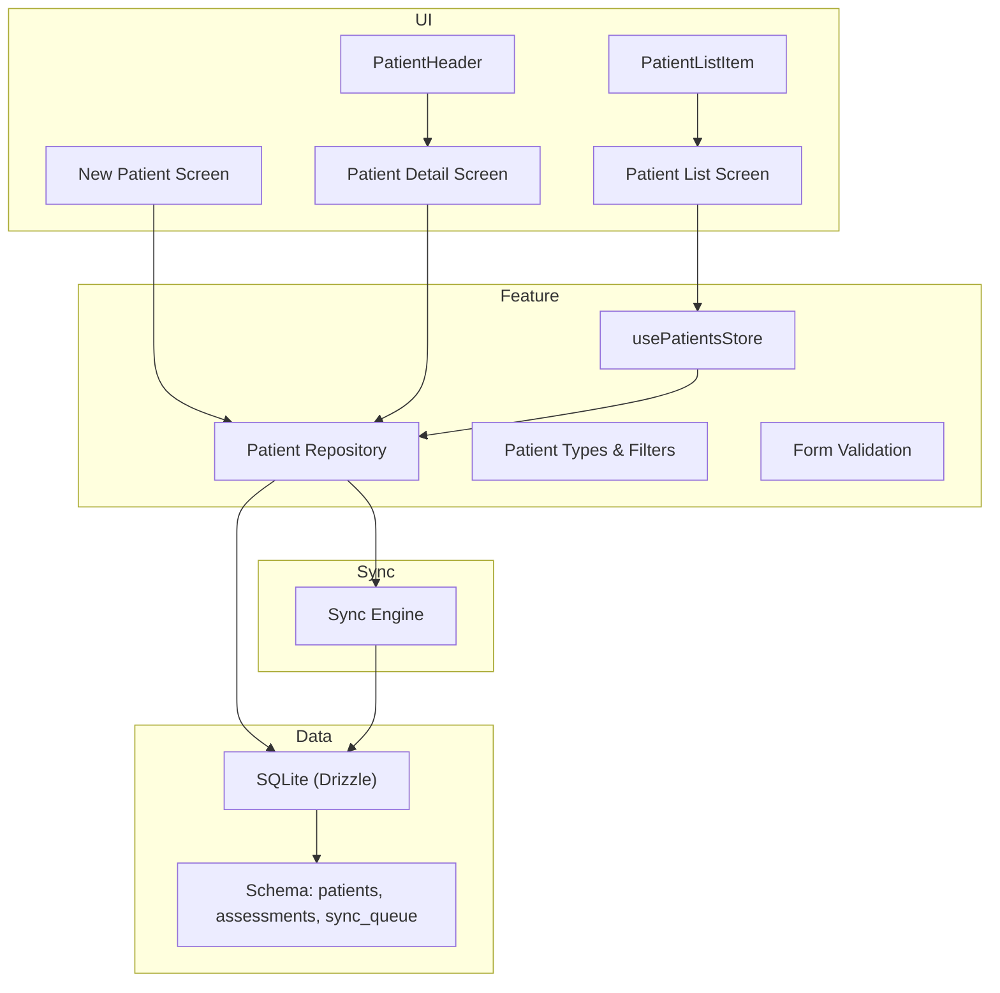
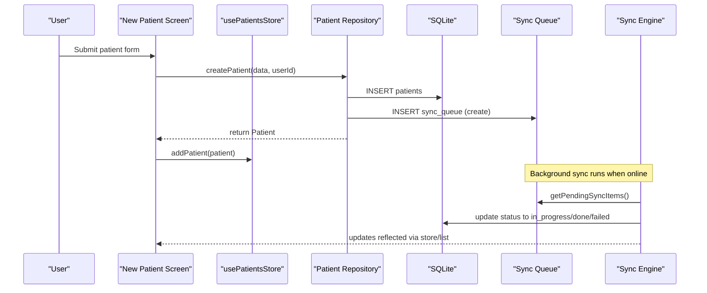
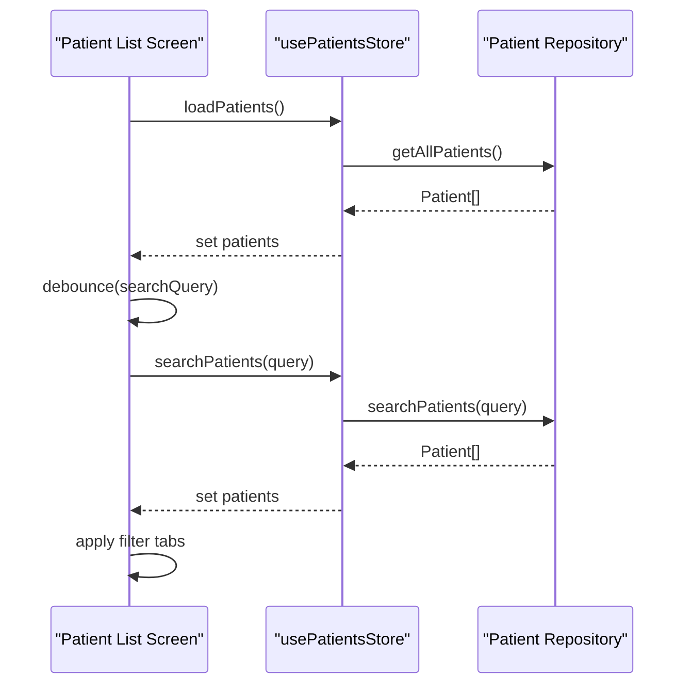
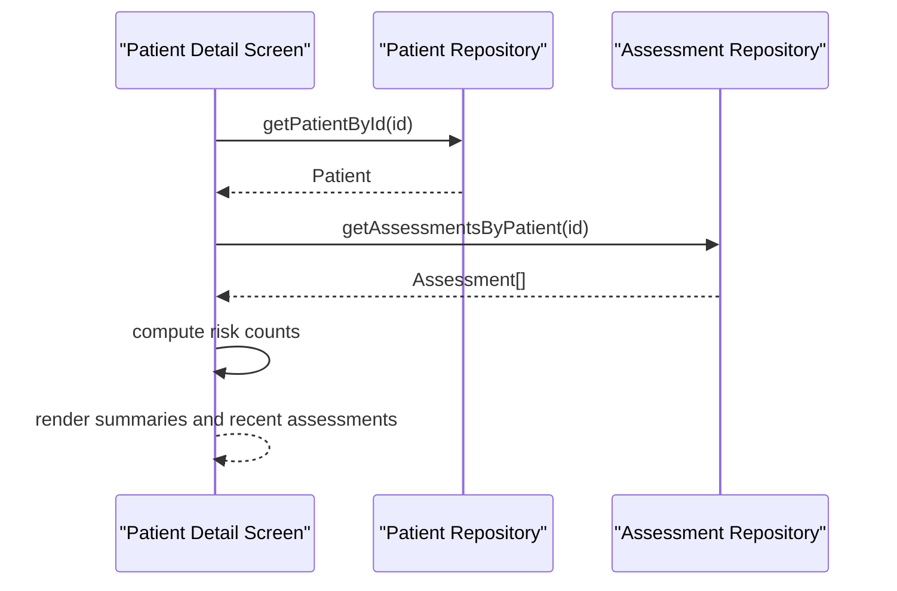
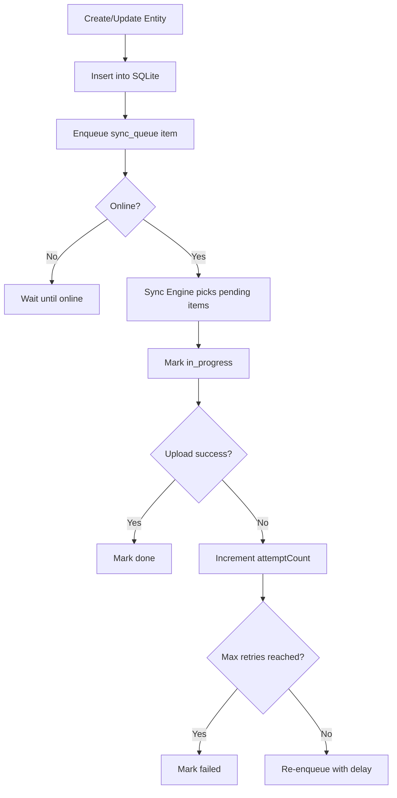
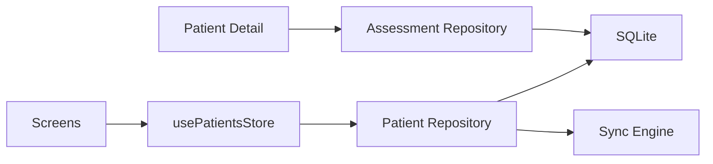

# Patient Management

<cite>
**Referenced Files in This Document**
- [types.ts](file://src/features/patients/types.ts)
- [repository.ts](file://src/features/patients/repository.ts)
- [store.ts](file://src/features/patients/store.ts)
- [validation.ts](file://src/features/patients/validation.ts)
- [PatientHeader.tsx](file://src/components/patient/PatientHeader.tsx)
- [PatientListItem.tsx](file://src/components/patient/PatientListItem.tsx)
- [schema.ts](file://src/db/schema.ts)
- [index.ts](file://src/types/index.ts)
- [new.tsx](file://src/app/(app)/patients/new.tsx)
- [index.tsx (patient list)](file://src/app/(app)/patients/index.tsx)
- [index.tsx (patient detail)](file://src/app/(app)/patients/[patientId]/index.tsx)
- [syncEngine.ts](file://src/features/sync/syncEngine.ts)
- [assessments repository.ts](file://src/features/assessments/repository.ts)
- [date.ts](file://src/utils/date.ts)
</cite>

## Table of Contents
1. Introduction
2. Project Structure
3. Core Components
4. Architecture Overview
5. Detailed Component Analysis
6. Dependency Analysis
7. Performance Considerations
8. Troubleshooting Guide
9. Conclusion
10. Appendices

## Introduction
This document explains the patient management module in DermSight, covering the complete lifecycle of patient records: creation, retrieval, search, filtering, and deletion. It details the data model for patients, including demographic fields, optional location tracking, and medical history relationships to assessments. It also documents validation rules, UI components for patient lists and headers, offline persistence via SQLite with an outbox sync pattern, conflict resolution strategies, and performance considerations for large datasets.

## Project Structure
The patient feature is organized into a layered structure:
- Feature layer: types, repository (SQLite CRUD), store (Zustand state), and validation schemas
- UI layer: screens for listing, creating, and viewing patient details; reusable components for header and list items
- Data layer: Drizzle ORM schema and client
- Sync layer: background sync engine using an outbox queue

**Diagram sources**
- [index.tsx (patient list):1-132](file://src/app/(app)/patients/index.tsx#L1-L132)
- [new.tsx:1-192](file://src/app/(app)/patients/new.tsx#L1-L192)
- [index.tsx (patient detail):1-211](file://src/app/(app)/patients/[patientId]/index.tsx#L1-L211)
- [store.ts:1-68](file://src/features/patients/store.ts#L1-L68)
- [repository.ts:1-128](file://src/features/patients/repository.ts#L1-L128)
- [schema.ts:1-102](file://src/db/schema.ts#L1-L102)
- [syncEngine.ts:1-145](file://src/features/sync/syncEngine.ts#L1-L145)

**Section sources**
- [index.tsx (patient list):1-132](file://src/app/(app)/patients/index.tsx#L1-L132)
- [new.tsx:1-192](file://src/app/(app)/patients/new.tsx#L1-L192)
- [index.tsx (patient detail):1-211](file://src/app/(app)/patients/[patientId]/index.tsx#L1-L211)
- [store.ts:1-68](file://src/features/patients/store.ts#L1-L68)
- [repository.ts:1-128](file://src/features/patients/repository.ts#L1-L128)
- [schema.ts:1-102](file://src/db/schema.ts#L1-L102)
- [syncEngine.ts:1-145](file://src/features/sync/syncEngine.ts#L1-L145)

## Core Components
- Patient data model: defined in shared types and enforced by the database schema
- Repository: local SQLite operations for patients and assessments, plus enqueueing sync tasks
- Store: Zustand-based state for loading, searching, filtering, and active patient selection
- Validation: Zod schema for form inputs ensuring required fields and formats
- UI: PatientHeader and PatientListItem for consistent presentation and interaction

Key responsibilities:
- Create: new patient registration screen validates input and persists locally, then enqueues sync
- Read: list screen loads all patients; detail screen loads a specific patient and their assessments
- Search: debounced text search across name and ID
- Filter: tabs to show all, synced, or pending-sync patients
- Delete: repository supports deletion by ID
- Relationship: assessments are linked to patients via patientId and displayed in the detail view

**Section sources**
- [index.ts (types):19-36](file://src/types/index.ts#L19-L36)
- [schema.ts:18-40](file://src/db/schema.ts#L18-L40)
- [repository.ts:13-106](file://src/features/patients/repository.ts#L13-L106)
- [store.ts:10-67](file://src/features/patients/store.ts#L10-L67)
- [validation.ts:7-20](file://src/features/patients/validation.ts#L7-L20)
- [PatientHeader.tsx:10-67](file://src/components/patient/PatientHeader.tsx#L10-L67)
- [PatientListItem.tsx:11-51](file://src/components/patient/PatientListItem.tsx#L11-L51)

## Architecture Overview
DermSight uses an offline-first architecture with SQLite as the single source of truth. All writes are persisted locally first and then queued for background synchronization to a remote backend using an outbox pattern. The UI never blocks on network calls.

**Diagram sources**
- [new.tsx:44-67](file://src/app/(app)/patients/new.tsx#L44-L67)
- [repository.ts:44-101](file://src/features/patients/repository.ts#L44-L101)
- [store.ts:64-66](file://src/features/patients/store.ts#L64-L66)
- [syncEngine.ts:55-110](file://src/features/sync/syncEngine.ts#L55-L110)

## Detailed Component Analysis

### Patient Data Model
- Demographics: first name, last name, date of birth, sex (male/female/other)
- Contact: phone, address (optional)
- Notes: free-text field (optional)
- Location: latitude, longitude (optional)
- Audit: capturedAt, createdBy, createdAt, updatedAt
- Sync metadata: syncStatus (pending/synced/failed), remoteId (optional)

Validation rules:
- Required: firstName, lastName, dateOfBirth (YYYY-MM-DD), sex
- Optional: phone, address, notes
- Enforced at UI level via Zod schema and inline validation in the new patient screen

Relationships:
- Assessments reference a patient via patientId
- Assessments include image URI, predicted class, probabilities, ABCD scores, risk tier, confidence score, model version, body location, capture time, creator, sync metadata

**Section sources**
- [index.ts (types):19-36](file://src/types/index.ts#L19-L36)
- [schema.ts:18-40](file://src/db/schema.ts#L18-L40)
- [validation.ts:7-20](file://src/features/patients/validation.ts#L7-L20)
- [index.ts (types):42-64](file://src/types/index.ts#L42-L64)
- [schema.ts:42-75](file://src/db/schema.ts#L42-L75)

### Patient Creation Flow
- User fills the new patient form with required fields
- Form validation checks presence and format
- On save, repository creates a patient record locally and enqueues a sync task
- Store adds the new patient to the list immediately for responsive UI
- Navigation returns to previous screen

**Diagram sources**
- [new.tsx:34-67](file://src/app/(app)/patients/new.tsx#L34-L67)
- [repository.ts:44-101](file://src/features/patients/repository.ts#L44-L101)

**Section sources**
- [new.tsx:34-67](file://src/app/(app)/patients/new.tsx#L34-L67)
- [repository.ts:44-101](file://src/features/patients/repository.ts#L44-L101)

### Patient Retrieval, Search, and Filtering
- Load all patients ordered by creation date
- Debounced search queries match first name, last name, or patient ID
- Filter tabs restrict results by sync status: all, synced, pending
- FlatList renders the filtered list efficiently

**Diagram sources**
- [index.tsx (patient list):16-36](file://src/app/(app)/patients/index.tsx#L16-L36)
- [store.ts:33-56](file://src/features/patients/store.ts#L33-L56)
- [repository.ts:13-37](file://src/features/patients/repository.ts#L13-L37)

**Section sources**
- [index.tsx (patient list):16-36](file://src/app/(app)/patients/index.tsx#L16-L36)
- [store.ts:33-56](file://src/features/patients/store.ts#L33-L56)
- [repository.ts:13-37](file://src/features/patients/repository.ts#L13-L37)

### Patient Deletion
- Delete by ID removes the patient from SQLite
- No explicit sync enqueue for delete is shown in the repository snippet; consider adding a delete operation to the outbox if server-side consistency is required

**Section sources**
- [repository.ts:104-106](file://src/features/patients/repository.ts#L104-L106)

### Patient Detail and Medical History
- Loads a specific patient by ID
- Retrieves assessments for that patient, ordered by creation date
- Displays summary counts (total, high risk, low risk)
- Shows recent assessments with links to full result view

**Diagram sources**
- [index.tsx (patient detail):15-26](file://src/app/(app)/patients/[patientId]/index.tsx#L15-L26)
- [assessments repository.ts:11-21](file://src/features/assessments/repository.ts#L11-L21)

**Section sources**
- [index.tsx (patient detail):15-26](file://src/app/(app)/patients/[patientId]/index.tsx#L15-L26)
- [assessments repository.ts:11-21](file://src/features/assessments/repository.ts#L11-L21)

### Patient Header Component
- Props: patient object
- Displays initials avatar, full name, active status indicator, short ID, gender, age, registration date
- Quick action buttons for call, message, and location (placeholder actions)

Customization options:
- Replace quick actions with navigation or deep links
- Adjust styling via className props or theme tokens
- Extend with additional metadata like location coordinates if available

**Section sources**
- [PatientHeader.tsx:10-67](file://src/components/patient/PatientHeader.tsx#L10-L67)

### Patient List Item Component
- Props: patient, optional lastAssessmentDate, onPress handler
- Renders avatar, name, short ID, gender, age, last assessment date (if provided), and sync status badge
- Supports navigation to patient detail

Optimization tips:
- Use stable keys (patient.id) for FlatList
- Avoid heavy computations inside renderItem; precompute derived values where possible

**Section sources**
- [PatientListItem.tsx:11-51](file://src/components/patient/PatientListItem.tsx#L11-L51)

### Offline Persistence and Sync
- Local SQLite is the source of truth; UI reads/writes directly to it
- Outbox pattern: every create/update enqueues a sync task with entity type, id, operation, payload, attempt count, and status
- Sync engine processes pending items when online, marking them in_progress, done, or failed with exponential backoff
- Retry mechanism allows manual retry of failed items

Conflict resolution strategy:
- Current implementation marks sync attempts and statuses; actual conflict handling logic is marked as TODO in the sync flow
- Recommended approach: implement server-side conflict detection and client-side merge policies based on timestamps or operational semantics

**Diagram sources**
- [repository.ts:88-99](file://src/features/patients/repository.ts#L88-L99)
- [syncEngine.ts:55-110](file://src/features/sync/syncEngine.ts#L55-L110)

**Section sources**
- [repository.ts:88-99](file://src/features/patients/repository.ts#L88-L99)
- [syncEngine.ts:55-110](file://src/features/sync/syncEngine.ts#L55-L110)

## Dependency Analysis
- UI depends on features store for state and repository for data access
- Repository depends on Drizzle ORM and schema definitions
- Store depends on repository and exposes actions for UI
- Sync engine depends on schema and network connectivity utilities
- Assessments repository provides related medical history for patients

**Diagram sources**
- [index.tsx (patient list):16-36](file://src/app/(app)/patients/index.tsx#L16-L36)
- [store.ts:10-67](file://src/features/patients/store.ts#L10-L67)
- [repository.ts:13-106](file://src/features/patients/repository.ts#L13-L106)
- [assessments repository.ts:11-21](file://src/features/assessments/repository.ts#L11-L21)
- [syncEngine.ts:55-110](file://src/features/sync/syncEngine.ts#L55-L110)

**Section sources**
- [index.tsx (patient list):16-36](file://src/app/(app)/patients/index.tsx#L16-L36)
- [store.ts:10-67](file://src/features/patients/store.ts#L10-L67)
- [repository.ts:13-106](file://src/features/patients/repository.ts#L13-L106)
- [assessments repository.ts:11-21](file://src/features/assessments/repository.ts#L11-L21)
- [syncEngine.ts:55-110](file://src/features/sync/syncEngine.ts#L55-L110)

## Performance Considerations
- Debounced search reduces query frequency during typing
- FlatList with stable keys optimizes rendering for large lists
- Ordering by creation date ensures predictable list behavior
- Offload sync to background; UI remains responsive
- Consider pagination or virtualization for very large patient sets
- Precompute derived values (age, labels) in list items to avoid repeated calculations

[No sources needed since this section provides general guidance]

## Troubleshooting Guide
Common issues and resolutions:
- Form validation errors: ensure required fields are filled and date format matches YYYY-MM-DD
- Search not returning results: verify search patterns and that data exists in SQLite
- Sync stuck in pending: check network connectivity and sync engine logs; retry failed items manually
- Missing assessments in detail view: confirm patientId linkage and that assessments were created and saved

Operational checks:
- Verify sync queue status transitions (pending → in_progress → done/failed)
- Confirm patient IDs and assessment IDs are unique and correctly referenced

**Section sources**
- [validation.ts:7-20](file://src/features/patients/validation.ts#L7-L20)
- [store.ts:33-56](file://src/features/patients/store.ts#L33-L56)
- [syncEngine.ts:55-110](file://src/features/sync/syncEngine.ts#L55-L110)

## Conclusion
The patient management module in DermSight provides a robust, offline-first workflow for managing patient records and associated assessments. It combines clear data models, strict validation, efficient UI components, and a reliable sync engine to ensure data integrity and responsiveness. For production readiness, implement server-side conflict resolution and expand delete/update operations in the outbox to maintain full consistency between local and remote states.

[No sources needed since this section summarizes without analyzing specific files]

## Appendices

### API Definitions (Local Operations)
- Create patient: accepts form data and user ID; returns persisted patient
- Get all patients: returns list ordered by creation date
- Search patients: returns matching patients by name or ID
- Get patient by ID: returns a single patient
- Delete patient: removes by ID

**Section sources**
- [repository.ts:13-106](file://src/features/patients/repository.ts#L13-L106)

### Data Models Summary
- Patient: demographics, contact, notes, optional location, audit fields, sync metadata
- Assessment: patient link, image references, ML outputs, ABCD scores, risk tier, capture metadata, sync metadata

**Section sources**
- [index.ts (types):19-64](file://src/types/index.ts#L19-L64)
- [schema.ts:18-75](file://src/db/schema.ts#L18-L75)