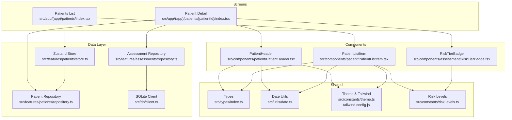
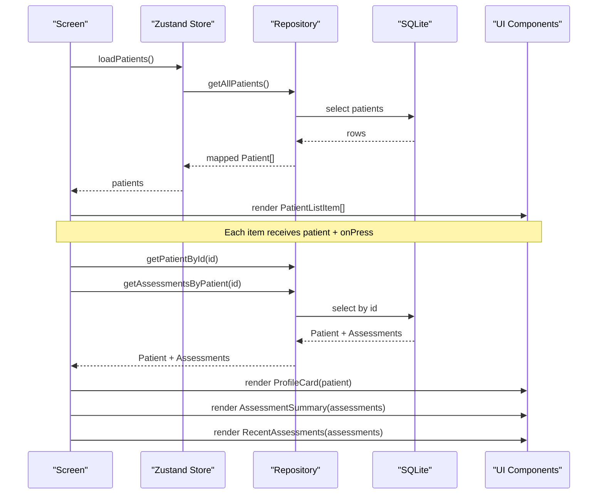
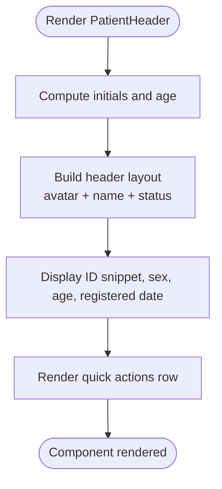
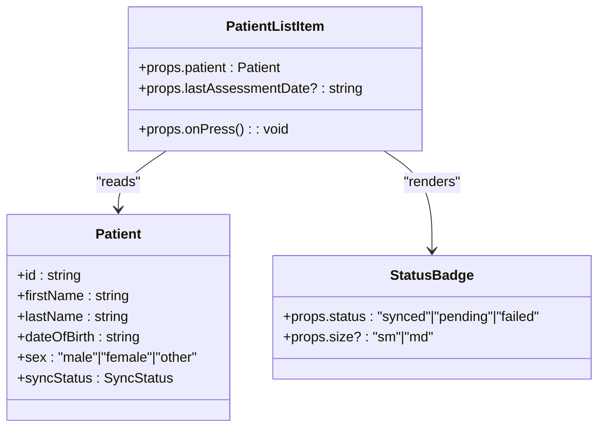
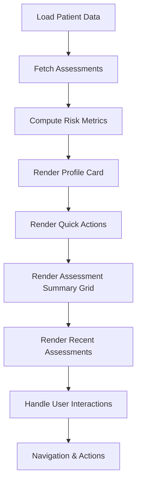
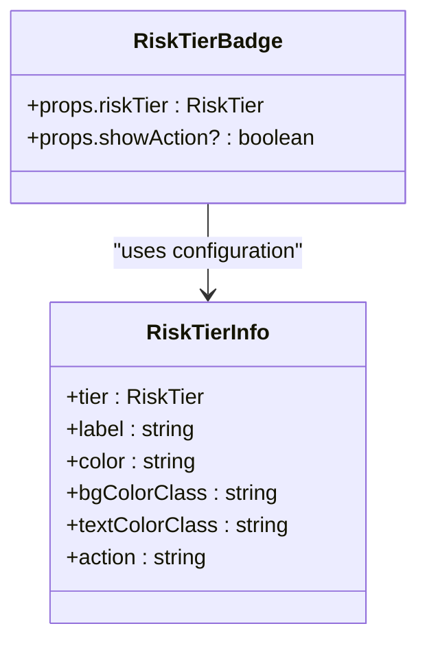
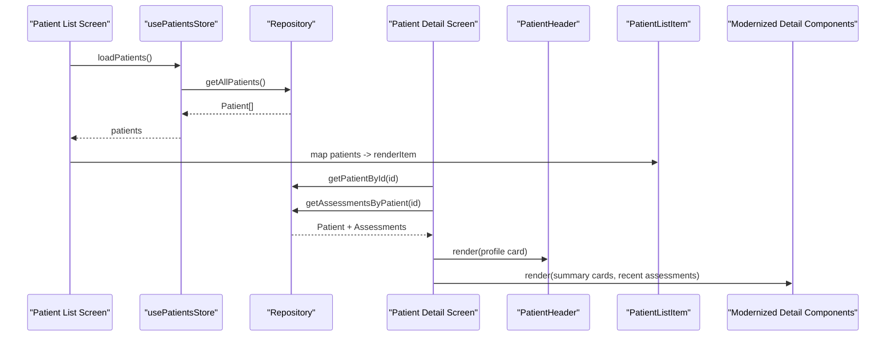
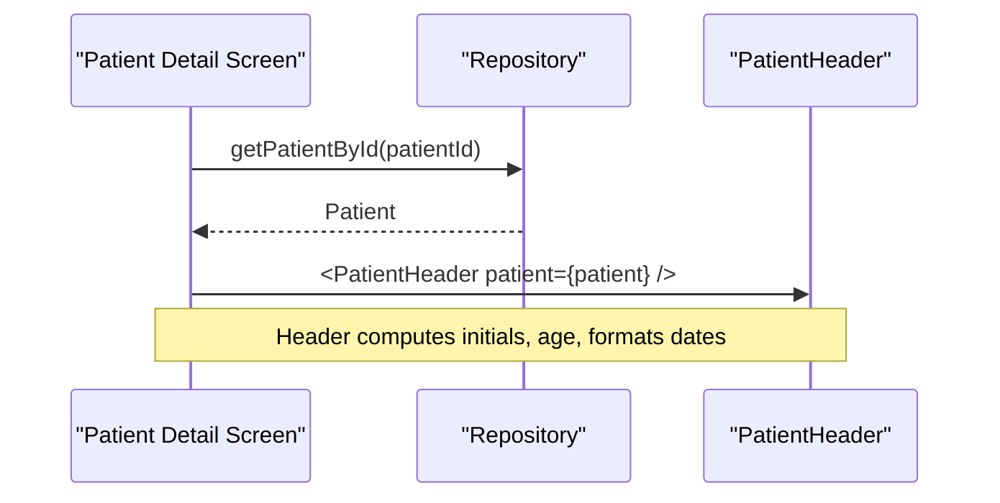
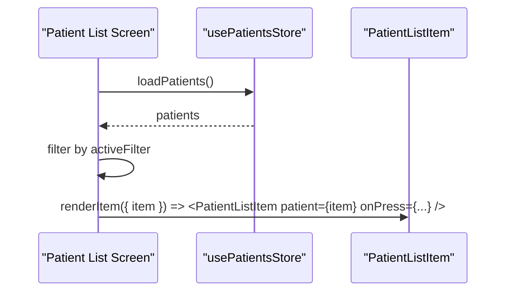
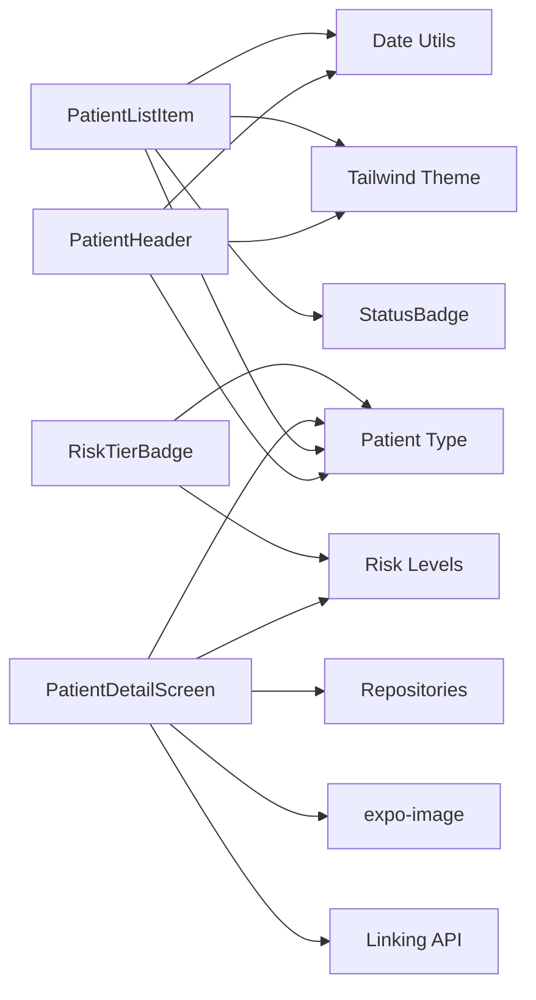

# UI Components

<cite>
**Referenced Files in This Document**
- [PatientHeader.tsx](file://src/components/patient/PatientHeader.tsx)
- [PatientListItem.tsx](file://src/components/patient/PatientListItem.tsx)
- [index.tsx (patient detail)](file://src/app/(app)/patients/[patientId]/index.tsx)
- [RiskTierBadge.tsx](file://src/components/assessment/RiskTierBadge.tsx)
- [repository.ts (assessments)](file://src/features/assessments/repository.ts)
- [riskLevels.ts](file://src/constants/riskLevels.ts)
- [index.ts (types)](file://src/types/index.ts)
- [date.ts](file://src/utils/date.ts)
- [theme.ts](file://src/constants/theme.ts)
- [tailwind.config.js](file://tailwind.config.js)
- [patients/index.tsx](file://src/app/(app)/patients/index.tsx)
- [patients/_layout.tsx](file://src/app/(app)/patients/_layout.tsx)
- [patients/[patientId]/_layout.tsx](file://src/app/(app)/patients/[patientId]/_layout.tsx)
- [repository.ts (patients)](file://src/features/patients/repository.ts)
- [store.ts](file://src/features/patients/store.ts)
</cite>

## Update Summary
**Changes Made**
- Updated PatientDetailScreen documentation to reflect modernized profile card system with avatar initials and status badges
- Added comprehensive coverage of quick action buttons for calling, messaging, and location via Linking.openURL()
- Documented new assessment summary grid layout with three color-coded summary cards (total assessments, high-risk findings, low-risk findings)
- Added documentation for recent assessments card-based layout with thumbnail previews
- Enhanced component composition patterns section to include new inline components
- Updated architecture diagrams to reflect the modernized patient detail screen structure

## Table of Contents
1. Introduction
2. Project Structure
3. Core Components
4. Architecture Overview
5. Detailed Component Analysis
6. Dependency Analysis
7. Performance Considerations
8. Troubleshooting Guide
9. Conclusion
10. Appendices

## Introduction
This document provides comprehensive documentation for patient-related UI components in DermSight, focusing on the PatientHeader, PatientListItem, and the modernized PatientDetailScreen. It covers their props, styling options, integration with patient data display, composition patterns, accessibility considerations, responsive design, theme customization, usage examples across screen layouts, performance optimizations for large lists, and guidelines for extending and customizing behavior.

## Project Structure
The patient UI is implemented as reusable React Native components under src/components/patient and consumed by screens in src/app/(app)/patients. The patient detail screen has been modernized with a new profile card system featuring avatar initials, status badges, and quick action buttons. Data flows from repositories into Zustand store state and then into screens that render the components.

**Diagram sources**
- [patients/index.tsx:1-132](file://src/app/(app)/patients/index.tsx#L1-L132)
- [patients/[patientId]/index.tsx:1-439](file://src/app/(app)/patients/[patientId]/index.tsx#L1-L439)
- [PatientHeader.tsx:1-71](file://src/components/patient/PatientHeader.tsx#L1-L71)
- [PatientListItem.tsx:1-57](file://src/components/patient/PatientListItem.tsx#L1-L57)
- [RiskTierBadge.tsx:1-40](file://src/components/assessment/RiskTierBadge.tsx#L1-L40)
- [repository.ts (assessments):1-161](file://src/features/assessments/repository.ts#L1-L161)
- [riskLevels.ts:1-131](file://src/constants/riskLevels.ts#L1-L131)
- [index.ts (types):1-98](file://src/types/index.ts#L1-L98)
- [date.ts:1-72](file://src/utils/date.ts#L1-L72)
- [theme.ts:1-74](file://src/constants/theme.ts#L1-L74)
- [tailwind.config.js:1-45](file://tailwind.config.js#L1-L45)

**Section sources**
- [patients/index.tsx:1-132](file://src/app/(app)/patients/index.tsx#L1-L132)
- [patients/[patientId]/index.tsx:1-439](file://src/app/(app)/patients/[patientId]/index.tsx#L1-L439)
- [PatientHeader.tsx:1-71](file://src/components/patient/PatientHeader.tsx#L1-L71)
- [PatientListItem.tsx:1-57](file://src/components/patient/PatientListItem.tsx#L1-L57)
- [RiskTierBadge.tsx:1-40](file://src/components/assessment/RiskTierBadge.tsx#L1-L40)
- [repository.ts (assessments):1-161](file://src/features/assessments/repository.ts#L1-L161)
- [riskLevels.ts:1-131](file://src/constants/riskLevels.ts#L1-L131)
- [index.ts (types):1-98](file://src/types/index.ts#L1-L98)
- [date.ts:1-72](file://src/utils/date.ts#L1-L72)
- [theme.ts:1-74](file://src/constants/theme.ts#L1-L74)
- [tailwind.config.js:1-45](file://tailwind.config.js#L1-L45)

## Core Components
- **PatientHeader**: Displays a patient's avatar initials, name, status indicator, ID snippet, sex, age, registration date, and quick action buttons. Uses shared date utilities and theme colors.
- **PatientListItem**: Renders a single row with avatar initials, name, ID snippet, sex, age, optional last assessment date, and a sync status badge.
- **PatientDetailScreen**: Modernized profile view with avatar initials, status badges, quick action buttons for calling/messaging/location, assessment summary grid, and recent assessments with thumbnail previews.
- **RiskTierBadge**: Displays risk level indicators with color-coded backgrounds and text based on clinical risk tiers.

Key shared dependencies:
- Types: Patient and Assessment interfaces define all fields used by components.
- Date utilities: calculateAge and formatDate are used to compute and present age and dates.
- Theme: Tailwind classes reference primary, navy, and surface tokens defined in tailwind.config.js and theme constants.
- Risk levels: RISK_TIER_CONFIG provides consistent styling and labeling for clinical risk tiers.

**Section sources**
- [PatientHeader.tsx:7-52](file://src/components/patient/PatientHeader.tsx#L7-L52)
- [PatientListItem.tsx:7-56](file://src/components/patient/PatientListItem.tsx#L7-L56)
- [index.tsx (patient detail):25-338](file://src/app/(app)/patients/[patientId]/index.tsx#L25-L338)
- [RiskTierBadge.tsx:6-39](file://src/components/assessment/RiskTierBadge.tsx#L6-L39)
- [index.ts (types):19-64](file://src/types/index.ts#L19-L64)
- [date.ts:20-26](file://src/utils/date.ts#L20-L26)
- [date.ts:57-66](file://src/utils/date.ts#L57-L66)
- [riskLevels.ts:21-59](file://src/constants/riskLevels.ts#L21-L59)
- [tailwind.config.js:7-37](file://tailwind.config.js#L7-L37)

## Architecture Overview
The patient screens consume data via repositories and Zustand store. The list screen renders PatientListItem rows inside a FlatList. The detail screen uses a modernized profile card system with integrated assessment summaries and recent assessments display. All components are pure presentational layers that rely on props and shared utilities.

**Diagram sources**
- [patients/index.tsx:16-29](file://src/app/(app)/patients/index.tsx#L16-L29)
- [store.ts:26-67](file://src/features/patients/store.ts#L26-L67)
- [repository.ts (patients):13-42](file://src/features/patients/repository.ts#L13-L42)
- [repository.ts (assessments):12-22](file://src/features/assessments/repository.ts#L12-L22)
- [index.tsx (patient detail):37-42](file://src/app/(app)/patients/[patientId]/index.tsx#L37-L42)

## Detailed Component Analysis

### PatientHeader
- Purpose: Top section of the patient detail screen showing identity, demographics, and quick actions.
- Props:
  - patient: Patient object containing firstName, lastName, dateOfBirth, sex, id, createdAt, and other metadata.
- Styling:
  - Uses Tailwind classes for layout, spacing, typography, and color tokens (primary, navy, gray).
  - Avatar background uses primary-50; text uses primary and navy tokens.
- Data presentation:
  - Computes initials from first and last names.
  - Calculates age using date utility.
  - Displays formatted registration date and short ID snippet.
  - Shows an "Active" indicator with green dot.
- Integration:
  - Consumed by the patient detail screen to render the header above additional sections.
- Accessibility:
  - Text elements provide readable content; consider adding accessible labels for quick actions if they trigger navigation or actions.
- Responsiveness:
  - Flexbox-based layout adapts to screen width; avatar and info stack horizontally with flex-row.
- Extensibility:
  - QuickAction is a small internal component; can be extended to accept icon, label, and onPress to wire real actions.

**Diagram sources**
- [PatientHeader.tsx:11-52](file://src/components/patient/PatientHeader.tsx#L11-L52)
- [date.ts:20-26](file://src/utils/date.ts#L20-L26)
- [date.ts:57-66](file://src/utils/date.ts#L57-L66)

**Section sources**
- [PatientHeader.tsx:7-71](file://src/components/patient/PatientHeader.tsx#L7-L71)
- [index.tsx (patient detail):107-196](file://src/app/(app)/patients/[patientId]/index.tsx#L107-L196)
- [date.ts:20-26](file://src/utils/date.ts#L20-L26)
- [date.ts:57-66](file://src/utils/date.ts#L57-L66)
- [tailwind.config.js:7-37](file://tailwind.config.js#L7-L37)

### PatientListItem
- Purpose: Individual row in the patient list displaying key patient information and sync status.
- Props:
  - patient: Patient object.
  - lastAssessmentDate?: Optional string to show last assessment date.
  - onPress: Callback invoked when the row is pressed.
- Styling:
  - Pressable container with white background and subtle border.
  - Avatar uses primary-50 background and primary text.
  - StatusBadge shows sync status with color-coded backgrounds and text.
- Touch interactions:
  - Entire row is pressable; navigation handled by the parent screen.
- Visual presentation:
  - Shows initials, full name, ID snippet, sex, age, optional last assessment date, and sync status badge.
- Integration:
  - Rendered by the patient list screen within a FlatList.
- Accessibility:
  - Row is interactive; ensure focus and announcements are appropriate for screen readers.
- Responsiveness:
  - Horizontal layout with flexible space allocation; scales well on different widths.

**Diagram sources**
- [PatientListItem.tsx:7-56](file://src/components/patient/PatientListItem.tsx#L7-L56)
- [index.ts (types):19-36](file://src/types/index.ts#L19-L36)

**Section sources**
- [PatientListItem.tsx:7-56](file://src/components/patient/PatientListItem.tsx#L7-L56)
- [patients/index.tsx:109-119](file://src/app/(app)/patients/index.tsx#L109-L119)
- [index.ts (types):19-36](file://src/types/index.ts#L19-L36)

### Modernized PatientDetailScreen
- Purpose: Comprehensive patient profile view with modernized interface including profile card, assessment summary, and recent assessments.
- Key Features:
  - **Profile Card System**: Displays patient avatar initials, name, active status badge, demographic information, and registration details
  - **Quick Action Buttons**: Integrated calling, messaging, and location functionality via Linking.openURL()
  - **Assessment Summary Grid**: Three-card layout showing total assessments, high-risk findings, and low-risk findings with distinct color coding
  - **Recent Assessments**: Card-based layout with thumbnail previews, risk tier badges, and navigation to detailed results
- Technical Implementation:
  - Uses expo-image for proper SVG/PNG rendering with tintColor support
  - Integrates Haptics for tactile feedback on user interactions
  - Implements responsive design with dark mode support
  - Utilizes TypeScript interfaces for type safety
- Data Flow:
  - Fetches patient data and assessments via repositories
  - Computes risk metrics (high-risk vs low-risk counts)
  - Handles navigation to edit, capture, and result screens
- Styling:
  - Consistent use of Tailwind classes for theming
  - Color-coded risk indicators (amber for high-risk, blue for low-risk)
  - Responsive layout that adapts to different screen sizes

**Diagram sources**
- [index.tsx (patient detail):37-42](file://src/app/(app)/patients/[patientId]/index.tsx#L37-L42)
- [index.tsx (patient detail):62-65](file://src/app/(app)/patients/[patientId]/index.tsx#L62-L65)
- [index.tsx (patient detail):130-196](file://src/app/(app)/patients/[patientId]/index.tsx#L130-L196)
- [index.tsx (patient detail):236-270](file://src/app/(app)/patients/[patientId]/index.tsx#L236-L270)
- [index.tsx (patient detail):272-334](file://src/app/(app)/patients/[patientId]/index.tsx#L272-L334)

**Section sources**
- [index.tsx (patient detail):25-338](file://src/app/(app)/patients/[patientId]/index.tsx#L25-L338)
- [repository.ts (assessments):12-22](file://src/features/assessments/repository.ts#L12-L22)
- [riskLevels.ts:21-59](file://src/constants/riskLevels.ts#L21-L59)

### RiskTierBadge
- Purpose: Displays clinical risk level indicators with appropriate color coding and styling.
- Props:
  - riskTier: RiskTier value ("low" | "medium" | "high" | "urgent_referral")
  - showAction?: Optional boolean to display action guidance text
- Styling:
  - Uses RISK_TIER_CONFIG for consistent color schemes and styling
  - Dynamic dot colors based on risk severity
  - Dark mode support with appropriate color adjustments
- Integration:
  - Used throughout the application for consistent risk level visualization
  - Consumed by assessment displays and summary views

**Diagram sources**
- [RiskTierBadge.tsx:6-39](file://src/components/assessment/RiskTierBadge.tsx#L6-L39)
- [riskLevels.ts:11-19](file://src/constants/riskLevels.ts#L11-L19)

**Section sources**
- [RiskTierBadge.tsx:6-39](file://src/components/assessment/RiskTierBadge.tsx#L6-L39)
- [riskLevels.ts:21-59](file://src/constants/riskLevels.ts#L21-L59)

### Component Composition Patterns and Reusability
- Composition:
  - PatientHeader composes smaller visual blocks (avatar, name block, meta lines, quick actions).
  - PatientListItem composes avatar, info block, and StatusBadge.
  - PatientDetailScreen composes multiple sections: profile card, quick actions, assessment summary, and recent assessments.
  - Inline components like SectionHeader, Card, QuickAction, InfoRow, and SummaryCard provide modular building blocks.
- Reusability:
  - Both components are pure presentational functions taking typed props, enabling reuse across screens without business logic coupling.
  - Shared utilities (date formatting, types) and theme tokens promote consistency.
  - RiskTierBadge provides consistent risk level visualization across the application.
- Extensibility:
  - Add new props to components to support optional features (e.g., extra metadata, variant styles).
  - Encapsulate complex behaviors in small internal components for clarity.
  - Use TypeScript interfaces to enforce prop contracts and improve developer experience.

**Section sources**
- [PatientHeader.tsx:11-52](file://src/components/patient/PatientHeader.tsx#L11-L52)
- [PatientListItem.tsx:13-56](file://src/components/patient/PatientListItem.tsx#L13-L56)
- [index.tsx (patient detail):340-438](file://src/app/(app)/patients/[patientId]/index.tsx#L340-L438)
- [RiskTierBadge.tsx:6-39](file://src/components/assessment/RiskTierBadge.tsx#L6-L39)
- [date.ts:20-26](file://src/utils/date.ts#L20-L26)
- [date.ts:57-66](file://src/utils/date.ts#L57-L66)
- [tailwind.config.js:7-37](file://tailwind.config.js#L7-L37)

## Architecture Overview
The screens orchestrate data fetching and rendering:
- Patient List screen loads patients via store, filters them locally, and renders PatientListItem rows.
- Patient Detail screen fetches specific patient and assessments, then renders the modernized profile card system with assessment summaries and recent assessments.
- All components follow a clear separation of concerns with data fetching handled at the screen level and presentation handled by reusable components.

**Diagram sources**
- [patients/index.tsx:16-29](file://src/app/(app)/patients/index.tsx#L16-L29)
- [store.ts:26-67](file://src/features/patients/store.ts#L26-L67)
- [repository.ts (patients):13-42](file://src/features/patients/repository.ts#L13-L42)
- [repository.ts (assessments):12-22](file://src/features/assessments/repository.ts#L12-L22)
- [index.tsx (patient detail):37-42](file://src/app/(app)/patients/[patientId]/index.tsx#L37-L42)
- [PatientHeader.tsx:11-52](file://src/components/patient/PatientHeader.tsx#L11-L52)
- [PatientListItem.tsx:13-56](file://src/components/patient/PatientListItem.tsx#L13-L56)

## Detailed Component Analysis

### PatientHeader Usage in Detail Screen
- The detail screen imports and renders PatientHeader after loading patient data.
- It also displays additional sections like patient information and assessment summaries.

**Diagram sources**
- [index.tsx (patient detail):37-42](file://src/app/(app)/patients/[patientId]/index.tsx#L37-L42)
- [index.tsx (patient detail):107-196](file://src/app/(app)/patients/[patientId]/index.tsx#L107-L196)
- [PatientHeader.tsx:11-52](file://src/components/patient/PatientHeader.tsx#L11-L52)

**Section sources**
- [index.tsx (patient detail):37-196](file://src/app/(app)/patients/[patientId]/index.tsx#L37-L196)
- [PatientHeader.tsx:11-52](file://src/components/patient/PatientHeader.tsx#L11-L52)

### PatientListItem Usage in List Screen
- The list screen maps filtered patients to PatientListItem rows inside a FlatList.
- Navigation to patient detail is handled via router.push with the patient id.

**Diagram sources**
- [patients/index.tsx:16-36](file://src/app/(app)/patients/index.tsx#L16-L36)
- [patients/index.tsx:109-119](file://src/app/(app)/patients/index.tsx#L109-L119)
- [PatientListItem.tsx:13-56](file://src/components/patient/PatientListItem.tsx#L13-L56)

**Section sources**
- [patients/index.tsx:16-119](file://src/app/(app)/patients/index.tsx#L16-L119)
- [PatientListItem.tsx:13-56](file://src/components/patient/PatientListItem.tsx#L13-L56)

## Dependency Analysis
- PatientHeader depends on:
  - Patient type for props.
  - Date utilities for age and formatted dates.
  - Tailwind theme tokens for colors and typography.
- PatientListItem depends on:
  - Patient type for props.
  - StatusBadge for sync status visualization.
  - Date utilities for age and optional last assessment date.
  - Tailwind theme tokens for consistent styling.
- PatientDetailScreen depends on:
  - Patient and Assessment types for data handling.
  - Repositories for data fetching.
  - Risk level configurations for consistent styling.
  - expo-image for proper image rendering.
  - Linking API for external app integration.
- RiskTierBadge depends on:
  - RiskTier type and RISK_TIER_CONFIG for consistent styling.

**Diagram sources**
- [PatientHeader.tsx:1-5](file://src/components/patient/PatientHeader.tsx#L1-L5)
- [PatientListItem.tsx:1-5](file://src/components/patient/PatientListItem.tsx#L1-L5)
- [index.tsx (patient detail):1-19](file://src/app/(app)/patients/[patientId]/index.tsx#L1-L19)
- [RiskTierBadge.tsx:1-4](file://src/components/assessment/RiskTierBadge.tsx#L1-L4)
- [index.ts (types):19-64](file://src/types/index.ts#L19-L64)
- [date.ts:20-26](file://src/utils/date.ts#L20-L26)
- [date.ts:57-66](file://src/utils/date.ts#L57-L66)
- [riskLevels.ts:21-59](file://src/constants/riskLevels.ts#L21-L59)
- [tailwind.config.js:7-37](file://tailwind.config.js#L7-L37)

**Section sources**
- [PatientHeader.tsx:1-5](file://src/components/patient/PatientHeader.tsx#L1-L5)
- [PatientListItem.tsx:1-5](file://src/components/patient/PatientListItem.tsx#L1-L5)
- [index.tsx (patient detail):1-19](file://src/app/(app)/patients/[patientId]/index.tsx#L1-L19)
- [RiskTierBadge.tsx:1-4](file://src/components/assessment/RiskTierBadge.tsx#L1-L4)
- [index.ts (types):19-64](file://src/types/index.ts#L19-L64)
- [date.ts:20-26](file://src/utils/date.ts#L20-L26)
- [date.ts:57-66](file://src/utils/date.ts#L57-L66)
- [riskLevels.ts:21-59](file://src/constants/riskLevels.ts#L21-L59)
- [tailwind.config.js:7-37](file://tailwind.config.js#L7-L37)

## Performance Considerations
- Virtualization:
  - The patient list uses FlatList, which virtualizes items for efficient rendering of large datasets. Ensure keyExtractor uses stable unique keys (patient.id).
- Debounced search:
  - Search input is debounced to reduce frequent store updates and repository calls.
- Filtering:
  - Local filtering by sync status is applied in-memory; for very large lists, consider server-side filtering or pagination.
- Lazy loading:
  - For heavy detail views, consider lazy-loading assessments or images only when needed.
- Memoization:
  - If components receive expensive computations, wrap with React.memo and useMemo for derived values like initials and age.
- Batch updates:
  - Keep store actions minimal and batched to avoid excessive re-renders.
- Image optimization:
  - Use expo-image for efficient SVG rendering with proper caching and memory management.
  - Consistent icon sizing reduces layout shifts and improves performance.
- Assessment summary computation:
  - Risk metrics are computed once per render cycle to avoid redundant calculations.

## Troubleshooting Guide
- Missing patient data:
  - Verify repository returns mapped Patient objects and that screens handle null cases gracefully.
- Incorrect age or date display:
  - Check date parsing and formatting utilities; ensure ISO strings are passed.
- Status badge not updating:
  - Confirm syncStatus field exists on Patient and is updated in store/repository operations.
- Navigation issues:
  - Ensure router paths match route definitions in layout files.
- Icon rendering problems:
  - Verify expo-image is properly configured and assets are correctly referenced.
  - Check tintColor values match brand colors in theme configuration.
- Quick action button failures:
  - Ensure Linking API is available and permissions are granted for phone/sms/maps functionality.
  - Handle cases where patient phone or location data is missing.
- Assessment summary calculation errors:
  - Verify risk tier classification logic and ensure assessments array is properly populated.
  - Check that risk tier mapping is consistent between assessment creation and display.

**Section sources**
- [repository.ts (patients):108-127](file://src/features/patients/repository.ts#L108-L127)
- [repository.ts (assessments):136-160](file://src/features/assessments/repository.ts#L136-L160)
- [date.ts:20-26](file://src/utils/date.ts#L20-L26)
- [date.ts:57-66](file://src/utils/date.ts#L57-L66)
- [patients/_layout.tsx:7-14](file://src/app/(app)/patients/_layout.tsx#L7-L14)
- [patients/[patientId]/_layout.tsx:7-16](file://src/app/(app)/patients/[patientId]/_layout.tsx#L7-L16)
- [index.tsx (patient detail):166-194](file://src/app/(app)/patients/[patientId]/index.tsx#L166-L194)
- [index.tsx (patient detail):62-65](file://src/app/(app)/patients/[patientId]/index.tsx#L62-L65)

## Conclusion
PatientHeader, PatientListItem, and the modernized PatientDetailScreen are focused, reusable UI components that integrate cleanly with DermSight's data layer and theme system. The recent updates introduce a sophisticated profile card system with avatar initials, status badges, and integrated quick actions for calling, messaging, and location services. The assessment summary grid provides clear visual indicators of risk levels, while the recent assessments section offers thumbnail previews and easy navigation. These components follow clear composition patterns, leverage shared utilities, and support responsive layouts. With FlatList virtualization, debounced search, and modern image handling via expo-image, the patient interface performs well for moderate datasets. For larger datasets, consider pagination, server-side filtering, and memoization. Extend components by adding optional props and encapsulating new behaviors in small internal components.

## Appendices

### Props Reference
- PatientHeader
  - patient: Patient object (required)
- PatientListItem
  - patient: Patient object (required)
  - lastAssessmentDate?: string (optional)
  - onPress: () => void (required)
- RiskTierBadge
  - riskTier: RiskTier (required)
  - showAction?: boolean (optional)

**Section sources**
- [PatientHeader.tsx:7-9](file://src/components/patient/PatientHeader.tsx#L7-L9)
- [PatientListItem.tsx:7-11](file://src/components/patient/PatientListItem.tsx#L7-L11)
- [RiskTierBadge.tsx:6-9](file://src/components/assessment/RiskTierBadge.tsx#L6-L9)

### Styling and Theme Customization
- Colors and tokens:
  - Primary palette and navy tones are defined in tailwind.config.js and referenced via className.
  - Theme constants in theme.ts define light/dark palettes and fonts.
- Customization:
  - Adjust token values in tailwind.config.js to change brand colors.
  - Use theme constants for platform-specific font selection.
- Risk level styling:
  - RISK_TIER_CONFIG provides consistent color schemes for clinical risk levels.
  - Supports both light and dark mode with appropriate color adjustments.
- Image branding:
  - Use tintColor property in expo-image for consistent brand colors (#0D9E94).
  - Maintain consistent icon sizing across all components.
  - Utilize contentFit="contain" for optimal scaling of SVG assets.

**Section sources**
- [tailwind.config.js:7-37](file://tailwind.config.js#L7-L37)
- [theme.ts:8-37](file://src/constants/theme.ts#L8-L37)
- [theme.ts:41-60](file://src/constants/theme.ts#L41-L60)
- [riskLevels.ts:21-59](file://src/constants/riskLevels.ts#L21-L59)

### Usage Examples Across Screens
- Patient List:
  - Renders PatientListItem rows inside FlatList with search and filter tabs.
- Patient Detail:
  - Renders modernized profile card with avatar initials, status badges, and quick action buttons.
  - Displays assessment summary grid with three color-coded cards.
  - Shows recent assessments with thumbnail previews and risk tier badges.
- Risk Level Display:
  - Uses RiskTierBadge for consistent risk level visualization across the application.

**Section sources**
- [patients/index.tsx:109-119](file://src/app/(app)/patients/index.tsx#L109-L119)
- [index.tsx (patient detail):130-196](file://src/app/(app)/patients/[patientId]/index.tsx#L130-L196)
- [index.tsx (patient detail):236-270](file://src/app/(app)/patients/[patientId]/index.tsx#L236-L270)
- [index.tsx (patient detail):272-334](file://src/app/(app)/patients/[patientId]/index.tsx#L272-L334)
- [RiskTierBadge.tsx:11-39](file://src/components/assessment/RiskTierBadge.tsx#L11-L39)

### Guidelines for Extending and Customizing Behavior
- Add optional props for variants (e.g., size, alignment).
- Extract complex logic into small internal components (like QuickAction, SummaryCard, InfoRow).
- Use TypeScript interfaces to enforce prop contracts.
- Leverage shared utilities and theme tokens to maintain consistency.
- Wrap expensive computations with memoization to optimize re-renders.
- Implement consistent icon handling using expo-image with tintColor for brand consistency.
- Follow established patterns for form validation and error handling.
- Use RISK_TIER_CONFIG for consistent risk level styling across the application.
- Integrate Linking API for external app functionality (phone, SMS, maps).

### Image Asset Management
- Location: All patient-related icons are stored in assets/icons/ directory
- Naming convention: profile-* prefix for patient detail icons (profile-phone.png, profile-message.png, etc.)
- Format: PNG files optimized for mobile display
- Branding: All icons use consistent tintColor (#0D9E94) for brand consistency
- Sizing: Standard dimensions for uniform appearance (20x20, 24x24 pixels)

**Section sources**
- [index.tsx (patient detail):110-123](file://src/app/(app)/patients/[patientId]/index.tsx#L110-L123)
- [index.tsx (patient detail):166-194](file://src/app/(app)/patients/[patientId]/index.tsx#L166-L194)
- [index.tsx (patient detail):374-379](file://src/app/(app)/patients/[patientId]/index.tsx#L374-L379)