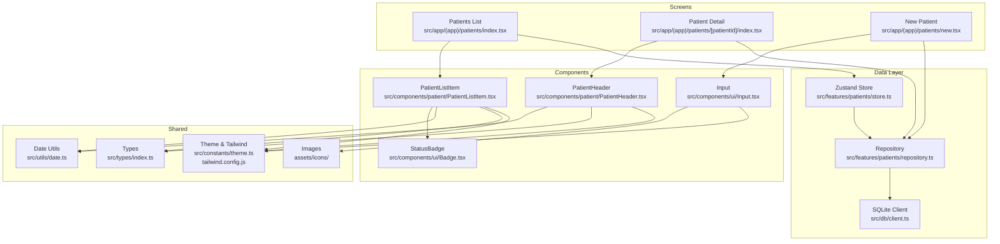
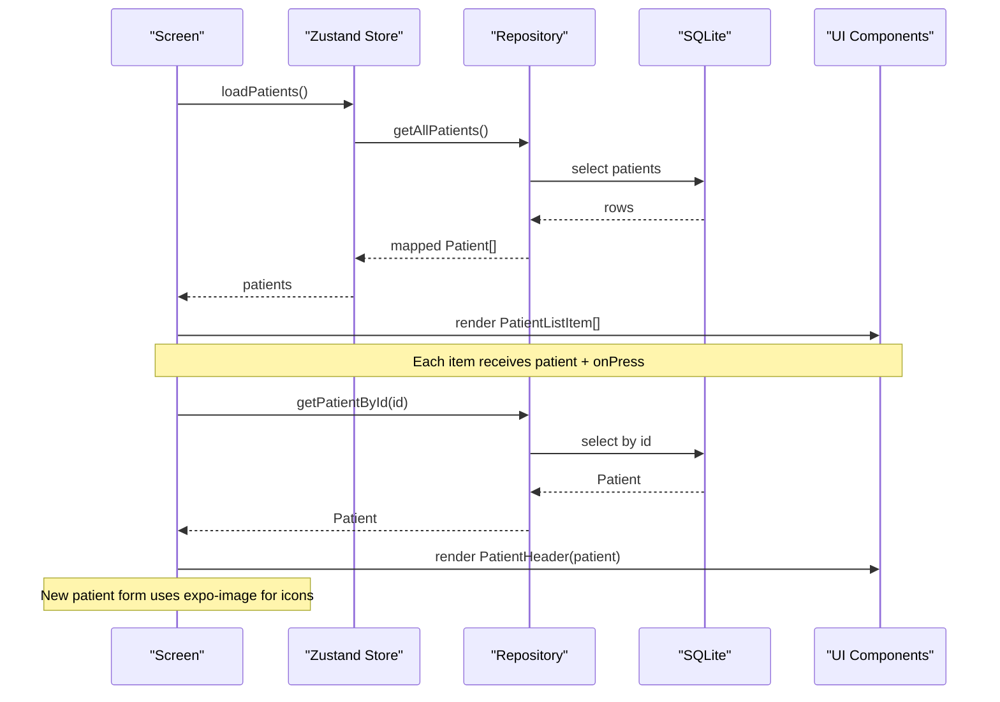
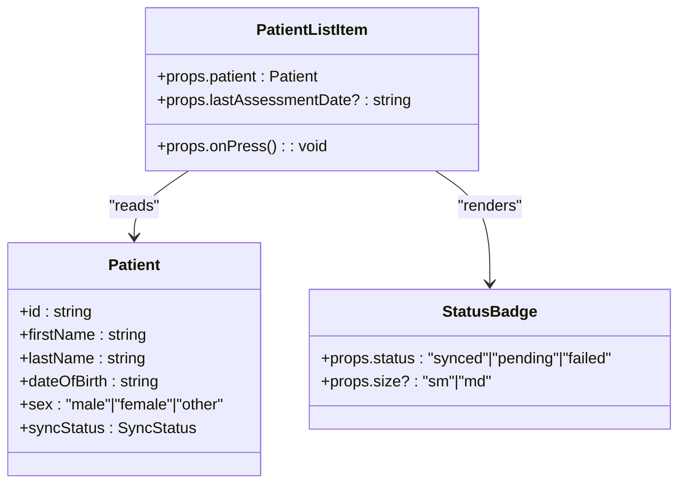
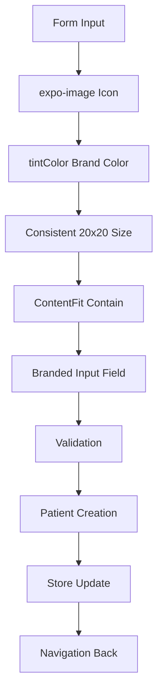
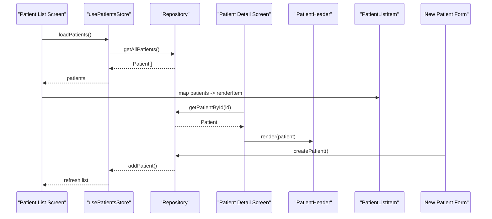
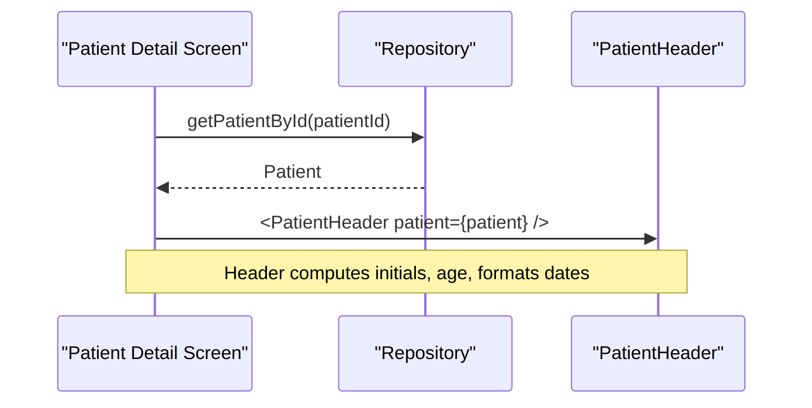
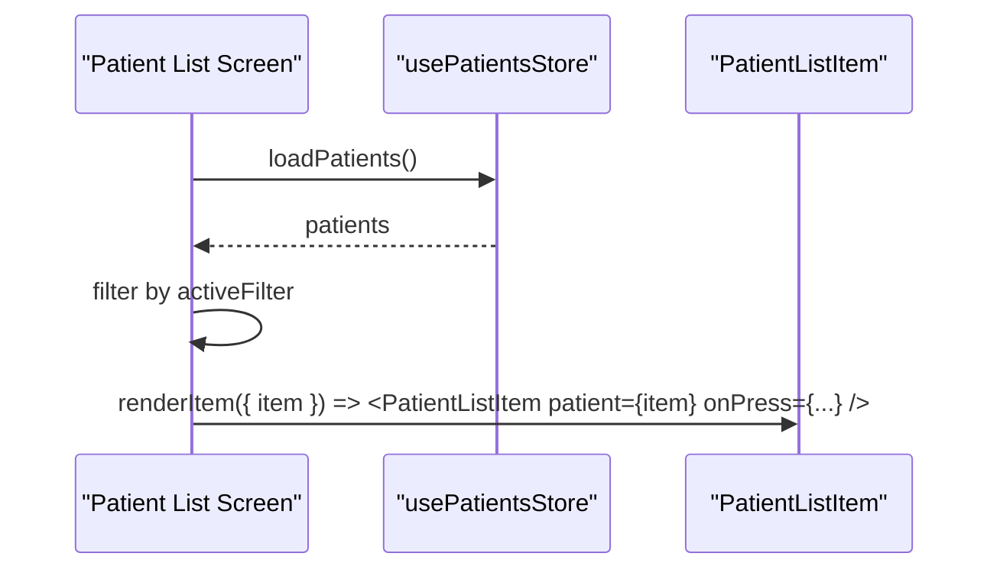
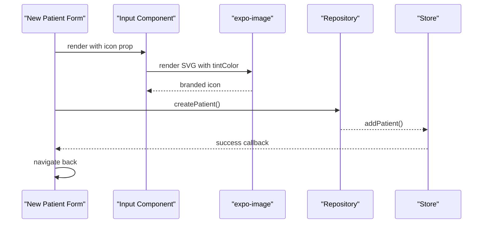
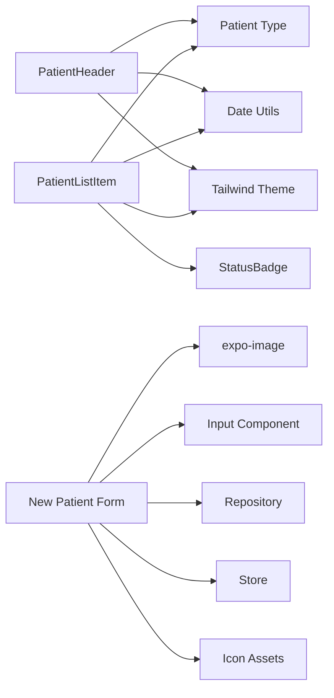

# UI Components

<cite>
**Referenced Files in This Document**
- [PatientHeader.tsx](file://src/components/patient/PatientHeader.tsx)
- [PatientListItem.tsx](file://src/components/patient/PatientListItem.tsx)
- [new.tsx](file://src/app/(app)/patients/new.tsx)
- [Input.tsx](file://src/components/ui/Input.tsx)
- [Badge.tsx](file://src/components/ui/Badge.tsx)
- [index.ts (types)](file://src/types/index.ts)
- [date.ts](file://src/utils/date.ts)
- [theme.ts](file://src/constants/theme.ts)
- [tailwind.config.js](file://tailwind.config.js)
- [patients/index.tsx](file://src/app/(app)/patients/index.tsx)
- [patients/[patientId]/index.tsx](file://src/app/(app)/patients/[patientId]/index.tsx)
- [patients/_layout.tsx](file://src/app/(app)/patients/_layout.tsx)
- [patients/[patientId]/_layout.tsx](file://src/app/(app)/patients/[patientId]/_layout.tsx)
- [repository.ts](file://src/features/patients/repository.ts)
- [store.ts](file://src/features/patients/store.ts)
</cite>

## Update Summary
**Changes Made**
- Added comprehensive documentation for the New Patient Registration screen component
- Updated Input component documentation to include icon support with expo-image integration
- Enhanced section on form components and user input handling
- Added detailed coverage of SVG image implementation with tintColor support for consistent branding
- Updated usage examples to include patient creation workflow

## Table of Contents
1. Introduction
2. Project Structure
3. Core Components
4. Architecture Overview
5. Detailed Component Analysis
6. Dependency Analysis
7. Performance Considerations
8. Troubleshooting Guide
9. Conclusion
10. Appendices

## Introduction
This document provides comprehensive documentation for patient-related UI components in DermSight, focusing on the PatientHeader, PatientListItem, and New Patient Registration components. It covers their props, styling options, integration with patient data display, composition patterns, accessibility considerations, responsive design, theme customization, usage examples across screen layouts, performance optimizations for large lists, and guidelines for extending and customizing behavior.

## Project Structure
The patient UI is implemented as reusable React Native components under src/components/patient and consumed by screens in src/app/(app)/patients. Data flows from a local repository into Zustand store state and then into screens that render the components. The patient creation form uses modern image handling with expo-image for consistent branding.

**Diagram sources**
- [patients/index.tsx:1-132](file://src/app/(app)/patients/index.tsx#L1-L132)
- [patients/[patientId]/index.tsx:1-211](file://src/app/(app)/patients/[patientId]/index.tsx#L1-L211)
- [new.tsx:1-229](file://src/app/(app)/patients/new.tsx#L1-L229)
- [PatientHeader.tsx:1-68](file://src/components/patient/PatientHeader.tsx#L1-L68)
- [PatientListItem.tsx:1-52](file://src/components/patient/PatientListItem.tsx#L1-L52)
- [Input.tsx:1-90](file://src/components/ui/Input.tsx#L1-L90)
- [Badge.tsx:1-71](file://src/components/ui/Badge.tsx#L1-L71)
- [store.ts:1-67](file://src/features/patients/store.ts#L1-L67)
- [repository.ts:1-128](file://src/features/patients/repository.ts#L1-L128)
- [index.ts (types):1-98](file://src/types/index.ts#L1-L98)
- [date.ts:1-72](file://src/utils/date.ts#L1-L72)
- [theme.ts:1-74](file://src/constants/theme.ts#L1-L74)
- [tailwind.config.js:1-45](file://tailwind.config.js#L1-L45)

**Section sources**
- [patients/index.tsx:1-132](file://src/app/(app)/patients/index.tsx#L1-L132)
- [patients/[patientId]/index.tsx:1-211](file://src/app/(app)/patients/[patientId]/index.tsx#L1-L211)
- [new.tsx:1-229](file://src/app/(app)/patients/new.tsx#L1-L229)
- [PatientHeader.tsx:1-68](file://src/components/patient/PatientHeader.tsx#L1-L68)
- [PatientListItem.tsx:1-52](file://src/components/patient/PatientListItem.tsx#L1-L52)
- [Input.tsx:1-90](file://src/components/ui/Input.tsx#L1-L90)
- [Badge.tsx:1-71](file://src/components/ui/Badge.tsx#L1-L71)
- [store.ts:1-67](file://src/features/patients/store.ts#L1-L67)
- [repository.ts:1-128](file://src/features/patients/repository.ts#L1-L128)
- [index.ts (types):1-98](file://src/types/index.ts#L1-L98)
- [date.ts:1-72](file://src/utils/date.ts#L1-L72)
- [theme.ts:1-74](file://src/constants/theme.ts#L1-L74)
- [tailwind.config.js:1-45](file://tailwind.config.js#L1-L45)

## Core Components
- **PatientHeader**: Displays a patient's avatar initials, name, status indicator, ID snippet, sex, age, registration date, and quick action buttons. Uses shared date utilities and theme colors.
- **PatientListItem**: Renders a single row with avatar initials, name, ID snippet, sex, age, optional last assessment date, and a sync status badge.
- **New Patient Registration**: Comprehensive form for creating new patients with validation, proper SVG icons, and brand-consistent styling using expo-image.

Key shared dependencies:
- Types: Patient interface defines all fields used by both components.
- Date utilities: calculateAge and formatDate are used to compute and present age and dates.
- Theme: Tailwind classes reference primary, navy, and surface tokens defined in tailwind.config.js and theme constants.
- Image handling: Modern expo-image integration for consistent icon rendering with tintColor support.

**Section sources**
- [PatientHeader.tsx:10-55](file://src/components/patient/PatientHeader.tsx#L10-L55)
- [PatientListItem.tsx:11-49](file://src/components/patient/PatientListItem.tsx#L11-L49)
- [new.tsx:15-228](file://src/app/(app)/patients/new.tsx#L15-L228)
- [index.ts (types):19-36](file://src/types/index.ts#L19-L36)
- [date.ts:20-26](file://src/utils/date.ts#L20-L26)
- [date.ts:57-66](file://src/utils/date.ts#L57-L66)
- [tailwind.config.js:7-37](file://tailwind.config.js#L7-L37)

## Architecture Overview
The patient screens consume data via a Zustand store and repository layer. The list screen renders PatientListItem rows inside a FlatList. The detail screen renders PatientHeader at the top of the profile view. The new patient screen provides a comprehensive form with proper image handling and validation. All components are pure presentational layers that rely on props and shared utilities.

**Diagram sources**
- [patients/index.tsx:16-29](file://src/app/(app)/patients/index.tsx#L16-L29)
- [store.ts:26-67](file://src/features/patients/store.ts#L26-L67)
- [repository.ts:13-42](file://src/features/patients/repository.ts#L13-L42)
- [patients/[patientId]/index.tsx:15-26](file://src/app/(app)/patients/[patientId]/index.tsx#L15-L26)
- [new.tsx:39-62](file://src/app/(app)/patients/new.tsx#L39-L62)

## Detailed Component Analysis

### PatientHeader
- Purpose: Top section of the patient detail screen showing identity, demographics, and quick actions.
- Props:
  - patient: Patient object containing firstName, lastName, dateOfBirth, sex, id, createdAt, and other metadata.
- Styling:
  - Uses Tailwind classes for layout, spacing, typography, and color tokens (primary, navy, gray).
  - Avatar background uses primary-50; text uses primary and navy tokens.
- Data presentation:
  - Computes initials from first and last names.
  - Calculates age using date utility.
  - Displays formatted registration date and short ID snippet.
  - Shows an "Active" indicator.
- Integration:
  - Consumed by the patient detail screen to render the header above additional sections.
- Accessibility:
  - Text elements provide readable content; consider adding accessible labels for quick actions if they trigger navigation or actions.
- Responsiveness:
  - Flexbox-based layout adapts to screen width; avatar and info stack horizontally with flex-row.
- Extensibility:
  - QuickAction is a small internal component; can be extended to accept icon, label, and onPress to wire real actions.

**Diagram sources**
- [PatientHeader.tsx:14-55](file://src/components/patient/PatientHeader.tsx#L14-L55)
- [date.ts:20-26](file://src/utils/date.ts#L20-L26)
- [date.ts:57-66](file://src/utils/date.ts#L57-L66)

**Section sources**
- [PatientHeader.tsx:10-67](file://src/components/patient/PatientHeader.tsx#L10-L67)
- [patients/[patientId]/index.tsx:41-55](file://src/app/(app)/patients/[patientId]/index.tsx#L41-L55)
- [date.ts:20-26](file://src/utils/date.ts#L20-L26)
- [date.ts:57-66](file://src/utils/date.ts#L57-L66)
- [tailwind.config.js:7-37](file://tailwind.config.js#L7-L37)

### PatientListItem
- Purpose: Individual row in the patient list displaying key patient information and sync status.
- Props:
  - patient: Patient object.
  - lastAssessmentDate?: Optional string to show last assessment date.
  - onPress: Callback invoked when the row is pressed.
- Styling:
  - Pressable container with white background and subtle border.
  - Avatar uses primary-50 background and primary text.
  - StatusBadge shows sync status with color-coded backgrounds and text.
- Touch interactions:
  - Entire row is pressable; navigation handled by the parent screen.
- Visual presentation:
  - Shows initials, full name, ID snippet, sex, age, optional last assessment date, and sync status badge.
- Integration:
  - Rendered by the patient list screen within a FlatList.
- Accessibility:
  - Row is interactive; ensure focus and announcements are appropriate for screen readers.
- Responsiveness:
  - Horizontal layout with flexible space allocation; scales well on different widths.

**Diagram sources**
- [PatientListItem.tsx:11-49](file://src/components/patient/PatientListItem.tsx#L11-L49)
- [Badge.tsx:44-70](file://src/components/ui/Badge.tsx#L44-L70)
- [index.ts (types):19-36](file://src/types/index.ts#L19-L36)

**Section sources**
- [PatientListItem.tsx:11-49](file://src/components/patient/PatientListItem.tsx#L11-L49)
- [patients/index.tsx:109-119](file://src/app/(app)/patients/index.tsx#L109-L119)
- [Badge.tsx:44-70](file://src/components/ui/Badge.tsx#L44-L70)
- [index.ts (types):19-36](file://src/types/index.ts#L19-L36)

### New Patient Registration Form
- Purpose: Comprehensive form for creating new patients with proper validation and branded icons.
- Features:
  - Personal Information section with First Name, Last Name, Date of Birth, and Gender selection
  - Contact Information section with Phone Number and Address fields
  - Additional Information section for Notes
  - Real-time validation with error messages
  - Proper SVG icons using expo-image with consistent branding
- Icon Implementation:
  - Uses expo-image's Image component for proper SVG/PNG rendering
  - Consistent sizing (20x20 pixels) across all form inputs
  - Brand color application via tintColor (#0D9E94)
  - ContentFit="contain" for optimal scaling
- Form Fields:
  - First Name: Required field with person icon
  - Last Name: Required field with person icon  
  - Date of Birth: Required field with calendar icon, default keyboard
  - Gender: Radio button selection (Male/Female/Other)
  - Phone Number: Optional field with phone icon, phone-pad keyboard
  - Address: Optional field with location icon
  - Notes: Optional multiline field with notes icon
- Validation:
  - Client-side validation for required fields
  - Error state management with visual feedback
  - Integration with patient creation workflow
- Integration:
  - Connects to createPatient repository function
  - Updates Zustand store on successful creation
  - Navigation back to patient list after save

**Diagram sources**
- [new.tsx:88-220](file://src/app/(app)/patients/new.tsx#L88-L220)
- [Input.tsx:8-22](file://src/components/ui/Input.tsx#L8-L22)

**Section sources**
- [new.tsx:15-228](file://src/app/(app)/patients/new.tsx#L15-L228)
- [Input.tsx:1-90](file://src/components/ui/Input.tsx#L1-L90)

### Component Composition Patterns and Reusability
- Composition:
  - PatientHeader composes smaller visual blocks (avatar, name block, meta lines, quick actions).
  - PatientListItem composes avatar, info block, and StatusBadge.
  - New Patient form composes multiple Input components with proper icon integration.
- Reusability:
  - Both components are pure presentational functions taking typed props, enabling reuse across screens without business logic coupling.
  - Shared utilities (date formatting, types) and theme tokens promote consistency.
  - Input component supports flexible icon rendering through ReactNode prop.
- Extensibility:
  - Add new props to components to support optional features (e.g., extra metadata, variant styles).
  - Encapsulate complex behaviors in small internal components (like QuickAction) for clarity.
  - Image handling pattern can be replicated across other forms for consistent branding.

**Section sources**
- [PatientHeader.tsx:14-67](file://src/components/patient/PatientHeader.tsx#L14-L67)
- [PatientListItem.tsx:17-49](file://src/components/patient/PatientListItem.tsx#L17-L49)
- [new.tsx:88-220](file://src/app/(app)/patients/new.tsx#L88-L220)
- [Input.tsx:8-22](file://src/components/ui/Input.tsx#L8-L22)
- [date.ts:20-26](file://src/utils/date.ts#L20-L26)
- [date.ts:57-66](file://src/utils/date.ts#L57-L66)
- [tailwind.config.js:7-37](file://tailwind.config.js#L7-L37)

## Architecture Overview
The screens orchestrate data fetching and rendering:
- Patient List screen loads patients via store, filters them locally, and renders PatientListItem rows.
- Patient Detail screen fetches a specific patient and assessments, then renders PatientHeader and related sections.
- New Patient screen provides comprehensive form with validation and proper image handling.

**Diagram sources**
- [patients/index.tsx:16-29](file://src/app/(app)/patients/index.tsx#L16-L29)
- [store.ts:26-67](file://src/features/patients/store.ts#L26-L67)
- [repository.ts:13-42](file://src/features/patients/repository.ts#L13-L42)
- [patients/[patientId]/index.tsx:15-26](file://src/app/(app)/patients/[patientId]/index.tsx#L15-L26)
- [PatientHeader.tsx:14-55](file://src/components/patient/PatientHeader.tsx#L14-L55)
- [PatientListItem.tsx:17-49](file://src/components/patient/PatientListItem.tsx#L17-L49)
- [new.tsx:39-62](file://src/app/(app)/patients/new.tsx#L39-L62)

## Detailed Component Analysis

### PatientHeader Usage in Detail Screen
- The detail screen imports and renders PatientHeader after loading patient data.
- It also displays additional sections like patient information and assessment summaries.

**Diagram sources**
- [patients/[patientId]/index.tsx:15-26](file://src/app/(app)/patients/[patientId]/index.tsx#L15-L26)
- [patients/[patientId]/index.tsx:41-55](file://src/app/(app)/patients/[patientId]/index.tsx#L41-L55)
- [PatientHeader.tsx:14-55](file://src/components/patient/PatientHeader.tsx#L14-L55)

**Section sources**
- [patients/[patientId]/index.tsx:15-55](file://src/app/(app)/patients/[patientId]/index.tsx#L15-L55)
- [PatientHeader.tsx:14-55](file://src/components/patient/PatientHeader.tsx#L14-L55)

### PatientListItem Usage in List Screen
- The list screen maps filtered patients to PatientListItem rows inside a FlatList.
- Navigation to patient detail is handled via router.push with the patient id.

**Diagram sources**
- [patients/index.tsx:16-36](file://src/app/(app)/patients/index.tsx#L16-L36)
- [patients/index.tsx:109-119](file://src/app/(app)/patients/index.tsx#L109-L119)
- [PatientListItem.tsx:17-49](file://src/components/patient/PatientListItem.tsx#L17-L49)

**Section sources**
- [patients/index.tsx:16-119](file://src/app/(app)/patients/index.tsx#L16-L119)
- [PatientListItem.tsx:17-49](file://src/components/patient/PatientListItem.tsx#L17-L49)

### New Patient Form Usage and Integration
- The new patient screen provides a comprehensive form with proper validation and branded icons.
- Uses expo-image for consistent SVG rendering with brand colors.
- Integrates with patient creation workflow and store updates.

**Diagram sources**
- [new.tsx:88-220](file://src/app/(app)/patients/new.tsx#L88-L220)
- [Input.tsx:48-85](file://src/components/ui/Input.tsx#L48-L85)

**Section sources**
- [new.tsx:15-228](file://src/app/(app)/patients/new.tsx#L15-L228)
- [Input.tsx:1-90](file://src/components/ui/Input.tsx#L1-L90)

## Dependency Analysis
- PatientHeader depends on:
  - Patient type for props.
  - Date utilities for age and formatted dates.
  - Tailwind theme tokens for colors and typography.
- PatientListItem depends on:
  - Patient type for props.
  - StatusBadge for sync status visualization.
  - Date utilities for age and optional last assessment date.
  - Tailwind theme tokens for consistent styling.
- New Patient Form depends on:
  - expo-image for proper SVG rendering.
  - Input component with icon support.
  - Repository for patient creation.
  - Store for state management.
  - Assets for branded icon files.

**Diagram sources**
- [PatientHeader.tsx:5-8](file://src/components/patient/PatientHeader.tsx#L5-L8)
- [PatientListItem.tsx:5-9](file://src/components/patient/PatientListItem.tsx#L5-L9)
- [new.tsx:5-13](file://src/app/(app)/patients/new.tsx#L5-L13)
- [index.ts (types):19-36](file://src/types/index.ts#L19-L36)
- [date.ts:20-26](file://src/utils/date.ts#L20-L26)
- [date.ts:57-66](file://src/utils/date.ts#L57-L66)
- [Badge.tsx:44-70](file://src/components/ui/Badge.tsx#L44-L70)
- [tailwind.config.js:7-37](file://tailwind.config.js#L7-L37)

**Section sources**
- [PatientHeader.tsx:5-8](file://src/components/patient/PatientHeader.tsx#L5-L8)
- [PatientListItem.tsx:5-9](file://src/components/patient/PatientListItem.tsx#L5-L9)
- [new.tsx:5-13](file://src/app/(app)/patients/new.tsx#L5-L13)
- [index.ts (types):19-36](file://src/types/index.ts#L19-L36)
- [date.ts:20-26](file://src/utils/date.ts#L20-L26)
- [date.ts:57-66](file://src/utils/date.ts#L57-L66)
- [Badge.tsx:44-70](file://src/components/ui/Badge.tsx#L44-L70)
- [tailwind.config.js:7-37](file://tailwind.config.js#L7-L37)

## Performance Considerations
- Virtualization:
  - The patient list uses FlatList, which virtualizes items for efficient rendering of large datasets. Ensure keyExtractor uses stable unique keys (patient.id).
- Debounced search:
  - Search input is debounced to reduce frequent store updates and repository calls.
- Filtering:
  - Local filtering by sync status is applied in-memory; for very large lists, consider server-side filtering or pagination.
- Lazy loading:
  - For heavy detail views, consider lazy-loading assessments or images only when needed.
- Memoization:
  - If components receive expensive computations, wrap with React.memo and useMemo for derived values like initials and age.
- Batch updates:
  - Keep store actions minimal and batched to avoid excessive re-renders.
- Image optimization:
  - Use expo-image for efficient SVG rendering with proper caching and memory management.
  - Consistent icon sizing reduces layout shifts and improves performance.

## Troubleshooting Guide
- Missing patient data:
  - Verify repository returns mapped Patient objects and that screens handle null cases gracefully.
- Incorrect age or date display:
  - Check date parsing and formatting utilities; ensure ISO strings are passed.
- Status badge not updating:
  - Confirm syncStatus field exists on Patient and is updated in store/repository operations.
- Navigation issues:
  - Ensure router paths match route definitions in layout files.
- Icon rendering problems:
  - Verify expo-image is properly configured and assets are correctly referenced.
  - Check tintColor values match brand colors in theme configuration.
- Form validation errors:
  - Ensure validation rules match expected input formats.
  - Verify error state is properly managed and displayed.

**Section sources**
- [repository.ts:108-127](file://src/features/patients/repository.ts#L108-L127)
- [date.ts:20-26](file://src/utils/date.ts#L20-L26)
- [date.ts:57-66](file://src/utils/date.ts#L57-L66)
- [patients/_layout.tsx:7-14](file://src/app/(app)/patients/_layout.tsx#L7-L14)
- [patients/[patientId]/_layout.tsx:7-16](file://src/app/(app)/patients/[patientId]/_layout.tsx#L7-L16)
- [new.tsx:29-37](file://src/app/(app)/patients/new.tsx#L29-L37)

## Conclusion
PatientHeader, PatientListItem, and the New Patient Registration form are focused, reusable UI components that integrate cleanly with DermSight's data layer and theme system. They follow clear composition patterns, leverage shared utilities, and support responsive layouts. With FlatList virtualization, debounced search, and modern image handling via expo-image, the patient interface performs well for moderate datasets. The new patient form provides a comprehensive experience with proper validation and consistent branding. For larger datasets, consider pagination, server-side filtering, and memoization. Extend components by adding optional props and encapsulating new behaviors in small internal components.

## Appendices

### Props Reference
- PatientHeader
  - patient: Patient object (required)
- PatientListItem
  - patient: Patient object (required)
  - lastAssessmentDate?: string (optional)
  - onPress: () => void (required)
- Input Component
  - label?: string (optional)
  - placeholder?: string (optional)
  - value: string (required)
  - onChangeText: (text: string) => void (required)
  - icon?: React.ReactNode (optional)
  - error?: string (optional)
  - secureTextEntry?: boolean (optional)
  - keyboardType?: "default" | "numeric" | "email-address" | "phone-pad" (optional)
  - autoCapitalize?: "none" | "sentences" | "words" | "characters" (optional)
  - multiline?: boolean (optional)
  - numberOfLines?: number (optional)
  - editable?: boolean (optional)
  - rightIcon?: React.ReactNode (optional)

**Section sources**
- [PatientHeader.tsx:10-12](file://src/components/patient/PatientHeader.tsx#L10-L12)
- [PatientListItem.tsx:11-15](file://src/components/patient/PatientListItem.tsx#L11-L15)
- [Input.tsx:8-22](file://src/components/ui/Input.tsx#L8-L22)

### Styling and Theme Customization
- Colors and tokens:
  - Primary palette and navy tones are defined in tailwind.config.js and referenced via className.
  - Theme constants in theme.ts define light/dark palettes and fonts.
- Customization:
  - Adjust token values in tailwind.config.js to change brand colors.
  - Use theme constants for platform-specific font selection.
- Icon branding:
  - Use tintColor property in expo-image for consistent brand colors (#0D9E94).
  - Maintain consistent icon sizing (20x20 pixels) across all form inputs.
  - Utilize contentFit="contain" for optimal scaling of SVG assets.

**Section sources**
- [tailwind.config.js:7-37](file://tailwind.config.js#L7-L37)
- [theme.ts:8-37](file://src/constants/theme.ts#L8-L37)
- [theme.ts:41-60](file://src/constants/theme.ts#L41-L60)
- [new.tsx:94-99](file://src/app/(app)/patients/new.tsx#L94-L99)

### Usage Examples Across Screens
- Patient List:
  - Renders PatientListItem rows inside FlatList with search and filter tabs.
- Patient Detail:
  - Renders PatientHeader at the top of the profile view, followed by information and assessment sections.
- New Patient Registration:
  - Provides comprehensive form with proper validation, branded icons, and seamless integration with patient creation workflow.

**Section sources**
- [patients/index.tsx:109-119](file://src/app/(app)/patients/index.tsx#L109-L119)
- [patients/[patientId]/index.tsx:41-55](file://src/app/(app)/patients/[patientId]/index.tsx#L41-L55)
- [new.tsx:82-225](file://src/app/(app)/patients/new.tsx#L82-L225)

### Guidelines for Extending and Customizing Behavior
- Add optional props for variants (e.g., size, alignment).
- Extract complex logic into small internal components (like QuickAction).
- Use TypeScript interfaces to enforce prop contracts.
- Leverage shared utilities and theme tokens to maintain consistency.
- Wrap expensive computations with memoization to optimize re-renders.
- Implement consistent icon handling using expo-image with tintColor for brand consistency.
- Follow established patterns for form validation and error handling.

### Image Asset Management
- Location: All patient-related icons are stored in assets/icons/ directory
- Naming convention: np-* prefix for patient-related icons (np-person.png, np-calendar.png, etc.)
- Format: PNG files optimized for mobile display
- Branding: All icons use consistent tintColor (#0D9E94) for brand consistency
- Sizing: Standard 20x20 pixel dimensions for uniform appearance

**Section sources**
- [new.tsx:94-217](file://src/app/(app)/patients/new.tsx#L94-L217)