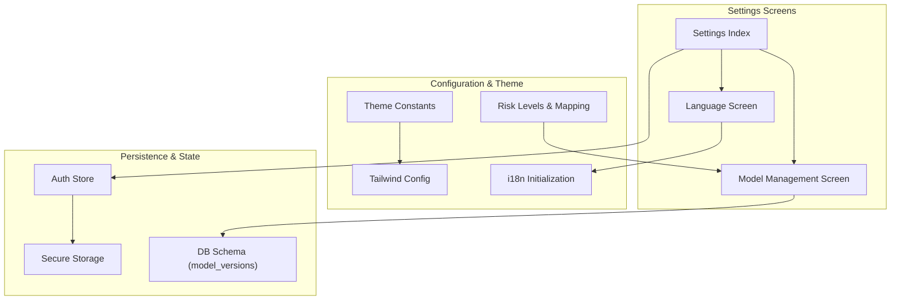
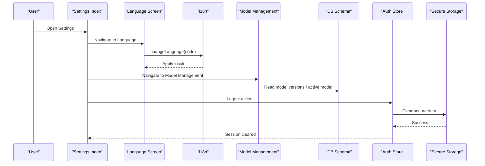
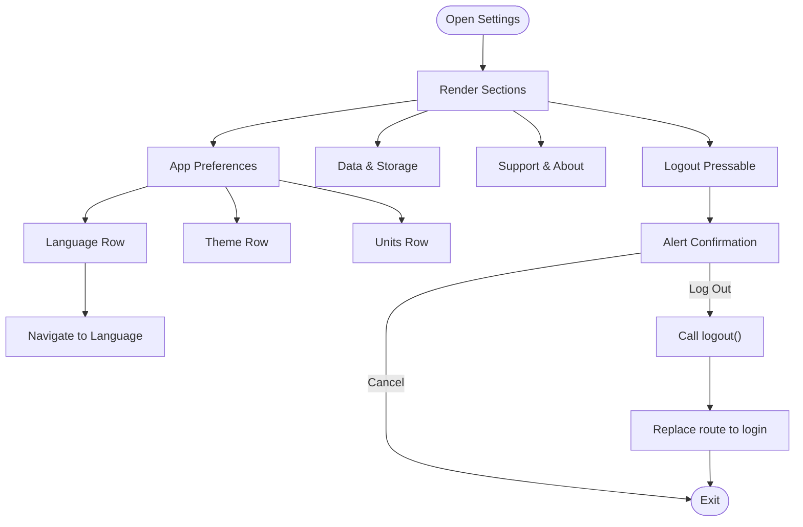
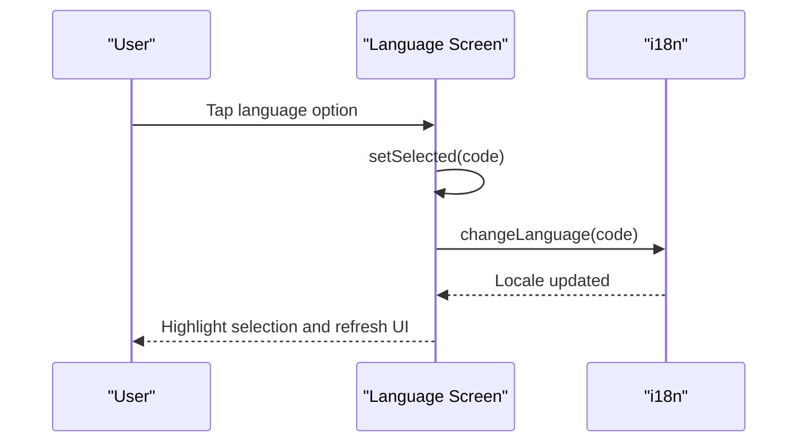
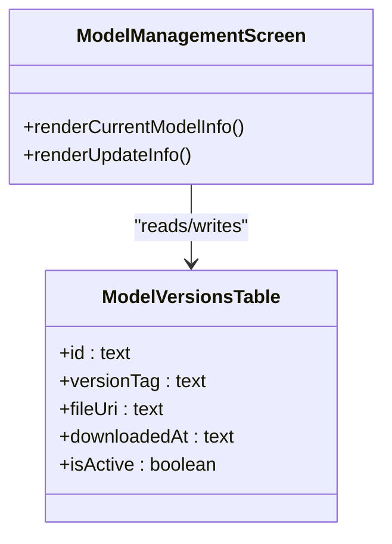
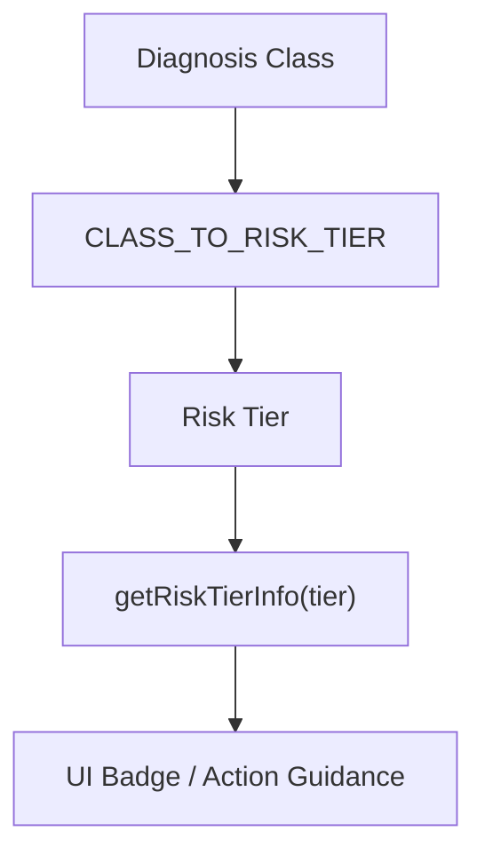
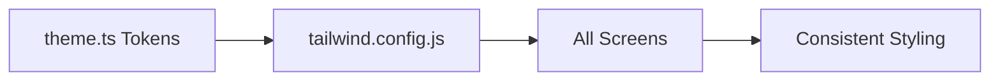
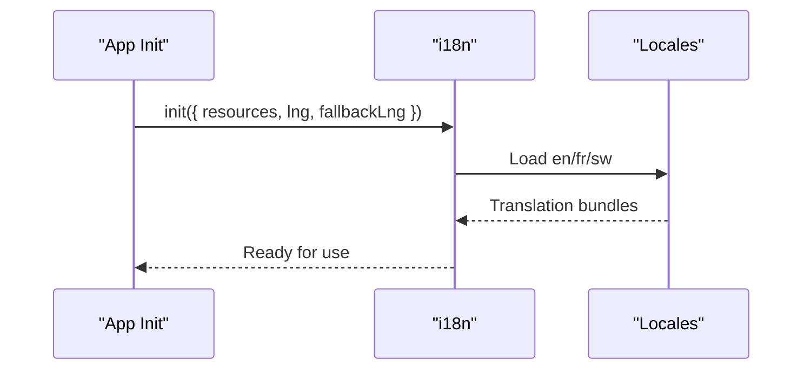
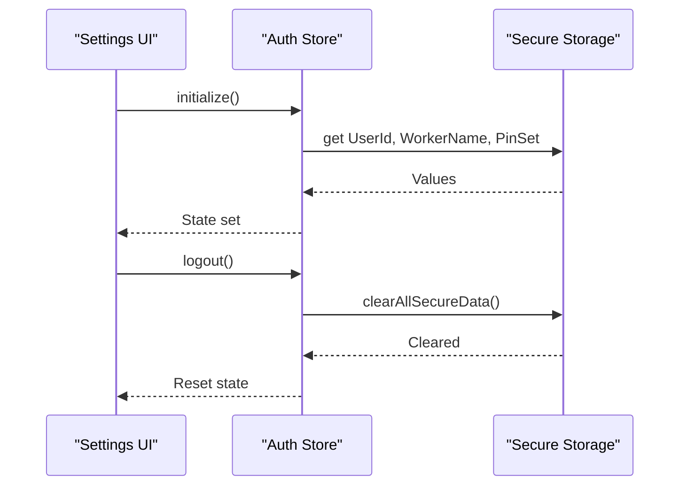
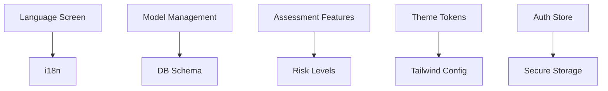

# Settings and Configuration

<cite>
**Referenced Files in This Document**
- [index.tsx](file://src/app/(app)/settings/index.tsx)
- [language.tsx](file://src/app/(app)/settings/language.tsx)
- [model-management.tsx](file://src/app/(app)/settings/model-management.tsx)
- [riskLevels.ts](file://src/constants/riskLevels.ts)
- [theme.ts](file://src/constants/theme.ts)
- [tailwind.config.js](file://tailwind.config.js)
- [i18n.ts](file://src/lib/i18n.ts)
- [riskMapping.ts](file://src/features/assessments/inference/riskMapping.ts)
- [store.ts](file://src/features/auth/store.ts)
- [secureStorage.ts](file://src/lib/secureStorage.ts)
- [schema.ts](file://src/db/schema.ts)
- [en.json](file://assets/locales/en.json)
</cite>

## Table of Contents
1. [Introduction](#introduction)
2. [Project Structure](#project-structure)
3. [Core Components](#core-components)
4. [Architecture Overview](#architecture-overview)
5. [Detailed Component Analysis](#detailed-component-analysis)
6. [Dependency Analysis](#dependency-analysis)
7. [Performance Considerations](#performance-considerations)
8. [Troubleshooting Guide](#troubleshooting-guide)
9. [Conclusion](#conclusion)
10. [Appendices](#appendices)

## Introduction
This document explains DermSight’s settings and configuration system with a focus on:
- The settings screen architecture for user preferences, language selection, and model management
- The theme system powered by Tailwind CSS and shared design tokens
- The risk level configuration that defines clinical thresholds and classification criteria used during assessments
- Implementation patterns for persistence, preference management, and dynamic updates
- Model management interface capabilities for versioning, updates, and rollback
- Configuration validation, defaults, and migration strategies
- How settings influence assessment results and overall user experience

## Project Structure
The settings surface is organized under the app routes with dedicated screens for general settings, language selection, and model management. Supporting configuration lives in constants and libraries for internationalization, theming, and risk mapping.

**Diagram sources**
- [index.tsx:1-170](file://src/app/(app)/settings/index.tsx#L1-L170)
- [language.tsx:1-68](file://src/app/(app)/settings/language.tsx#L1-L68)
- [model-management.tsx:1-68](file://src/app/(app)/settings/model-management.tsx#L1-L68)
- [theme.ts:1-74](file://src/constants/theme.ts#L1-L74)
- [tailwind.config.js:1-45](file://tailwind.config.js#L1-L45)
- [i18n.ts:1-29](file://src/lib/i18n.ts#L1-L29)
- [riskLevels.ts:1-121](file://src/constants/riskLevels.ts#L1-L121)
- [secureStorage.ts:1-78](file://src/lib/secureStorage.ts#L1-L78)
- [store.ts:1-122](file://src/features/auth/store.ts#L1-L122)
- [schema.ts:94-101](file://src/db/schema.ts#L94-L101)

**Section sources**
- [index.tsx:1-170](file://src/app/(app)/settings/index.tsx#L1-L170)
- [language.tsx:1-68](file://src/app/(app)/settings/language.tsx#L1-L68)
- [model-management.tsx:1-68](file://src/app/(app)/settings/model-management.tsx#L1-L68)
- [theme.ts:1-74](file://src/constants/theme.ts#L1-L74)
- [tailwind.config.js:1-45](file://tailwind.config.js#L1-L45)
- [i18n.ts:1-29](file://src/lib/i18n.ts#L1-L29)
- [riskLevels.ts:1-121](file://src/constants/riskLevels.ts#L1-L121)
- [secureStorage.ts:1-78](file://src/lib/secureStorage.ts#L1-L78)
- [store.ts:1-122](file://src/features/auth/store.ts#L1-L122)
- [schema.ts:94-101](file://src/db/schema.ts#L94-L101)

## Core Components
- Settings index screen: Provides grouped navigation to account/security, app preferences (language, theme, notifications, units), data/storage, support/about, and logout. It uses reusable row components and section headers for consistent UI.
- Language screen: Lists supported languages, highlights the current selection, and applies the selected language immediately via i18n.
- Model management screen: Displays current model metadata (version, architecture, dataset, quantization, size) and informational guidance about on-device model usage and updates.
- Risk levels configuration: Centralizes clinical triage tiers, display labels, and class-to-tier mappings used across assessments and UI.
- Theme system: Shared color tokens and spacing values consumed by Tailwind to ensure consistent styling across light/dark modes and platforms.
- Internationalization: Initializes i18next with bundled locales and supports runtime language switching.
- Persistence and state: Secure storage for sensitive data; auth store manages session lifecycle and initialization.

**Section sources**
- [index.tsx:27-124](file://src/app/(app)/settings/index.tsx#L27-L124)
- [language.tsx:16-64](file://src/app/(app)/settings/language.tsx#L16-L64)
- [model-management.tsx:22-63](file://src/app/(app)/settings/model-management.tsx#L22-L63)
- [riskLevels.ts:19-62](file://src/constants/riskLevels.ts#L19-L62)
- [theme.ts:8-37](file://src/constants/theme.ts#L8-L37)
- [tailwind.config.js:5-42](file://tailwind.config.js#L5-L42)
- [i18n.ts:12-26](file://src/lib/i18n.ts#L12-L26)
- [store.ts:30-49](file://src/features/auth/store.ts#L30-L49)
- [secureStorage.ts:8-14](file://src/lib/secureStorage.ts#L8-L14)

## Architecture Overview
The settings layer orchestrates user-facing configuration while delegating to specialized modules:
- Language changes are applied through i18n at runtime.
- Model information is presented from static metadata and backed by a database schema for version tracking.
- Risk thresholds are centralized so clinical logic can be adjusted without touching inference code.
- Theming is enforced via Tailwind with shared tokens to maintain consistency across screens.

**Diagram sources**
- [index.tsx:58-64](file://src/app/(app)/settings/index.tsx#L58-L64)
- [language.tsx:20-23](file://src/app/(app)/settings/language.tsx#L20-L23)
- [i18n.ts:18-26](file://src/lib/i18n.ts#L18-L26)
- [model-management.tsx:22-63](file://src/app/(app)/settings/model-management.tsx#L22-L63)
- [schema.ts:94-101](file://src/db/schema.ts#L94-L101)
- [store.ts:101-109](file://src/features/auth/store.ts#L101-L109)
- [secureStorage.ts:69-77](file://src/lib/secureStorage.ts#L69-L77)

## Detailed Component Analysis

### Settings Index Screen
- Groups options into logical sections: Account & Security, App Preferences, Data & Storage, Support & About.
- Uses a reusable row component for consistent presentation and optional right-side labels.
- Integrates navigation to language and other feature screens.
- Implements logout flow using the auth store and router.

**Diagram sources**
- [index.tsx:27-124](file://src/app/(app)/settings/index.tsx#L27-L124)
- [index.tsx:136-169](file://src/app/(app)/settings/index.tsx#L136-L169)

**Section sources**
- [index.tsx:27-124](file://src/app/(app)/settings/index.tsx#L27-L124)
- [index.tsx:136-169](file://src/app/(app)/settings/index.tsx#L136-L169)

### Language Selection
- Presents available languages with native names and English labels.
- Tracks selected language locally and applies it immediately via i18n.
- Visual feedback indicates the active selection.

**Diagram sources**
- [language.tsx:16-64](file://src/app/(app)/settings/language.tsx#L16-L64)
- [i18n.ts:18-26](file://src/lib/i18n.ts#L18-L26)

**Section sources**
- [language.tsx:16-64](file://src/app/(app)/settings/language.tsx#L16-L64)
- [i18n.ts:18-26](file://src/lib/i18n.ts#L18-L26)

### Model Management
- Displays current model metadata including version, architecture, dataset, quantization, and size.
- Provides informational context about on-device model usage and update availability.
- Database schema includes a model_versions table to track versions, file URIs, download timestamps, and active status, enabling future update and rollback workflows.

**Diagram sources**
- [model-management.tsx:22-63](file://src/app/(app)/settings/model-management.tsx#L22-L63)
- [schema.ts:94-101](file://src/db/schema.ts#L94-L101)

**Section sources**
- [model-management.tsx:22-63](file://src/app/(app)/settings/model-management.tsx#L22-L63)
- [schema.ts:94-101](file://src/db/schema.ts#L94-L101)

### Risk Level Configuration
- Defines risk tiers with labels, colors, background colors, and recommended actions.
- Maps HAM10000 diagnostic classes to risk tiers to standardize triage outcomes.
- Provides helper functions to retrieve tier info and map classes to tiers, ensuring consistent clinical logic across features.

**Diagram sources**
- [riskLevels.ts:19-62](file://src/constants/riskLevels.ts#L19-L62)
- [riskLevels.ts:114-120](file://src/constants/riskLevels.ts#L114-L120)
- [riskMapping.ts:8-13](file://src/features/assessments/inference/riskMapping.ts#L8-L13)

**Section sources**
- [riskLevels.ts:19-62](file://src/constants/riskLevels.ts#L19-L62)
- [riskLevels.ts:114-120](file://src/constants/riskLevels.ts#L114-L120)
- [riskMapping.ts:8-13](file://src/features/assessments/inference/riskMapping.ts#L8-L13)

### Theme System
- Centralized color tokens for light and dark themes, plus fonts and spacing utilities.
- Tailwind configuration extends color palettes (primary, navy, risk, surface) and font families to enforce consistent styling across the app.
- Ensures visual coherence for settings screens, badges, and risk indicators.

**Diagram sources**
- [theme.ts:8-74](file://src/constants/theme.ts#L8-L74)
- [tailwind.config.js:5-42](file://tailwind.config.js#L5-L42)

**Section sources**
- [theme.ts:8-74](file://src/constants/theme.ts#L8-L74)
- [tailwind.config.js:5-42](file://tailwind.config.js#L5-L42)

### Internationalization
- Initializes i18next with bundled locales and sets default/fallback language.
- Supports runtime language switching from the language screen.
- Localized strings include settings-related keys for consistent UX.

**Diagram sources**
- [i18n.ts:12-26](file://src/lib/i18n.ts#L12-L26)
- [en.json:159-186](file://assets/locales/en.json#L159-L186)

**Section sources**
- [i18n.ts:12-26](file://src/lib/i18n.ts#L12-L26)
- [en.json:159-186](file://assets/locales/en.json#L159-L186)

### Persistence and Preference Management
- Secure storage encapsulates keys for tokens, PIN hash, user ID, and worker name, with clear-all capability for logout.
- Auth store initializes session state from secure storage and provides login/setup/logout flows.
- While explicit user preference persistence (e.g., language, theme, units) is not implemented in the analyzed files, the infrastructure exists to add a preferences store backed by secure or local storage.

**Diagram sources**
- [store.ts:30-49](file://src/features/auth/store.ts#L30-L49)
- [store.ts:101-109](file://src/features/auth/store.ts#L101-L109)
- [secureStorage.ts:69-77](file://src/lib/secureStorage.ts#L69-L77)

**Section sources**
- [store.ts:30-49](file://src/features/auth/store.ts#L30-L49)
- [store.ts:101-109](file://src/features/auth/store.ts#L101-L109)
- [secureStorage.ts:69-77](file://src/lib/secureStorage.ts#L69-L77)

## Dependency Analysis
Key dependencies between settings and core systems:
- Language screen depends on i18n for runtime locale switching.
- Model management screen references DB schema for model versioning.
- Risk configuration is consumed by assessment features to determine triage outcomes.
- Theme tokens feed Tailwind to style all screens consistently.
- Auth store integrates with secure storage for session and security operations.

**Diagram sources**
- [language.tsx:20-23](file://src/app/(app)/settings/language.tsx#L20-L23)
- [i18n.ts:18-26](file://src/lib/i18n.ts#L18-L26)
- [model-management.tsx:22-63](file://src/app/(app)/settings/model-management.tsx#L22-L63)
- [schema.ts:94-101](file://src/db/schema.ts#L94-L101)
- [riskLevels.ts:19-62](file://src/constants/riskLevels.ts#L19-L62)
- [theme.ts:8-74](file://src/constants/theme.ts#L8-L74)
- [tailwind.config.js:5-42](file://tailwind.config.js#L5-L42)
- [store.ts:30-49](file://src/features/auth/store.ts#L30-L49)
- [secureStorage.ts:69-77](file://src/lib/secureStorage.ts#L69-L77)

**Section sources**
- [language.tsx:20-23](file://src/app/(app)/settings/language.tsx#L20-L23)
- [i18n.ts:18-26](file://src/lib/i18n.ts#L18-L26)
- [model-management.tsx:22-63](file://src/app/(app)/settings/model-management.tsx#L22-L63)
- [schema.ts:94-101](file://src/db/schema.ts#L94-L101)
- [riskLevels.ts:19-62](file://src/constants/riskLevels.ts#L19-L62)
- [theme.ts:8-74](file://src/constants/theme.ts#L8-L74)
- [tailwind.config.js:5-42](file://tailwind.config.js#L5-L42)
- [store.ts:30-49](file://src/features/auth/store.ts#L30-L49)
- [secureStorage.ts:69-77](file://src/lib/secureStorage.ts#L69-L77)

## Performance Considerations
- Language switching is immediate and lightweight, relying on i18n’s runtime update mechanism.
- Model management displays static metadata; any future update/download operations should be offloaded to background tasks to avoid blocking UI.
- Risk mapping is O(1) lookups via dictionaries, minimizing overhead during assessment rendering.
- Theme application via Tailwind is compile-time optimized; runtime cost is minimal.

[No sources needed since this section provides general guidance]

## Troubleshooting Guide
- Language not updating: Ensure i18n is initialized and changeLanguage is called with a valid code present in resources.
- Model info mismatch: Verify model_versions table entries and active flag; confirm UI reads the correct fields.
- Logout does not clear session: Confirm secure storage clearAll operation executes and auth store resets state.
- Risk tier misclassification: Check CLASS_TO_RISK_TIER mapping and ensure diagnosis classes align with model outputs.

**Section sources**
- [i18n.ts:18-26](file://src/lib/i18n.ts#L18-L26)
- [schema.ts:94-101](file://src/db/schema.ts#L94-L101)
- [store.ts:101-109](file://src/features/auth/store.ts#L101-L109)
- [riskLevels.ts:54-62](file://src/constants/riskLevels.ts#L54-L62)

## Conclusion
DermSight’s settings and configuration system provides a structured foundation for managing user preferences, language, and model information. Risk thresholds are centralized for clinical safety, and the theme system ensures consistent styling. While some preference persistence is not yet implemented, the existing stores and secure storage offer a clear path to extend configuration management. Model management scaffolding supports future update and rollback workflows.

[No sources needed since this section summarizes without analyzing specific files]

## Appendices

### Settings Screens and Navigation
- Settings index groups options and navigates to language and model management.
- Language screen lists supported locales and applies selections instantly.
- Model management shows current model details and informational guidance.

**Section sources**
- [index.tsx:27-124](file://src/app/(app)/settings/index.tsx#L27-L124)
- [language.tsx:16-64](file://src/app/(app)/settings/language.tsx#L16-L64)
- [model-management.tsx:22-63](file://src/app/(app)/settings/model-management.tsx#L22-L63)

### Risk Classification and Display
- Risk tiers define clinical actions and visual cues.
- Class-to-tier mapping standardizes triage outcomes.
- Helpers provide safe access to tier info and mappings.

**Section sources**
- [riskLevels.ts:19-62](file://src/constants/riskLevels.ts#L19-L62)
- [riskLevels.ts:114-120](file://src/constants/riskLevels.ts#L114-L120)
- [riskMapping.ts:8-13](file://src/features/assessments/inference/riskMapping.ts#L8-L13)

### Theme and Styling
- Color tokens and platform-specific fonts enable consistent UI.
- Tailwind extensions define primary, navy, risk, and surface palettes.

**Section sources**
- [theme.ts:8-74](file://src/constants/theme.ts#L8-L74)
- [tailwind.config.js:5-42](file://tailwind.config.js#L5-L42)

### Internationalization
- i18n initialization loads locales and sets defaults.
- Settings strings are localized for consistent UX.

**Section sources**
- [i18n.ts:12-26](file://src/lib/i18n.ts#L12-L26)
- [en.json:159-186](file://assets/locales/en.json#L159-L186)

### Persistence and Security
- Secure storage keys and clear-all function support secure session handling.
- Auth store coordinates initialization and logout flows.

**Section sources**
- [secureStorage.ts:8-14](file://src/lib/secureStorage.ts#L8-L14)
- [secureStorage.ts:69-77](file://src/lib/secureStorage.ts#L69-L77)
- [store.ts:30-49](file://src/features/auth/store.ts#L30-L49)
- [store.ts:101-109](file://src/features/auth/store.ts#L101-L109)