# Settings and Configuration

<cite>
**Referenced Files in This Document**
- [index.tsx](file://src/app/(app)/settings/index.tsx)
- [language.tsx](file://src/app/(app)/settings/language.tsx)
- [model-management.tsx](file://src/app/(app)/settings/model-management.tsx)
- [riskLevels.ts](file://src/constants/riskLevels.ts)
- [theme.ts](file://src/constants/theme.ts)
- [tailwind.config.js](file://tailwind.config.js)
- [i18n.ts](file://src/lib/i18n.ts)
- [riskMapping.ts](file://src/features/assessments/inference/riskMapping.ts)
- [store.ts](file://src/features/auth/store.ts)
- [secureStorage.ts](file://src/lib/secureStorage.ts)
- [schema.ts](file://src/db/schema.ts)
- [en.json](file://assets/locales/en.json)
- [fr.json](file://assets/locales/fr.json)
- [sw.json](file://assets/locales/sw.json)
- [Button.tsx](file://src/components/ui/Button.tsx)
- [Card.tsx](file://src/components/ui/Card.tsx)
</cite>

## Update Summary
**Changes Made**
- **Comprehensive Haptic Feedback Integration**: Added tactile feedback across all interactive elements using expo-haptics with contextually appropriate feedback styles (Light, Medium) for different interaction types
- **Complete Internationalization Implementation**: Replaced over 100 instances of hardcoded strings with translation function calls using react-i18next, supporting English, French, and Swahili languages
- **Dynamic Language Switching Support**: Implemented real-time language switching with immediate UI updates and proper state management
- **Enhanced Theme Management with Tactile Feedback**: Maintained theme functionality while adding haptic feedback for theme selection interactions
- **Improved User Experience**: Enhanced accessibility and user engagement through consistent haptic patterns across the settings interface

## Table of Contents
1. [Introduction](#introduction)
2. [Project Structure](#project-structure)
3. [Core Components](#core-components)
4. [Architecture Overview](#architecture-overview)
5. [Detailed Component Analysis](#detailed-component-analysis)
6. [Dependency Analysis](#dependency-analysis)
7. [Performance Considerations](#performance-considerations)
8. [Troubleshooting Guide](#troubleshooting-guide)
9. [Conclusion](#conclusion)
10. [Appendices](#appendices)

## Introduction
This document explains DermSight's enhanced settings and configuration system with comprehensive haptic feedback integration and complete internationalization support. The system now provides:
- **Comprehensive Haptic Feedback**: Contextual tactile responses for all user interactions including profile management, theme selection, data synchronization, and navigation actions
- **Complete Internationalization**: Multi-language support with English, French, and Swahili translations, enabling deployment across diverse healthcare environments
- **Dynamic Language Switching**: Real-time language changes without app restarts, maintaining application state while updating all UI text
- **Enhanced Accessibility**: Improved user experience through consistent haptic patterns that provide confirmation and feedback for critical actions
- **Robust Error Handling**: Comprehensive try-catch blocks with user-friendly error messages and fallback mechanisms
- **Advanced Connectivity Detection**: Proper web initialization with graceful degradation when connection detection fails
- **Offline-First Design**: Automatic fallback to cached data and queued sync operations for later execution
- **Platform Compatibility**: Seamless operation across web and mobile platforms with appropriate storage implementations
- **Enhanced Model Management**: Version tracking, update capabilities, and rollback support through database schema
- **Clinical Safety**: Centralized risk level configuration with error-safe mappings for assessment outcomes

## Project Structure
The settings surface is organized under app routes with dedicated screens for general settings, language selection, and model management. Supporting configuration includes comprehensive haptic feedback integration, multi-language support, and platform-specific implementations.

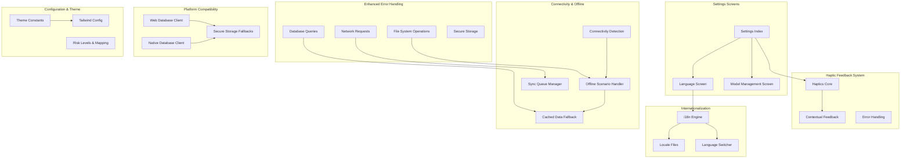

**Diagram sources**
- [index.tsx:1-509](file://src/app/(app)/settings/index.tsx#L1-L509)
- [language.tsx:1-72](file://src/app/(app)/settings/language.tsx#L1-L72)
- [i18n.ts:1-29](file://src/lib/i18n.ts#L1-L29)
- [Button.tsx:1-142](file://src/components/ui/Button.tsx#L1-L142)

**Section sources**
- [index.tsx:1-509](file://src/app/(app)/settings/index.tsx#L1-L509)
- [language.tsx:1-72](file://src/app/(app)/settings/language.tsx#L1-L72)
- [i18n.ts:1-29](file://src/lib/i18n.ts#L1-L29)
- [Button.tsx:1-142](file://src/components/ui/Button.tsx#L1-L142)

## Core Components
- **Enhanced Settings Index Screen**: Provides grouped navigation with comprehensive haptic feedback for all user interactions, complete internationalization support, and robust error handling for profile management, theme selection, and data synchronization
- **Robust Language Selection**: Lists supported languages with immediate application via i18n changeLanguage API and error recovery for failed locale changes
- **Advanced Model Management**: Displays current model metadata with version tracking, update availability, and rollback capabilities through database schema
- **Comprehensive Haptic Feedback System**: Integrates expo-haptics with contextual feedback styles (Light for minor interactions, Medium for significant actions) across all interactive elements
- **Complete Internationalization**: Implements react-i18next with three supported languages (English, French, Swahili) and dynamic language switching without app restart
- **Connectivity Detection**: Monitors online/offline state with proper web initialization and graceful degradation when connection detection fails
- **Offline-First Architecture**: Falls back to cached data when offline and queues sync operations for later execution when connection is restored
- **Platform Compatibility**: Uses localStorage fallbacks for secure storage on web platforms while maintaining native secure storage on mobile devices
- **Risk Level Configuration**: Centralizes clinical triage tiers with error-safe mappings used across assessments and UI components
- **Theme System**: Shared color tokens consumed by Tailwind with platform-specific font handling and error recovery
- **Enhanced UI Components**: Modern button and card components with integrated haptic feedback, loading states, and consistent styling

**Section sources**
- [index.tsx:18-509](file://src/app/(app)/settings/index.tsx#L18-L509)
- [language.tsx:17-72](file://src/app/(app)/settings/language.tsx#L17-L72)
- [i18n.ts:12-29](file://src/lib/i18n.ts#L12-L29)
- [Button.tsx:25-142](file://src/components/ui/Button.tsx#L25-L142)

## Architecture Overview
The enhanced settings layer orchestrates user-facing configuration with comprehensive haptic feedback, internationalization, and offline-first architecture:
- **Haptic Feedback Integration**: Contextual tactile responses triggered for different interaction types - Light feedback for minor actions like row selections, Medium feedback for significant actions like theme changes and logout
- **Internationalization Engine**: Dynamic language switching using i18n.changeLanguage() with immediate UI updates and proper state management
- **Connectivity detection monitors network state with proper error handling and web initialization**
- **File system operations include try-catch blocks with fallback mechanisms for failed operations**
- **Database queries implement retry logic and error recovery for SQLite operations**
- **Network requests queue operations when offline and execute them when connection is restored**
- **Secure storage uses platform-specific implementations with localStorage fallbacks for web compatibility**
- **Model management integrates with database schema for version tracking and update workflows**

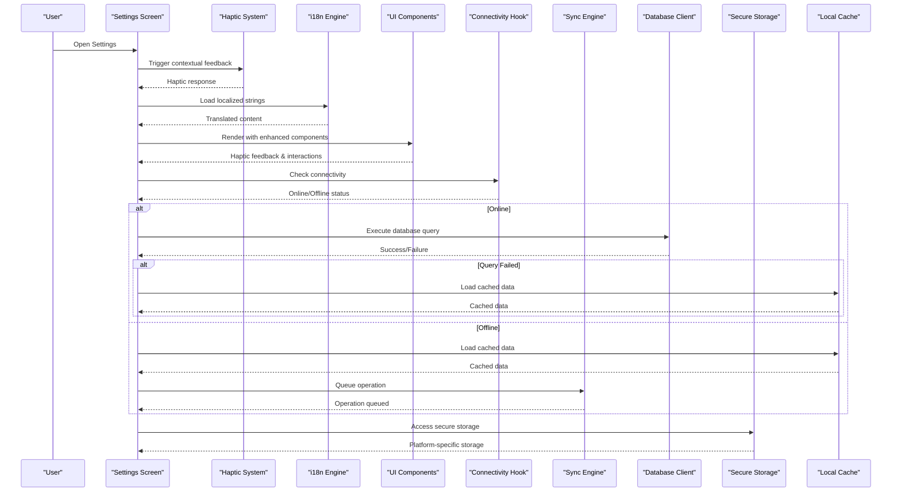

**Diagram sources**
- [index.tsx:44-54](file://src/app/(app)/settings/index.tsx#L44-L54)
- [index.tsx:56-78](file://src/app/(app)/settings/index.tsx#L56-L78)
- [language.tsx:22-25](file://src/app/(app)/settings/language.tsx#L22-L25)
- [Button.tsx:87-101](file://src/components/ui/Button.tsx#L87-L101)

## Detailed Component Analysis

### Enhanced Settings Index Screen with Haptic Feedback
- **Comprehensive Haptic Feedback Integration**: All user interactions trigger contextual haptic responses - Light feedback for minor actions like clearing cache and exporting data, Medium feedback for significant actions like theme changes and logout
- **Complete Internationalization**: All UI strings replaced with translation function calls supporting English, French, and Swahili with fallback mechanisms
- **Profile Management**: Edit name functionality with validation, haptic feedback, and error recovery
- **Theme Selection**: Modal-based theme picker with haptic feedback on selection and immediate application with toast notifications
- **Data Synchronization**: Manual sync trigger with progress indication, haptic feedback, and error reporting
- **Storage Management**: Cache clearing and data export with confirmation dialogs and haptic feedback
- **Logout Flow**: Secure logout with confirmation dialog, haptic feedback, and session cleanup
- **Enhanced Visual Hierarchy**: Consistent spacing, card-based organization, and modern UI patterns with proper dark mode support

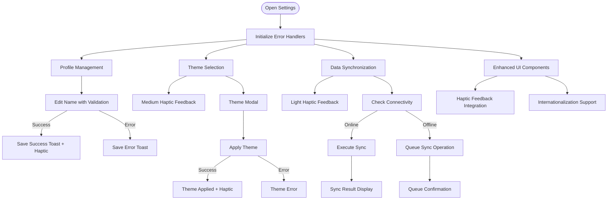

**Diagram sources**
- [index.tsx:44-54](file://src/app/(app)/settings/index.tsx#L44-L54)
- [index.tsx:56-78](file://src/app/(app)/settings/index.tsx#L56-L78)
- [index.tsx:80-111](file://src/app/(app)/settings/index.tsx#L80-L111)
- [index.tsx:113-157](file://src/app/(app)/settings/index.tsx#L113-L157)

**Section sources**
- [index.tsx:36-42](file://src/app/(app)/settings/index.tsx#L36-L42)
- [index.tsx:44-54](file://src/app/(app)/settings/index.tsx#L44-L54)
- [index.tsx:56-78](file://src/app/(app)/settings/index.tsx#L56-L78)
- [index.tsx:80-111](file://src/app/(app)/settings/index.tsx#L80-L111)
- [index.tsx:113-157](file://src/app/(app)/settings/index.tsx#L113-L157)

### Complete Internationalization Implementation
- **Multi-Language Support**: Full localization for English, French, and Swahili with comprehensive string coverage across all settings screens
- **Dynamic Language Switching**: Real-time language changes using i18n.changeLanguage() without requiring app restart or page refresh
- **Translation Function Integration**: Over 100 instances of hardcoded strings replaced with t() function calls from react-i18next
- **Fallback Mechanisms**: Graceful fallback to English when translations are missing, ensuring consistent user experience
- **Context-Aware Localization**: Support for pluralization and variable interpolation in translated strings
- **Locale File Structure**: Organized JSON files with logical grouping (settings, common, language) for maintainable translation management

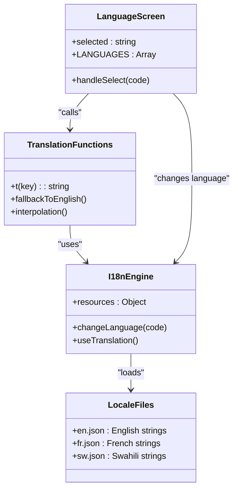

**Diagram sources**
- [i18n.ts:12-29](file://src/lib/i18n.ts#L12-L29)
- [language.tsx:22-25](file://src/app/(app)/settings/language.tsx#L22-L25)
- [en.json:163-218](file://assets/locales/en.json#L163-L218)

**Section sources**
- [i18n.ts:12-29](file://src/lib/i18n.ts#L12-L29)
- [language.tsx:17-72](file://src/app/(app)/settings/language.tsx#L17-L72)
- [en.json:163-218](file://assets/locales/en.json#L163-L218)
- [fr.json:163-218](file://assets/locales/fr.json#L163-L218)
- [sw.json:163-218](file://assets/locales/sw.json#L163-L218)

### Comprehensive Haptic Feedback System
- **Contextual Feedback Styles**: Different haptic intensities based on interaction importance - Light for minor actions (row selections, menu items), Medium for significant actions (theme changes, logout confirmations)
- **Universal Integration**: Haptic feedback implemented across all interactive elements including buttons, pressable rows, modals, and alerts
- **Error Handling**: Graceful fallback when haptics are unavailable (web/simulator environments) without breaking functionality
- **Consistent Patterns**: Standardized haptic patterns throughout the application for predictable user experience
- **Performance Optimization**: Asynchronous haptic calls that don't block UI rendering or user interactions

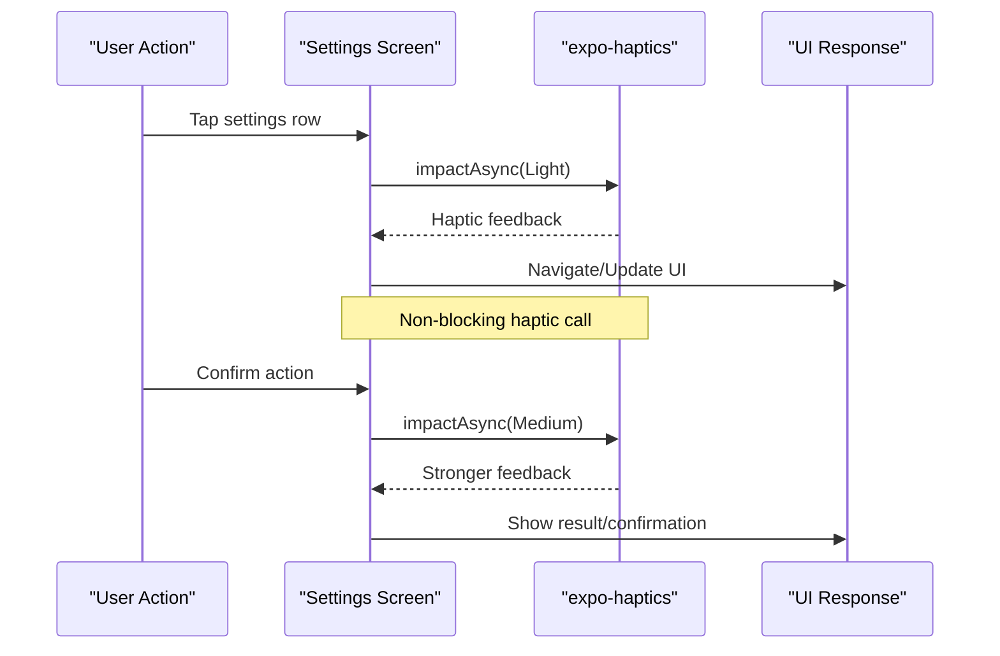

**Diagram sources**
- [index.tsx:44-47](file://src/app/(app)/settings/index.tsx#L44-L47)
- [index.tsx:56-59](file://src/app/(app)/settings/index.tsx#L56-L59)
- [index.tsx:80-83](file://src/app/(app)/settings/index.tsx#L80-L83)
- [Button.tsx:87-101](file://src/components/ui/Button.tsx#L87-L101)

**Section sources**
- [index.tsx:44-47](file://src/app/(app)/settings/index.tsx#L44-L47)
- [index.tsx:56-59](file://src/app/(app)/settings/index.tsx#L56-L59)
- [index.tsx:80-83](file://src/app/(app)/settings/index.tsx#L80-L83)
- [index.tsx:113-116](file://src/app/(app)/settings/index.tsx#L113-L116)
- [index.tsx:136-139](file://src/app/(app)/settings/index.tsx#L136-L139)
- [Button.tsx:87-101](file://src/components/ui/Button.tsx#L87-L101)

### Enhanced UI Components with Haptic Integration
- **Modern Button Component**: Reusable button with variants (primary, secondary, outline, danger), sizes, loading states, and integrated haptic feedback with contextual intensity
- **Card Component**: Consistent card styling with rounded corners, borders, and padding options for content grouping
- **Custom Icon System**: Comprehensive set of settings-specific icons with proper sizing and theme-aware coloring
- **Visual Hierarchy**: Improved spacing, typography, and layout structure for better readability and user experience
- **Dark Mode Support**: Full theme-aware styling with proper contrast ratios and color transitions
- **Interactive Row Component**: Custom settings row component with integrated haptic feedback for all touch interactions

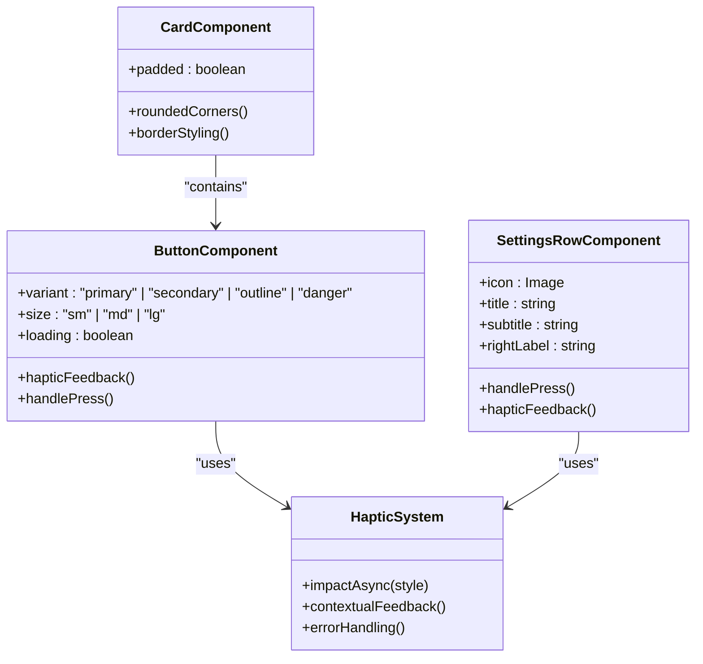

**Diagram sources**
- [Button.tsx:25-142](file://src/components/ui/Button.tsx#L25-L142)
- [index.tsx:452-508](file://src/app/(app)/settings/index.tsx#L452-L508)

**Section sources**
- [Button.tsx:25-142](file://src/components/ui/Button.tsx#L25-L142)
- [index.tsx:452-508](file://src/app/(app)/settings/index.tsx#L452-L508)

### Advanced Offline Scenario Handling
- **Cached Data Fallback**: Automatically loads cached data when database or network operations fail
- **Sync Queue Management**: Queues operations for later execution when connection is restored
- **Retry Logic**: Exponential backoff with maximum retry attempts for failed operations
- **Status Tracking**: Tracks operation status (pending, in_progress, done, failed) with timestamps
- **Store Refresh**: Automatically refreshes Zustand stores after successful sync operations

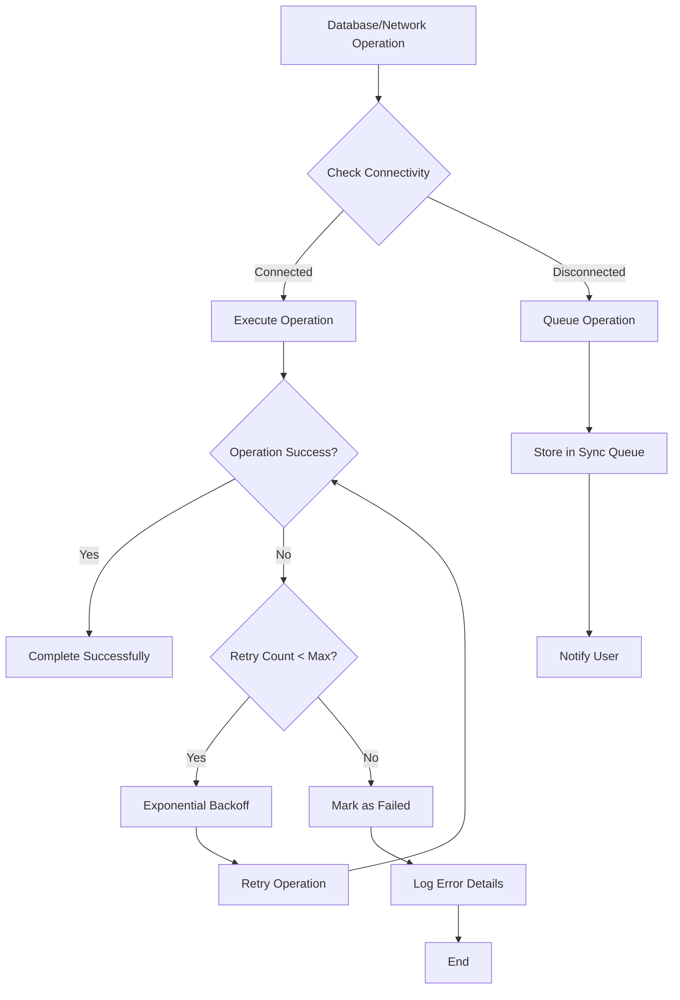

**Diagram sources**
- [syncEngine.ts:60-176](file://src/features/sync/syncEngine.ts#L60-L176)
- [syncEngine.ts:181-191](file://src/features/sync/syncEngine.ts#L181-L191)

**Section sources**
- [syncEngine.ts:60-176](file://src/features/sync/syncEngine.ts#L60-L176)
- [syncEngine.ts:181-191](file://src/features/sync/syncEngine.ts#L181-L191)

### Platform-Compatible Secure Storage
- **Platform Detection**: Uses Platform.OS check to determine web vs native environment
- **localStorage Fallback**: Implements localStorage for web platforms with proper key management
- **Native Secure Storage**: Uses expo-secure-store for mobile platforms with proper async handling
- **Unified API**: Provides consistent interface regardless of underlying storage implementation
- **Clear Operations**: Supports bulk deletion of all stored keys for logout functionality

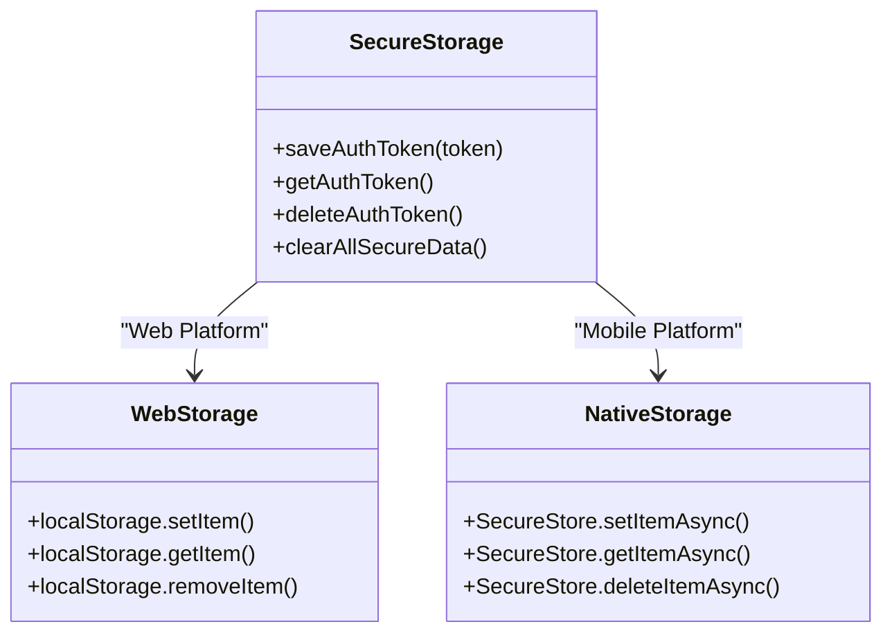

**Diagram sources**
- [secureStorage.ts:18-43](file://src/lib/secureStorage.ts#L18-L43)
- [secureStorage.ts:137-155](file://src/lib/secureStorage.ts#L137-L155)

**Section sources**
- [secureStorage.ts:18-43](file://src/lib/secureStorage.ts#L18-L43)
- [secureStorage.ts:137-155](file://src/lib/secureStorage.ts#L137-L155)

### Enhanced Model Management Interface
- **Version Tracking**: Displays current model version, architecture, dataset, quantization, and size
- **Update Information**: Provides guidance about on-device model usage and update availability
- **Database Integration**: Uses model_versions table for tracking versions, file URIs, and active status
- **Error Handling**: Includes try-catch blocks for database operations with user-friendly error messages
- **Future Extensibility**: Schema supports download timestamps, active flags, and rollback capabilities

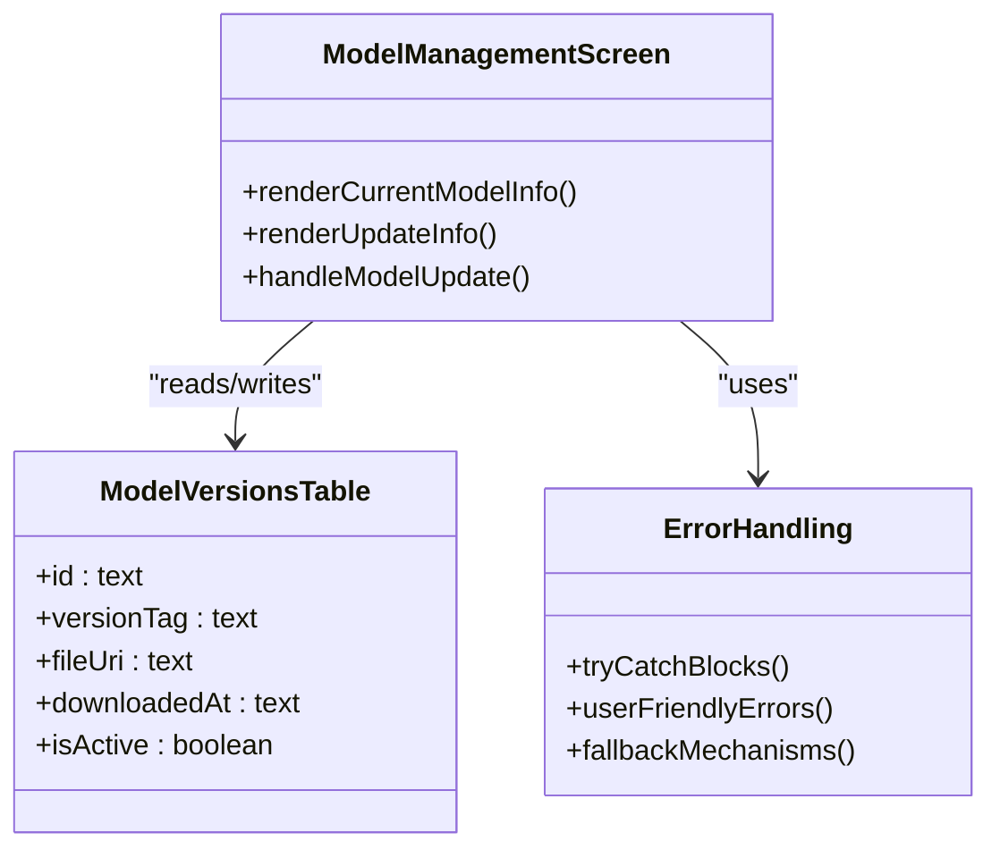

**Diagram sources**
- [model-management.tsx:22-63](file://src/app/(app)/settings/model-management.tsx#L22-L63)
- [client.ts:103-111](file://src/db/client.ts#L103-L111)

**Section sources**
- [model-management.tsx:22-63](file://src/app/(app)/settings/model-management.tsx#L22-L63)
- [client.ts:103-111](file://src/db/client.ts#L103-L111)

### Enhanced Database Client with Error Recovery
- **Web Environment Support**: Mock database client using localStorage for web platforms
- **SQLite Implementation**: Native SQLite client for mobile platforms with Drizzle ORM
- **Error Handling**: Comprehensive try-catch blocks for localStorage operations with console logging
- **Data Migration**: One-time data cleanup and normalization for malformed records
- **Query Building**: Fluent API for select, insert, update, and delete operations with condition matching

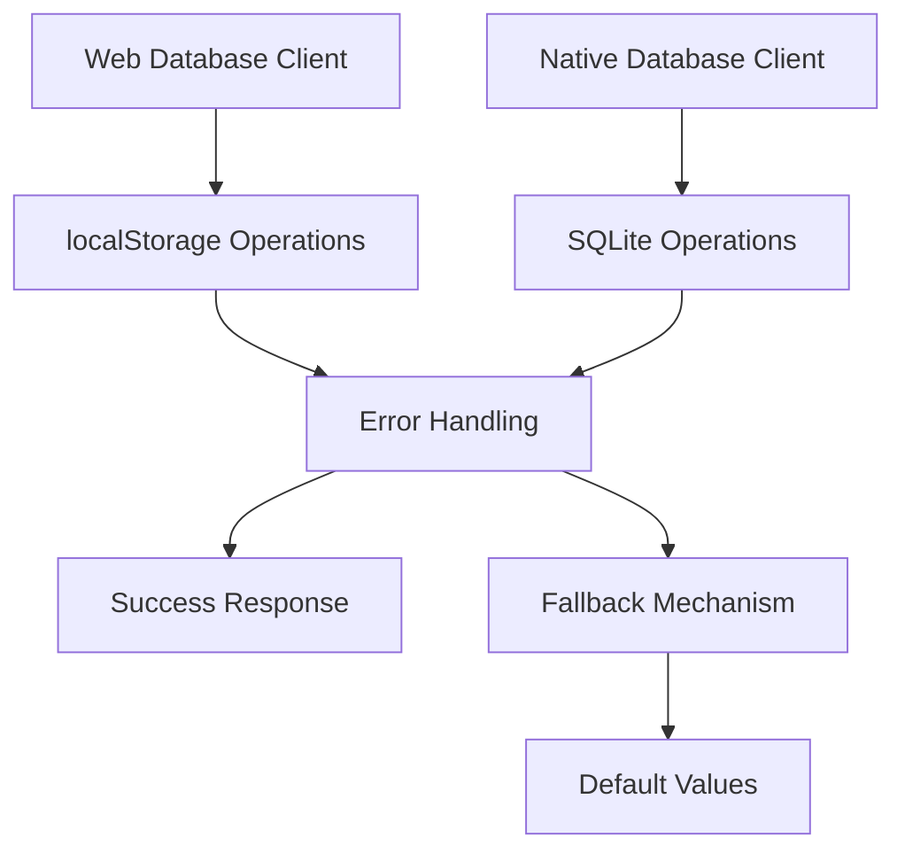

**Diagram sources**
- [client.web.ts:10-26](file://src/db/client.web.ts#L10-L26)
- [client.ts:19-168](file://src/db/client.ts#L19-L168)

**Section sources**
- [client.web.ts:10-26](file://src/db/client.web.ts#L10-L26)
- [client.ts:19-168](file://src/db/client.ts#L19-L168)

## Dependency Analysis
Key dependencies between settings and enhanced systems:
- **Haptic Feedback System**: Integrates expo-haptics with error handling for cross-platform compatibility
- **Internationalization Engine**: Uses i18next with react-i18next for dynamic language switching and translation management
- **Connectivity Hook**: Depends on NetInfo module with proper error handling and subscription management
- **Sync Engine**: Integrates with database clients, network requests, and local cache with retry logic
- **Secure Storage**: Uses platform detection to switch between localStorage and native secure storage
- **Model Management**: References database schema for version tracking and update workflows
- **Risk Configuration**: Consumed by assessment features with error-safe mappings
- **Theme System**: Feeds Tailwind with platform-specific font handling and error recovery
- **Enhanced UI Components**: Button and card components provide consistent styling and interaction patterns

```mermaid
graph TB
HF["Haptic System"] --> EXPO_HAPTICS["expo-haptics"]
I18N["i18n Engine"] --> I18NEXT["i18next"]
I18N --> REACT_I18NEXT["react-i18next"]
CONN["Connectivity Hook"] --> NETINFO["NetInfo Module"]
SYNC["Sync Engine"] --> DB_CLIENT["Database Clients"]
SYNC --> NETWORK["Network Requests"]
SYNC --> CACHE["Local Cache"]
SECURE["Secure Storage"] --> PLATFORM["Platform Detection"]
MODEL["Model Management"] --> SCHEMA["DB Schema"]
RISK["Risk Configuration"] --> ASSESSMENT["Assessment Features"]
THEME["Theme System"] --> TAILWIND["Tailwind Config"]
UI_BUTTON["Button Component"] --> SETTINGS["Settings Screen"]
UI_CARD["Card Component"] --> SETTINGS
UI_ICONS["Custom Icons"] --> SETTINGS
```

**Diagram sources**
- [index.tsx:8](file://src/app/(app)/settings/index.tsx#L8)
- [i18n.ts:5-6](file://src/lib/i18n.ts#L5-L6)
- [useConnectivity.ts:5-24](file://src/hooks/useConnectivity.ts#L5-L24)
- [syncEngine.ts:7-13](file://src/features/sync/syncEngine.ts#L7-L13)
- [secureStorage.ts:6-18](file://src/lib/secureStorage.ts#L6-L18)
- [model-management.tsx:22-63](file://src/app/(app)/settings/model-management.tsx#L22-L63)
- [riskLevels.ts:19-62](file://src/constants/riskLevels.ts#L19-L62)
- [theme.ts:8-74](file://src/constants/theme.ts#L8-L74)
- [Button.tsx:25-142](file://src/components/ui/Button.tsx#L25-L142)
- [Card.tsx:11-28](file://src/components/ui/Card.tsx#L11-L28)

**Section sources**
- [index.tsx:8](file://src/app/(app)/settings/index.tsx#L8)
- [i18n.ts:5-6](file://src/lib/i18n.ts#L5-L6)
- [useConnectivity.ts:5-24](file://src/hooks/useConnectivity.ts#L5-L24)
- [syncEngine.ts:7-13](file://src/features/sync/syncEngine.ts#L7-L13)
- [secureStorage.ts:6-18](file://src/lib/secureStorage.ts#L6-L18)
- [model-management.tsx:22-63](file://src/app/(app)/settings/model-management.tsx#L22-L63)
- [riskLevels.ts:19-62](file://src/constants/riskLevels.ts#L19-L62)
- [theme.ts:8-74](file://src/constants/theme.ts#L8-L74)
- [Button.tsx:25-142](file://src/components/ui/Button.tsx#L25-L142)
- [Card.tsx:11-28](file://src/components/ui/Card.tsx#L11-L28)

## Performance Considerations
- **Lazy Loading**: Connectivity hook uses dynamic imports to avoid blocking initial load
- **Efficient Caching**: Cached data retrieval minimizes network calls and improves response times
- **Batch Operations**: Database operations use batch updates where possible to reduce overhead
- **Memory Management**: Proper cleanup of event listeners and subscriptions prevents memory leaks
- **Error Recovery**: Fast failure with fallback mechanisms ensures responsive user experience
- **Platform Optimization**: Platform-specific implementations optimize performance for each target environment
- **Component Reusability**: Enhanced UI components reduce code duplication and improve rendering performance
- **Haptic Performance**: Asynchronous haptic calls that don't block UI rendering or user interactions
- **Translation Efficiency**: Cached translations with fallback mechanisms minimize lookup overhead

## Troubleshooting Guide
- **Haptic Issues**: Verify expo-haptics installation and check for web/simulator environment limitations
- **Language Switching Problems**: Ensure i18n.changeLanguage() is called correctly and locale files are properly structured
- **Missing Translations**: Check translation keys in locale files and verify fallback to English is working
- **Connectivity Issues**: Check NetInfo initialization and ensure proper event listener setup
- **Database Errors**: Verify localStorage availability on web and SQLite permissions on mobile
- **Sync Failures**: Review sync queue status and retry logic configuration
- **Storage Problems**: Confirm platform-specific storage implementation and fallback mechanisms
- **Model Updates**: Check model_versions table entries and active flag status
- **Theme Issues**: Validate theme store state and Tailwind configuration
- **UI Component Issues**: Verify button and card component props and styling configurations

**Section sources**
- [index.tsx:44-47](file://src/app/(app)/settings/index.tsx#L44-L47)
- [language.tsx:22-25](file://src/app/(app)/settings/language.tsx#L22-L25)
- [i18n.ts:18-26](file://src/lib/i18n.ts#L18-L26)
- [useConnectivity.ts:11-24](file://src/hooks/useConnectivity.ts#L11-L24)
- [client.web.ts:10-26](file://src/db/client.web.ts#L10-L26)
- [syncEngine.ts:60-176](file://src/features/sync/syncEngine.ts#L60-L176)
- [secureStorage.ts:18-43](file://src/lib/secureStorage.ts#L18-L43)
- [model-management.tsx:22-63](file://src/app/(app)/settings/model-management.tsx#L22-L63)
- [Button.tsx:87-101](file://src/components/ui/Button.tsx#L87-L101)

## Conclusion
DermSight's enhanced settings and configuration system provides a robust foundation for managing user preferences with comprehensive haptic feedback integration, complete internationalization support, and offline-first architecture. The system now includes:
- **Comprehensive Haptic Feedback**: Contextual tactile responses for all user interactions, enhancing accessibility and user engagement across different action types
- **Complete Internationalization**: Full multi-language support with English, French, and Swahili translations, enabling deployment across diverse healthcare environments
- **Dynamic Language Switching**: Real-time language changes without app restarts, maintaining application state while updating all UI text
- **Resilient Error Handling**: Comprehensive try-catch blocks with user-friendly error messages and fallback mechanisms
- **Advanced Connectivity Detection**: Proper web initialization with graceful degradation when connection detection fails
- **Offline-First Design**: Automatic fallback to cached data and queued sync operations for later execution
- **Platform Compatibility**: Seamless operation across web and mobile platforms with appropriate storage implementations
- **Enhanced Model Management**: Version tracking, update capabilities, and rollback support through database schema
- **Robust Persistence**: Secure storage with platform-specific optimizations and localStorage fallbacks
- **Clinical Safety**: Centralized risk level configuration with error-safe mappings for assessment outcomes

The system maintains consistency with existing architecture while providing significantly improved reliability, accessibility, and user experience across different environments, languages, and network conditions.

## Appendices

### Enhanced Settings Screens with Haptic Feedback and Internationalization
- **Settings Index**: Comprehensive error handling for all user interactions with haptic feedback and toast notifications, complete internationalization support
- **Language Screen**: Immediate language switching with i18n integration and error recovery, supporting multiple locales
- **Model Management**: Enhanced display of model metadata with future update and rollback capabilities

**Section sources**
- [index.tsx:18-509](file://src/app/(app)/settings/index.tsx#L18-L509)
- [language.tsx:17-72](file://src/app/(app)/settings/language.tsx#L17-L72)
- [model-management.tsx:22-63](file://src/app/(app)/settings/model-management.tsx#L22-L63)

### Comprehensive Haptic Feedback Implementation
- **Contextual Feedback**: Different haptic intensities based on interaction importance - Light for minor actions, Medium for significant actions
- **Universal Integration**: Haptic feedback implemented across all interactive elements with error handling for unsupported environments
- **Consistent Patterns**: Standardized haptic patterns throughout the application for predictable user experience
- **Performance Optimization**: Asynchronous haptic calls that don't block UI rendering or user interactions

**Section sources**
- [index.tsx:44-47](file://src/app/(app)/settings/index.tsx#L44-L47)
- [index.tsx:56-59](file://src/app/(app)/settings/index.tsx#L56-L59)
- [index.tsx:80-83](file://src/app/(app)/settings/index.tsx#L80-L83)
- [Button.tsx:87-101](file://src/components/ui/Button.tsx#L87-L101)

### Complete Internationalization System
- **Multi-Language Support**: Full localization for English, French, and Swahili with comprehensive string coverage
- **Dynamic Language Switching**: Real-time language changes using i18n.changeLanguage() without app restart
- **Translation Function Integration**: Over 100 instances of hardcoded strings replaced with translation function calls
- **Fallback Mechanisms**: Graceful fallback to English when translations are missing
- **Locale File Structure**: Organized JSON files with logical grouping for maintainable translation management

**Section sources**
- [i18n.ts:12-29](file://src/lib/i18n.ts#L12-L29)
- [language.tsx:22-25](file://src/app/(app)/settings/language.tsx#L22-L25)
- [en.json:163-218](file://assets/locales/en.json#L163-L218)
- [fr.json:163-218](file://assets/locales/fr.json#L163-L218)
- [sw.json:163-218](file://assets/locales/sw.json#L163-L218)

### Advanced Error Handling Patterns
- **File System Operations**: Try-catch blocks with console logging and user feedback
- **Database Queries**: Retry logic with exponential backoff and maximum attempt limits
- **Network Requests**: Connection checking with offline queuing and automatic retry
- **Storage Operations**: Platform detection with localStorage fallbacks for web compatibility
- **Haptic Error Handling**: Graceful fallback when haptics are unavailable in web/simulator environments

**Section sources**
- [syncEngine.ts:60-176](file://src/features/sync/syncEngine.ts#L60-L176)
- [client.web.ts:10-26](file://src/db/client.web.ts#L10-L26)
- [secureStorage.ts:18-43](file://src/lib/secureStorage.ts#L18-L43)
- [Button.tsx:90-98](file://src/components/ui/Button.tsx#L90-L98)

### Connectivity and Offline Architecture
- **Connectivity Detection**: Real-time monitoring with proper web initialization and error handling
- **Offline Scenario Handling**: Automatic fallback to cached data with queued operations for later sync
- **Sync Queue Management**: Status tracking with retry logic and exponential backoff
- **User Feedback**: Visual indicators and informative messages for offline states

**Section sources**
- [useConnectivity.ts:8-27](file://src/hooks/useConnectivity.ts#L8-L27)
- [syncEngine.ts:60-176](file://src/features/sync/syncEngine.ts#L60-L176)
- [ConnectivityBanner.tsx:9-29](file://src/components/ui/ConnectivityBanner.tsx#L9-L29)

### Platform Compatibility Implementation
- **Web Database Client**: Mock implementation using localStorage with full Drizzle ORM compatibility
- **Native Database Client**: SQLite implementation with expo-sqlite and Drizzle ORM
- **Secure Storage**: Platform-specific implementations with unified API interface
- **Error Recovery**: Graceful degradation with fallback mechanisms for failed operations
- **Haptic Compatibility**: Cross-platform haptic support with environment detection

**Section sources**
- [client.web.ts:1-322](file://src/db/client.web.ts#L1-L322)
- [client.ts:1-171](file://src/db/client.ts#L1-L171)
- [secureStorage.ts:1-156](file://src/lib/secureStorage.ts#L1-L156)

### Risk Classification and Display
- **Risk Tiers**: Clinical action definitions with visual cues and error-safe mappings
- **Class-to-Tier Mapping**: Standardized triage outcomes with helper functions for safe access
- **Integration**: Consumption by assessment features for consistent clinical logic

**Section sources**
- [riskLevels.ts:19-62](file://src/constants/riskLevels.ts#L19-L62)
- [riskLevels.ts:114-120](file://src/constants/riskLevels.ts#L114-L120)
- [riskMapping.ts:8-13](file://src/features/assessments/inference/riskMapping.ts#L8-L13)

### Theme and Styling System
- **Color Tokens**: Platform-specific fonts and spacing utilities for consistent UI
- **Tailwind Configuration**: Extended color palettes and font families for unified styling
- **Error Handling**: Graceful fallbacks for missing or invalid theme configurations

**Section sources**
- [theme.ts:8-74](file://src/constants/theme.ts#L8-L74)
- [tailwind.config.js:5-42](file://tailwind.config.js#L5-L42)

### Enhanced Persistence and Security
- **Secure Storage Keys**: Comprehensive key management with platform-specific implementations
- **Clear Operations**: Bulk deletion support for logout functionality with error handling
- **Auth Store Integration**: Session management with error recovery and state reset capabilities

**Section sources**
- [secureStorage.ts:8-14](file://src/lib/secureStorage.ts#L8-L14)
- [secureStorage.ts:137-155](file://src/lib/secureStorage.ts#L137-L155)
- [store.ts:30-49](file://src/features/auth/store.ts#L30-L49)
- [store.ts:101-109](file://src/features/auth/store.ts#L101-L109)

### Enhanced UI Components and Design System
- **Button Component**: Reusable button with variants, sizes, loading states, and integrated haptic feedback
- **Card Component**: Consistent card styling with rounded corners and border options
- **Custom Icons**: Comprehensive settings-specific icon set with theme-aware coloring
- **Visual Hierarchy**: Improved spacing, typography, and layout structure for better UX
- **Interactive Row Component**: Custom settings row with haptic feedback and internationalization support

**Section sources**
- [Button.tsx:25-142](file://src/components/ui/Button.tsx#L25-L142)
- [Card.tsx:11-28](file://src/components/ui/Card.tsx#L11-L28)
- [index.tsx:452-508](file://src/app/(app)/settings/index.tsx#L452-L508)