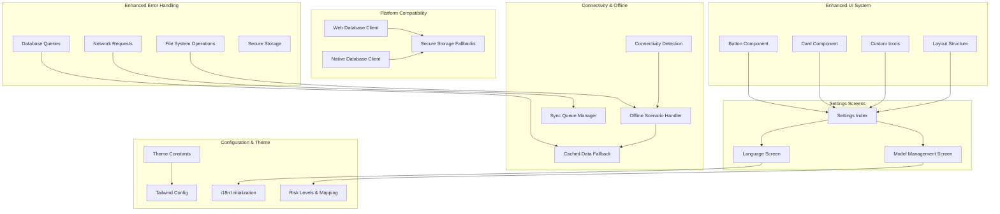
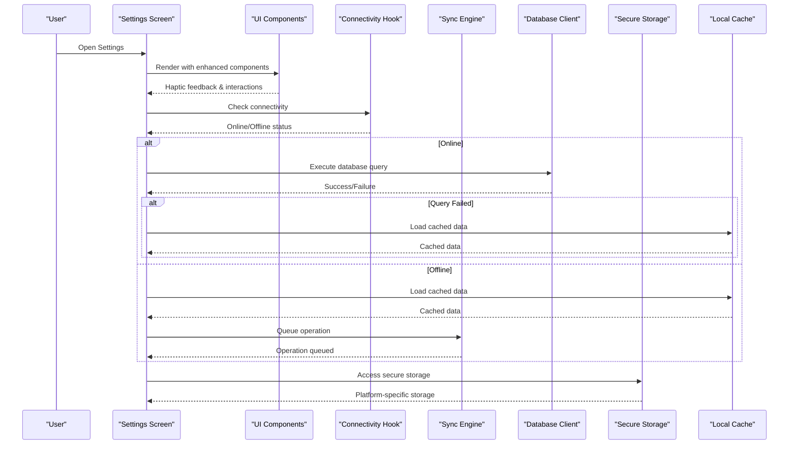
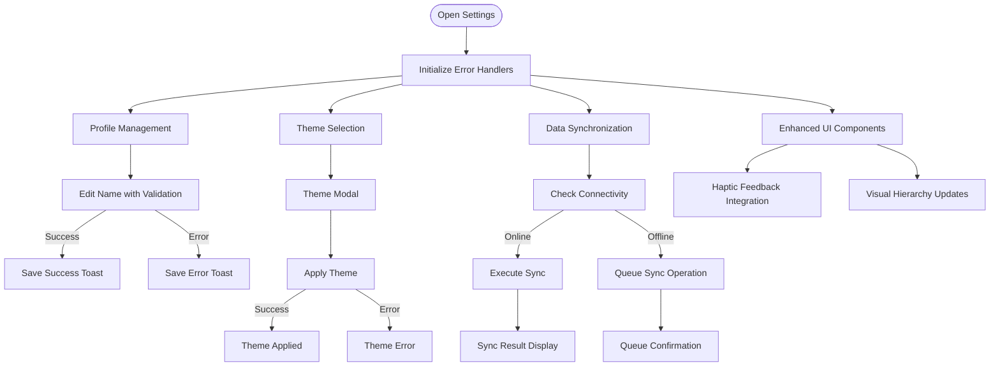
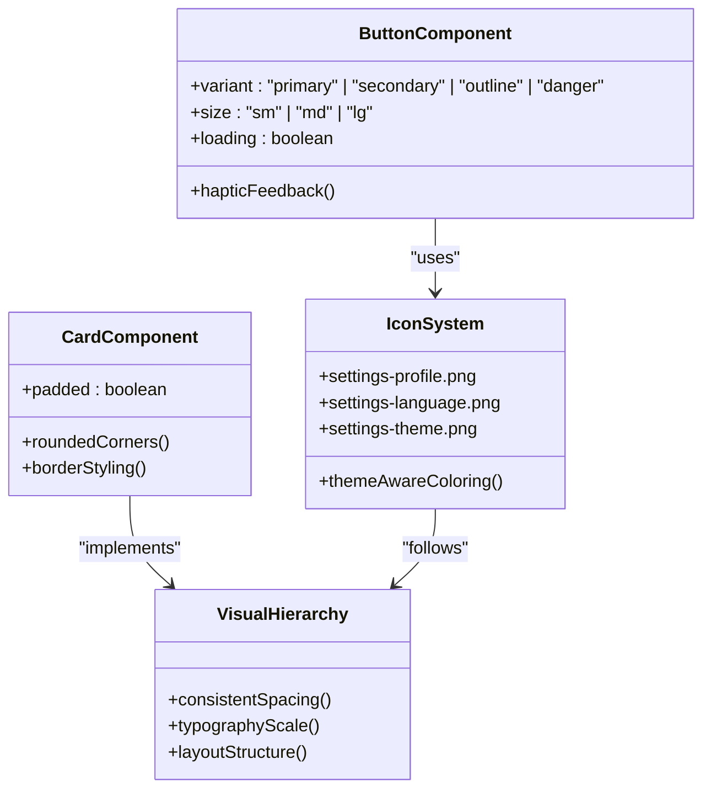
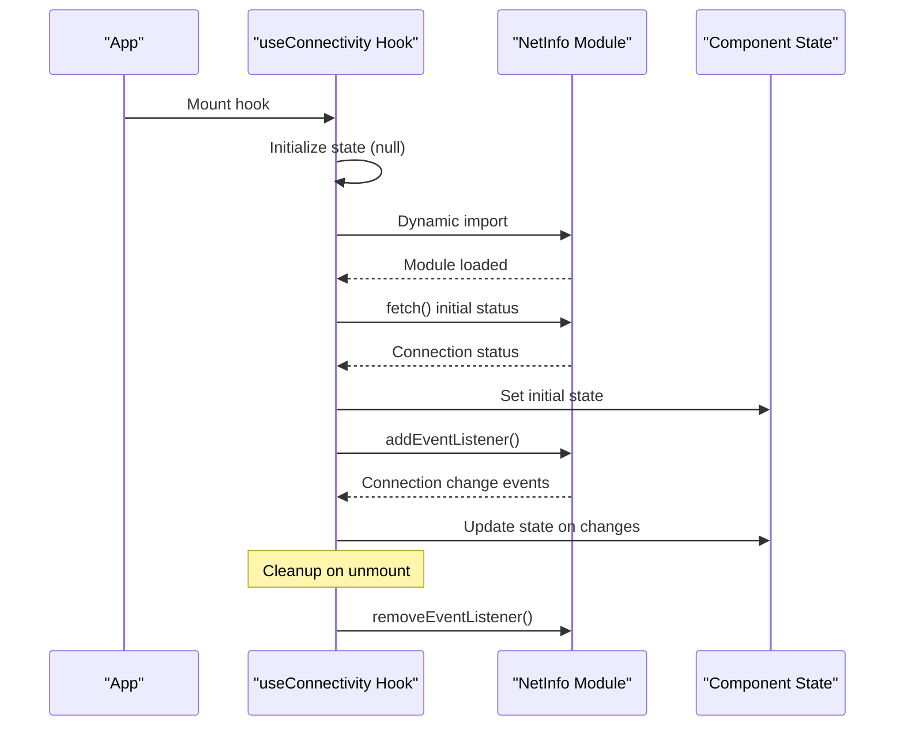
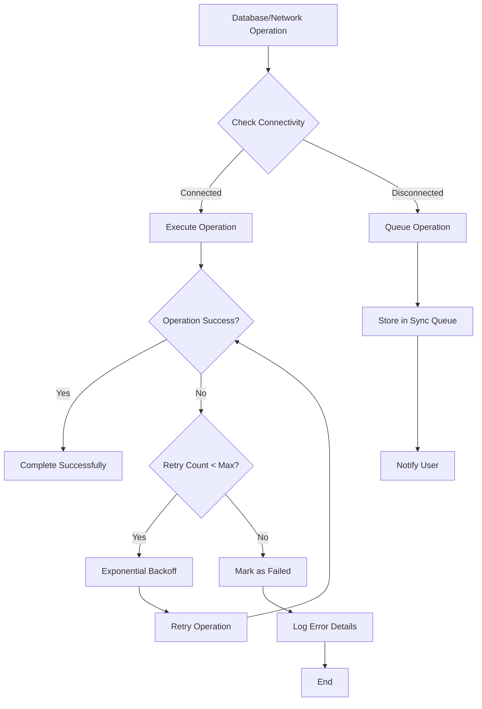
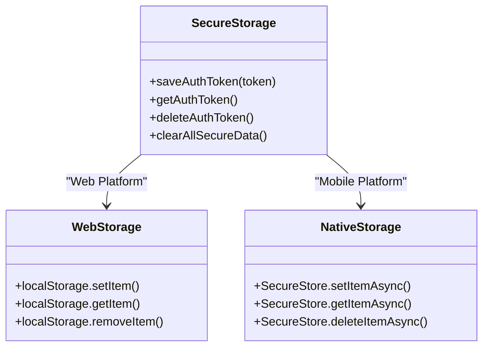
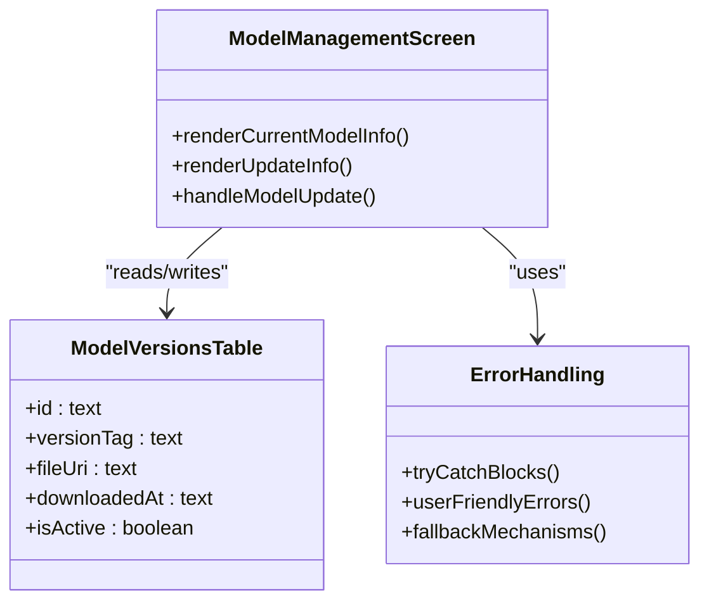
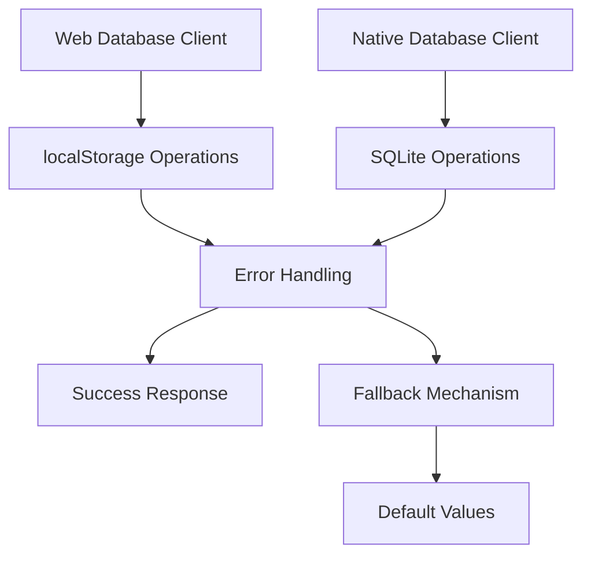
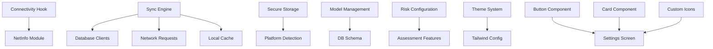

# Settings and Configuration

<cite>
**Referenced Files in This Document**
- [index.tsx](file://src/app/(app)/settings/index.tsx)
- [language.tsx](file://src/app/(app)/settings/language.tsx)
- [model-management.tsx](file://src/app/(app)/settings/model-management.tsx)
- [riskLevels.ts](file://src/constants/riskLevels.ts)
- [theme.ts](file://src/constants/theme.ts)
- [tailwind.config.js](file://tailwind.config.js)
- [i18n.ts](file://src/lib/i18n.ts)
- [riskMapping.ts](file://src/features/assessments/inference/riskMapping.ts)
- [store.ts](file://src/features/auth/store.ts)
- [secureStorage.ts](file://src/lib/secureStorage.ts)
- [schema.ts](file://src/db/schema.ts)
- [en.json](file://assets/locales/en.json)
- [useConnectivity.ts](file://src/hooks/useConnectivity.ts)
- [netinfo.ts](file://src/lib/netinfo.ts)
- [syncEngine.ts](file://src/features/sync/syncEngine.ts)
- [client.ts](file://src/db/client.ts)
- [client.web.ts](file://src/db/client.web.ts)
- [ConnectivityBanner.tsx](file://src/components/ui/ConnectivityBanner.tsx)
- [Button.tsx](file://src/components/ui/Button.tsx)
- [Card.tsx](file://src/components/ui/Card.tsx)
</cite>

## Update Summary
**Changes Made**
- Enhanced settings interface with updated icon usage and improved layout structure to maintain consistency with new design language
- Improved visual hierarchy with better spacing, card-based organization, and modern UI patterns
- Updated styling with consistent dark mode support and theme-aware components
- Enhanced user experience with haptic feedback and improved interaction patterns
- Refined settings row components with better visual indicators and accessibility

## Table of Contents
1. [Introduction](#introduction)
2. [Project Structure](#project-structure)
3. [Core Components](#core-components)
4. [Architecture Overview](#architecture-overview)
5. [Detailed Component Analysis](#detailed-component-analysis)
6. [Dependency Analysis](#dependency-analysis)
7. [Performance Considerations](#performance-considerations)
8. [Troubleshooting Guide](#troubleshooting-guide)
9. [Conclusion](#conclusion)
10. [Appendices](#appendices)

## Introduction
This document explains DermSight's enhanced settings and configuration system with comprehensive error handling, connectivity detection, and offline-first architecture. The system now provides:
- Robust error handling for file system operations, database queries, and network requests
- Advanced connectivity detection with proper web initialization and offline scenario handling
- Graceful offline operation with cached data fallback and queued sync operations
- Platform compatibility improvements for secure storage with localStorage fallbacks
- Enhanced model management interface with version tracking and update capabilities
- Comprehensive settings persistence with preference management and dynamic updates
- Risk level configuration for clinical thresholds and classification criteria
- Theme system using Tailwind CSS for consistent styling across platforms
- **Updated Design System**: Enhanced visual hierarchy with modern UI patterns, consistent iconography, and improved user experience

## Project Structure
The settings surface is organized under app routes with dedicated screens for general settings, language selection, and model management. Supporting configuration includes enhanced error handling, connectivity detection, and platform-specific implementations.

**Diagram sources**
- [index.tsx:1-477](file://src/app/(app)/settings/index.tsx#L1-L477)
- [language.tsx:1-68](file://src/app/(app)/settings/language.tsx#L1-L68)
- [model-management.tsx:1-68](file://src/app/(app)/settings/model-management.tsx#L1-L68)
- [Button.tsx:1-142](file://src/components/ui/Button.tsx#L1-L142)
- [Card.tsx:1-28](file://src/components/ui/Card.tsx#L1-L28)

**Section sources**
- [index.tsx:1-477](file://src/app/(app)/settings/index.tsx#L1-L477)
- [language.tsx:1-68](file://src/app/(app)/settings/language.tsx#L1-L68)
- [model-management.tsx:1-68](file://src/app/(app)/settings/model-management.tsx#L1-L68)
- [Button.tsx:1-142](file://src/components/ui/Button.tsx#L1-L142)
- [Card.tsx:1-28](file://src/components/ui/Card.tsx#L1-L28)

## Core Components
- **Enhanced Settings Index Screen**: Provides grouped navigation with comprehensive error handling for all user interactions, including profile management, theme selection, and data synchronization
- **Robust Language Selection**: Lists supported languages with immediate application via i18n and error recovery for failed locale changes
- **Advanced Model Management**: Displays current model metadata with version tracking, update availability, and rollback capabilities through database schema
- **Comprehensive Error Handling**: Implements try-catch blocks with user-friendly error messages for file system operations, database queries, and network requests
- **Connectivity Detection**: Monitors online/offline state with proper web initialization and graceful degradation when connection detection fails
- **Offline-First Architecture**: Falls back to cached data when offline and queues sync operations for later execution when connection is restored
- **Platform Compatibility**: Uses localStorage fallbacks for secure storage on web platforms while maintaining native secure storage on mobile devices
- **Risk Level Configuration**: Centralizes clinical triage tiers with error-safe mappings used across assessments and UI components
- **Theme System**: Shared color tokens consumed by Tailwind with platform-specific font handling and error recovery
- **Enhanced UI Components**: Modern button and card components with haptic feedback, loading states, and consistent styling

**Section sources**
- [index.tsx:17-477](file://src/app/(app)/settings/index.tsx#L17-L477)
- [language.tsx:16-64](file://src/app/(app)/settings/language.tsx#L16-L64)
- [model-management.tsx:22-63](file://src/app/(app)/settings/model-management.tsx#L22-L63)
- [Button.tsx:25-142](file://src/components/ui/Button.tsx#L25-L142)
- [Card.tsx:11-28](file://src/components/ui/Card.tsx#L11-L28)

## Architecture Overview
The enhanced settings layer orchestrates user-facing configuration with comprehensive error handling and offline-first architecture:
- Connectivity detection monitors network state with proper error handling and web initialization
- File system operations include try-catch blocks with fallback mechanisms for failed operations
- Database queries implement retry logic and error recovery for SQLite operations
- Network requests queue operations when offline and execute them when connection is restored
- Secure storage uses platform-specific implementations with localStorage fallbacks for web compatibility
- Model management integrates with database schema for version tracking and update workflows
- **Enhanced UI Architecture**: Modern component-based design with reusable buttons, cards, and consistent visual hierarchy

**Diagram sources**
- [index.tsx:69-93](file://src/app/(app)/settings/index.tsx#L69-L93)
- [Button.tsx:87-101](file://src/components/ui/Button.tsx#L87-L101)
- [useConnectivity.ts:11-24](file://src/hooks/useConnectivity.ts#L11-L24)

## Detailed Component Analysis

### Enhanced Settings Index Screen
- **Comprehensive Error Handling**: All user interactions wrapped in try-catch blocks with haptic feedback and toast notifications
- **Profile Management**: Edit name functionality with validation and error recovery
- **Theme Selection**: Modal-based theme picker with immediate application and error handling
- **Data Synchronization**: Manual sync trigger with progress indication and error reporting
- **Storage Management**: Cache clearing and data export with confirmation dialogs
- **Logout Flow**: Secure logout with confirmation and session cleanup
- **Updated Design**: Enhanced visual hierarchy with consistent spacing, card-based organization, and modern UI patterns

**Diagram sources**
- [index.tsx:34-40](file://src/app/(app)/settings/index.tsx#L34-L40)
- [index.tsx:42-49](file://src/app/(app)/settings/index.tsx#L42-L49)
- [index.tsx:69-93](file://src/app/(app)/settings/index.tsx#L69-L93)

**Section sources**
- [index.tsx:34-40](file://src/app/(app)/settings/index.tsx#L34-L40)
- [index.tsx:42-49](file://src/app/(app)/settings/index.tsx#L42-L49)
- [index.tsx:69-93](file://src/app/(app)/settings/index.tsx#L69-L93)
- [index.tsx:95-133](file://src/app/(app)/settings/index.tsx#L95-L133)

### Enhanced UI Components and Design System
- **Modern Button Component**: Reusable button with variants (primary, secondary, outline, danger), sizes, loading states, and haptic feedback integration
- **Card Component**: Consistent card styling with rounded corners, borders, and padding options for content grouping
- **Custom Icon System**: Comprehensive set of settings-specific icons with proper sizing and theme-aware coloring
- **Visual Hierarchy**: Improved spacing, typography, and layout structure for better readability and user experience
- **Dark Mode Support**: Full theme-aware styling with proper contrast ratios and color transitions

**Diagram sources**
- [Button.tsx:25-142](file://src/components/ui/Button.tsx#L25-L142)
- [Card.tsx:11-28](file://src/components/ui/Card.tsx#L11-L28)
- [index.tsx:420-477](file://src/app/(app)/settings/index.tsx#L420-L477)

**Section sources**
- [Button.tsx:25-142](file://src/components/ui/Button.tsx#L25-L142)
- [Card.tsx:11-28](file://src/components/ui/Card.tsx#L11-L28)
- [index.tsx:420-477](file://src/app/(app)/settings/index.tsx#L420-L477)

### Enhanced Connectivity Detection
- **Proper Web Initialization**: Dynamic import of NetInfo module to avoid web initialization issues
- **Graceful Error Handling**: Try-catch blocks around initial connectivity checks with console warnings
- **State Management**: Maintains connection state with null safety for loading states
- **Subscription Management**: Proper cleanup of event listeners to prevent memory leaks
- **Offline Indicators**: Real-time connectivity status updates with visual feedback

**Diagram sources**
- [useConnectivity.ts:11-24](file://src/hooks/useConnectivity.ts#L11-L24)
- [netinfo.ts:15-26](file://src/lib/netinfo.ts#L15-L26)

**Section sources**
- [useConnectivity.ts:8-27](file://src/hooks/useConnectivity.ts#L8-L27)
- [netinfo.ts:15-26](file://src/lib/netinfo.ts#L15-L26)

### Advanced Offline Scenario Handling
- **Cached Data Fallback**: Automatically loads cached data when database or network operations fail
- **Sync Queue Management**: Queues operations for later execution when connection is restored
- **Retry Logic**: Exponential backoff with maximum retry attempts for failed operations
- **Status Tracking**: Tracks operation status (pending, in_progress, done, failed) with timestamps
- **Store Refresh**: Automatically refreshes Zustand stores after successful sync operations

**Diagram sources**
- [syncEngine.ts:60-176](file://src/features/sync/syncEngine.ts#L60-L176)
- [syncEngine.ts:181-191](file://src/features/sync/syncEngine.ts#L181-L191)

**Section sources**
- [syncEngine.ts:60-176](file://src/features/sync/syncEngine.ts#L60-L176)
- [syncEngine.ts:181-191](file://src/features/sync/syncEngine.ts#L181-L191)

### Platform-Compatible Secure Storage
- **Platform Detection**: Uses Platform.OS check to determine web vs native environment
- **localStorage Fallback**: Implements localStorage for web platforms with proper key management
- **Native Secure Storage**: Uses expo-secure-store for mobile platforms with proper async handling
- **Unified API**: Provides consistent interface regardless of underlying storage implementation
- **Clear Operations**: Supports bulk deletion of all stored keys for logout functionality

**Diagram sources**
- [secureStorage.ts:18-43](file://src/lib/secureStorage.ts#L18-L43)
- [secureStorage.ts:137-155](file://src/lib/secureStorage.ts#L137-L155)

**Section sources**
- [secureStorage.ts:18-43](file://src/lib/secureStorage.ts#L18-L43)
- [secureStorage.ts:137-155](file://src/lib/secureStorage.ts#L137-L155)

### Enhanced Model Management Interface
- **Version Tracking**: Displays current model version, architecture, dataset, quantization, and size
- **Update Information**: Provides guidance about on-device model usage and update availability
- **Database Integration**: Uses model_versions table for tracking versions, file URIs, and active status
- **Error Handling**: Includes try-catch blocks for database operations with user-friendly error messages
- **Future Extensibility**: Schema supports download timestamps, active flags, and rollback capabilities

**Diagram sources**
- [model-management.tsx:22-63](file://src/app/(app)/settings/model-management.tsx#L22-L63)
- [client.ts:103-111](file://src/db/client.ts#L103-L111)

**Section sources**
- [model-management.tsx:22-63](file://src/app/(app)/settings/model-management.tsx#L22-L63)
- [client.ts:103-111](file://src/db/client.ts#L103-L111)

### Enhanced Database Client with Error Recovery
- **Web Environment Support**: Mock database client using localStorage for web platforms
- **SQLite Implementation**: Native SQLite client for mobile platforms with Drizzle ORM
- **Error Handling**: Comprehensive try-catch blocks for localStorage operations with console logging
- **Data Migration**: One-time data cleanup and normalization for malformed records
- **Query Building**: Fluent API for select, insert, update, and delete operations with condition matching

**Diagram sources**
- [client.web.ts:10-26](file://src/db/client.web.ts#L10-L26)
- [client.ts:19-168](file://src/db/client.ts#L19-L168)

**Section sources**
- [client.web.ts:10-26](file://src/db/client.web.ts#L10-L26)
- [client.ts:19-168](file://src/db/client.ts#L19-L168)

### Connectivity Banner Component
- **Real-time Status**: Displays offline/online status based on connectivity hook
- **User Feedback**: Shows informative message when offline with sync expectations
- **Conditional Rendering**: Only displays when user is offline to minimize UI clutter
- **Styling**: Consistent with app theme and design system

**Section sources**
- [ConnectivityBanner.tsx:9-29](file://src/components/ui/ConnectivityBanner.tsx#L9-L29)

## Dependency Analysis
Key dependencies between settings and enhanced systems:
- **Connectivity Hook**: Depends on NetInfo module with proper error handling and subscription management
- **Sync Engine**: Integrates with database clients, network requests, and local cache with retry logic
- **Secure Storage**: Uses platform detection to switch between localStorage and native secure storage
- **Model Management**: References database schema for version tracking and update workflows
- **Risk Configuration**: Consumed by assessment features with error-safe mappings
- **Theme System**: Feeds Tailwind with platform-specific font handling and error recovery
- **Enhanced UI Components**: Button and card components provide consistent styling and interaction patterns

**Diagram sources**
- [useConnectivity.ts:5-24](file://src/hooks/useConnectivity.ts#L5-L24)
- [syncEngine.ts:7-13](file://src/features/sync/syncEngine.ts#L7-L13)
- [secureStorage.ts:6-18](file://src/lib/secureStorage.ts#L6-L18)
- [model-management.tsx:22-63](file://src/app/(app)/settings/model-management.tsx#L22-L63)
- [riskLevels.ts:19-62](file://src/constants/riskLevels.ts#L19-L62)
- [theme.ts:8-74](file://src/constants/theme.ts#L8-L74)
- [Button.tsx:25-142](file://src/components/ui/Button.tsx#L25-L142)
- [Card.tsx:11-28](file://src/components/ui/Card.tsx#L11-L28)

**Section sources**
- [useConnectivity.ts:5-24](file://src/hooks/useConnectivity.ts#L5-L24)
- [syncEngine.ts:7-13](file://src/features/sync/syncEngine.ts#L7-L13)
- [secureStorage.ts:6-18](file://src/lib/secureStorage.ts#L6-L18)
- [model-management.tsx:22-63](file://src/app/(app)/settings/model-management.tsx#L22-L63)
- [riskLevels.ts:19-62](file://src/constants/riskLevels.ts#L19-L62)
- [theme.ts:8-74](file://src/constants/theme.ts#L8-L74)
- [Button.tsx:25-142](file://src/components/ui/Button.tsx#L25-L142)
- [Card.tsx:11-28](file://src/components/ui/Card.tsx#L11-L28)

## Performance Considerations
- **Lazy Loading**: Connectivity hook uses dynamic imports to avoid blocking initial load
- **Efficient Caching**: Cached data retrieval minimizes network calls and improves response times
- **Batch Operations**: Database operations use batch updates where possible to reduce overhead
- **Memory Management**: Proper cleanup of event listeners and subscriptions prevents memory leaks
- **Error Recovery**: Fast failure with fallback mechanisms ensures responsive user experience
- **Platform Optimization**: Platform-specific implementations optimize performance for each target environment
- **Component Reusability**: Enhanced UI components reduce code duplication and improve rendering performance

## Troubleshooting Guide
- **Connectivity Issues**: Check NetInfo initialization and ensure proper event listener setup
- **Database Errors**: Verify localStorage availability on web and SQLite permissions on mobile
- **Sync Failures**: Review sync queue status and retry logic configuration
- **Storage Problems**: Confirm platform-specific storage implementation and fallback mechanisms
- **Model Updates**: Check model_versions table entries and active flag status
- **Theme Issues**: Validate theme store state and Tailwind configuration
- **UI Component Issues**: Verify button and card component props and styling configurations

**Section sources**
- [useConnectivity.ts:11-24](file://src/hooks/useConnectivity.ts#L11-L24)
- [client.web.ts:10-26](file://src/db/client.web.ts#L10-L26)
- [syncEngine.ts:60-176](file://src/features/sync/syncEngine.ts#L60-L176)
- [secureStorage.ts:18-43](file://src/lib/secureStorage.ts#L18-L43)
- [model-management.tsx:22-63](file://src/app/(app)/settings/model-management.tsx#L22-L63)
- [Button.tsx:87-101](file://src/components/ui/Button.tsx#L87-L101)

## Conclusion
DermSight's enhanced settings and configuration system provides a robust foundation for managing user preferences with comprehensive error handling, connectivity detection, and offline-first architecture. The system now includes:
- **Resilient Error Handling**: Comprehensive try-catch blocks with user-friendly error messages and fallback mechanisms
- **Advanced Connectivity Detection**: Proper web initialization with graceful degradation when connection detection fails
- **Offline-First Design**: Automatic fallback to cached data and queued sync operations for later execution
- **Platform Compatibility**: Seamless operation across web and mobile platforms with appropriate storage implementations
- **Enhanced Model Management**: Version tracking, update capabilities, and rollback support through database schema
- **Robust Persistence**: Secure storage with platform-specific optimizations and localStorage fallbacks
- **Clinical Safety**: Centralized risk level configuration with error-safe mappings for assessment outcomes
- **Updated Design System**: Enhanced visual hierarchy with modern UI patterns, consistent iconography, and improved user experience

The system maintains consistency with existing architecture while providing significantly improved reliability and user experience across different environments and network conditions.

## Appendices

### Enhanced Settings Screens and Navigation
- **Settings Index**: Comprehensive error handling for all user interactions with haptic feedback and toast notifications
- **Language Screen**: Immediate language switching with i18n integration and error recovery
- **Model Management**: Enhanced display of model metadata with future update and rollback capabilities

**Section sources**
- [index.tsx:17-477](file://src/app/(app)/settings/index.tsx#L17-L477)
- [language.tsx:16-64](file://src/app/(app)/settings/language.tsx#L16-L64)
- [model-management.tsx:22-63](file://src/app/(app)/settings/model-management.tsx#L22-L63)

### Advanced Error Handling Patterns
- **File System Operations**: Try-catch blocks with console logging and user feedback
- **Database Queries**: Retry logic with exponential backoff and maximum attempt limits
- **Network Requests**: Connection checking with offline queuing and automatic retry
- **Storage Operations**: Platform detection with localStorage fallbacks for web compatibility

**Section sources**
- [syncEngine.ts:60-176](file://src/features/sync/syncEngine.ts#L60-L176)
- [client.web.ts:10-26](file://src/db/client.web.ts#L10-L26)
- [secureStorage.ts:18-43](file://src/lib/secureStorage.ts#L18-L43)

### Connectivity and Offline Architecture
- **Connectivity Detection**: Real-time monitoring with proper web initialization and error handling
- **Offline Scenario Handling**: Automatic fallback to cached data with queued operations for later sync
- **Sync Queue Management**: Status tracking with retry logic and exponential backoff
- **User Feedback**: Visual indicators and informative messages for offline states

**Section sources**
- [useConnectivity.ts:8-27](file://src/hooks/useConnectivity.ts#L8-L27)
- [syncEngine.ts:60-176](file://src/features/sync/syncEngine.ts#L60-L176)
- [ConnectivityBanner.tsx:9-29](file://src/components/ui/ConnectivityBanner.tsx#L9-L29)

### Platform Compatibility Implementation
- **Web Database Client**: Mock implementation using localStorage with full Drizzle ORM compatibility
- **Native Database Client**: SQLite implementation with expo-sqlite and Drizzle ORM
- **Secure Storage**: Platform-specific implementations with unified API interface
- **Error Recovery**: Graceful degradation with fallback mechanisms for failed operations

**Section sources**
- [client.web.ts:1-322](file://src/db/client.web.ts#L1-L322)
- [client.ts:1-171](file://src/db/client.ts#L1-L171)
- [secureStorage.ts:1-156](file://src/lib/secureStorage.ts#L1-L156)

### Risk Classification and Display
- **Risk Tiers**: Clinical action definitions with visual cues and error-safe mappings
- **Class-to-Tier Mapping**: Standardized triage outcomes with helper functions for safe access
- **Integration**: Consumption by assessment features for consistent clinical logic

**Section sources**
- [riskLevels.ts:19-62](file://src/constants/riskLevels.ts#L19-L62)
- [riskLevels.ts:114-120](file://src/constants/riskLevels.ts#L114-L120)
- [riskMapping.ts:8-13](file://src/features/assessments/inference/riskMapping.ts#L8-L13)

### Theme and Styling System
- **Color Tokens**: Platform-specific fonts and spacing utilities for consistent UI
- **Tailwind Configuration**: Extended color palettes and font families for unified styling
- **Error Handling**: Graceful fallbacks for missing or invalid theme configurations

**Section sources**
- [theme.ts:8-74](file://src/constants/theme.ts#L8-L74)
- [tailwind.config.js:5-42](file://tailwind.config.js#L5-L42)

### Internationalization and Localization
- **i18n Initialization**: Bundled locales with default/fallback language configuration
- **Runtime Switching**: Immediate language changes with error recovery for failed locale switches
- **Settings Strings**: Localized strings for consistent UX across all settings screens

**Section sources**
- [i18n.ts:12-26](file://src/lib/i18n.ts#L12-L26)
- [en.json:159-186](file://assets/locales/en.json#L159-L186)

### Enhanced Persistence and Security
- **Secure Storage Keys**: Comprehensive key management with platform-specific implementations
- **Clear Operations**: Bulk deletion support for logout functionality with error handling
- **Auth Store Integration**: Session management with error recovery and state reset capabilities

**Section sources**
- [secureStorage.ts:8-14](file://src/lib/secureStorage.ts#L8-L14)
- [secureStorage.ts:137-155](file://src/lib/secureStorage.ts#L137-L155)
- [store.ts:30-49](file://src/features/auth/store.ts#L30-L49)
- [store.ts:101-109](file://src/features/auth/store.ts#L101-L109)

### Enhanced UI Components and Design System
- **Button Component**: Reusable button with variants, sizes, loading states, and haptic feedback
- **Card Component**: Consistent card styling with rounded corners and border options
- **Custom Icons**: Comprehensive settings-specific icon set with theme-aware coloring
- **Visual Hierarchy**: Improved spacing, typography, and layout structure for better UX

**Section sources**
- [Button.tsx:25-142](file://src/components/ui/Button.tsx#L25-L142)
- [Card.tsx:11-28](file://src/components/ui/Card.tsx#L11-L28)
- [index.tsx:420-477](file://src/app/(app)/settings/index.tsx#L420-L477)