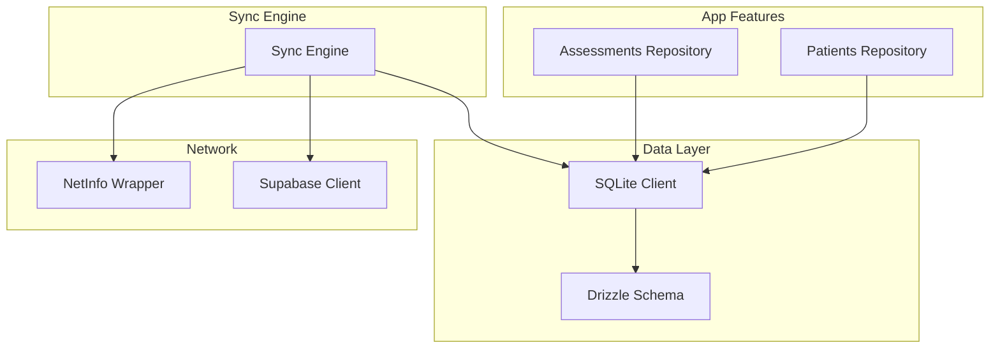
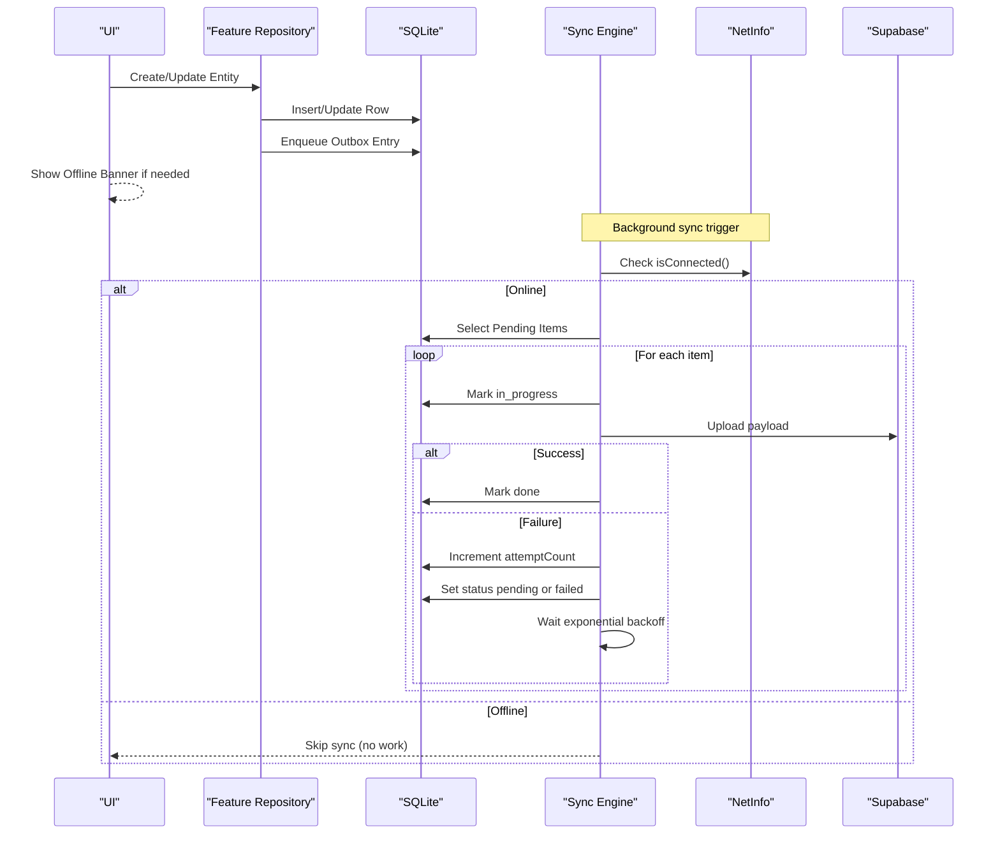
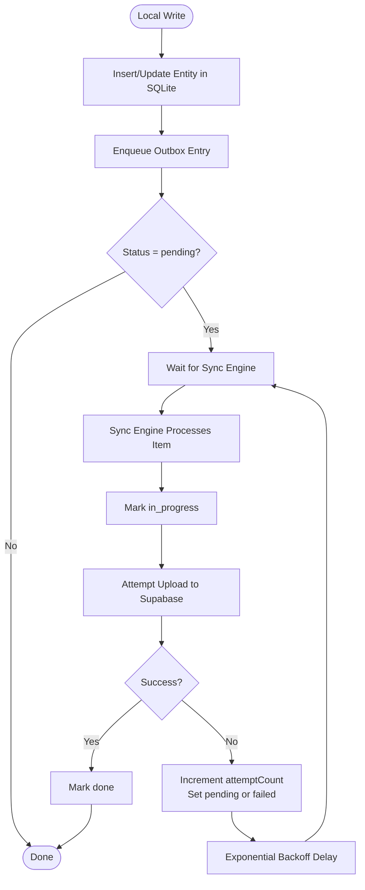
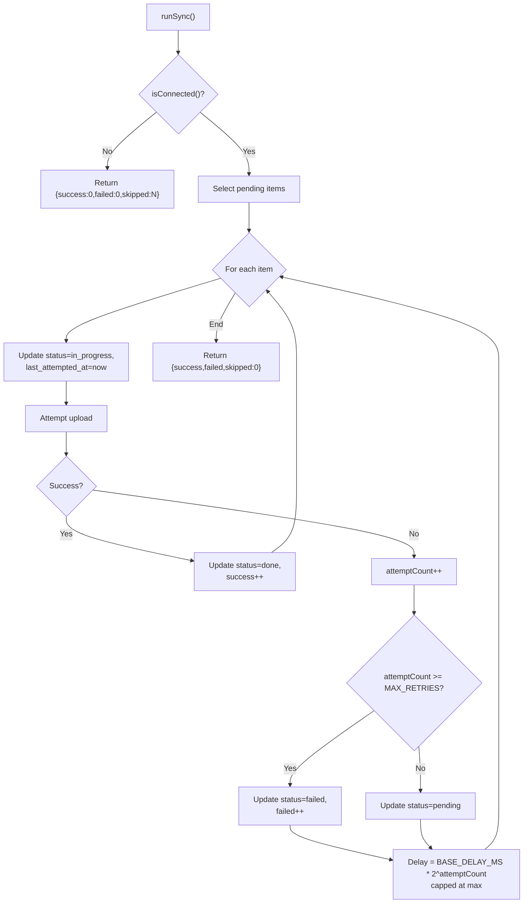
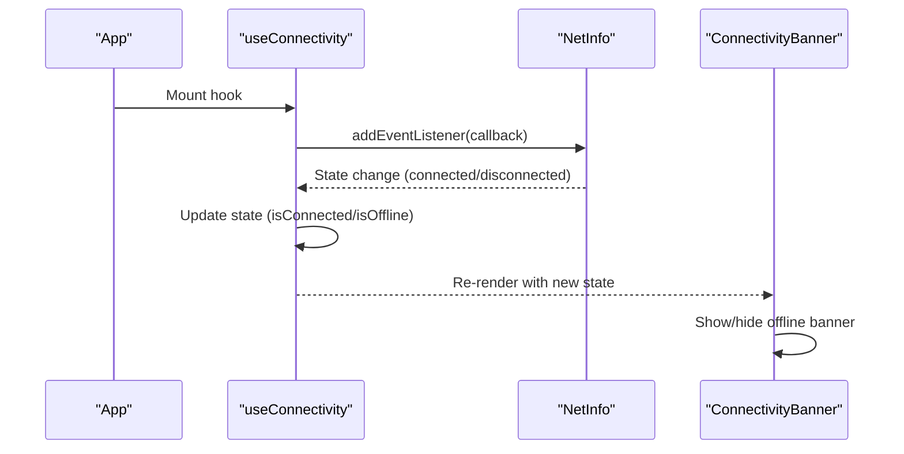
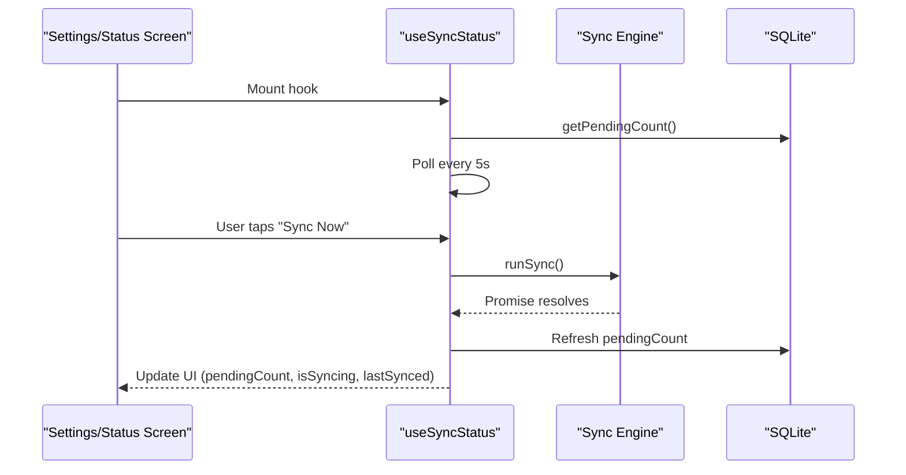
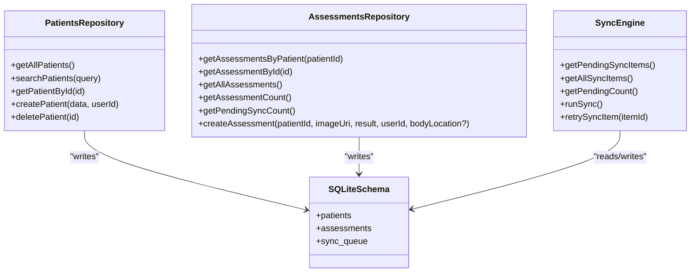
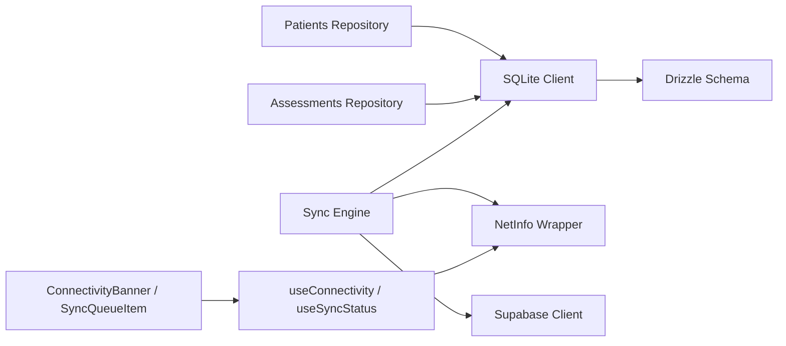
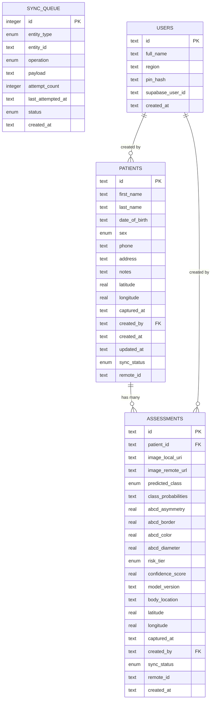

# Synchronization System

<cite>
**Referenced Files in This Document**
- [syncEngine.ts](file://src/features/sync/syncEngine.ts)
- [schema.ts](file://src/db/schema.ts)
- [client.ts](file://src/db/client.ts)
- [netinfo.ts](file://src/lib/netinfo.ts)
- [useConnectivity.ts](file://src/hooks/useConnectivity.ts)
- [useSyncStatus.ts](file://src/hooks/useSyncStatus.ts)
- [repository.ts (patients)](file://src/features/patients/repository.ts)
- [repository.ts (assessments)](file://src/features/assessments/repository.ts)
- [SyncQueueItem.tsx](file://src/components/sync/SyncQueueItem.tsx)
- [ConnectivityBanner.tsx](file://src/components/ui/ConnectivityBanner.tsx)
- [supabase.ts](file://src/lib/supabase.ts)
- [index.ts (types)](file://src/types/index.ts)
</cite>

## Table of Contents
1. [Introduction](#introduction)
2. [Project Structure](#project-structure)
3. [Core Components](#core-components)
4. [Architecture Overview](#architecture-overview)
5. [Detailed Component Analysis](#detailed-component-analysis)
6. [Dependency Analysis](#dependency-analysis)
7. [Performance Considerations](#performance-considerations)
8. [Troubleshooting Guide](#troubleshooting-guide)
9. [Conclusion](#conclusion)
10. [Appendices](#appendices)

## Introduction
This document explains DermSight’s offline-first synchronization system that ensures reliable data consistency between the local SQLite database and the Supabase cloud backend. It focuses on the outbox pattern implementation, sync engine architecture (queue management, background processing, retry with exponential backoff, conflict resolution), network monitoring via NetInfo API, automatic sync triggering, user feedback for sync progress, error handling strategies, performance considerations for large datasets, battery optimization, debugging techniques, and how sync integrates with patient management and assessments features.

## Project Structure
The synchronization system is implemented across several layers:
- Data layer: SQLite schema and Drizzle ORM client define tables including a dedicated sync queue table for outbox entries.
- Sync engine: Orchestrates reading pending items from the outbox, marking them in progress, attempting uploads to Supabase, updating statuses, and applying retry/backoff logic.
- Connectivity layer: Monitors online/offline state using NetInfo and exposes hooks for UI components.
- Feature repositories: Patient and Assessment modules enqueue sync operations after local writes.
- UI: Displays connectivity status and per-item sync status with retry actions.

**Diagram sources**
- [schema.ts:77-92](file://src/db/schema.ts#L77-L92)
- [client.ts:1-14](file://src/db/client.ts#L1-L14)
- [syncEngine.ts:55-110](file://src/features/sync/syncEngine.ts#L55-L110)
- [netinfo.ts:15-34](file://src/lib/netinfo.ts#L15-L34)
- [supabase.ts:1-19](file://src/lib/supabase.ts#L1-L19)

**Section sources**
- [schema.ts:77-92](file://src/db/schema.ts#L77-L92)
- [client.ts:1-14](file://src/db/client.ts#L1-L14)
- [syncEngine.ts:55-110](file://src/features/sync/syncEngine.ts#L55-L110)
- [netinfo.ts:15-34](file://src/lib/netinfo.ts#L15-L34)
- [supabase.ts:1-19](file://src/lib/supabase.ts#L1-L19)

## Core Components
- Outbox table (sync_queue): Stores entity changes to be pushed to Supabase. Each row tracks entity type, operation, payload, attempt count, last attempted timestamp, and status transitions.
- Sync engine: Reads pending items, marks them in_progress, attempts upload, updates to done or failed, applies exponential backoff, and supports manual retry.
- Connectivity monitoring: Subscribes to NetInfo events to detect online/offline transitions and provides current connectivity state.
- Feature integration: Patient and Assessment repositories write locally first and enqueue an outbox entry for later sync.
- UI feedback: Connectivity banner shows offline state; sync queue item component displays per-item status and retry action.

**Section sources**
- [schema.ts:77-92](file://src/db/schema.ts#L77-L92)
- [syncEngine.ts:24-125](file://src/features/sync/syncEngine.ts#L24-L125)
- [netinfo.ts:15-43](file://src/lib/netinfo.ts#L15-L43)
- [repository.ts (patients):44-101](file://src/features/patients/repository.ts#L44-L101)
- [repository.ts (assessments):53-123](file://src/features/assessments/repository.ts#L53-L123)
- [SyncQueueItem.tsx:15-53](file://src/components/sync/SyncQueueItem.tsx#L15-L53)
- [ConnectivityBanner.tsx:9-28](file://src/components/ui/ConnectivityBanner.tsx#L9-L28)

## Architecture Overview
DermSight uses an outbox pattern to decouple local writes from network operations:
- Local writes are immediate and persistent in SQLite.
- A sync queue records each change as an outbox entry.
- The sync engine processes outbox entries when the device is online, marking states and applying retries with exponential backoff.
- UI remains responsive; it never blocks on network calls.

**Diagram sources**
- [repository.ts (patients):44-101](file://src/features/patients/repository.ts#L44-L101)
- [repository.ts (assessments):53-123](file://src/features/assessments/repository.ts#L53-L123)
- [syncEngine.ts:55-110](file://src/features/sync/syncEngine.ts#L55-L110)
- [netinfo.ts:15-34](file://src/lib/netinfo.ts#L15-L34)
- [supabase.ts:1-19](file://src/lib/supabase.ts#L1-L19)

## Detailed Component Analysis

### Outbox Pattern and Queue Management
- The sync_queue table stores entity_type, entity_id, operation, payload, attempt_count, last_attempted_at, status, and created_at.
- Statuses include pending, in_progress, failed, and done.
- Feature repositories insert rows into patients or assessments and then enqueue a corresponding sync_queue entry with the serialized payload.

**Diagram sources**
- [schema.ts:77-92](file://src/db/schema.ts#L77-L92)
- [repository.ts (patients):44-101](file://src/features/patients/repository.ts#L44-L101)
- [repository.ts (assessments):53-123](file://src/features/assessments/repository.ts#L53-L123)
- [syncEngine.ts:55-110](file://src/features/sync/syncEngine.ts#L55-L110)

**Section sources**
- [schema.ts:77-92](file://src/db/schema.ts#L77-L92)
- [repository.ts (patients):44-101](file://src/features/patients/repository.ts#L44-L101)
- [repository.ts (assessments):53-123](file://src/features/assessments/repository.ts#L53-L123)

### Sync Engine: Processing, Retry, and Backoff
- runSync checks connectivity; if offline, returns skipped counts without processing.
- For each pending item:
  - Marks status as in_progress and updates last_attempted_at.
  - Attempts upload (currently simulated).
  - On success, marks status as done and increments success counter.
  - On failure, increments attemptCount, sets status to pending or failed based on MAX_RETRIES, updates last_attempted_at, and waits with exponential backoff capped at a maximum delay.
- retrySyncItem resets a specific failed item to pending with zero attempts.

**Diagram sources**
- [syncEngine.ts:55-110](file://src/features/sync/syncEngine.ts#L55-L110)
- [syncEngine.ts:115-125](file://src/features/sync/syncEngine.ts#L115-L125)

**Section sources**
- [syncEngine.ts:55-110](file://src/features/sync/syncEngine.ts#L55-L110)
- [syncEngine.ts:115-125](file://src/features/sync/syncEngine.ts#L115-L125)

### Network Connectivity Monitoring and Auto Triggering
- subscribeToConnectivity listens to NetInfo events and notifies subscribers when connection state changes.
- isConnected fetches current state synchronously from last known state.
- useConnectivity hook maintains local state and exposes isConnected and isOffline flags to UI.
- ConnectivityBanner renders an offline indicator when isOffline is true.

**Diagram sources**
- [netinfo.ts:15-34](file://src/lib/netinfo.ts#L15-L34)
- [useConnectivity.ts:8-17](file://src/hooks/useConnectivity.ts#L8-L17)
- [ConnectivityBanner.tsx:9-28](file://src/components/ui/ConnectivityBanner.tsx#L9-L28)

**Section sources**
- [netinfo.ts:15-43](file://src/lib/netinfo.ts#L15-L43)
- [useConnectivity.ts:8-17](file://src/hooks/useConnectivity.ts#L8-L17)
- [ConnectivityBanner.tsx:9-28](file://src/components/ui/ConnectivityBanner.tsx#L9-L28)

### User Feedback for Sync Progress
- useSyncStatus tracks pendingCount, isSyncing, lastSynced, and exposes triggerSync and refreshCount.
- It polls getPendingCount periodically and triggers runSync when connected and not already syncing.
- SyncQueueItemRow displays per-item status labels and a Retry button for failed items.

**Diagram sources**
- [useSyncStatus.ts:9-45](file://src/hooks/useSyncStatus.ts#L9-L45)
- [syncEngine.ts:55-110](file://src/features/sync/syncEngine.ts#L55-L110)
- [SyncQueueItem.tsx:15-53](file://src/components/sync/SyncQueueItem.tsx#L15-L53)

**Section sources**
- [useSyncStatus.ts:9-45](file://src/hooks/useSyncStatus.ts#L9-L45)
- [SyncQueueItem.tsx:15-53](file://src/components/sync/SyncQueueItem.tsx#L15-L53)

### Integration with Patient Management and Assessments
- Patient creation inserts a patient row and enqueues a sync_queue entry with entityType "patient", operation "create", and serialized payload.
- Assessment creation inserts an assessment row and enqueues a sync_queue entry with entityType "assessment", operation "create", and serialized payload.
- Both repositories mark entities with sync_status "pending" until the sync engine completes and updates remote references.

**Diagram sources**
- [repository.ts (patients):44-101](file://src/features/patients/repository.ts#L44-L101)
- [repository.ts (assessments):53-123](file://src/features/assessments/repository.ts#L53-L123)
- [schema.ts:77-92](file://src/db/schema.ts#L77-L92)
- [syncEngine.ts:24-125](file://src/features/sync/syncEngine.ts#L24-L125)

**Section sources**
- [repository.ts (patients):44-101](file://src/features/patients/repository.ts#L44-L101)
- [repository.ts (assessments):53-123](file://src/features/assessments/repository.ts#L53-L123)

## Dependency Analysis
- Sync engine depends on:
  - SQLite client for reading/writing sync_queue.
  - NetInfo wrapper for connectivity checks.
  - Supabase client for actual uploads (placeholder currently).
- Feature repositories depend on:
  - SQLite client and schema for writing entities and enqueueing outbox entries.
- UI depends on:
  - Connectivity hook and sync status hook for reactive feedback.

**Diagram sources**
- [repository.ts (patients):44-101](file://src/features/patients/repository.ts#L44-L101)
- [repository.ts (assessments):53-123](file://src/features/assessments/repository.ts#L53-L123)
- [client.ts:1-14](file://src/db/client.ts#L1-L14)
- [schema.ts:77-92](file://src/db/schema.ts#L77-L92)
- [syncEngine.ts:55-110](file://src/features/sync/syncEngine.ts#L55-L110)
- [netinfo.ts:15-34](file://src/lib/netinfo.ts#L15-L34)
- [supabase.ts:1-19](file://src/lib/supabase.ts#L1-L19)
- [useConnectivity.ts:8-17](file://src/hooks/useConnectivity.ts#L8-L17)
- [useSyncStatus.ts:9-45](file://src/hooks/useSyncStatus.ts#L9-L45)

**Section sources**
- [client.ts:1-14](file://src/db/client.ts#L1-L14)
- [schema.ts:77-92](file://src/db/schema.ts#L77-L92)
- [syncEngine.ts:55-110](file://src/features/sync/syncEngine.ts#L55-L110)
- [netinfo.ts:15-34](file://src/lib/netinfo.ts#L15-L34)
- [supabase.ts:1-19](file://src/lib/supabase.ts#L1-L19)
- [useConnectivity.ts:8-17](file://src/hooks/useConnectivity.ts#L8-L17)
- [useSyncStatus.ts:9-45](file://src/hooks/useSyncStatus.ts#L9-L45)

## Performance Considerations
- Batch processing: The sync engine iterates pending items sequentially. For large datasets, consider batching reads and writes to reduce transaction overhead.
- Exponential backoff: Prevents overwhelming the server during transient failures and reduces network churn.
- Polling interval: useSyncStatus polls every 5 seconds; adjust based on expected sync volume and battery constraints.
- Database indexes: Ensure appropriate indexes on sync_queue.status and sync_queue.created_at to speed up queries for pending items and ordering.
- Payload size: Avoid overly large payloads in sync_queue; consider chunking images or storing metadata only and uploading assets separately.
- Concurrency: Current implementation processes one item at a time; adding controlled concurrency can improve throughput while respecting rate limits.

[No sources needed since this section provides general guidance]

## Troubleshooting Guide
- No sync happening:
  - Verify connectivity via useConnectivity and ensure runSync is triggered when online.
  - Check pending count with getPendingCount and inspect sync_queue entries.
- Frequent failures:
  - Inspect attemptCount and lastAttemptedAt for problematic items.
  - Validate Supabase configuration and credentials in supabase.ts.
  - Review error paths in runSync and ensure simulateSyncUpload is replaced with real network calls.
- Partial sync scenarios:
  - Some items may succeed while others fail; use getAllSyncItems to audit all entries.
  - Use retrySyncItem to reset failed items and reprocess.
- UI not reflecting state:
  - Confirm useSyncStatus polling and triggerSync usage.
  - Ensure ConnectivityBanner is mounted and subscribed to connectivity changes.

**Section sources**
- [syncEngine.ts:55-125](file://src/features/sync/syncEngine.ts#L55-L125)
- [useSyncStatus.ts:9-45](file://src/hooks/useSyncStatus.ts#L9-L45)
- [ConnectivityBanner.tsx:9-28](file://src/components/ui/ConnectivityBanner.tsx#L9-L28)
- [supabase.ts:1-19](file://src/lib/supabase.ts#L1-L19)

## Conclusion
DermSight’s offline-first synchronization leverages an outbox pattern to guarantee eventual consistency between local SQLite and Supabase. The sync engine manages queue processing, retry logic with exponential backoff, and clear status transitions. Connectivity monitoring enables automatic sync triggering, while UI components provide transparent feedback. Integrating patient and assessment repositories ensures that all critical data changes are captured and synchronized reliably. Future enhancements should replace the simulated upload with actual Supabase operations, optimize batch processing, and refine polling intervals for better performance and battery efficiency.

[No sources needed since this section summarizes without analyzing specific files]

## Appendices

### Data Models

**Diagram sources**
- [schema.ts:9-16](file://src/db/schema.ts#L9-L16)
- [schema.ts:18-40](file://src/db/schema.ts#L18-L40)
- [schema.ts:42-75](file://src/db/schema.ts#L42-L75)
- [schema.ts:77-92](file://src/db/schema.ts#L77-L92)

### Types Reference
- SyncStatus, OperationType, EntityType, SyncQueueStatus define enums used across the system.
- SyncQueueItem represents outbox entries with fields for entity identification, operation, payload, attempt tracking, timestamps, and status.

**Section sources**
- [index.ts:5-8](file://src/types/index.ts#L5-L8)
- [index.ts:66-76](file://src/types/index.ts#L66-L76)