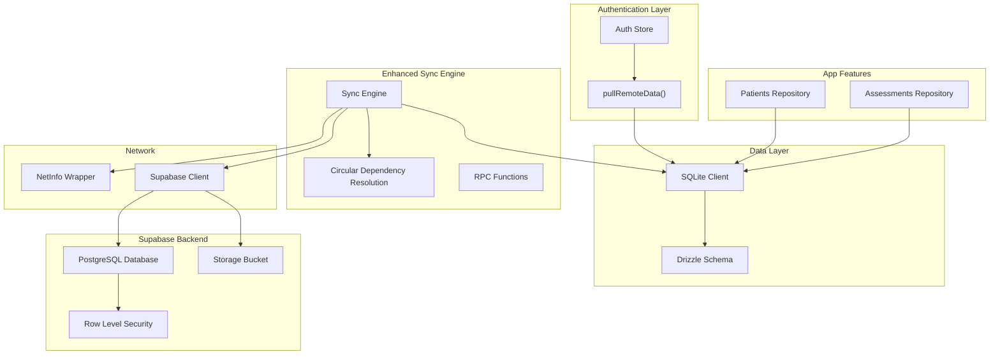
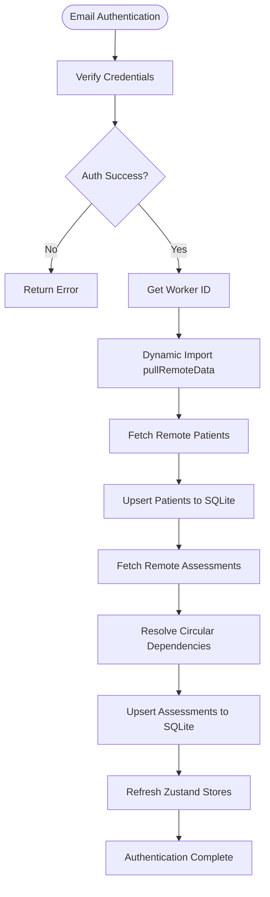
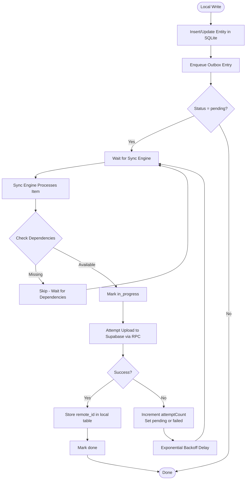
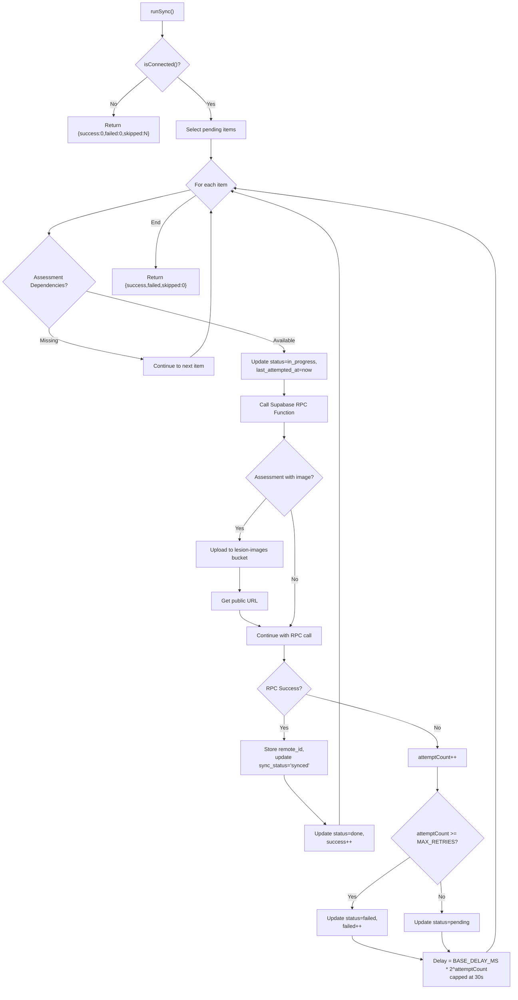
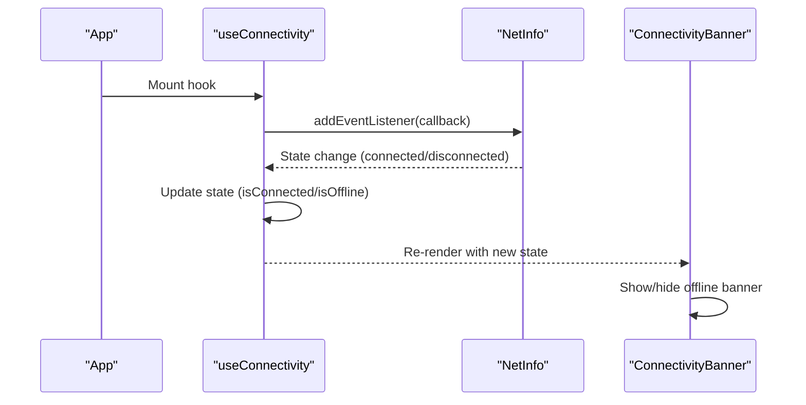
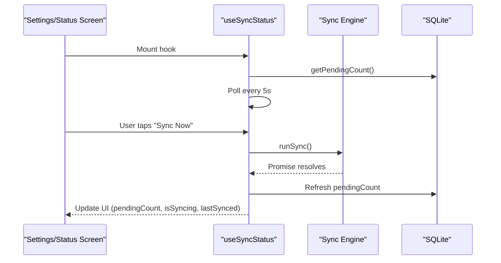
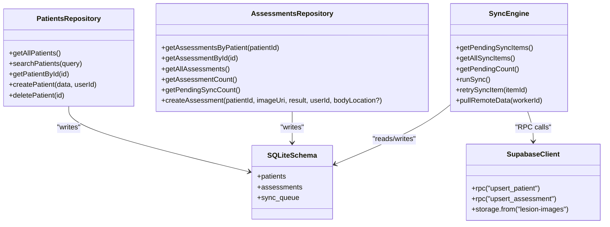
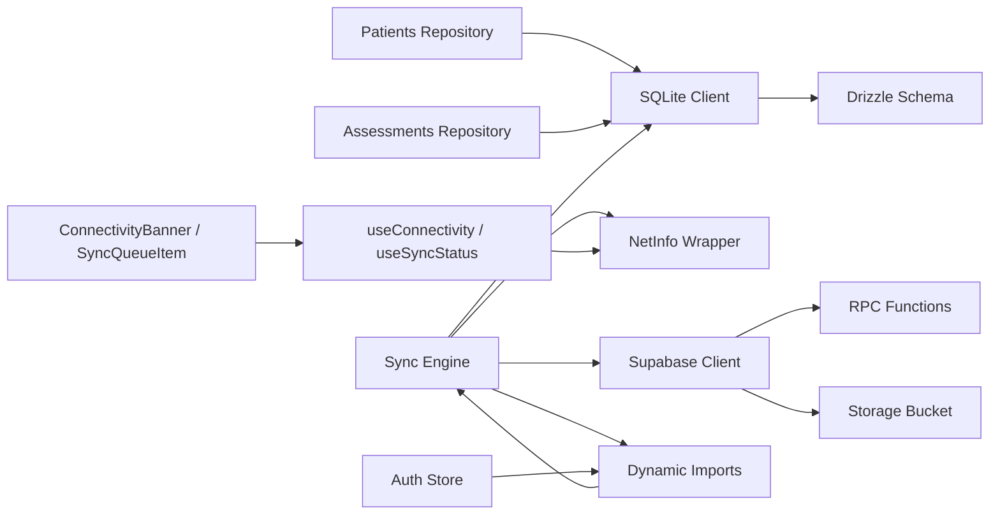
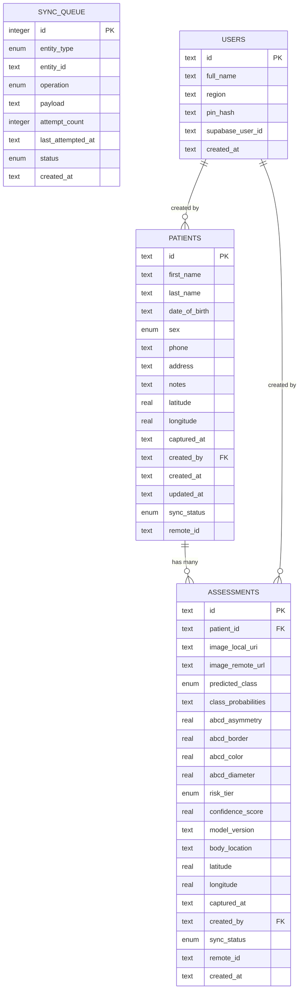

# Synchronization System

<cite>
**Referenced Files in This Document**
- [syncEngine.ts](file://src/features/sync/syncEngine.ts)
- [store.ts (auth)](file://src/features/auth/store.ts)
- [repository.ts (patients)](file://src/features/patients/repository.ts)
- [repository.ts (assessments)](file://src/features/assessments/repository.ts)
- [image.ts](file://src/utils/image.ts)
- [schema.ts](file://src/db/schema.ts)
- [client.ts](file://src/db/client.ts)
- [netinfo.ts](file://src/lib/netinfo.ts)
- [useConnectivity.ts](file://src/hooks/useConnectivity.ts)
- [useSyncStatus.ts](file://src/hooks/useSyncStatus.ts)
- [SyncQueueItem.tsx](file://src/components/sync/SyncQueueItem.tsx)
- [ConnectivityBanner.tsx](file://src/components/ui/ConnectivityBanner.tsx)
- [supabase.ts](file://src/lib/supabase.ts)
- [index.ts (types)](file://src/types/index.ts)
- [001_initial_schema.sql](file://supabase/migrations/001_initial_schema.sql)
- [002_rls_policies.sql](file://supabase/migrations/002_rls_policies.sql)
- [003_storage_bucket.sql](file://supabase/migrations/003_storage_bucket.sql)
- [004_functions_and_analytics.sql](file://supabase/migrations/004_functions_and_analytics.sql)
</cite>

## Update Summary
**Changes Made**
- Added comprehensive automatic remote data pulling functionality triggered on email authentication
- Implemented sophisticated offline-first data management with circular dependency resolution using dynamic imports
- Enhanced parameter validation and graceful fallback mechanisms for missing local files and network connectivity issues
- Improved robust error handling for image copy operations, permission issues, and network connectivity problems
- Updated sync engine with advanced patient-assessment dependency resolution during sync operations
- Added multi-device data portability support through automatic remote data synchronization

## Table of Contents
1. [Introduction](#introduction)
2. [Project Structure](#project-structure)
3. [Core Components](#core-components)
4. [Architecture Overview](#architecture-overview)
5. [Supabase Backend Integration](#supabase-backend-integration)
6. [Detailed Component Analysis](#detailed-component-analysis)
7. [Dependency Analysis](#dependency-analysis)
8. [Performance Considerations](#performance-considerations)
9. [Troubleshooting Guide](#troubleshooting-guide)
10. [Conclusion](#conclusion)
11. [Appendices](#appendices)

## Introduction
This document explains DermSight's enhanced offline-first synchronization system that ensures reliable data consistency between the local SQLite database and the Supabase cloud backend. The system implements a production-ready outbox pattern with real-time data synchronization using Supabase RPC functions, comprehensive database migrations, row-level security policies, and secure storage bucket management. It features automatic remote data pulling on email authentication, sophisticated circular dependency resolution, parameter validation, graceful fallbacks when local files are missing, and robust error handling for image copy operations, permission issues, and network connectivity problems. The system covers the sync engine architecture including queue management, background processing, retry logic with exponential backoff, conflict resolution strategies, network connectivity monitoring via NetInfo API, automatic sync triggering based on connection status, user feedback for sync progress, error handling strategies, performance considerations for large datasets, battery optimization for background sync, debugging techniques, and seamless integration with patient management and assessments features.

## Project Structure
The enhanced synchronization system is implemented across several layers with comprehensive Supabase backend integration and automatic data synchronization capabilities:
- Data layer: SQLite schema and Drizzle ORM client define tables including a dedicated sync queue table for outbox entries.
- Authentication layer: Email-based authentication with automatic remote data pulling upon successful login.
- Sync engine: Orchestrates reading pending items from the outbox, marking them in progress, attempting uploads to Supabase via RPC functions, updating statuses, and applying retry/backoff logic with circular dependency resolution.
- Supabase backend: PostgreSQL database with Row Level Security (RLS), storage buckets for lesion images, and server-side RPC functions for data synchronization.
- Connectivity layer: Monitors online/offline state using NetInfo and exposes hooks for UI components.
- Feature repositories: Patient and Assessment modules enqueue sync operations after local writes with enhanced error handling.
- UI: Displays connectivity status and per-item sync status with retry actions.



**Diagram sources**
- [store.ts (auth):230-236](file://src/features/auth/store.ts#L230-L236)
- [syncEngine.ts:351-502](file://src/features/sync/syncEngine.ts#L351-L502)
- [syncEngine.ts:82-108](file://src/features/sync/syncEngine.ts#L82-L108)
- [schema.ts:77-92](file://src/db/schema.ts#L77-L92)
- [client.ts:1-14](file://src/db/client.ts#L1-L14)
- [netinfo.ts:15-34](file://src/lib/netinfo.ts#L15-L34)
- [supabase.ts:1-19](file://src/lib/supabase.ts#L1-L19)

**Section sources**
- [store.ts (auth):230-236](file://src/features/auth/store.ts#L230-L236)
- [syncEngine.ts:351-502](file://src/features/sync/syncEngine.ts#L351-L502)
- [syncEngine.ts:82-108](file://src/features/sync/syncEngine.ts#L82-L108)
- [schema.ts:77-92](file://src/db/schema.ts#L77-L92)
- [client.ts:1-14](file://src/db/client.ts#L1-L14)
- [netinfo.ts:15-34](file://src/lib/netinfo.ts#L15-L34)
- [supabase.ts:1-19](file://src/lib/supabase.ts#L1-L19)

## Core Components
- Outbox table (sync_queue): Stores entity changes to be pushed to Supabase. Each row tracks entity type, operation, payload, attempt count, last attempted timestamp, and status transitions.
- Enhanced sync engine: Reads pending items, marks them in_progress, attempts upload via Supabase RPC functions, updates statuses, applies exponential backoff, supports manual retry, and includes circular dependency resolution for patient-assessment relationships.
- Automatic data synchronization: Triggers remote data pulling on email authentication to ensure multi-device data portability.
- Supabase RPC functions: Server-side functions (upsert_patient, upsert_assessment) handle data synchronization with proper validation and audit logging.
- Storage bucket: Secure lesion-images bucket with Row Level Security policies for image upload and access control.
- Connectivity monitoring: Subscribes to NetInfo events to detect online/offline transitions and provides current connectivity state.
- Feature integration: Patient and Assessment repositories write locally first and enqueue an outbox entry for later sync with enhanced error handling.
- UI feedback: Connectivity banner shows offline state; sync queue item component displays per-item status and retry action.

**Section sources**
- [schema.ts:77-92](file://src/db/schema.ts#L77-L92)
- [syncEngine.ts:24-125](file://src/features/sync/syncEngine.ts#L24-L125)
- [syncEngine.ts:351-502](file://src/features/sync/syncEngine.ts#L351-L502)
- [store.ts (auth):230-236](file://src/features/auth/store.ts#L230-L236)
- [004_functions_and_analytics.sql:9-65](file://supabase/migrations/004_functions_and_analytics.sql#L9-L65)
- [003_storage_bucket.sql:7-80](file://supabase/migrations/003_storage_bucket.sql#L7-L80)
- [netinfo.ts:15-43](file://src/lib/netinfo.ts#L15-L43)
- [repository.ts (patients):44-101](file://src/features/patients/repository.ts#L44-L101)
- [repository.ts (assessments):53-123](file://src/features/assessments/repository.ts#L53-L123)
- [SyncQueueItem.tsx:15-53](file://src/components/sync/SyncQueueItem.tsx#L15-L53)
- [ConnectivityBanner.tsx:9-28](file://src/components/ui/ConnectivityBanner.tsx#L9-L28)

## Architecture Overview
DermSight uses an enhanced outbox pattern to decouple local writes from network operations with production-ready Supabase integration and automatic data synchronization:
- Local writes are immediate and persistent in SQLite.
- A sync queue records each change as an outbox entry.
- Email authentication automatically triggers remote data pulling to synchronize existing data across devices.
- The sync engine processes outbox entries when the device is online, calling Supabase RPC functions for data synchronization with circular dependency resolution.
- Images are uploaded to the secure lesion-images storage bucket before assessment sync with robust error handling.
- Row Level Security ensures data isolation between health workers.
- UI remains responsive; it never blocks on network calls.

```mermaid
sequenceDiagram
participant Auth as "Auth Store"
participant UI as "UI"
participant Repo as "Feature Repository"
participant DB as "SQLite"
participant Engine as "Sync Engine"
participant Net as "NetInfo"
participant SB as "Supabase"
participant Storage as "Storage Bucket"
Note over Auth : Email Authentication
Auth->>SB : Authenticate User
SB-->>Auth : Success + Worker ID
Auth->>Engine : pullRemoteData(workerId)
Engine->>SB : Fetch Remote Patients
SB-->>Engine : Remote Patients
Engine->>DB : Upsert Patients
Engine->>SB : Fetch Remote Assessments
SB-->>Engine : Remote Assessments
Engine->>DB : Upsert Assessments
Engine->>DB : Refresh Zustand Stores
Note over UI : User Creates New Data
UI->>Repo : Create/Update Entity
Repo->>DB : Insert/Update Row
Repo->>DB : Enqueue Outbox Entry
UI-->>UI : Show Offline Banner if needed
Note over Engine,Net : Background sync trigger
Engine->>Net : Check isConnected()
alt Online
Engine->>DB : Select Pending Items
loop For each item
Engine->>DB : Mark in_progress
Engine->>DB : Resolve Dependencies
Engine->>SB : Call RPC Function
alt Assessment with Image
SB->>Storage : Upload Image
Storage-->>SB : Return URL
SB-->>Engine : Remote ID
else Patient or Assessment
SB-->>Engine : Remote ID
end
Engine->>DB : Update remote_id & sync_status
Engine->>DB : Mark done
else Offline
Engine-->>UI : Skip sync (no work)
end
```

**Diagram sources**
- [store.ts (auth):230-236](file://src/features/auth/store.ts#L230-L236)
- [syncEngine.ts:351-502](file://src/features/sync/syncEngine.ts#L351-L502)
- [repository.ts (patients):44-101](file://src/features/patients/repository.ts#L44-L101)
- [repository.ts (assessments):53-123](file://src/features/assessments/repository.ts#L53-L123)
- [syncEngine.ts:82-108](file://src/features/sync/syncEngine.ts#L82-L108)
- [syncEngine.ts:55-110](file://src/features/sync/syncEngine.ts#L55-L110)
- [syncEngine.ts:148-200](file://src/features/sync/syncEngine.ts#L148-L200)
- [netinfo.ts:15-34](file://src/lib/netinfo.ts#L15-L34)
- [supabase.ts:1-19](file://src/lib/supabase.ts#L1-L19)

## Supabase Backend Integration

### Database Schema and Migrations
The Supabase backend consists of a PostgreSQL database with comprehensive schema design:

**Health Workers**: Mirrors local users table with authentication integration via supabase_user_id. Includes region tracking and timestamps for profile management.

**Patients**: Synced from local SQLite with local_id as stable identifier for deduplication. Uses unique indexes on (created_by, local_id) to prevent duplicate syncs and includes geographic coordinates and capture metadata.

**Assessments**: Lesion screening results with comprehensive ABCD scoring, risk tier classification, and confidence scores. Links to patients via foreign key relationships and stores both local URIs and remote storage URLs.

**Sync Log**: Server-side audit trail tracking all sync operations with worker identification, entity types, operations, and error messages for debugging and monitoring.

```mermaid
erDiagram
HEALTH_WORKERS {
uuid id PK
uuid supabase_user_id FK
text full_name
text region
timestamptz created_at
timestamptz updated_at
}
PATIENTS {
uuid id PK
text local_id
text first_name
text last_name
date date_of_birth
enum sex
text phone
text address
text notes
double precision latitude
double precision longitude
timestamptz captured_at
uuid created_by FK
timestamptz created_at
timestamptz updated_at
timestamptz synced_at
}
ASSESSMENTS {
uuid id PK
text local_id
uuid patient_id FK
text image_local_uri
text image_remote_url
enum predicted_class
jsonb class_probabilities
double precision abcd_asymmetry
double precision abcd_border
double precision abcd_color
double precision abcd_diameter
enum risk_tier
double precision confidence_score
text model_version
text body_location
double precision latitude
double precision longitude
timestamptz captured_at
uuid created_by FK
timestamptz created_at
timestamptz synced_at
}
SYNC_LOG {
bigint id PK
uuid worker_id FK
text entity_type
text entity_local_id
text operation
text status
text error_message
timestamptz synced_at
}
HEALTH_WORKERS ||--o{ PATIENTS : "created by"
HEALTH_WORKERS ||--o{ ASSESSMENTS : "created by"
PATIENTS ||--o{ ASSESSMENTS : "has many"
HEALTH_WORKERS ||--o{ SYNC_LOG : "performed by"
```

**Diagram sources**
- [001_initial_schema.sql:19-26](file://supabase/migrations/001_initial_schema.sql#L19-L26)
- [001_initial_schema.sql:40-57](file://supabase/migrations/001_initial_schema.sql#L40-L57)
- [001_initial_schema.sql:79-101](file://supabase/migrations/001_initial_schema.sql#L79-L101)
- [001_initial_schema.sql:125-134](file://supabase/migrations/001_initial_schema.sql#L125-L134)

### Row Level Security Policies
Comprehensive RLS policies ensure data isolation between health workers:

**Health Workers**: Workers can read, update, and insert their own profiles using auth.uid() for identity verification.

**Patients**: Workers can only access patients they created, with SELECT, INSERT, UPDATE, and DELETE operations restricted by created_by relationship.

**Assessments**: Similar patient-based access control ensuring workers can only manage assessments they created.

**Sync Log**: Workers can view their own sync log entries for debugging and audit purposes.

**Helper Function**: get_worker_id() resolves the health worker ID from the authenticated user context for use in other functions and policies.

### Storage Bucket Configuration
The lesion-images storage bucket provides secure image storage with comprehensive security policies:

**Bucket Configuration**: Private bucket with 10MB file size limit supporting JPEG, PNG, HEIC, and HEIF formats.

**Security Policies**: 
- Upload policy: Workers can only upload images to their own folder path ({worker_id}/{assessment_local_id}.jpg)
- Read policy: Workers can only access images from their own folders
- Update/Delete policies: Workers can modify or delete their own images

**Access Control**: All storage operations verify worker identity through Supabase authentication and enforce folder isolation.

**Section sources**
- [001_initial_schema.sql:19-161](file://supabase/migrations/001_initial_schema.sql#L19-L161)
- [002_rls_policies.sql:7-159](file://supabase/migrations/002_rls_policies.sql#L7-L159)
- [003_storage_bucket.sql:7-80](file://supabase/migrations/003_storage_bucket.sql#L7-L80)

### RPC Functions for Data Synchronization
Server-side RPC functions handle data synchronization with proper validation and audit logging:

**upsert_patient**: Creates or updates patient records using local_id + worker_id for deduplication. Returns the remote UUID for client-side reference mapping. Validates worker identity and logs all sync operations.

**upsert_assessment**: Creates or updates assessment records requiring the patient to already exist remotely. Handles image remote URL updates and maintains referential integrity. Includes comprehensive field validation and audit logging.

**get_worker_stats**: Dashboard statistics function returning summary metrics for authenticated workers including patient counts, assessment breakdowns by risk tier, and recent activity.

**get_recent_assessments**: Returns recent assessments for dashboard display with patient name resolution and risk classification.

**Section sources**
- [004_functions_and_analytics.sql:9-65](file://supabase/migrations/004_functions_and_analytics.sql#L9-L65)
- [004_functions_and_analytics.sql:71-150](file://supabase/migrations/004_functions_and_analytics.sql#L71-L150)
- [004_functions_and_analytics.sql:154-183](file://supabase/migrations/004_functions_and_analytics.sql#L154-L183)
- [004_functions_and_analytics.sql:186-217](file://supabase/migrations/004_functions_and_analytics.sql#L186-L217)

## Detailed Component Analysis

### Automatic Remote Data Pulling on Authentication
The enhanced system automatically pulls remote data when users authenticate via email/password, enabling seamless multi-device data portability:

**Authentication Flow**: Upon successful email authentication, the auth store dynamically imports and executes `pullRemoteData()` with the authenticated worker ID.

**Data Synchronization**: The function fetches all remote patients and assessments created by the current worker, maps them to local SQLite format, and performs upsert operations to maintain data consistency.

**Circular Dependency Resolution**: During sync, the system ensures patients are synced before assessments by checking patient remote IDs and skipping assessments until their parent patients are available.

**Store Refresh**: After successful data pull, the system refreshes Zustand stores to ensure UI reflects the synchronized state.



**Diagram sources**
- [store.ts (auth):230-236](file://src/features/auth/store.ts#L230-L236)
- [syncEngine.ts:351-502](file://src/features/sync/syncEngine.ts#L351-L502)
- [syncEngine.ts:82-108](file://src/features/sync/syncEngine.ts#L82-L108)

**Section sources**
- [store.ts (auth):230-236](file://src/features/auth/store.ts#L230-L236)
- [syncEngine.ts:351-502](file://src/features/sync/syncEngine.ts#L351-L502)
- [syncEngine.ts:82-108](file://src/features/sync/syncEngine.ts#L82-L108)

### Enhanced Outbox Pattern and Queue Management
- The sync_queue table stores entity_type, entity_id, operation, payload, attempt_count, last_attempted_at, status, and created_at.
- Statuses include pending, in_progress, failed, and done.
- Feature repositories insert rows into patients or assessments and then enqueue a corresponding sync_queue entry with the serialized payload.
- Enhanced circular dependency resolution ensures assessments are only processed after their parent patients have been successfully synced.



**Diagram sources**
- [schema.ts:77-92](file://src/db/schema.ts#L77-L92)
- [repository.ts (patients):44-101](file://src/features/patients/repository.ts#L44-L101)
- [repository.ts (assessments):53-123](file://src/features/assessments/repository.ts#L53-L123)
- [syncEngine.ts:82-108](file://src/features/sync/syncEngine.ts#L82-L108)

**Section sources**
- [schema.ts:77-92](file://src/db/schema.ts#L77-L92)
- [repository.ts (patients):44-101](file://src/features/patients/repository.ts#L44-L101)
- [repository.ts (assessments):53-123](file://src/features/assessments/repository.ts#L53-L123)
- [syncEngine.ts:82-108](file://src/features/sync/syncEngine.ts#L82-L108)

### Enhanced Sync Engine: Production-Ready Supabase Integration
- runSync checks connectivity; if offline, returns skipped counts without processing.
- For each pending item:
  - Performs circular dependency resolution for assessments to ensure parent patients exist remotely.
  - Marks status as in_progress and updates last_attempted_at.
  - Calls appropriate Supabase RPC function (upsert_patient or upsert_assessment).
  - For assessments with images, uploads to storage bucket first and includes remote URL with robust error handling.
  - On success, stores remote_id in local table, updates sync_status to "synced", marks status as done.
  - On failure, increments attemptCount, sets status to pending or failed based on MAX_RETRIES, updates last_attempted_at, and waits with exponential backoff capped at maximum delay.
- retrySyncItem resets a specific failed item to pending with zero attempts.



**Diagram sources**
- [syncEngine.ts:55-110](file://src/features/sync/syncEngine.ts#L55-L110)
- [syncEngine.ts:115-125](file://src/features/sync/syncEngine.ts#L115-L125)
- [syncEngine.ts:82-108](file://src/features/sync/syncEngine.ts#L82-L108)
- [syncEngine.ts:148-200](file://src/features/sync/syncEngine.ts#L148-L200)
- [syncEngine.ts:206-244](file://src/features/sync/syncEngine.ts#L206-L244)

**Section sources**
- [syncEngine.ts:55-110](file://src/features/sync/syncEngine.ts#L55-L110)
- [syncEngine.ts:115-125](file://src/features/sync/syncEngine.ts#L115-L125)
- [syncEngine.ts:82-108](file://src/features/sync/syncEngine.ts#L82-L108)
- [syncEngine.ts:148-200](file://src/features/sync/syncEngine.ts#L148-L200)

### Network Connectivity Monitoring and Auto Triggering
- subscribeToConnectivity listens to NetInfo events and notifies subscribers when connection state changes.
- isConnected fetches current state synchronously from last known state.
- useConnectivity hook maintains local state and exposes isConnected and isOffline flags to UI.
- ConnectivityBanner renders an offline indicator when isOffline is true.



**Diagram sources**
- [netinfo.ts:15-34](file://src/lib/netinfo.ts#L15-L34)
- [useConnectivity.ts:8-17](file://src/hooks/useConnectivity.ts#L8-L17)
- [ConnectivityBanner.tsx:9-28](file://src/components/ui/ConnectivityBanner.tsx#L9-L28)

**Section sources**
- [netinfo.ts:15-43](file://src/lib/netinfo.ts#L15-L43)
- [useConnectivity.ts:8-17](file://src/hooks/useConnectivity.ts#L8-L17)
- [ConnectivityBanner.tsx:9-28](file://src/components/ui/ConnectivityBanner.tsx#L9-L28)

### User Feedback for Sync Progress
- useSyncStatus tracks pendingCount, isSyncing, lastSynced, and exposes triggerSync and refreshCount.
- It polls getPendingCount periodically and triggers runSync when connected and not already syncing.
- SyncQueueItemRow displays per-item status labels and a Retry button for failed items.



**Diagram sources**
- [useSyncStatus.ts:9-45](file://src/hooks/useSyncStatus.ts#L9-L45)
- [syncEngine.ts:55-110](file://src/features/sync/syncEngine.ts#L55-L110)
- [SyncQueueItem.tsx:15-53](file://src/components/sync/SyncQueueItem.tsx#L15-L53)

**Section sources**
- [useSyncStatus.ts:9-45](file://src/hooks/useSyncStatus.ts#L9-L45)
- [SyncQueueItem.tsx:15-53](file://src/components/sync/SyncQueueItem.tsx#L15-L53)

### Integration with Patient Management and Assessments
- Patient creation inserts a patient row and enqueues a sync_queue entry with entityType "patient", operation "create", and serialized payload.
- Assessment creation inserts an assessment row and enqueues a sync_queue entry with entityType "assessment", operation "create", and serialized payload.
- Both repositories mark entities with sync_status "pending" until the sync engine completes and updates remote references.
- Enhanced error handling ensures graceful degradation when image copy operations fail.



**Diagram sources**
- [repository.ts (patients):44-101](file://src/features/patients/repository.ts#L44-L101)
- [repository.ts (assessments):53-123](file://src/features/assessments/repository.ts#L53-L123)
- [schema.ts:77-92](file://src/db/schema.ts#L77-L92)
- [syncEngine.ts:24-125](file://src/features/sync/syncEngine.ts#L24-L125)
- [syncEngine.ts:351-502](file://src/features/sync/syncEngine.ts#L351-L502)
- [syncEngine.ts:148-200](file://src/features/sync/syncEngine.ts#L148-L200)

**Section sources**
- [repository.ts (patients):44-101](file://src/features/patients/repository.ts#L44-L101)
- [repository.ts (assessments):53-123](file://src/features/assessments/repository.ts#L53-L123)

### Enhanced Error Handling and Graceful Fallbacks
The system implements comprehensive error handling throughout the synchronization pipeline:

**Image Copy Operations**: When saving images locally fails, the system gracefully falls back to using the original URI while logging the error for debugging.

**Network Connectivity Issues**: All network operations include try-catch blocks with detailed error logging and appropriate fallback behavior.

**Permission Issues**: File system operations handle permission errors gracefully, ensuring the app continues to function even when certain permissions are denied.

**Circular Dependency Resolution**: The sync engine handles cases where assessments reference patients that haven't been synced yet by skipping those assessments until dependencies are resolved.

**Store Refresh Errors**: Zustand store refresh operations are wrapped in try-catch blocks to prevent sync failures from affecting the overall process.

**Section sources**
- [repository.ts (assessments):64-72](file://src/features/assessments/repository.ts#L64-L72)
- [syncEngine.ts:67-74](file://src/features/sync/syncEngine.ts#L67-L74)
- [syncEngine.ts:167-173](file://src/features/sync/syncEngine.ts#L167-L173)
- [syncEngine.ts:488-494](file://src/features/sync/syncEngine.ts#L488-L494)
- [image.ts:64-71](file://src/utils/image.ts#L64-L71)

## Dependency Analysis
- Sync engine depends on:
  - SQLite client for reading/writing sync_queue.
  - NetInfo wrapper for connectivity checks.
  - Supabase client for RPC calls and storage operations.
  - Dynamic imports to resolve circular dependencies between auth and sync modules.
- Feature repositories depend on:
  - SQLite client and schema for writing entities and enqueueing outbox entries.
  - Enhanced error handling for file operations and network requests.
- UI depends on:
  - Connectivity hook and sync status hook for reactive feedback.



**Diagram sources**
- [repository.ts (patients):44-101](file://src/features/patients/repository.ts#L44-L101)
- [repository.ts (assessments):53-123](file://src/features/assessments/repository.ts#L53-L123)
- [client.ts:1-14](file://src/db/client.ts#L1-L14)
- [schema.ts:77-92](file://src/db/schema.ts#L77-L92)
- [syncEngine.ts:55-110](file://src/features/sync/syncEngine.ts#L55-L110)
- [store.ts (auth):230-236](file://src/features/auth/store.ts#L230-L236)
- [netinfo.ts:15-34](file://src/lib/netinfo.ts#L15-L34)
- [supabase.ts:1-19](file://src/lib/supabase.ts#L1-L19)
- [useConnectivity.ts:8-17](file://src/hooks/useConnectivity.ts#L8-L17)
- [useSyncStatus.ts:9-45](file://src/hooks/useSyncStatus.ts#L9-L45)

**Section sources**
- [client.ts:1-14](file://src/db/client.ts#L1-L14)
- [schema.ts:77-92](file://src/db/schema.ts#L77-L92)
- [syncEngine.ts:55-110](file://src/features/sync/syncEngine.ts#L55-L110)
- [store.ts (auth):230-236](file://src/features/auth/store.ts#L230-L236)
- [netinfo.ts:15-34](file://src/lib/netinfo.ts#L15-L34)
- [supabase.ts:1-19](file://src/lib/supabase.ts#L1-L19)
- [useConnectivity.ts:8-17](file://src/hooks/useConnectivity.ts#L8-L17)
- [useSyncStatus.ts:9-45](file://src/hooks/useSyncStatus.ts#L9-L45)

## Performance Considerations
- Batch processing: The sync engine iterates pending items sequentially. For large datasets, consider batching reads and writes to reduce transaction overhead.
- Exponential backoff: Prevents overwhelming the server during transient failures and reduces network churn with 30-second maximum delay cap.
- Polling interval: useSyncStatus polls every 5 seconds; adjust based on expected sync volume and battery constraints.
- Database indexes: Ensure appropriate indexes on sync_queue.status and sync_queue.created_at to speed up queries for pending items and ordering.
- Payload size: Avoid overly large payloads in sync_queue; consider chunking images or storing metadata only and uploading assets separately.
- Concurrency: Current implementation processes one item at a time; adding controlled concurrency can improve throughput while respecting rate limits.
- Image uploads: Large images may impact sync performance; consider compression or progressive loading strategies.
- Storage bucket limits: 10MB per image limit enforced by Supabase configuration; implement client-side validation to prevent oversized uploads.
- RPC function efficiency: Server-side functions are optimized with proper indexing and minimal round trips; leverage existing functions rather than creating custom endpoints.
- Circular dependency resolution: Enhanced dependency checking prevents unnecessary sync attempts and reduces network overhead.
- Dynamic imports: Used to resolve circular dependencies between auth and sync modules, improving startup performance.

## Troubleshooting Guide
- No sync happening:
  - Verify connectivity via useConnectivity and ensure runSync is triggered when online.
  - Check pending count with getPendingCount and inspect sync_queue entries.
  - Validate Supabase client configuration in supabase.ts with correct URL and anon key.
- Frequent failures:
  - Inspect attemptCount and lastAttemptedAt for problematic items.
  - Check Supabase RPC function errors and validate input parameters match function signatures.
  - Review storage bucket permissions and worker authentication for image uploads.
  - Verify Row Level Security policies allow the current worker to perform operations.
- Partial sync scenarios:
  - Some items may succeed while others fail; use getAllSyncItems to audit all entries.
  - Use retrySyncItem to reset failed items and reprocess.
  - Check sync_log table on Supabase for detailed error information and timestamps.
- UI not reflecting state:
  - Confirm useSyncStatus polling and triggerSync usage.
  - Ensure ConnectivityBanner is mounted and subscribed to connectivity changes.
  - Verify remote_id updates are properly stored in local tables after successful sync.
- Authentication issues:
  - Ensure health worker profile exists in Supabase database.
  - Verify auth.uid() resolves correctly in RPC functions.
  - Check that worker_id lookup succeeds in get_worker_id() function.
- Automatic data pulling issues:
  - Verify email authentication flow triggers pullRemoteData() correctly.
  - Check network connectivity during authentication for remote data fetching.
  - Inspect console logs for any errors during the automatic data synchronization process.
- Image upload failures:
  - Check file permissions and storage directory accessibility.
  - Verify image file paths and ensure files exist before upload attempts.
  - Review error handling in saveImageLocally function for graceful fallbacks.

**Section sources**
- [syncEngine.ts:55-125](file://src/features/sync/syncEngine.ts#L55-L125)
- [syncEngine.ts:148-200](file://src/features/sync/syncEngine.ts#L148-L200)
- [syncEngine.ts:351-502](file://src/features/sync/syncEngine.ts#L351-L502)
- [useSyncStatus.ts:9-45](file://src/hooks/useSyncStatus.ts#L9-L45)
- [ConnectivityBanner.tsx:9-28](file://src/components/ui/ConnectivityBanner.tsx#L9-L28)
- [supabase.ts:1-19](file://src/lib/supabase.ts#L1-L19)
- [store.ts (auth):230-236](file://src/features/auth/store.ts#L230-L236)
- [repository.ts (assessments):64-72](file://src/features/assessments/repository.ts#L64-L72)
- [002_rls_policies.sql:153-159](file://supabase/migrations/002_rls_policies.sql#L153-L159)

## Conclusion
DermSight's enhanced offline-first synchronization leverages a production-ready outbox pattern to guarantee eventual consistency between local SQLite and Supabase backend. The system now features automatic remote data pulling on email authentication, enabling seamless multi-device data portability. The sync engine manages queue processing, retry logic with exponential backoff, clear status transitions, and circular dependency resolution while integrating seamlessly with Supabase RPC functions for data synchronization. Comprehensive Row Level Security ensures data isolation between health workers, while the secure storage bucket handles lesion image uploads with proper access controls. Enhanced error handling and graceful fallback mechanisms ensure robust operation even when facing network connectivity issues, permission problems, or missing local files. Connectivity monitoring enables automatic sync triggering, while UI components provide transparent feedback. The integration with patient and assessment repositories ensures that all critical data changes are captured and synchronized reliably. Future enhancements should focus on optimizing batch processing for large datasets, implementing real-time sync notifications, and expanding analytics capabilities through additional RPC functions.

## Appendices

### Data Models


**Diagram sources**
- [schema.ts:9-16](file://src/db/schema.ts#L9-L16)
- [schema.ts:18-40](file://src/db/schema.ts#L18-L40)
- [schema.ts:42-75](file://src/db/schema.ts#L42-L75)
- [schema.ts:77-92](file://src/db/schema.ts#L77-L92)

### Types Reference
- SyncStatus, OperationType, EntityType, SyncQueueStatus define enums used across the system.
- SyncQueueItem represents outbox entries with fields for entity identification, operation, payload, attempt tracking, timestamps, and status.

**Section sources**
- [index.ts:5-8](file://src/types/index.ts#L5-L8)
- [index.ts:66-76](file://src/types/index.ts#L66-L76)

### Supabase Backend Architecture
The complete Supabase backend architecture includes:

**Database Schema**: PostgreSQL database with health_workers, patients, assessments, and sync_log tables with comprehensive indexing and constraints.

**Security Layer**: Row Level Security policies ensuring data isolation between health workers, with helper functions for worker identity resolution.

**Storage Layer**: Secure lesion-images bucket with 10MB file limits and MIME type restrictions, organized by worker ID for data isolation.

**API Layer**: RPC functions providing upsert operations for patients and assessments, along with analytics functions for dashboard reporting.

**Audit Trail**: Server-side sync logging capturing all synchronization operations with error tracking and timestamps for debugging and compliance.

**Section sources**
- [001_initial_schema.sql:1-161](file://supabase/migrations/001_initial_schema.sql#L1-L161)
- [002_rls_policies.sql:1-159](file://supabase/migrations/002_rls_policies.sql#L1-L159)
- [003_storage_bucket.sql:1-80](file://supabase/migrations/003_storage_bucket.sql#L1-L80)
- [004_functions_and_analytics.sql:1-217](file://supabase/migrations/004_functions_and_analytics.sql#L1-L217)