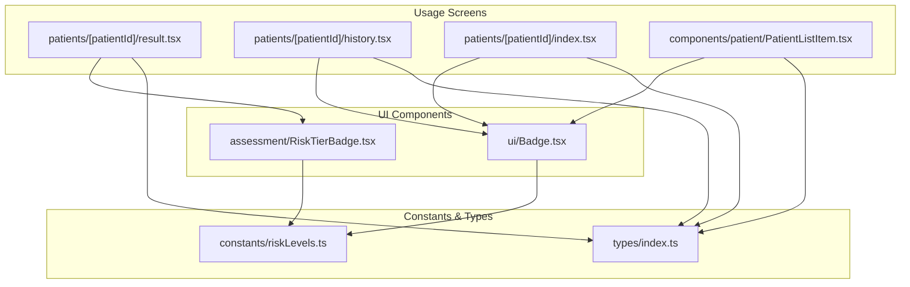
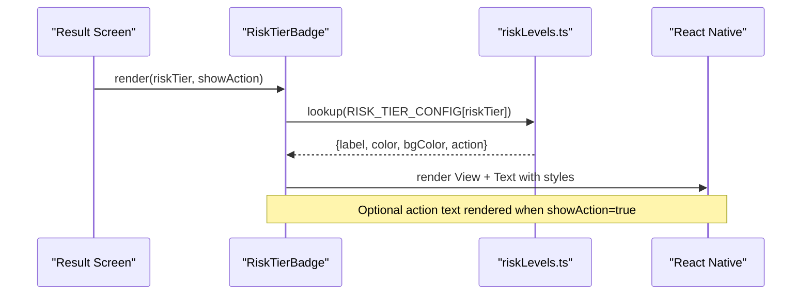
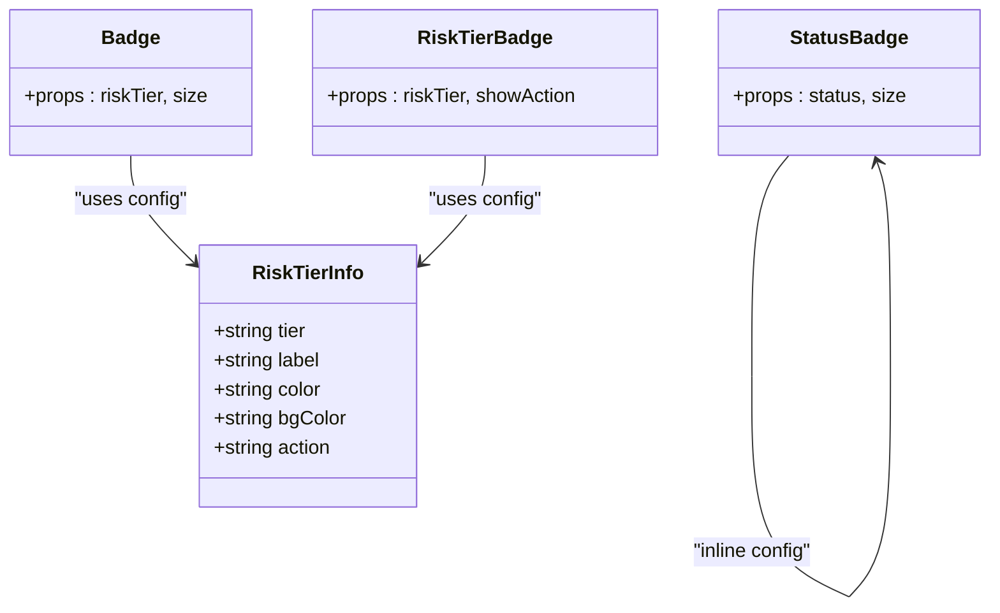
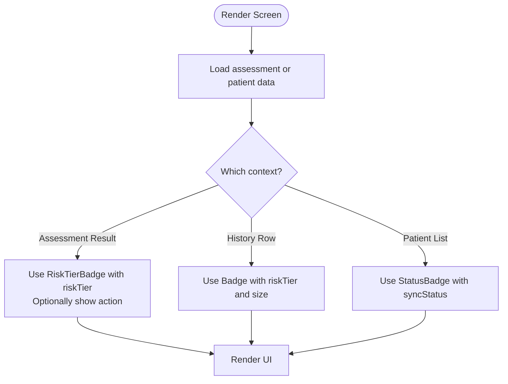

# Badge Component

<cite>
**Referenced Files in This Document**
- [Badge.tsx](file://src/components/ui/Badge.tsx)
- [RiskTierBadge.tsx](file://src/components/assessment/RiskTierBadge.tsx)
- [riskLevels.ts](file://src/constants/riskLevels.ts)
- [theme.ts](file://src/constants/theme.ts)
- [index.ts](file://src/types/index.ts)
- [result.tsx](file://src/app/(app)/patients/[patientId]/result.tsx)
- [history.tsx](file://src/app/(app)/patients/[patientId]/history.tsx)
- [index.tsx](file://src/app/(app)/patients/[patientId]/index.tsx)
- [PatientListItem.tsx](file://src/components/patient/PatientListItem.tsx)
</cite>

## Table of Contents
1. [Introduction](#introduction)
2. [Project Structure](#project-structure)
3. [Core Components](#core-components)
4. [Architecture Overview](#architecture-overview)
5. [Detailed Component Analysis](#detailed-component-analysis)
6. [Dependency Analysis](#dependency-analysis)
7. [Performance Considerations](#performance-considerations)
8. [Troubleshooting Guide](#troubleshooting-guide)
9. [Conclusion](#conclusion)
10. [Appendices](#appendices)

## Introduction
This document provides comprehensive documentation for the Badge components used in DermSight to communicate risk levels, status indicators, and informational labels across patient and assessment screens. It covers available variants, colors, sizes, positioning options, integration with assessment results and patient data, usage guidelines, and accessibility considerations for color-blind users.

## Project Structure
The badge system is implemented as reusable UI primitives and specialized badges:
- General-purpose risk tier and status badges live under src/components/ui/Badge.tsx.
- A prominent risk tier display lives under src/components/assessment/RiskTierBadge.tsx.
- Risk tier configuration and mappings are centralized in src/constants/riskLevels.ts.
- Types for assessments, patients, and sync statuses are defined in src/types/index.ts.
- Usage examples appear in patient detail, history, and result screens.

**Diagram sources**
- [Badge.tsx:1-71](file://src/components/ui/Badge.tsx#L1-L71)
- [RiskTierBadge.tsx:1-40](file://src/components/assessment/RiskTierBadge.tsx#L1-L40)
- [riskLevels.ts:1-121](file://src/constants/riskLevels.ts#L1-L121)
- [index.ts:1-98](file://src/types/index.ts#L1-L98)
- [result.tsx:1-127](file://src/app/(app)/patients/[patientId]/result.tsx#L1-L127)
- [history.tsx:1-95](file://src/app/(app)/patients/[patientId]/history.tsx#L1-L95)
- [index.tsx:1-211](file://src/app/(app)/patients/[patientId]/index.tsx#L1-L211)
- [PatientListItem.tsx:1-52](file://src/components/patient/PatientListItem.tsx#L1-L52)

**Section sources**
- [Badge.tsx:1-71](file://src/components/ui/Badge.tsx#L1-L71)
- [RiskTierBadge.tsx:1-40](file://src/components/assessment/RiskTierBadge.tsx#L1-L40)
- [riskLevels.ts:1-121](file://src/constants/riskLevels.ts#L1-L121)
- [index.ts:1-98](file://src/types/index.ts#L1-L98)
- [result.tsx:1-127](file://src/app/(app)/patients/[patientId]/result.tsx#L1-L27)
- [history.tsx:1-95](file://src/app/(app)/patients/[patientId]/history.tsx#L1-L95)
- [index.tsx:1-211](file://src/app/(app)/patients/[patientId]/index.tsx#L1-L211)
- [PatientListItem.tsx:1-52](file://src/components/patient/PatientListItem.tsx#L1-L52)

## Core Components
- Badge (risk tier): Displays a compact, rounded pill with a label derived from the risk tier configuration. Supports small, medium, and large sizes.
- StatusBadge: Displays a compact status indicator for synchronization states (synced, pending, failed). Supports small and medium sizes.
- RiskTierBadge: A larger, more prominent card-style badge that shows the risk tier label and an optional action description.

Key capabilities:
- Variants: Risk tier badge, status badge, and prominent risk tier badge.
- Sizes: Small, medium, large where applicable.
- Colors: Derived from centralized risk tier configuration; status colors are inline.
- Positioning: Self-start alignment within parent containers; flexible placement via parent layout.

Integration points:
- Assessment results: RiskTierBadge displays the overall risk tier with optional action text.
- Patient lists: StatusBadge indicates sync status per patient row.
- History and profile views: Compact Badge shows risk tier next to assessment entries.

**Section sources**
- [Badge.tsx:9-42](file://src/components/ui/Badge.tsx#L9-L42)
- [Badge.tsx:44-70](file://src/components/ui/Badge.tsx#L44-L70)
- [RiskTierBadge.tsx:10-39](file://src/components/assessment/RiskTierBadge.tsx#L10-L39)
- [riskLevels.ts:19-49](file://src/constants/riskLevels.ts#L19-L49)
- [index.ts:19-64](file://src/types/index.ts#L19-L64)

## Architecture Overview
The badge system is driven by a single source of truth for risk tiers and their visual properties. Components consume this configuration to render consistent visuals across the app.

**Diagram sources**
- [RiskTierBadge.tsx:15-39](file://src/components/assessment/RiskTierBadge.tsx#L15-L39)
- [riskLevels.ts:19-49](file://src/constants/riskLevels.ts#L19-L49)
- [result.tsx:72-74](file://src/app/(app)/patients/[patientId]/result.tsx#L72-L74)

## Detailed Component Analysis

### Badge (Risk Tier)
Purpose:
- Compact pill displaying the current risk tier label with appropriate background and text colors.

Props:
- riskTier: One of low, medium, high, urgent_referral.
- size: sm | md | lg. Defaults to md.

Visual behavior:
- Rounded full shape with self-start alignment.
- Background and text colors come from the risk tier configuration.
- Size affects padding and font size.

Common usage:
- Assessment history rows to quickly convey risk level.
- Recent assessments list in patient profiles.

Accessibility notes:
- Color conveys meaning; always pair with text labels.
- Ensure sufficient contrast between text and background.

**Section sources**
- [Badge.tsx:9-42](file://src/components/ui/Badge.tsx#L9-L42)
- [riskLevels.ts:19-49](file://src/constants/riskLevels.ts#L19-L49)
- [history.tsx:70-75](file://src/app/(app)/patients/[patientId]/history.tsx#L70-L75)
- [index.tsx:139-166](file://src/app/(app)/patients/[patientId]/index.tsx#L139-L166)

### StatusBadge
Purpose:
- Compact indicator for synchronization state of patient records.

Props:
- status: synced | pending | failed.
- size: sm | md. Defaults to sm.

Visual behavior:
- Rounded pill with distinct background and text colors per status.
- Size controls padding and font size.

Common usage:
- Patient list items to reflect sync status at a glance.

Accessibility notes:
- Use both color and text to communicate status.
- Consider adding icons or additional context if needed.

**Section sources**
- [Badge.tsx:44-70](file://src/components/ui/Badge.tsx#L44-L70)
- [PatientListItem.tsx:47-49](file://src/components/patient/PatientListItem.tsx#L47-L49)
- [index.ts:19-36](file://src/types/index.ts#L19-L36)

### RiskTierBadge
Purpose:
- Prominent display of the risk tier with an optional action description for clinical guidance.

Props:
- riskTier: One of low, medium, high, urgent_referral.
- showAction: boolean. When true, renders the recommended action text.

Visual behavior:
- Larger card-like container with rounded corners.
- Shows a colored dot and bold label using the configured color.
- Optional secondary line with action text.

Common usage:
- Assessment result screen to highlight urgency and next steps.

Accessibility notes:
- The action text clarifies intent beyond color alone.
- Maintain adequate contrast for readability.

**Section sources**
- [RiskTierBadge.tsx:10-39](file://src/components/assessment/RiskTierBadge.tsx#L10-L39)
- [riskLevels.ts:19-49](file://src/constants/riskLevels.ts#L19-L49)
- [result.tsx:72-74](file://src/app/(app)/patients/[patientId]/result.tsx#L72-L74)

## Dependency Analysis
- All badge components depend on risk tier configuration for consistent visuals.
- Types ensure type safety for risk tiers and sync statuses.
- Screens import specific badge components based on context (compact vs prominent).

**Diagram sources**
- [riskLevels.ts:11-49](file://src/constants/riskLevels.ts#L11-L49)
- [Badge.tsx:9-42](file://src/components/ui/Badge.tsx#L9-L42)
- [Badge.tsx:44-70](file://src/components/ui/Badge.tsx#L44-L70)
- [RiskTierBadge.tsx:10-39](file://src/components/assessment/RiskTierBadge.tsx#L10-L39)

**Section sources**
- [riskLevels.ts:11-49](file://src/constants/riskLevels.ts#L11-L49)
- [index.ts:1-98](file://src/types/index.ts#L1-L98)

## Performance Considerations
- Centralized configuration reduces duplication and ensures consistent rendering.
- Minimal re-renders due to simple props and static styling.
- Avoid passing dynamic style objects beyond what’s necessary; rely on Tailwind classes where possible.

[No sources needed since this section provides general guidance]

## Troubleshooting Guide
Common issues and resolutions:
- Incorrect risk tier displayed:
  - Verify the riskTier prop matches one of the allowed values.
  - Confirm the mapping from diagnosis class to risk tier is correct in the feature layer.
- StatusBadge not updating:
  - Ensure the patient.syncStatus value is correctly propagated from the data layer.
  - Check that the component receives the expected enum values.
- Accessibility concerns:
  - Always include descriptive text alongside color-coded badges.
  - Test contrast ratios for all combinations of background and text colors.

**Section sources**
- [riskLevels.ts:54-62](file://src/constants/riskLevels.ts#L54-L62)
- [index.ts:19-36](file://src/types/index.ts#L19-L36)
- [Badge.tsx:44-70](file://src/components/ui/Badge.tsx#L44-L70)

## Conclusion
DermSight’s badge system provides consistent, accessible indicators for risk levels and synchronization status. By centralizing risk tier configuration and offering both compact and prominent badge variants, the app maintains clarity and usability across patient and assessment contexts. Follow the usage guidelines and accessibility recommendations to ensure reliable communication of critical information.

[No sources needed since this section summarizes without analyzing specific files]

## Appendices

### Available Variants, Colors, Sizes, and Positioning
- Variants:
  - Badge (risk tier): compact pill for risk levels.
  - StatusBadge: compact pill for sync status.
  - RiskTierBadge: prominent card for risk level with optional action text.
- Sizes:
  - Badge: sm, md, lg.
  - StatusBadge: sm, md.
  - RiskTierBadge: fixed large presentation.
- Colors:
  - Risk tier colors and backgrounds are defined centrally and applied consistently.
  - StatusBadge uses inline color definitions for each status.
- Positioning:
  - Badges use self-start alignment within their parent containers.
  - Place them in flex rows or grids as needed for your layout.

**Section sources**
- [Badge.tsx:17-27](file://src/components/ui/Badge.tsx#L17-L27)
- [Badge.tsx:57-58](file://src/components/ui/Badge.tsx#L57-L58)
- [RiskTierBadge.tsx:18-39](file://src/components/assessment/RiskTierBadge.tsx#L18-L39)
- [riskLevels.ts:19-49](file://src/constants/riskLevels.ts#L19-L49)

### Examples: Risk Levels, Status Indicators, Informational Labels
- Risk levels:
  - Use Badge in assessment history rows to show risk tier.
  - Use RiskTierBadge in the result screen to emphasize urgency and provide action guidance.
- Status indicators:
  - Use StatusBadge in patient list rows to indicate sync status.
- Informational labels:
  - Combine badges with surrounding text to provide context (e.g., “Last assessment” date plus risk tier).

**Section sources**
- [history.tsx:70-75](file://src/app/(app)/patients/[patientId]/history.tsx#L70-L75)
- [result.tsx:72-74](file://src/app/(app)/patients/[patientId]/result.tsx#L72-L74)
- [PatientListItem.tsx:47-49](file://src/components/patient/PatientListItem.tsx#L47-L49)

### Integration with Assessment Results and Patient Data
- Assessment results:
  - Pass the riskTier from the inference result to RiskTierBadge.
  - Optionally enable showAction to display recommended next steps.
- Patient data:
  - Display StatusBadge based on patient.syncStatus in list items.
  - Show compact Badge for recent assessments in the patient profile view.

**Diagram sources**
- [result.tsx:24-45](file://src/app/(app)/patients/[patientId]/result.tsx#L24-L45)
- [result.tsx:72-74](file://src/app/(app)/patients/[patientId]/result.tsx#L72-L74)
- [history.tsx:70-75](file://src/app/(app)/patients/[patientId]/history.tsx#L70-L75)
- [PatientListItem.tsx:47-49](file://src/components/patient/PatientListItem.tsx#L47-L49)

### Guidelines for Consistent Badge Usage
- Always derive risk tier visuals from the centralized configuration to maintain consistency.
- Use compact Badge for dense lists; use RiskTierBadge for emphasis and guidance.
- Keep size choices consistent with context density (sm for tight spaces, md for standard, lg only where prominence is required).
- Pair color with text to avoid reliance on color alone.

**Section sources**
- [riskLevels.ts:19-49](file://src/constants/riskLevels.ts#L19-L49)
- [Badge.tsx:17-27](file://src/components/ui/Badge.tsx#L17-L27)
- [RiskTierBadge.tsx:18-39](file://src/components/assessment/RiskTierBadge.tsx#L18-L39)

### Accessibility Considerations for Color-Blind Users
- Do not rely solely on color to convey meaning; always include clear text labels.
- Ensure sufficient contrast between text and background colors.
- Provide additional cues such as icons or patterns where feasible.
- Test with color vision deficiency simulators to validate legibility.

[No sources needed since this section provides general guidance]