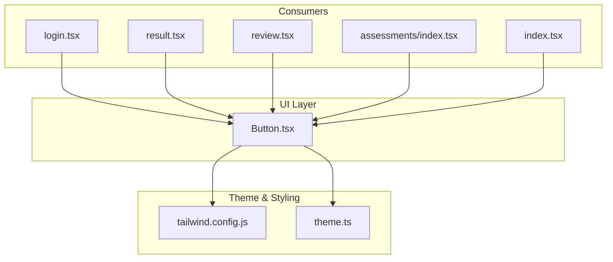
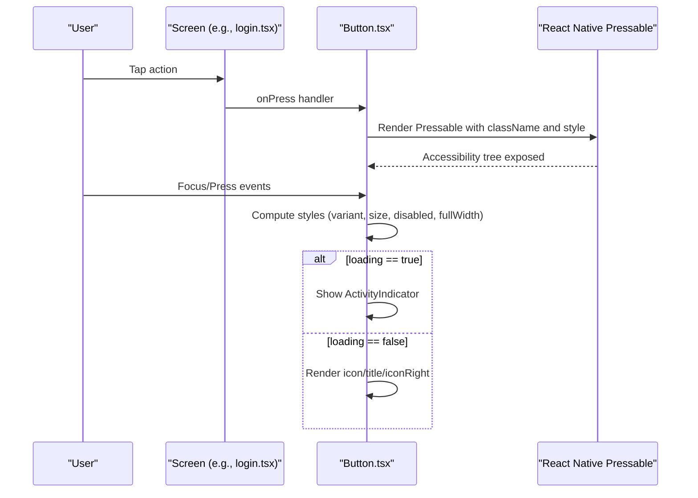
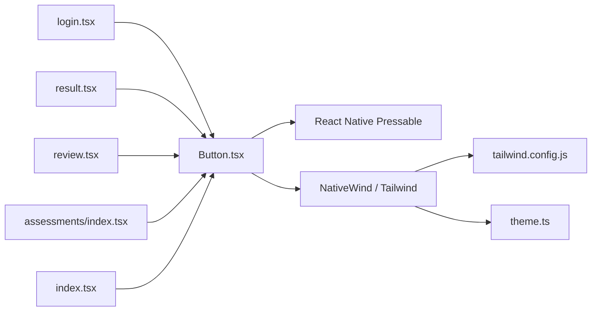

# Button Component

<cite>
**Referenced Files in This Document**
- [Button.tsx](file://src/components/ui/Button.tsx)
- [theme.ts](file://src/constants/theme.ts)
- [tailwind.config.js](file://tailwind.config.js)
- [login.tsx](file://src/app/(auth)/login.tsx)
- [result.tsx](file://src/app/(app)/patients/[patientId]/result.tsx)
- [review.tsx](file://src/app/(app)/patients/[patientId]/review.tsx)
- [assessments/index.tsx](file://src/app/(app)/assessments/index.tsx)
- [index.tsx](file://src/app/index.tsx)
</cite>

## Table of Contents
1. [Introduction](#introduction)
2. [Project Structure](#project-structure)
3. [Core Components](#core-components)
4. [Architecture Overview](#architecture-overview)
5. [Detailed Component Analysis](#detailed-component-analysis)
6. [Dependency Analysis](#dependency-analysis)
7. [Performance Considerations](#performance-considerations)
8. [Troubleshooting Guide](#troubleshooting-guide)
9. [Conclusion](#conclusion)

## Introduction
This document provides comprehensive documentation for the Button component used across DermSight’s UI library. It covers all supported props, styling customization via NativeWind classes and inline styles, accessibility considerations, performance guidance, and best practices with real usage examples from the application.

## Project Structure
The Button component is a reusable UI primitive located under the shared UI components directory and consumed by multiple screens throughout the app. Its appearance is driven by NativeWind (Tailwind CSS for React Native), with theme tokens defined centrally.

**Diagram sources**
- [Button.tsx:1-101](file://src/components/ui/Button.tsx#L1-L101)
- [tailwind.config.js:1-45](file://tailwind.config.js#L1-L45)
- [theme.ts:1-74](file://src/constants/theme.ts#L1-L74)
- [login.tsx:145-165](file://src/app/(auth)/login.tsx#L145-L165)
- [result.tsx:114-122](file://src/app/(app)/patients/[patientId]/result.tsx#L114-L122)
- [review.tsx:111-121](file://src/app/(app)/patients/[patientId]/review.tsx#L111-L121)
- [assessments/index.tsx:64-71](file://src/app/(app)/assessments/index.tsx#L64-L71)
- [index.tsx:163-173](file://src/app/index.tsx#L163-L173)

**Section sources**
- [Button.tsx:1-101](file://src/components/ui/Button.tsx#L1-L101)
- [tailwind.config.js:1-45](file://tailwind.config.js#L1-L45)
- [theme.ts:1-74](file://src/constants/theme.ts#L1-L74)

## Core Components
The Button component is built on React Native’s Pressable and styled with NativeWind. It supports multiple variants, sizes, states, and optional icons to provide consistent interaction affordances across the app.

Key capabilities:
- Variants: primary, secondary, outline, danger
- Sizes: sm, md, lg
- States: disabled, loading
- Icons: left icon and right icon slots
- Layout: fullWidth toggle
- Customization: NativeWind classes + inline style prop

**Section sources**
- [Button.tsx:14-38](file://src/components/ui/Button.tsx#L14-L38)
- [Button.tsx:39-100](file://src/components/ui/Button.tsx#L39-L100)

## Architecture Overview
At runtime, the Button renders a Pressable container that composes size, variant, and state styles using Tailwind classes. When loading is true, it shows an ActivityIndicator; otherwise, it displays optional icons and the title text. The component remains accessible through Pressable’s default semantics and can be enhanced with additional accessibility props when needed.

**Diagram sources**
- [Button.tsx:64-99](file://src/components/ui/Button.tsx#L64-L99)
- [login.tsx:145-165](file://src/app/(auth)/login.tsx#L145-L165)

## Detailed Component Analysis

### Props Reference
- title: string — Required. The button label shown to users.
- onPress: () => void — Required. Callback invoked on press.
- variant: "primary" | "secondary" | "outline" | "danger" — Defaults to "primary". Controls background and text colors.
- size: "sm" | "md" | "lg" — Defaults to "md". Controls padding and overall height.
- disabled: boolean — Defaults to false. Disables interaction and reduces opacity.
- loading: boolean — Defaults to false. Shows an indeterminate spinner and disables interaction.
- icon: React.ReactNode — Optional. Left-side icon slot.
- iconRight: React.ReactNode — Optional. Right-side icon slot.
- style: ViewStyle — Optional. Inline styles merged with NativeWind classes.
- fullWidth: boolean — Defaults to true. Makes the button span the full width of its container.

Notes:
- When disabled or loading is true, the button is not interactive and visually indicates the state.
- The component uses NativeWind classes for layout and theming; pass style for overrides or fine-tuning.

**Section sources**
- [Button.tsx:14-38](file://src/components/ui/Button.tsx#L14-L38)
- [Button.tsx:39-100](file://src/components/ui/Button.tsx#L39-L100)

### Variants and Sizing
- Variants:
  - primary: solid primary color background with white text
  - secondary: light primary tint background with primary text
  - outline: bordered with white background and primary text
  - danger: red-tinted background with red text
- Sizes:
  - sm: compact padding
  - md: standard padding
  - lg: larger padding

These are implemented via Tailwind classes mapped to theme tokens.

**Section sources**
- [Button.tsx:42-60](file://src/components/ui/Button.tsx#L42-L60)
- [tailwind.config.js:7-20](file://tailwind.config.js#L7-L20)
- [theme.ts:8-37](file://src/constants/theme.ts#L8-L37)

### States: Disabled and Loading
- disabled: Prevents onPress and applies reduced opacity.
- loading: Hides content, shows a small ActivityIndicator, and prevents interaction.

Best practice:
- Use loading during async operations (e.g., saving data).
- Combine disabled with external conditions (e.g., offline state) to prevent invalid actions.

**Section sources**
- [Button.tsx:62-81](file://src/components/ui/Button.tsx#L62-L81)
- [assessments/index.tsx:64-71](file://src/app/(app)/assessments/index.tsx#L64-L71)

### Icons
- icon: Place an element before the title for a leading icon.
- iconRight: Place an element after the title for a trailing icon.
- Spacing between icon and text is handled automatically via margin utilities.

Examples in the app:
- Leading icon for “Retake Photo”
- Trailing arrow icon for navigation flows

**Section sources**
- [Button.tsx:83-96](file://src/components/ui/Button.tsx#L83-L96)
- [review.tsx:111-121](file://src/app/(app)/patients/[patientId]/review.tsx#L111-L121)
- [index.tsx:163-173](file://src/app/index.tsx#L163-L173)

### Full Width and Layout
- fullWidth: When true (default), the button stretches to fill available width.
- Set fullWidth={false} for inline or constrained layouts (e.g., inside empty states or toolbars).

**Section sources**
- [Button.tsx:68-74](file://src/components/ui/Button.tsx#L68-L74)
- [assessments/index.tsx:64-71](file://src/app/(app)/assessments/index.tsx#L64-L71)
- [result.tsx:114-122](file://src/app/(app)/patients/[patientId]/result.tsx#L114-L122)

### Styling Customization
- NativeWind classes:
  - Base layout: flex-row, items-center, justify-center, rounded-xl, font-semibold
  - Size: px/py values per size
  - Variant: bg/text/border classes
  - State: opacity for disabled
- Inline style:
  - Pass style prop to override or add custom styles (e.g., margins, shadows)

Theme integration:
- Colors are sourced from tailwind.config.js and theme.ts, ensuring consistency across the app.

**Section sources**
- [Button.tsx:39-75](file://src/components/ui/Button.tsx#L39-L75)
- [tailwind.config.js:7-20](file://tailwind.config.js#L7-L20)
- [theme.ts:8-37](file://src/constants/theme.ts#L8-L37)

### Usage Examples Across Screens
- Login screen:
  - Primary button with loading state for authentication flow
  - Outline button to switch between PIN and email login modes
- Patient result screen:
  - Primary and outline buttons for saving results and starting new assessments
- Review screen:
  - Buttons with leading/trailing icons for analysis and retaking photos
- Assessments sync:
  - Small, non-full-width button with loading and disabled based on connectivity
- Onboarding splash:
  - Button with trailing icon to advance slides

**Section sources**
- [login.tsx:145-165](file://src/app/(auth)/login.tsx#L145-L165)
- [result.tsx:114-122](file://src/app/(app)/patients/[patientId]/result.tsx#L114-L122)
- [review.tsx:111-121](file://src/app/(app)/patients/[patientId]/review.tsx#L111-L121)
- [assessments/index.tsx:64-71](file://src/app/(app)/assessments/index.tsx#L64-L71)
- [index.tsx:163-173](file://src/app/index.tsx#L163-L173)

## Dependency Analysis
The Button component depends on:
- React Native primitives: Pressable, Text, ActivityIndicator
- NativeWind/Tailwind classes for styling
- Theme tokens from tailwind.config.js and theme.ts

Consumer screens import and render Button with various combinations of props to match UX needs.

**Diagram sources**
- [Button.tsx:6-12](file://src/components/ui/Button.tsx#L6-L12)
- [tailwind.config.js:1-45](file://tailwind.config.js#L1-L45)
- [theme.ts:1-74](file://src/constants/theme.ts#L1-L74)
- [login.tsx:145-165](file://src/app/(auth)/login.tsx#L145-L165)
- [result.tsx:114-122](file://src/app/(app)/patients/[patientId]/result.tsx#L114-L122)
- [review.tsx:111-121](file://src/app/(app)/patients/[patientId]/review.tsx#L111-L121)
- [assessments/index.tsx:64-71](file://src/app/(app)/assessments/index.tsx#L64-L71)
- [index.tsx:163-173](file://src/app/index.tsx#L163-L173)

**Section sources**
- [Button.tsx:6-12](file://src/components/ui/Button.tsx#L6-L12)
- [tailwind.config.js:1-45](file://tailwind.config.js#L1-L45)
- [theme.ts:1-74](file://src/constants/theme.ts#L1-L74)

## Performance Considerations
- Prefer loading over disabled for asynchronous actions to keep the user informed without blocking other interactions unnecessarily.
- Avoid passing heavy icon components directly into icon/iconRight if they cause re-renders; memoize or extract stable references when possible.
- Keep fullWidth only where needed; in dense lists or toolbars, use smaller sizes and non-fullwidth buttons to reduce layout shifts.
- Leverage NativeWind classes for most styling to avoid excessive inline style recalculations.
- Reuse consistent variants and sizes to minimize visual complexity and improve maintainability.

[No sources needed since this section provides general guidance]

## Troubleshooting Guide
Common issues and resolutions:
- Button not responding:
  - Ensure disabled is not set unintentionally.
  - Verify onPress is provided and not overridden elsewhere.
- Loading spinner not visible:
  - Confirm loading is true and the parent container allows rendering children.
- Styles not applied:
  - Check that NativeWind is configured and your class names match the theme tokens.
  - If overriding with style, ensure no conflicting properties.
- Icon spacing looks off:
  - Adjust margins around icon elements or use iconRight for trailing alignment.

Accessibility tips:
- The component uses Pressable, which exposes basic accessibility semantics. For richer experiences, consider adding aria-like props such as accessibilityLabel and accessibilityRole at the consumer level if needed.
- Ensure titles are concise and descriptive for screen readers.
- When using icons, ensure they convey meaning or pair with text so screen readers can interpret intent.

**Section sources**
- [Button.tsx:64-99](file://src/components/ui/Button.tsx#L64-L99)

## Conclusion
The Button component offers a flexible, theme-driven interface for common actions across DermSight. With support for variants, sizes, states, icons, and both NativeWind and inline styling, it adapts to diverse UI contexts while maintaining consistency. Follow the usage patterns and best practices outlined here to deliver accessible, performant, and visually coherent interactions throughout the application.

[No sources needed since this section summarizes without analyzing specific files]