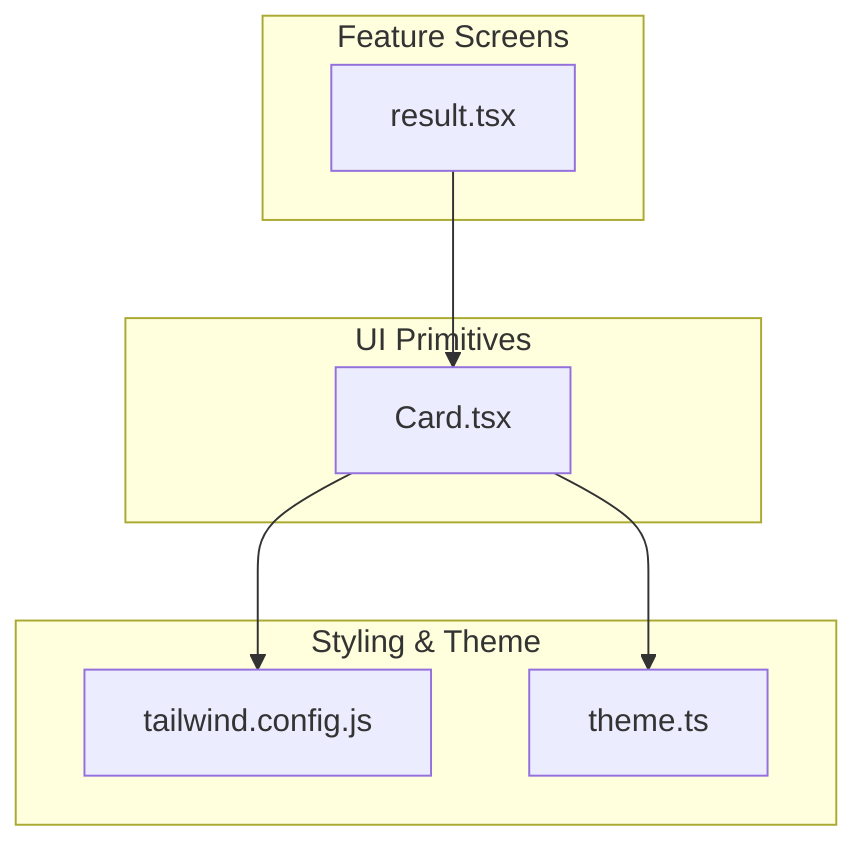
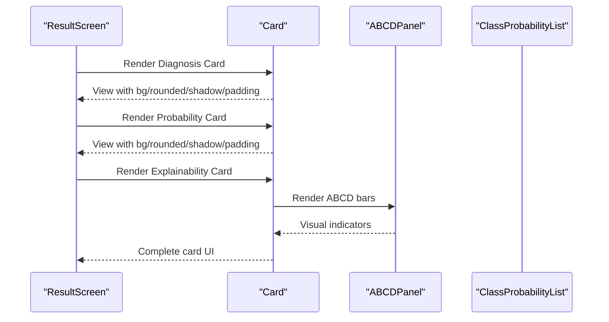
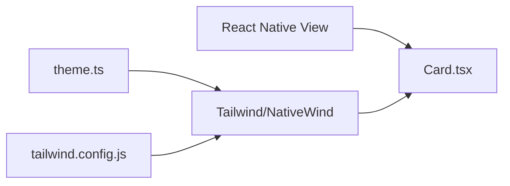

# Card Component

<cite>
**Referenced Files in This Document**
- [Card.tsx](file://src/components/ui/Card.tsx)
- [result.tsx](file://src/app/(app)/patients/[patientId]/result.tsx)
- [theme.ts](file://src/constants/theme.ts)
- [tailwind.config.js](file://tailwind.config.js)
</cite>

## Table of Contents
1. [Introduction](#introduction)
2. [Project Structure](#project-structure)
3. [Core Components](#core-components)
4. [Architecture Overview](#architecture-overview)
5. [Detailed Component Analysis](#detailed-component-analysis)
6. [Dependency Analysis](#dependency-analysis)
7. [Performance Considerations](#performance-considerations)
8. [Troubleshooting Guide](#troubleshooting-guide)
9. [Conclusion](#conclusion)
10. [Appendices](#appendices)

## Introduction
This document provides comprehensive documentation for the Card component used as a content container in DermSight. It covers props, styling options, layout behavior, responsive patterns, accessibility considerations, and best practices for composing cards within the app’s information architecture. The goal is to help developers consistently use Card across screens while maintaining clarity, usability, and performance.

## Project Structure
The Card component lives under the shared UI layer and is consumed by feature screens. In this codebase:
- The Card component is defined in the UI primitives folder.
- It is used on the Assessment Result screen to group related content such as diagnosis, probabilities, and explainability panels.
- Styling is primarily driven by Tailwind utility classes via NativeWind, with theme tokens available for consistency.

**Diagram sources**
- [Card.tsx:1-30](file://src/components/ui/Card.tsx#L1-L30)
- [result.tsx:76-108](file://src/app/(app)/patients/[patientId]/result.tsx#L76-L108)
- [tailwind.config.js:1-45](file://tailwind.config.js#L1-L45)
- [theme.ts:1-74](file://src/constants/theme.ts#L1-L74)

**Section sources**
- [Card.tsx:1-30](file://src/components/ui/Card.tsx#L1-L30)
- [result.tsx:76-108](file://src/app/(app)/patients/[patientId]/result.tsx#L76-L108)
- [tailwind.config.js:1-45](file://tailwind.config.js#L1-L45)
- [theme.ts:1-74](file://src/constants/theme.ts#L1-L74)

## Core Components
- Card: A lightweight container that applies consistent background, border radius, shadow, and optional padding. It accepts children and supports both Tailwind class names and React Native style overrides.

Key responsibilities:
- Provide visual grouping for related content.
- Offer consistent spacing and elevation through default styles.
- Allow customization via className and style props.

**Section sources**
- [Card.tsx:8-29](file://src/components/ui/Card.tsx#L8-L29)

## Architecture Overview
At runtime, screens render Card to encapsulate content blocks. For example, the Assessment Result screen uses Card to wrap:
- Top diagnosis and confidence
- Class probability breakdown
- ABCD explainability panel

**Diagram sources**
- [result.tsx:76-108](file://src/app/(app)/patients/[patientId]/result.tsx#L76-L108)
- [Card.tsx:15-29](file://src/components/ui/Card.tsx#L15-L29)

## Detailed Component Analysis

### Props and API
- children: Any React node to be rendered inside the card.
- style: Optional React Native style object to override or extend styles.
- className: Optional Tailwind class string to customize appearance.
- padded: Boolean (default true) to toggle internal padding.

Behavior:
- Default styling includes white background, rounded corners, subtle shadow, and a light border.
- When padded is true, internal padding is applied; when false, no padding is added.
- className allows additional Tailwind utilities to be composed.
- style merges with existing styles at the root View.

Usage examples from the app:
- Basic card wrapping text and simple content.
- Cards containing complex nested components like probability lists and explainability panels.

**Section sources**
- [Card.tsx:8-29](file://src/components/ui/Card.tsx#L8-L29)
- [result.tsx:76-108](file://src/app/(app)/patients/[patientId]/result.tsx#L76-L108)

### Styling Options
- Background: White surface for clear separation from page backgrounds.
- Border: Light border for subtle definition.
- Shadow: Subtle elevation to indicate content grouping.
- Rounded corners: Consistent corner radius for modern look.
- Padding: Optional internal spacing controlled by padded prop.
- Customization: Use className to add spacing, alignment, or color accents; use style for precise control.

Theme integration:
- Colors are extended via Tailwind configuration for primary, navy, risk levels, and surfaces.
- Theme constants define semantic colors and spacing tokens that can inform custom card variants.

Responsive design patterns:
- Cards rely on flexible layouts and relative units. Combine with flexbox utilities to adapt to different screen sizes.
- For grids or multi-column layouts, pair Card with responsive row/column patterns to ensure readability on small devices.
- Avoid fixed widths; prefer fluid sizing and appropriate gaps to maintain balance.

Accessibility considerations:
- Ensure meaningful labels for interactive elements inside cards.
- Use sufficient contrast between text and card background.
- Group related content logically so assistive technologies can navigate efficiently.
- If a card acts as an actionable unit, consider adding appropriate semantics at the parent level.

Best practices for composition:
- Keep each card focused on a single concept or task.
- Limit content density; use headings and separators to structure information.
- Prefer consistent spacing and typography scales across cards.
- Reuse Card for similar content blocks to maintain visual consistency.

**Section sources**
- [Card.tsx:21-27](file://src/components/ui/Card.tsx#L21-L27)
- [tailwind.config.js:7-37](file://tailwind.config.js#L7-L37)
- [theme.ts:8-37](file://src/constants/theme.ts#L8-L37)

### Layout Behaviors
- Container role: Card wraps content without imposing layout constraints beyond its own styling.
- Padding: Controlled by padded prop; set to false when you need zero internal spacing or will apply your own spacing.
- Flexibility: Works well inside scrollable containers and flex layouts.
- Nesting: Supports nested components and lists; ensure internal spacing is managed to avoid excessive whitespace.

Example usage patterns:
- Wrap diagnostic summary with heading, value, and status indicator.
- Encapsulate data tables or lists with clear headers and footers if needed.
- Combine multiple cards in a vertical stack with consistent gaps.

**Section sources**
- [Card.tsx:15-29](file://src/components/ui/Card.tsx#L15-L29)
- [result.tsx:76-108](file://src/app/(app)/patients/[patientId]/result.tsx#L76-L108)

### Examples
- Basic card: Wrap a short message or metric to highlight it.
- Card with header/footer: Place a title at the top and actions or notes at the bottom using children composition.
- Nested content: Embed charts, lists, or panels inside the card to group related information.

Note: Refer to the result screen where Card is used to group diagnosis, probabilities, and explainability content.

**Section sources**
- [result.tsx:76-108](file://src/app/(app)/patients/[patientId]/result.tsx#L76-L108)

## Dependency Analysis
Card depends on:
- React Native View for rendering.
- Tailwind utilities via NativeWind for styling.
- Theme tokens indirectly influence visual consistency across the app.

**Diagram sources**
- [Card.tsx:5-6](file://src/components/ui/Card.tsx#L5-L6)
- [tailwind.config.js:1-45](file://tailwind.config.js#L1-L45)
- [theme.ts:1-74](file://src/constants/theme.ts#L1-L74)

**Section sources**
- [Card.tsx:5-6](file://src/components/ui/Card.tsx#L5-L6)
- [tailwind.config.js:1-45](file://tailwind.config.js#L1-L45)
- [theme.ts:1-74](file://src/constants/theme.ts#L1-L74)

## Performance Considerations
- Keep card content concise to minimize re-renders.
- Avoid overly deep nesting inside cards; flatten structures where possible.
- Use memoization for expensive child components inside cards if they trigger frequent updates.
- Prefer static styling via className for most cases; reserve style prop for dynamic overrides.

[No sources needed since this section provides general guidance]

## Troubleshooting Guide
Common issues and resolutions:
- Unexpected spacing: If content feels cramped or too loose, adjust padded or add className utilities for margin/padding.
- Style conflicts: When using both className and style, verify that style does not override critical properties unintentionally.
- Responsiveness problems: Ensure parent containers use flexible layouts; avoid fixed widths that break on small screens.
- Accessibility gaps: Add descriptive labels to interactive elements within cards; ensure adequate contrast.

**Section sources**
- [Card.tsx:15-29](file://src/components/ui/Card.tsx#L15-L29)

## Conclusion
The Card component offers a simple, consistent way to group and present content in DermSight. By leveraging its props and Tailwind-based styling, teams can create accessible, responsive, and visually coherent interfaces. Follow the recommended composition patterns and accessibility guidelines to maintain high quality across the application.

[No sources needed since this section summarizes without analyzing specific files]

## Appendices

### Quick Reference: Card Props
- children: Content to render inside the card.
- style: Optional React Native style object.
- className: Optional Tailwind class string for customization.
- padded: Toggle internal padding (default true).

**Section sources**
- [Card.tsx:8-29](file://src/components/ui/Card.tsx#L8-L29)