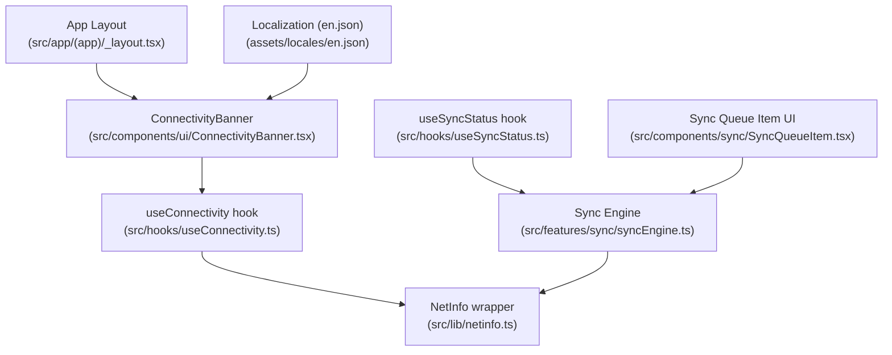
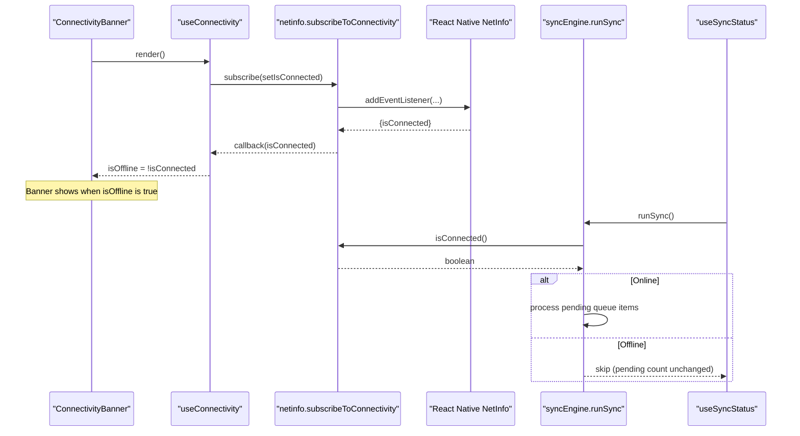
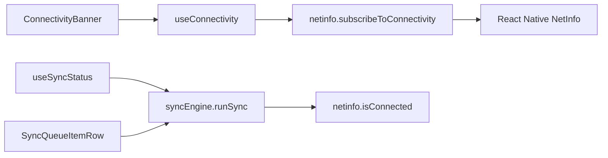

# Connectivity Banner Component

<cite>
**Referenced Files in This Document**
- [ConnectivityBanner.tsx](file://src/components/ui/ConnectivityBanner.tsx)
- [useConnectivity.ts](file://src/hooks/useConnectivity.ts)
- [netinfo.ts](file://src/lib/netinfo.ts)
- [_layout.tsx](file://src/app/(app)/_layout.tsx)
- [syncEngine.ts](file://src/features/sync/syncEngine.ts)
- [useSyncStatus.ts](file://src/hooks/useSyncStatus.ts)
- [SyncQueueItem.tsx](file://src/components/sync/SyncQueueItem.tsx)
- [en.json](file://assets/locales/en.json)
</cite>

## Table of Contents
1. [Introduction](#introduction)
2. [Project Structure](#project-structure)
3. [Core Components](#core-components)
4. [Architecture Overview](#architecture-overview)
5. [Detailed Component Analysis](#detailed-component-analysis)
6. [Dependency Analysis](#dependency-analysis)
7. [Performance Considerations](#performance-considerations)
8. [Troubleshooting Guide](#troubleshooting-guide)
9. [Conclusion](#conclusion)
10. [Appendices](#appendices)

## Introduction
This document explains the ConnectivityBanner component used in DermSight to display network connectivity status and support offline-first workflows. It covers automatic connection detection, banner appearance and dismissal behavior, customization options, integration with the synchronization system, user feedback patterns for connectivity changes, and accessibility considerations for announcements and visual indicators.

## Project Structure
The ConnectivityBanner is part of a small but cohesive set of modules:
- UI layer: ConnectivityBanner renders a persistent warning banner when offline.
- Hooks: useConnectivity subscribes to NetInfo events and exposes isOffline to components.
- Network abstraction: netinfo wraps React Native’s NetInfo to provide subscription and current state utilities.
- App layout: _layout.tsx places the banner at the top of the authenticated app shell.
- Sync system: syncEngine processes queued items only when online; useSyncStatus tracks pending counts and triggers syncs.
- Localization: en.json provides strings for offline banners and sync-related messages.

**Diagram sources**
- [_layout.tsx:6-34](file://src/app/(app)/_layout.tsx#L6-L34)
- [ConnectivityBanner.tsx:5-29](file://src/components/ui/ConnectivityBanner.tsx#L5-L29)
- [useConnectivity.ts:5-16](file://src/hooks/useConnectivity.ts#L5-L16)
- [netinfo.ts:5-42](file://src/lib/netinfo.ts#L5-L42)
- [useSyncStatus.ts:5-45](file://src/hooks/useSyncStatus.ts#L5-L45)
- [syncEngine.ts:5-145](file://src/features/sync/syncEngine.ts#L5-L145)
- [SyncQueueItem.tsx:1-55](file://src/components/sync/SyncQueueItem.tsx#L1-L55)
- [en.json:49-65](file://assets/locales/en.json#L49-L65)

**Section sources**
- [_layout.tsx:6-34](file://src/app/(app)/_layout.tsx#L6-L34)
- [ConnectivityBanner.tsx:5-29](file://src/components/ui/ConnectivityBanner.tsx#L5-L29)
- [useConnectivity.ts:5-16](file://src/hooks/useConnectivity.ts#L5-L16)
- [netinfo.ts:5-42](file://src/lib/netinfo.ts#L5-L42)
- [useSyncStatus.ts:5-45](file://src/hooks/useSyncStatus.ts#L5-L45)
- [syncEngine.ts:5-145](file://src/features/sync/syncEngine.ts#L5-L145)
- [SyncQueueItem.tsx:1-55](file://src/components/sync/SyncQueueItem.tsx#L1-L55)
- [en.json:49-65](file://assets/locales/en.json#L49-L65)

## Core Components
- ConnectivityBanner: Renders an amber-colored banner with an exclamation indicator and two lines of text when the device is offline. It hides itself automatically when online.
- useConnectivity: Subscribes to NetInfo connectivity changes and returns isConnected and isOffline booleans.
- netinfo: Provides subscribeToConnectivity for event-driven updates and isConnected/getNetworkType for one-time checks.
- App layout: Mounts ConnectivityBanner at the root of the authenticated tabs so it appears consistently across screens.
- Sync engine and hooks: Provide background sync that respects connectivity and expose sync status for UI feedback.

Key behaviors:
- Automatic detection: The banner reacts instantly to connectivity changes via NetInfo events.
- Appearance/dismissal: The banner mounts only when isOffline is true; otherwise it returns null.
- Sync integration: The sync engine skips processing when offline and resumes when online; the UI can trigger syncs when connectivity is available.

**Section sources**
- [ConnectivityBanner.tsx:9-29](file://src/components/ui/ConnectivityBanner.tsx#L9-L29)
- [useConnectivity.ts:8-16](file://src/hooks/useConnectivity.ts#L8-L16)
- [netinfo.ts:15-42](file://src/lib/netinfo.ts#L15-L42)
- [_layout.tsx:31-34](file://src/app/(app)/_layout.tsx#L31-L34)
- [syncEngine.ts:55-110](file://src/features/sync/syncEngine.ts#L55-L110)
- [useSyncStatus.ts:20-30](file://src/hooks/useSyncStatus.ts#L20-L30)

## Architecture Overview
The connectivity flow connects UI, hooks, and network APIs:

**Diagram sources**
- [ConnectivityBanner.tsx:9-29](file://src/components/ui/ConnectivityBanner.tsx#L9-L29)
- [useConnectivity.ts:8-16](file://src/hooks/useConnectivity.ts#L8-L16)
- [netinfo.ts:15-42](file://src/lib/netinfo.ts#L15-L42)
- [syncEngine.ts:55-110](file://src/features/sync/syncEngine.ts#L55-L110)
- [useSyncStatus.ts:20-30](file://src/hooks/useSyncStatus.ts#L20-L30)

## Detailed Component Analysis

### ConnectivityBanner
Responsibilities:
- Display a persistent offline indicator at the top of the app.
- Hide itself when the device reconnects.
- Communicate that data will sync automatically when connection is available.

Behavior:
- Uses useConnectivity to derive isOffline.
- Returns null when online; renders banner when offline.
- Visual design uses an amber palette and an exclamation icon to signal caution.

Customization options:
- Text content can be localized using i18n keys for “offline” messaging.
- Styling can be adjusted by modifying Tailwind classes on the container and inner views.
- Iconography can be swapped or enhanced (e.g., replacing the exclamation mark with a more descriptive icon).

Integration points:
- Mounted in the app layout to ensure global visibility.
- Works alongside sync hooks to inform users about background sync behavior.

Accessibility considerations:
- The banner currently relies on visible text and color contrast. For improved screen reader support, consider adding accessible labels and role attributes to announce connectivity state changes.
- Ensure sufficient color contrast for low-vision users and avoid relying solely on color to convey status.

Example usage pattern:
- Place <ConnectivityBanner /> near the root of your authenticated layout so it appears consistently across all tabs.

**Section sources**
- [ConnectivityBanner.tsx:9-29](file://src/components/ui/ConnectivityBanner.tsx#L9-L29)
- [_layout.tsx:31-34](file://src/app/(app)/_layout.tsx#L31-L34)
- [en.json:49-65](file://assets/locales/en.json#L49-L65)

### useConnectivity Hook
Responsibilities:
- Subscribe to NetInfo connectivity changes.
- Expose isConnected and derived isOffline to consumers.

Processing logic:
- Maintains local state for connection status.
- Subscribes once on mount and unsubscribes on unmount to prevent leaks.
- Derives isOffline from the latest isConnected value.

Error handling:
- Gracefully handles undefined values by defaulting to false where necessary in the NetInfo wrapper.

Performance characteristics:
- Minimal re-renders due to stable subscription lifecycle.
- Efficient because it only updates when connectivity actually changes.

**Section sources**
- [useConnectivity.ts:8-16](file://src/hooks/useConnectivity.ts#L8-L16)
- [netinfo.ts:15-26](file://src/lib/netinfo.ts#L15-L26)

### NetInfo Wrapper
Responsibilities:
- Wrap React Native’s NetInfo to provide a simple subscription API.
- Track last known connectivity state to avoid redundant callbacks.
- Provide synchronous-like helpers for current state and network type.

Data flows:
- subscribeToConnectivity registers an event listener and invokes the callback only when the state changes.
- isConnected fetches the latest state and resolves to a boolean.
- getNetworkType fetches the latest network type string.

Edge cases:
- Handles missing isConnected by defaulting to false.
- Ensures unsubscribe function is returned for proper cleanup.

**Section sources**
- [netinfo.ts:5-42](file://src/lib/netinfo.ts#L5-L42)

### Sync Integration
Responsibilities:
- Background sync engine processes pending queue items only when online.
- Sync status hook tracks pending counts, syncing state, and last synced time.

Processing logic:
- runSync checks connectivity first; if offline, it skips processing and reports skipped items.
- If online, it iterates pending items, marks them in_progress, attempts upload (simulated), then marks done or failed with retry/backoff.
- useSyncStatus triggers sync only when connected and not already syncing, refreshing counts periodically.

User feedback patterns:
- ConnectivityBanner informs users they are offline and that sync will resume automatically.
- Sync queue UI displays per-item status (pending, syncing, failed, done) and offers retry actions for failed items.
- Strings in localization file include offline notices and sync status messages.

Examples:
- Offline mode indicator: ConnectivityBanner shows “You are offline” with a description that data will sync automatically.
- Sync status notifications: SyncQueueItemRow shows status badges and attempt counts; failed items show a Retry action.

**Section sources**
- [syncEngine.ts:55-110](file://src/features/sync/syncEngine.ts#L55-L110)
- [useSyncStatus.ts:20-30](file://src/hooks/useSyncStatus.ts#L20-L30)
- [SyncQueueItem.tsx:15-53](file://src/components/sync/SyncQueueItem.tsx#L15-L53)
- [en.json:147-158](file://assets/locales/en.json#L147-L158)

### Accessibility Considerations
Current state:
- The banner uses visible text and color to indicate offline status.
- No explicit accessibility roles or announcements are present in the banner code.

Recommendations:
- Add accessible labels to the banner container and icon to announce connectivity state to screen readers.
- Use semantic elements or appropriate roles (e.g., alert or status) to convey important state changes.
- Ensure high contrast colors and scalable text sizes for readability.
- Consider providing haptic feedback or additional cues for critical connectivity transitions if appropriate for the app’s UX.

**Section sources**
- [ConnectivityBanner.tsx:14-27](file://src/components/ui/ConnectivityBanner.tsx#L14-L27)

## Dependency Analysis
The ConnectivityBanner depends on a clear chain of abstractions:

Coupling and cohesion:
- Banner is loosely coupled to connectivity via the hook, promoting testability and reuse.
- NetInfo wrapper centralizes platform-specific details, improving cohesion.
- Sync engine encapsulates queue processing and retry logic, keeping UI concerns separate.

Potential circular dependencies:
- None observed between these modules; dependencies are directional and well-scoped.

External integrations:
- React Native NetInfo for connectivity events.
- Drizzle ORM for database operations within the sync engine (outside this document’s scope).

**Diagram sources**
- [ConnectivityBanner.tsx:5-29](file://src/components/ui/ConnectivityBanner.tsx#L5-L29)
- [useConnectivity.ts:5-16](file://src/hooks/useConnectivity.ts#L5-L16)
- [netinfo.ts:5-42](file://src/lib/netinfo.ts#L5-L42)
- [useSyncStatus.ts:5-45](file://src/hooks/useSyncStatus.ts#L5-L45)
- [syncEngine.ts:5-145](file://src/features/sync/syncEngine.ts#L5-L145)

**Section sources**
- [ConnectivityBanner.tsx:5-29](file://src/components/ui/ConnectivityBanner.tsx#L5-L29)
- [useConnectivity.ts:5-16](file://src/hooks/useConnectivity.ts#L5-L16)
- [netinfo.ts:5-42](file://src/lib/netinfo.ts#L5-L42)
- [useSyncStatus.ts:5-45](file://src/hooks/useSyncStatus.ts#L5-L45)
- [syncEngine.ts:5-145](file://src/features/sync/syncEngine.ts#L5-L145)

## Performance Considerations
- Event-driven updates: Connectivity changes are handled via subscriptions, minimizing unnecessary renders.
- Conditional rendering: Banner renders only when offline, reducing overhead.
- Sync throttling: The sync engine uses exponential backoff and caps delays to avoid excessive retries.
- Periodic refresh: useSyncStatus polls pending counts at intervals; ensure interval frequency balances responsiveness and performance.

[No sources needed since this section provides general guidance]

## Troubleshooting Guide
Common issues and resolutions:
- Banner does not appear when offline:
  - Verify that useConnectivity is subscribed and receiving updates from NetInfo.
  - Check that the app layout mounts ConnectivityBanner at the root of the authenticated shell.
- Banner persists after reconnecting:
  - Confirm that NetInfo events are firing and that the hook’s state updates correctly.
  - Ensure no other component is overriding or hiding the banner.
- Sync not starting when online:
  - Confirm that useSyncStatus.triggerSync is called and that isConnected is true.
  - Inspect syncEngine.runSync logs to see if items are being processed or skipped due to offline checks.
- Incorrect network type reporting:
  - Use getNetworkType to verify the reported type and ensure downstream logic handles unknown types gracefully.

**Section sources**
- [useConnectivity.ts:8-16](file://src/hooks/useConnectivity.ts#L8-L16)
- [_layout.tsx:31-34](file://src/app/(app)/_layout.tsx#L31-L34)
- [netinfo.ts:15-42](file://src/lib/netinfo.ts#L15-L42)
- [useSyncStatus.ts:20-30](file://src/hooks/useSyncStatus.ts#L20-L30)
- [syncEngine.ts:55-110](file://src/features/sync/syncEngine.ts#L55-L110)

## Conclusion
The ConnectivityBanner provides a simple, effective way to communicate offline status in DermSight. It integrates cleanly with the app’s connectivity monitoring and synchronization systems, ensuring users understand when features are limited and when data will sync automatically. By enhancing accessibility and offering localization-friendly text, the component can deliver inclusive and consistent user feedback across connectivity states.

[No sources needed since this section summarizes without analyzing specific files]

## Appendices

### Example Scenarios
- Offline mode indicator:
  - When the device loses connectivity, the banner appears with an exclamation icon and a message indicating offline status and automatic sync upon reconnection.
- Sync status notifications:
  - In the sync queue view, each item shows its status (pending, syncing, failed, done) and attempt count. Failed items offer a retry action.

**Section sources**
- [ConnectivityBanner.tsx:14-27](file://src/components/ui/ConnectivityBanner.tsx#L14-L27)
- [SyncQueueItem.tsx:15-53](file://src/components/sync/SyncQueueItem.tsx#L15-L53)
- [en.json:147-158](file://assets/locales/en.json#L147-L158)