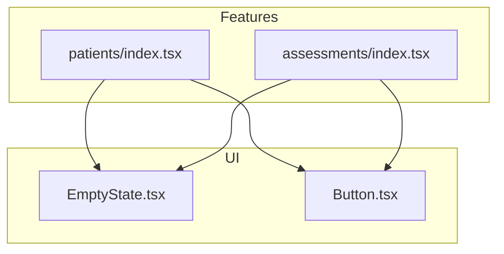
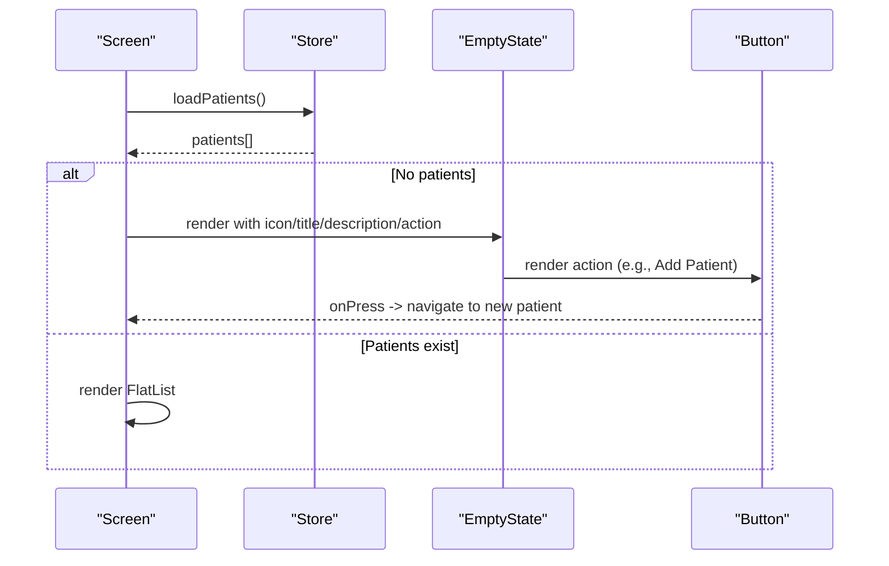
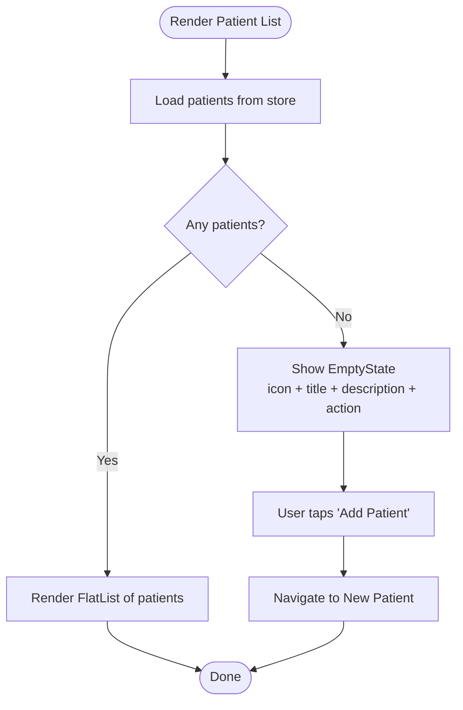
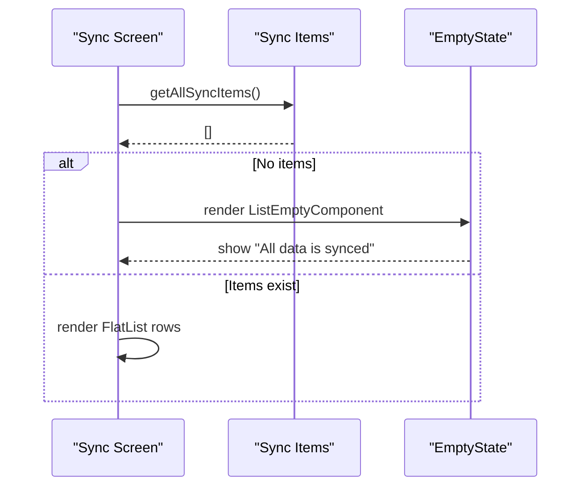
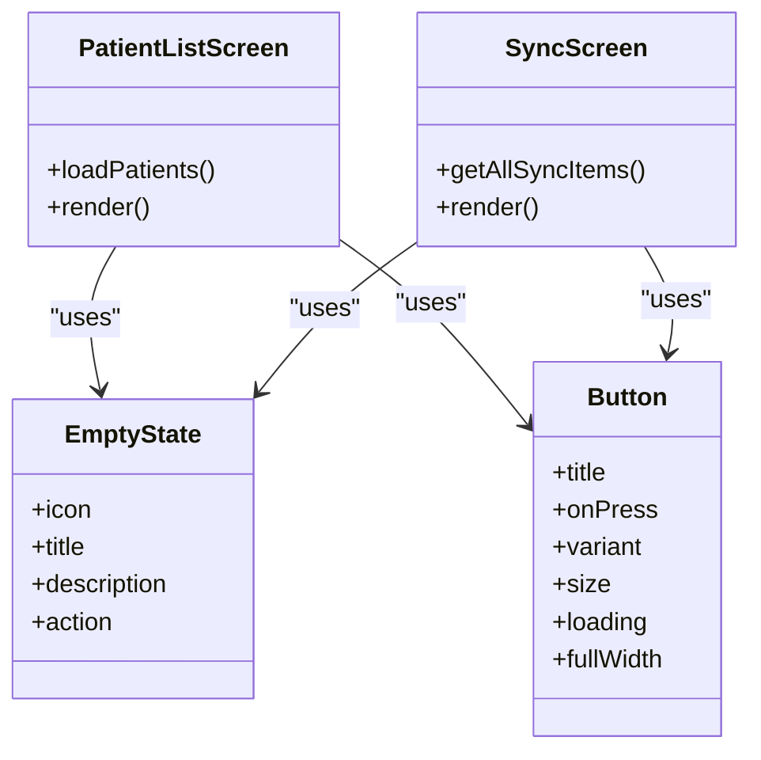

# Empty State Component

<cite>
**Referenced Files in This Document**
- [EmptyState.tsx](file://src/components/ui/EmptyState.tsx)
- [patients/index.tsx](file://src/app/(app)/patients/index.tsx)
- [assessments/index.tsx](file://src/app/(app)/assessments/index.tsx)
- [Button.tsx](file://src/components/ui/Button.tsx)
- [review.tsx](file://src/app/(app)/patients/[patientId]/review.tsx)
- [store.ts](file://src/features/patients/store.ts)
</cite>

## Table of Contents
1. [Introduction](#introduction)
2. [Project Structure](#project-structure)
3. [Core Components](#core-components)
4. [Architecture Overview](#architecture-overview)
5. [Detailed Component Analysis](#detailed-component-analysis)
6. [Dependency Analysis](#dependency-analysis)
7. [Performance Considerations](#performance-considerations)
8. [Troubleshooting Guide](#troubleshooting-guide)
9. [Conclusion](#conclusion)
10. [Appendices](#appendices)

## Introduction
This document provides comprehensive documentation for the EmptyState component used across DermSight to display empty or loading-related states. It explains props, usage patterns, and best practices for creating helpful and actionable empty states that guide users toward next steps. It also clarifies when to use EmptyState versus other loading indicators such as spinners or progress bars.

## Project Structure
The EmptyState component is a reusable UI primitive located under the shared UI components. It is consumed by feature screens to present meaningful messages when there is no data to show, often paired with an action button to guide the user forward.

**Diagram sources**
- [EmptyState.tsx:1-36](file://src/components/ui/EmptyState.tsx#L1-L36)
- [Button.tsx:1-101](file://src/components/ui/Button.tsx#L1-L101)
- [patients/index.tsx:1-132](file://src/app/(app)/patients/index.tsx#L1-L132)
- [assessments/index.tsx:1-106](file://src/app/(app)/assessments/index.tsx#L1-L106)

**Section sources**
- [EmptyState.tsx:1-36](file://src/components/ui/EmptyState.tsx#L1-L36)
- [patients/index.tsx:1-132](file://src/app/(app)/patients/index.tsx#L1-L132)
- [assessments/index.tsx:1-106](file://src/app/(app)/assessments/index.tsx#L1-L106)

## Core Components
- EmptyState: A minimal, centered layout that displays an optional icon, a title, an optional description, and an optional action area. It is designed to be used when a list or view has no content to render.
- Button: A versatile button component that supports variants, sizes, icons, and a built-in loading state using ActivityIndicator. It is commonly used as the action within EmptyState to drive next steps.

Key responsibilities:
- EmptyState focuses on messaging and layout; it does not handle data fetching or navigation logic.
- Button handles visual feedback during asynchronous actions (e.g., loading).

**Section sources**
- [EmptyState.tsx:8-35](file://src/components/ui/EmptyState.tsx#L8-L35)
- [Button.tsx:14-100](file://src/components/ui/Button.tsx#L14-L100)

## Architecture Overview
EmptyState is a presentational component. Screens compose it with context-specific messages and actions. In DermSight, it is used in two primary scenarios:
- Patient list: When there are no patients, show a friendly message and an “Add Patient” action.
- Sync queue: When there are no items to sync, show a confirmation message.

**Diagram sources**
- [patients/index.tsx:23-120](file://src/app/(app)/patients/index.tsx#L23-L120)
- [store.ts:33-41](file://src/features/patients/store.ts#L33-L41)
- [EmptyState.tsx:15-35](file://src/components/ui/EmptyState.tsx#L15-L35)
- [Button.tsx:27-100](file://src/components/ui/Button.tsx#L27-L100)

## Detailed Component Analysis

### EmptyState Props and Behavior
Props:
- icon: Optional React node rendered above the title. Use this to provide a contextual illustration or emoji.
- title: Required string displayed prominently to communicate the current state.
- description: Optional string providing additional context or guidance.
- action: Optional React node placed below the description. Typically a Button or similar control to guide the user to the next step.

Behavior:
- Centers content vertically and horizontally with padding.
- Renders icon if provided, then title, then description if provided, then action.
- Does not include its own spacing beyond internal padding; screens should manage surrounding layout.

Guidelines:
- Keep titles concise and outcome-focused (e.g., “No patients yet”).
- Use descriptions to explain why the state exists and what to do next.
- Always pair with an actionable element when possible (e.g., “Add Patient”, “Sync Now”).
- Avoid heavy illustrations; prefer lightweight icons or emojis for simplicity and performance.

**Section sources**
- [EmptyState.tsx:8-35](file://src/components/ui/EmptyState.tsx#L8-L35)

### Usage Example: Empty Patient List
Scenario: The patient list screen loads data and shows EmptyState when there are no patients.

Flow:
- On mount, the screen triggers data loading via the store.
- If the resulting list is empty, EmptyState renders with a people icon, a clear title, a short description, and an “Add Patient” button that navigates to the new patient screen.

**Diagram sources**
- [patients/index.tsx:23-120](file://src/app/(app)/patients/index.tsx#L23-L120)
- [store.ts:33-41](file://src/features/patients/store.ts#L33-L41)

**Section sources**
- [patients/index.tsx:95-107](file://src/app/(app)/patients/index.tsx#L95-L107)

### Usage Example: Empty Sync Queue
Scenario: The sync queue screen uses EmptyState as the ListEmptyComponent to indicate no pending items.

Flow:
- The screen fetches sync items and filters them into lists.
- When the list is empty, EmptyState renders with a cloud icon, a reassuring title, and a brief description.

**Diagram sources**
- [assessments/index.tsx:21-100](file://src/app/(app)/assessments/index.tsx#L21-L100)

**Section sources**
- [assessments/index.tsx:94-100](file://src/app/(app)/assessments/index.tsx#L94-L100)

### When to Use EmptyState vs Other Loading Indicators
Use EmptyState when:
- There is no data to show and you want to provide a clear message and a next step.
- The absence of data is a stable state (e.g., first run, cleared list, no results after search/filter).

Use loading indicators (spinners, skeletons, progress bars) when:
- Data is being fetched or processed and the final state is unknown.
- You need to convey ongoing work without committing to a specific outcome.

Examples in DermSight:
- EmptyState: Used for empty patient lists and empty sync queues.
- ActivityIndicator: Used during image analysis and authentication flows where operations take time but are not terminal states.

Best practice:
- Do not mix EmptyState with long-running loading indicators. If data is still loading, show a spinner; once loading completes and the result is empty, switch to EmptyState.

**Section sources**
- [review.tsx:102-108](file://src/app/(app)/patients/[patientId]/review.tsx#L102-L108)
- [Button.tsx:77-81](file://src/components/ui/Button.tsx#L77-L81)

### Creating Helpful and Actionable Empty States
Guidelines:
- Be specific: Title should reflect the exact scenario (e.g., “No patients yet”, “All data is synced”).
- Provide context: Description should explain why the state exists and what it means.
- Offer a next step: Include an action that moves the user forward (e.g., “Add Patient”, “Sync Now”).
- Keep it simple: Prefer lightweight icons or emojis; avoid heavy assets.
- Maintain consistency: Use consistent tone and structure across screens.

Patterns observed in DermSight:
- Patient list: People icon + “No patients yet” + “Add your first patient to get started.” + “Add Patient” button.
- Sync queue: Cloud icon + “All data is synced” + “No items in the sync queue.”

**Section sources**
- [patients/index.tsx:96-107](file://src/app/(app)/patients/index.tsx#L96-L107)
- [assessments/index.tsx:95-100](file://src/app/(app)/assessments/index.tsx#L95-L100)

## Dependency Analysis
EmptyState depends only on React Native primitives and styling utilities. It is agnostic to business logic and is composed by screens.

**Diagram sources**
- [EmptyState.tsx:8-35](file://src/components/ui/EmptyState.tsx#L8-L35)
- [Button.tsx:14-100](file://src/components/ui/Button.tsx#L14-L100)
- [patients/index.tsx:16-120](file://src/app/(app)/patients/index.tsx#L16-L120)
- [assessments/index.tsx:15-100](file://src/app/(app)/assessments/index.tsx#L15-L100)

**Section sources**
- [EmptyState.tsx:8-35](file://src/components/ui/EmptyState.tsx#L8-L35)
- [Button.tsx:14-100](file://src/components/ui/Button.tsx#L14-L100)
- [patients/index.tsx:16-120](file://src/app/(app)/patients/index.tsx#L16-L120)
- [assessments/index.tsx:15-100](file://src/app/(app)/assessments/index.tsx#L15-L100)

## Performance Considerations
- Keep EmptyState lightweight: It renders minimal UI and avoids heavy images.
- Avoid unnecessary re-renders: Pass stable icon elements or memoize complex actions if needed.
- Prefer text-based icons (emojis) for simplicity and speed.
- Ensure actions are disabled appropriately during async operations (use Button’s loading prop).

[No sources needed since this section provides general guidance]

## Troubleshooting Guide
Common issues and resolutions:
- EmptyState appears too early: Ensure data loading is complete before switching to EmptyState. Use loading flags to prevent premature rendering.
- Missing action: Always include an action when appropriate to guide users (e.g., add a patient or trigger sync).
- Confusing messages: Make titles and descriptions specific to the context; avoid generic phrases like “No data”.
- Accessibility: Ensure titles and descriptions are readable and meaningful; consider adding accessibility labels for icons if they convey important information.

Operational notes:
- For data fetching, set loading states in stores and screens to avoid showing EmptyState while data is still loading.
- For network-dependent features, combine EmptyState with connectivity checks to inform users about offline states separately.

**Section sources**
- [store.ts:33-41](file://src/features/patients/store.ts#L33-L41)
- [Button.tsx:77-81](file://src/components/ui/Button.tsx#L77-L81)

## Conclusion
EmptyState is a focused, composable component for presenting empty conditions with clarity and direction. By pairing concise messaging with actionable controls, it improves user experience and reduces confusion. Use it for stable empty states and reserve loading indicators for ongoing operations. Follow the guidelines above to create consistent, helpful, and actionable empty states across DermSight.

[No sources needed since this section summarizes without analyzing specific files]

## Appendices

### Quick Reference: EmptyState Props
- icon: Optional React node for an illustration or emoji.
- title: Required string for the main message.
- description: Optional string for additional context.
- action: Optional React node for a control (commonly a Button).

**Section sources**
- [EmptyState.tsx:8-35](file://src/components/ui/EmptyState.tsx#L8-L35)

### Example Scenarios and Where to Find Them
- Empty patient list: See the patient list screen’s conditional rendering and EmptyState usage.
- Empty sync queue: See the sync screen’s ListEmptyComponent usage.
- Loading during analysis: See the review screen’s ActivityIndicator usage for ongoing operations.

**Section sources**
- [patients/index.tsx:95-107](file://src/app/(app)/patients/index.tsx#L95-L107)
- [assessments/index.tsx:94-100](file://src/app/(app)/assessments/index.tsx#L94-L100)
- [review.tsx:102-108](file://src/app/(app)/patients/[patientId]/review.tsx#L102-L108)