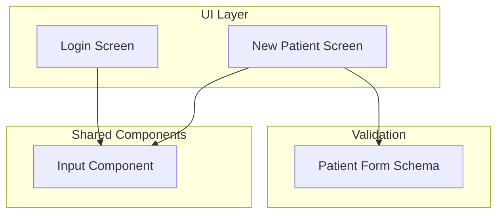
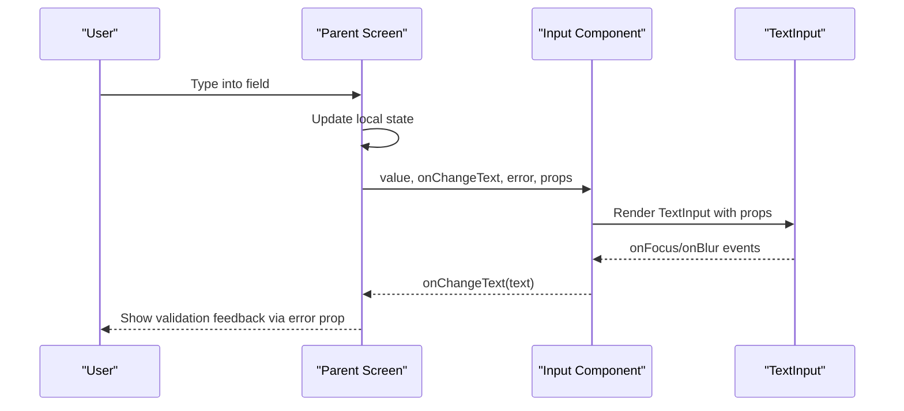
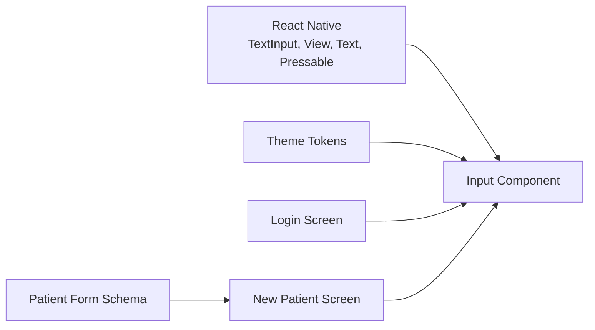

# Input Component

<cite>
**Referenced Files in This Document**
- [Input.tsx](file://src/components/ui/Input.tsx)
- [login.tsx](file://src/app/(auth)/login.tsx)
- [new.tsx](file://src/app/(app)/patients/new.tsx)
- [validation.ts](file://src/features/patients/validation.ts)
- [theme.ts](file://src/constants/theme.ts)
</cite>

## Table of Contents
1. Introduction
2. Project Structure
3. Core Components
4. Architecture Overview
5. Detailed Component Analysis
6. Dependency Analysis
7. Performance Considerations
8. Troubleshooting Guide
9. Conclusion
10. Appendices

## Introduction
This document explains the DermSight Input component used for user text entry across forms and screens. It covers all props, usage patterns (basic text, numeric input, password fields), form integration, error handling, validation feedback, accessibility considerations, and guidelines for consistent styling and UX.

## Project Structure
The Input component lives under shared UI components and is consumed by feature screens such as login and patient registration. Validation schemas are defined in a dedicated module and applied at the screen layer to provide user feedback.

**Diagram sources**
- [login.tsx:117-131](file://src/app/(auth)/login.tsx#L117-L131)
- [new.tsx:93-183](file://src/app/(app)/patients/new.tsx#L93-L183)
- [Input.tsx:8-22](file://src/components/ui/Input.tsx#L8-L22)
- [validation.ts:7-20](file://src/features/patients/validation.ts#L7-L20)

**Section sources**
- [Input.tsx:1-90](file://src/components/ui/Input.tsx#L1-L90)
- [login.tsx:1-185](file://src/app/(auth)/login.tsx#L1-L185)
- [new.tsx:1-192](file://src/app/(app)/patients/new.tsx#L1-L192)
- [validation.ts:1-23](file://src/features/patients/validation.ts#L1-L23)

## Core Components
- Input component provides a labeled, bordered text input with optional icon, secure text toggle, keyboard type, auto capitalization, multiline support, and inline error display.
- Consumed by Login and New Patient screens to capture user data consistently.

Key responsibilities:
- Render label, placeholder, and input field with focus state styling.
- Support secure text entry with show/hide toggle.
- Display validation errors below the input.
- Provide keyboard variants via keyboardType prop.

**Section sources**
- [Input.tsx:8-22](file://src/components/ui/Input.tsx#L8-L22)
- [Input.tsx:24-89](file://src/components/ui/Input.tsx#L24-L89)

## Architecture Overview
The Input component is a presentational component that receives controlled props from parent screens. Parent screens manage state and validation, then pass value, onChangeText, and error messages into Input.

**Diagram sources**
- [Input.tsx:24-89](file://src/components/ui/Input.tsx#L24-L89)
- [login.tsx:117-131](file://src/app/(auth)/login.tsx#L117-L131)
- [new.tsx:93-183](file://src/app/(app)/patients/new.tsx#L93-L183)

## Detailed Component Analysis

### Props Reference
- label: Optional string displayed above the input.
- placeholder: Optional hint shown when the input is empty.
- value: Controlled string value bound to parent state.
- onChangeText: Callback invoked with new text on each change.
- icon: Optional left-side icon rendered before the input.
- error: Optional string displayed below the input to indicate validation failure.
- secureTextEntry: Boolean to mask input; includes show/hide toggle when true.
- keyboardType: Keyboard type selector: default, numeric, email-address, phone-pad.
- autoCapitalize: Capitalization mode: none, sentences, words, characters.
- multiline: Boolean to enable multi-line input.
- numberOfLines: Number of lines for multiline inputs.
- editable: Boolean to disable editing when false.
- rightIcon: Optional right-side icon rendered after the input.

Behavioral notes:
- Focus state changes border color to primary; error state overrides to red.
- When secureTextEntry is true, a show/hide toggle appears inside the input.
- Error message is rendered below the input when provided.

**Section sources**
- [Input.tsx:8-22](file://src/components/ui/Input.tsx#L8-L22)
- [Input.tsx:42-86](file://src/components/ui/Input.tsx#L42-L86)

### Usage Examples

#### Basic Text Input
- Use cases: names, addresses, notes.
- Pattern: bind value and onChangeText to local state; optionally add label and placeholder.
- Example references:
  - First name, last name, address, notes in patient registration.

**Section sources**
- [new.tsx:93-117](file://src/app/(app)/patients/new.tsx#L93-L117)
- [new.tsx:156-183](file://src/app/(app)/patients/new.tsx#L156-L183)

#### Numeric Input
- Use cases: phone numbers, dates, codes.
- Set keyboardType to numeric or phone-pad depending on context.
- Example references:
  - Phone number using phone-pad.
  - Date of birth using default keyboard with custom placeholder.

**Section sources**
- [new.tsx:109-117](file://src/app/(app)/patients/new.tsx#L109-L117)
- [new.tsx:156-163](file://src/app/(app)/patients/new.tsx#L156-L163)

#### Password Field
- Use secureTextEntry to mask input.
- The component automatically shows a show/hide toggle when secureTextEntry is true.
- Example reference:
  - Password/PIN input in login screen.

**Section sources**
- [login.tsx:124-131](file://src/app/(auth)/login.tsx#L124-L131)
- [Input.tsx:74-83](file://src/components/ui/Input.tsx#L74-L83)

#### Form Integration Patterns
- Controlled inputs: Each Input receives value and onChangeText from parent state.
- Validation: Parent validates on submit and passes error strings to Input.
- Example references:
  - Patient registration validates required fields and sets errors per field.
  - Login validates PIN length and displays error.

**Section sources**
- [new.tsx:34-42](file://src/app/(app)/patients/new.tsx#L34-L42)
- [new.tsx:93-183](file://src/app/(app)/patients/new.tsx#L93-L183)
- [login.tsx:24-46](file://src/app/(auth)/login.tsx#L24-L46)
- [login.tsx:141-143](file://src/app/(auth)/login.tsx#L141-L143)

### Error Handling and Validation Feedback
- Inline errors: Pass an error string to the Input’s error prop to render a red message below the field.
- Border highlighting: Error state applies a red border to the input container.
- Submit-time validation: Parent screens validate and set error states before submission.
- Example references:
  - Patient registration sets field-specific errors and renders them via Input.
  - Login shows a general error message when PIN is invalid.

**Section sources**
- [Input.tsx:42-46](file://src/components/ui/Input.tsx#L42-L46)
- [Input.tsx:86-86](file://src/components/ui/Input.tsx#L86-L86)
- [new.tsx:34-42](file://src/app/(app)/patients/new.tsx#L34-L42)
- [new.tsx:93-183](file://src/app/(app)/patients/new.tsx#L93-L183)
- [login.tsx:24-46](file://src/app/(auth)/login.tsx#L24-L46)
- [login.tsx:141-143](file://src/app/(auth)/login.tsx#L141-L143)

### Accessibility Features
- Labels: Use the label prop to associate descriptive text with the input for screen readers.
- Placeholder: Provide clear placeholders to guide users when the field is empty.
- Secure text toggle: The show/hide button improves usability for password fields.
- Note: No explicit accessibilityLabel or testID props are exposed by the Input component; ensure meaningful labels and placeholders are provided by consumers.

Guidelines:
- Always provide a label for screen reader context.
- Keep placeholders concise and descriptive.
- Ensure error messages are clear and actionable.

**Section sources**
- [Input.tsx:50-52](file://src/components/ui/Input.tsx#L50-L52)
- [Input.tsx:61-63](file://src/components/ui/Input.tsx#L61-L63)
- [Input.tsx:74-83](file://src/components/ui/Input.tsx#L74-L83)

### Styling and UX Guidelines
- Consistent borders and colors:
  - Default border uses neutral tones; focus switches to primary; error switches to red.
- Spacing and layout:
  - Inputs include padding and rounded corners; multiline inputs adjust vertical spacing.
- Icons:
  - Left icons improve recognition; right icons can be used for actions like copy or clear.
- Keyboard selection:
  - Choose appropriate keyboardType to reduce friction (numeric, phone-pad).
- Auto capitalization:
  - Use none for codes/IDs; sentences or words for natural language fields.

References:
- Border and focus logic: [Input.tsx:42-46](file://src/components/ui/Input.tsx#L42-L46)
- Multiline adjustments: [Input.tsx:54-56](file://src/components/ui/Input.tsx#L54-L56)
- Theme tokens: [theme.ts:8-37](file://src/constants/theme.ts#L8-L37)

**Section sources**
- [Input.tsx:42-86](file://src/components/ui/Input.tsx#L42-L86)
- [theme.ts:8-37](file://src/constants/theme.ts#L8-L37)

## Dependency Analysis
The Input component depends on React Native primitives and uses Tailwind classes for styling. Consumers import it directly and integrate with their own state and validation.

**Diagram sources**
- [Input.tsx:5-6](file://src/components/ui/Input.tsx#L5-L6)
- [login.tsx:117-131](file://src/app/(auth)/login.tsx#L117-L131)
- [new.tsx:93-183](file://src/app/(app)/patients/new.tsx#L93-L183)
- [validation.ts:7-20](file://src/features/patients/validation.ts#L7-L20)
- [theme.ts:8-37](file://src/constants/theme.ts#L8-L37)

**Section sources**
- [Input.tsx:1-90](file://src/components/ui/Input.tsx#L1-L90)
- [login.tsx:1-185](file://src/app/(auth)/login.tsx#L1-L185)
- [new.tsx:1-192](file://src/app/(app)/patients/new.tsx#L1-L192)
- [validation.ts:1-23](file://src/features/patients/validation.ts#L1-L23)
- [theme.ts:1-74](file://src/constants/theme.ts#L1-L74)

## Performance Considerations
- Controlled inputs: Keep state updates minimal; avoid heavy computations in onChangeText.
- Debouncing: For search or live validation, consider debouncing onChange to reduce re-renders.
- Keyboard types: Selecting the correct keyboardType reduces cognitive load and improves input speed.
- Multiline inputs: Limit numberOfLines to balance readability and performance.

[No sources needed since this section provides general guidance]

## Troubleshooting Guide
Common issues and resolutions:
- No visible label: Ensure label prop is provided; screen readers rely on it for context.
- Incorrect keyboard: Verify keyboardType matches expected input (e.g., phone-pad for phone numbers).
- Secure text not masking: Confirm secureTextEntry is true; check if show/hide toggle is accidentally toggled off.
- Errors not showing: Ensure error prop is passed from parent validation; verify error string is non-empty.
- Disabled input: Check editable prop; if false, the input cannot be edited.

**Section sources**
- [Input.tsx:50-52](file://src/components/ui/Input.tsx#L50-L52)
- [Input.tsx:65-70](file://src/components/ui/Input.tsx#L65-L70)
- [Input.tsx:74-83](file://src/components/ui/Input.tsx#L74-L83)
- [Input.tsx:86-86](file://src/components/ui/Input.tsx#L86-L86)

## Conclusion
The Input component offers a consistent, accessible, and flexible text entry experience across DermSight. By combining controlled props, clear validation feedback, and thoughtful defaults (keyboard types, secure text toggle), it supports both simple and complex form scenarios. Follow the guidelines here to maintain consistency and usability throughout the application.

[No sources needed since this section summarizes without analyzing specific files]

## Appendices

### Validation Schemas and Form Integration
- Use Zod schemas to define strict validation rules for forms.
- Apply schema validation on submit and map errors to Input error props for inline feedback.

Example reference:
- Patient form schema defines required fields and formats.

**Section sources**
- [validation.ts:7-20](file://src/features/patients/validation.ts#L7-L20)
- [new.tsx:34-42](file://src/app/(app)/patients/new.tsx#L34-L42)

### Styling Tokens
- Colors and theme tokens influence border and text colors.
- Primary, error, and neutral colors are used for focus and validation states.

**Section sources**
- [theme.ts:8-37](file://src/constants/theme.ts#L8-L37)