# UI Components Library

<cite>
**Referenced Files in This Document**
- [Button.tsx](file://src/components/ui/Button.tsx)
- [Input.tsx](file://src/components/ui/Input.tsx)
- [Card.tsx](file://src/components/ui/Card.tsx)
- [Badge.tsx](file://src/components/ui/Badge.tsx)
- [EmptyState.tsx](file://src/components/ui/EmptyState.tsx)
- [ConnectivityBanner.tsx](file://src/components/ui/ConnectivityBanner.tsx)
- [Skeleton.tsx](file://src/components/ui/Skeleton.tsx)
- [ToastContainer.tsx](file://src/components/ui/ToastContainer.tsx)
- [theme.ts](file://src/constants/theme.ts)
- [riskLevels.ts](file://src/constants/riskLevels.ts)
- [toastStore.ts](file://src/features/notifications/toastStore.ts)
- [store.ts](file://src/features/theme/store.ts)
- [tailwind.config.js](file://tailwind.config.js)
- [global.css](file://global.css)
- [ABCDPanel.tsx](file://src/components/assessment/ABCDPanel.tsx)
- [ClassProbabilityList.tsx](file://src/components/assessment/ClassProbabilityList.tsx)
- [RiskTierBadge.tsx](file://src/components/assessment/RiskTierBadge.tsx)
- [AssessmentListSkeleton.tsx](file://src/components/assessment/AssessmentListSkeleton.tsx)
- [PatientListItem.tsx](file://src/components/patient/PatientListItem.tsx)
- [PatientListSkeleton.tsx](file://src/components/patient/PatientListSkeleton.tsx)
- [SyncQueueItem.tsx](file://src/components/sync/SyncQueueItem.tsx)
- [useConnectivity.ts](file://src/hooks/useConnectivity.ts)
- [_layout.tsx](file://src/app/(app)/_layout.tsx)
- [index.tsx](file://src/app/index.tsx)
- [app.json](file://app.json)
</cite>

## Update Summary
**Changes Made**
- Added comprehensive skeleton loading component system with animated placeholders for content loading states
- Implemented toast notification system with haptic feedback and theme-aware styling
- Enhanced tab navigation with improved icon sizing, focus states, and dark mode support
- Integrated theme-aware color schemes throughout the application for light/dark modes
- Added specialized skeleton components for assessment and patient lists

## Table of Contents
1. Introduction
2. Project Structure
3. Core Components
4. Architecture Overview
5. Detailed Component Analysis
6. Skeleton Loading System
7. Toast Notification System
8. Theme-Aware Design System
9. Icon System and Asset Management
10. Dependency Analysis
11. Performance Considerations
12. Troubleshooting Guide
13. Conclusion
14. Appendices

## Introduction
This document describes DermSight's reusable UI component library built with React Native, NativeWind, and Tailwind CSS. It covers each component's visual appearance, behavior, props, customization options, styling guidelines, theme configuration, responsive design principles, states, animations/transitions, accessibility, composition patterns, prop validation, error handling, cross-platform considerations, performance optimization, testing approaches, and guidance for extending or creating new components. The library now features a comprehensive skeleton loading system, toast notifications, enhanced tab navigation, and theme-aware design for optimal user experience across light and dark modes.

## Project Structure
The UI library is organized under src/components/ui for base primitives and feature-specific components under src/components/assessment, src/components/patient, and src/components/sync. Styling is centralized via Tailwind configuration and global CSS, while shared tokens live in constants. The architecture now includes skeleton loading components, toast notifications, and enhanced theme management.

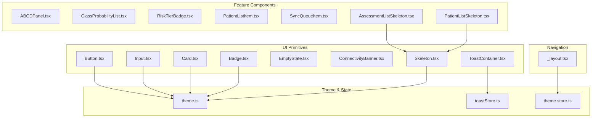

**Diagram sources**
- [Skeleton.tsx:1-63](file://src/components/ui/Skeleton.tsx#L1-L63)
- [ToastContainer.tsx:1-89](file://src/components/ui/ToastContainer.tsx#L1-L89)
- [toastStore.ts:1-46](file://src/features/notifications/toastStore.ts#L1-L46)
- [store.ts:1-67](file://src/features/theme/store.ts#L1-L67)
- [AssessmentListSkeleton.tsx:1-33](file://src/components/assessment/AssessmentListSkeleton.tsx#L1-L33)
- [PatientListSkeleton.tsx:1-33](file://src/components/patient/PatientListSkeleton.tsx#L1-L33)
- [_layout.tsx:1-126](file://src/app/(app)/_layout.tsx#L1-L126)

**Section sources**
- [tailwind.config.js:1-45](file://tailwind.config.js#L1-L45)
- [global.css:1-4](file://global.css#L1-L4)
- [theme.ts:1-74](file://src/constants/theme.ts#L1-L74)

## Core Components
This section documents the base UI primitives used across the app.

- Button
  - Visuals: Rounded container with primary, secondary, outline, and danger variants; sizes sm/md/lg; optional leading/trailing icons; full-width mode; loading state shows spinner.
  - Behavior: Pressable with disabled/loading states; text color adapts to variant; spinner color adapts to variant.
  - Props: title, onPress, variant, size, disabled, loading, icon, iconRight, style, fullWidth.
  - Customization: Use variant and size for quick styles; pass style for overrides; use fullWidth for layout control.
  - Accessibility: Uses native Pressable semantics; ensure accessible labels when using custom icons.
  - Example usage pattern: See [Button.tsx:14-101](file://src/components/ui/Button.tsx#L14-L101).

- Input
  - Visuals: Label above a bordered container with optional left/right icons; focus border uses primary; error state uses red border and message below.
  - Behavior: Controlled value via value/onChangeText; optional secure text toggle; supports keyboard types and auto capitalize; multiline support with min height.
  - Props: label, placeholder, value, onChangeText, icon, error, secureTextEntry, keyboardType, autoCapitalize, multiline, numberOfLines, editable, rightIcon.
  - Customization: Compose with icons; adjust colors via theme; extend with additional input modes if needed.
  - Accessibility: Provide label; ensure error messages are announced by screen readers (native TextInput handles this).
  - Example usage pattern: See [Input.tsx:8-90](file://src/components/ui/Input.tsx#L8-L90).

- Card
  - Visuals: White rounded container with subtle shadow and border; optional padding.
  - Behavior: Simple container; accepts className and style for further customization.
  - Props: children, style, className, padded.
  - Customization: Override className/style; remove padding by setting padded false.
  - Example usage pattern: See [Card.tsx:8-30](file://src/components/ui/Card.tsx#L8-L30).

- Badge
  - Risk tier badge: Color-coded pill based on risk level configuration; sizes sm/md/lg.
  - Status badge: Small pill indicating synced/pending/failed with distinct colors.
  - Props: riskTier + size; status + size.
  - Customization: Extend RISK_TIER_CONFIG or status config to add new tiers/statuses.
  - Example usage pattern: See [Badge.tsx:9-71](file://src/components/ui/Badge.tsx#L9-L71).

- EmptyState
  - Visuals: Centered content area with optional icon, title, description, and action slot.
  - Behavior: Displays empty list/message; action slot allows embedding buttons or links.
  - Props: icon, title, description, action.
  - Example usage pattern: See [EmptyState.tsx:8-36](file://src/components/ui/EmptyState.tsx#L8-L36).

- ConnectivityBanner
  - Visuals: Amber banner shown when offline; includes icon, short message, and explanatory text.
  - Behavior: Subscribes to connectivity hook; renders only when offline.
  - Props: None (uses internal hook).
  - Example usage pattern: See [ConnectivityBanner.tsx:9-30](file://src/components/ui/ConnectivityBanner.tsx#L9-L30).

**Section sources**
- [Button.tsx:14-101](file://src/components/ui/Button.tsx#L14-L101)
- [Input.tsx:8-90](file://src/components/ui/Input.tsx#L8-L90)
- [Card.tsx:8-30](file://src/components/ui/Card.tsx#L8-L30)
- [Badge.tsx:9-71](file://src/components/ui/Badge.tsx#L9-L71)
- [EmptyState.tsx:8-36](file://src/components/ui/EmptyState.tsx#L8-L36)
- [ConnectivityBanner.tsx:9-30](file://src/components/ui/ConnectivityBanner.tsx#L9-L30)

## Architecture Overview
The UI layer composes primitives into feature components. Styling is driven by Tailwind classes configured in tailwind.config.js and extended via global CSS. Shared tokens (colors, fonts, spacing) are defined in theme.ts and consumed by both Tailwind and components. Data-driven components like badges and panels rely on constants from riskLevels.ts and types from index.ts. The architecture now includes skeleton loading components, toast notifications, and enhanced theme management with system preference detection.

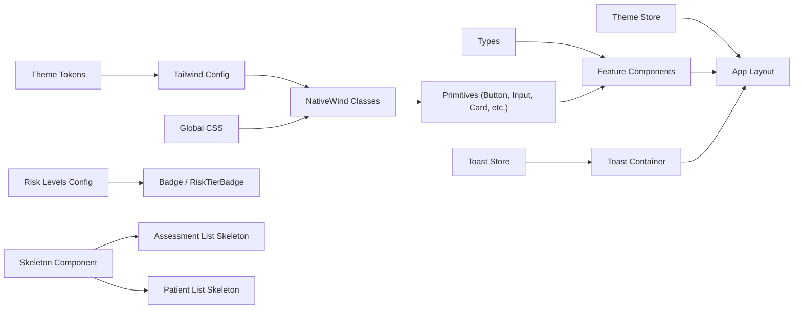

**Diagram sources**
- [tailwind.config.js:1-45](file://tailwind.config.js#L1-L45)
- [global.css:1-4](file://global.css#L1-L4)
- [theme.ts:1-74](file://src/constants/theme.ts#L1-L74)
- [toastStore.ts:1-46](file://src/features/notifications/toastStore.ts#L1-L46)
- [store.ts:1-67](file://src/features/theme/store.ts#L1-L67)
- [Skeleton.tsx:1-63](file://src/components/ui/Skeleton.tsx#L1-L63)
- [AssessmentListSkeleton.tsx:1-33](file://src/components/assessment/AssessmentListSkeleton.tsx#L1-L33)
- [PatientListSkeleton.tsx:1-33](file://src/components/patient/PatientListSkeleton.tsx#L1-L33)

## Detailed Component Analysis

### Button
- Appearance: Rounded button with four variants and three sizes; supports full width; displays spinner when loading.
- Behavior: Disables interaction when disabled or loading; toggles between icon/text and spinner.
- Props: title, onPress, variant, size, disabled, loading, icon, iconRight, style, fullWidth.
- States: default, hover/press (via Pressable), disabled, loading.
- Animations/Transitions: None explicitly; relies on platform defaults.
- Accessibility: Uses native Pressable; ensure meaningful titles and avoid redundant aria-labels.
- Composition: Wrap icons inside icon/iconRight slots; combine with Card for grouped actions.
- Example usage pattern: See [Button.tsx:14-101](file://src/components/ui/Button.tsx#L14-L101).

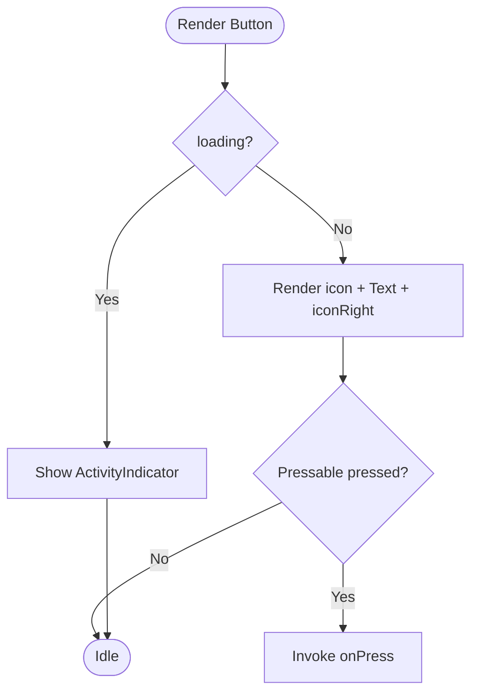

**Diagram sources**
- [Button.tsx:27-101](file://src/components/ui/Button.tsx#L27-L101)

**Section sources**
- [Button.tsx:14-101](file://src/components/ui/Button.tsx#L14-L101)

### Input
- Appearance: Labeled text input with optional left/right icons; dynamic border color based on focus/error; password visibility toggle.
- Behavior: Controlled input; supports multiple keyboard types; multiline mode with minimum height; editable flag.
- Props: label, placeholder, value, onChangeText, icon, error, secureTextEntry, keyboardType, autoCapitalize, multiline, numberOfLines, editable, rightIcon.
- States: default, focused, error, disabled (editable=false).
- Animations/Transitions: None explicit; focus changes border color.
- Accessibility: Label provided; error text displayed; secure text toggle has visible label.
- Composition: Combine with Card for form sections; use EmptyState for no-data scenarios.
- Example usage pattern: See [Input.tsx:8-90](file://src/components/ui/Input.tsx#L8-L90).

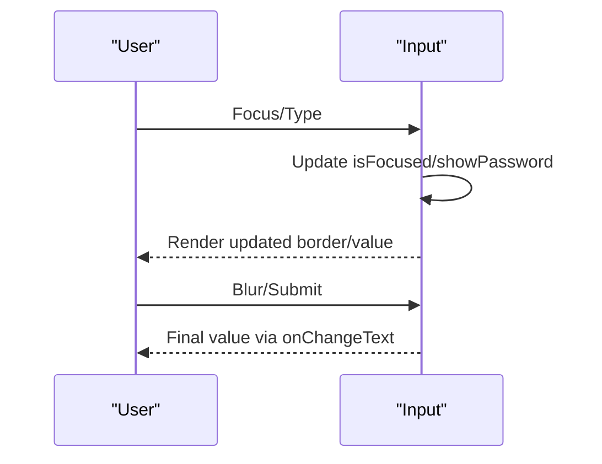

**Diagram sources**
- [Input.tsx:24-90](file://src/components/ui/Input.tsx#L24-L90)

**Section sources**
- [Input.tsx:8-90](file://src/components/ui/Input.tsx#L8-L90)

### Card
- Appearance: White card with rounded corners, subtle shadow, and border; optional padding.
- Behavior: Container that passes through className/style; flexible for any content.
- Props: children, style, className, padded.
- Example usage pattern: See [Card.tsx:8-30](file://src/components/ui/Card.tsx#L8-L30).

**Section sources**
- [Card.tsx:8-30](file://src/components/ui/Card.tsx#L8-L30)

### Badge
- Risk Tier Badge
  - Appearance: Pill with background and text color derived from risk level configuration.
  - Props: riskTier, size.
  - Example usage pattern: See [Badge.tsx:9-42](file://src/components/ui/Badge.tsx#L9-L42).
- Status Badge
  - Appearance: Small pill for sync statuses (synced/pending/failed).
  - Props: status, size.
  - Example usage pattern: See [Badge.tsx:44-71](file://src/components/ui/Badge.tsx#L44-L71).

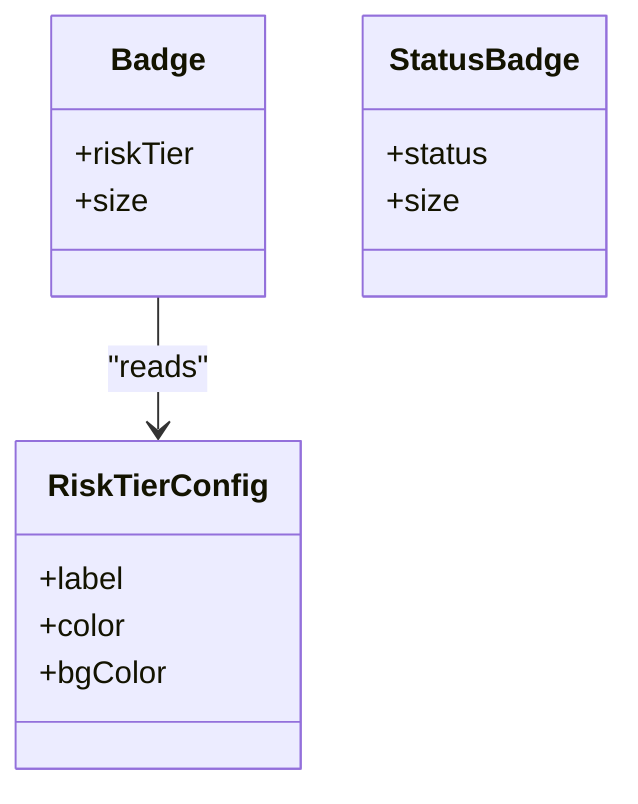

**Diagram sources**
- [Badge.tsx:9-71](file://src/components/ui/Badge.tsx#L9-L71)
- [riskLevels.ts:19-49](file://src/constants/riskLevels.ts#L19-L49)

**Section sources**
- [Badge.tsx:9-71](file://src/components/ui/Badge.tsx#L9-L71)
- [riskLevels.ts:19-49](file://src/constants/riskLevels.ts#L19-L49)

### EmptyState
- Appearance: Centered layout with optional icon, title, description, and action slot.
- Props: icon, title, description, action.
- Example usage pattern: See [EmptyState.tsx:8-36](file://src/components/ui/EmptyState.tsx#L8-L36).

**Section sources**
- [EmptyState.tsx:8-36](file://src/components/ui/EmptyState.tsx#L8-L36)

### ConnectivityBanner
- Appearance: Amber banner with icon and two-line message.
- Behavior: Renders only when offline; uses connectivity hook.
- Props: None.
- Example usage pattern: See [ConnectivityBanner.tsx:9-30](file://src/components/ui/ConnectivityBanner.tsx#L9-L30).

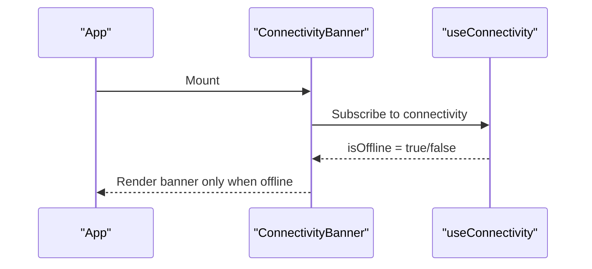

**Diagram sources**
- [ConnectivityBanner.tsx:9-30](file://src/components/ui/ConnectivityBanner.tsx#L9-L30)
- [useConnectivity.ts:8-17](file://src/hooks/useConnectivity.ts#L8-L17)

**Section sources**
- [ConnectivityBanner.tsx:9-30](file://src/components/ui/ConnectivityBanner.tsx#L9-L30)
- [useConnectivity.ts:8-17](file://src/hooks/useConnectivity.ts#L8-L17)

### Feature Components

#### ABCDPanel
- Purpose: Displays four clinical indicators (Asymmetry, Border, Color, Diameter) as progress bars with percentage values and threshold-based colors.
- Props: scores object with asymmetry, border, color, diameter numbers.
- Behavior: Maps scores to percentages; colors change based on thresholds.
- Example usage pattern: See [ABCDPanel.tsx:10-68](file://src/components/assessment/ABCDPanel.tsx#L10-L68).

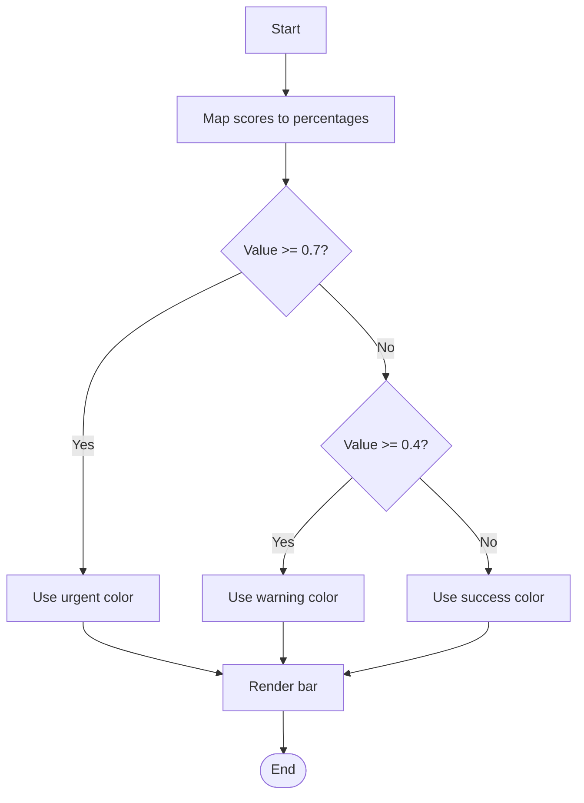

**Diagram sources**
- [ABCDPanel.tsx:19-68](file://src/components/assessment/ABCDPanel.tsx#L19-L68)

**Section sources**
- [ABCDPanel.tsx:10-68](file://src/components/assessment/ABCDPanel.tsx#L10-L68)

#### ClassProbabilityList
- Purpose: Collapsible list showing probabilities across all diagnostic classes, highlighting the predicted class.
- Props: classProbabilities map and predictedClass.
- Behavior: Sorts classes by probability; toggles expanded view; highlights predicted class.
- Example usage pattern: See [ClassProbabilityList.tsx:10-83](file://src/components/assessment/ClassProbabilityList.tsx#L10-L83).

**Section sources**
- [ClassProbabilityList.tsx:10-83](file://src/components/assessment/ClassProbabilityList.tsx#L10-L83)

#### RiskTierBadge
- Purpose: Prominent display of risk tier with optional action text.
- Props: riskTier, showAction.
- Behavior: Reads configuration for label, colors, and optional action text.
- Example usage pattern: See [RiskTierBadge.tsx:10-40](file://src/components/assessment/RiskTierBadge.tsx#L10-L40).

**Section sources**
- [RiskTierBadge.tsx:10-40](file://src/components/assessment/RiskTierBadge.tsx#L10-L40)

#### PatientListItem
- Purpose: Row representing a patient with avatar, name, metadata, and sync status badge.
- Props: patient, lastAssessmentDate, onPress.
- Behavior: Computes initials, age, sex label; formats date; renders StatusBadge.
- Example usage pattern: See [PatientListItem.tsx:11-52](file://src/components/patient/PatientListItem.tsx#L11-L52).

**Section sources**
- [PatientListItem.tsx:11-52](file://src/components/patient/PatientListItem.tsx#L11-L52)

#### SyncQueueItem
- Purpose: Displays a single sync queue entry with status and retry action when failed.
- Props: item, onRetry.
- Behavior: Maps status to color/background/label; conditionally shows retry.
- Example usage pattern: See [SyncQueueItem.tsx:10-55](file://src/components/sync/SyncQueueItem.tsx#L10-L55).

**Section sources**
- [SyncQueueItem.tsx:10-55](file://src/components/sync/SyncQueueItem.tsx#L10-L55)

## Skeleton Loading System

### Skeleton Component
- Purpose: Provides smooth animated placeholders for content loading states with multiple visual variants.
- Visuals: Animated opacity transitions with slate-colored backgrounds that adapt to light/dark themes; supports circle, rect, and line variants.
- Behavior: Uses react-native-reanimated for smooth 800ms opacity animations between 0.35 and 0.7; infinite repeating animation cycle.
- Props: width, height, variant ("circle" | "rect" | "line"), className, style.
- Customization: Extend variantClasses for new shapes; customize animation timing via useEffect hooks.
- Theme Integration: Automatically adapts to light mode (slate-200) and dark mode (slate-850) backgrounds.

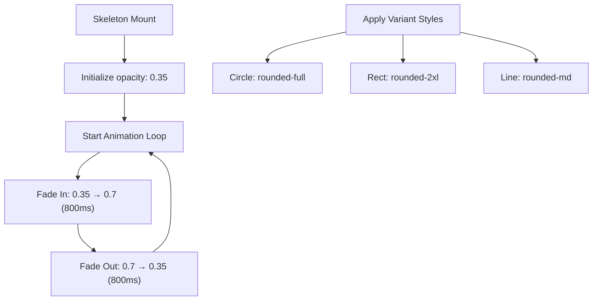

**Diagram sources**
- [Skeleton.tsx:26-47](file://src/components/ui/Skeleton.tsx#L26-L47)

**Section sources**
- [Skeleton.tsx:1-63](file://src/components/ui/Skeleton.tsx#L1-L63)

### AssessmentListSkeleton
- Purpose: Specialized skeleton for assessment list items with structured layout placeholders.
- Visuals: Two-column layout with info lines on the left and status badge placeholder on the right.
- Behavior: Renders configurable number of skeleton rows (default 3); mimics actual assessment list structure.
- Props: count (number of skeleton rows to display).
- Usage: Replace assessment list during data loading states.

**Section sources**
- [AssessmentListSkeleton.tsx:1-33](file://src/components/assessment/AssessmentListSkeleton.tsx#L1-L33)

### PatientListSkeleton
- Purpose: Specialized skeleton for patient list items with avatar and information placeholders.
- Visuals: Three-section layout with circular avatar placeholder, two-line text content, and status badge.
- Behavior: Renders configurable number of skeleton rows (default 4); matches patient list item structure.
- Props: count (number of skeleton rows to display).
- Usage: Replace patient list during data loading states.

**Section sources**
- [PatientListSkeleton.tsx:1-33](file://src/components/patient/PatientListSkeleton.tsx#L1-L33)

## Toast Notification System

### ToastContainer
- Purpose: Centralized notification system providing user feedback with haptic feedback and animations.
- Visuals: Positioned at top of screen with slide-in/up animations; type-specific color schemes (success=green, error=red, warning=orange, info=blue).
- Behavior: Manages toast lifecycle with auto-dismiss after 4 seconds; supports manual dismissal via close button; integrates haptic feedback.
- Props: None (consumes state from toastStore).
- Theme Integration: Full dark mode support with appropriate color contrasts.

### Toast Store
- Purpose: Global state management for toast notifications using Zustand.
- Features: Auto-generated unique IDs, automatic cleanup after timeout, type-safe toast creation with helper functions.
- API: showToast(message, type), hideToast(id), toast.success(), toast.error(), toast.warning(), toast.info().
- Integration: Seamlessly integrated throughout the application for consistent user feedback.

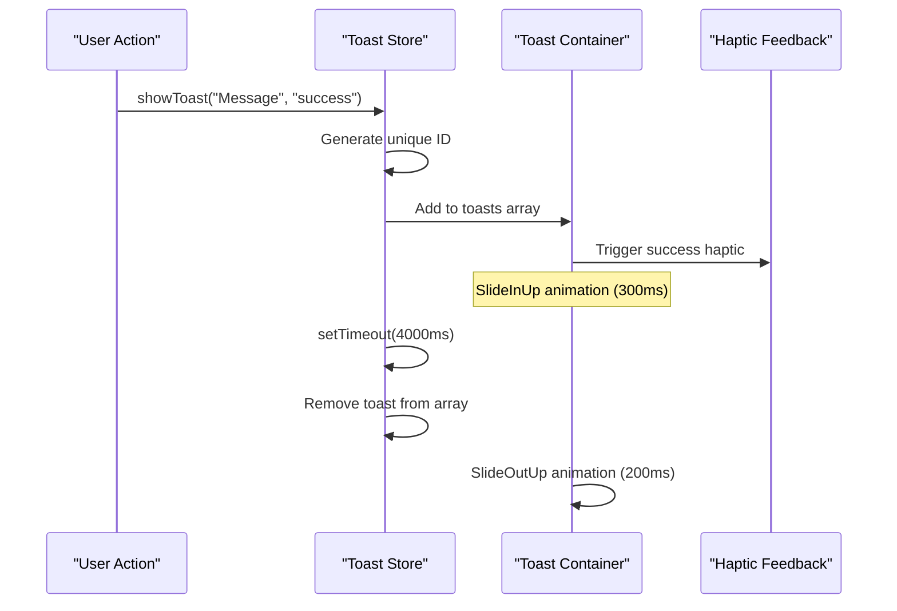

**Diagram sources**
- [toastStore.ts:17-37](file://src/features/notifications/toastStore.ts#L17-L37)
- [ToastContainer.tsx:22-88](file://src/components/ui/ToastContainer.tsx#L22-L88)

**Section sources**
- [ToastContainer.tsx:1-89](file://src/components/ui/ToastContainer.tsx#L1-L89)
- [toastStore.ts:1-46](file://src/features/notifications/toastStore.ts#L1-L46)

## Theme-Aware Design System

### Theme Store
- Purpose: Centralized theme management supporting light, dark, and system preferences with persistence.
- Features: Automatic system theme detection, persistent storage via SecureStore/localStorage, real-time theme switching.
- Integration: Used throughout the application for consistent theming including tab navigation, skeletons, and toasts.

### Tab Navigation Enhancement
- Visuals: Improved icon sizing (24x24px), dynamic color adaptation for active/inactive states, proper dark mode support.
- Behavior: Context-aware icon rendering with tintColor adjustments based on resolved theme state.
- Implementation: Custom TabIcon component with proper image handling and focus state management.

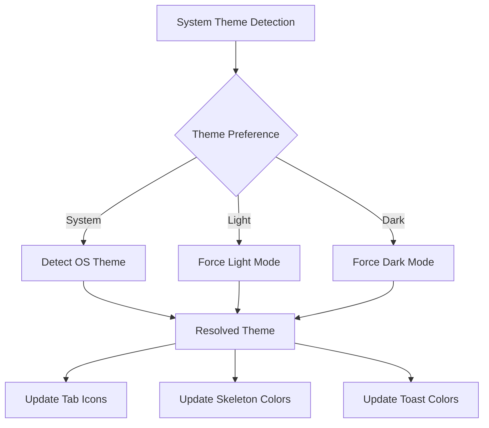

**Diagram sources**
- [store.ts:35-67](file://src/features/theme/store.ts#L35-L67)
- [_layout.tsx:17-43](file://src/app/(app)/_layout.tsx#L17-L43)

**Section sources**
- [store.ts:1-67](file://src/features/theme/store.ts#L1-L67)
- [_layout.tsx:1-126](file://src/app/(app)/_layout.tsx#L1-L126)

## Icon System and Asset Management

### Tab Navigation Icons
The tab navigation system has been enhanced with dedicated PNG icons for each tab, providing consistent visual appearance across iOS and Android platforms. Each tab now uses a custom TabIcon component that renders PNG images with opacity-based focus states.

- Tab Icons: Home, Patients, Assessments, Settings
- Implementation: Custom TabIcon component with Image component from expo-image
- Styling: Opacity transitions for focused/unfocused states with consistent sizing
- Assets: Located in assets/icons/tab-*.png format

### Feature Card Icons
Feature cards in the onboarding flow now use high-quality PNG icons instead of emojis, providing better visual consistency and brand alignment.

- Feature Icons: AI chip, offline cloud, upload cloud
- Implementation: FeatureCard component with proper image rendering
- Styling: Consistent 24x24 sizing with contentFit="contain"
- Assets: Located in assets/icons/ directory

### Permission Row Icons
Permission rows utilize dedicated PNG icons for camera, photos/storage, and location permissions, improving clarity and professionalism.

- Permission Icons: Camera, image, location pin
- Implementation: PermissionRow component with proper image handling
- Styling: Gray background containers with centered icon placement
- Assets: Located in assets/icons/ directory

### Splash Screen Enhancements
The splash screen configuration has been updated with improved image handling and adaptive icon support for both iOS and Android platforms.

- Configuration: Enhanced app.json with proper splash screen settings
- Adaptive Icons: Separate foreground, background, and monochrome images for Android
- iOS Support: Proper icon configuration for iOS devices
- Web Support: Favicon configuration for web builds

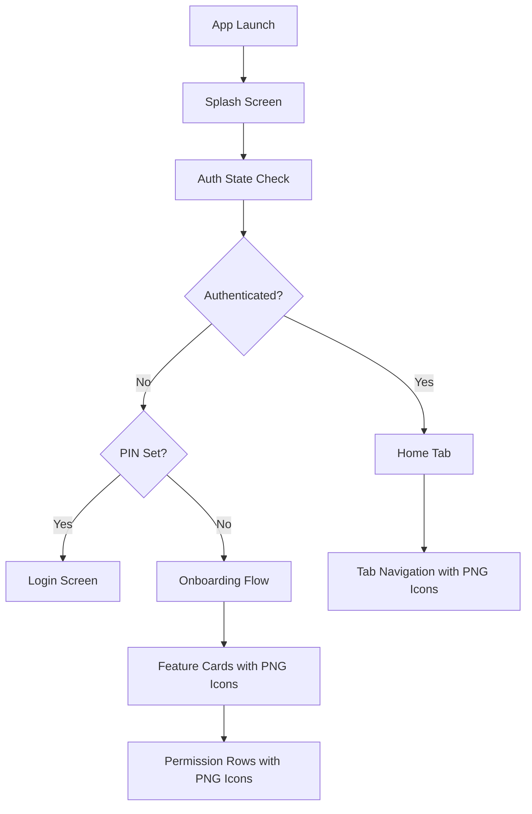

**Diagram sources**
- [index.tsx:22-49](file://src/app/index.tsx#L22-L49)
- [_layout.tsx:55-102](file://src/app/(app)/_layout.tsx#L55-L102)
- [index.tsx:107-154](file://src/app/index.tsx#L107-L154)

**Section sources**
- [_layout.tsx:11-34](file://src/app/(app)/_layout.tsx#L11-L34)
- [_layout.tsx:55-102](file://src/app/(app)/_layout.tsx#L55-L102)
- [index.tsx:197-248](file://src/app/index.tsx#L197-L248)
- [app.json:10-27](file://app.json#L10-L27)

## Dependency Analysis
- Styling dependencies: All components use Tailwind classes compiled via NativeWind; theme colors and fonts are extended in tailwind.config.js and referenced globally via global.css.
- Token dependencies: Badges and risk-related components depend on riskLevels.ts for consistent labeling and colors.
- Hook dependencies: ConnectivityBanner depends on useConnectivity for real-time network state.
- Type dependencies: Feature components consume shared types from index.ts for consistency across screens.
- Icon dependencies: Tab navigation and feature components depend on PNG assets in assets/icons directory for consistent visual presentation.
- **New Dependencies**: Skeleton components depend on react-native-reanimated for animations; Toast system depends on expo-haptics for tactile feedback.

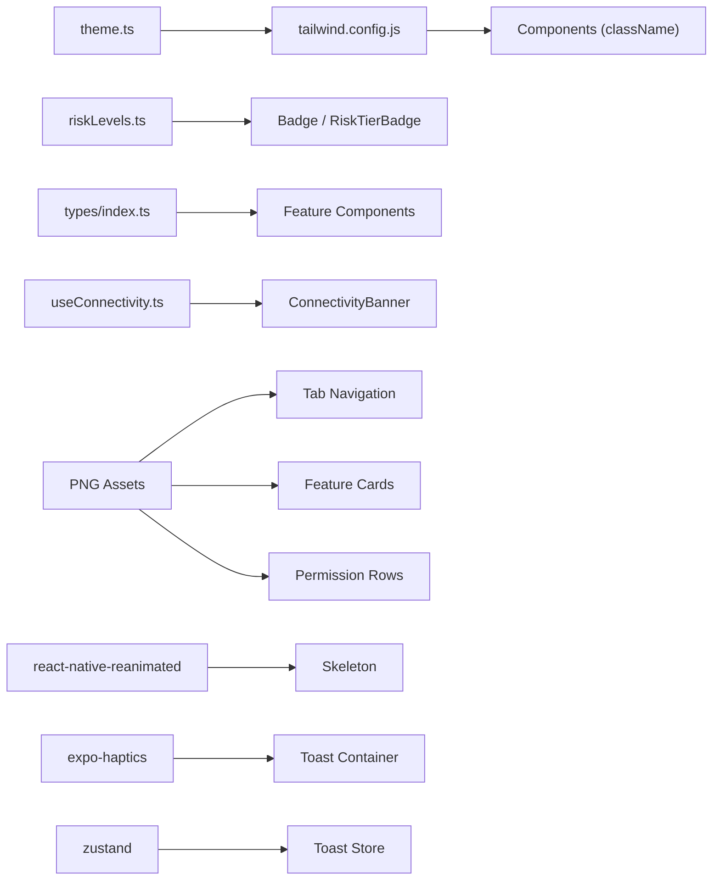

**Diagram sources**
- [tailwind.config.js:1-45](file://tailwind.config.js#L1-L45)
- [theme.ts:1-74](file://src/constants/theme.ts#L1-L74)
- [riskLevels.ts:1-121](file://src/constants/riskLevels.ts#L1-L121)
- [useConnectivity.ts:1-18](file://src/hooks/useConnectivity.ts#L1-L18)
- [Skeleton.tsx:3-9](file://src/components/ui/Skeleton.tsx#L3-L9)
- [ToastContainer.tsx:3-5](file://src/components/ui/ToastContainer.tsx#L3-L5)
- [toastStore.ts:1](file://src/features/notifications/toastStore.ts#L1)

**Section sources**
- [tailwind.config.js:1-45](file://tailwind.config.js#L1-L45)
- [theme.ts:1-74](file://src/constants/theme.ts#L1-L74)
- [riskLevels.ts:1-121](file://src/constants/riskLevels.ts#L1-L121)
- [useConnectivity.ts:1-18](file://src/hooks/useConnectivity.ts#L1-L18)

## Performance Considerations
- Prefer functional components and memoization where lists render frequently (e.g., ClassProbabilityList items).
- Avoid unnecessary re-renders by keeping state local to components and lifting minimal state up.
- Use Tailwind utility classes to minimize custom style computations.
- For long lists, consider virtualization at the screen level; keep components lightweight.
- Defer heavy operations off the main thread; use hooks like useDebounce for search inputs if added later.
- **Icon Optimization**: PNG icons are pre-optimized for mobile display; use contentFit="contain" for proper scaling without distortion.
- **Asset Loading**: Leverage expo-image for efficient image loading and caching across the application.
- **Animation Performance**: Skeleton animations use react-native-reanimated for smooth 60fps performance; toast animations are optimized for quick transitions.
- **Memory Management**: Toast store automatically cleans up old toasts; skeleton components are lightweight and don't maintain complex state.

## Troubleshooting Guide
- Connectivity issues: ConnectivityBanner will appear when offline; verify useConnectivity subscription and netinfo integration.
- Input errors: Ensure error prop is set and onChangeText updates value; confirm keyboard type matches expected input.
- Badge misconfiguration: Verify riskTier/status values match configured keys; extend configs if adding new states.
- Loading states: Button disables interactions during loading; ensure async handlers resolve to clear loading state.
- **Icon Display Issues**: Ensure PNG files are properly sized (24x24 recommended) and located in correct asset directories; verify file paths in require statements.
- **Tab Navigation Problems**: Check that tab icon files exist and are properly referenced; verify TabIcon component receives correct props.
- **Splash Screen Issues**: Verify app.json configuration matches actual asset locations; ensure splash images are properly formatted.
- **Skeleton Animation Issues**: Ensure react-native-reanimated is properly configured; check that width/height props are valid DimensionValue types.
- **Toast Display Issues**: Verify ToastContainer is mounted in app layout; check toastStore initialization and ensure proper imports.
- **Theme Switching Issues**: Confirm theme store is initialized before use; verify system theme detection is working correctly.

**Section sources**
- [ConnectivityBanner.tsx:9-30](file://src/components/ui/ConnectivityBanner.tsx#L9-L30)
- [useConnectivity.ts:8-17](file://src/hooks/useConnectivity.ts#L8-L17)
- [Input.tsx:8-90](file://src/components/ui/Input.tsx#L8-L90)
- [Badge.tsx:9-71](file://src/components/ui/Badge.tsx#L9-L71)
- [Button.tsx:14-101](file://src/components/ui/Button.tsx#L14-L101)
- [_layout.tsx:55-102](file://src/app/(app)/_layout.tsx#L55-L102)
- [index.tsx:107-154](file://src/app/index.tsx#L107-L154)
- [app.json:10-27](file://app.json#L10-L27)
- [Skeleton.tsx:11-17](file://src/components/ui/Skeleton.tsx#L11-L17)
- [ToastContainer.tsx:7-19](file://src/components/ui/ToastContainer.tsx#L7-L19)
- [store.ts:52-57](file://src/features/theme/store.ts#L52-L57)

## Conclusion
DermSight's UI component library provides a cohesive set of primitives and feature components styled with NativeWind and Tailwind CSS. The enhanced skeleton loading system offers smooth animated placeholders for better user experience during data loading, while the toast notification system provides consistent user feedback with haptic feedback and theme-aware styling. The improved tab navigation with PNG icons and enhanced theme management ensures a polished, professional interface across light and dark modes. The design system leverages shared tokens and configuration for consistency across platforms, with robust performance optimizations and comprehensive accessibility support.

## Appendices

### Styling Guidelines and Theme Customization
- Colors and tokens: Extend or override colors in tailwind.config.js; reference theme tokens from theme.ts for platform-specific fonts and spacing.
- Global styles: Import global.css to enable Tailwind directives.
- Consistency: Use predefined variants and sizes for Buttons and Badges; prefer className over inline styles for maintainability.
- **Icon Guidelines**: Use PNG icons sized at 24x24 pixels for optimal display; maintain consistent visual weight and style across all icons.
- **Skeleton Styling**: Customize skeleton appearance via className prop; extend variantClasses for new shapes; adjust animation timing in useEffect hooks.
- **Toast Customization**: Modify typeConfig in ToastContainer for custom colors and icons; extend toastStore for additional toast types.

**Section sources**
- [tailwind.config.js:1-45](file://tailwind.config.js#L1-L45)
- [global.css:1-4](file://global.css#L1-L4)
- [theme.ts:1-74](file://src/constants/theme.ts#L1-L74)
- [Skeleton.tsx:43-47](file://src/components/ui/Skeleton.tsx#L43-L47)
- [ToastContainer.tsx:44-69](file://src/components/ui/ToastContainer.tsx#L44-L69)

### Responsive Design Principles
- Use Tailwind utilities for spacing and sizing; components adapt to different screen sizes via relative units and flex layouts.
- Keep critical information within safe areas; consider platform insets from theme.ts for bottom tabs on iOS vs Android.
- **Icon Responsiveness**: PNG icons scale appropriately across different screen densities using contentFit="contain" property.
- **Skeleton Responsiveness**: Skeleton components accept percentage widths and fixed heights for flexible layouts.
- **Toast Responsiveness**: Toast notifications adapt to screen width with proper margins and positioning.

**Section sources**
- [theme.ts:62-74](file://src/constants/theme.ts#L62-L74)
- [Skeleton.tsx:12-13](file://src/components/ui/Skeleton.tsx#L12-L13)
- [ToastContainer.tsx:11-14](file://src/components/ui/ToastContainer.tsx#L11-L14)

### Accessibility Features
- Keyboard navigation: Native components handle focus and activation; ensure logical tab order in composed screens.
- Screen reader support: Provide descriptive labels and error messages; avoid relying solely on color for meaning (complement with text/icons).
- **Icon Accessibility**: Ensure icons have appropriate alt text or labels when used in interactive contexts; maintain sufficient contrast ratios for icon visibility.
- **Skeleton Accessibility**: Skeleton components provide visual loading feedback but should be paired with proper loading states for screen readers.
- **Toast Accessibility**: Toast notifications include semantic roles and are announced by screen readers; ensure messages are descriptive and actionable.

**Section sources**
- [Input.tsx:24-90](file://src/components/ui/Input.tsx#L24-L90)
- [Button.tsx:27-101](file://src/components/ui/Button.tsx#L27-L101)
- [ToastContainer.tsx:73-86](file://src/components/ui/ToastContainer.tsx#L73-L86)

### Cross-Platform Compatibility
- Fonts and spacing: Platform.select in theme.ts ensures appropriate defaults on iOS, Android, and web.
- Inset handling: BottomTabInset accounts for platform differences in tab bar spacing.
- **Icon Compatibility**: PNG icons provide consistent appearance across iOS, Android, and web platforms; adaptive icons configured separately for Android.
- **Splash Screen**: Enhanced configuration supports platform-specific splash screen behaviors and adaptive icon rendering.
- **Animation Compatibility**: Skeleton animations use react-native-reanimated which provides consistent performance across platforms.
- **Haptic Feedback**: Toast system gracefully handles missing haptic feedback on web or simulated environments.

**Section sources**
- [theme.ts:41-74](file://src/constants/theme.ts#L41-L74)
- [app.json:10-27](file://app.json#L10-L27)
- [ToastContainer.tsx:25-42](file://src/components/ui/ToastContainer.tsx#L25-L42)

### Testing Approaches
- Unit tests: Assert component rendering and prop behaviors (e.g., Button loading/disabled states, Input focus/error visuals).
- Integration tests: Validate flows like ConnectivityBanner visibility based on network state.
- Snapshot tests: Capture UI structure for primitives and feature components to detect regressions.
- **Icon Testing**: Verify icon rendering across different screen sizes and orientations; test icon loading performance and error handling.
- **Skeleton Testing**: Test skeleton animation triggers and variant rendering; verify responsive behavior with different dimensions.
- **Toast Testing**: Validate toast creation, auto-dismiss functionality, and haptic feedback integration; test theme switching effects.

### Extending and Creating New Components
- Follow established patterns: Define TypeScript interfaces for props; use Tailwind classes for styling; compose primitives to build complex UI.
- Centralize tokens: Add new colors or sizes to tailwind.config.js and theme.ts; update riskLevels.ts for domain-specific configurations.
- Maintain consistency: Reuse existing components (Button, Input, Card, Badge) to ensure uniform behavior and appearance.
- **Icon Integration**: Create new PNG icons following established naming conventions (tab-*, feature-*); integrate with existing components using Image component from expo-image.
- **Asset Management**: Organize icons in appropriate directories (assets/icons/, assets/bottom-tab-icons/) with consistent naming and sizing standards.
- **Skeleton Extension**: Add new skeleton variants by extending variantClasses; create specialized skeleton components for common layouts.
- **Toast Extension**: Add new toast types by extending ToastType and typeConfig; implement custom haptic feedback patterns.

**Section sources**
- [tailwind.config.js:1-45](file://tailwind.config.js#L1-L45)
- [theme.ts:1-74](file://src/constants/theme.ts#L1-L74)
- [riskLevels.ts:1-121](file://src/constants/riskLevels.ts#L1-L121)
- [Skeleton.tsx:43-47](file://src/components/ui/Skeleton.tsx#L43-L47)
- [toastStore.ts:3-9](file://src/features/notifications/toastStore.ts#L3-L9)
- [ToastContainer.tsx:44-69](file://src/components/ui/ToastContainer.tsx#L44-L69)